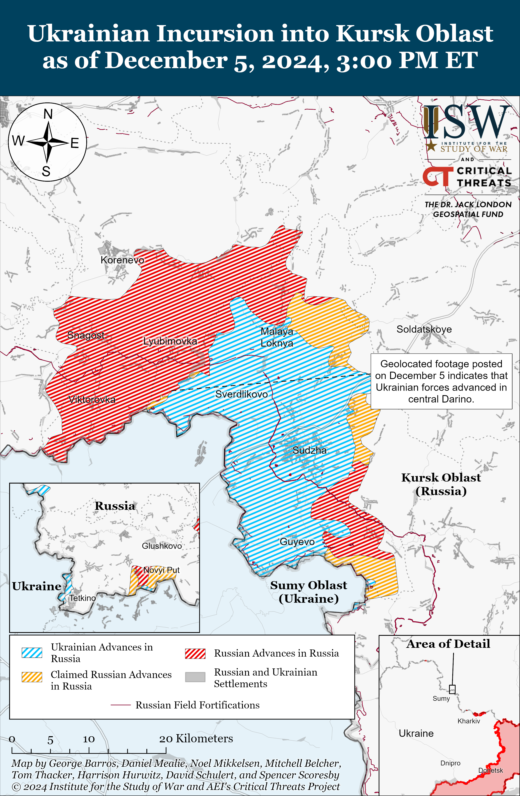
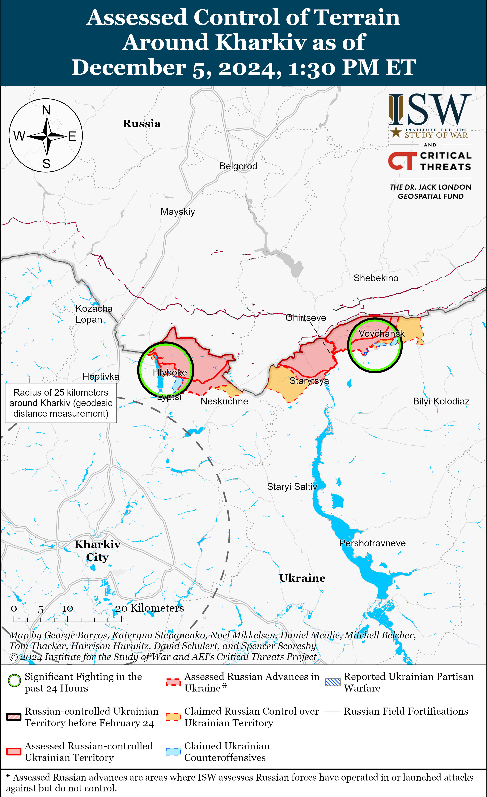
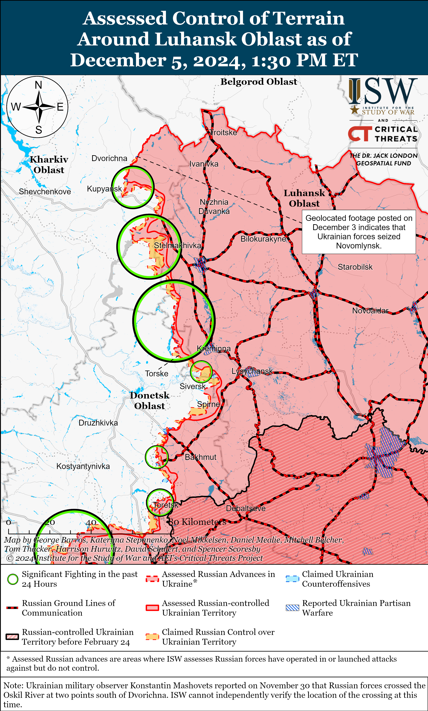
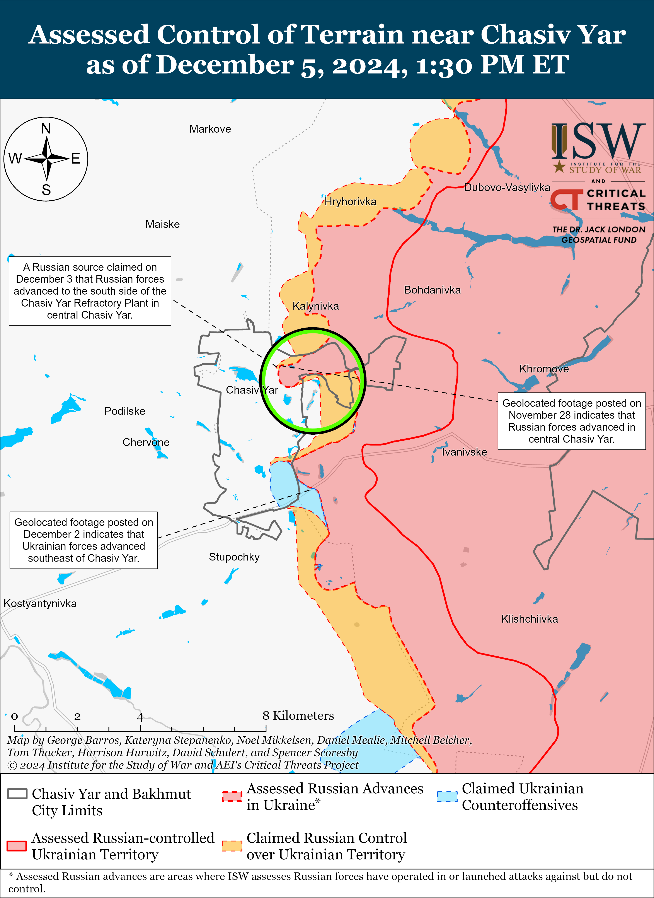
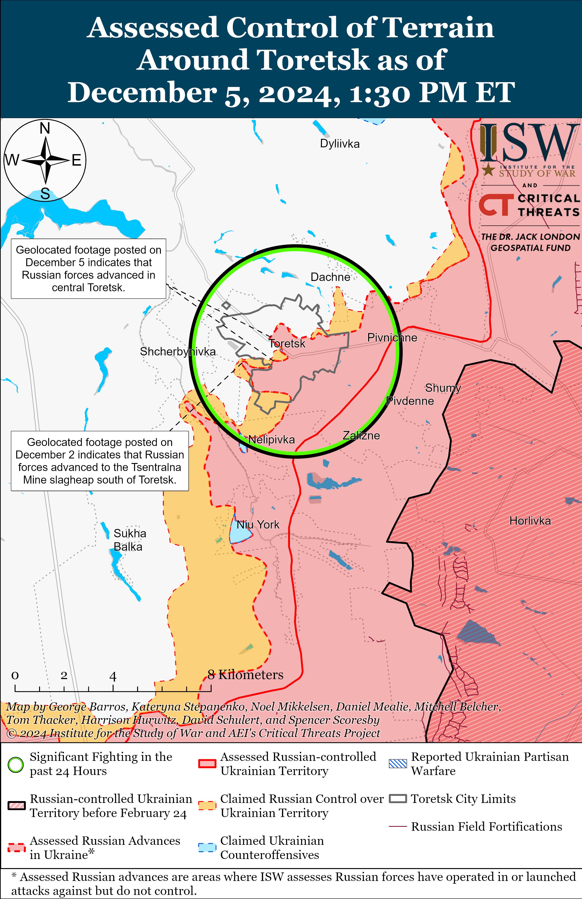
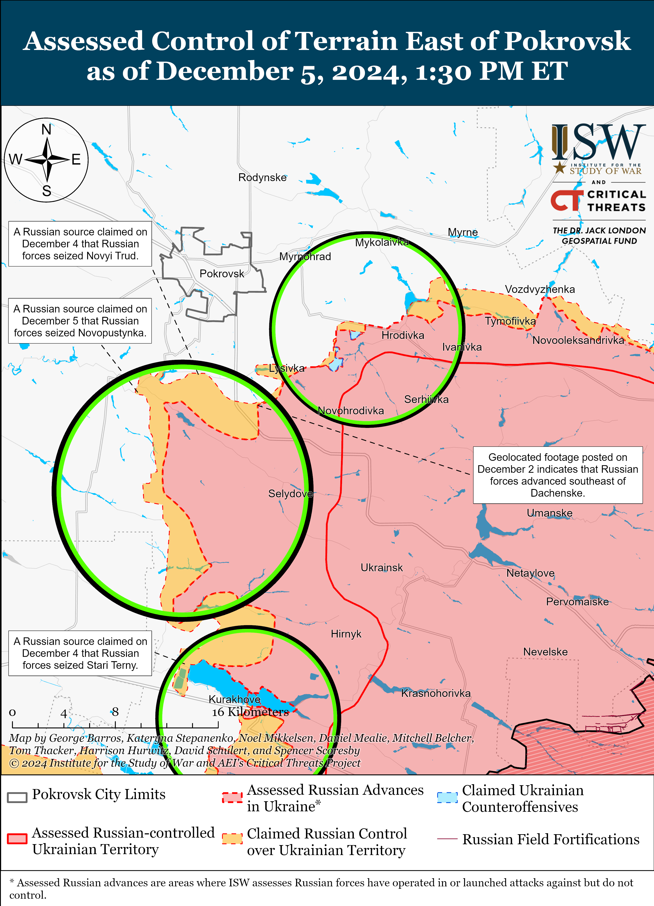
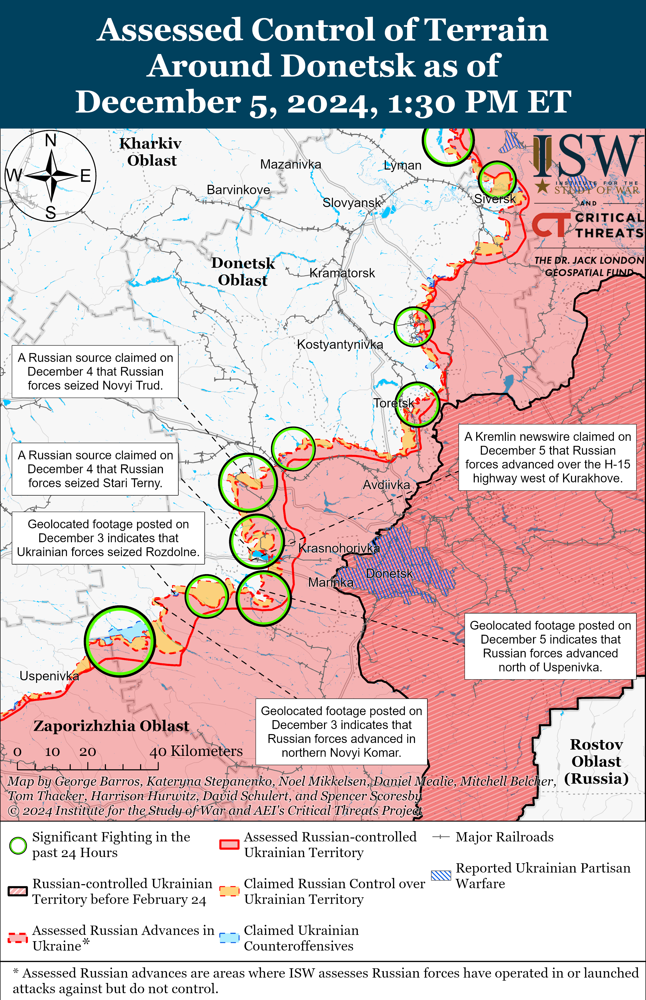
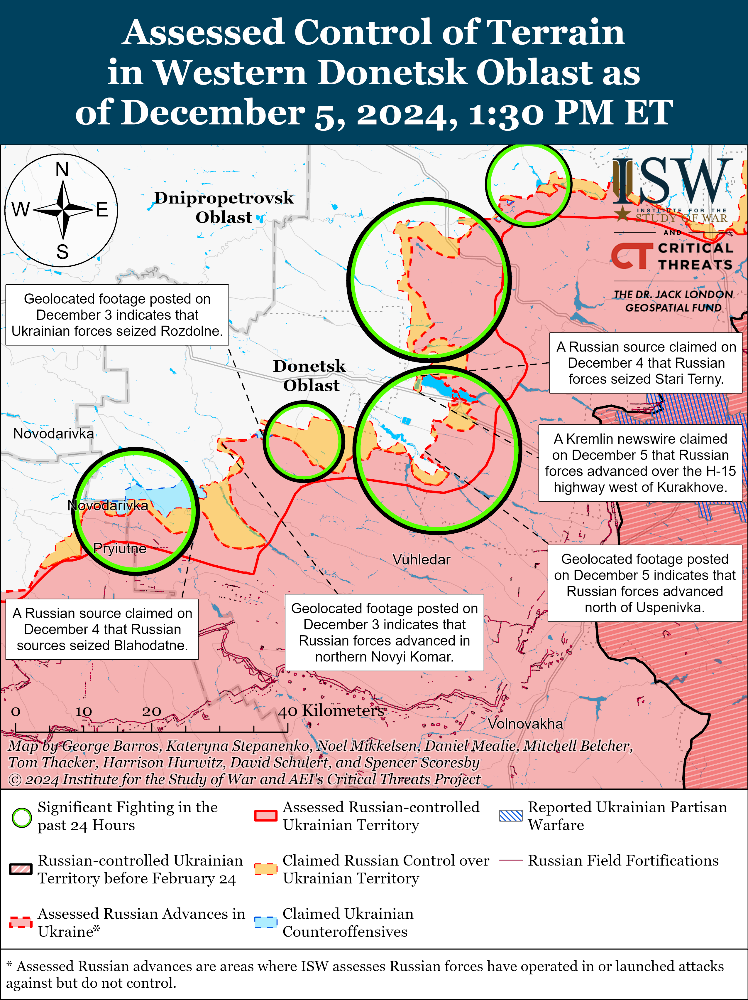
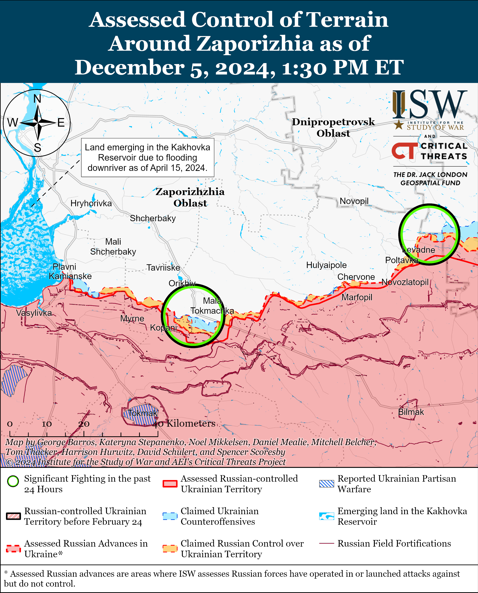
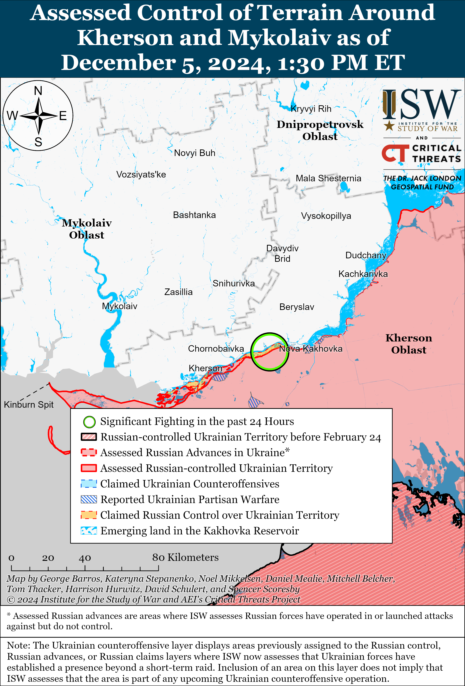

# Russian Offensive Campaign Assessment, December 5, 2024

**Angelica Evans, Grace Mappes, Nicole Wolkov, Olivia Gibson, Nate, Trotter, William Runkel, and George Barros**

**December 5, 2024, 6:30pm ET**

**Click** [**here**](https://storymaps.arcgis.com/stories/36a7f6a6f5a9448496de641cf64bd375) **to see ISW’s interactive map of the Russian invasion of Ukraine and** [**here**](https://isw.pub/KurskIncursionMap2024) **to see ISW’s interactive map of the Ukrainian incursion into Kursk Oblast. These maps are updated daily alongside the static maps present in this report.**

**Click** [**here**](https://understandingwar.maps.arcgis.com/apps/instant/3dviewer/index.html?appid=1602762dbcde419bb957dea358449580) **to see ISW’s 3D control of terrain topographic map of Ukraine. Use of a computer (not a mobile device) is strongly recommended for using this data-heavy tool.**

**Click** [**here**](https://storymaps.arcgis.com/stories/733fe90805894bfc8562d90b106aa895) **to access ISW’s archive of interactive time-lapse maps of the Russian invasion of Ukraine. These maps complement the static control-of-terrain map that ISW produces daily by showing a dynamic frontline. ISW will update this time-lapse map archive monthly.**

**Note: The data cut-off for this product was 12:00pm ET on December 5. ISW will cover subsequent reports in the December 6 Russian Offensive Campaign Assessment.**

**The Kremlin is continuing to suffer significant manpower losses to make tactical advances in western Donetsk Oblast at the expense of Russia’s ongoing war effort and the medium-term viability of the Russian economy.** The United Kingdom Ministry of Defense (UK MoD), citing data from the Ukrainian General Staff, reported on December 5 that the average daily Russian personnel casualties reached a new all-time high of 1,523 casualties per day in November 2024.[1] The UK MoD noted that Russian forces suffered just over 2,000 casualties in a single day for the first time on November 28, 2024. Russian forces suffered an estimated 45,690 total casualties throughout November 2024, and the UK MoD noted that November 2024 was the fifth consecutive month that Russian casualties increased. ISW has observed geolocated evidence to assess that Russian forces advanced at a rate of roughly 27.96 square kilometers per day and seized a total of 839 square kilometers in Ukraine and Kursk Oblast in November 2024. ISW previously reported that Russian forces suffered increased casualties in September and October 2024 as well and that Russian casualties totaled an estimated 80,110 troops in exchange for roughly 1,517 square kilometers of gains in Ukraine and Kursk Oblast in those two months.[2] **Russian forces have thus suffered an estimated 125,800 casualties during a period of intensified offensive operations in September, October, and November 2024 in exchange for 2,356 square kilometers of gains. (Or approximately 53 Russian casualties per square kilometer of Ukrainian territory seized.)**

**Russia’s constrained labor pool is likely unable to sustain this increased casualty rate in the medium-term, and continued Western military support for Ukraine remains vital to Ukraine’s ability to inflict losses at this rate.** US officials reportedly estimated in late October 2024 that Russia’s current recruitment rate was between 25,000 and 30,000 new soldiers per month.[3] Ukrainian military observer Petro Chernyk stated on December 3 that the Russian Ministry of Defense (MoD) would have to increase its monthly recruitment rates from 40,000-42,000 recruits to 50,000 recruits in order to seize the remainder of Donetsk Oblast while maintaining their current casualty rate.[4] Chernyk’s statement suggests that Russia may have increased its recruitment rate in recent weeks, although this recruitment rate appears to be thousands of troops short of Russia’s ever-increasing monthly casualty totals. The Kremlin’s commitment to maintaining the theater-wide initiative in Ukraine and continuing to advance in eastern Ukraine has created dueling demands on Russia’s labor pool. Additional efforts to increase Russian force generation rates risk further destabilizing the Russian economy as Russia continues to grapple with domestic labor shortages and rising inflation.[5] Russians can either serve in uniform in Ukraine, or work in Russia’s domestic economy, but they cannot do both simultaneously. The Kremlin is unlikely to sufficiently meet its needs for labor in both the military and Russia’s domestic economy in the near future, and additional months of intensified offensive operations in Ukraine in 2025 and beyond will only further compound Russian resourcing dilemmas. US President Joe Biden’s commitment to providing the remainder of available US aid to Ukraine and the continued, regular provision of Western military assistance to Ukraine remains crucial to Ukraine’s ability to continue defending against Russian offensive operations and inflicting unsustainable losses on the Russian military in 2025.[6]

**Russian Chief of the General Staff Army General Valery Gerasimov undermined the Kremlin’s information operation to portray Russia’s November 21 Oreshnik ballistic missile strike against Ukraine as a defensive response to the US permitting Ukraine to conduct strikes in Russia with US-provided ATACMS missiles.** US officials confirmed that Gerasimov called US Joint Chiefs of Staff Chairman General Charles Q. Brown Jr. on November 27.[7] The *New York Times* (NYT) reported, citing unspecified officials, that Gerasimov told Brown that Russia had planned the Oreshnik missile launch well ahead of the US decision to allow Ukraine to strike military targets in Russia with US-provided ATACMS.[8] Western media noted that Gerasimov also warned Brown about Russian military exercises in the Mediterranean Sea, but that Gerasimov did not “explicitly mention” that Russian forces would launch hypersonic missiles during the exercises. US military spokespeople confirmed to Western media that the call occurred but did not provide details on the conversation. Russian President Vladimir Putin and other Kremlin officials have notably attempted to use the Oreshnik ballistic missile and its test launch on November 21 as part of an information operation that Russia is escalating the war in Ukraine in response to the US lifting its restrictions on Ukraine’s use of Western-provided weapons against military targets in Russia.[9] Gerasimov’s statement to Brown, if accurate, directly undermined this ongoing information operation by admitting that the Oreshnik launch was not connected to Ukrainian strikes into Russia with Western-provided weapons as Putin explicitly claimed in an emergency address immediately following the strike.[10]

**Russian-North Korean military cooperation will likely continue to intensify in the coming months following the formal commencement of their comprehensive strategic partnership agreement on December 4.** North Korean and Russian state media reported that the strategic partnership agreement ensuring “international strategic stability” and a “fair world order” between North Korea and Russia entered into force on December 4.[11] Russian President Vladimir Putin and North Korean dictator Kim Jong-un signed the strategic partnership agreement in Pyongyang on June 19 and Putin and Jong-un ratified the strategic partnership agreement on November 9 and 11, respectively.[12] ISW has extensively reported on the strengthening of Russian-North Korean bilateral relations since late 2022 that began with Russia discreetly purchasing missiles and ammunition from Pyongyang, to then facilitating performative diplomatic engagements, and most recently resulting in North Korea’s deployment of over 10,000 North Korean soldiers to fight alongside Russian forces in Kursk Oblast.[13] Russia and North Korea are likely to leverage the commencement of their strategic comprehensive partnership agreement to formalize and expand their avenues of cooperation in the coming months.

**Chechen Republic Head Ramzan Kadyrov continues to publicly position himself as a defender of migrants and Russian ethnic minorities in opposition to other senior Russian security officials, suggesting that senior Russian officials may be increasingly divided over Russian President Vladimir Putin’s efforts to promote an inclusive Russian civic nationalism that ensures interethnic and interreligious harmony in Russia.** Kadyrov accused Russian Investigative Committee Head Alexander Bastrykin and Ministry of Internal Affairs (MVD) Head Vladimir Kolokoltsev on December 5 of not fulfilling the objectives that Putin tasked them with in response to a case involving a Chechen minor accused of hooliganism in Moscow City.[14] Kadyrov criticized Kolokoltsev and Bastrykin for failing to protect Russian ethnic minorities and accused them of not listening to the Russian public.[15] Kadyrov further claimed that Kolokoltsev ordered Russian law enforcement services to beat foreigners and drive them out of Russia, despite Russia’s need for migrants and allies.[16] Kadyrov previously clashed with Bastrykin in June 2024 over disagreements in addressing religious extremism in Russia, and Bastrykin and Kolokoltsev have been outspoken ultranationalist voices advocating for crackdowns against Russian migrants and ethnic minorities.[17] Public disagreements between senior Russian officials regarding the role and treatment of migrants and ethnic and religious minorities in Russian society suggest that there may be an increasing opposition among certain Kremlin officials to Putin’s long-term efforts to portray Russia as an inclusive and harmonious multicultural Russian state and foster civic nationalism instead of ethno-religious nationalism.[18]

**Key Takeaways:**

- **The Kremlin is continuing to suffer significant manpower losses to make tactical advances in western Donetsk Oblast at the expense of Russia’s ongoing war effort and the medium-term viability of the Russian economy.**
- **Russia’s constrained labor pool is likely unable to sustain this increased casualty rate in the medium-term, and continued Western military support for Ukraine remains vital to Ukraine’s ability to inflict losses at this rate.**
- **Russian Chief of the General Staff Army General Valery Gerasimov undermined the Kremlin’s information operation to portray Russia’s November 21 Oreshnik ballistic missile strike against Ukraine as a defensive response to the US permitting Ukraine to conduct strikes in Russia with US-provided ATACMS missiles.**
- **Russian-North Korean military cooperation will likely continue to intensify in the coming months following the formal commencement of their comprehensive strategic partnership agreement on December 4.**
- **Chechen Republic Head Ramzan Kadyrov continues to publicly position himself as a defender of migrants and Russian ethnic minorities in opposition to other senior Russian security officials, suggesting that senior Russian officials may be increasingly divided over Russian President Vladimir Putin’s efforts to promote an inclusive Russian civic nationalism that ensures interethnic and interreligious harmony in Russia.**
- **Ukrainian forces recently advanced in Kursk and northern Kharkiv oblasts, and Russian forces advanced in the Toretsk, Kurakhove, and Vuhledar directions.**
- **Russian forces are reportedly increasingly recruiting women for combat and logistics functions.**

***We do not report in detail on Russian war crimes because these activities are well-covered in Western media and do not directly affect the military operations we are assessing and forecasting. We will continue to evaluate and report on the effects of these criminal activities on the Ukrainian military and the Ukrainian population and specifically on combat in Ukrainian urban areas. We utterly condemn Russian violations of the laws of armed conflict and the Geneva Conventions and crimes against humanity even though we do not describe them in these reports.***

- Ukrainian Operations in the Russian Federation
- Russian Main Effort – Eastern Ukraine (comprised of three subordinate main efforts)
- Russian Subordinate Main Effort #1 – Push Ukrainian forces back from the international border with Belgorod Oblast and approach to within tube artillery range of Kharkiv City
- Russian Subordinate Main Effort #2 – Capture the remainder of Luhansk Oblast and push westward into eastern Kharkiv Oblast and encircle northern Donetsk Oblast
- Russian Subordinate Main Effort #3 – Capture the entirety of Donetsk Oblast
- Russian Supporting Effort – Southern Axis
- Russian Air, Missile, and Drone Campaign
- Russian Mobilization and Force Generation Efforts
- Russian Technological Adaptations
- Activities in Russian-occupied areas
- Significant Activity in Belarus

**Ukrainian Operations in the Russian Federation**

Ukrainian forces recently advanced within the Ukrainian Kursk Oblast salient. Geolocated footage published on December 4 indicates that Ukrainian forces recently advanced into central Darino (southeast of Korenevo).[19] A Russian milblogger claimed on December 4 that Russian forces advanced near Malaya Loknya (north of Sudzha) and are clearing the area amid continued offensive operations in the northern Sudzhansky Raion.[20] ISW has not yet observed confirmation of recent Russian advances north of Sudzha, however. Russian sources claimed on December 5 that Ukrainian forces are counterattacking southeast of Korenevo near Novoivanovka and Nikolayevo-Darino.[21] Elements of the Russian 56th VDV Regiment (7th VDV Division) and drone detachments of the 106th VDV Division reportedly continue to operate throughout Kursk Oblast; and elements of the 51st VDV Regiment (106th VDV Division) and the 104th VDV Regiment (76th VDV Division) are reportedly holding positions near Nikolayevo-Darino and Darino amid ongoing fighting.[22]

**Russian Main Effort – Eastern Ukraine**

**Russian Subordinate Main Effort #1 – Kharkiv Oblast** **(Russian objective: Push Ukrainian forces back from the international border with Belgorod Oblast and approach to within tube artillery range of Kharkiv City)**

Ukrainian forces recently regained positions north of Kharkiv City amid continued Russian offensive operations in northern Kharkiv City on December 5. Geolocated footage published on December 5 indicates that Ukrainian forces regained positions along Druzhby Street in southwestern Hlyboke (north of Kharkiv City).[23] Official Ukrainian sources reported on December 4 and 5 that Russian forces continued offensive operations north of Kharkiv City near Vysoka Yaruha and Hlyboke and northeast of Kharkiv City near Vovchansk.[24]

**Russian Subordinate Main Effort #2 – Luhansk Oblast** **(Russian objective: Capture the remainder of Luhansk Oblast and push westward into eastern Kharkiv Oblast and northern Donetsk Oblast)**

Russian forces continued offensive operations along the Kupyansk-Svatove-Kreminna line on December 4 and 5 but did not make any confirmed advances. A Russian milblogger claimed that Russian forces advanced up to one kilometer east of Kruhlyakivka (southeast of Kupyansk), west of Svatove near Kopanky, up to four kilometers near Zeleny Hai, and on the northeastern approaches to Lozova.[25] ISW has not observed confirmation of these claims, however. Russian milbloggers acknowledged recent Ukrainian reports that Ukrainian forces recently seized Novomlynsk (north of Kupyansk) and made similar claims.[26] One milblogger claimed that Ukrainian forces first seized a tactical height on the western outskirts of Novomlynsk before attacking the settlement from the west and south.[27] Russian forces continued assaults northeast of Kupyansk near Synkivka; north of Kupyansk near Dvorichna; east of Kupyansk near Petropavlivka and Kucherivka; southeast of Kupyansk near Nova Kruhlyakivka; west of Svatove near Lozova, Pershotravneve, and Zelenyi Hai; southwest of Svatove near Hrekivka, Novoyehorivka, and Druzhelyubivka; northwest of Kreminna near Makiivka and Terny; southwest of Kreminna in the Serebryanske forest area; and west of Kreminna near Yampolivka, Zarichne, and Torske on December 4 and 5.[28] A Ukrainian brigade spokesperson reported on December 5 that the Russian military command is using its manpower advantage in assaults in the Kupyansk direction to offset the poor training of Russian personnel.[29] Drone operators of the Russian 16th Spetsnaz Brigade (Russian General Staff’s Main Directorate [GRU]) reportedly continue operating near Zarichne.[30]

**Russian Subordinate Main Effort #3 – Donetsk Oblast** **(Russian objective: Capture the entirety of Donetsk Oblast, the claimed territory of Russia’s proxies in Donbas)**

Russian sources reported continued fighting in the Siversk direction on December 5.[31] A Russian milblogger claimed that Ukrainian forces counterattacked in the Siversk direction, including northeast of Siversk near Bilohorivka, on December 4 and 5.[32] Artillery elements of the Russian “Nevsky” Volunteer Reconnaissance-Assault Brigade (Russian Volunteer Corps) reportedly continue operating near Vasyukivka (southwest of Siversk).[33]

Russian forces continued offensive operations in the Chasiv Yar direction on December 5 but did not make any confirmed advances.[34] Russian milbloggers claimed on December 4 and 5 that elements of the Russian 98th Airborne (VDV) Division advanced into the northeastern outskirts of the Chasiv Yar, into the Refractory Plant in central Chasiv Yar, further into Novyi Microraion (eastern Chasiv Yar), in fields south of Novyi Microraion, west of Kalynivka (northeast of Chasiv Yar), and northeast and southeast of Chasiv Yar.[35] ISW has not observed confirmation of these claims, however. A non-commissioned officer of a Ukrainian company operating in the Chasiv Yar direction reported on December 5 that Russian forces are sending small infantry groups to probe Ukrainian defensive lines for weak points in order to infiltrate Ukrainian defensive lines and disrupt Ukrainian logistics networks in Chasiv Yar.[36]

Russian forces recently marginally advanced in central Toretsk and southwest of the settlement amid continued Russian offensive operations in the area on December 4 and 5. Geolocated footage published on December 5 indicates that Russian forces recently advanced northwestward to Svitla Street in central Toretsk, and westward in the Tsentralna Mine waste heaps in central Toretsk.[37] Russian milbloggers claimed on December 4 and 5 that Russian forces captured the Tsentralna Mine in Toretsk, have nearly captured the entirety of the Zabalka Microraion in southern Toretsk, advanced north of the Avanhard Stadium in central Toretsk, advanced into neighborhoods in northern and southern Toretsk, and entered Leonidivka (southwest of Toretsk).[38] The Ukrainian General Staff reported that Russian forces attacked near Toretsk on December 4 and 5.[39] A non-commissioned officer of Ukrainian brigade operating in the Toretsk direction reported on December 4 that Russian forces are constantly conducting costly infantry assaults against Ukrainian positions in the Toretsk direction.[40] Ukrainian Luhansk Group of Forces Spokesperson Major Anastasiya Bobovnikova reported on December 5 that Russian forces continue to conduct preparatory mortar and artillery strikes before assaulting Ukrainian positions near Toretsk.[41] Bobovnikova added that Russian forces are slowly advancing in Toretsk but are suffering a Russian mechanized battalion’s worth of casualties each week. Elements of the Russian 1487th Motorized Rifle Regiment (51st Combined Arms Army [CAA], formerly the 1st Donetsk People’s Republic [DNR] Army Corps [AC]) are reportedly operating in Yurivka (south of Toretsk). [42]

Russian forces continued offensive operations in the Pokrovsk direction on December 5 but did not make any confirmed advances. Russian sources claimed that Russian forces seized Novopustynka (southwest of Pokrovsk), advanced toward Novotroitske (southwest of Pokrovsk) and Shevchenko (south of Pokrovsk), and advanced south of Pushkine.[43] Russian forces continued attacking east of Pokrovsk near Myrolyubivka and Promin; southeast of Pokrovsk near Lysivka; south of Pokrovsk near Dachenske, Shevchenko, Pushkine, and Zhovte; and southwest of Pokrovsk near Novopustynka on December 4 and 5.[44] The spokesperson of a Ukrainian brigade operating in the Pokrovsk direction stated that Russian forces conduct 40-to-50 infantry assaults in the Pokrovsk direction per day in groups of roughly 10 personnel.[45] The spokesperson stated that Russian forces conducted infantry assaults in groups of roughly 50 personnel “several months ago” but changed tactics in order to avoid high losses.

Russian forces recently marginally advanced in the Kurakhove direction amid continued offensive operations in the area on December 5. Geolocated footage published on December 5 indicates that Russian forces recently marginally advanced in southern Sontsivka (northwest of Kurakhove).[46] Russian milbloggers claimed that Russian forces advanced in the fields east of Sontsivka and near Stari Terny (northwest of Kurakhove) and interdicted the H-15 Kurakhove-Kostyantynopil highway (west of Kurahove and south of Stari Terny).[47] Russian forces continued attacking within Kurakhove itself; northwest of Kurakhove near Sontsivka, Zorya, and Novodmytrivka; north of Kurakhove near Berestky; west of Kurakhove near Dachne; and south of Kurakhove near Dalne on December 4 and 5.[48]

Russian forces recently advanced northwest of Vuhledar amid continued Russian offensive operations in the area on December 5. Geolocated footage published on December 5 shows Russian forces raising a flag over central Romanivka (north of Vuhledar), indicating that Russian forces recently seized the settlement.[49] Russian milbloggers claimed that elements of the Russian 242nd Motorized Rifle Regiment (20th Motorized Rifle Division, 8th CAA, Southern Military District [SMD]) seized Romanivka.[50] Additional geolocated footage published on December 5 indicates that Russian forces recently advanced into the northern outskirts of Uspenivka (northwest of Vuhledar) and likely seized Hannivka (east of Uspenivka) and the fields south of Dalne and northeast of Uspenivka.[51] One Russian milblogger claimed that Russian forces advanced up to the outskirts of Hannivka but not into the settlement, however.[52] Russian forces have yet to cross the Sukhi Yaly River from the north, although Russian forces crossing the river in this area will further complicate Ukraine’s defensive positions in the pocket south of Veselyi Hai and east of Trudove (both south of Hannivka and Uspenivka). Russian advances in Uspenivka and Hannivka indicate that Russian forces have successfully leveraged the seizure of Dalne to circumvent and flank the eastern half of the Antonivka-Uspenivka-Sukhi Yaly line from the north.

Russian milbloggers claimed that Russian forces also advanced in other areas of the Vuhledar direction. Several Russian milbloggers claimed that Russian forces advanced up to Veselyi Hai, are consolidating positions in Kostyantynopolske and Sukhy Yaly (both northwest of Vuhledar), and clearing Ukrainian forces from positions near the Yelizavetivka forest area (east of Veselyi Hai) and Sukhi Yaly.[53] Other Russian milbloggers claimed that Russian forces advanced up to 750 meters in Kostyantynopolske and advanced in an area 650 meters wide in southern Sukhy Yaly.[54] ISW has not observed confirmation of these claims, however. Russian forces continued assaults north of Vuhledar near Yelizavetivka and Romanivka and northwest of Vuhledar near Hannivka, Uspenivka, Kostyantynopolske, Sukhy Yaly, and Rozlyv on December 4 and 5.[55] Elements of the Russian 68th AC (EMD) are reportedly operating south of Romanivka.[56] A Russian milblogger amplified footage of elements of the Russian 200th Artillery Brigade (29th CAA, Eastern Military District [EMD]) striking a bridge across the Sukhi Yaly River just south of Yantarne (northwest of Vuheldar).[57]

Russian forces continued offensive operations near Velyka Novosilka on December 5 but did not make any confirmed advances. A Russian milblogger claimed that Russian forces advanced on the east (right) bank of the Mokri Yaly River south of Velyka Novosilka.[58] Several Russian sources claimed that Russian forces, including elements of the Russian 37th Motorized Rifle Brigade (36th CAA, EMD), seized Blahodatne (south of Velyka Novosilka), although one Russian milblogger instead claimed that Russian forces advanced within the settlement but have not seized it.[59] Ukrainian Khortytsia Group of Forces Spokesperson Lieutenant Colonel Nazar Voloshyn stated on December 5 that Ukrainian forces pushed Russian forces out of Novyi Komar (north of Velyka Novosilka) on December 4, although Russian sources claimed on December 5 that Russian forces maintain positions at least within the northern part of the settlement.[60] Russian forces continued attacking near Velyka Novosilka itself, north of Velyka Novosilka near Novyi Komar, northeast of Velyka Novosilka near Rozdolne, south of Velyka Novosilka near Blahodatne and Makarivka, and southwest of Velyka Novosilka near Novodarivka and Zelene Pole on December 5 and 6.[61] Reconnaissance elements of the Russian 1461st Motorized Rifle Regiment’s (reportedly assigned to the 35th CAA, EMD) are reportedly operating near Zolota Nyva; elements of the 14th Spetsnaz Brigade (Russian General Staff’s Main Directorate [GRU]) are reportedly operating near Velyka Novosilka; elements of the 60th Motorized Rifle Brigade (5th CAA, EMD) are reportedly operating near Makarivka; and elements of the 40th Naval Infantry Brigade (Pacific Fleet, EMD) and 5th Tank Brigade (36th CAA, EMD) are reportedly operating near Blahodatne.[62]

**Russian Supporting Effort – Southern Axis** **(Russian objective: Maintain frontline positions and secure rear areas against Ukrainian strikes)**

Russian forces continued offensive operations in western Zaporizhia Oblast near Robotyne and Novodanylivka (north of Robotyne) on December 4 and 5 but did not make any advances.[63] Ukraine’s Southern Operational Command reported on December 5 that Russian forces are conducting troop rotations, training exercises, and reconnaissance in the Hulyaipole and Orikhiv directions in preparation for future offensive operations in these directions.[64]

Russian forces continued assaults in the Dnipro direction on December 4 and 5 but did not make any confirmed advances in the area.[65] Mykolaiv Oblast Military Administration Head Vitaly Kim stated on December 5 that Ukrainian forces have been preparing for a possible future Russian attempt to cross the Dnipro River to the west (right) bank for a long time and that Ukraine is prepared for such a scenario.[66] Ukraine’s Southern Operational Command reported that advancing onto the Dnipro River Delta islands remains a priority for the Russian military command and that Russian forces continue to unsuccessfully assault the islands.[67]

**Russian Air, Missile, and Drone Campaign** **(Russian Objective: Target Ukrainian military and civilian infrastructure in the rear and on the frontline)**

Russian forces conducted a series of drone and missile strikes in Ukraine on the night of December 4 to 5. The Ukrainian Air Force reported that Russian forces launched two Iskander-M ballistic missiles from Rostov Oblast and 44 Shahed drones and other unidentified drone types (likely referring to decoy drones) from Oryol and Kursk oblasts.[68] The Ukrainian Air Force reported that Ukrainian Forces downed 30 drones over Kyiv, Kharkiv, Poltava, Sumy, Chernihiv, Cherkasy, Kirovohrad, Zhytomyr, Vinnytsia, Khmelnytskyi and Odesa oblasts; that 12 drones were ”lost,” likely due to Ukrainian electronic warfare (EW) interference; and that one drone flew into Belarusian air space as of 0830 local time. Ukrainian officials reported on December 5 that Russian drone debris damaged power lines and homes in Kyiv Oblast and that Russian forces struck residential buildings with two guided glide bombs in Hlukhiv, Sumy Oblast.[69] A Russian milblogger claimed on December 5 that Russian forces struck the Berehynya agricultural enterprise with an Iskander ballistic missile in Myronivka, Dnipropetrovsk Oblast and that Russian forces struck a Ukrainian military airfield in Uman, Cherkasy Oblast.[70] ISW has not observed visual confirmation of these claims, however.

Ukrainian source *ArmyInform* reported on December 5 that Ukrainian forces utilized F-16 fighter jets to defend against large-scale Russian air and missile strikes in Ukraine once in August 2024 and twice in November 2024.[71]

US-based human rights organization Physicians for Human Rights (PHR) and Ukrainian human rights organization Truth Hounds published a report on December 4 detailing how Russian forces have damaged or destroyed roughly 780 Ukrainian hospitals and clinics and killed roughly 244 healthcare workers in strikes targeting Ukraine’s health care system since the start of the full-scale invasion of Ukraine in February 2022.[72] The report noted that Russian strikes targeting hospitals and their internal power systems became increasingly common between February and September 2024 and that Russian forces significantly intensified strikes targeting healthcare facilities in October 2024. PHR and Truth Hounds reported that 31.7 percent of reported Russian strikes on Ukrainian health facilities directly targeted the facilities, while an additional 37.8 percent of the reported strikes targeted energy infrastructure facilities that directly impacted healthcare facilities. PHR and Truth Hounds reported that 92.3 percent of Ukrainian healthcare workers reported experiencing power outages in healthcare facilities as a direct result of Russian strikes on energy infrastructure, with 26 percent of workers reporting daily electrical outages in their facilities.[73]

**Russian Mobilization and Force Generation Efforts** **(Russian objective: Expand combat power without conducting general mobilization)**

Russian forces are reportedly increasingly recruiting women for combat and logistics functions. Ukrainian Khortytsia Group of Forces Spokesperson Colonel Nazar Voloshyn reported on December 5 that Russian forces primarily use women in communications and support functions but that Ukrainian forces are increasingly observing women fighting in Russian “Storm” assault units comprised of penal recruits.[74]

**Russian Technological Adaptations** **(Russian objective: Introduce technological innovations to optimize systems for use in Ukraine)**

Russian forces are reportedly planning to use fiber-optic drones to conduct strikes and reconnaissance deeper into Ukrainian rear areas. A Ukrainian soldier operating in the Kupyansk-Lyman direction stated that Russian Telegram channels claim that the Russian military intends to fly drones with 15-to-20-kilometers long fiber optic cables into Ukrainian rear areas to complicate Ukrainian logistics.[75] The Ukrainian soldier noted that Ukrainian electronic warfare (EW) interference does not impact Russian fiber optic drones. ISW has observed reports of Russian forces operating fiber optic drones in Kursk, Donetsk, and Zaporizhia oblasts, reportedly with cables up to 10 kilometers long.[76]

**Activities in Russian-occupied areas** **(Russian objective: Consolidate administrative control of annexed areas; forcibly integrate Ukrainian citizens into Russian sociocultural, economic, military, and governance systems)**

*ISW is not reporting on activities in Russian-occupied areas today.*

**Significant activity in Belarus** **(Russian efforts to increase its military presence in Belarus and further integrate Belarus into Russian-favorable frameworks and Wagner Group activity in Belarus)**

Belarus and Russia continue to pursue Union State integration efforts. Russian President Vladimir Putin will meet with Belarusian President Alexander Lukashenko in Minsk, Belarus on December 6 to discuss a common electricity market for the Union State.[77] Lukashenko drafted Union State agreements on unspecified security guarantees and on the export of oil on December 4, and Putin accepted the draft on security guarantees on December 5.[78]

**Note: ISW does not receive any classified material from any source, uses only publicly available information, and draws extensively on Russian, Ukrainian, and Western reporting and social media as well as commercially available satellite imagery and other geospatial data as the basis for these reports. References to all sources used are provided in the endnotes of each update.**

[1] https://x.com/DefenceHQ/status/1864580705948184870

[2] https://understandingwar.org/backgrounder/russian-offensive-campaign-assessment-november-9-2024

[3] https://isw.pub/UkrWar110124 ; https://www.csis.org/analysis/north-korean-troops-deploy-russia-whats-military-effect ; https://www.nytimes.com/2024/10/10/us/politics/russia-casualties-ukraine-war.html

[4] https://understandingwar.org/backgrounder/russian-offensive-campaign-assessment-december-3-2024 ; https://armyinform.com dot ua/2024/12/03/40-tysyach-mobilizovanyh-rosiyan-125-j-kalibr-ta-kurskyj-placzdarm-ekspert-pro-bezpreczedentni-vtraty-rf-u-lystopadi/

[5] https://isw.pub/UkrWar120424 ; https://isw.pub/UkrWar111424

[6] https://understandingwar.org/backgrounder/russian-offensive-campaign-assessment-december-3-2024 ; https://kyivindependent.com/blinken-confirms-ukraine-to-receive-50-billion-transfer-from-frozen-russian-assets/ ; https://www.washingtonpost.com/national-security/2024/11/13/blinken-ukraine-support-brussels/

[7] https://www.cnn.com/2024/12/04/politics/gerasimov-brown-call-russia-military-exercise/index.html ; https://www.nytimes.com/2024/12/04/us/politics/russian-general-call.html ; https://www.reuters.com/world/top-us-russian-generals-spoke-by-phone-amid-tensions-2024-12-05/; https://www.newsweek.com/russia-ukraine-putin-gerasimov-missile-hypersonic-1995841; https://apnews.com/article/russia-brown-gerasimov-advance-notice-drills-mediterranean-d8eb5d242184bf59a1b4a0c78e2a73d6

[8] https://www.nytimes.com/2024/12/04/us/politics/russian-general-call.html

[9] https://isw.pub/UkrWar112924; https://isw.pub/UkrWar112224; ; https://isw.pub/UkrWar112124;l https://isw.pub/UkrWar112524; https://isw.pub/UkrWar112024; https://isw.pub/UkrWar111924

[10] https://isw.pub/UkrWar112124; http://kremlin dot ru/events/president/news/75614

[11] https://t.me/tass\_agency/289036 ; https://t.me/tass\_agency/289037 ; https://t.me/tass\_agency/289073 ; https://t.me/MID\_Russia/49185 ; https://www.reuters.com/world/asia-pacific/north-korea-russia-treaty-comes-into-force-kcna-says-2024-12-04/; http://www.pyongyangtimes dot com.kp/blog?page=notice&blogid=67510154ec1a7105a97fa5ec

[12] https://www.rbc dot ru/politics/19/06/2024/6672f7999a794757cd3bb525 https://t.me/tass\_agency/284428; https://www.reuters.com/world/north-korea-ratifies-mutual-defence-treaty-with-russia-2024-11-11/

[13] https://understandingwar.org/backgrounder/north-korea-joins-russias-war-against-ukraine-operational-and-strategic-implications i

[14] https://meduza dot io/news/2024/12/05/kadyrov-zayavil-chto-glava-sk-bastrykin-i-glava-mvd-kolokoltsev-sidyat-ne-na-svoih-mestah ; https://www.grozny-inform dot ru/news/society/166971/

[15] https://www.grozny-inform dot ru/news/society/166971/

[16] https://www.grozny-inform dot ru/news/society/166971/

[17] https://isw.pub/UkrWar063024 ; https://isw.pub/UkrWar062924 ; https://isw.pub/UkrWar102524 ; https://isw.pub/UkrWar102923 ; https://isw.pub/UkrWar102423

[18] https://understandingwar.org/backgrounder/russian-offensive-campaign-assessment-december-20-2023; https://understandingwar.org/backgrounder/russian-offensive-campaign-assessment-july-15-2024; https://understandingwar.org/backgrounder/russian-offensive-campaign-assessment-november-8-2024

[19] https://x.com/moklasen/status/1864413998440939785; https://t.me/The\_Wrong\_Side/20107

[20] https://t.me/boris\_rozhin/146746

[21] https://t.me/DnevnikDesantnika/20356 ; https://t.me/wargonzo/23516 ; https://t.me/boris\_rozhin/146746

[22] https://t.me/motopatriot/30126 ; https://t.me/voin\_dv/12131 ; https://t.me/frontline\_pvt/4680 ; https://t.me/rusich\_army/19060 ; https://t.me/RVvoenkor/82008 ; https://t.me/DnevnikDesantnika/20363

[23] https://x.com/AudaxonX/status/1864613457519083593; https://t.me/The\_Wrong\_Side/20049

[24] https://t.me/otukharkiv/2926 ; https://www.facebook.com/GeneralStaff.ua/posts/pfbid0EPxPf5oYQTzxsMhTLd9o28ifMVe156jxAcNJmGVp9CEAb8Pbofp4uKH84pdfTnaEl ; https://www.facebook.com/GeneralStaff.ua/posts/pfbid0zcRkg8VLNvJJwapwa2dibkjVLHgMni59Ngf139CoAnhdYctsCTCQak4wjsuerCG1l ; https://www.facebook.com/GeneralStaff.ua/posts/pfbid0BwSH6bset5UMVwjE8rz2H7C34st59Rv4yN3BWWqnjGSk6NXJF9DKTabZzBBU9C9al

[25] https://t.me/boris\_rozhin/146746

[26] https://t.me/boris\_rozhin/146746; https://t.me/DnevnikDesantnika/20384; https://understandingwar.org/backgrounder/russian-offensive-campaign-assessment-december-4-2024; https://understandingwar.org/backgrounder/russian-offensive-campaign-assessment-december-3-2024

[27] https://t.me/DnevnikDesantnika/20384

[28] https://www.facebook.com/GeneralStaff.ua/posts/pfbid0BwSH6bset5UMVwjE8rz2H7C34st59Rv4yN3BWWqnjGSk6NXJF9DKTabZzBBU9C9al; https://www.facebook.com/GeneralStaff.ua/posts/pfbid0zcRkg8VLNvJJwapwa2dibkjVLHgMni59Ngf139CoAnhdYctsCTCQak4wjsuerCG1l; https://www.facebook.com/GeneralStaff.ua/posts/pfbid0EPxPf5oYQTzxsMhTLd9o28ifMVe156jxAcNJmGVp9CEAb8Pbofp4uKH84pdfTnaEl; https://www.facebook.com/GeneralStaff.ua/posts/pfbid0BwSH6bset5UMVwjE8rz2H7C34st59Rv4yN3BWWqnjGSk6NXJF9DKTabZzBBU9C9al; https://www.facebook.com/GeneralStaff.ua/posts/pfbid0zcRkg8VLNvJJwapwa2dibkjVLHgMni59Ngf139CoAnhdYctsCTCQak4wjsuerCG1l; https://www.facebook.com/GeneralStaff.ua/posts/pfbid0EPxPf5oYQTzxsMhTLd9o28ifMVe156jxAcNJmGVp9CEAb8Pbofp4uKH84pdfTnaEl; https://t.me/DnevnikDesantnika/20348; https://t.me/DnevnikDesantnika/20366; https://t.me/boris\_rozhin/146746

[29] https://armyinform dot com.ua/2024/12/05/u-nyh-pobudovani-logistychni-lanczyuzhky-z-lyudej-rosiyany-stvoryly-velycheznyj-konveyer-smerti-dlya-svoyih/; https://www.youtube.com/watch?v=j5TqaWCCdUg

[30] https://t.me/voin\_dv/12120 ; https://t.me/Secrets\_of\_Vinakos/4263

[31] https://t.me/DnevnikDesantnika/20355; https://t.me/boris\_rozhin/146746

[32] https://t.me/DnevnikDesantnika/20388 ; https://t.me/DnevnikDesantnika/20355

[33] https://t.me/NeoficialniyBeZsonoV/41971

[34]https://www.facebook.com/GeneralStaff.ua/posts/pfbid0BwSH6bset5UMVwjE8rz2H7C34st59Rv4yN3BWWqnjGSk6NXJF9DKTabZzBBU9C9al

[35]https://t.me/DnevnikDesantnika/20370 ; https://t.me/DnevnikDesantnika/20356 ; https://t.me/boris\_rozhin/146746 ; https://t.me/z\_arhiv/29934 ; https://t.me/motopatriot/30138 ; https://t.me/z\_arhiv/29934

[36] https://armyinform dot com.ua/2024/12/05/vkorotyty-sobi-viku-cze-najlegshyj-sposib-dlya-nyh-zakinchyty-vijnu-rosijski-shturmovyky-masovo-zvodyat-rahunky-z-zhyttyam/

[37] https://t.me/WarArchive\_ua/23160; https://t.me/Centr\_omega\_NGU/4833; https://t.me/creamy\_caprice/7734 ; https://x.com/AudaxonX/status/1864635703188988158; https://www.instagram.com/reel/DDMCECTILA8/; https://t.me/creamy\_caprice/7735

[38]https://t.me/boris\_rozhin/146746 ; https://t.me/tass\_agency/289061 ; https://t.me/DnevnikDesantnika/20356 ; https://t.me/motopatriot/30111 ; https://t.me/motopatriot/30119 ; https://t.me/motopatriot/30111 ; https://t.me/DnevnikDesantnika/20413

[39]https://www.facebook.com/GeneralStaff.ua/posts/pfbid0BwSH6bset5UMVwjE8rz2H7C34st59Rv4yN3BWWqnjGSk6NXJF9DKTabZzBBU9C9al ; https://www.facebook.com/GeneralStaff.ua/posts/pfbid0zcRkg8VLNvJJwapwa2dibkjVLHgMni59Ngf139CoAnhdYctsCTCQak4wjsuerCG1l ; https://www.facebook.com/GeneralStaff.ua/posts/pfbid0EPxPf5oYQTzxsMhTLd9o28ifMVe156jxAcNJmGVp9CEAb8Pbofp4uKH84pdfTnaEl

[40] https://armyinform dot com.ua/2024/12/04/shturmuyut-tak-nache-hochut-shhob-shturmovyky-shvydshe-zakinchylysya-taktyka-rosiyan-na-toreczkomu-napryamku/

[41] https://armyinform dot com.ua/2024/12/05/mozhut-poklasty-bataljon-bukvalno-za-odyn-budynok-vorog-namagayetsya-tysnuty-myasom/

[42] https://t.me/nm\_dnr/13061

[43] https://t.me/z\_arhiv/29931 ; https://t.me/wargonzo/23516 ; https://t.me/voenkorKotenok/60505 ; https://t.me/motopatriot/30133 ; https://t.me/DnevnikDesantnika/20414

[44] https://www.facebook.com/GeneralStaff.ua/posts/pfbid0BwSH6bset5UMVwjE8rz2H7C34st59Rv4yN3BWWqnjGSk6NXJF9DKTabZzBBU9C9al ; https://www.facebook.com/GeneralStaff.ua/posts/pfbid0zcRkg8VLNvJJwapwa2dibkjVLHgMni59Ngf139CoAnhdYctsCTCQak4wjsuerCG1l ; https://www.facebook.com/GeneralStaff.ua/posts/pfbid0EPxPf5oYQTzxsMhTLd9o28ifMVe156jxAcNJmGVp9CEAb8Pbofp4uKH84pdfTnaEl ; https://t.me/dva\_majors/59365 ; https://t.me/RVvoenkor/81965 ; https://t.me/boris\_rozhin/146746

[45] https://suspilne dot media/donbas/895693-vtrati-pomitni-ak-rf-zminila-taktiku-na-pokrovskomu-napramku-za-ostanni-dva-misaci-dani-brigadi-cervona-kalina/

[46] https://t.me/creamy\_caprice/7739; https://www.facebook.com/CinCAFofUkraine/videos/1141155800879721/

[47] https://t.me/z\_arhiv/29927 ; https://t.me/RVvoenkor/81978 ; https://t.me/tass\_agency/289071

[48] https://www.facebook.com/GeneralStaff.ua/posts/pfbid0BwSH6bset5UMVwjE8rz2H7C34st59Rv4yN3BWWqnjGSk6NXJF9DKTabZzBBU9C9al ; https://www.facebook.com/GeneralStaff.ua/posts/pfbid0zcRkg8VLNvJJwapwa2dibkjVLHgMni59Ngf139CoAnhdYctsCTCQak4wjsuerCG1l ; https://www.facebook.com/GeneralStaff.ua/posts/pfbid0EPxPf5oYQTzxsMhTLd9o28ifMVe156jxAcNJmGVp9CEAb8Pbofp4uKH84pdfTnaEl ; https://t.me/dva\_majors/59365 ; https://t.me/RVvoenkor/81960 ; https://t.me/voenkorKotenok/60503 ; https://t.me/dva\_majors/59366 ; https://t.me/voenkorKotenok/60494 ; https://t.me/Sladkov\_plus/11984

[49] https://t.me/creamy\_caprice/7736; https://t.me/SouthernRepublic/18498

[50] https://t.me/RVvoenkor/82003 ; https://t.me/z\_arhiv/29949 ; https://t.me/voin\_dv/12134 ; https://t.me/dva\_majors/59427

[51] https://t.me/creamy\_caprice/7738; https://t.me/KOTYKY\_130/67

[52] https://t.me/voenkorKotenok/60495

[53] https://t.me/voin\_dv/12123 ; https://t.me/boris\_rozhin/146746 ; https://t.me/voenkorKotenok/60503 ; https://t.me/dva\_majors/59365

[54] https://t.me/RVvoenkor/81960

[55] https://www.facebook.com/GeneralStaff.ua/posts/pfbid0BwSH6bset5UMVwjE8rz2H7C34st59Rv4yN3BWWqnjGSk6NXJF9DKTabZzBBU9C9al ; https://www.facebook.com/GeneralStaff.ua/posts/pfbid0zcRkg8VLNvJJwapwa2dibkjVLHgMni59Ngf139CoAnhdYctsCTCQak4wjsuerCG1l ; https://www.facebook.com/GeneralStaff.ua/posts/pfbid0EPxPf5oYQTzxsMhTLd9o28ifMVe156jxAcNJmGVp9CEAb8Pbofp4uKH84pdfTnaEl

[56] https://t.me/voin\_dv/12134

[57] https://t.me/voin\_dv/12122

[58] https://t.me/voenkorKotenok/60490

[59] https://t.me/dva\_majors/59365 ; https://t.me/dva\_majors/59336 ; https://t.me/voenkorKotenok/60493 ; https://t.me/z\_arhiv/29919 ; https://t.me/DnevnikDesantnika/20352 ; https://t.me/wargonzo/23516

[60] https://suspilne dot media/donbas/895491-novij-komar-voroga-vibili-v-zsu-pidtverdili-vidnovlenna-kontrolu-nad-selom/ ; https://t.me/voin\_dv/12123 ; https://t.me/voenkorKotenok/60494 ; https://t.me/voin\_dv/12123 ; https://t.me/boris\_rozhin/146836

[61] https://www.facebook.com/GeneralStaff.ua/posts/pfbid0BwSH6bset5UMVwjE8rz2H7C34st59Rv4yN3BWWqnjGSk6NXJF9DKTabZzBBU9C9al ; https://www.facebook.com/GeneralStaff.ua/posts/pfbid0zcRkg8VLNvJJwapwa2dibkjVLHgMni59Ngf139CoAnhdYctsCTCQak4wjsuerCG1l ; https://www.facebook.com/GeneralStaff.ua/posts/pfbid0EPxPf5oYQTzxsMhTLd9o28ifMVe156jxAcNJmGVp9CEAb8Pbofp4uKH84pdfTnaEl ; https://t.me/DnevnikDesantnika/20410 ; https://t.me/boris\_rozhin/146746 ; https://t.me/voin\_dv/12123 ; https://t.me/boris\_rozhin/146836

[62] https://t.me/voenacher/75309 ; https://t.me/voin\_dv/12129 ; https://t.me/motopatriot/30130

[63] https://www.facebook.com/GeneralStaff.ua/posts/pfbid0BwSH6bset5UMVwjE8rz2H7C34st59Rv4yN3BWWqnjGSk6NXJF9DKTabZzBBU9C9al; https://t.me/DnevnikDesantnika/20371; https://t.me/boris\_rozhin/146746

[64] https://www.facebook.com/OperationalCommandSouth/posts/pfbid02r5GX1FG7ZT4Gv2RgxFvFQuWiJL43GMdLpSzf9bLE9ECEEKMLE3iiqLe2eBkaxXgxl ; https://t.me/SJTF\_Odes/11835

[65] https://www.facebook.com/GeneralStaff.ua/posts/pfbid0zcRkg8VLNvJJwapwa2dibkjVLHgMni59Ngf139CoAnhdYctsCTCQak4wjsuerCG1l; https://www.facebook.com/GeneralStaff.ua/posts/pfbid0EPxPf5oYQTzxsMhTLd9o28ifMVe156jxAcNJmGVp9CEAb8Pbofp4uKH84pdfTnaEl

[66] https://t.me/mykolaivskaODA/12373

[67] https://www.facebook.com/OperationalCommandSouth/posts/pfbid02r5GX1FG7ZT4Gv2RgxFvFQuWiJL43GMdLpSzf9bLE9ECEEKMLE3iiqLe2eBkaxXgxl ; https://t.me/SJTF\_Odes/11835

[68] https://t.me/kpszsu/24170

[69]https://www.facebook.com/RuslanKravchenkoKyiv/posts/pfbid02NJRFCfHGGaeTseJQ1eqfhEpxepaveAJ85rGiK6GXZKcD37dRMt23Bs1pUaaxY9D7l?locale=uk\_UA ; https://suspilne dot media/sumy/895565-rosijska-armia-atakuvala-gluhiv-na-sumsini-kabami/ ; https://t.me/Sumy\_news\_ODA/31931

[70] https://t.me/DnevnikDesantnika/20406 ; https://t.me/DnevnikDesantnika/20404

[71] https://armyinform dot com.ua/2024/12/05/f-16-proty-rosijskyh-krylatyh-raket-skilky-povitryanyh-czilej-zbyly-bojovi-sokoly/

[72] https://phr.org/our-work/resources/health-care-in-the-dark-attacks-on-energy-in-ukraine/ ; https://suspilne dot media/895121-rosijski-obstrili-zanurili-operacijni-v-ukraini-v-temravu-pravozahisniki/

[73] https://truth-hounds dot org/wp-content/uploads/2024/12/u-temryavi-yak-ataky-na-energetychnu-infrastrukturu-vplyvayut-na-systemu-ohorony-zdorov%CA%BCya.pdf ; https://suspilne dot media/895121-rosijski-obstrili-zanurili-operacijni-v-ukraini-v-temravu-pravozahisniki/

[74] https://armyinform dot com.ua/2024/12/05/povnyj-proval-bijcziv-kydayut-vyzhyvaty-bez-yizhi-ta-vody-ataky-rosiyan-vse-bilshe-shozhi-na-samoutylizacziyu/

[75] https://armyinform dot com.ua/2024/12/04/okupanty-gotuyutsya-zapuskaty-optovolokonni-drony-na-15-20-kilometriv/

[76] https://understandingwar.org/backgrounder/russian-offensive-campaign-assessment-october-30-2024; https://understandingwar.org/backgrounder/russian-offensive-campaign-assessment-november-13-2024; https://understandingwar.org/backgrounder/russian-offensive-campaign-assessment-november-10-2024; https://understandingwar.org/backgrounder/russian-offensive-campaign-assessment-october-20-2024;

[77] https://belta dot by/economics/view/belarus-i-rossija-zavershili-formirovanie-objedinennogo-rynka-elektroenergii-680540-2024/; https://t.me/tass\_agency/289082 ; https://t.me/tass\_agency/289083 ; http://www.kremlin dot ru/events/president/news/75757 ; https://t.me/pul\_1/14628

[78] https://belta dot by/world/view/putin-prinjal-rasporjazhenie-podpisat-dogovor-s-belarusjju-o-garantijah-bezopasnosti-v-sg-680587-2024/; https://t.me/belta\_telegramm/282043; https://t.me/belta\_telegramm/281902; https://belta. dot by/president/view/lukashenko-odobril-popravki-v-mezhpravsoglashenie-s-rossiej-v-oblasti-eksporta-nefti-i-nefteproduktov-680359-2024/
