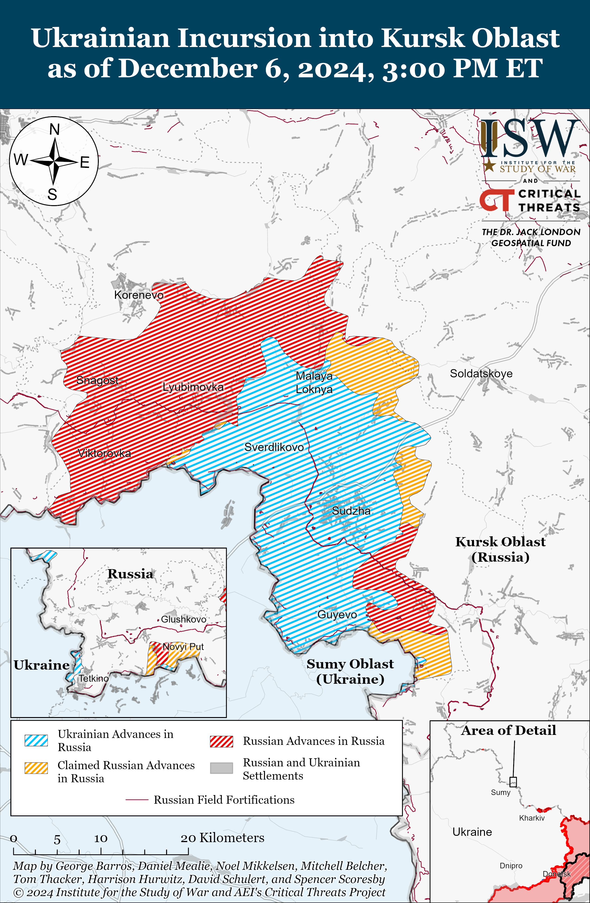
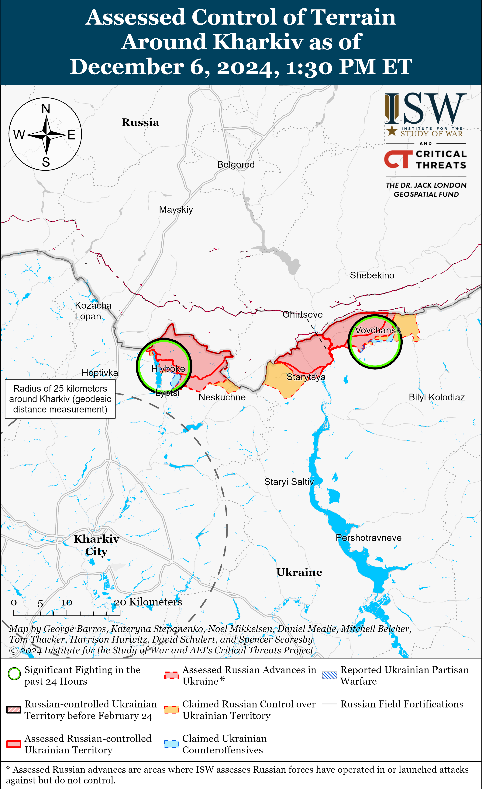
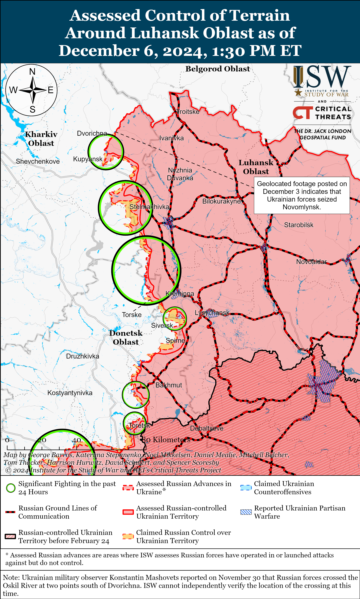
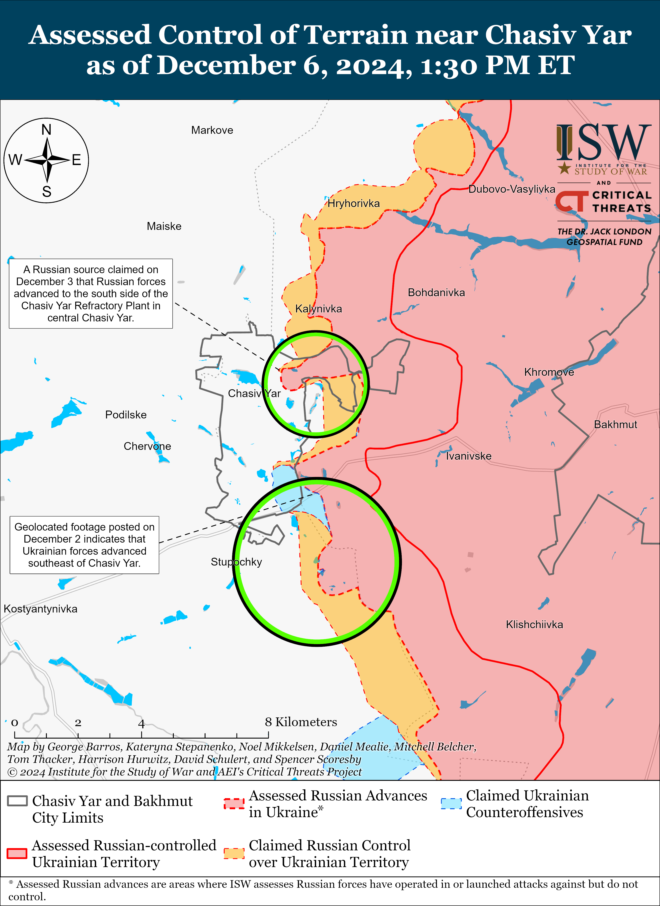
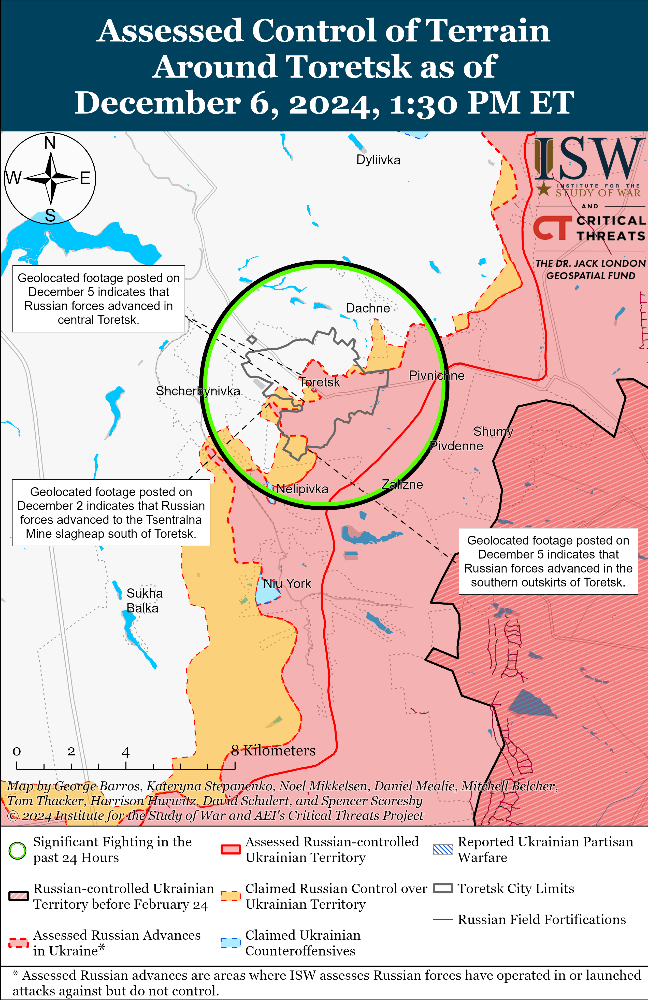
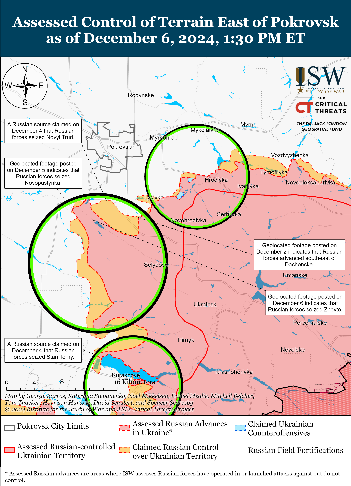
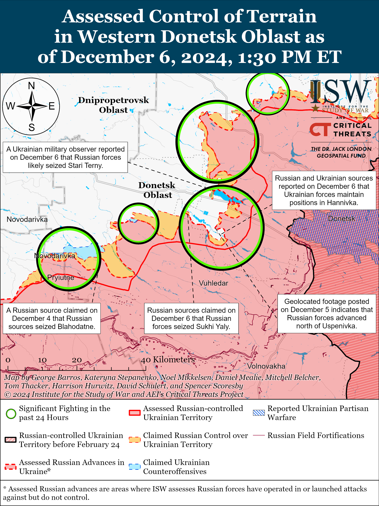
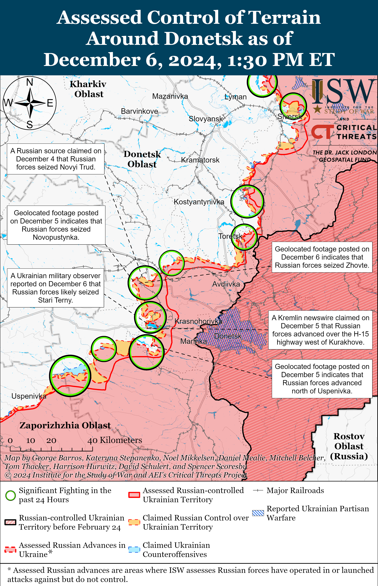
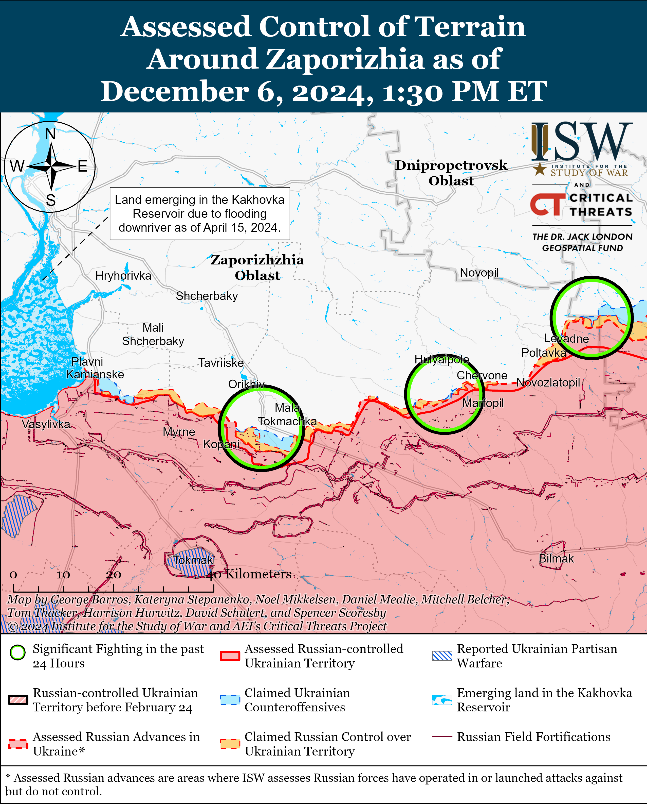
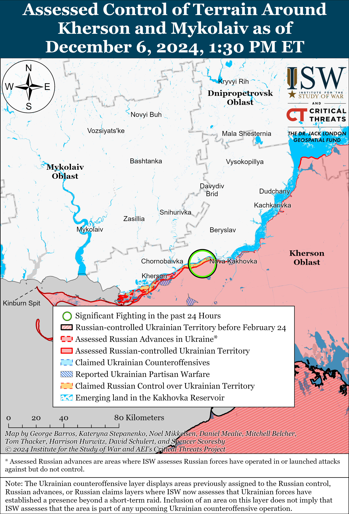

# Russian Offensive Campaign Assessment, December 6, 2024

**Christina Harward, Kateryna Stepanenko, Grace Mappes, Nate Trotter, Olivia Gibson, William Runkel, and George Barros**

**December 6, 2024, 9:30pm ET**

**Click** [**here**](https://storymaps.arcgis.com/stories/36a7f6a6f5a9448496de641cf64bd375) **to see ISW’s interactive map of the Russian invasion of Ukraine. This map is updated daily alongside the static maps present in this report.**

**Click** [**here**](https://understandingwar.maps.arcgis.com/apps/instant/3dviewer/index.html?appid=1602762dbcde419bb957dea358449580) **to see ISW’s 3D control of terrain topographic map of Ukraine. Use of a computer (not a mobile device) is strongly recommended for using this data-heavy tool.**

**Click** [**here**](https://storymaps.arcgis.com/stories/733fe90805894bfc8562d90b106aa895) **to access ISW’s archive of interactive time-lapse maps of the Russian invasion of Ukraine. These maps complement the static control-of-terrain map that ISW produces daily by showing a dynamic frontline. ISW will update this time-lapse map archive monthly.**

**Note: The data cut-off for this product was 1:30pm ET on December 6. ISW will cover subsequent reports in the December 6 Russian Offensive Campaign Assessment.**

**Russian forces have not yet evacuated the Russian naval base in Tartus, Syria as of December 6, but it remains unclear whether Russia will keep its vessels at the port as Syrian rebels continue to advance swiftly across regime-held territory.** Former Norwegian Navy officer and independent OSINT analyst Thord Are Iversen assessed that the Russian *Novorossiysk* Kilo-class submarine, a Gorshkov-class frigate, the *Admiral Grigorovich* Grigorovich-class frigate, and possibly the *Vyazma* Kaliningradneft-class oiler have returned to the port in Tartus based on satellite imagery collected on December 6.[1] Satellite imagery collected on December 3 showed that Russia had removed all of its ships stationed at Tartus – the *Admiral Grigorovich* frigate*,* the *Novorossisysk* submarine, the *Admiral Gorshkov* and *Admiral Golovko* Gorskhov-class frigates, and likely the *Vyazma* oiler and the *Yelnya* Altay-class oiler – from the port sometime between December 1 and 3.[2] The Russian Ministry of Defense (MoD) claimed on December 3 that ten Russian naval vessels, including the *Admiral Gorshkov* and *Admiral Golovko* frigates and *Novorossiysk* submarine,participated in hypersonic and cruise missile launch exercises in the eastern Mediterranean Sea, and Russian Chief of the General Staff Army General Valery Gerasimov reportedly informed the US about Russian exercises in the Mediterranean during a call on November 27.[3] It is unclear if Russia removed the *Admiral Grigorovich* and the two oilers from Tartus as part of the exercise as well. Some of the vessels that Russian forces removed from Tartus between December 1 and 3 have not returned to port as of December 6.

*Bloomberg* reported on December 6 that a person close to the Kremlin stated that Russia does not have a plan to save Syrian President Bashar al Assad and that Russia is unlikely to create such a plan as long as pro-regime forces continue to abandon their positions.[4] The Russian Embassy in Syria notably announced on December 6 that Russian citizens living in Syria should leave the country on commercial flights due to the “difficult military and political situation” in Syria.[5] It remains unclear whether Russia plans to continue to maintain all of these vessels at Tartus or is planning to evacuate all or some of them elsewhere.

**Russia appears to be redeploying at least some of its air defense assets that were defending Russia’s Khmeimim Air Base in Syria, but the reason for this redeployment remains unclear at this time.** Geolocated footage published on December 6 shows Russian forces transporting S-300 or S-400 and Tor-M1 air defense systems near Baniyas along the M1 Lakatia-Tartus highway.[6] A Russian milblogger posted the same footage on December 6 and claimed that it showed Russian forces moving an S-400 system and a Tor-M2 system that Russian forces had deployed near Masyaf (about 50 kilometers southeast of Khmeimin Air Base) in 2017 to protect Khmeimin Air Base.[7] The milblogger claimed that Russian forces are either redeploying the air defense systems to Khmeimim Air Base or Tartus due to Syrian rebel groups’ recent seizure of Hama City (roughly 35 kilometers east of Masyaf). It is unclear if Russian forces are redeploying the air defense systems to new positions within western Syria in order to improve their survivability or if Russian forces are moving the air defense systems for evacuation from Syria through Tartus.

**The Kremlin continues to advance its strategic effort to de facto annex Belarus and further expand the Russian military’s presence in Belarus through the Union State framework.** Russian President Vladimir Putin and Belarusian President Alexander Lukashenko signed a new Union State treaty on security guarantees at a meeting of the Supreme State Council of the Union State in Minsk, Belarus on December 6.[8] Lukashenko made a public appeal to Putin that Russia deploy Oreshnik ballistic missiles to Belarus under the condition that the Belarusian military-political leadership would determine the Oreshnik’s targets should the missile ever launch from Belarusian territory.[9] Putin responded to Lukashenko’s request by stating that Russia could deploy Oreshnik systems to Belarus by mid-2025 on the grounds of the new Union State agreement on security guarantees and as Russia scales up the production of Oreshnik ballistic missiles.[10] Putin noted that the new security treaty allows Russia and Belarus to use “all available forces and means” as part of Russia’s and Belarus’ mutual defense obligations.[11]

The treaty also requires Russia and Belarus to ensure the security of the Union State’s borders, and Putin emphasized that the new document includes the potential use of Russian tactical nuclear weapons deployed in Belarus in the event of aggression against Belarus.[12] The agreement follows the release of Russia’s updated nuclear doctrine on November 19, which formally placed Belarus under Russia’s nuclear umbrella and consistent with Russia’s existing treaty obligations with Belarus.[13] The deployment of Oreshnik ballistic missiles to Belarus would further increase Russia’s military footprint in Belarus and advance the Kremlin’s longstanding strategic effort to erode Belarusian sovereignty and de facto annex Belarus through the Union State framework.

Russia and Belarus also signed 10 other Union State documents, including a Union State security concept, a decree on uniform rules in the field of consumer rights protection, a decree on joint measures to combat smuggling, an agreement on the formation of a common electric energy market, a resolution on the cancellation of mobile device roaming, and a resolution celebratory event for 80th anniversary of victory in World War II, among other Union State matters.[14]

**Lukashenko is likely trying to preserve Belarusian sovereignty against Moscow by advocating that Belarus control Russian weapons deployed in Belarus – an endeavor Lukashenko has historically failed at.** Lukashenko publicly requested that Minsk have the right to decide on how to use Oreshnik missiles in Belarus likely in an attempt to preserve Belarus’ sovereignty within the Union State and buttress his negotiating position against further Union State integration.[15] Lukashenko has long attempted to compete against the Kremlin to determine whether Belarus can assert control over Russian military assets – such as advanced S-400 air defense systems – deployed to Belarus.[16] Belarusian Security Council State Secretary Alexander Volfovich similarly baselessly claimed that only Lukashenko can issue the order to use the Russian tactical nuclear weapons deployed in Belarus.[17] Lukashenko noted that the Russian military personnel will continue to operate the Oreshnik system in Belarus, which indicates that Moscow will retain control over any Oreshnik ballistic missiles deployed to Belarus.

**The deployment of the Oreshnik missiles to Belarus does not significantly increase the immediate risks of intermediate-range ballistic missile (IRBM) strikes against Ukraine or NATO states despite the Kremlin’s intensified nuclear saber-rattling.** Putin once again tried to flaunt the Oreshnik missile and Russian missile capabilities during the Union State Supreme State Council meeting as part of the Kremlin’s reflexive control information operation. Russian Foreign Minister Sergei Lavrov similarly attempted to frame the Oreshnik strike against Dnipro City on November 21 as Russia’s readiness to use any means to prevent the West from strategically defeating Russia in an interview with an American media personality on December 5.[18] ISW continues to assess that the Kremlin’s constant flaunting of the Oreshnik missile is unlikely to presage the development of particularly novel Russian deep-strike capabilities.[19] Russia’s deployment of Oreshnik missiles to Belarus does not significantly change the threat to Ukraine or NATO given that the Russian military has long had nuclear weapons in mainland Russia and the enclave of Kaliningrad capable of striking targets in Ukraine and NATO. Russian forces fire nuclear-capable Iskander ballistic missiles, Kinzhal hypersonic ballistic missiles, and nuclear-capable Kh-101 cruise missiles against Ukraine on a regular basis.[20]

**The Kremlin is scapegoating former Kursk Oblast Governor Alexei Smirnov for Russia’s failure to adequately respond to Ukraine’s incursion into Kursk Oblast.** Russian President Vladimir Putin signed a decree on December 5 stating that Smirnov resigned “at his own request” and appointed Russian State Duma Information Policy Committee Head Alexander Khinshtein as acting Kursk Oblast governor.[21] Putin held a publicized meeting with Khinshtein on December 5 in which Putin offered Khinshtein the post of acting governor and emphasized the importance of crisis management in Kursk Oblast.[22]

Khinshtein’s appointment comes after weeks of protests from Kursk Oblast residents for additional government assistance for housing and amid Russian forces’ continued failure to repel the Ukrainian incursion into Kursk Oblast that began in early August 2024.[23] Putin appointed Smirnov as acting head in May 2024 before Kursk Oblast residents formally elected Smirnov as head in September 2024. Russian state news wire *TASS* noted that Smirnov only served as head of Kursk Oblast for 205 days, of which he only spent 80 days as elected governor.[24] The Kremlin likely refrained from replacing Smirnov during the September 2024 election to downplay the societal impacts of the Ukrainian incursion into Kursk Oblast.[25]

Other senior Russian officials – including Kremlin Spokesperson Dmitry Peskov, Russian State Duma Chairperson Vyacheslav Volodin, and Russian Transport Minister and Smirnov’s predecessor Roman Starovoit – emphasized that Putin appointed Khinshtein because Smirnov was not adequately communicating with or supporting Kursk Oblast residents regarding housing issues and praised Khinshtein as capable of solving these issues.[26] Putin likely replaced Smirnov with Khinshtein now to appear dedicated to solving social issues in Kursk Oblast and quell local protests while distracting from Russia’s failure to repel the Ukrainian incursion.

**Russian Foreign Minister Sergei Lavrov used his interview with an American media personality to reiterate Kremlin talking points that are intended to shape American foreign policy and achieve a US-Russia reset detrimental to US interests and on the Kremlin’s terms.** Lavrov stated during the interview published on December 5 that the Kremlin wants “normal” relations with the United States and reiterated longstanding Kremlin rhetorical lines attempting to blame the United States and NATO for undermining relations with Russia. Lavrov’s statements largely aligned with Russian President Vladimir Putin’s November 7 talking points that also advocated for a US-Russia reset on Russia’s terms.[27] Lavrov also indicated that the Kremlin still has no intentions to negotiate on any terms other than its own and falsely claimed that Russia wants to end the war in Ukraine on the basis of the United Nations (UN) Charter – despite Russia’s continuing to violate the UN Charter by waging its illegal war of conquest against Ukraine in violation of Ukrainian sovereignty, territorial integrity, and Russia‘s previous treaties with Ukraine. Lavrov rejected any notion of Russian forces withdrawing from occupied Ukraine and falsely claimed that Russia is not attempting to “exterminate” the Ukrainian people. Lavrov’s statements are part of the Kremlin’s continued effort to shape American foreign policy so the United States engages with Russia on terms favorable to the Kremlin without offering any concessions favorable to the United States or conceding any of the Kremlin’s maximalist objectives either in Ukraine or globally.[28]

**Western sanctions are reportedly degrading the overall quality of Russian drones, indicating that targeted sanctions are having some negative effects on the Russian defense industrial base (DIB).** The *Washington Post* reported on December 5 that Western sanctions are forcing Russia to purchase poorer quality steering motors for drones from the People’s Republic of China (PRC), which is increasing the failure rate of Russian-produced Shahed drones as they have in-flight maneuverability issues.[29] Soldiers told the *Washington Post* that Russian Shaheds have started to spin out of control after making sharp turns, causing some of the drones to crash. ISW has observed Ukrainian official reports of Russian drones increasingly becoming “locally lost” during Russia’s almost daily overnight strike series against Ukraine, and the reported lower-quality steering motors may be contributing to this phenomenon.[30]

Russia is reportedly also struggling to procure sufficient quantities of basic supplies, such as high-performance lubricants needed for operating tanks in colder weather or computerized machine tools necessary for building drone airframes and missiles.[31] ISW previously reported on Russia’s increasing efforts to expand bilateral relations with the PRC in order to circumvent Western sanctions, with Ukrainian officials statingthat the PRC provides approximately 60 percent of all the foreign components found in the weapons that Russia uses against Ukraine.[32] ISW previously assessed that Russia is prioritizing materiel quantity over quality and that Russia’s increased DIB production is likely not sustainable in the medium- and long-term as Russia is unable to completely compensate for the military and dual-use items it can no longer acquire due to sanctions.[33]

**Key Takeaways:**

- **Russian forces have not yet evacuated the Russian naval base in Tartus, Syria as of December 6, but it remains unclear whether Russia will keep its vessels at the port as Syrian rebels continue to advance swiftly across regime-held territory.**
- **Russia appears to be redeploying at least some of its air defense assets that were defending Russia’s Khmeimim Air Base in Syria, but the reason for this redeployment remains unclear at this time.**
- **The Kremlin continues to advance its strategic effort to de facto annex Belarus and further expand the Russian military’s presence in Belarus through the Union State framework.**
- **Lukashenko is likely trying to preserve Belarusian sovereignty against Moscow by advocating that Belarus control Russian weapons deployed in Belarus – an endeavor Lukashenko has historically failed at.**
- **The deployment of the Oreshnik missiles to Belarus does not significantly increase the immediate risks of intermediate-range ballistic missile (IRBM) strikes against Ukraine or NATO states despite the Kremlin’s intensified nuclear saber-rattling.**
- **The Kremlin is scapegoating former Kursk Oblast Governor Alexei Smirnov for Russia’s failure to adequately respond to Ukraine’s incursion into Kursk Oblast.**
- **Russian Foreign Minister Sergei Lavrov used his interview with an American media personality to reiterate Kremlin talking points that are intended to shape American foreign policy and achieve a US-Russia reset detrimental to US interests and on the Kremlin’s terms.**
- **Western sanctions are reportedly degrading the overall quality of Russian drones, indicating that targeted sanctions are having some negative effects on the Russian defense industrial base (DIB).**
- **Russian forces recently advanced near Toretsk, Pokrovsk, Kurakhove, and Vuhledar.**
- **The Russian military continues to lose parts of its officer corps, a resource that is difficult to replenish, as part of Russia’s ever-increasing casualties.**

***We do not report in detail on Russian war crimes because these activities are well-covered in Western media and do not directly affect the military operations we are assessing and forecasting. We will continue to evaluate and report on the effects of these criminal activities on the Ukrainian military and the Ukrainian population and specifically on combat in Ukrainian urban areas. We utterly condemn Russian violations of the laws of armed conflict and the Geneva Conventions and crimes against humanity even though we do not describe them in these reports.***

- Ukrainian Operations in the Russian Federation
- Russian Main Effort – Eastern Ukraine (comprised of three subordinate main efforts)
- Russian Subordinate Main Effort #1 – Push Ukrainian forces back from the international border with Belgorod Oblast and approach to within tube artillery range of Kharkiv City
- Russian Subordinate Main Effort #2 – Capture the remainder of Luhansk Oblast and push westward into eastern Kharkiv Oblast and encircle northern Donetsk Oblast
- Russian Subordinate Main Effort #3 – Capture the entirety of Donetsk Oblast
- Russian Supporting Effort – Southern Axis
- Russian Air, Missile, and Drone Campaign
- Russian Mobilization and Force Generation Efforts
- Russian Technological Adaptations
- Activities in Russian-occupied areas
- Significant Activity in Belarus

**Ukrainian Operations in the Russian Federation**

Ukrainian and Russian forces continued to fight in Ukraine’s main salient in Kursk Oblast on December 5 and 6 but there were no confirmed changes to the frontline. Russian sources claimed that Russian forces secured positions up to the Psel River and entered Plekhovo (north of Sudzha) and that elements of the Russian Airborne Forces (VDV) are pushing Ukrainian forces out of Martynovka (northeast of Sudzha).[34] ISW has not observed visual confirmation of these claims, however. Ukrainian forces reportedly counterattacked near Novoivanovka and Darino (both southeast of Korenevo) on December 5 and 6.[35] A Ukrainian Special Operation Forces (SSO) unit reported that it had ambushed a Russian naval infantry platoon and destroyed two Russian armored personnel vehicles by tricking the Russian military command into deploying 20 troops and three armored personnel vehicles to a recently regained Ukrainian position.[36] A spokesperson of a Ukrainian brigade operating in the Kursk direction reported that the brigade captured 11 Russian prisoners of war (POWs) from an assault group of the 11th VDV Brigade, all of whom were recently released prisoners with only a few days of training.[37] Elements of the Russian 83rd Separate VDV Brigade reportedly continue to operate in the Kursk direction, and elements of the “Press” Joint Artillery Group (Chechen “Akhmat” Spetsnaz) are reportedly fighting near Sudzha.[38]

A Russian Telegram channel claiming to be a Russian special services employee published geolocated footage on December 6 purportedly showing the aftermath of a Ukrainian drone strike overnight on December 5 on the headquarters of the 3rd Motorized Rifle Division (20th Combined Arms Army [CAA], Moscow Military District [MMD]) in Boguchar, Voronezh Oblast.[39] The Telegram channel reported that Ukrainian forces launched three drones, of which two drones struck the headquarters building and one fell onto the roof of the four-story barracks.

**Russian Main Effort – Eastern Ukraine**

**Russian Subordinate Main Effort #1 – Kharkiv Oblast (Russian objective: Push Ukrainian forces back from the international border with Belgorod Oblast and approach to within tube artillery range of Kharkiv City)**

Russian forces continued offensive operations in the Kharkiv direction on December 6 but did not make any confirmed advances. Russian milbloggers claimed that Russian forces advanced in Vovchansk (northeast of Kharkiv City), but ISW has not observed confirmation of this claim.[40] Russian forces continued offensive operations along the international border north of Kharkiv City towards Kozacha Lopan, Vysoka Yaruha, and Veterynarne; north of Kharkiv City near Lyptsi; and northeast of Kharkiv City near Vovchansk and Tykhe on December 5 and 6.[41] A Russian milblogger claimed on December 6 that Ukrainian forces conducted unsuccessful counterattacks in Vovchansk and near Starytsya (northeast of Kharkiv City).[42] A Russian milblogger claimed on December 6 that both Russian and Ukrainian forces can only use all-terrain vehicles (ATVs) and motorcycles for transportation near Lyptsi.[43] Drone operators of the Chechen ”Canada” group of the ”Okhotnik” (Hunter) Detachment (204th ”Akhmat” Spetsnaz Regiment, 3rd Combined Arms Army [CAA], formerly 2nd Luhansk People’s Republic Army Corps [LNR AC]) reportedly continue to operate near Strilecha (north of Kharkiv City).[44]

**Russian Subordinate Main Effort #2 – Luhansk Oblast (Russian objective: Capture the remainder of Luhansk Oblast and push westward into eastern Kharkiv Oblast and northern Donetsk Oblast)**

Russian forces continued offensive operations along the Kupyansk-Svatove-Kreminna line on December 6 but did not make any confirmed advances. A Russian milblogger claimed that Russian forces advanced in western Hlushkivka, in the fields southeast of Kruhlyakivka, and the fields west of Pershotravneve (all southeast of Kupyansk).[45] ISW has not observed confirmation of these claims, however. A Russian milblogger claimed that Russian forces crossed the Oskil River in an unspecified location near Kupyansk and seized two bridgeheads on the western bank of the Oskil River.[46] Ukrainian military observer Yuriy Butusov reported that Ukrainian forces prevented a Russian boat from crossing the Oskil River near Novomlynsk (north of Kupyansk).[47] Other Russian milbloggers have also recently acknowledged Ukrainian reports that Ukrainian forces recently regained lost positions in Novomlynsk.[48] Russian forces continued assaults north of Kupyansk near Zapadne; northeast of Kupyansk near Synkivka; southeast of Kupyansk near Nova Kruhlyakivka, Kruhlyakivka, Zahryzove, and Kolisnykivka; west of Svatove near Nadiya, Kopanky, Lozova and Zelenyi Hai; southwest of Svatove near Hrekivka, Novoyehorivka, Cherneshchyna, and Druzhelyubivka; northwest of Kreminna near Makiivka and Terny; west of Kreminna near Yampolivka, Zarichne, and Torske; southwest of Kreminna in the Serebryanske forest area; and south of Kreminna near Bilohorivka on December 5 and 6.[49] A Russian milblogger claimed that Ukrainian forces unsuccessfully counterattacked near Torske and Terny.[50] A Ukrainian battalion commander operating in the Kupyansk direction reported on December 6 that Ukrainian forces are counterattacking and pushing Russian forces out of positions near Kupyansk and that Russian forces conducted three mechanized assaults on an unspecified date with roughly 100 lightly armored vehicles, 90 percent of which Ukrainian forces destroyed.[51] A Russian milblogger claimed that Russian forces are utilizing electric scooters, motorcycles, and all-terrain vehicles (ATVs) in the Kupyansk direction to maneuver around land mines and disperse Russian manpower and armored vehicles.[52] A spokesperson of a Ukrainian brigade operating in the Kupyansk direction noted that Russian forces rarely use heavy military equipment in this direction and largely use this equipment to transport infantry to the frontlines.[53]

**Russian Subordinate Main Effort #3 – Donetsk Oblast (Russian objective: Capture the entirety of Donetsk Oblast, the claimed territory of Russia’s proxies in Donbas)**

Russian and Ukrainian sources did not report ongoing fighting in the Siversk direction on December 6. Artillery elements of the Russian “Nevsky” Volunteer Reconnaissance Assault Brigade (Russian Volunteer Corps) reportedly continue operating near Vasyukivka (southwest of Siversk).[54]

Russian forces continued offensive operations in the Chasiv Yar direction on December 6 but did not make confirmed advances. Russian forces continued ground attacks near the Refractory Plant in central Chasiv Yar and south of Chasiv Yar near Stupochky, Predtechyne, and Bila Hora on December 5 and 6.[55] A Russian military source claimed that Russian forces control 40 percent of Chasiv Yar, but ISW has only observed evidence that can permit ISW to assess that Russian forces occupy about 28.6 percent of Chasiv Yar.[56] Elements of the Russian “Hispaniola” Volunteer Brigade (Russian Volunteer Corps) are reportedly fighting near the Refractory Plant, and drone elements of the 98th Airborne (VDV) Division are reportedly operating against targets in Chasiv Yar.[57]

Russian forces recently marginally advanced in Toretsk amid continued offensive operations in the area on December 6. Geolocated footage published on December 5 shows that Russian forces marginally advanced along Shakhtariv and Haydara streets on the southern outskirts of Zabalka Microraion in southern Toretsk.[58] Russian milbloggers claimed that Russian forces also advanced further in central Toretsk.[59] Ukrainian Luhansk Group of Forces Spokesperson Major Anastasia Bobovnikova stated on December 5 that Ukrainian forces recently conducted a mechanized counterattack near Nelipivka (south of Toretsk) and eliminated a Russian position.[60] Russian forces also continued ground attacks in Toretsk and near Nelipivka, Dyliivka (north of Toretsk), and Shcherbynivka (west of Toretsk) on December 5 and 6.[61]

Russian forces recently advanced south and southwest of Pokrovsk on December 5 and 6. Geolocated footage published on December 5 indicates that Russian forces recently seized Novopustynka (southwest of Pokrovsk) and advanced to the southern outskirts of Shevchenko (south of Pokrovsk).[62] Russian milbloggers claimed on December 6 that Russian forces advanced in the fields south and west of Novopustynka.[63] Russian milbloggers claimed on December 5 that Russian forces finished clearing Novopustynka and are now attacking Novotroistke (southwest of Pokrovsk) and that Russian forces aim to bypass Shevchenko from the east by advancing along the railway line using small squad-sized units of five-to-15 personnel.[64] A Russian milblogger claimed that Russian forces advanced in the fields south of Pushkine (south of Pokrovsk).[65] A Russian source also published footage on December 5 purportedly showing Ukrainian forces destroying the Tsentralna mine shaft in Myrnohrad (east of Pokrovsk) and suggested that Ukrainian forces are preparing to withdraw from Myrnohrad.[66] The Russian Ministry of Defense (MoD) claimed on December 6 that Russian forces seized Petrivka and Pustynka (both south of Pokrovsk).[67] Russian and Ukrainian sources reported that fighting continued east of Pokrovsk near Myrolyubivka and Promin; southeast of Pokrovsk near Lysivka; south of Pokrovsk near Zhovte, Chumatske, Dachenske, Pushkine, Shevchenko; and southwest of Pokrovsk near Novopustynka and Novotroitske on December 5 and 6.[68] Elements of the Russian 41st Combined Arms Army (CAA) and 2nd CAA, both of the Central Military District (CMD), are reportedly operating in the Pokrovsk direction.[69] Elements of the 27th Motorized Rifle Division (2nd CAA) and elements of one-to-1.5 brigades of the 2nd CAA supported by elements of the 90th Separate Tank Division are reportedly operating west of Selydove and Tsukuryne (both southeast of Pokrovsk).[70] Elements of the Russian ”Tiger” Group are reportedly operating in the Pokrovsk direction.[71]

Russian forces made tactical gains in the Kurakhove direction on December 5 and 6. Geolocated footage published on December 5 indicates that Russian forces advanced in the fields southeast of Kurakhove.[72] Ukrainian military observer Kostyantyn Mashovets stated on December 6 that Russian forces likely captured Stari Terny (northwest of Kurakhove).[73] The Ukrainian General Staff reported on December 5 and 6 that fighting continued within Kurakhove proper; north of Kurakhove near Berestky; northwest of Kurakhove near Zorya, Stari Terny, and Sontsivka; south of Kurakhove near Dalne; and west of Kurakhove near Dachne.[74] Russian sources claimed on December 6 that Russian forces advanced in the fields west of Stari Terny; to the H-15 Kurakhove-Zaporizhzhia City highway; and advanced along Subornyi Avenue in Kurakhove proper.[75] A Russian source claimed on December 6 that Russian forces are reportedly threatening to encircle a group of roughly 1,500 Ukrainian soldiers south of Kurakhove.[76] A Russian milblogger claimed that Russian forces’ recent tactical gains in Pushkine and Zorya are facilitating Russian forces’ efforts to push Ukrainian forces out of Sontsivka.[77] ISW has not observed visual evidence to confirm these Russian claims, however. Elements of the Russian 2nd CAA are reportedly operating alongside elements of the 51st CAA (formerly 1st Donetsk People’s Republic Army Corps [DNR AC]) and 90th Separate Tank Division (CMD) in the Kurakhove direction.[78] Significant elements of the Russian 8th CAA (Southern Military District [SMD]), two motorized brigades of the 29th CAA (Eastern Military District [EMD]) and the 68th AC (EMD) are reportedly operating in the Kurakhove direction.[79] Elements of the Russian 5th, 110th, and 114th motorized rifle brigades (all 51st CAA) are reportedly operating near the northern bank of the Kurakhivske Reservoir.[80] Drone operators of the Russian 3rd Tank Battalion of the 68th Tank Regiment (150th Motorized Rifle Division, 8th CAA) are reportedly operating near Kurakhove. [81] Elements of the Russian 51st CAA are reportedly operating near Sobornyi Avenue in the center of Kurakhove.[82]

Russian forces recently advanced northwest of Vuhledar on December 6. Geolocated footage published on December 6 indicates that Russian forces advanced northwest of Vuhledar in the fields north of Uspenivka.[83] Mashovets also reported that Russian forces likely seized Sukhi Yaly (northwest of Vuhledar) and Kostyatynopolske (both northwest of Vuhledar), and Russian milbloggers similarly claimed that Russian forces seized Sukhi Yaly.[84] Russian milbloggers reported that Russian forces are focused on encircling the pocket in the area along the Sukhi Yaly River near Uspenivka, and reported that Ukrainian soldiers only have an egress corridor smaller than two kilometers wide leading out of Veselyi Hai (northwest of Vuhledar) and Hannivka (east of Uspenivka).[85] Fighting continued northeast of Vuhledar near Rozdolne and Rozlyv; south of Vuhledar near Makarivka; and northwest of Vuhledar near Uspenivka and Kostyantynopolske[86] Elements of the Russian 37th Motorized Rifle Brigade (36th CAA, EMD) and 36th Motorized Rifle Brigade (29th CAA, EMD) are reportedly operating near Kostyatynopolske and Sukhi Yaly, elements of the Russian 39th Motorized Rifle Brigade (68th AC, EMD) are operating near Uspenivka and Hannivka.[87]

Russian forces continued offensive operations near Velyka Novosilka on December 6 but did not make any confirmed advances. Russian milbloggers claimed that Russian forces advanced west and southeast of Rivnopil (southwest of Velyka Novosilka); advanced one kilometer near Velyka Novosilka; and advanced to the eastern and southeastern outskirts of Velyka Novosilka.[88] A Russian milblogger also claimed that elements of the Russian 5th Combined Arms Army ([CAA], Eastern Military District [EMD]) improved their tactical positions on the western outskirts of Velyka Novosilka. ISW has not observed confirmation of these claims, however. Russian forces reportedly continued attacking north of Velyka Novosilka near Novyi Komar; northeast of Velyka Novosilka near Rozdolne; south of Velyka Novosilka near Makarivka; southwest of Velyka Novosilka near Novodarivka; and west of Velyka Novosilka near Novosilka on December 5 and 6.[89] A Russian milblogger claimed that Ukrainian forces unsuccessfully counterattacked near Novyi Komar and Rozdolne.[90] Elements of the Russian 40th Naval Infantry Brigade (Pacific Fleet, EMD) and 14th Spetsnaz Brigade (Russian General Staff’s Main Directorate [GRU]) are reportedly operating in the Velyka Novosilka direction; elements of the 5th Tank Brigade and 37th Motorized Rifle Brigade (both of the 36th CAA, EMD) are reportedly operating southeast of Velyka Novosilka; and elements of the 5th CAA (EMD) are reportedly operating southwest of Velyka Novosilka.[91]

Mashovets stated on December 6 that the Russian military command is considering pushing Russian forces across the north of the Sukyi Yaly River to attempt to seize Velyka Novosilka.[92] Mashovets also stated that limited resources are forcing elements of the Russian Eastern (Vostok) Grouping of Forces to attempt to seize Velyka Novosilka over conducting a ”large encirclement” of Ukrainian forces in the area. A spokesperson for a Ukrainian brigade operating in the Vremivka direction (an area of operations in the Donetsk-Zaporizhia oblast border area) stated that Russian forces are trying to advance using motorcycles and personal vehicles, and only sometimes used lightly armored or heavy military equipment.[93] The spokesperson noted that Russian forces can launch persistent assaults but then the number of assaults will decrease over three to four days as Russian forces get tired. The spokesperson stated that Russian forces are concentrating reserve forces in this direction to replenish the personnel losses from the failed assaults during those three to four days.

**Russian Supporting Effort – Southern Axis (Russian objective: Maintain frontline positions and secure rear areas against Ukrainian strikes)**

Russian forces continued offensive operations in western Zaporizhia Oblast near Novodanylivka (north of Robotyne) on December 5 and 6 but did not make any advances.[94] A Russian milblogger claimed on December 6 that Ukrainian forces conducted an unsuccessful counterattack involving at least two infantry fighting vehicles near Mala Tokmachka (northeast of Robotyne).[95] Elements of the Russian 42nd Motorized Rifle Division (58th Combined Arms Army [CAA], Southern Military District [SMD]) and the 7th Airborne (VDV) Division are reportedly operating near Mala Tokmachka.[96]

Russian forces continued assaults in the Dnipro direction on December 6 but did not make any confirmed advances in the area.[97] A Russian milblogger claimed on December 6 that Russian forces are conducting operations on the islands of the Dnipro River Delta.[98] The Russian milblogger added that Russian forces in the Dnipro direction lack enough boats and vehicles and called on the Russian military command to create “systemic measures” to address these shortages.

Ukrainian forces reportedly conducted a naval drone strike against occupied Crimea on the night of December 5 to 6. The Russian Ministry of Defense (MoD) claimed that Black Sea Fleet (BSF) naval aviation destroyed six Ukrainian naval drones in the Black Sea on the morning of December 6.[99] A Kremlin-affiliated Russian milblogger claimed that Ukrainian forces launched multiple waves of naval drones near occupied Crimea likely targeting the Kerch Strait Bridge overnight from December 5 to 6.[100] The Crimea-based Telegram channel Crimean Wind and *Radio Free Europe/Radio Liberty’s* Crimea-focused service *Krym Realii* reported that locals heard explosions near the Zalyv shipyard and the Kerch Strait Bridge.[101] *Krym Realii* also reported that there were reports of Russian air defense operating in the Kerch Strait.[102] A Russian milblogger claimed that Russian helicopters, ships, and electronic warfare (EW) repelled the Ukrainian strike.[103]

**Russian Air, Missile, and Drone Campaign (Russian Objective: Target Ukrainian military and civilian infrastructure in the rear and on the frontline)**

Russian forces conducted a series of drone strikes against Ukraine on the night of December 5 to 6 and missile strikes during the day on December 6. The Ukrainian Air Force reported that Russian forces launched 53 Shahed drones and other unidentified drone types (likely referring to decoy drones) from Oryol Oblast.[104] The Ukrainian Air Force reported that Ukrainian Forces downed 32 drones over Kyiv, Kharkiv, Poltava, Sumy, Chernihiv, Cherkasy, and Zhytomyr oblasts as of 0700 local time; that 16 drones were ”lost,” likely due to Ukrainian electronic warfare (EW) interference; and that two drones flew towards Belarusian air space. Ukrainian officials reported that a Russian missile strike damaged an administrative building in Kryvyi Rih and killed two civilians.[105] Chernihiv Oblast officials reported that a Russian Shahed drone struck civilian infrastructure in Koryukivskyi Raion and that Russian forces conducted two missile strikes – likely using Iskander-K cruise missiles – against Chernihivskyi Raion overnight on December 5 to 6.[106] Kyiv City Military Administration Head Serhiy Popko stated that Russian drones damaged the windows of a non-residential building and that drone debris fell on a road in Kyiv City.[107] The Hajun Project, an independent Belarusian monitoring group, reported on December 6 that 10 Russian Shaheds flew into Belarusian airspace from Ukraine and Russia on the night of December 5 to 6.[108]

Mykolaiv Oblast Military Administration Head Vitaly Kim stated that Russian forces launched a Kh-59/69 cruise missile strike and that falling missile debris damaged civilian and energy infrastructure in Voznesensk on the afternoon of December 5.[109]

**Russian Mobilization and Force Generation Efforts (Russian objective: Expand combat power without conducting general mobilization)**

The Russian military continues to lose parts of its officer corps, a resource that is difficult to replenish, as part of Russia’s ever-increasing casualties.[110] Russian opposition outlet *Vazhnye Istorii* (iStories) reported on December 5 that almost one-quarter of the 74 officers who were in the 2022 graduating class of the Donetsk Higher Combined Arms Command School in occupied Donetsk Oblast had died in Ukraine by November 2024.[111] About one-tenth of all 294 officers who graduated from the school between 2020 and 2024 have died.

**Russian Technological Adaptations (Russian objective: Introduce technological innovations to optimize systems for use in Ukraine)**

Russian online outlet *Readovka* claimed on December 5 that the Sibiryachok drone production enterprise in Moscow Oblast is preparing to produce a modernized Sibiryachok drone and that production of this drone will be entirely domestic by March 2025.[112]

**Activities in Russian-occupied areas (Russian objective: Consolidate administrative control of annexed areas; forcibly integrate Ukrainian citizens into Russian sociocultural, economic, military, and governance systems)**

The International Atomic Energy Agency (IAEA) reported on December 5 that Russian forces continue to deny IAEA employees access to the external spare parts warehouse and diesel fuel storage facility at the Zaporizhzhia Nuclear Power Plant (ZNPP).[113] The IAEA added that Russian authorities claimed they repaired the diesel fuel storage facility after more than two years.

**Significant activity in Belarus (Russian efforts to increase its military presence in Belarus and further integrate Belarus into Russian-favorable frameworks and Wagner Group activity in Belarus)**

See topline text.

**Note: ISW does not receive any classified material from any source, uses only publicly available information, and draws extensively on Russian, Ukrainian, and Western reporting and social media as well as commercially available satellite imagery and other geospatial data as the basis for these reports. References to all sources used are provided in the endnotes of each update.**

[1] https://x.com/The\_Lookout\_N/status/1865035425397510254; https://x.com/bradyafr/status/1865032193942147336

[2] https://isw.pub/UkrWar120324

[3] https://t.me/mod\_russia/46459; https://abcnews.go.com/International/russian-general-warned-us-hypersonic-missile-test-mediterranean/story?id=116463590

[4] https://www.bloomberg.com/news/articles/2024-12-06/syrian-rebels-eye-next-prize-while-assad-awaits-russia-and-iran

[5] https://t.me/rusembsy/651

[6] https://x.com/Mitch\_Ulrich/status/1865093121723281496; https://x.com/Mitch\_Ulrich/status/1865093374853648408

[7] https://t.me/milinfolive/136887

[8] https://www.dw.com/ru/rossia-i-belarus-podpisali-dogovor-o-garantiah-bezopasnosti/a-70987576

[9] http://kremlin dot ru/events/president/news/75782

[10] http://kremlin dot ru/events/president/news/75782

[11] https://www.dw.com/ru/rossia-i-belarus-podpisali-dogovor-o-garantiah-bezopasnosti/a-70987576

[12] https://apnews.com/article/russia-belarus-security-agreement-nuclear-doctrine-c07ef5d341f93be6934ac14a77b58f8b

[13] https://understandingwar.org/backgrounder/russian-offensive-campaign-assessment-november-19-2024; https://apnews.com/article/russia-belarus-security-agreement-nuclear-doctrine-c07ef5d341f93be6934ac14a77b58f8b

[14] http://kremlin dot ru/supplement/6239

[15] https://understandingwar.org/backgrounder/belarus-warning-update-belarus-confirms-plans-purchase-advanced-air-defense-systems

[16] https://understandingwar.org/backgrounder/belarus-warning-update-lukashenko-and-kremlin-vie-control-over-future-russian-weapons

[17] https://ria dot ru/20241206/tyao-1987736028.html

[18] https://t.me/tass\_agency/289244; https://t.me/tass\_agency/289245 ; https://t.me/tass\_agency/289246; https://t.me/tass\_agency/289247; https://t.me/tass\_agency/289248; https://t.me/tass\_agency/289249; https://t.me/tass\_agency/289250; https://t.me/tass\_agency/289251; https://t.me/tass\_agency/289252; https://t.me/tass\_agency/289253; https://t.me/tass\_agency/289254; https://t.me/tass\_agency/289255; https://t.me/tass\_agency/289256; https://t.me/tass\_agency/289257; https://t.me/tass\_agency/289258; https://t.me/tass\_agency/289259; https://t.me/tass\_agency/289260; https://t.me/tass\_agency/289261; https://t.me/tass\_agency/289262; https://t.me/tass\_agency/289263; https://t.me/tass\_agency/289264; https://t.me/tass\_agency/289265; https://t.me/tass\_agency/289266; https://t.me/tass\_agency/289267; https://t.me/tass\_agency/289268; https://t.me/tass\_agency/289269; https://t.me/tass\_agency/289270; https://t.me/tass\_agency/289272; https://t.me/tass\_agency/289273; https://t.me/tass\_agency/289274; https://t.me/tass\_agency/289275; https://t.me/tass\_agency/289277; https://t.me/tass\_agency/289279 ; https://t.me/MID\_Russia/49269 ; https://t.me/MID\_Russia/49243 ; https://t.me/MID\_Russia/49242 ; https://meduza dot io/paragraph/2024/12/06/tramp-silnyy-zelenskiy-neadekvatnyy-my-ne-hotim-voyny-s-ssha; https://www.youtube.com/watch?v=nmgDf6QiCps; https://www.mid dot ru/ru/foreign\_policy/news/1985783/

[19] https://understandingwar.org/backgrounder/russian-offensive-campaign-assessment-november-29-2024

[20] https://understandingwar.org/backgrounder/russian-offensive-campaign-assessment-november-21-2024

[21] http://kremlin dot ru/acts/news/75772; https://t.me/tass\_agency/289221; https://meduza dot io/news/2024/12/05/putin-naznachil-aleksandra-hinshteyna-vrio-gubernatora-kurskoy-oblasti

[22] http://kremlin dot ru/events/president/news/75773

[23] https://meduza dot io/en/news/2024/11/11/refugees-from-occupied-kursk-protest-russian-government-s-failure-to-deliver-promised-assistance-such-as-adequate-housing; https://www.agents dot media/gosudarstvu-bylo-by-luchshe-esli-by-my-sdohli-pochemu-zhiteli-sudzhanskogo-rajona-vyshli-na-miting-v-tsentre-kurska/; https://meduza dot io/en/news/2024/11/13/russian-court-fines-kursk-region-refugee-for-staging-protest-to-demand-promised-housing-assistance; https://zona dot media/news/2024/11/12/gerasimenko; https://novayagazeta dot eu/articles/2024/11/10/internally-displaced-russians-from-ukrainian-occupied-sudzha-stage-rally-in-kursk-en-news; https://t.me/horizontal\_russia/41515

[24] https://ria dot ru/20240515/smirnov-1946082790.html; https://understandingwar.org/backgrounder/russian-offensive-campaign-assessment-september-9-2024; https://t.me/tass\_agency/289229

[25] https://understandingwar.org/backgrounder/russian-offensive-campaign-assessment-september-9-2024

[26] https://t.me/tass\_agency/289231; https://t.me/tass\_agency/289232; https://t.me/tass\_agency/289235; https://t.me/tass\_agency/289331; https://t.me/tass\_agency/289332 ; https://meduza dot io/news/2024/12/06/byvshiy-glava-kurskoy-oblasti-ob-yasnil-smenu-rukovodstva-regiona-tem-chto-u-gubernatora-voznikli-problemy-s-nalazhivaniem-kommunikatsiy-s-lyudmi; https://t.me/tass\_agency/289340; https://t.me/tass\_agency/289335; https://t.me/tass\_agency/289346;

[27] https://www.mid dot ru/en/foreign\_policy/news/1985783/; https://www.mid dot ru/ru/foreign\_policy/news/1985783/; https://understandingwar.org/backgrounder/russian-offensive-campaign-assessment-november-7-2024; http://kremlin dot ru/events/president/news/75521; https://understandingwar.org/backgrounder/russian-offensive-campaign-assessment-november-8-2024

[28] https://understandingwar.org/backgrounder/russian-offensive-campaign-assessment-november-7-2024; https://understandingwar.org/backgrounder/russian-offensive-campaign-assessment-november-8-2024; https://isw.pub/UkrWar111524; https://isw.pub/UkrWar111324

[29] https://www.washingtonpost.com/national-security/2024/12/05/russian-sanctions-weapons-ukraine-war/ ; https://suspilne dot media/896121-wp-rosijski-bezpilotniki-vidculi-vpliv-zahidnih-sankcij-ta-stali-neakisnimi/

[30] https://understandingwar.org/backgrounder/russian-offensive-campaign-assessment-december-2-2024

[31] https://www.washingtonpost.com/national-security/2024/12/05/russian-sanctions-weapons-ukraine-war/

[32] https://understandingwar.org/backgrounder/russian-offensive-campaign-assessment-september-24-2024

[33] https://understandingwar.org/backgrounder/russian-offensive-campaign-assessment-march-11-2024

[34] https://t.me/DnevnikDesantnika/20471; https://t.me/rusich\_army/19089; https://t.me/motopatriot/30158

[35] https://t.me/rusich\_army/19089; https://t.me/DnevnikDesantnika/20471; https://t.me/DnevnikDesantnika/20418; https://t.me/dva\_majors/59465 ; https://t.me/rybar/66072

[36] https://armyinform dot com.ua/2024/12/06/radiogra-na-vybuvannya-zamanyly-u-zasidku-ta-perebyly-czilyj-vzvod-vorozhyh-morpihiv-na-kurshhyni/; https://t.me/ua\_regteam/239

[37] https://armyinform dot com.ua/2024/12/06/odynadczyat-zekiv-shturmovykiv-na-kurshhyni-desantuvalys-v-ukrayinskyj-polon-prosto-z-vyaznycz/

[38] https://t.me/wargonzo/23554; https://t.me/DnevnikDesantnika/20423

[39] https://t.me/vchkogpu/53058; https://t.me/dosye\_shpiona/628; https://x.com/Archer83Able/status/1865007952236810421

[40]https://t.me/DnevnikDesantnika/20436 ; https://t.me/rybar/66072 ; https://t.me/Sladkov\_plus/11997

[41] https://www.facebook.com/GeneralStaff.ua/posts/pfbid02r44sEFbhBogMvAzDLW5YLRmmYT11eHPQ8ZWohfa6WKPVaNT3y1EQ52ezGJ4ZoE67l ; https://www.facebook.com/GeneralStaff.ua/posts/pfbid02dnfye5Fmna6sS9fTWBPapsjQGPsxcwtrGiAPQDhobwKHPBreEQGqGe3F2up6cqmBl ; https://www.facebook.com/GeneralStaff.ua/posts/pfbid0V9WTRFgAw5SNahbcRgmXyaDzrn6RmW1eg4GFoAg9jizgTG7wSq9u5pVfQEFYVE5Fl ; https://t.me/otukharkiv/2932 ; https://t.me/DnevnikDesantnika/20441 ; https://t.me/Sladkov\_plus/11997

[42] https://t.me/DnevnikDesantnika/20436

[43] https://t.me/Sladkov\_plus/11997 ; https://understandingwar.org/backgrounder/russian-offensive-campaign-assessment-november-29-2024

[44] https://t.me/RKadyrov\_95/5301

[45] https://t.me/z\_arhiv/29971; https://t.me/z\_arhiv/29955

[46] https://t.me/Sladkov\_plus/11997

[47] https://t.me/ButusovPlus/15606

[48] https://understandingwar.org/backgrounder/russian-offensive-campaign-assessment-december-5-2024

[49] https://www.facebook.com/GeneralStaff.ua/posts/pfbid02r44sEFbhBogMvAzDLW5YLRmmYT11eHPQ8ZWohfa6WKPVaNT3y1EQ52ezGJ4ZoE67l; https://www.facebook.com/GeneralStaff.ua/posts/pfbid02dnfye5Fmna6sS9fTWBPapsjQGPsxcwtrGiAPQDhobwKHPBreEQGqGe3F2up6cqmBl; https://www.facebook.com/GeneralStaff.ua/posts/pfbid0V9WTRFgAw5SNahbcRgmXyaDzrn6RmW1eg4GFoAg9jizgTG7wSq9u5pVfQEFYVE5Fl; https://www.facebook.com/GeneralStaff.ua/posts/pfbid02r44sEFbhBogMvAzDLW5YLRmmYT11eHPQ8ZWohfa6WKPVaNT3y1EQ52ezGJ4ZoE67l; https://www.facebook.com/GeneralStaff.ua/posts/pfbid02dnfye5Fmna6sS9fTWBPapsjQGPsxcwtrGiAPQDhobwKHPBreEQGqGe3F2up6cqmBl; https://www.facebook.com/GeneralStaff.ua/posts/pfbid0V9WTRFgAw5SNahbcRgmXyaDzrn6RmW1eg4GFoAg9jizgTG7wSq9u5pVfQEFYVE5Fl; https://t.me/Sladkov\_plus/11997; https://t.me/DnevnikDesantnika/20418; https://t.me/DnevnikDesantnika/20440

[50] https://t.me/DnevnikDesantnika/20440

[51] https://armyinform dot com.ua/2024/12/06/vony-ruhayutsya-po-kovru-zi-svoyih-zhe-poleglyh-na-harkivshhyni-vorog-jde-vpered-czinoyu-nejmovirnyh-vtrat/

[52] https://t.me/dva\_majors/59521 ; https://t.me/rusich\_army/19108

[53] https://armyinform dot com.ua/2024/12/06/vazhka-tehnika-duzhe-zhyrnenka-knyazivski-polyuvannya-na-harkivshhyni/; https://www.youtube.com/watch?v=aDXWlQ2K0dM

[54] https://t.me/NeoficialniyBeZsonoV/41993

[55] https://www.facebook.com/GeneralStaff.ua/posts/pfbid02r44sEFbhBogMvAzDLW5YLRmmYT11eHPQ8ZWohfa6WKPVaNT3y1EQ52ezGJ4ZoE67l; https://www.facebook.com/GeneralStaff.ua/posts/pfbid02dnfye5Fmna6sS9fTWBPapsjQGPsxcwtrGiAPQDhobwKHPBreEQGqGe3F2up6cqmBl; https://www.facebook.com/GeneralStaff.ua/posts/pfbid0V9WTRFgAw5SNahbcRgmXyaDzrn6RmW1eg4GFoAg9jizgTG7wSq9u5pVfQEFYVE5Fl; https://t.me/tass\_agency/289284; https://t.me/wargonzo/23532

[56] https://t.me/tass\_agency/289315

[57] https://t.me/tass\_agency/289284; https://t.me/DnevnikDesantnika/20423

[58] https://x.com/AudaxonX/status/1864978892093620641 ; https://x.com/Veteransforukr1/status/1864909661142458582

[59] https://t.me/WarArchive\_ua/23203; https://t.me/z\_arhiv/29968 ; https://t.me/dva\_majors/59465 ; https://t.me/rybar/66072

[60] https://suspilne dot media/donbas/895735-u-nelipivci-na-toreckomu-napramku-neprosto-odnak-bijci-azovu-na-tankah-kontratakuvali-pozicii-rf-otuv-lugansk/

[61] https://www.facebook.com/GeneralStaff.ua/posts/pfbid0V9WTRFgAw5SNahbcRgmXyaDzrn6RmW1eg4GFoAg9jizgTG7wSq9u5pVfQEFYVE5Fl; https://www.facebook.com/GeneralStaff.ua/posts/pfbid02dnfye5Fmna6sS9fTWBPapsjQGPsxcwtrGiAPQDhobwKHPBreEQGqGe3F2up6cqmBl; https://www.facebook.com/GeneralStaff.ua/posts/pfbid02r44sEFbhBogMvAzDLW5YLRmmYT11eHPQ8ZWohfa6WKPVaNT3y1EQ52ezGJ4ZoE67l; https://t.me/dva\_majors/59465 ; https://t.me/rybar/66072;

[62] https://t.me/creamy\_caprice/7740 ; https://t.me/creamy\_caprice/7743; https://www.facebook.com/61563003013214/videos/1060164362520909/ ; https://t.me/WarArchive\_ua/23211

[63] https://t.me/z\_arhiv/29965 ; https://t.me/RVvoenkor/82052

[64] https://t.me/RVvoenkor/82034 ; https://t.me/motopatriot/30157

[65] https://t.me/z\_arhiv/29965 ;

[66] https://t.me/RVvoenkor/82048

[67] https://t.me/mod\_russia/46558

[68] https://www.facebook.com/GeneralStaff.ua/posts/pfbid02r44sEFbhBogMvAzDLW5YLRmmYT11eHPQ8ZWohfa6WKPVaNT3y1EQ52ezGJ4ZoE67l ; https://www.facebook.com/GeneralStaff.ua/posts/pfbid02dnfye5Fmna6sS9fTWBPapsjQGPsxcwtrGiAPQDhobwKHPBreEQGqGe3F2up6cqmBl ; https://www.facebook.com/GeneralStaff.ua/posts/pfbid0V9WTRFgAw5SNahbcRgmXyaDzrn6RmW1eg4GFoAg9jizgTG7wSq9u5pVfQEFYVE5Fl ; https://t.me/motopatriot/30157

[69]https://t.me/zvizdecmanhustu/2388; https://t.me/zvizdecmanhustu/2389

[70] https://t.me/zvizdecmanhustu/2388; https://t.me/zvizdecmanhustu/2389

[71] https://t.me/motopatriot/30153 ; https://t.me/Sib\_army/3051

[72] https://x.com/Playfra0/status/1865037550596895075

[73] https://t.me/zvizdecmanhustu/2389

[74] https://www.facebook.com/GeneralStaff.ua/posts/pfbid0V9WTRFgAw5SNahbcRgmXyaDzrn6RmW1eg4GFoAg9jizgTG7wSq9u5pVfQEFYVE5Fl ; https://www.facebook.com/GeneralStaff.ua/posts/pfbid02dnfye5Fmna6sS9fTWBPapsjQGPsxcwtrGiAPQDhobwKHPBreEQGqGe3F2up6cqmBl ; https://www.facebook.com/GeneralStaff.ua/posts/pfbid02r44sEFbhBogMvAzDLW5YLRmmYT11eHPQ8ZWohfa6WKPVaNT3y1EQ52ezGJ4ZoE67l

[75] https://t.me/RVvoenkor/82052 ; https://t.me/z\_arhiv/29962 ; https://t.me/tass\_agency/289415

[76] https://t.me/tass\_agency/289386

[77] https://t.me/boris\_rozhin/146931

[78] https://t.me/zvizdecmanhustu/2388

[79] https://t.me/zvizdecmanhustu/2388 ;

[80] https://t.me/zvizdecmanhustu/2389

[81] https://t.me/nm\_dnr/13067

[82] https://t.me/voenkorKotenok/60523

[83] https://x.com/moklasen/status/1865077459785245151; https://x.com/GirkinGirkin/status/1865060789813457244; https://t.me/odshbr79/453 ; https://x.com/voin\_dv/status/1864976654168138005 ; https://t.me/notes\_veterans/20907 ; https://t.me/DnevnikDesantnika/20445 ; https://t.me/voenkorKotenok/60514 ; https://t.me/voenkorKotenok/60524 ; https://t.me/boris\_rozhin/146957

[84] https://t.me/zvizdecmanhustu/2390 ; https://t.me/notes\_veterans/20907; https://t.me/boris\_rozhin/146685%20;%20https://t.me/z\_arhiv/29904%20;

[85] https://t.me/dva\_majors/59465 ; https://t.me/rybar/66072 ; https://t.me/boris\_rozhin/146957

[86] https://www.facebook.com/GeneralStaff.ua/posts/pfbid02r44sEFbhBogMvAzDLW5YLRmmYT11eHPQ8ZWohfa6WKPVaNT3y1EQ52ezGJ4ZoE67l ; https://www.facebook.com/GeneralStaff.ua/posts/pfbid02dnfye5Fmna6sS9fTWBPapsjQGPsxcwtrGiAPQDhobwKHPBreEQGqGe3F2up6cqmBl ; https://www.facebook.com/GeneralStaff.ua/posts/pfbid0V9WTRFgAw5SNahbcRgmXyaDzrn6RmW1eg4GFoAg9jizgTG7wSq9u5pVfQEFYVE5Fl ; https://t.me/voenkorKotenok/60524

[87] https://t.me/zvizdecmanhustu/2390 ; https://t.me/voin\_dv/12143; https://t.me/voin\_dv/12135

[88] https://t.me/voenkorKotenok/60524; https://t.me/DnevnikDesantnika/20418; https://t.me/z\_arhiv/29959

[89] https://www.facebook.com/GeneralStaff.ua/posts/pfbid02r44sEFbhBogMvAzDLW5YLRmmYT11eHPQ8ZWohfa6WKPVaNT3y1EQ52ezGJ4ZoE67l; https://www.facebook.com/GeneralStaff.ua/posts/pfbid02dnfye5Fmna6sS9fTWBPapsjQGPsxcwtrGiAPQDhobwKHPBreEQGqGe3F2up6cqmBl; https://www.facebook.com/GeneralStaff.ua/posts/pfbid0V9WTRFgAw5SNahbcRgmXyaDzrn6RmW1eg4GFoAg9jizgTG7wSq9u5pVfQEFYVE5Fl; https://t.me/tass\_agency/289405

[90] https://t.me/wargonzo/23532?single; https://t.me/tass\_agency/289405

[91] https://t.me/voin\_dv/12139; https://t.me/voin\_dv/12144; https://t.me/voin\_dv/12145; https://t.me/boris\_rozhin/146911; https://t.me/voenkorKotenok/60524

[92] https://t.me/zvizdecmanhustu/2391

[93] https://www.youtube.com/watch?v=aDXWlQ2K0dM ; https://suspilne dot media/donbas/896573-rosijski-vijska-znisuut-svoi-rezervi-na-vreminskomu-napramku-48-brigada/

[94]https://www.facebook.com/GeneralStaff.ua/posts/pfbid02r44sEFbhBogMvAzDLW5YLRmmYT11eHPQ8ZWohfa6WKPVaNT3y1EQ52ezGJ4ZoE67l ; https://www.facebook.com/GeneralStaff.ua/posts/pfbid02dnfye5Fmna6sS9fTWBPapsjQGPsxcwtrGiAPQDhobwKHPBreEQGqGe3F2up6cqmBl ; https://www.facebook.com/GeneralStaff.ua/posts/pfbid0V9WTRFgAw5SNahbcRgmXyaDzrn6RmW1eg4GFoAg9jizgTG7wSq9u5pVfQEFYVE5Fl

[95] https://t.me/RVvoenkor/82100

[96] https://t.me/RVvoenkor/82100

[97]https://www.facebook.com/GeneralStaff.ua/posts/pfbid02r44sEFbhBogMvAzDLW5YLRmmYT11eHPQ8ZWohfa6WKPVaNT3y1EQ52ezGJ4ZoE67l ; https://www.facebook.com/GeneralStaff.ua/posts/pfbid02dnfye5Fmna6sS9fTWBPapsjQGPsxcwtrGiAPQDhobwKHPBreEQGqGe3F2up6cqmBl ; https://www.facebook.com/GeneralStaff.ua/posts/pfbid0V9WTRFgAw5SNahbcRgmXyaDzrn6RmW1eg4GFoAg9jizgTG7wSq9u5pVfQEFYVE5Fl

[98] https://t.me/dva\_majors/59588

[99] https://t.me/mod\_russia/46555

[100] https://t.me/rybar/66079

[101] https://t.me/Crimeanwind/71040

[102] https://t.me/krymrealii/31844 ; https://t.me/krymrealii/31845 ; https://suspilne dot media/crimea/896151-okupanti-perekrili-krimskij-mist-u-kerci-prolunali-vibuhi/

[103] https://t.me/rusfleet/11300

[104] https://t.me/kpszsu/24208

[105] https://t.me/dnipropetrovskaODA/17887 ; https://t.me/suspilnednipro/39152 ; https://suspilne dot media/dnipro/896739-vijska-rf-atakuvali-krivij-rig-raketou-poskodzena-adminbudivla/; https://armyinform dot com.ua/2024/12/06/vnaslidok-vorozhogo-raketnogo-udaru-po-kryvomu-rozi-vzhe-ye-zagyblyj-i-8-postrazhdalyh-sered-nyh-dytyna/; https://t.me/pgo\_gov\_ua/27763

[106] https://dcz dot cg.gov.ua/index.php?id=507971&tp=0; https://t.me/chernigivskaODA/16768; https://suspilne dot media/chernihiv/896047-sahed-pociliv-u-zitlovij-budinok-poranenij-colovik-podrobici-ataki-rosijskih-bpla-na-cernigivsini/; https://armyinform dot com.ua/2024/12/05/na-chernigivshhyni-shahed-poczilyv-u-pryvatnyj-budynok/

[107] https://armyinform dot com.ua/2024/12/06/nichna-ataka-droniv-na-kyyiv-ulamky-vpaly-na-proyizhdzhu-chastynu/; https://t.me/VA\_Kyiv/9894

[108] https://t.me/Hajun\_BY/8264 ; https://suspilne dot media/896335-vnoci-do-bilorusi-zaletili-10-sahediv-belaruski-gaun/

[109] https://t.me/mykolaivskaODA/12377; https://suspilne dot media/mykolaiv/896175-poskodzeni-budinki-avtivki-ta-lep-so-vidomo-pro-naslidki-raketnogo-udaru-na-mikolaivsini/ ; https://armyinform dot com.ua/2024/12/06/na-mykolayivshhyni-ulamky-zbytyh-raket-poshkodyly-desyatky-budynkiv-i-liniyi-elektroperedach/

[110] https://isw.pub/UkrWar120524; https://storage dot googleapis.com/istories/stories/2024/12/05/pochti-kazhdii-chetvertii/index.html

[111] https://storage dot googleapis.com/istories/stories/2024/12/05/pochti-kazhdii-chetvertii/index.html

[112] https://t.me/readovkanews/90276

[113] https://www.iaea dot org/newscenter/pressreleases/update-263-iaea-director-general-statement-on-situation-in-ukraine ; https://suspilne dot media/zaporizhzhia/896657-magate-ne-nadaut-dostup-dla-perevirki-shovisa-dizelnogo-palnogo-zaporizkoi-aes/
