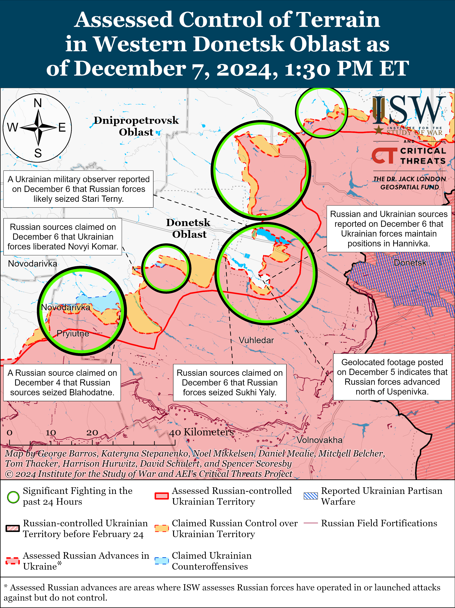
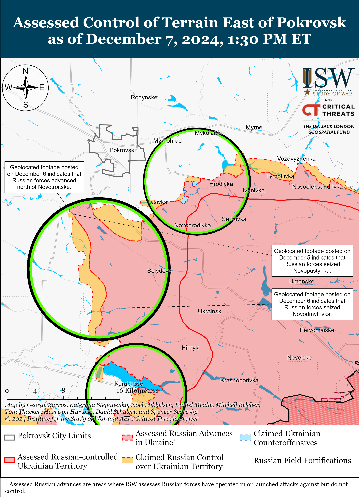
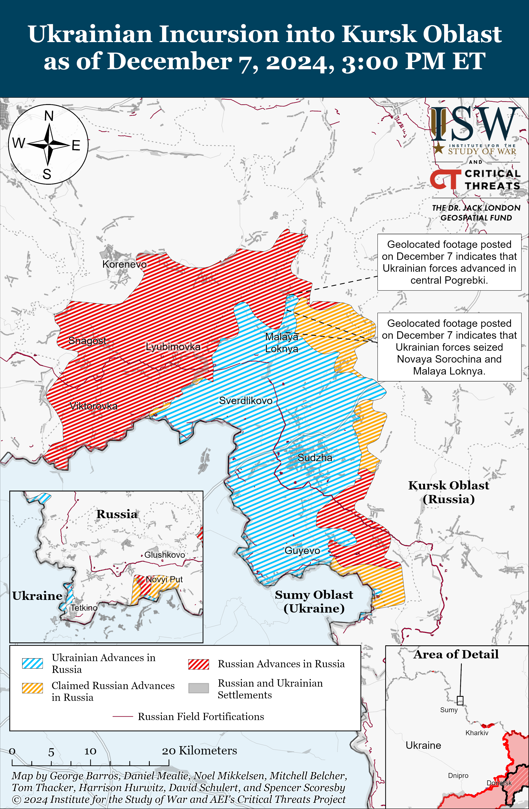
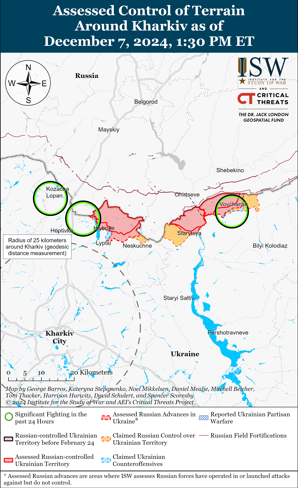
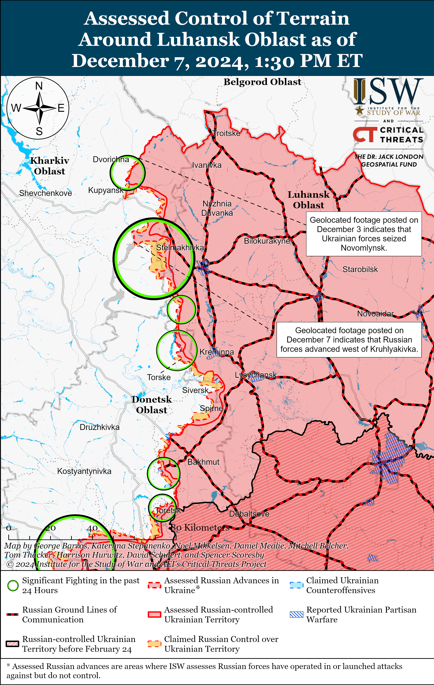
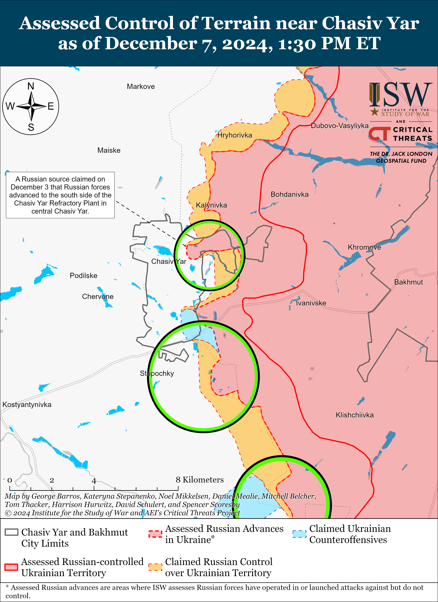
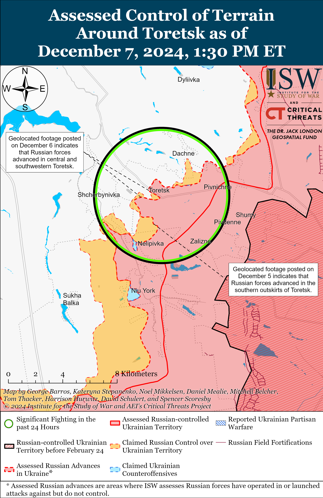
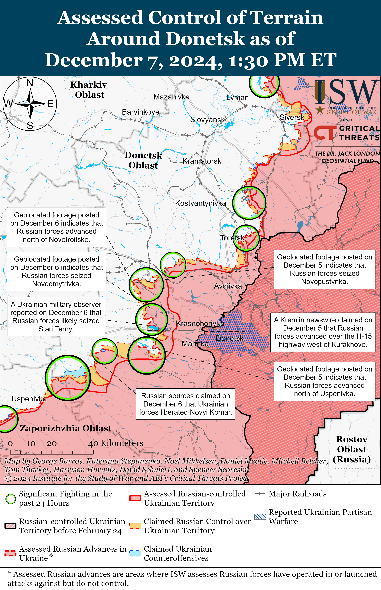
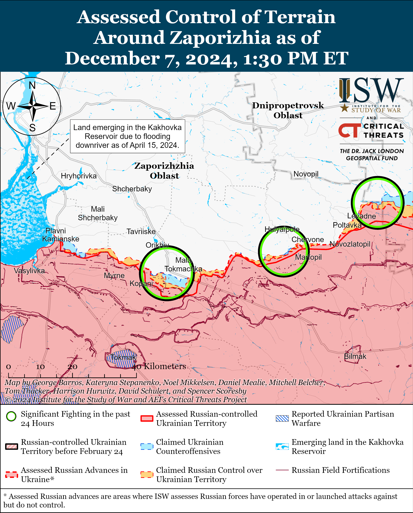
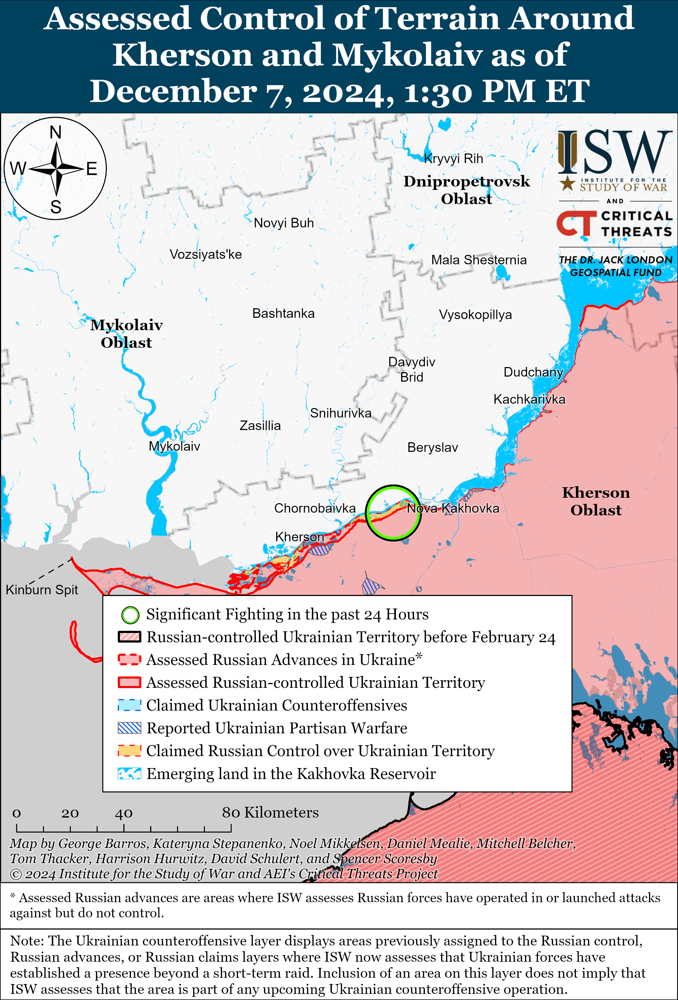

# Russian Offensive Campaign Assessment, December 7, 2024

**Angelica Evans, Davit Gasparyan, Christina Harward, Grace Mappes, and George Barros**

**December 7, 2024, 6:00 pm ET**

**Click** [**here**](https://storymaps.arcgis.com/stories/36a7f6a6f5a9448496de641cf64bd375) **to see ISW’s interactive map of the Russian invasion of Ukraine. This map is updated daily alongside the static maps present in this report.**

**Click** [**here**](https://understandingwar.maps.arcgis.com/apps/instant/3dviewer/index.html?appid=1602762dbcde419bb957dea358449580) **to see ISW’s 3D control of terrain topographic map of Ukraine. Use of a computer (not a mobile device) is strongly recommended for using this data-heavy tool.**

**Click** [**here**](https://storymaps.arcgis.com/stories/733fe90805894bfc8562d90b106aa895) **to access ISW’s archive of interactive time-lapse maps of the Russian invasion of Ukraine. These maps complement the static control-of-terrain map that ISW produces daily by showing a dynamic frontline. ISW will update this time-lapse map archive monthly.**

**Note: The data cut-off for this product was 11:45am ET on December 7. ISW will cover subsequent reports in the December 8 Russian Offensive Campaign Assessment.**

**Russian forces have resumed their offensive operations directly aimed at seizing Pokrovsk through a turning maneuver from the south after successfully widening their salient south and southeast of the town.** Russian forces, including elements of the 15th Motorized Rifle Brigade (2nd Combined Arms Army [CAA], Central Military District [CMD]), began advancing further west and northwest of Selydove (southeast of Pokrovsk) along the Petrivka-Pustynka-Zhovte line south of Pokrovsk in late November 2024 after mainly focusing their offensive efforts on widening the salient south of Selydove and eliminating the Ukrainian pockets north and south of Kurakhove.[1] Russian forces recently seized Novopustynka (southwest of Pokrovsk and west of Zhovte) and advanced near the southern outskirts of Shevchenko (north of Zhovte), and geolocated footage published on December 6 indicates that Russian forces recently advanced north of Novotroitske (just west of Novopustynka) and along the T-05-15 Pokrovsk-Kostyantynopil highway towards Shevchenko.[2] Russian milbloggers claimed on December 6 and 7 that fighting is ongoing towards Shevchenko and within the center of the settlement and that Russian forces have either advanced into northern Novotroitske or seized the entire settlement.[3] ISW has not observed confirmation of these claims, however. Russian milbloggers also claimed that Russian forces have resumed attacks east of Myrnohrad (just east of Pokrovsk) near Hrodivka and Mykolaivka, are advancing southeast of Pokrovsk near Dachenske (east of Shevchenko), and are attacking with armored vehicle support near Sukhyi Yar and Lysivka (both northeast of Dachenske).[4] Ukrainian military observer Kostyantyn Mashovets stated in late November 2024 that elements of the Russian 90th Tank Division (41st CAA, CMD) — a formation that the Russian military command often redeploys to priority sectors and uses to exploit tactical gains — are attacking along the Novotroitske-Ukrainka line.[5] Russian forces’ turn north towards Shevchenko marks a notable inflection in the orientation of the Russian attacks in this area, as Russian forces mainly focused on advancing further west of Selydove in November 2024. The redeployment of elements of the 90th Tank Division and intensified Russian assaults near Dachenske and east of Myrnohrad further indicate a reprioritization of this sector of the frontline.

**The Russian military command likely assesses that they have allocated sufficient manpower and materiel to the efforts to seize Kurakhove and seize or bypass Velyka Novosilka and level the frontline in western Donetsk Oblast in the coming weeks.** Mashovets stated on December 6 that Russian forces likely seized Stari Terny (northwest of Kurakhove and on the northern shore of the Kurakhivske Reservoir), suggesting that Russian forces have likely almost completely eliminated the Ukrainian pocket north of the reservoir.[6] Russian forces have continued to use frontal mechanized and dismounted infantry assaults to advance slowly but gradually into eastern and central Kurakhove and south of Kurakhove into Dalne, which supports larger Russian efforts to eliminate the remaining Ukrainian pocket between Dalne and Kurakhove.[7] The Russian command may be satisfied with recent Russian advances northwest of Vuhledar into Kostyantynopolske and Uspenivka and up to Sukhi Yaly (all along the C-051104 highway) such that the Russian military command assesses that Russian forces will be able to close the Ukrainian pocket extending from Kostyantynopolske to Dalne and level the frontline in western Donetsk Oblast along the Dachne-Sukhi Yaly line in the coming weeks.[8] Russian forces have also advanced north, east, and south of Velyka Novosilka in recent weeks as part of their ongoing efforts to envelop the settlement.[9] The Russian military command likely assesses that Russian forces can now relaunch offensive operations to seize Pokrovsk due to Russian tactical gains in collapsing the Ukrainian pockets north and south of Kurakhove and north of Vuhledar.

**Russian forces are likely attempting to flank Pokrovsk from the west and force Ukrainian forces to withdraw from Pokrovsk and Myrnohrad in order to minimize Russia’s need to conduct frontal assaults on the towns’ eastern and southern approaches.** The Russian military command initially identified a direct assault on Pokrovsk as its primary offensive effort for its Summer-Autumn 2024 campaign but later amended their campaign design after assessing that Russian forces would be unable to seize Pokrovsk in a frontal assault.[10] The Russian military command instead appeared to identify the elimination of the Ukrainian pockets near Kurakhove, Vuhledar, and later Velyka Novosilka as prerequisites for enveloping Pokrovsk from the south via Selydove.[11] Russian forces likely intend to advance from the Novotroitske-Novopustynka area towards Udachne (west of Pokrovsk) and Hryshyne (northwest of Pokrovsk) in order to envelop Pokrovsk from the south and west. Russian forces likely intend to interdict the T-05-15, T-04-06, and M-30 highways southwest and west of Pokrovsk in order to complicate Ukrainian logistics and force Ukrainian forces to withdraw from Pokrovsk and Myrnohrad without having to conduct costly, frontal assaults on the towns.

The Russian military command may redeploy forces from the Kurakhove and Velyka Novosilka directions, including additional elements of the 90th Tank Division or elements of the 114th Motorized Rifle Brigade (51st CAA, formerly the 1st Donetsk People’s Republic Army Corps [DNR AC]), to reinforce the Russian units that are currently operating south of Pokrovsk. The Russian military command will likely only redeploy forces from the Kurakhove and Velyka Novosilka directions after Russian forces seize or bypass tactical objectives in those areas to provide Russian forces with a preferable battlefield geography. The Russian forces currently operating in the Kurakhove and Velyka Novosilka directions are likely fatigued from months of fighting and may struggle to exploit initial tactical advances in the Pokrovsk direction. Efforts to flank Pokrovsk will require significantly more time, manpower, and armored vehicles than conducting frontal assaults on the town, as Russian forces will have to advance over extended distances and seize additional settlements. Ukrainian forces will likely attempt to mount an extensive defense in the area, with one Russian milblogger expressing concern on December 7 that well-established Ukrainian defensive positions and effective drone operations near Shevchenko and Novotroitske may complicate future Russian advances in the area.[12] Ukrainian drone units played a critical role in limiting Russia’s ability to conduct mechanized operations in the Pokrovsk direction in mid-2024 and prompted the Russian military command to abandon a frontal assault on Pokrovsk in late Summer 2024.[13] Continued successful Ukrainian drone operations may again force Russian forces to conduct attritional, infantry-led assaults through Pokrovsk’s urban areas in the future if Ukrainian forces can sufficiently delay and disrupt Russian efforts to envelop Pokrovsk.

**The Russian military command will likely continue to trade Russian materiel and manpower for tactical territorial gains at an unsustainable rate during their offensive operations to seize Pokrovsk into 2025.** The Kremlin is unlikely to abandon its costly offensive on Pokrovsk, which supports the broader Russian longstanding objective of seizing the remainder of Donetsk Oblast.[14] Russian forces will likely continue to pursue the seizure of Pokrovsk beyond Winter 2024-2025 and into Spring 2025. The UK Ministry of Defense (MoD) recently observed that Russian forces suffered record-high casualty rates in November 2024, averaging 1,523 casualties daily and over 45,000 total casualties for the month.[15] Continued intensified offensive operations in Ukraine, particularly in western Donetsk Oblast, have put an unsustainable strain on Russia’s force generation apparatus and economy. Russian authorities will likely have to balance mounting personnel losses and the growing pressure to enact a deeply unpopular partial involuntary reserve callup – which would further strain Russia’s labor shortages and economy — against the desire to seize Pokrovsk and the rest of Donetsk Oblast.

**Ukrainian forces continue to use drone strikes to contest Russia’s presence in the northwestern Black Sea, including near gas extraction platforms.** The Ukrainian Navy published footage that was subsequently geolocated on December 7 showing Ukrainian naval drones destroying Russian surveillance systems on gas platforms off the west coast of occupied Crimea in the Black Sea.[16] A Russian milblogger claimed that Russian forces use the gas platforms as visual and radar observation points and that Ukrainian forces used traditional naval drones as well as those modernized to carry first-person view (FPV) drones that can independently strike targets.[17] Ukrainian forces reportedly conducted a naval drone strike against occupied Crimea on the night of December 5 to 6, and a Kremlin-affiliated Russian milblogger claimed on December 6 that some of the Ukrainian naval drones “disappeared” during the multi-wave overnight strike.[18] The milblogger claimed that some of the Ukrainian naval drones had mounted machine guns that allowed the Ukrainian drones to return fire at Russian forces dispatched to intercept the drones.

**Ukrainian forces will reportedly receive increased access to Starshield, a more secure satellite network for Starlink terminals, which may give Ukrainian forces an advantage in the technological innovation arms race in which Ukrainian and Russian forces are currently engaged.** *Bloomberg* reported on December 6 that SpaceX recently received a Pentagon contract to increase Ukraine’s access to Starshield, an encrypted version of the Starlink satellite network that can transmit classified data and is more difficult to jam or hack.[19] The US Space Systems Command’s Commercial Satellite Office stated that 3,000 Ukrainian Starlink terminals will gain access to the more secure network — an increase from the 500 Ukrainian terminals that were previously connected to Starshield. Russian and Ukrainian forces have been engaged in an offense-defense race to adapt and innovate their strike and electronic warfare (EW) capabilities. Ukrainian military personnel have recently reported that Russian forces are increasingly using Starlink terminals to fix their combat coordination and communications and to improve the precision of Russian tactical fires.[20] The *Associated Press* also recently reported that Russia is using Starlink systems to make Russian drone variants more resistant to jamming.[21] Ukraine’s increased access to the more advanced and more secure Starshield network may afford Ukrainian forces a technological edge to conduct more effective combat coordination and field new developments in their tactical reconnaissance strike complex (TRSC) ahead of Russian forces.

**Russian federal censor Roskomnadzor appears to be testing the Russian sovereign internet in Russian regions populated by ethnic minorities.** Dagestani telecom operator Ellko reported that Roskomnadzor conducted a test to revoke Republic of Dagestan residents’ access to foreign websites and applications from December 6 to 7, and *Radio Free Europe/Radio Liberty*‘s Caucasus service reported that users in Dagestan also experienced issues accessing WhatsApp and Telegram social media and messaging services.[22] Dagestani publication *Chernovik* reported that users in the Chechen and Ingushetian republics also experienced issues accessing foreign and some domestic websites and online services, including YouTube, Google, and some services of Russian internet giant Yandex — even with virtual private networks (VPNs).[23] Roskomnadzor confirmed on December 6 the test in the Republic of Dagestan and stated that the test is to ensure that “key replacement infrastructure” can function if Roskomnadzor deliberately disconnects Russia from the global internet.[24] Roskomnadzor likely intended in part to test its ability to successfully disconnect Chechnya, Dagestan, and Ingushetia — Russian federal subjects with Muslim-majority populations and recent histories of instability — from services like Telegram in order to control the information space in the event of instability in the future. Roskomnadzor previously attempted to disconnect users in the Dagestan, Sakha, and Bashkortostan republics from Telegram during antisemitic pogroms in November 2023 and protests in January 2024.[25] The Kremlin has recently invested roughly 59 billion rubles (about $648 million) into developing its technical capabilities to restrict internet traffic and has devoted efforts to compelling Russians to migrate from Western social media platforms to domestic platforms that the Kremlin can more easily control.[26]

**Roskomnadzor indicated that it may intend to force Russians to migrate their websites from Western hosting providers to Russian hosting providers likely to better enforce Russian censorship laws.** Roskomnadzor also warned on December 7 that it could block eight foreign web service hosting providers, including Amazon Web Services (AWS), GoDaddy, and HostGator, from operating in Russia due to noncompliance with Russian censorship laws.[27] Roskomnadzor has previously issued such warnings ahead of blocking Western websites and online services likely to test the reaction to these blocks before implementing them and pressure Russians to switch to domestic, Kremlin-approved and -controlled platforms and services.[28]

**Key Takeaways:**

- **Russian forces have resumed their offensive operations directly aimed at seizing Pokrovsk through a turning maneuver from the south after successfully widening their salient south and southeast of the town.**
- **The Russian military command likely assesses that they have allocated sufficient manpower and materiel to the efforts to seize Kurakhove and seize or bypass Velyka Novosilka and level the frontline in western Donetsk Oblast in the coming weeks.**
- **Russian forces are likely attempting to flank Pokrovsk from the west and force Ukrainian forces to withdraw from Pokrovsk and Myrnohrad in order to minimize Russia’s need to conduct frontal assaults on the towns’ eastern and southern approaches.**
- **The Russian military command will likely continue to trade Russian materiel and manpower for tactical territorial gains at an unsustainable rate during their offensive operations to seize Pokrovsk into 2025.**
- **Ukrainian forces continue to use drone strikes to contest Russia’s presence in the northwestern Black Sea, including near gas extraction platforms.**
- **Ukrainian forces will reportedly receive increased access to Starshield, a more secure satellite network for Starlink terminals, which may give Ukrainian forces an advantage in the technological innovation arms race in which Ukrainian and Russian forces are currently engaged.**
- **Russian federal censor Roskomnadzor appears to be testing the Russian sovereign internet in Russian regions populated by ethnic minorities.**
- **Roskomnadzor indicated that it may intend to force Russians to migrate their websites from Western hosting providers to Russian hosting providers likely to better enforce Russian censorship laws.**
- **Ukrainian forces recently advanced in Kursk Oblast and reportedly advanced near Velyka Novosilka while Russian forces advanced near Kupyansk, Toretsk, and Pokrovsk.**
- **Russian authorities continue efforts to forcibly impress migrants into signing military service contracts with the Ministry of Defense (MoD) as part of ongoing cryptomobilization efforts.**

***We do not report in detail on Russian war crimes because these activities are well-covered in Western media and do not directly affect the military operations we are assessing and forecasting. We will continue to evaluate and report on the effects of these criminal activities on the Ukrainian military and the Ukrainian population and specifically on combat in Ukrainian urban areas. We utterly condemn Russian violations of the laws of armed conflict and the Geneva Conventions and crimes against humanity even though we do not describe them in these reports.***

- Ukrainian Operations in the Russian Federation
- Russian Main Effort – Eastern Ukraine (comprised of three subordinate main efforts)
- Russian Subordinate Main Effort #1 – Push Ukrainian forces back from the international border with Belgorod Oblast and approach to within tube artillery range of Kharkiv City
- Russian Subordinate Main Effort #2 – Capture the remainder of Luhansk Oblast and push westward into eastern Kharkiv Oblast and encircle northern Donetsk Oblast
- Russian Subordinate Main Effort #3 – Capture the entirety of Donetsk Oblast
- Russian Supporting Effort – Southern Axis
- Russian Air, Missile, and Drone Campaign
- Russian Mobilization and Force Generation Efforts
- Russian Technological Adaptations
- Activities in Russian-occupied areas
- Significant Activity in Belarus

**Ukrainian Operations in the Russian Federation**

Ukrainian forces recently advanced in the main Ukrainian salient in Kursk Oblast amid continued fighting in the area on December 7. Geolocated footage published on December 7 indicates that Ukrainian forces recently advanced in central Pogrebki and likely seized Orlovka, Maryevka, Malaya Loknya, Staraya Sorochina, and Novaya Sorochina (all northwest of Sudzha).[29] Russian milbloggers claimed that Russian forces advanced in southern Plekhovo (southeast of Sudzha) and near Novoivanovka (southeast of Korenevo) and Malaya Loknya.[30] ISW has not observed confirmation of these claims, however. A Ukrainian servicemember operating in Kursk Oblast stated on December 7 that Russian forces have begun the second phase of their counteroffensive operation to push Ukrainian forces out of Kursk Oblast.[31] The spokesperson of a Ukrainian brigade operating in the Kursk direction reported that Russian forces are attacking in mechanized columns in Kursk Oblast but that Ukrainian forces are successfully destroying Russian armored vehicles during these assaults.[32] A Russian milblogger claimed that Ukrainian forces counterattacked near Darino (southeast of Korenevo).[33] The Russian “Baskan” drone detachment and elements of the Chechen “Akhmat” Spetsnaz are reportedly operating in Kursk Oblast.[34]

Newly appointed acting Kursk Oblast Governor Alexander Khinshtein announced on December 7 that he intends to hold meetings with residents of Kursk Oblast following weeks of protests over the Kremlin’s handling of the Ukrainian incursion into Kursk Oblast.[35] Putin appointed Khinshtein to replace former Kursk Oblast Governor Alexei Smirnov on December 5 and appears to be scapegoating Smirnov for Russia’s failure to adequately respond to the incursion.[36]

**Russian Main Effort – Eastern Ukraine**

**Russian Subordinate Main Effort #1 – Kharkiv Oblast (Russian objective: Push Ukrainian forces back from the international border with Belgorod Oblast and approach to within tube artillery range of Kharkiv City)**

Russian forces continued ground attacks in northern Kharkiv Oblast on December 7 but did not make any confirmed advances. Russian forces continued ground attacks along the international border north of Kharkiv City in the direction of Kozacha Lopan and Vysoka Yaruha, north of Kharkiv City near Lyptsi, and northeast of Kharkiv City near Vovchansk and Tykhe on December 6 and 7.[37] The spokesperson of a Ukrainian brigade operating in the Vovchansk direction stated that Russian sabotage and reconnaissance groups are attempting to penetrate the Ukrainian rear and that Russian forces continue to suffer high casualties but maintain enough forces to continue to conduct assaults.[38] The spokesperson noted that Ukrainian thermal imagers can more easily detect Russian personnel and equipment in cold weather.

**Russian Subordinate Main Effort #2 – Luhansk Oblast (Russian objective: Capture the remainder of Luhansk Oblast and push westward into eastern Kharkiv Oblast and northern Donetsk Oblast)**

Russian forces recently advanced southeast of Kupyansk amid continued offensive operations along the Kupyansk-Svatove-Kreminna line on December 7. Geolocated footage published on December 7 indicates that Russian forces recently advanced westward along a bridge across the Oskil River along the P-79 Kruhlyakivka-Kupyansk highway west of Kruhlyakivka (southeast of Kupyansk) and north of the settlement along the east bank of the river.[39] A Russian milblogger claimed on December 7 that Russian forces advanced east of Zeleny Hai (west of Svatove). ISW has not observed confirmation of this claim, however. Russian forces continued assaults north of Kupyansk near Zapadne and Masyutivka; southeast of Kupyansk near Kolisnykivka and Zahryzove; west of Svatove near Zeleny Hai, Nadiya, Lozova, Bohuslavka, and Kopanky; southwest of Svatove near Tverdokhlibove, Hrekivka and Cherneshchyna; northwest of Kreminna near Makiivka and Terny; west of Kreminna near Yampolivka, Zarichne, and Torske on December 6 and 7.[40] A Russian milblogger claimed on December 6 that Ukrainian forces counterattacked near Torske and an unspecified Russian bridgehead near the Oskil River.[41] Geolocated footage published on December 6 shows that Russian forces recently conducted a reinforced platoon-sized mechanized assault comprised of five armored vehicles southeast of Dibrova (southwest of Kreminna).[42] Ukrainian Luhansk Oblast Military Administration Head Artem Lysohor stated on December 7 that Russian forces have significantly increased their use of drones in the Luhansk direction from 40 to 60 drones per day to over more than 100 per day.[43] Former Luhansk People’s Republic (LNR) People’s Militia representative Lieutenant Colonel Andrey Marochko claimed on December 7 that positional battles have commenced near Kupyansk.[44] Drone operators of the Russian 16th Spetsnaz Brigade (Russian General Staff’s Main Directorate [GRU]) reportedly continue operating near Kupyansk.[45]

**Russian Subordinate Main Effort #3 – Donetsk Oblast (Russian objective: Capture the entirety of Donetsk Oblast, the claimed territory of Russia’s proxies in Donbas)**

Russian and Ukrainian sources did not report fighting in the Siversk direction on December 7. A Russian source claimed that positional fighting continued in the area on December 6.[46]

Russian forces continued offensive operations in the Chasiv Yar direction on December 7 but did not make any confirmed advances. Russian forces continued ground attacks within central Chasiv Yar near the Refractory Plant, north of Chasiv Yar near Kalynivka, and south of Chasiv Yar near Bila Hora and Stupocky on December 6 and 7.[47] A Ukrainian drone battalion commander stated that Russian forces continue small-group infantry assaults to identify weak points in Ukrainian defenses in the Chasiv Yar area despite the cold weather.[48] Elements of the Russian 98th Airborne (VDV) Division reportedly continue to conduct assault operations near the Chasiv Yar Refractory Plant.[49]

Russian forces recently advanced in the Toretsk direction amid continued offensive operations in the area on December 7. Geolocated footage published on December 6 indicates that Russian forces recently advanced in central and southwestern Toretsk.[50] A Russian milblogger claimed that Russian forces advanced 800 meters in northern Toretsk, but ISW has not observed confirmation of this claim.[51] Russian forces conducted offensive operations near Toretsk itself; north of Toretsk near Dyliivka; west of Toretsk near Shcherbynivka; and southwest of Toretsk near Nelipivka on December 6 and 7.[52]

*See topline text for updates on Russian offensive operations in the Pokrovsk direction.*

Russian forces recently advanced in the Kurakhove direction amid continued offensive operations in the area on December 7. Geolocated footage published on December 6 indicates that Russian forces recently advanced in eastern Zorya (northwest of Kurakhove) and seized Novodmytrivka (east of Zorya).[53] The Russian MoD claimed on December 7 that Russian forces seized Berestky (north of Kurakhove and on the north shore of the Kurakhivske Reservoir), but ISW assessed that Russian forces seized the settlement as of November 27.[54] Russian milbloggers claimed that Russian forces advanced within Kurakhove and near Sontsivka (northwest of Kurakhove) and Stari Terny (northwest of Kurakhove and on the north shore of the Kurakhivske Reservoir), but ISW has not observed confirmation of these claims.[55] Russian forces conducted offensive operations near Kurakhove itself; northwest of Kurakhove near Sontsivka, Zorya, and Stari Terny; west of Kurakhove near Dachne; and south of Kurakhove near Dalne on December 6 and 7.[56] A Ukrainian officer operating in the Kurakhove direction reported on December 7 that the Russian military command is maintaining a large force grouping in the area and that Russian forces are using light unarmored vehicles, such as all-terrain vehicles (ATVs), motorcycles, buggies, and pickup trucks, to transport personnel to concentration areas.[57] Elements of the Russian ”Bashkirskiye Volki” (Bashkir Wolves) detachment are reportedly operating in the Kurakhove direction, and elements of the 68th Tank Regiment (150th Motorized Rifle Division, 8th Combined Arms Army [CAA], Southern Military District [SMD]) are reportedly operating in Kurakhove.[58]

Russian forces continued offensive operations in the Vuhledar direction on December 7 but did not make any confirmed advances. Russian milbloggers claimed that Russian forces seized Sukhi Yaly, advanced near Uspenivka (both north of Vuhledar), and conducted an operational encirclement of Ukrainian forces in Hannivka (northeast of Vuhledar), but ISW has not observed confirmation of these claims.[59] Russian forces conducted offensive operations northeast of Vuhledar near Yelizavetivka and Romanivka; north of Vuhledar near Hannivka, Vesely Hai, Uspenivka, and Kostyantynopolske; and northwest of Vuhledar near Sukhi Yaly and Rozlyv on December 6 and 7.[60] Russian milbloggers claimed that Russian forces are conducting reconnaissance-in-force operations near Uspenivka and that Ukrainian forces are counterattacking northeast of the settlement.[61] Elements of the Russian 11th Air Force and Air Defense Army (Russian Aerospace Forces [VKS] and Eastern Military District [EMD]) reportedly struck a bridge east of Kostyantynopolske; drone operators of the 39th Motorized Rifle Brigade (68th Army Corps [AC], EMD) are reportedly striking Ukrainian positions on the southern bank of the Sukhi Yaly River, and elements of the 14th Spetsnaz Brigade (Russian General Staff’s Main Directorate [GRU]) are reportedly operating in the Shakhtarske direction (northwest of Vuhledar).[62]

Ukrainian forces reportedly regained lost positions near Velyka Novosilka amid continued Russian offensive operations in the area on December 7. Russian milbloggers claimed on December 6 that Russian forces retreated from Novyi Komar (northeast of Velyka Novosilka) to an area along the T-0518 Velyka Novosilka-Bahatyr highway following successful Ukrainian counterattacks.[63] Russian forces conducted offensive operations south of Velyka Novosilka near Neskuchne; southwest of Velyka Novosilka near Novodarivka; west of Velyka Novosilka near Novosilka and towards Tremyrivka; north of Velyka Novosilka near Novyi Komar; and northeast of Velyka Novosilka near Rozdolne on December 6 and 7.[64] The spokesperson of a Ukrainian brigade operating in the Vremivka (Velyka Novosilka) direction stated on December 7 that Russian forces usually attack for an unspecified number of weeks before taking a tactical pause to replenish personnel for three to four days.[65] The spokesperson stated that Russian forces are attempting to interdict Ukrainian ground lines of communication (GLOCs) connecting the Ukrainian force groupings defending in the Velyka Novosilka and Pokrovsk directions. Elements of the Russian 40th Naval Infantry Brigade (Pacific Fleet, EMD) are reportedly operating near Novoocheretuvate (north of Velyka Novosilka).[66]

**Russian Supporting Effort – Southern Axis (Russian objective: Maintain frontline positions and secure rear areas against Ukrainian strikes)**

Russian forces continued limited ground attacks in western Zaporizhia Oblast near Novodanylivka (north of Robotyne), Mala Tokmachka, and Bilohirya (both northeast of Robotyne) on December 6 and 7 but did not make any confirmed advances.[67] The Ukrainian Unmanned Systems Forces posted footage on December 7 of a Ukrainian drone strike destroying a Russian Tor-M2 air defense system in the Zaporizhia direction.[68]

Russian forces continued ground attacks in the Dnipro direction on December 7 but did not advance.[69] Ukraine’s Southern Operational Command reported that Russian forces’ priority in the Dnipro direction is the islands at the mouth of the Dnipro River.[70] Drone elements of the Russian 18th Combined Arms Army (CAA) (Southern Military District [SMD]) reportedly continue to operate in the Kherson direction.[71]

**Russian Air, Missile, and Drone Campaign (Russian Objective: Target Ukrainian military and civilian infrastructure in the rear and on the frontline)**

Russian forces continued a series of drone and missile strikes against Ukraine on the night of December 6 to 7. The Ukrainian Air Force reported on December 7 that Russian forces launched an unidentified missile against Sumy Oblast and 14 Shahed drones and other unspecified drone types (possibly referring to decoy drones) from Primorsko-Akhtarsk, Krasnodar Krai.[72] The Ukrainian Air Force reported that Ukrainian forces downed seven Russian drones over Kyiv, Vinnytsia, Odesa, Cherkasy, and Zhytomyr oblasts, that six drones were “lost,” possibly due to Ukrainian electronic warfare (EW) interference or faulty drone technology, and that one drone returned to Russian airspace as of 0830 local time. Ukrainian officials reported that falling drone debris damaged houses in Kyiv Oblast.[73]

**Russian Mobilization and Force Generation Efforts (Russian objective: Expand combat power without conducting general mobilization)**

Russian authorities continue efforts to forcibly impress migrants into signing military service contracts with the MoD as part of ongoing cryptomobilization efforts that aim to avoid conducting another involuntary call-up of Russian reservists. Russian opposition outlet *Astra* reported on December 7 that Russian authorities used threats of deportation to coerce Central Asian migrant workers in Krasnodar Krai into signing MoD contracts.[74]

**Russian Technological Adaptations (Russian objective: Introduce technological innovations to optimize systems for use in Ukraine)**

*Nothing significant to report.*

**Activities in Russian-occupied areas (Russian objective: Consolidate administrative control of annexed areas; forcibly integrate Ukrainian citizens into Russian sociocultural, economic, military, and governance systems)**

*ISW is not reporting on activities in Russian-occupied areas today.*

**Significant activity in Belarus (Russian efforts to increase its military presence in Belarus and further integrate Belarus into Russian-favorable frameworks and Wagner Group activity in Belarus)**

Belarussian military authorities continue to forward the Kremlin’s information operation around Oreshnik ballistic missiles that aim to influence Western decision-making. Deputy Chief of the Belarussian General Staff Sergei Lagodyuk claimed on December 7 that Russia decided to deploy Oreshnik ballistic missile systems on Belarussian territory in response to the US and German deployment of medium-range missiles in Europe.[75] Russian President Vladimir Putin stated on December 6 that Russia could deploy Oreshnik systems to Belarus by mid-2025, following Belarussian President Alexander Lukashenko’s appeal to do so.[76] ISW continues to assess that Kremlin statements about the Oreshnik missile system are part of Russia’s reflexive control campaign aimed at forcing the West and Ukraine into self-deterrence.[77]

**Note: ISW does not receive any classified material from any source, uses only publicly available information, and draws extensively on Russian, Ukrainian, and Western reporting and social media as well as commercially available satellite imagery and other geospatial data as the basis for these reports. References to all sources used are provided in the endnotes of each update.**

[1] https://understandingwar.org/backgrounder/russian-offensive-campaign-assessment-november-27-2024 ; https://understandingwar.org/backgrounder/russian-offensive-campaign-assessment-december-1-2024

[2] https://t.me/creamy\_caprice/7749; https://t.me/answertime1/111; https://t.me/WarArchive\_ua/23249 ; https://understandingwar.org/backgrounder/russian-offensive-campaign-assessment-december-6-2024

[3] https://t.me/voenkorKotenok/60560 ; https://t.me/voenkorKotenok/60547 ; https://t.me/rybar/66119

[4] https://t.me/voenkorKotenok/60547  ; https://t.me/motopatriot/30171  ; https://t.me/boris\_rozhin/146996 ; https://t.me/rybar/66119

[5] https://understandingwar.org/backgrounder/russian-offensive-campaign-assessment-november-27-2024 ; https://understandingwar.org/backgrounder/ukrainian-defense-pokrovsk-has-compelled-russia-change-its-approach-eastern-ukraine

[6] https://t.me/zvizdecmanhustu/2389

[7] https://understandingwar.org/backgrounder/russian-offensive-campaign-assessment-november-25-2024; https://understandingwar.org/backgrounder/russian-offensive-campaign-assessment-november-12-2024; https://understandingwar.org/backgrounder/russian-offensive-campaign-assessment-december-5-2024;

[8] https://understandingwar.org/backgrounder/russian-offensive-campaign-assessment-december-4-2024; https://understandingwar.org/backgrounder/russian-offensive-campaign-assessment-december-5-2024

[9] https://understandingwar.org/backgrounder/russian-offensive-campaign-assessment-november-25-2024; https://understandingwar.org/backgrounder/russian-offensive-campaign-assessment-december-2-2024; https://understandingwar.org/backgrounder/russian-offensive-campaign-assessment-november-29-2024

[10] https://understandingwar.org/backgrounder/ukrainian-defense-pokrovsk-has-compelled-russia-change-its-approach-eastern-ukraine

[11] https://understandingwar.org/backgrounder/ukrainian-defense-pokrovsk-has-compelled-russia-change-its-approach-eastern-ukraine

[12] https://t.me/voenkorKotenok/60539

[13] https://understandingwar.org/backgrounder/ukrainian-defense-pokrovsk-has-compelled-russia-change-its-approach-eastern-ukraine

[14] https://understandingwar.org/backgrounder/ukrainian-defense-pokrovsk-has-compelled-russia-change-its-approach-eastern-ukraine

[15] https://understandingwar.org/backgrounder/russian-offensive-campaign-assessment-december-3-2024; https://x.com/DefenceHQ/status/1864580705948184870

[16] https://www.facebook.com/watch/?v=1133350064971435; https://suspilne dot media/crimea/897045-morski-droni-vms-atakuvali-zahopleni-gazovi-platformi-bila-krimu/; https://t.me/ukrainian\_navy/10154 ; https://mil.in dot ua/uk/news/morski-drony-ukrayiny-urazyly-zahopleni-gazovi-platformy/;https://t.me/WarArchive\_ua/23226; https://www.facebook.com/navy.mil.gov.ua/videos/372040792624888/?app=fbl;

[17] https://t.me/milinfolive/136945

[18] https://understandingwar.org/backgrounder/russian-offensive-campaign-assessment-december-6-2024; https://t.me/rybar/66079

[19] https://www.bloomberg.com/news/articles/2024-12-06/spacex-gets-us-contract-to-expand-ukraine-s-access-to-starshield

[20] https://isw.pub/UkrWar101224

[21] https://isw.pub/UkrWar111624

[22] https://t.me/ellco\_ru/785; https://www.kavkazr.com/a/v-dagestane-na-sutki-ogranichili-dostup-k-zarubezhnomu-segmentu-interneta/33229481.html

[23] https://www.chernovik dot net/news/ucheniya-po-podklyucheniyu-dagestana-ingushetii-i-chechni-k-suverennomu-internetu-nachalis

[24] https://www.interfax dot ru/russia/996404

[25] https://understandingwar.org/backgrounder/russian-offensive-campaign-assessment-august-21-2024-0; https://t.me/agentstvonews/7046

[26] https://understandingwar.org/backgrounder/russian-offensive-campaign-assessment-september-10-2024; https://www.forbes dot ru/tekhnologii/520876-rkn-pletet-novye-seti-sluzba-obnovit-sistemu-blokirovki-sajtov-za-59-mlrd-rublej; https://understandingwar.org/backgrounder/russian-offensive-campaign-assessment-july-12-2024; https://isw.pub/UkrWar080924; https://isw.pub/UkrWar073024

[27] https://t.me/astrapress/69836; https://t.me/tass\_agency/289556 ; https://t.me/rian\_ru/272057

[28] https://understandingwar.org/backgrounder/russian-offensive-campaign-assessment-september-27-2024; https://understandingwar.org/backgrounder/russian-offensive-campaign-assessment-april-23-2024; https://understandingwar.org/backgrounder/russian-offensive-campaign-assessment-july-26-2024

[29] https://t.me/creamy\_caprice/7750; https://t.me/ZA\_FROHT/35592; https://x.com/moklasen/status/1865402981274792262

[30] https://t.me/RVvoenkor/82108  ; https://t.me/motopatriot/30169  ; https://t.me/ne\_rybar/3615 ; https://t.me/rybar/66122  ; https://t.me/boris\_rozhin/146996 ; https://t.me/DnevnikDesantnika/20513 ; https://t.me/dva\_majors/59605  ; https://t.me/dva\_majors/59602

[31] https://x.com/OSINTua/status/1865390324639523243 ; https://x.com/OSINTua/status/1865321202081734870

[32] https://armyinform.com dot ua/2024/12/07/rosiyany-atakuyut-kolonamy-v-loba-morpihy-rozpovily-pro-speczyfiku-boyiv-na-kurshhyni/; https://www.youtube.com/watch?v=j5TqaWCCdUg

[33] https://t.me/ne\_rybar/3615 ; https://t.me/rybar/66122

[34] https://t.me/voin\_dv/12158 ; https://t.me/wargonzo/23563

[35] https://t.me/tass\_agency/289570; https://t.me/tass\_agency/289571 ; https://t.me/tass\_agency/289579 ; https://t.me/dva\_majors/59639 ; https://understandingwar.org/backgrounder/russian-offensive-campaign-assessment-december-6-2024

[36] https://understandingwar.org/backgrounder/russian-offensive-campaign-assessment-december-6-2024 ; http://kremlin dot ru/acts/news/75772; https://t.me/tass\_agency/289221; https://meduza dot io/news/2024/12/05/putin-naznachil-aleksandra-hinshteyna-vrio-gubernatora-kurskoy-oblasti

[37] https://www.facebook.com/GeneralStaff.ua/posts/pfbid02fAcdHfMuCHSGerKZhia5Z6qTapMXY8ED5LQykC9pFCjJRmTF5V8tsbpbV9kEuw1Jl; https://www.facebook.com/GeneralStaff.ua/posts/pfbid0KCLJjPYNLc7NopxtU1Kh9aEH7XZHkW9qQSkdUkSAd16teRmv4g96CVrwMmcjGj7hl; https://www.facebook.com/GeneralStaff.ua/posts/pfbid0CLhXwUYx9NgahLpG6t7yxKFArUDwbYW94RoVrCccsXNsQKHmEUqvYtfFpyL16kWJl; https://t.me/otukharkiv/2943

[38] https://armyinform dot com.ua/2024/12/07/ne-taki-efektyvni-drony-ta-drg-v-tylu-shho-zminyla-zyma-na-fronti/

[39] https://t.me/creamy\_caprice/7752; https://t.me/luhanskdpsu/439

[40] https://www.facebook.com/GeneralStaff.ua/posts/pfbid02fAcdHfMuCHSGerKZhia5Z6qTapMXY8ED5LQykC9pFCjJRmTF5V8tsbpbV9kEuw1Jl  ; https://www.facebook.com/GeneralStaff.ua/posts/pfbid0KCLJjPYNLc7NopxtU1Kh9aEH7XZHkW9qQSkdUkSAd16teRmv4g96CVrwMmcjGj7hl; https://www.facebook.com/GeneralStaff.ua/posts/pfbid0CLhXwUYx9NgahLpG6t7yxKFArUDwbYW94RoVrCccsXNsQKHmEUqvYtfFpyL16kWJl

[41] https://t.me/boris\_rozhin/146996

[42] https://x.com/ZoamSc2/status/1865221944989356046; https://x.com/giK1893/status/1865354945249022074; https://t.me/seekservice/3100

[43] https://armyinform.com dot ua/2024/12/07/okupanty-vdvichi-zbilshyly-vykorystannya-droniv-na-luganskomu-napryamku/

[44] https://t.me/tass\_agency/289538

[45] https://t.me/voin\_dv/12149; https://t.me/Secrets\_of\_Vinakos/4294

[46] https://t.me/boris\_rozhin/146996

[47] https://t.me/boris\_rozhin/146996; https://t.me/wargonzo/23558; https://t.me/DnevnikDesantnika/20498; https://www.facebook.com/GeneralStaff.ua/posts/pfbid02fAcdHfMuCHSGerKZhia5Z6qTapMXY8ED5LQykC9pFCjJRmTF5V8tsbpbV9kEuw1Jl; https://www.facebook.com/GeneralStaff.ua/posts/pfbid0KCLJjPYNLc7NopxtU1Kh9aEH7XZHkW9qQSkdUkSAd16teRmv4g96CVrwMmcjGj7hl; https://www.facebook.com/GeneralStaff.ua/posts/pfbid0CLhXwUYx9NgahLpG6t7yxKFArUDwbYW94RoVrCccsXNsQKHmEUqvYtfFpyL16kWJl

[48] https://armyinform dot com.ua/2024/12/06/taktyka-voroga-ne-zminylasya-hiba-shvydshe-holonut-rosiyany-vzymku-atakuyut-yak-i-voseny/

[49] https://t.me/DnevnikDesantnika/20498

[50] https://x.com/AudaxonX/status/1865392221421224012; https://x.com/AudaxonX/status/1865201015647072270; https://t.me/Khyzhak\_brigade/220; https://www.instagram.com/stories/asp.kr/3517798667415318623/; https://www.instagram.com/stories/asp.kr/3517799505538021670/; https://x.com/AudaxonX/status/1865427293381755073; https://www.tiktok.com/@sanyakbi12m/video/7445504128073305349

[51] https://t.me/DnevnikDesantnika/20500

[52] https://www.facebook.com/GeneralStaff.ua/posts/pfbid02fAcdHfMuCHSGerKZhia5Z6qTapMXY8ED5LQykC9pFCjJRmTF5V8tsbpbV9kEuw1Jl  ; https://www.facebook.com/GeneralStaff.ua/posts/pfbid0KCLJjPYNLc7NopxtU1Kh9aEH7XZHkW9qQSkdUkSAd16teRmv4g96CVrwMmcjGj7hl; https://www.facebook.com/GeneralStaff.ua/posts/pfbid0CLhXwUYx9NgahLpG6t7yxKFArUDwbYW94RoVrCccsXNsQKHmEUqvYtfFpyL16kWJl

[53] https://t.me/creamy\_caprice/7748; https://t.me/hydra\_subdivision137/66

[54] https://t.me/mod\_russia/46601; https://understandingwar.org/backgrounder/russian-offensive-campaign-assessment-november-27-2024

[55] https://t.me/dva\_majors/59602; https://t.me/DnevnikDesantnika/20502; https://t.me/boris\_rozhin/146996; https://t.me/voenkorKotenok/60547

[56] https://www.facebook.com/GeneralStaff.ua/posts/pfbid02fAcdHfMuCHSGerKZhia5Z6qTapMXY8ED5LQykC9pFCjJRmTF5V8tsbpbV9kEuw1Jl  ; https://www.facebook.com/GeneralStaff.ua/posts/pfbid0KCLJjPYNLc7NopxtU1Kh9aEH7XZHkW9qQSkdUkSAd16teRmv4g96CVrwMmcjGj7hl; https://www.facebook.com/GeneralStaff.ua/posts/pfbid0CLhXwUYx9NgahLpG6t7yxKFArUDwbYW94RoVrCccsXNsQKHmEUqvYtfFpyL16kWJl; https://t.me/DnevnikDesantnika/20496; https://t.me/DnevnikDesantnika/20502; https://t.me/boris\_rozhin/146996

[57] https://armyinform.com dot ua/2024/12/07/dobre-shho-bez-krykiv-ura-rosiyany-slipyczeyu-shturmuyut-na-bagi-ta-motoczyklah/

[58] https://t.me/RVvoenkor/82132; https://t.me/RVvoenkor/82110

[59] https://t.me/DnevnikDesantnika/20502; https://t.me/boris\_rozhin/146996; https://t.me/voenkorKotenok/60547; https://t.me/voenkorKotenok/60555

[60] https://www.facebook.com/GeneralStaff.ua/posts/pfbid02fAcdHfMuCHSGerKZhia5Z6qTapMXY8ED5LQykC9pFCjJRmTF5V8tsbpbV9kEuw1Jl  ; https://www.facebook.com/GeneralStaff.ua/posts/pfbid0KCLJjPYNLc7NopxtU1Kh9aEH7XZHkW9qQSkdUkSAd16teRmv4g96CVrwMmcjGj7hl; https://www.facebook.com/GeneralStaff.ua/posts/pfbid0CLhXwUYx9NgahLpG6t7yxKFArUDwbYW94RoVrCccsXNsQKHmEUqvYtfFpyL16kWJl; https://t.me/voenkorKotenok/60547

[61] https://t.me/DnevnikDesantnika/20502; https://t.me/boris\_rozhin/146996; https://t.me/voenkorKotenok/60559

[62] https://t.me/voin\_dv/12155; https://t.me/voin\_dv/12157 ; https://t.me/voin\_dv/12160

[63] https://t.me/boris\_rozhin/146996; https://t.me/voenkorKotenok/60538

[64] https://www.facebook.com/GeneralStaff.ua/posts/pfbid02fAcdHfMuCHSGerKZhia5Z6qTapMXY8ED5LQykC9pFCjJRmTF5V8tsbpbV9kEuw1Jl  ; https://www.facebook.com/GeneralStaff.ua/posts/pfbid0KCLJjPYNLc7NopxtU1Kh9aEH7XZHkW9qQSkdUkSAd16teRmv4g96CVrwMmcjGj7hl; https://www.facebook.com/GeneralStaff.ua/posts/pfbid0CLhXwUYx9NgahLpG6t7yxKFArUDwbYW94RoVrCccsXNsQKHmEUqvYtfFpyL16kWJl; https://t.me/rybar/66094 ; https://t.me/dva\_majors/59602 ; https://t.me/wargonzo/23558

[65] https://www.youtube.com/watch?v=aDXWlQ2K0dM; https://armyinform dot com.ua/2024/12/06/sproby-pererizaty-kanaly-komunikaczij-i-logistyky-na-donechchyni-okupanty-prodovzhuyut-palyty-rezervy-v-atakah/

[66] https://t.me/boris\_rozhin/147017

[67] https://www.facebook.com/GeneralStaff.ua/posts/pfbid0KCLJjPYNLc7NopxtU1Kh9aEH7XZHkW9qQSkdUkSAd16teRmv4g96CVrwMmcjGj7hl; https://www.facebook.com/GeneralStaff.ua/posts/pfbid0CLhXwUYx9NgahLpG6t7yxKFArUDwbYW94RoVrCccsXNsQKHmEUqvYtfFpyL16kWJl; https://t.me/wargonzo/23558; https://t.me/boris\_rozhin/146996

[68] https://t.me/usf\_army/290

[69] https://www.facebook.com/GeneralStaff.ua/posts/pfbid02fAcdHfMuCHSGerKZhia5Z6qTapMXY8ED5LQykC9pFCjJRmTF5V8tsbpbV9kEuw1Jl ; https://www.facebook.com/GeneralStaff.ua/posts/pfbid0KCLJjPYNLc7NopxtU1Kh9aEH7XZHkW9qQSkdUkSAd16teRmv4g96CVrwMmcjGj7hl; https://www.facebook.com/GeneralStaff.ua/posts/pfbid0CLhXwUYx9NgahLpG6t7yxKFArUDwbYW94RoVrCccsXNsQKHmEUqvYtfFpyL16kWJl;

[70] https://t.me/SJTF\_Odes/11840

[71] https://t.me/rogozin\_do/6535 ; https://t.me/dva\_majors/59642

[72] https://t.me/kpszsu/24261

[73] https://www.facebook.com/RuslanKravchenkoKyiv/posts/pfbid02tpiUmcTGf5w3bHDd258Vq5fGqtcHqu42a5Cb9xnqoDaVXqym65Knp9UxUpRhr2Hnl ; https://t.me/kyivoda/23289

[74] https://t.me/astrapress/69851

[75] https://belta dot by/society/view/eto-otvet-na-shagi-predprinimaemye-ssha-i-germaniej-lagodjuk-o-razmeschenii-kompleksa-oreshnik-na-681111-2024/

[76] https://isw.pub/UkrWar120624

[77] https://isw.pub/UkrWar112924
