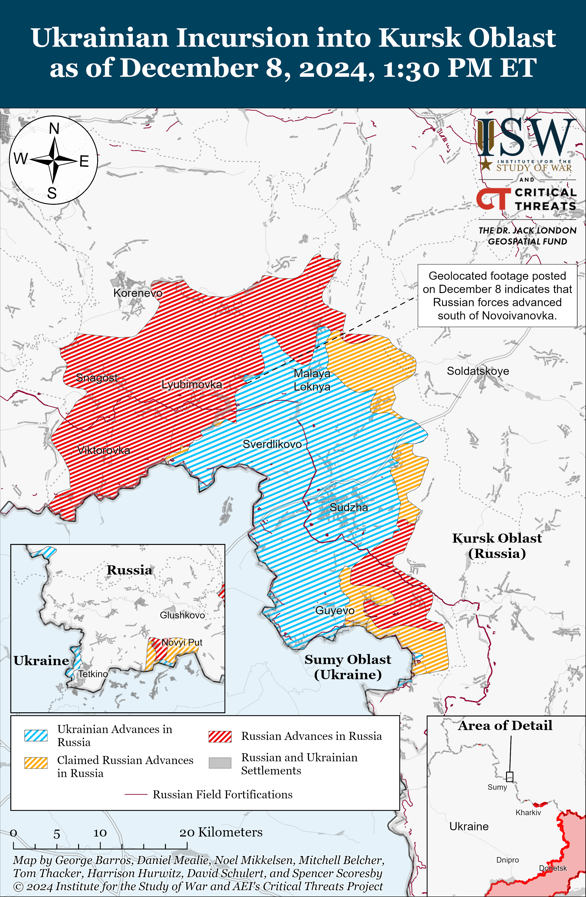
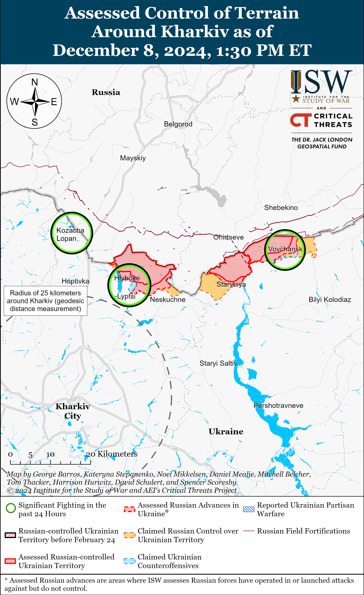
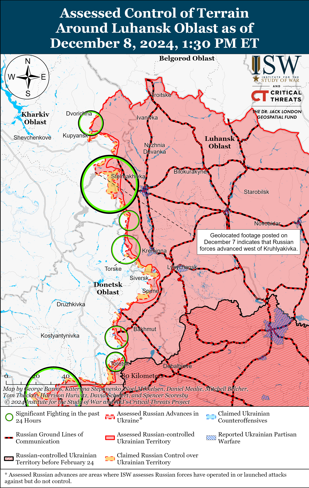
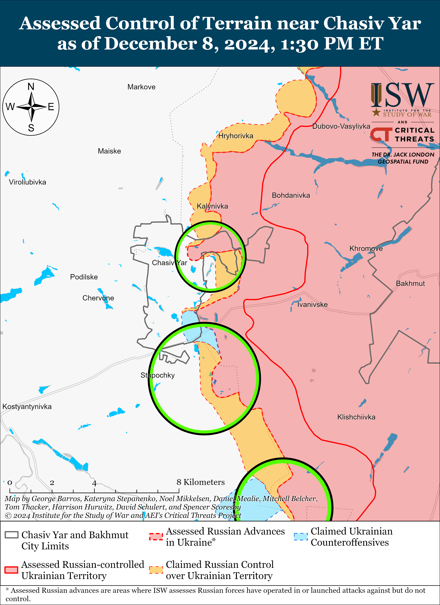
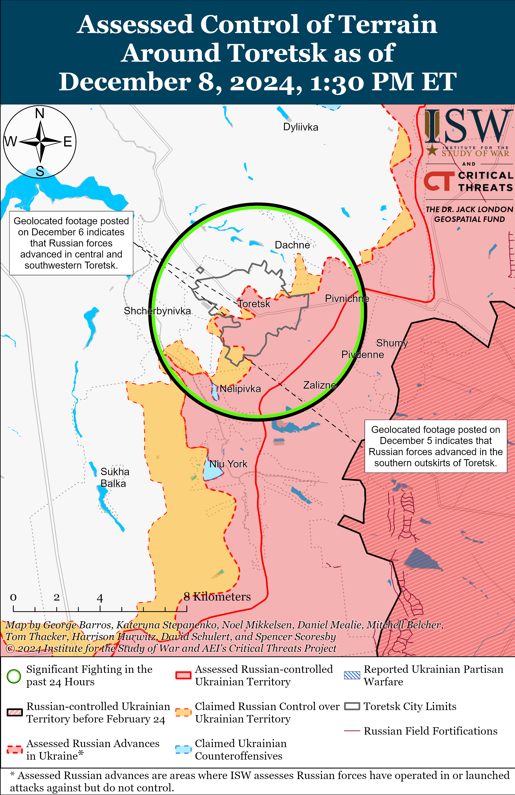
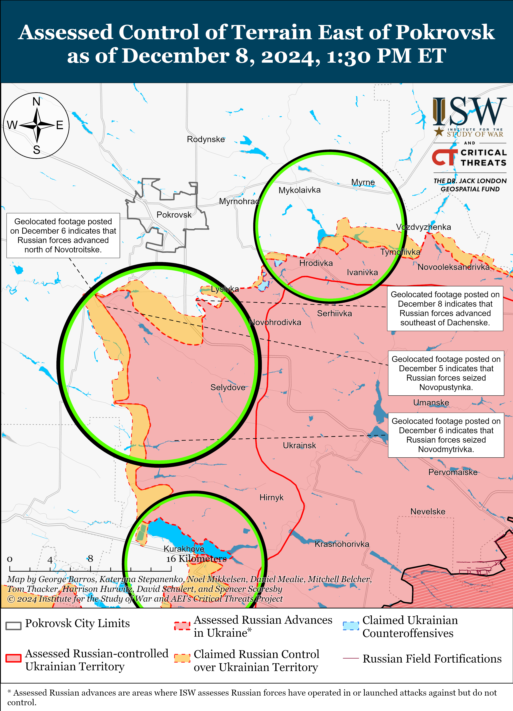
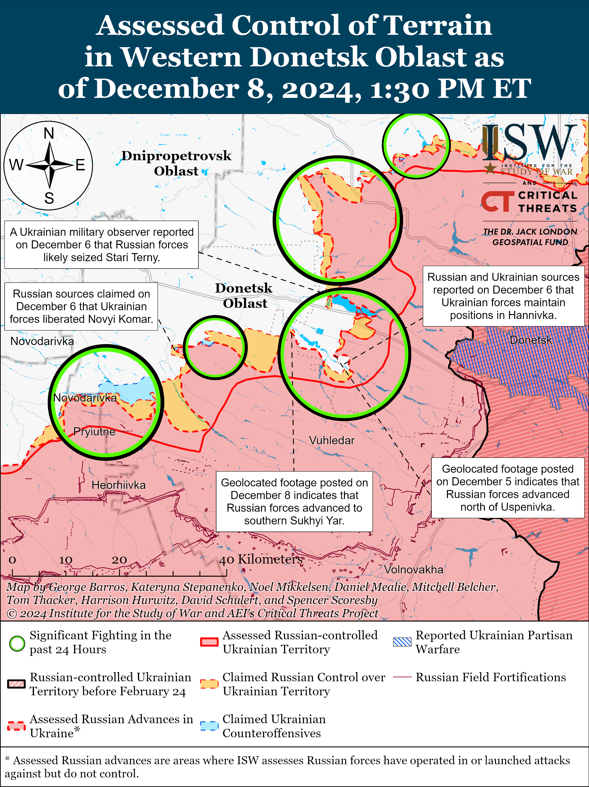
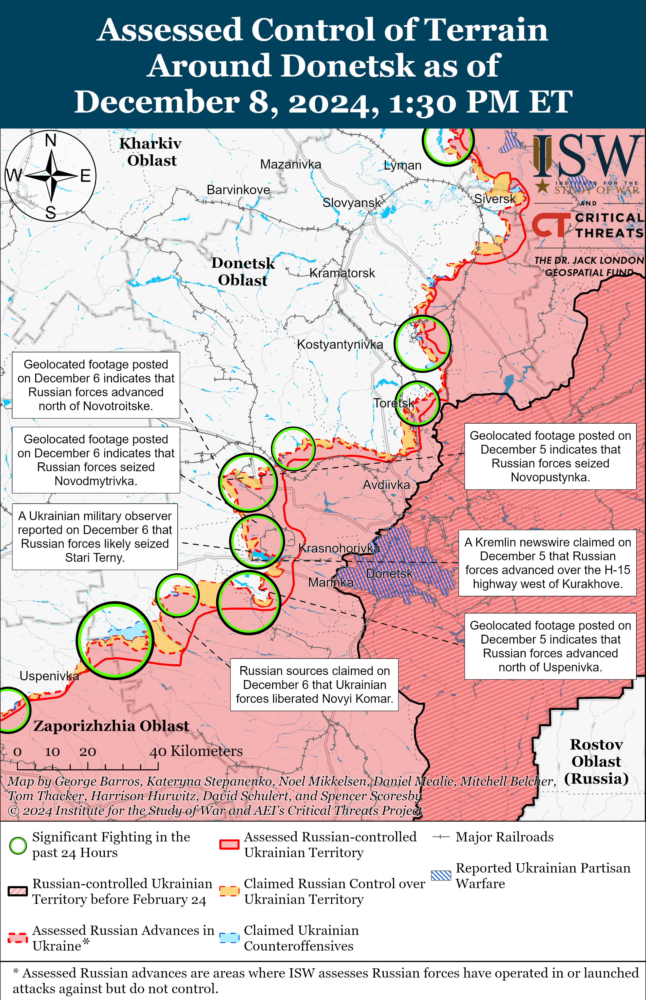
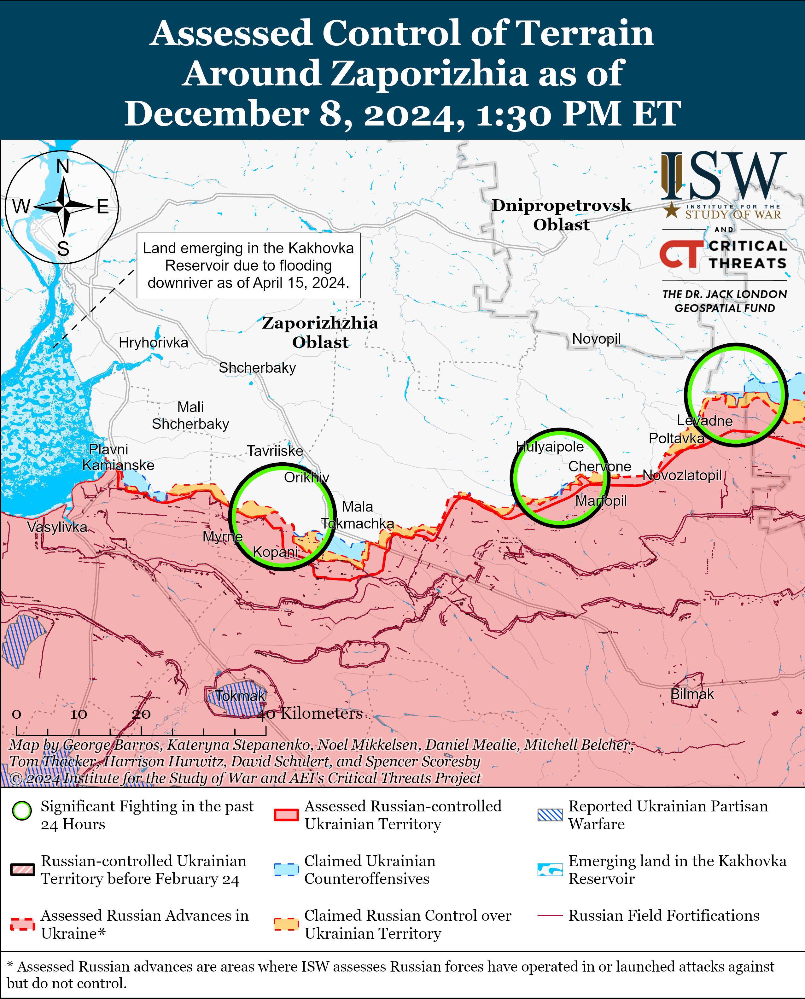
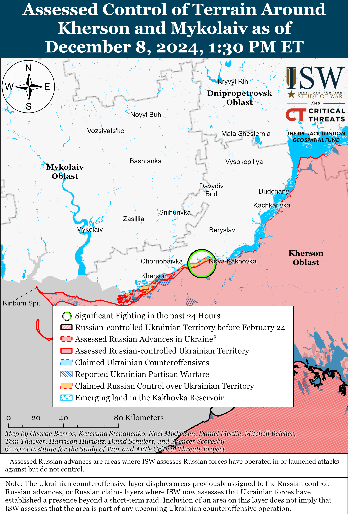

# Russian Offensive Campaign Assessment, December 8, 2024

**Christina Harward, Nicole Wolkov, Davit Gasparyan, Grace Mappes, and George Barros**

**December 8, 2024, 4:50 pm ET**

**Click** [**here**](https://storymaps.arcgis.com/stories/36a7f6a6f5a9448496de641cf64bd375) **to see ISW’s interactive map of the Russian invasion of Ukraine. This map is updated daily alongside the static maps present in this report.**

**Click** [**here**](https://understandingwar.maps.arcgis.com/apps/instant/3dviewer/index.html?appid=1602762dbcde419bb957dea358449580) **to see ISW’s 3D control of terrain topographic map of Ukraine. Use of a computer (not a mobile device) is strongly recommended for using this data-heavy tool.**

**Click** [**here**](https://storymaps.arcgis.com/stories/733fe90805894bfc8562d90b106aa895) **to access ISW’s archive of interactive time-lapse maps of the Russian invasion of Ukraine. These maps complement the static control-of-terrain map that ISW produces daily by showing a dynamic frontline. ISW will update this time-lapse map archive monthly.**

**Note: The data cut-off for this product was 11:30 am ET on December 8. ISW will cover subsequent reports in the December 9 Russian Offensive Campaign Assessment.**

**The rapid collapse of the Assad regime in Syria – a regime that the Kremlin helped prop up since 2015 – is a strategic political defeat for Moscow and has thrown the Kremlin into a crisis as it seeks to retain its strategic military basing in Syria.** Russia intervened on behalf of former Syrian President Bashar al Assad in 2015 in order to secure Assad’s regime after mass protests began in 2011 as part of the larger Arab Spring movement, which triggered the Syrian Civil War and threatened to oust Assad.[1] Russian President Vladimir Putin has long viewed the “color revolutions” that ushered in new democratic governments in former Soviet states as a threat to his own regime’s stability and security.[2] Putin has also more widely opposed democratic movements to oust Kremlin-allied authoritarian rulers worldwide as he views these movements as hindering his efforts to create his envisioned multipolar world where Russia and Russia’s key authoritarian allies and partners play a major role.[3] Russia’s inability or decision to not reinforce Assad’s regime as the Syrian opposition offensive made rapid gains throughout the country will also hurt Russia’s credibility as a reliable and effective security partner throughout the world, which will in turn negatively affect Putin’s ability to garner support throughout the world for his desired multipolar world.

Kremlin newswire *TASS* reported on December 8 that a Kremlin source stated that Assad and his family fled to Moscow and that Russian authorities granted them asylum.[4] Putin has been able to ensure the survivability of Assad himself, but Putin intervened in the Syrian Civil War with the primary objective of bolstering Assad’s regime and preventing his loss of power – an objective that the Kremlin has failed to achieve. Putin also intervened on behalf of Assad in 2015 to secure Russian military bases in Syria, support Russia’s wider efforts to project power in the Mediterranean and Red Seas, increase its global footprint in the Middle East and Africa, and threaten NATO’s southern flank. Russia is attempting to secure its bases in Syria as opposition forces come to power, but Russia’s continued military presence in the country is not guaranteed, especially as Russia’s actions in support of Assad over the past nine years have likely undermined Moscow’s ability to form a lasting, positive relationship with ruling Syrian opposition groups.[5]

**The Kremlin reportedly secured an agreement on December 8 with unspecified Syrian opposition leaders to ensure the security of Russian military bases in Syria, but the contours of this arrangement and its longevity remain unclear given the volatile and rapidly evolving political situation on the ground in Syria.** Kremlin newswire *TASS* reported on December 8 that a Kremlin source claimed that unspecified Syrian opposition leaders guaranteed the security of Russian military and diplomatic institutions in Syria.[6] *TASS*‘ssource did not specify if the Syrian opposition leaders only guaranteed the security of Russia’s two main military bases in Syria – Khmeimim Air Base near Latakia City and the naval base in the Port of Tartus – or other military bases and tactical outposts such as the Russian military base at the Qamishli Airport in northeastern Syria. Saudi-owned outlet *al Arabiy* reported on December 8 that Syrian Prime Minister Mohammad Ghazi al Jalali stated that the new Syrian authorities would make the decisions about the future of Russia’s military bases in Syria.[7] The Russian Ministry of Foreign Affairs (MFA) stated on December 8 that it was in contact with “all Syrian opposition groups” and noted that while all Russian military bases were on “high alert,” there were “no serious threats” to their safety.[8] Russian authorities have notably softened their language about Syrian opposition groups, with the Russian MFA referring to the actors opposing Assad’s Syrian Arab Army (SAA) as “opposition groups” – a notable shift from Russian Foreign Minister Sergei Lavrov’s reference to such groups, including Hayat Tahrir al Sham (HTS), as “terrorists” a day earlier on December 7 at the Doha Forum.[9] Russian state outlet *RIA Novosti* also notably referred to Syrian opposition groups as “armed opposition” in articles published on December 8 despite calling them “terrorists” in articles published on December 7.[10]

The Syrian opposition is not a monolith; it encompasses several different factions with varying ideologies and political objectives, and no single opposition faction controls the territory around all of Russia’s military bases and outposts in Al-Hasakah, Homs, Latakia, and Tartus governorates and beyond. It remains unclear how long cooperation amongst all the various Syrian opposition factions will last. It is also unclear if Moscow is in contact with all of the Syrian opposition factions necessary to guarantee the safety of Russian military bases in Syria. ISW previously observed reports that the Russian military redeployed some of its air defense assets protecting Khmeimim Air Base, indicating that the Russian command in Syria previously assessed that Russian military assets in Syria were not all secure.[11]

**ISW has collected strong indicators that Russia has been setting conditions to evacuate its military assets from Syria and that Russian military basing is not secure.** Satellite imagery collected on December 7 shows three Il-76 and one An-124 military transport aircraft at Russia’s Khmeimim Air Base, possibly in order to evacuate limited amounts of Russian military assets from the country.[12] The Kremlin would likely need to conduct a substantial number of airlift sorties to properly evacuate Syria. Geolocated footage published on December 6 showed Russian forces transporting S-300 or S-400 and Tor-M1 air defense systems near Baniyas along the M1 Lakatia-Tartus highway, possibly as part of a tactical redeployment or for evacuation out of Syria.[13] A Russian source claimed on December 8 that Russian forces “are leaving Syria completely” and withdrawing from Khmeimim Air Base and the Port of Tartus.[14] Russian milbloggers, including a servicemember in the Russian Aerospace Forces (VKS), claimed that some Russian forces withdrew to Latakia and Tartus governorates a few days ago and are leaving from the Port of Tartus and Khmeimim Air Base but that at least one group of Russian personnel were encircled in an unspecified area of Syria and awaiting help or a negotiated exit corridor, indicating that Russian forces abandoned tactical positions beyond the main Russian bases at the port in Tartus and Khmeimim Air Base.[15] A Kremlin-affiliated Russian milblogger claimed on December 8 that Russian operational groups withdrew from Deir ez Zor and the Kuweires Air Base east of Aleppo City and that the status of Russian forces operating near the oil fields near Palmyra remains unclear.[16] Ukraine’s Main Military Intelligence Directorate [GUR] stated on December 8 that Russia’s *Admiral Grigorovich* Grigorovich-class frigate and *Engineer Trubin* cargo ship left the Port of Tartus and that Russian forces are evacuating weapons from Khmeimim Air Base by air.[17] A Russian milblogger claimed that Turkey is allowing Russia to fly through Turkish airspace to evacuate Russian military assets from Syria.[18] It is unclear whether Russia will conduct withdrawals and evacuations from Syria following the *TASS* reporting on the evening of December 8 that Russia had secured guarantees for Russia’s military bases from Syrian opposition leaders. **Even if Russia maintains some or all of its bases in Syria, it is a major geopolitical loss for Moscow, as Russia’s continued basing in Syria will be at the mercy of Syrian opposition groups that the Kremlin previously used to call terrorists.**

**The loss of Russian bases in Syria will have major implications for Russia’s global military footprint and ability to operate in Africa.** Russia has leveraged its Tartus naval base to project power in the Mediterranean Sea, threaten NATO’s southern flank, and link its Black Sea assets to the Mediterranean Sea.[19] The loss of Russian bases in Syria will likely disrupt Russian logistics, resupply efforts, and Africa Corps rotations, particularly weakening Russia’s operations and power projection in Libya and sub-Saharan Africa. Russia could seek to leverage its presence in Libya or Sudan as alternatives, but the lack of formal agreements with these countries and insufficient infrastructure makes them inadequate substitutes. The collapse of Assad’s regime and Russia’s inability to preserve the regime will also damage Russia’s global image as a reliable ally, threatening its influence with African autocrats whom Russia seeks to support and its broader geopolitical objective to posture as a global superpower.

*The paragraph above was adapted from the Critical Threats Project’s (CTP) December 4 Africa File [Special Edition](https://understandingwar.org/backgrounder/africa-file-special-edition-syria%E2%80%99s-potential-impact-russia%E2%80%99s-africa-and-mediterranean "https://www.criticalthreats.org/analysis/africa-file-special-edition-syrias-potential-impact-on-russias-africa-and-mediterranean-ambitions").*

**Russian ultranationalist milbloggers – many of whom fought in or covered the Syrian war – are upset about the fall of the Assad regime, criticizing it as yet another failure of Russian foreign policy to exert and maintain influence in areas of strategic importance.** The Russian ultranationalist community broadly criticized the Assad regime for becoming complacent in recent years by allowing its military to degrade and rely on other countries, including Russia and Iran, to provide the Assad regime with defensive capabilities.[20] The milbloggers largely focused on the impact the regime’s collapse has on Russia, however, with some describing the fall of the Assad regime as a significant Russian foreign policy failure asRussia did not consistently work to increase Russian influence in the region or push the Assad regime to conduct governmental reforms under the Kremlin’s direction.[21] Some milbloggers criticized the Kremlin for not realizing that Assad’s military was degraded and that the opposition groups in Syria would likely someday renew offensive operations to exploit Russia’s “mistakes” in Syria, with one milblogger noting that Assad’s two major allies, Russia and Iran, are currently focusing on the wars in Ukraine and Israel and Lebanon, respectively.[22] One milblogger claimed that many Russian independent analysts and military correspondents had been warning about this possible course of action for years and reiterated longstanding ultranationalist complaints about the lack of a meaningful civil society in Russia to help avoid significant foreign policy failures.[23] A Kremlin-affiliated milblogger bemoaned the impact on Russia’s global image, claiming that Russia’s reputation is now entirely dependent on the outcome of its war in Ukraine, which is “more important [to Russia] than anything now.”[24]

**The US Department of Defense (DoD) announced on December 7 an additional military aid package for Ukraine worth $988 million.[25]** The package includes High Mobility Artillery Rocket Systems (HIMARS) ammunition; equipment and spare parts for artillery systems, tanks, and armored vehicles; and unmanned aerial systems (UAS). The US military aid package and continued Western support to Ukraine will help Ukrainian forces sustain the current tempo of operations across the theater of war which is destroying Russian combat power and degrading Russia’s economy at a rate Russia cannot afford to sustain across the long term.

**Russian authorities detained alleged terrorists in the Republic of Dagestan on December 7 amid growing Russian milblogger claims that the fall of former Syrian President Bashar al Assad’s regime in Syria will foster terrorism in Russia.** Russian media reported on December 7 that the Russian Federal Security Service (FSB) and Ministry of Internal Affairs (MVD) detained 12 members of an alleged terrorist cell group in the Republic of Dagestan who were reportedly planning a major terrorist attack in an unspecified location in Russia.[26] Russian authorities reportedly seized two improvised explosive devices and over one ton of ammonium nitrate, weapons, and ammunition.[27] These arrests notably follow a test of the Russian sovereign internet on December 7, which prevented users in the Republic of Dagestan from accessing foreign websites and messaging services, including Telegram and WhatsApp.[28] The arrests also come amid Russian milblogger reactions to recent events in Syria claiming that the fall of the Assad regime will serve to inspire and export terrorism globally, including to Russia.[29] A Russian milblogger claimed that this particular terrorist group in Dagestan was likely inspired by the situation in Syria, cautioning that terrorism recruitment may increase in the North Caucasus, particularly among Central Asian migrants.[30] ISW assesses that Russian authorities continue to grapple with the need to foster domestic stability and growing anti-migrant ultranationalist sentiments in Russia while relying on migrants to address Russia’s labor shortages.[31]

**Key Takeaways:**

- **The rapid collapse of the Assad regime in Syria – a regime that the Kremlin helped prop up since 2015 – is a strategic political defeat for Moscow and has thrown the Kremlin into a crisis as it seeks to retain its strategic military basing in Syria.**
- **The Kremlin reportedly secured an agreement on December 8 with unspecified Syrian opposition leaders to ensure the security of Russian military bases in Syria, but the contours of this arrangement and its longevity remain unclear given the volatile and rapidly evolving political situation on the ground in Syria.**
- **ISW has collected strong indicators that Russia has been setting conditions to evacuate its military assets from Syria and that Russian military basing is not secure. **Even if Russia maintains some or all of its bases in Syria, it is a major geopolitical loss for Moscow, as Russia’s continued basing in Syria will be at the mercy of Syrian opposition groups that the Kremlin previously used to call terrorists.****
- **The loss of Russian bases in Syria will have major implications for Russia’s global military footprint and ability to operate in Africa.**
- **Russian ultranationalist milbloggers – many of whom fought in or covered the Syrian war – are upset about the fall of the Assad regime, criticizing it as yet another failure of Russian foreign policy to exert and maintain influence in areas of strategic importance.**
- **The US Department of Defense (DoD) announced on December 7 an additional military aid package for Ukraine worth $988 million.**
- **Russian authorities detained alleged terrorists in the Republic of Dagestan on December 7 amid growing Russian milblogger claims that the fall of former Syrian President Bashar al Assad’s regime in Syria will foster terrorism in Russia.**
- **Russian forces recently advanced in Kursk Oblast and the Pokrovsk and Vuhledar directions.**
- **One of Russia’s largest microchip manufacturers has reportedly begun bankruptcy proceedings.**

***We do not report in detail on Russian war crimes because these activities are well-covered in Western media and do not directly affect the military operations we are assessing and forecasting. We will continue to evaluate and report on the effects of these criminal activities on the Ukrainian military and the Ukrainian population and specifically on combat in Ukrainian urban areas. We utterly condemn Russian violations of the laws of armed conflict and the Geneva Conventions and crimes against humanity even though we do not describe them in these reports.***

- Ukrainian Operations in the Russian Federation
- Russian Main Effort – Eastern Ukraine (comprised of three subordinate main efforts)
- Russian Subordinate Main Effort #1 – Push Ukrainian forces back from the international border with Belgorod Oblast and approach to within tube artillery range of Kharkiv City
- Russian Subordinate Main Effort #2 – Capture the remainder of Luhansk Oblast and push westward into eastern Kharkiv Oblast and encircle northern Donetsk Oblast
- Russian Subordinate Main Effort #3 – Capture the entirety of Donetsk Oblast
- Russian Supporting Effort – Southern Axis
- Russian Air, Missile, and Drone Campaign
- Russian Mobilization and Force Generation Efforts
- Russian Technological Adaptations
- Activities in Russian-occupied areas
- Significant Activity in Belarus

**Ukrainian Operations in the Russian Federation**

Russian forces recently advanced in the main Ukrainian salient in Kursk Oblast amid continued fighting in the area on December 8. Geolocated footage published on December 8 indicates that Russian forces recently advanced on the southern outskirts of Novoivanovka (southeast of Korenevo).[32] Russian milbloggers claimed that Russian forces recaptured Plekhovo (southeast of Sudzha), advanced towards Kurilovka (south of Sudzha) and Guevo (south of Sudzha), and advanced near Nizhny Klin (southeast of Korenevo).[33] A Russian source claimed that the frontline runs along the Psel River (west of Plekhovo).[34] ISW has not observed confirmation of these claims, however. Fighting continued southeast of Korenevo near Novoivanovka, southeast of Sudzha near Plekhovo, and south of Sudzha near Guevo on December 7 and 8.[35] A Russian milblogger claimed that Ukrainian forces are attacking with armored vehicles in order to gain a foothold on the southern outskirts of Darino (southeast of Korenevo).[36] The milblogger claimed that Ukrainian forces are operating in Pogrebki (northwest of Sudzha) after unsuccessful Russian attacks towards Novaya Sorochina and Staraya Sorochina (both just south of Pogrebki) that forced Russian forces to withdraw to the outskirts of Pogrebki. The spokesperson for a Ukrainian brigade operating in Kursk Oblast reported on December 8 that Russian forces have intensified their offensive operations in Kursk Oblast after a period of relative calm.[37] The spokesperson stated that elements of the Russian 155th Naval Infantry Brigade (Pacific Fleet, Eastern Military District [EMD]), which are well-trained and equipped, are the main force conducting assaults and that Russian forces are using armored personnel carriers and armored fighting vehicles after having not used heavy equipment for the past two to three weeks (since about November 17 to 24). Drone operators of the Russian 83rd Airborne (VDV) Brigade are reportedly operating near Darino.[38]

**Russian Main Effort – Eastern Ukraine**

**Russian Subordinate Main Effort #1 – Kharkiv Oblast (Russian objective: Push Ukrainian forces back from the international border with Belgorod Oblast and approach to within tube artillery range of Kharkiv City)**

Russian forces continued offensive operations north of Kharkiv City near Vysoka Yaruha and Lyptsi and northeast of Kharkiv City near Vovchansk on December 8 but did not make any confirmed advances.[39] Ukrainian Kharkiv Group of Forces Spokesperson Lieutenant Colonel Yevheniy Romanov stated on December 8 that the number of Russian assaults and guided glide bomb strikes in northern Kharkiv Oblast are decreasing, possibly because the Russian military is concentrating forces and resources in other areas of the frontline.[40] Elements of the Chechen “Gyutner” Group of Akhmat Spetsnaz forces are reportedly operating in Shebekino, Belgorod Oblast (just north of Vovchansk across the international border).[41]

**Russian Subordinate Main Effort #2 – Luhansk Oblast (Russian objective: Capture the remainder of Luhansk Oblast and push westward into eastern Kharkiv Oblast and northern Donetsk Oblast)**

Russian forces continued offensive operations along the Kupyansk-Svatove-Kreminna line on December 8 but did not make any confirmed advances. Russian milbloggers claimed that Russian forces advanced southeast of Zahyrzove (southeast of Kupyansk) and up to one kilometer near Pershotravneve (west of Svatove), but ISW has not observed confirmation of these claims.[42] Russian forces conducted offensive operations northeast of Kupyansk near Masyutivka; southeast of Kupyansk towards Bohuslavka and near Pishchane, Kolisnykivka, Lozova, Zahryzove, and Hlushkivka; west of Svatove near Zeleny Hai, Kopanky, and Nadiya; southwest of Svatove near Druzhelyubivka, Tverdokhlibove, and Cherneshchyna; northwest of Kreminna near Yampolivka, Makiivka, and Hrekivka; west of Kreminna near Zarichne and Terny; and southwest of Kreminna near the Serebryanske forest area on December 7 and 8.[43] Russian milbloggers claimed that Ukrainian forces counterattacked near Kucherivka (just east of Kupyansk) and in unspecified areas near the Oskil River.[44] The spokesperson of a Ukrainian brigade operating in the Lyman direction stated that Russian forces are using armored vehicles less than they were a week ago (around December 1) and that Russian infantry with varying levels of training are conducting assaults in the area.[45] Drone operators of the Russian 16th Spetsnaz Brigade (Russian General Staff’s Main Directorate [GRU]) are reportedly operating near Novovodyane (southwest of Svatove).[46]

**Russian Subordinate Main Effort #3 – Donetsk Oblast (Russian objective: Capture the entirety of Donetsk Oblast, the claimed territory of Russia’s proxies in Donbas)**

A Russian milblogger claimed that positional fighting continued in the Siversk direction on December 8, but Russian forces did not make any confirmed advances.[47]

Russian forces continued offensive operations in the Chasiv Yar direction on December 8 but did not make any confirmed advances. Russian forces attacked within Chasiv Yar in Novyi Microraion and near the Refractory Plant; north of Chasiv Yar near Kalynivka; and south of Chasiv Yar near Stupochky and Bila Hora on December 7 and 8.[48] An officer of a Ukrainian brigade operating in the Chasiv Yar direction stated that Russian forces are using small infantry groups as sabotage and reconnaissance groups to attack Ukrainian forces from the rear.[49] The officer stated that Russian forces have not deployed new units to the Chasiv Yar area because the Russian military currently has enough reserves in the area to maintain their current tempo of offensive operations. Elements of the Russian 98th Airborne (VDV) Division reportedly continue assaults at the Chasiv Yar Refractory Plant.[50]

Russian forces continued offensive operations in the Toretsk direction on December 8 but did not make any confirmed advances. Russian forces continued attacking within and near Toretsk itself; north of Toretsk near Dyliivka; west of Toretsk near Shcherbynivka; and southwest of Toretsk near Nelipivka and Leonidivka on December 7 and 8.[51]

Russian forces recently advanced in the Pokrovsk direction amid continued Russian offensive operations in the area on December 8. Geolocated footage published on December 7 and 8 indicates that Russian forces recently advanced east of Ukrainka (southwest of Pokrovsk) and southeast of Dachenske (southeast of Pokrovsk).[52] Russian milbloggers claimed that Russian forces seized Novotroitske (southwest of Pokrovsk) and advanced within Shevchenko and Zelene (both south of Pokrovsk) and southeast of Novotroitske.[53] ISW has not observed confirmation of these claims. Russian forces continued attacking east of Pokrovsk near Myrolyubivka, Myrnohrad, Hrodivka, and Promin; southeast of Pokrovsk near Lysivka and Sukhyi Yar; south of Pokrovsk near Zhovte, Dachenske, Pushkine, Shevchenko, Novyi Trud, and Zelene; and southwest of Pokrovsk near Novotroitske on December 7 and 8.[54]

Russian forces continued offensive operations in the Kurakhove direction on December 8 but did not advance. A Russian milblogger claimed on December 8 that Russian forces advanced north of the Vovcha River and seized the fields between Sontsivka (northwest of Kurakhove) and Stari Terny (northwest of Kurakhove on the northern shore of the Kurakhivske Reservoir).[55] ISW has not observed confirmation of these claims, however. Russian forces conducted offensive operations near Kurakhove itself; northwest of Kurakhove near Sontsivka, Zorya, and Stari Terny; west of Kurakhove near Dachne; east of Kurakhove near Maksymilyanivka; and south of Kurakhove near Dalne on December 7 and 8.[56] Drone operators of the 3rd Battalion of the Russian 68th Tank Regiment (150th Motorized Rifle Division, 8th Combined Arms Army [CAA], Southern Military District [SMD]) are reportedly operating near Kurakhove.[57]

Russian forces recently advanced in the Vuhledar direction amid continued offensive operations on December 8. Geolocated footage published on December 8 indicates that Russian forces marginally advanced to southern Sukhi Yaly (northwest of Vuhledar).[58] A Russian milblogger claimed on December 8 that Russian forces entered Hihant (northwest of Vuhledar) and that Russian forces are clearing fields between Sukhi Yaly (northwest of Hihant) and Kostyantynopolske (east of Hihant).[59] ISW has not observed confirmation of these claims, however. Russian forces conducted offensive operations northeast of Vuhledar near Katerynivka, Antonivka, Yelizavetivka, and Romanivka; north of Vuhledar near Hannivka, Vesely Hai, and Uspenivka; and northwest of Vuhledar near Sukhi Yaly, Kostyantynopolske, and Rozlyv on December 7 and 8.[60]

Russian forces continued offensive operations near Velyka Novosilka on December 8 but did not make any confirmed advances. The Russian Ministry of Defense (MoD) claimed on December 8 that Russian forces seized Blahodatne (south of Velyka Novosilka), but ISW has not observed confirmation of this claim.[61] Russian forces conducted offensive operations near Velyka Novosilka itself; west of Velyka Novosilka near Novosilka and towards Temyrivka; southwest of Velyka Novosilka near Novodarivka; south of Velyka Novosilka near Blahodatne and Neskuchne; and northeast of Velyka Novosilka near Rozdolne on December 7 and 8.[62] A Russian milblogger claimed on December 8 that Ukrainian forces are counterattacking near Blahodatne.[63] Elements of the Russian 60th Motorized Rifle Brigade (5th CAA, Eastern Military District [EMD]) are reportedly operating near Blahodatne.[64]

**Russian Supporting Effort – Southern Axis (Russian objective: Maintain frontline positions and secure rear areas against Ukrainian strikes)**

Russian forces conducted offensive operations in western Zaporizhia Oblast northwest of Robotyne near Nesteryanka and north of Robotyne near Novodanylivka on December 7 and 8 but did not make any confirmed advances.[65]

Russian forces continued offensive operations in the Dnipro direction on December 8 but did not make any confirmed advances.[66] The Ukrainian Volunteer Army’s Southern Group of Forces Spokesperson Serhiy Bratchuk stated that Russian forces have been trying to reach Ukrainian-controlled islands in the Dnipro River Delta for more than a month (since about November 8).[67]

**Russian Air, Missile, and Drone Campaign (Russian Objective: Target Ukrainian military and civilian infrastructure in the rear and on the frontline)**

Russian forces conducted a series of drone strikes against Ukraine overnight on December 7 to 8. The Ukrainian Air Force reported that Russian forces launched 74 Shahed and other unspecified drones (possibly referring to decoys) from Millerovo, Rostov Oblast; Primorsko-Akhtarsk, Krasnodar Krai; and Bryansk, Kursk, and Oryol Oblasts overnight.[68] The Ukrainian Air Force stated that Ukrainian forces downed 28 Russian drones over Kyiv, Kharkiv, Sumy, Poltava, Cherkasy, Kirovohrad, Dnipropetrovsk, and Zaporizhia oblasts and that 46 drones were “lost,” likely due to Ukrainian electronic warfare (EW) interference or faulty drone components. Ukrainian officials reported that falling drone debris damaged a house in Kamyanske, Dnipropetrovsk Oblast.[69]

**Russian Mobilization and Force Generation Efforts (Russian objective: Expand combat power without conducting general mobilization)**

One of Russia’s largest microchip manufacturers has reportedly begun bankruptcy proceedings. Russian independent outlet *Moscow Times* reported on December 6 that Angstrem, one of Russia’s largest microchip manufacturers, has begun bankruptcy proceedings after accumulating at least one billion rubles (about $10.1 million) of debt.[70] The *Moscow Times* noted that the Russian state had backed Angstrem to develop Russia’s domestic production of microchips, especially as Western sanctions are impeding Russia’s ability to import microchips or microchip components.

**Russian Technological Adaptations (Russian objective: Introduce technological innovations to optimize systems for use in Ukraine)**

Nothing significant to report.

**Activities in Russian-occupied areas (Russian objective: Consolidate administrative control of annexed areas; forcibly integrate Ukrainian citizens into Russian sociocultural, economic, military, and governance systems)**

*ISW is not reporting on activities in Russian-occupied areas today.*

**Significant activity in Belarus (Russian efforts to increase its military presence in Belarus and further integrate Belarus into Russian-favorable frameworks and Wagner Group activity in Belarus)**

Nothing significant to report.

**Note: ISW does not receive any classified material from any source, uses only publicly available information, and draws extensively on Russian, Ukrainian, and Western reporting and social media as well as commercially available satellite imagery and other geospatial data as the basis for these reports. References to all sources used are provided in the endnotes of each update.**

[1] https://understandingwar.org/wp-content/uploads/2024/12/The20Russian20MilitaryE28099s20Lessons20Learned20in20Syria\_0.pdf

[2] https://understandingwar.org/backgrounder/weakness-lethal-why-putin-invaded-ukraine-and-how-war-must-end ; https://understandingwar.org/report/confronting-russian-challenge ; https://apps.dtic.mil/sti/tr/pdf/AD1045875.pdf

[3] https://www.nytimes.com/2022/02/27/briefing/putin-democracy-ukraine.html; https://understandingwar.org/backgrounder/russia-poses-long-term-threats-moldova%E2%80%99s-european-integration-beyond-october-elections; https://understandingwar.org/backgrounder/warning-transnistria-may-organize-referendum-annexation-russia-support-russian-hybrid; https://understandingwar.org/backgrounder/russia-or-west-stakes-georgia%E2%80%99s-election; https://understandingwar.org/report/how-we-got-here-russia-kremlins-worldview

[4] https://tass dot ru/mezhdunarodnaya-panorama/22612655

[5] https://tass dot ru/mezhdunarodnaya-panorama/22612661

[6] https://tass dot ru/mezhdunarodnaya-panorama/22612661

[7] https://www.rbc dot ru/politics/08/12/2024/675546039a7947788ef3dd59 ; https://www.alarabiya dot net/arab-and-world/syria/2024/12/08/%D8%B1%D8%A6%D9%8A%D8%B3-%D8%A7%D9%84%D8%AD%D9%83%D9%88%D9%85%D8%A9-%D8%A7%D9%84%D8%B3%D9%88%D8%B1%D9%8A%D8%A9-%D9%85%D8%B3%D8%AA%D8%B9%D8%AF%D9%88%D9%86-%D9%84%D9%84%D8%AA%D8%B9%D8%A7%D9%88%D9%86-%D9%85%D8%B9-%D8%A3%D9%8A-%D9%82%D9%8A%D8%A7%D8%AF%D8%A9-%D9%8A%D8%AE%D8%AA%D8%A7%D8%B1%D9%87%D8%A7-%D8%A7%D9%84%D8%B4%D8%B9%D8%A8

[8] https://t.me/MID\_Russia/49342

[9] https://t.me/MID\_Russia/49335

[10] https://ria dot ru/20241208/siriya-1988029577.html ; https://ria dot ru/20241208/siriya-1988029999.html ; https://ria dot ru/20241207/siriya-1987866613.html ; https://ria dot ru/20241207/siriya-1987866613.html

[11] https://isw.pub/UkrWar120624

[12] https://x.com/thewarzonewire/status/1865490595948728428

[13] https://isw.pub/UkrWar120624

[14] https://t.me/notes\_veterans/20937

[15] https://t.me/rybar/66134; https://t.me/razvedosaa/11878 ; https://t.me/istories\_media/8448; https://t.me/fighter\_bomber/19040; https://t.me/motopatriot/30178

[16] https://t.me/rybar/66141

[17] https://t.me/DIUkraine/4984

[18] https://t.me/DnevnikDesantnika/20547

[19] https://understandingwar.org/backgrounder/africa-file-special-edition-syria%E2%80%99s-potential-impact-russia%E2%80%99s-africa-and-mediterranean

[20] https://t.me/boris\_rozhin/146665; https://t.me/bayraktar1070/3057; https://t.me/kremlin\_sekret/16574; https://t.me/Taynaya\_kantselyariya/11562; https://t.me/rybar/66085; https://t.me/vysokygovorit/18248; https://t.me/rybar/66152; https://t.me/dva\_majors/59665 ; https://t.me/sashakots/50622

[21] https://t.me/kremlin\_sekret/16574; https://t.me/Taynaya\_kantselyariya/11562; https://t.me/rybar/66085; https://t.me/vysokygovorit/18248; https://t.me/rybar/66141; https://t.me/inners\_of\_the\_politics/182; https://t.me/dva\_majors/59665 ; https://t.me/sashakots/50622

[22] https://t.me/rybar/66145; https://t.me/MedvedevVesti/19349; https://t.me/boris\_rozhin/146665; https://t.me/bayraktar1070/3057

[23] https://t.me/rybar/66145; https://t.me/MedvedevVesti/19349

[24] https://t.me/sashakots/50622

[25] https://www.defense.gov/News/Releases/Release/Article/3989537/biden-administration-announces-new-security-assistance-package-for-ukraine/

[26] https://www.rbc dot ru/politics/07/12/2024/675498db9a79470aee8f907d; https://t.me/tass\_agency/289626

[27] https://www.rbc dot ru/politics/07/12/2024/675498db9a79470aee8f907d

[28] https://understandingwar.org/backgrounder/russian-offensive-campaign-assessment-december-7-2024

[29] https://t.me/wargonzo/23590; https://t.me/rybar/66145; https://t.me/MedvedevVesti/19349; https://t.me/dva\_majors/59665; https://t.me/MedvedevVesti/19349 ; https://t.me/rybar/66077

[30] https://t.me/wargonzo/23590;

[31] https://understandingwar.org/backgrounder/russian-offensive-campaign-assessment-november-8-2024; https://isw.pub/UkrWar071924 ; https://isw.pub/UkrWar071524 ; https://isw.pub/UkrWar062824 ; https://isw.pub/UkrWar06272024 ; https://isw.pub/UkrWar041024

[32] https://t.me/WarArchive\_ua/23275; https://t.me/brygada47/1093

[33] https://t.me/boris\_rozhin/147138; https://t.me/z\_arhiv/29991; https://t.me/DnevnikDesantnika/20539; https://t.me/DnevnikDesantnika/20559; https://t.me/z\_arhiv/29988; https://t.me/motopatriot/30177; https://t.me/milinfolive/137054

[34] https://t.me/milinfolive/137054

[35] https://t.me/rybar/66126; https://t.me/boris\_rozhin/147135

[36] https://t.me/rybar/66126

[37] https://www.youtube.com/watch?v=BDkyj0TJFoA&ab\_channel=%D0%A4%D0%B0%D0%BA%D1%82%D0%B8ICTV ; https://armyinform.com dot ua/2024/12/08/morpihy-hvoroyi-lyudyny-na-kurshhyni-rosiyany-atakuyut-brygadoyu-vyrodkiv/

[38] https://t.me/rybar/66126

[39] https://www.facebook.com/GeneralStaff.ua/posts/pfbid02tXTjA4V5eth3TvkeG5eoddzSGV3HAS6NHdV5gvjghN9j7PHzL9B6u4iHNSZ7CFdTl ; https://t.me/dva\_majors/59665 ; https://t.me/Sladkov\_plus/12004

[40] https://armyinform.com dot ua/2024/12/08/vyzdyhaly-na-slobozhanshhyni-bojova-aktyvnist-voroga-zmenshylasya/

[41] https://t.me/RKadyrov\_95/5308

[42] https://t.me/DnevnikDesantnika/20529; https://t.me/DnevnikDesantnika/20524

[43] https://www.facebook.com/GeneralStaff.ua/posts/pfbid02tXTjA4V5eth3TvkeG5eoddzSGV3HAS6NHdV5gvjghN9j7PHzL9B6u4iHNSZ7CFdTl ; https://www.facebook.com/GeneralStaff.ua/posts/pfbid02ZAfxYS495zQGSFwxdPL7WwspbhBB7R35dAqy6yZxWY2z6xDBNNUcZabtzRNeu25bl; https://www.facebook.com/GeneralStaff.ua/posts/pfbid02NWempJNRbysAfcGZFiawaozKf65fG97GgnRWiQDbKybzqKs67qEp6f9cCqbqK4SNl

[44] https://t.me/DnevnikDesantnika/20529; https://t.me/DnevnikDesantnika/20524

[45] https://youtu.be/QZq3QTALwEs; https://armyinform.com dot ua/2024/12/08/pogoda-pogana-ale-vorogu-shhe-girshe-nashi-piloty-navchylysya-dobre-praczyuvaty-u-skladnyh-meteoumovah/

[46] https://t.me/voin\_dv/12165

[47] https://t.me/DnevnikDesantnika/20543

[48] https://www.facebook.com/GeneralStaff.ua/posts/pfbid02tXTjA4V5eth3TvkeG5eoddzSGV3HAS6NHdV5gvjghN9j7PHzL9B6u4iHNSZ7CFdTl ; https://www.facebook.com/GeneralStaff.ua/posts/pfbid02NWempJNRbysAfcGZFiawaozKf65fG97GgnRWiQDbKybzqKs67qEp6f9cCqbqK4SNl ; https://t.me/DnevnikDesantnika/20524 ; https://t.me/DnevnikDesantnika/20569 ; https://t.me/dva\_majors/59665 ; https://t.me/wargonzo/23574

[49] https://armyinform.com dot ua/2024/12/08/za-czinoyu-ne-stoyat-vorogu-poky-vystachaye-rezerviv-dlya-atak-na-chasiv-yar/

[50] https://t.me/DnevnikDesantnika/20524

[51] https://www.facebook.com/GeneralStaff.ua/posts/pfbid02tXTjA4V5eth3TvkeG5eoddzSGV3HAS6NHdV5gvjghN9j7PHzL9B6u4iHNSZ7CFdTl ; https://www.facebook.com/GeneralStaff.ua/posts/pfbid02NWempJNRbysAfcGZFiawaozKf65fG97GgnRWiQDbKybzqKs67qEp6f9cCqbqK4SNl ; https://t.me/dva\_majors/59665 ; https://t.me/wargonzo/23574 ; https://t.me/rybar/66150

[52] (Ukrainka) https://t.me/DeepStateUA/20844; https://t.me/creamy\_caprice/7756

(Dachenske) https://t.me/ombrstarichi65/101; https://t.me/creamy\_caprice/7758

[53] https://t.me/voenkorKotenok/60588 ; https://t.me/voenkorKotenok/60592 ; https://t.me/motopatriot/30179

[54] https://www.facebook.com/GeneralStaff.ua/posts/pfbid02tXTjA4V5eth3TvkeG5eoddzSGV3HAS6NHdV5gvjghN9j7PHzL9B6u4iHNSZ7CFdTl ; https://www.facebook.com/GeneralStaff.ua/posts/pfbid02ZAfxYS495zQGSFwxdPL7WwspbhBB7R35dAqy6yZxWY2z6xDBNNUcZabtzRNeu25bl ; https://www.facebook.com/GeneralStaff.ua/posts/pfbid02NWempJNRbysAfcGZFiawaozKf65fG97GgnRWiQDbKybzqKs67qEp6f9cCqbqK4SNl

[55] https://t.me/boris\_rozhin/147169

[56] https://www.facebook.com/GeneralStaff.ua/posts/pfbid02tXTjA4V5eth3TvkeG5eoddzSGV3HAS6NHdV5gvjghN9j7PHzL9B6u4iHNSZ7CFdTl; https://www.facebook.com/GeneralStaff.ua/posts/pfbid02ZAfxYS495zQGSFwxdPL7W

[57] https://t.me/voin\_dv/12164; https://t.me/senatnow/4020

[58] https://t.me/creamy\_caprice/7757; https://www.facebook.com/watch/?v=587273367037851

[59] https://t.me/voenkorKotenok/60598

[60] https://www.facebook.com/GeneralStaff.ua/posts/pfbid02tXTjA4V5eth3TvkeG5eoddzSGV3HAS6NHdV5gvjghN9j7PHzL9B6u4iHNSZ7CFdTl  ; https://www.facebook.com/GeneralStaff.ua/posts/pfbid02ZAfxYS495zQGSFwxdPL7WwspbhBB7R35dAqy6yZxWY2z6xDBNNUcZabtzRNeu25bl ;

[61] https://t.me/mod\_russia/46637; https://t.me/voin\_dv/12170

[62] https://t.me/boris\_rozhin/147169; https://www.facebook.com/GeneralStaff.ua/posts/pfbid02tXTjA4V5eth3TvkeG5eoddzSGV3HAS6NHdV5gvjghN9j7PHzL9B6u4iHNSZ7CFdTl  ; https://www.facebook.com/GeneralStaff.ua/posts/pfbid02ZAfxYS495zQGSFwxdPL7WwspbhBB7R35dAqy6yZxWY2z6xDBNNUcZabtzRNeu25bl ; https://www.facebook.com/GeneralStaff.ua/posts/pfbid02NWempJNRbysAfcGZFiawaozKf65fG97GgnRWiQDbKybzqKs67qEp6f9cCqbqK4SNl

[63] https://t.me/voin\_dv/12170

[64] https://t.me/voenkorKotenok/60587; https://t.me/voin\_dv/12166 ; https://t.me/voin\_dv/12169 ; https://t.me/voenkorKotenok/60594

[65] https://www.facebook.com/GeneralStaff.ua/posts/pfbid02tXTjA4V5eth3TvkeG5eoddzSGV3HAS6NHdV5gvjghN9j7PHzL9B6u4iHNSZ7CFdTl; https://www.facebook.com/GeneralStaff.ua/posts/pfbid02ZAfxYS495zQGSFwxdPL7WwspbhBB7R35dAqy6yZxWY2z6xDBNNUcZabtzRNeu25bl

[66] https://www.facebook.com/GeneralStaff.ua/posts/pfbid02tXTjA4V5eth3TvkeG5eoddzSGV3HAS6NHdV5gvjghN9j7PHzL9B6u4iHNSZ7CFdTl ; https://www.facebook.com/GeneralStaff.ua/posts/pfbid02ZAfxYS495zQGSFwxdPL7WwspbhBB7R35dAqy6yZxWY2z6xDBNNUcZabtzRNeu25bl ; https://www.facebook.com/GeneralStaff.ua/posts/pfbid02NWempJNRbysAfcGZFiawaozKf65fG97GgnRWiQDbKybzqKs67qEp6f9cCqbqK4SNl

[67] https://www.youtube.com/watch?v=QZq3QTALwEs&ab\_channel=%D0%90%D1%80%D0%BC%D1%96%D1%8FTV%E2%80%93%D0%92%D1%96%D0%B9%D1%81%D1%8C%D0%BA%D0%BE%D0%B2%D0%B5%D1%82%D0%B5%D0%BB%D0%B5%D0%B1%D0%B0%D1%87%D0%B5%D0%BD%D0%BD%D1%8F%D0%A3%D0%BA%D1%80%D0%B0%D1%97%D0%BD%D0%25; https://armyinform.com dot ua/2024/12/08/stvorennya-kerovanogo-haosu-na-pivdni-vorog-prodovzhuye-teroryzuvaty-myrne-naselennya/

[68] https://t.me/kpszsu/24291

[69] https://t.me/kpszsu/24291; https://t.me/dnipropetrovskaODA/17930

[70] https://www.moscowtimes dot ru/2024/12/06/v-rossii-nachalos-krupneishee-bankrotstvo-zavoda-chipov-a149900
