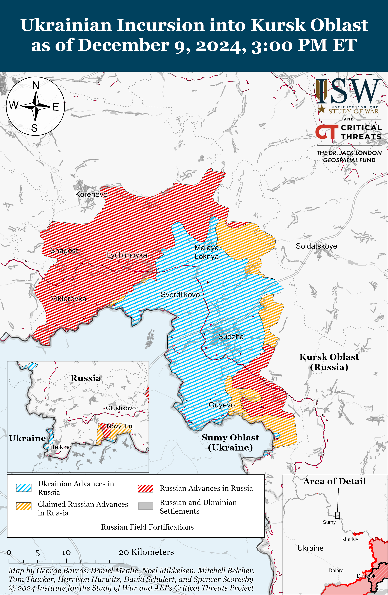
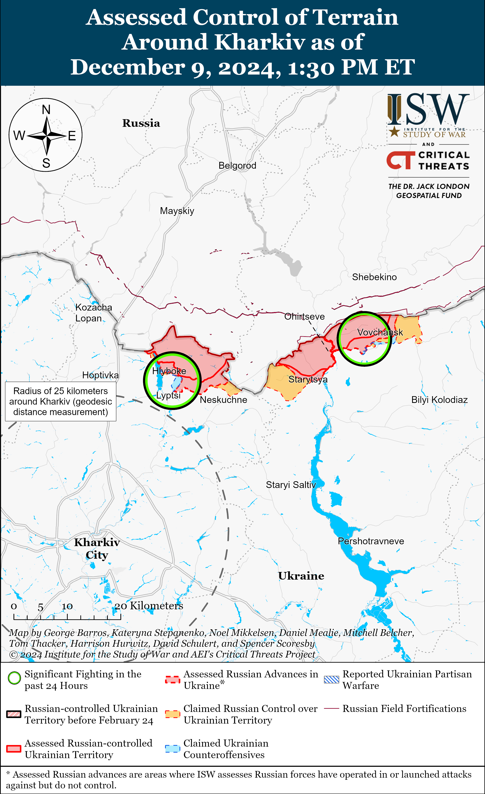
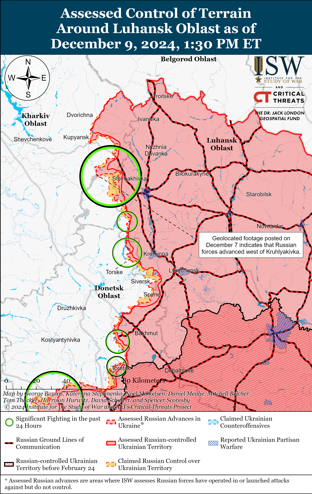
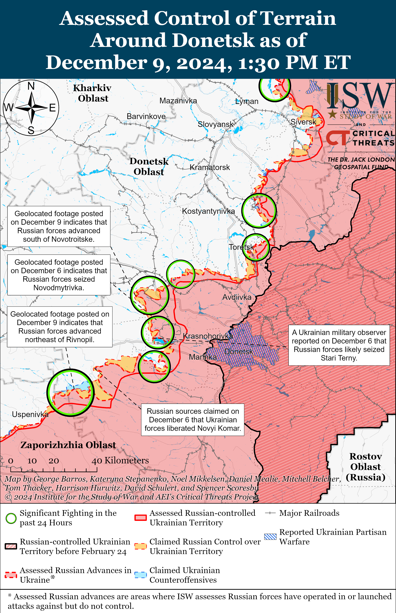
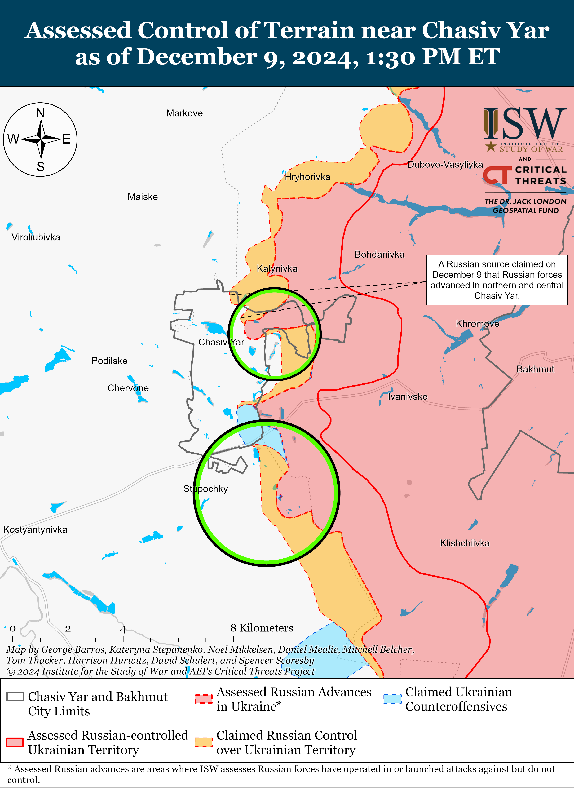
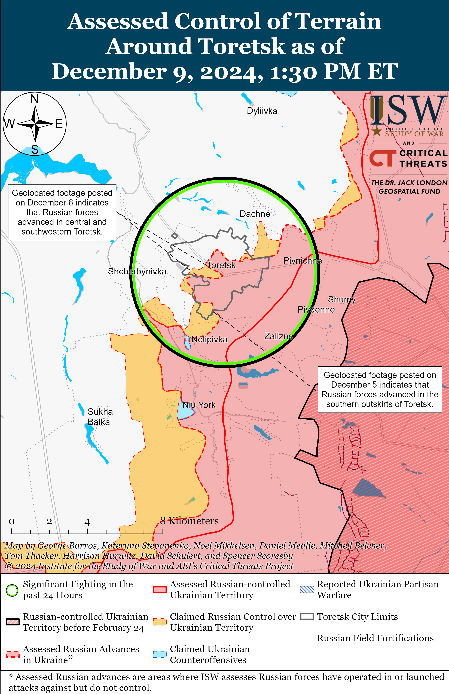
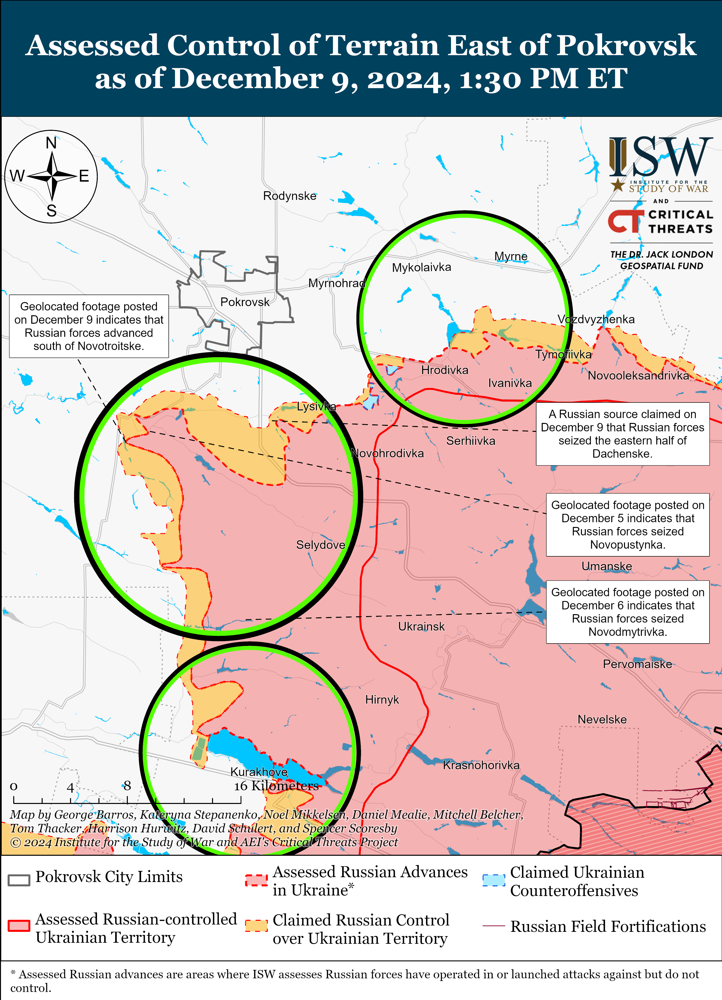
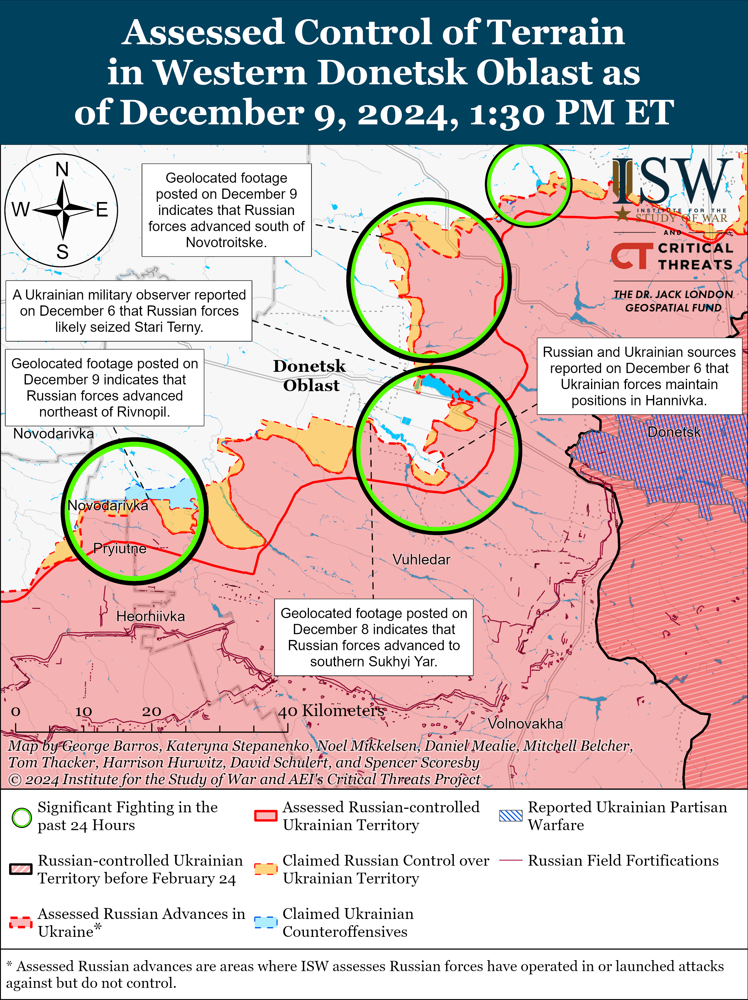
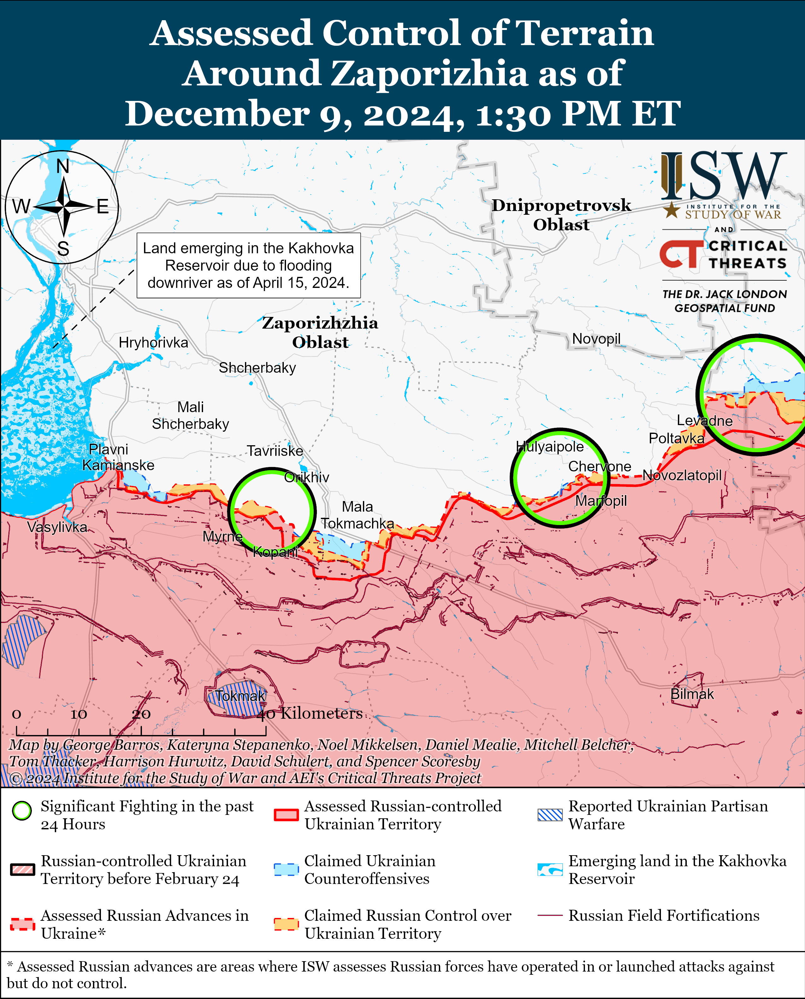
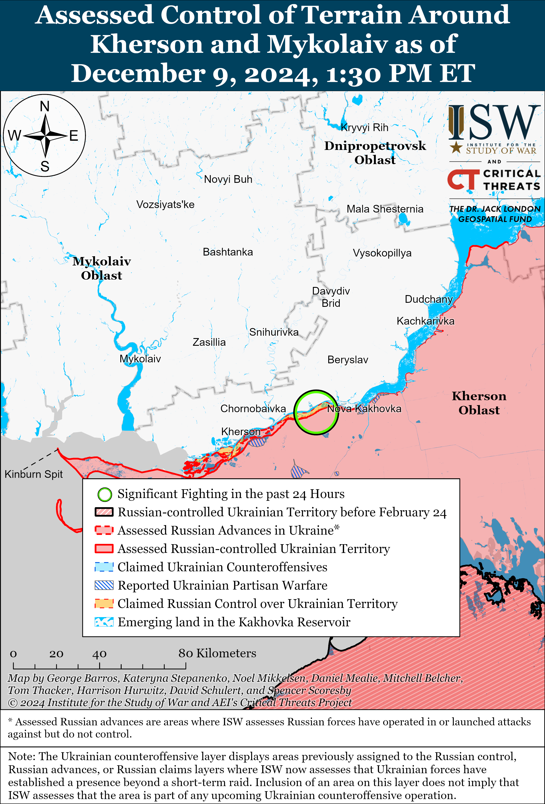

# Russian Offensive Campaign Assessment, December 9, 2024

**Nicole Wolkov, Christina Harward, Davit Gasparyan, Nate Trotter, Kateryna Stepanenko, William Runkel, Olivia Gibson, and Frederick W. Kagan**

**December 9, 2024, 6:30pm ET**

**Click** [**here**](https://storymaps.arcgis.com/stories/36a7f6a6f5a9448496de641cf64bd375) **to see ISW’s interactive map of the Russian invasion of Ukraine and** [**here**](https://storymaps.arcgis.com/stories/83a2f24901c941d581c0c523ecd2619b) **to see ISW’s interactive map of the Ukrainian incursion into Kursk Oblast. These maps are updated daily alongside the static maps present in this report.**

**Click** [**here**](https://understandingwar.maps.arcgis.com/apps/instant/3dviewer/index.html?appid=1602762dbcde419bb957dea358449580) **to see ISW’s 3D control of terrain topographic map of Ukraine. Use of a computer (not a mobile device) is strongly recommended for using this data-heavy tool.**

**Click** [**here**](https://storymaps.arcgis.com/stories/733fe90805894bfc8562d90b106aa895) **to access ISW’s archive of interactive time-lapse maps of the Russian invasion of Ukraine. These maps complement the static control-of-terrain map that ISW produces daily by showing a dynamic frontline. ISW will update this time-lapse map archive monthly.**

**Note: The data cut-off for this product was 12:30pm ET on December 9. ISW will cover subsequent reports in the December 10 Russian Offensive Campaign Assessment.**

**The Kremlin continues to cautiously signal that it can ensure the security of Russian military bases in Syria in the short-term but notably has expressed uncertainty about the long-term future of the military bases against the backdrop of the volatile and rapidly evolving political situation in Syria.** Kremlin Spokesperson Dmitry Peskov stated on December 9 that the Russian military is taking all necessary precautions to ensure the security of Russian military bases in Syria and that Russia is “doing everything possible” to establish contact with those who can ensure the safety of Russian military personnel in Syria.[1] Peskov noted that the Kremlin will host “serious discussions” with the future Syrian authorities about Russia’s military bases in Khmeimim and Tartus at an unspecified future date but noted that it is currently too early to discuss maintaining these bases since such a discussion involves “those who will lead Syria.”[2] Kremlin newswire *TASS* reported on December 9, citing an unspecified source in Latakia Governorate, that Syrian opposition forces have full control over Latakia Governorate and Tartus City, but that Syrian opposition forces have not and do not intend to “invade” the Russian Khmeimim Air Base near Latakia City and the naval base at the Port of Tartus.[3] The source added that both Russian bases are functioning normally. Russian state outlet *RBK* reported on December 9 that the Syrian National Coordination Committee’s Foreign Relations Head Ahmed al Asrawi stated during a discussion about Russia’s military bases in Syria that Syria would continue to uphold agreements that are in Syria’s interest and would “never” take a hostile position toward Russia or any other friendly country.[4] Russian milbloggers continued to debate the future of the Russian bases in Syria on December 8 and 9, expressing uncertainty about whether Russian forces will be able to maintain their presence in the country or will have to conduct a full evacuation.[5] The Critical Threats Project (CTP) continues to assess that the potential loss of Russian bases in Syria will have major implications for Russia’s ability to project power in the Mediterranean Sea, threaten NATO’s southern flank, and operate in Africa.[6]

**Russia has removed some vessels from the Port of Tartus to a nearby area offshore.** Satellite imagery taken on December 9 shows that all Russian ships and submarines have left the Port of Tartus.[7] OSINT analyst MT Anderson reported that satellite imagery taken on December 9 also shows that Russian vessels — likely the *Admiral Gorshkov* Gorskhov-class frigate, *Admiral Grigorovich* Grigorovich-class frigate, *Novorossiysk* Kilo-class submarine, and *Vyazma* Kaliningradneft-class oiler – are in a holding pattern in the roadstead about eight kilometers west of the port.[8] The location of the other ships that were reportedly previously docked in the Port of Tartus, including the *Admiral Golovko* Gorskhov-class frigates and the *Yelnya* Altay-class oiler, is unclear.[9] Syrian opposition leaders reportedly guaranteed on December 8 the security of Russian military institutions in Syria, and Syrian Prime Minister Mohammad Ghazi al Jalali stated on December 8 that the new Syrian authorities would make the decisions about the future of Russia’s military bases in Syria.[10] The current and future security of the Russian military bases in Syria remains unclear as Moscow continues to hold talks with the new Syrian authorities, and it is also unclear at this time if Russia is removing the vessels from the Port of Tartus as part of a wider evacuation or to better protect these military assets.

**The Syrian Embassy in Moscow confirmed to Kremlin newswire *TASS* on December 9 that former Syrian President Bashar al Assad is in Moscow.**[11] Peskov stated that Russian President Vladimir Putin is the sole authority able to grant Assad asylum in Russia but did not specify if Putin actually granted Assad asylum. *TASS* reported on December 8 that a Kremlin source stated that Assad and his family fled to Moscow and that Russian authorities granted them asylum.[12]

**Russia continues to face staggering costs required to maintain its war effort against Ukraine, with mounting economic strain, labor shortages, and systemic corruption threatening the sustainability of the Russian defense industrial base (DIB).** US Defense Secretary Lloyd Austin reported on December 7 that Russia has spent over $200 billion on its war in Ukraine and suffered at least 700,000 casualties since February 2022, with recent losses averaging 1,000 soldiers per day.[13] The Ukrainian Center for Countering Disinformation reported on December 9 that Russia’s liquid assets in its National Welfare Fund dropped from $140 billion in February 2022 to $53.8 billion by December 1, 2024.[14] The Center noted that Russia increasingly relies on Chinese yuan reserves and gold sales to cover its budget deficit and is committing a third of its national budget for 2025-2027 to defense spending, indicating an unsustainable prioritization of the war at the expense of economic stability.[15] Russian Prosecutor General Igor Krasnov claimed on December 9 that corruption crimes, including bribery, increased by nearly 30 percent in 2024 over 2023, with Russian authorities having disciplined over 30,000 Russian officials for corruption violations in 2024.[16] Russia’s mounting economic pressures stemming from the war, paired with widespread corruption, labor shortages, and inefficiencies in Russia’s DIB, will likely compound the cost of Russia’s war and further undermine its ability to effectively sustain DIB operations while maintaining economic stability. ISW has previously observed reports of similar trends and statistics in the Russian economy, indicating that Russia’s economic trajectory is unsustainable in the mid- to long-term and will increasingly strain its capacity to wage war against Ukraine.[17]

**Russian President Vladimir Putin promoted Chechen Akhmat Spetsnaz Commander Apty Alaudinov and Russian Deputy Defense Minister Yunus-Bek Yevkurov amid ongoing Kremlin efforts to shift blame for Russia’s inadequate response to Ukraine’s incursion into Kursk Oblast onto local government officials and away from the military.** Putin promoted Alaudinov to the rank of lieutenant general and Yevkurov to the rank of army general, likely in an effort to reward Alaudinov for leading Chechen Akhmat forces that have been fighting in Kursk Oblast and to reward Yevkurov for his role as the Deputy Head of the Russian Ministry of Defense’s (MoD) “Coordinating Council” for military and security issues in Bryansk, Kursk, and Belgorod oblasts.[18] Putin recently replaced former Kursk Oblast Governor Alexei Smirnov with Russian State Duma Information Policy Committee Head Alexander Khinshtein**,** likely in an attempt to scapegoat Smirnov for Russia’s failure to properly respond to the Ukrainian incursion.[19] Russian authorities arrested former Deputy Director of the Corporation for the Development of Kursk Oblast Igor Grabin on December 9 for mismanaging funds intended for defensive fortifications in the oblast.[20] The Kremlin appears to be punishing Kursk Oblast government officials while awarding Russian military officials responsible for Russian forces in Kursk Oblast.

**The Russian government claimed to have returned the bodies of deceased Ukrainian prisoners of war (POWs) who were allegedly killed in the January 24 Russian Il-76 military transport aircraft crash in Belgorod Oblast.[21]** Russian Human Rights Ombudsman Tatyana Moskalkova claimed on December 9 that Russian officials transferred the bodies of the alleged Ukrainian POWs on an unspecified date.[22] The Ukrainian Coordination Headquarters for the Treatment of POWs announced that Russian officials transferred remains during the recent POW exchange on November 29 but that these remains require additional identification.[23] The Coordination Headquarters added that experts are currently determining whether these remains actually belong to Ukrainian servicemembers. The Russian Ministry of Defense (MoD) claimed on January 24 that the Il-76 was carrying 65 Ukrainian POWs and accused Ukraine of striking the plane with two unspecified missiles.[24] Ukrainian officials opened an investigation into the circumstances of the crash on January 25.[25] ISW continues to offer no assessment of the circumstances of the Il-76 crash at this time and cannot independently verify Russian or Ukrainian statements on the incident.

**Key Takeaways:**

- **The Kremlin continues to cautiously signal that it can ensure the security of Russian military bases in Syria in the short-term but notably has expressed uncertainty about the long-term future of the military bases against the backdrop of the volatile and rapidly evolving political situation in Syria.**
- **Russia has removed some vessels from the Port of Tartus to a nearby area offshore.**
- **The Syrian Embassy in Moscow confirmed to Kremlin newswire *TASS* on December 9 that former Syrian President Bashar al Assad is in Moscow.**
- **Russia continues to face staggering costs required to maintain its war effort against Ukraine, with mounting economic strain, labor shortages, and systemic corruption threatening the sustainability of the Russian defense industrial base (DIB).**
- **Russian President Vladimir Putin promoted Chechen Akhmat Spetsnaz Commander Apty Alaudinov and Russian Deputy Defense Minister Yunus-Bek Yevkurov amid ongoing Kremlin efforts to shift blame for Russia’s inadequate response to Ukraine’s incursion into Kursk Oblast onto local government officials and away from the military.**
- **The Russian government claimed to have returned the bodies of deceased Ukrainian prisoners of war (POWs) who were allegedly killed in the January 24 Russian Il-76 military transport aircraft crash in Belgorod Oblast.**
- **Russian forces recently advanced near Pokrovsk and Velyka Novosilka.**
- **Russian President Vladimir Putin continues to highlight Russian officials who sponsor Russian volunteer units in Ukraine and the “Time of Heroes program,” which places veterans of the war in Ukraine in leadership positions within the Russian federal and regional governments.**

***We do not report in detail on Russian war crimes because these activities are well-covered in Western media and do not directly affect the military operations we are assessing and forecasting. We will continue to evaluate and report on the effects of these criminal activities on the Ukrainian military and the Ukrainian population and specifically on combat in Ukrainian urban areas. We utterly condemn Russian violations of the laws of armed conflict and the Geneva Conventions and crimes against humanity even though we do not describe them in these reports.***

- Ukrainian Operations in the Russian Federation
- Russian Main Effort – Eastern Ukraine (comprised of three subordinate main efforts)
- Russian Subordinate Main Effort #1 – Push Ukrainian forces back from the international border with Belgorod Oblast and approach to within tube artillery range of Kharkiv City
- Russian Subordinate Main Effort #2 – Capture the remainder of Luhansk Oblast and push westward into eastern Kharkiv Oblast and encircle northern Donetsk Oblast
- Russian Subordinate Main Effort #3 – Capture the entirety of Donetsk Oblast
- Russian Supporting Effort – Southern Axis
- Russian Air, Missile, and Drone Campaign
- Russian Mobilization and Force Generation Efforts
- Russian Technological Adaptations
- Activities in Russian-occupied areas
- Significant Activity in Belarus

**Ukrainian Operations in the Russian Federation**

Russian sources continued to claim that Russian forces seized Plekhovo (south of Sudzha) on December 8 and 9, but ISW cannot independently verify these claims.[26] A Russian milblogger claimed that elements of the Russian 22nd Spetsnaz Brigade (Russian General Staff Main Directorate [GRU]), 30th Motorized Rifle Regiment (72nd Motorized Rifle Division, 44th Army Corps, Leningrad Military District [LMD]), 155th Naval Infantry Brigade (Pacific Fleet, Eastern Military District [EMD]), 810th Naval Infantry Brigade (Black Sea Fleet), “ArBat” Armenian Battalion (part of the “Pyatnashka” international volunteer brigade), and “Kurskiye Vityazi” detachment (a recently formed Kursk-based volunteer detachment) seized Plekhovo.[27] Russian milbloggers also claimed that Russian forces advanced in the Novoivanovka area (southeast of Korenevo), but ISW cannot independently verify these claims.[28] A Ukrainian battalion operating in the Kursk direction published geolocated footage on December 9 showing the battalion repelling a Russian company-sized mechanized assault north of Darino (southeast of Korenevo).[29] Russian forces reportedly continued to attack in the direction of the Sumy Oblast border near Guevo and Gornal (west and southwest of Plekhovo, respectively) and near Kurilovka (northwest of Plekhovo).[30] Elements of the Russian 1st Assault Company (51st Airborne [VDV] Regiment, 106th VDV Division) are reportedly operating in Darino; drone operators of the “Baksan” Drone Detachment are operating in the Kursk direction; and assault elements of the Russian 1427th Motorized Rifle Regiment (formed during 2022 partial mobilization) are operating near the Naydenov-Nechayev line (northeast of Sudzha).[31]

Russian sources claimed that Russian forces intercepted three Ukrainian drones that targeted the Kapustin Yar training ground in Astrakhan Oblast on December 9.[32] A Russian milblogger claimed on December 9 that Russian forces repelled a Ukrainian cross-border raid near Staroslelye, Belgorod Oblast (2km from the international border) on the night of December 8 to 9.[33]

**Russian Main Effort – Eastern Ukraine**

**Russian Subordinate Main Effort #1 – Kharkiv Oblast (Russian objective: Push Ukrainian forces back from the international border with Belgorod Oblast and approach to within tube artillery range of Kharkiv City)**

Russian forces conducted offensive operations north of Kharkiv City near Vysoka Yaruha, Lyptsi, and Hlyboke and northeast of Kharkiv City near Vovchansk on December 8 and 9 but did not advance.[34]

**Russian Subordinate Main Effort #2 – Luhansk Oblast (Russian objective: Capture the remainder of Luhansk Oblast and push westward into eastern Kharkiv Oblast and northern Donetsk Oblast)**

Russian forces continued offensive operations along the Kupyansk-Svatove-Kreminna line on December 9 but did not make any confirmed advances. Russian milbloggers claimed that Ukrainian forces are counterattacking near Dvorichna (north of Kupyansk) and that Russian forces are trying to hold a bridgehead on the west (right) bank of the Oskil River near the settlement.[35] Russian milbloggers claimed that Russian forces advanced from Zeleny Hai (west of Svatove) in the direction of Borova (southwest of Zeleny Hai) and are trying to interdict Ukrainian ground lines of communication (GLOCs) in the area in order to establish a bridgehead for further attacks on Borova.[36] Russian milbloggers claimed that Russian forces advanced 500 meters towards Novoyehorivka (southwest of Svatove) and 600 meters north of the settlement.[37] ISW has not observed confirmation of these claims, however. Russian forces conducted offensive operations southeast of Kupyansk towards Bohuslavka and Pishchane and near Kolisnykivka, Lozova, and Zahryzove; west of Svatove near Zeleny Hai, Kopanky, and Nadiya; southwest of Svatove near Druzhelyubivka; northwest of Kreminna near Makiivka, and Hrekivka; and west of Kreminna near Torske, Zarichne, Yampolivka, and Terny on December 8 and 9.[38] A Ukrainian battalion commander operating in the Kupyansk direction reported that Russian forces are attempting to take advantage of the poor weather conditions to conduct assaults but that Ukrainian remote mining and drone operations are preventing successful Russian assaults in this direction.[39] A Ukrainian battalion commander operating in Kharkiv Oblast reported that Russian forces are trying to create a bridgehead after having seized Pershotravneve and Vyshneve (both west of Svatove) and are planning to conduct mechanized assaults in the area after the ground freezes.[40] The battalion commander noted that Russian forces are attempting to push Ukrainian forces beyond the Oskil River and are conducting assaults on the seam between Ukrainian brigades’ areas of responsibility to the north. The battalion commander added that Russian forces are also conducting assaults against the Ukrainian rear under the cover of morning fog and that the ratio between Ukrainian and Russian casualties is one-to-seven. The battalion commander noted that elements of the Russian 1st Guards Tank Army ([GTA], Moscow Military District [MMD]), which are highly motivated and have prior combat experience in the wars in Chechnya, Georgia, and Syria, are fighting near the Oskil River. Elements of the Russian 1st GTA are reportedly operating near Bohuslavka.[41] Drone operators of the Russian 16th Spetsnaz Brigade (Russian General Staff’s Main Directorate [GRU]) continue to operate near Novovodyane (southwest of Svatove).[42]

**Russian Subordinate Main Effort #3 – Donetsk Oblast (Russian objective: Capture the entirety of Donetsk Oblast, the claimed territory of Russia’s proxies in Donbas)**

Positional engagements continued in the Siversk direction on December 9, but Russian forces did not make any confirmed advances.[43] Elements of the Russian 2nd Artillery Brigade (3rd Combined Arms Army [CAA], formerly 2nd Luhansk People’s Republic Army Corps [LNR AC]) and the 88th Motorized Rifle Brigade (3rd CAA) are reportedly operating in the Siversk direction.[44] Artillery elements of the “Nevsky” Volunteer Reconnaissance-Assault Brigade (Russian Volunteer Corps) are reportedly operating near Vasyukivka (southwest of Siversk).[45]

Russian forces continued offensive operations in the Chasiv Yar direction on December 9, but did not make any confirmed advances. A Russian milblogger claimed that Russian forces advanced along Haharina Street in northern Chasiv Yar and along Parkova Street in central Chasiv Yar.[46] ISW has not observed confirmation of these claims, however. Russian forces conducted offensive operations within Chasiv Yar in the Pivnichnyi and Novyi microraions (northern Chasiv Yar and southern Chasiv Yar, respectively) and near the Chasiv Yar Refractory Plant in central Chasiv Yar; north of Chasiv Yar in the Orlovo forest area and near Kalynivka; and south of Chasiv Yar near Stupochky and Bila Hora on December 8 and 9.[47] Elements of the Russian 98th Airborne (VDV) Division are reportedly operating in Pivnichnyi Microraion, and elements of the Russian “Hispaniola” Volunteer Brigade (Russian Volunteer Corps) are reportedly operating near Chasiv Yar.[48]

Russian forces continued offensive operations in the Toretsk direction on December 9 but did not make any confirmed advances. Russian sources claimed that Russian forces advanced northwestward on Svitla Street and at the Tsentralna Mine (both in central Toretsk).[49] ISW has not observed confirmation of these claims, however. A Kremlin-affiliated Russian milblogger claimed on December 9 that Ukrainian forces maintain positions at the Avanhard Stadium in central Toretsk and that Russian forces pushed Ukrainian forces out of the western part of Zabalka Microraion (southernmost Toretsk) towards the waste heaps in central Toretsk.[50] Another Russian milblogger claimed that Russian forces seized an unspecified significant height near the Tsentralna Mine.[51] The Ukrainian General Staff reported that Russian forces conducted offensive operations within and near Toretsk itself; north of Toretsk near Dyliivka; west of Toretsk near Shcherbynivka; and southwest of Toretsk near Nelipivka and Leonidivka on December 8 and 9.[52] The deputy chief of staff of a Ukrainian battalion operating in the Toretsk direction stated on December 8 that Russian forces are constantly conducting assaults in small infantry groups and are using drones equipped with fiber optic cables as part of efforts to overcome Ukrainian electronic warfare (EW).[53] The deputy chief of staff also noted that Russian forces are trying to envelop Toretsk but that there is currently no threat of Russian forces achieving this objective.

Russian forces recently advanced in the Pokrovsk direction amid continued Russian offensive operations in the area on December 9. Geolocated footage published on December 9 indicates that Russian forces advanced westward to an agricultural compound south of Novotroitske (southwest of Pokrovsk).[54] Russian sources claimed that Russian forces advanced into the eastern half of Dachenske (south of Pokrovsk) and south of the settlement; south of Zelene (south of Pokrovsk) and up to southern border of the settlement; along the Donetska railroad line east of Shevchenko (south of Pokrovsk) and in fields west of the settlement; southwest of Pushkine (south of Pokrovsk); and south of Novotroitske.[55] A Russian milblogger claimed that Russian forces occupied a third of Novotroitske.[56] ISW has not observed confirmation of these claims, however. Russian forces conducted offensive operations east of Pokrovsk near Promin and Myrolyubivka; southeast of Pokrovsk near Lysivka; south of Pokrovsk near Dachenske, Zelene, Novyi Trud, Shevchenko, Zhovte, and Pushkine; and southwest of Pokrovsk near Novotroitske on December 8 and 9.[57] A Russian milblogger claimed that Ukrainian forces counterattacked with armored vehicles near Novotroitske.[58] Russian sources claimed that Ukrainian strikes destroyed a bridge over the Solona River near Novotroitske.[59] A Russian milblogger claimed that the Russian military command plans to deploy additional Russian forces to the Pokrovsk direction at an unspecified time between December 13 and 18.[60] Ukrainian military observer Kostyantyn Mashovets stated on December 9 that elements of the Russian 90th Tank Division (41st CAA, Central Military District [CMD]), with support from elements of the 433rd Motorized Rifle Regiment (27th Motorized Rifle Division, 2nd CAA, CMD), are operating along the Novotroitske-Shevchenko-Novyi Trud-Dachenske line; that elements of the 90th Tank Division are also attacking near Pushkine; and that elements of the 15th Motorized Rifle Brigade (2nd CAA, CMD) are operating northwest of Selydove (southeast of Pokrovsk).[61] Mashovets stated that Russian forces’ forward positions near Shevchenko are roughly four kilometers from southern Pokrovsk.

Mashovets stated on December 9 that the Russian military command has deployed at least half of the personnel of the CMD and Eastern Military District (EMD) as well as elements from the Southern Military District (SMD) to efforts to advance to Pokrovsk from the south, eliminate the Ukrainian salient near Kurakhove, and seize Velyka Novosilka and Vremivka.[62] Mashovets stated that the Russian military command has deployed elements of the CMD’s 2nd CAA; the EMD’s 5th CAA, 29th CAA, and 36th CAA; the SMD’s 8th CAA; and the 51st CAA (formerly 1st Donetsk People’s Republic [DNR] AC) as part of the Central, Eastern, and Southern groupings of forces.[63]

Russian forces continued offensive operations in the Kurakhove direction on December 9 but did not make any confirmed advances. Russian milbloggers claimed that Russian forces advanced in central and southwestern Kurakhove and to the northeastern outskirts of Dachne (west of Kurakhove) from Stari Terny (northeast of Dachne), but ISW has not observed confirmation of these claims.[64] Russian forces conducted offensive operations near Kurakhove itself; east of Kurakhove near Maksymilyanivka; northwest of Kurakhove near Sontsivka, Stari Terny, and Zorya; west of Kurakhove near Dachne; and south of Kurakhove near Dalne on December 8 and 9.[65] A Russian milblogger claimed that Russian forces are accumulating “resources” in the western part of the Kurakhivske Reservoir dam near Stari Terny.[66] The acting spokesperson of a Ukrainian brigade operating in the Kurakhove direction stated that Russian forces are using armored vehicles less frequently during assaults and are instead using motorcycles and buggies.[67] Mashovets stated that elements of the Russian 90th Tank Division (41st CAA, CMD) and 27th Motorized Rifle Division (2nd CAA, CMD) are operating north and northeast of Kurakhove; elements of the5th, 110th, and 114th motorized rifle brigades (all of the 51st CAA) are advancing from the area east of Kurakhove; and elements of the 20th Motorized Rifle Division (8th CAA, SMD), with reinforcements from the 39th Motorized Rifle Brigade (68th AC, EMD) and 18th Machine Gun-Artillery Division (68th AC, EMD), are operating southeast of Kurakhove.[68] Mashovets noted that elements of the 5th Motorized Rifle Brigade recently seized Stari Terny, and elements of the 5th Motorized Rifle Brigade are reportedly also operating in central Kurakhove.[69] Elements of the 110th Motorized Rifle Brigade are reportedly operating south of Kurakhove; elements of the 114th Motorized Rifle Brigade are reportedly operating north of Kurakhove; and drone operators of the 3rd Battalion of the 68th Tank Regiment (150th Motorized Rifle Division, 8th CAA, SMD) and 238th Artillery Brigade (8th CAA, SMD) are reportedly operating near Kurakhove.[70]

Russian forces reportedly advanced in the Vuhledar direction on December 9 but did not make any confirmed advances. A Russian milblogger claimed that Russian forces advanced north of Uspenivka and northwest of Hannivka (both north of Vuhledar), but ISW has not observed confirmation of these claims.[71] Russian forces conducted offensive operations northeast of Vuhledar near Katerynivka, Antonivka, Yelizavetivka; north of Vuhledar near Hannivka and Uspenivka; northwest of Vuhledar near Kostyantynopolske and Sukhi Yaly on December 8 and 9.[72] A Kremlin-affiliated Russian milblogger claimed that it is unclear if Russian or Ukrainian forces occupy Vesely Hai (north of Vuhledar).[73] Mashovets stated that elements of the Russian 36th Motorized Rifle Brigade (29th CAA, EMD), 114th Motorized Rifle Brigade (51st CAA), and 57th Motorized Rifle Brigade (5th CAA, EMD) are operating near the Sukhi Yaly River.[74] Mashovets stated the elements of the 20th Motorized Rifle Division (8th CAA, SMD) recently advanced in the Dalne-Uspenivka area and that elements of the 39th Motorized Rifle Brigade (68th AC, EMD) are operating along the Hannivka-Romanivka line.[75]

Russian forces recently advanced near Velyka Novosilka amid continued Russian offensive operations in the area on December 9. Geolocated footage published on December 9 shows Russian forces conducting a roughly platoon-sized mechanized assault indicating that Russian forces recently advanced northeast of Rivnopil (southwest of Velyka Novosilka).[76] Russian sources continued to claim that Russian forces seized Blahodatne (south of Velyka Novosilka).[77] A Russian milblogger claimed that Russian forces advanced northwest of Rivnopil and within western Rozdolne (northeast of Velyka Novosilka).[78] ISW has not observed confirmation of these claims. Russian forces continued attacking near Velyka Novosilka; north of Velyka Novosilka near Novyi Komar; northeast of Velyka Novosilka near Rozdolne; south of Velyka Novosilka near Blahodatne; southeast of Velyka Novosilka near Storozheve and southwest of Velyka Novosilka near Novodarivka and Rivnopil on December 8 and 9.[79] The spokesperson for a Ukrainian brigade operating in the Velyka Novosilka area stated that Russian forces are currently attempting to advance south of Velyka Novosilka and have decreased the intensity of assaults near Novyi Komar.[80] The spokesperson added that Russian forces are attempting to find weak points in Ukraine’s defenses and attack these areas in small infantry groups. Mashovets stated that Russian forces are elements of the Russian 60th Motorized Rifle Brigade (5th CAA, EMD), 37th Motorized Rifle Brigade (36th CAA, EMD), and 336th Naval Infantry Brigade (Baltic Fleet, Leningrad Military District [LMD]) are operating near Blahodatne; that elements of the 40th Naval Infantry Brigade (Pacific Fleet, EMD) are operating near Novyi Komar; and elements of the 127th Motorized Rifle Division (5th CAA, EMD) are operating southwest of Velyka Novosilka.[81] Elements of the Russian 37th Motorized Rifle Brigade (36th CAA, EMD) are reportedly operating near Velyka Novosilka.[82]

**Russian Supporting Effort – Southern Axis (Russian objective: Maintain frontline positions and secure rear areas against Ukrainian strikes)**

Russian forces continued offensive operations in western Zaporizhia Oblast near Nesteryanka (northwest of Robotyne) on December 8 and 9 but did make any confirmed advances.[83] Elements of the Russian 7th Airborne (VDV) Division are reportedly operating in the Zaporizhia direction; elements of the 247th VDV Regiment (7th VDV Division) and the 4th Military Base (58th Combined Arms Army [CAA], Southern Military District [SMD]) are reportedly operating near Kamyanske (south of Zaporizhzhia City); and drone operators of the North Ossetian “Alania” Battalion are reportedly operating near Orikhiv.[84]

Russian forces continued assaults in the Dnipro direction and on the islands of the Dnipro River Delta on December 8 and 9 but did not make any confirmed advances in the area.[85] A Russian milblogger claimed on December 8 that Russian forces operating in the Kherson direction continue to suffer from acute shortages of boats amid ongoing Russian offensive actions in the Dnipro River Delta.[86] The milblogger added that Russian units often only have one available boat each or none at all.

Ukraine’s Security Service (SBU) reported on December 9 that Ukrainian “Sea Baby” naval drones struck on the night of December 5 to 6 a Russian barge with equipment to repair the Kerch Strait Bridge.[87] The SBU noted that Russian helicopters, aircraft, and “Raptor” patrol boats attempted to repel the strike and that Ukrainian forces have armed the latest model of the “Sea Baby” drone with large-caliber machine guns and ballistic targeting programs, which allows the drones to shoot at Russian forces.

The United Kingdom’s Ministry of Defense (UK MoD) assessed on December 9 that Ukrainian forces successfully destroyed a Russian S-400 air defense system stationed near occupied Simferopol, Crimea on November 29.[88] The UK MoD stated that the November 29 strike marks the second time that Ukrainian forces successfully struck a Russian S-400 air defense system, following a November 23 strike in Kursk Oblast.[89]

**Russian Air, Missile, and Drone Campaign (Russian Objective: Target Ukrainian military and civilian infrastructure in the rear and on the frontline)**

Russian forces conducted a series of drone and missile strikes against Ukraine overnight on December 8 to 9. The Ukrainian Air Force reported that Russian forces launched two Kh-59/69 cruise missiles from the airspace over the Black Sea and 37 Shahed and other unspecified drones (possibly referring to decoys) from Oryol Oblast and Primorkso-Akhtarsk, Krasnodar Krai.[90] The Ukrainian Air Force stated that Ukrainian forces downed the two Russian Kh-59/69 cruise missiles and 18 Russian drones over Sumy, Poltava, Dnipropetrovsk, Chernihiv, Vinnytsia, Khmelnytskyi, Rivne, Ternopil, and Odesa oblasts; that 18 drones were ”lost,” likely due to Ukrainian electronic warfare (EW) interference or faulty drone components; and that one Russian drone remained over Ukrainian airspace as of 0800 local time. The Ukranian Air Force reported that falling drone debris damaged several infrastructure facilities in Vinnytsia Oblast.

Ukrainian President Volodymyr Zelensky reported on December 9 that Russian forces launched almost 500 guided glide bombs, over 400 strike drones, and almost 20 missiles of various types against Ukraine over the past week (December 2 to 8).[91] The US embassy in Ukraine issued a warning on December 8 about an increased threat of Russian missile and drone strikes targeting Ukrainian critical infrastructure.[92]

Ukrainian EW systems are reportedly effectively countering lower quality domestically produced Russian Shahed drones, but Ukrainian forces still lack proper air defenses to counter continued Russian missile strikes. The *Wall Street Journal* (WSJ) reported on December 9 that Ukrainian Air Force Command data showed that Russian forces fired over 6,000 drones and missiles against Ukraine from September 2024 to November 2024 — three times the number of drones and missiles that Russia fired from June 2024 to August 2024 and four times the number of drones and missiles fired from September 2023 to November 2023.[93] A Ukrainian brigade commander told the WSJ that Russian forces are trying to exhaust Ukrainian air defense capabilities, and the WSJ estimated that Ukrainian air defenses downed only eight percent of Russian ballistic and hypersonic missiles in October 2024. A Ukrainian official reported that Ukrainian EW systems are increasingly effective against the lower-quality Russian Shaheds produced in Russia, and the WSJ noted that Ukrainian forces intercepted 93 percent of Russian drones in October 2024. The WSJ noted that 92 percent of all long-range aerial munitions that Russian forces launched over the past three months (since early September 2024) were drones and decoys.

Ukrainian forces are apparently using helicopters to shoot down Russian Shaheds over Ukraine. Ukrainian social media sources amplified a video of a Ukrainian Mi-8 helicopter shooting down a Russian Shahed.[94]

**Russian Mobilization and Force Generation Efforts (Russian objective: Expand combat power without conducting general mobilization)**

Russian President Vladimir Putin continues to highlight Russian officials who sponsor Russian volunteer units in Ukraine and the “Time of Heroes program,” which places veterans of the war in Ukraine in leadership positions within the Russian federal and regional governments. Putin awarded Russian State Duma Deputy Dmitry Sablin, who founded the “Grom-Kaskad” unmanned aerial vehicle (UAV) Brigade, the Hero of the Russian Federation award (the highest honorary title in Russia) on December 9.[95] Putin also gave several Russian military personnel with the Hero of the Russian Federation award. Putin boasted that 60 participants of the first class of the Time of Heroes program hold the Order of Courage award and that 21 participants hold the Hero of the Russian Federation award.[96]

Putin continues to provide compensation to Russian security service personnel wounded while fighting in Ukraine. Putin signed a bill on December 9 that would guarantee a one-time payment of up to four million rubles ($40,136) to Rosgvardia personnel, Federal Security Service (FSB) personnel, Ministry of Emergency Situation (MChS) personnel, and occupation officials who sustain severe injuries that result in a disability while working in the “warzone” in Ukraine.[97] The bill also extends this one-time payment to civilian volunteers injured while volunteering in occupied Donetsk, Luhansk, Zaporizhia, and Kherson oblasts. Putin previously signed a decree on November 14 providing one-time payments of four million rubles to Russian military personnel who sustain severe battlefield injuries that result in a disability.[98]

A Russian milblogger complained that the Russian Ministry of Defense (MoD) enables corrupt and fraudulent medical practices that enfeeble the Russian war effort. A Russian milblogger claimed on December 9 that fraud and corruption within the Russian MoD’s medical departments has reached “astronomical” heights as medical unit officials, military personnel, doctors, and unit commanders engage in systematic fraud and spend ill-gotten gains on luxury properties.[99] The milblogger asserted that medical kickback schemes, whereby Russian military doctors ”sew” fragments of shrapnel into Russian soldiers in order to issue medical exemptions and collect federal injury payouts, widespread issuance of falsified medical documentation, and other fraudulent activities are costing the Russian government billions of rubles each year.[100]

**Russian Technological Adaptations (Russian objective: Introduce technological innovations to optimize systems for use in Ukraine)**

The *Wall Street Journal* (WSJ), citing an unspecified Ukrainian official, reported on December 9 that Russia produces up to 1,200 Iranian-designed Shahed drones per month at the Alabuga Special Economic Zone (SEZ) in the Republic of Tatarstan, but that Russian Shahed variants use different electronic components from the original Iranian versions.[101] The WSJ reported that Ukrainian radiolocation groups have noted that some Russian-produced Shaheds are programmed to avoid areas where Ukrainian mobile groups previously intercepted them for roughly a month. The Ukrainian radiolocation groups also noted that these Russian drones enter GPS-spoofed zones, registering false locations, and veering off course. Ukrainian radiolocation groups noted that the drone spoofing depletes their fuel and delays their attacks, giving Ukrainian air defenses more time to respond.

**Activities in Russian-occupied areas (Russian objective: Consolidate administrative control of annexed areas; forcibly integrate Ukrainian citizens into Russian sociocultural, economic, military, and governance systems)**

Likely Ukrainian actors killed former Olenivka prison head Sergei Yevsyukov on December 9 with a car bomb in Russian occupied Donetsk City. Kremlin newswire *TASS* reported on December 9 that a car explosion injured two unidentified individuals in central Donetsk City, and the Russian Investigative Committee opened a criminal case regarding the explosion.[102] Ukrainian sources and Russian milbloggers claimed that the victims were likely Yevsyukov and his wife and that the explosion killed Yevsyukov and injured his wife.[103] The Donetsk People’s Republic (DNR) Federal Penitentiary Service’s Main Directorate denied that the victim served in the directorate.[104] Yevsyukov previously commanded Olenivka Prison in occupied Donetsk Oblast, where a likely Russian missile strike killed over 50 Ukrainian prisoners of war (POWs) in July 2022.[105] Ukrainian authorities charged Yevsyukov in 2023 in absentia with systematically torturing Ukrainian POWs held the prison.[106]

**Significant activity in Belarus (Russian efforts to increase its military presence in Belarus and further integrate Belarus into Russian-favorable frameworks and Wagner Group activity in Belarus)**

*Nothing significant to report.*

**Note: ISW does not receive any classified material from any source, uses only publicly available information, and draws extensively on Russian, Ukrainian, and Western reporting and social media as well as commercially available satellite imagery and other geospatial data as the basis for these reports. References to all sources used are provided in the endnotes of each update.**

[1] https://www.rbc dot ru/politics/09/12/2024/6756b99f9a79476d4303e372 ; https://t.me/tass\_agency/289918

[2] https://www.rbc dot ru/politics/09/12/2024/6756b99f9a79476d4303e372 ; https://t.me/tass\_agency/289916

[3] https://tass dot ru/mezhdunarodnaya-panorama/22615165

[4] https://www.rbc dot ru/rbcfreenews/675706c29a794738298d1f35

[5] https://t.me/dva\_majors/59761; https://t.me/ne\_rybar/3708 ; https://t.me/boris\_rozhin/147261; https://t.me/milinfolive/137142; https://t.me/mig41/38716; https://t.me/RVvoenkor/82268; https://t.me/rybar/66186

[6] https://understandingwar.org/backgrounder/russian-offensive-campaign-assessment-december-8-2024 ; https://understandingwar.org/backgrounder/africa-file-special-edition-syria%E2%80%99s-potential-impact-russia%E2%80%99s-africa-and-mediterranean

[7] https://x.com/kromark/status/1866154120257671340; https://x.com/MT\_Anderson/status/1866124525647143118

[8] https://x.com/MT\_Anderson/status/1866155694593810766

[9] https://isw.pub/UkrWar120324

[10] https://understandingwar.org/backgrounder/russian-offensive-campaign-assessment-december-8-2024

[11] https://t.me/tass\_agency/289927

[12] https://understandingwar.org/backgrounder/russian-offensive-campaign-assessment-december-8-2024

[13] https://kyivindependent dot com/russia-has-spent-200-billion-on-full-scale-war-in-ukraine-suffered-700-000-casualties-austin-says/ ; https://www.defense.gov/News/Speeches/Speech/Article/3989588/the-common-defence-remarks-by-secretary-of-defense-lloyd-j-austin-iii-at-the-re/

[14] https://t.me/akovalenko1989/8409; https://suspilne dot media/898205-prodovzuuci-vijnu-proti-ukraini-putin-ekonomicno-visnazit-rf-na-kilka-pokolin-cpd/

[15] https://understandingwar.org/backgrounder/russian-offensive-campaign-assessment-december-1-2024

[16] https://t.me/tass\_agency/289832 ; https://t.me/tass\_agency/289834 ; https://t.me/tass\_agency/289843 ; https://t.me/tass\_agency/289846 ; https://t.me/tass\_agency/289855 ; https://t.me/tass\_agency/289885

[17] https://understandingwar.org/backgrounder/russian-offensive-campaign-assessment-december-6-2024; https://understandingwar.org/backgrounder/russian-offensive-campaign-assessment-november-14-2024; https://understandingwar.org/backgrounder/russian-offensive-campaign-assessment-november-8-2024

[18] https://t.me/tass\_agency/290025; https://t.me/tass\_agency/290029; https://understandingwar.org/backgrounder/russian-offensive-campaign-assessment-september-15-2024; https://understandingwar.org/backgrounder/russian-offensive-campaign-assessment-august-20-2024

[19] https://understandingwar.org/backgrounder/russian-offensive-campaign-assessment-december-6-2024

[20] https://t.me/sudrfkursk/9286; https://www.rbc dot ru/politics/09/12/2024/6756bdde9a7947beb6816d63?from=from\_main\_10

[21] https://meduza dot io/news/2024/12/09/moskalkova-zayavila-chto-rossiya-peredala-ukraine-tela-voennoplennyh-pogibshih-pri-krushenii-il-76-pod-belgorodom

[22] https://meduza dot io/news/2024/12/09/moskalkova-zayavila-chto-rossiya-peredala-ukraine-tela-voennoplennyh-pogibshih-pri-krushenii-il-76-pod-belgorodom

[23] https://armyinform dot com.ua/2024/12/09/zayava-rf-pro-peredachu-til-ukrayinskyh-zahysnykiv-z-il-76-vidpovid-koordynaczijnogo-shtabu/

[24] https://understandingwar.org/backgrounder/russian-offensive-campaign-assessment-january-24-2024

[25] https://understandingwar.org/backgrounder/russian-offensive-campaign-assessment-january-25-2024

[26] https://t.me/DnevnikDesantnika/20578 ; https://t.me/beard\_tim/21632 ; https://t.me/motopatriot/30216; https://t.me/wargonzo/23622; https://t.me/dva\_majors/59722

[27] https://t.me/wargonzo/23622; https://t.me/arbat\_pyatnashka/973

[28] https://t.me/DnevnikDesantnika/20578

[29] https://t.me/WarArchive\_ua/23310; https://t.me/pentagonkh/126; https://x.com/PuenteUribarri/status/1866041969073676591; https://x.com/99Dominik\_/status/1866088330309275678; https://armyinform dot com.ua/2024/12/09/pereprava-na-toj-svit-rosiyany-sprobuvaly-forsuvaty-richku-na-kurshhyni/; https://t.me/pentagonkh/126 ; https://t.me/OSHB\_225/4806

[30] https://t.me/DnevnikDesantnika/20615; https://t.me/motopatriot/30192

[31] https://t.me/boris\_rozhin/147216; https://t.me/motopatriot/30211; https://t.me/rusich\_army/19185

[32] https://lenta dot ru/news/2024/12/09/vsu-snova-popytalis-atakovat-poligon-kapustin-yar/; https://t.me/DnevnikDesantnika/20605

[33] https://t.me/Sladkov\_plus/12009

[34]https://www.facebook.com/GeneralStaff.ua/posts/pfbid0uErU9L4vn19jcJNHi2CYuj5uVmF6mdKvFJtdfSBEbEw1GBmyCCG1KmLBcPQ5oPTLl ; https://www.facebook.com/GeneralStaff.ua/posts/pfbid0oAsPN8ZJeAig9VLJFbfzGEzuzYvbr7KAoKH6LhLBWzw2bJpsKTnjU6p9tYWEaX2El ; https://www.facebook.com/GeneralStaff.ua/posts/pfbid02sRTtqJD9dTRsa9skG3M7cvoQsPEehmJ8PqGq6PoD82BTc19CPVHhEwb41JbutV67l ; https://t.me/otukharkiv/2971 ; https://t.me/Sladkov\_plus/12009

[35] https://t.me/motopatriot/30194; https://t.me/Sladkov\_plus/12009

[36] https://t.me/DnevnikDesantnika/20578; https://t.me/Sladkov\_plus/12009; https://t.me/DnevnikDesantnika/20627

[37] https://t.me/boris\_rozhin/147267; https://t.me/DnevnikDesantnika/20627

[38] https://www.facebook.com/GeneralStaff.ua/posts/pfbid0uErU9L4vn19jcJNHi2CYuj5uVmF6mdKvFJtdfSBEbEw1GBmyCCG1KmLBcPQ5oPTLl; https://www.facebook.com/GeneralStaff.ua/posts/pfbid0oAsPN8ZJeAig9VLJFbfzGEzuzYvbr7KAoKH6LhLBWzw2bJpsKTnjU6p9tYWEaX2El; https://www.facebook.com/GeneralStaff.ua/posts/pfbid02sRTtqJD9dTRsa9skG3M7cvoQsPEehmJ8PqGq6PoD82BTc19CPVHhEwb41JbutV67l; https://www.facebook.com/GeneralStaff.ua/posts/pfbid0uErU9L4vn19jcJNHi2CYuj5uVmF6mdKvFJtdfSBEbEw1GBmyCCG1KmLBcPQ5oPTLl; https://www.facebook.com/GeneralStaff.ua/posts/pfbid0oAsPN8ZJeAig9VLJFbfzGEzuzYvbr7KAoKH6LhLBWzw2bJpsKTnjU6p9tYWEaX2El; https://www.facebook.com/GeneralStaff.ua/posts/pfbid02sRTtqJD9dTRsa9skG3M7cvoQsPEehmJ8PqGq6PoD82BTc19CPVHhEwb41JbutV67l

[39] https://armyinform dot com.ua/2024/12/09/znajshly-svogo-drona-svoyu-kulyu-i-svij-snaryad-na-harkivshhyni-epichno-zahlynuvsya-vorozhyj-shturm/; https://www.youtube.com/watch?v=ScdUZNkwcYc

[40] https://suspilne dot media/kharkiv/898441-rf-stvorue-placdarm-zahopivsi-dva-sela-na-harkivsini-okupanti-zastosovuvatimut-mehanizovani-nakati-3-osbr/

[41] https://t.me/voin\_dv/12198; https://suspilne dot media/kharkiv/898441-rf-stvorue-placdarm-zahopivsi-dva-sela-na-harkivsini-okupanti-zastosovuvatimut-mehanizovani-nakati-3-osbr/

[42] https://t.me/boris\_rozhin/147215 ; https://t.me/boris\_rozhin/147260

[43] https://t.me/DnevnikDesantnika/20578 ;

[44] https://t.me/sashakots/50637 ; https://t.me/epoddubny/21849

[45] https://t.me/NeoficialniyBeZsonoV/42054

[46] https://t.me/motopatriot/30197

[47] https://www.facebook.com/GeneralStaff.ua/posts/pfbid0oAsPN8ZJeAig9VLJFbfzGEzuzYvbr7KAoKH6LhLBWzw2bJpsKTnjU6p9tYWEaX2El ; https://www.facebook.com/GeneralStaff.ua/posts/pfbid02sRTtqJD9dTRsa9skG3M7cvoQsPEehmJ8PqGq6PoD82BTc19CPVHhEwb41JbutV67l ; https://t.me/motopatriot/30197 ; https://t.me/motopatriot/30196 ; https://t.me/DnevnikDesantnika/20624

[48] https://t.me/notes\_veterans/20952 ; https://t.me/spainrus/1782 ; https://t.me/motopatriot/30197 ; https://t.me/motopatriot/30196

[49] https://t.me/z\_arhiv/30017 ; https://t.me/rybar/66194

[50] https://t.me/rybar/66194

[51] https://t.me/dva\_majors/59722

[52] https://www.facebook.com/GeneralStaff.ua/posts/pfbid02sRTtqJD9dTRsa9skG3M7cvoQsPEehmJ8PqGq6PoD82BTc19CPVHhEwb41JbutV67l ; https://www.facebook.com/GeneralStaff.ua/posts/pfbid0oAsPN8ZJeAig9VLJFbfzGEzuzYvbr7KAoKH6LhLBWzw2bJpsKTnjU6p9tYWEaX2El ; https://www.facebook.com/GeneralStaff.ua/posts/pfbid0uErU9L4vn19jcJNHi2CYuj5uVmF6mdKvFJtdfSBEbEw1GBmyCCG1KmLBcPQ5oPTLl

[53] https://suspilne dot media/donbas/897805-prosuvanna-rosijskih-vijsk-vidbuvaetsa-dosit-neznacnimi-grupami-vijskovij-pro-situaciu-na-toreckomu-napramku/; https://youtu.be/WY8sDvZdWEA; https://armyinform dot com.ua/2024/12/08/zagrozy-otochennya-toreczka-narazi-nemaye-u-sylah-oborony-rozpovily-pro-boyi-u-misti-na-donechchyni/

[54] https://t.me/creamy\_caprice/7762 ; https://www.facebook.com/3012NGU/videos/8848262995287507/ ; https://t.me/z\_arhiv/30020

[55] https://t.me/DnevnikDesantnika/20612 ; https://t.me/DnevnikDesantnika/20612 ; https://t.me/motopatriot/30201 ; https://t.me/creamy\_caprice/7762 ; https://www.facebook.com/3012NGU/videos/8848262995287507/ ; https://t.me/z\_arhiv/30020 ; https://t.me/z\_arhiv/30020 ; https://t.me/z\_arhiv/30020 ; https://t.me/motopatriot/30201 ; https://t.me/motopatriot/30189 ; https://t.me/motopatriot/30201 ; https://t.me/voenkorKotenok/60601

[56] https://t.me/motopatriot/30210

[57] https://www.facebook.com/GeneralStaff.ua/posts/pfbid0uErU9L4vn19jcJNHi2CYuj5uVmF6mdKvFJtdfSBEbEw1GBmyCCG1KmLBcPQ5oPTLl ; https://www.facebook.com/GeneralStaff.ua/posts/pfbid0oAsPN8ZJeAig9VLJFbfzGEzuzYvbr7KAoKH6LhLBWzw2bJpsKTnjU6p9tYWEaX2El ; https://www.facebook.com/GeneralStaff.ua/posts/pfbid02sRTtqJD9dTRsa9skG3M7cvoQsPEehmJ8PqGq6PoD82BTc19CPVHhEwb41JbutV67l ; https://t.me/RVvoenkor/82261 ; https://t.me/voenkorKotenok/60601 ; https://t.me/RVvoenkor/82282 ; https://t.me/voenkorKotenok/60616 ; https://t.me/boris\_rozhin/147282

[58] https://t.me/voenkorKotenok/60616

[59] https://t.me/motopatriot/30210 ; https://t.me/motopatriot/30201

[60] https://t.me/RVvoenkor/82261

[61] https://t.me/zvizdecmanhustu/2395 ; https://t.me/zvizdecmanhustu/2394

[62] https://t.me/zvizdecmanhustu/2394

[63] https://t.me/zvizdecmanhustu/2394

[64] https://t.me/rybar/66183; https://t.me/epoddubny/21847 ; https://t.me/smotri\_z/37607 ; https://t.me/voenkorKotenok/60619

[65] https://www.facebook.com/GeneralStaff.ua/posts/pfbid0uErU9L4vn19jcJNHi2CYuj5uVmF6mdKvFJtdfSBEbEw1GBmyCCG1KmLBcPQ5oPTLl; https://www.facebook.com/GeneralStaff.ua/posts/pfbid0oAsPN8ZJeAig9VLJFbfzGEzuzYvbr7KAoKH6LhLBWzw2bJpsKTnjU6p9tYWEaX2El; https://www.facebook.com/GeneralStaff.ua/posts/pfbid02sRTtqJD9dTRsa9skG3M7cvoQsPEehmJ8PqGq6PoD82BTc19CPVHhEwb41JbutV67l ; https://t.me/wargonzo/23602 ; https://t.me/RVvoenkor/82291; https://t.me/voenkorKotenok/60603 ; https://t.me/boris\_rozhin/147252 ; https://t.me/boris\_rozhin/147252 ; https://t.me/Sever\_Z/8355

[66] https://t.me/RVvoenkor/82291

[67] https://suspilne dot media/donbas/898461-nasa-brigada-ne-fiksue-prosuvanna-rosijskih-vijskovih-recnik-33-brigadi-pro-situaciu-na-kurahivskomu-napramku/ ; https://youtu.be/aDXWlQ2K0dM

[68] https://t.me/zvizdecmanhustu/2394

[69] https://t.me/zvizdecmanhustu/2395; https://t.me/Sladkov\_plus/12006

[70] https://t.me/Sladkov\_plus/12006; https://t.me/boris\_rozhin/147227; https://t.me/RVvoenkor/82275

[71] https://t.me/z\_arhiv/30011

[72] https://www.facebook.com/GeneralStaff.ua/posts/pfbid0uErU9L4vn19jcJNHi2CYuj5uVmF6mdKvFJtdfSBEbEw1GBmyCCG1KmLBcPQ5oPTLl ; https://www.facebook.com/GeneralStaff.ua/posts/pfbid0oAsPN8ZJeAig9VLJFbfzGEzuzYvbr7KAoKH6LhLBWzw2bJpsKTnjU6p9tYWEaX2El ; https://www.facebook.com/GeneralStaff.ua/posts/pfbid02sRTtqJD9dTRsa9skG3M7cvoQsPEehmJ8PqGq6PoD82BTc19CPVHhEwb41JbutV67l; https://t.me/rybar/66183; https://t.me/voenkorKotenok/60603; https://t.me/DnevnikDesantnika/20608

[73] https://t.me/rybar/66183

[74] https://t.me/zvizdecmanhustu/2394

[75] https://t.me/zvizdecmanhustu/2395

[76] https://t.me/creamy\_caprice/7761; https://t.me/SJTF\_Odes/11847

[77] https://t.me/tass\_agency/289873 ; https://t.me/dva\_majors/59722

[78] https://t.me/z\_arhiv/30004

[79] https://www.facebook.com/GeneralStaff.ua/posts/pfbid0uErU9L4vn19jcJNHi2CYuj5uVmF6mdKvFJtdfSBEbEw1GBmyCCG1KmLBcPQ5oPTLl ; https://www.facebook.com/GeneralStaff.ua/posts/pfbid0oAsPN8ZJeAig9VLJFbfzGEzuzYvbr7KAoKH6LhLBWzw2bJpsKTnjU6p9tYWEaX2El ; https://www.facebook.com/GeneralStaff.ua/posts/pfbid02sRTtqJD9dTRsa9skG3M7cvoQsPEehmJ8PqGq6PoD82BTc19CPVHhEwb41JbutV67l ; https://t.me/dva\_majors/59722 ; https://t.me/z\_arhiv/30004

[80] https://suspilne dot media/donbas/897853-ak-armia-rf-namagaetsa-zahopiti-veliku-novosilku-na-vremivskomu-napramku/

[81] https://t.me/zvizdecmanhustu/2396

[82] https://t.me/voin\_dv/12189

[83]https://www.facebook.com/GeneralStaff.ua/posts/pfbid0oAsPN8ZJeAig9VLJFbfzGEzuzYvbr7KAoKH6LhLBWzw2bJpsKTnjU6p9tYWEaX2El ; https://www.facebook.com/GeneralStaff.ua/posts/pfbid02sRTtqJD9dTRsa9skG3M7cvoQsPEehmJ8PqGq6PoD82BTc19CPVHhEwb41JbutV67l

[84]https://t.me/DnevnikDesantnika/20600 ; https://t.me/DnevnikDesantnika/20590 ; https://t.me/wargonzo/23619l ; https://t.me/boris\_rozhin/147294

[85] https://www.facebook.com/GeneralStaff.ua/posts/pfbid0uErU9L4vn19jcJNHi2CYuj5uVmF6mdKvFJtdfSBEbEw1GBmyCCG1KmLBcPQ5oPTLl; https://www.facebook.com/GeneralStaff.ua/posts/pfbid0oAsPN8ZJeAig9VLJFbfzGEzuzYvbr7KAoKH6LhLBWzw2bJpsKTnjU6p9tYWEaX2El ; https://t.me/SJTF\_Odes/11845 ; https://www.facebook.com/GeneralStaff.ua/posts/pfbid02sRTtqJD9dTRsa9skG3M7cvoQsPEehmJ8PqGq6PoD82BTc19CPVHhEwb41JbutV67l

[86] https://t.me/motopatriot/30187 ; https://understandingwar.org/backgrounder/russian-offensive-campaign-assessment-december-6-2024

[87] https://armyinform dot com.ua/2024/12/09/nashi-morski-drony-vidpraczyuvaly-po-rosijskyh-vertolotah-ta-litakah-nepodalik-krymskogo-mostu/; https://ssu dot gov.ua/novyny/morski-drony-sbu-vidpratsiuvaly-po-rosiiskykh-vertolotakh-ta-litakakh-ekskliuzyvni-kadry-spetsoperatsii-sea-baby-v-kerchenskii-bukhti ; https://www.youtube.com/watch?v=3XMClFnSetQ

[88] https://x.com/DefenceHQ/status/1866065872789315778

[89] https://understandingwar.org/backgrounder/russian-offensive-campaign-assessment-november-24-2024 ; https://understandingwar.org/backgrounder/russian-offensive-campaign-assessment-november-25-2024

[90] https://t.me/kpszsu/24433

[91] https://suspilne dot media/898187-zelenskij-ozvuciv-kilkist-ozbroen-akimi-rosia-protagom-minulogo-tizna-atakuvala-ukrainu/; https://armyinform dot com.ua/2024/12/09/majzhe-500-kabiv-ta-ponad-400-udarnyh-bpla-prezydent-rozpoviv-pro-vorozhi-ataky-za-mynulyj-tyzhedn/; https://t.me/V\_Zelenskiy\_official/12700

[92] https://ua.usembassy.gov/security-alert-u-s-embassy-kyiv-ukraine-december-8-2024/

[93] https://www.wsj.com/world/ukraine-russia-war-skies-winter-35aa1fb5

[94] https://armyinform dot com.ua/2024/12/09/nazdognaty-ta-znyshhyty-polyuvannya-nashogo-gelikoptera-za-shahedom/; https://t.me/seekservice/3118

[95] http://kremlin dot ru/events/president/news/75805

[96] http://kremlin dot ru/events/president/news/75805

[97] http://publication.pravo.gov dot ru/document/0001202412090017; https://www.gazeta dot ru/army/news/2024/12/09/24584240.shtml; https://t.me/tass\_agency/290020 ; https://www.kommersant dot ru/doc/7363144

[98] https://understandingwar.org/backgrounder/russian-offensive-campaign-assessment-november-14-2024

[99] https://t.me/notes\_veterans/20949

[100] https://t.me/bazabazon/33444 ; https://t.me/astrapress/69928 ; https://ria dot ru/20241208/delo-1988034058.html

[101] https://www.wsj dot com/world/ukraine-russia-war-skies-winter-35aa1fb5

[102] https://t.me/DnevnikDesantnika/20607 https://t.me/vrogov/18200 ; https://t.me/mash/59904 ; https://t.me/sashakots/50630 ; https://meduza dot io/news/2024/12/09/v-donetske-vzorvalsya-avtomobil-mash-utverzhdaet-chto-zhertvoy-vzryva-stal-byvshiy-nachalnik-kolonii-v-elenovke-gde-pogibli-53-ukrainskih-voennoplennyh; https://www.bbc.com/news/articles/c5y867penn8o

[103] https://www.bbc.com/news/articles/c5y867penn8o;

[104] https://t.me/tass\_agency/289923 ; https://t.me/astrapress/69929

[105] https://understandingwar.org/backgrounder/russian-offensive-campaign-assessment-july-30 ; https://understandingwar.org/backgrounder/russian-offensive-campaign-assessment-july-31

[106] https://www.rferl.org/a/olenivka-prison-former-warden-sergei-yevsyukov-donetsk-reports-death-in-car-bombing/33232204.html
