# Russian Offensive Campaign Assessment, December 10, 2024

**Karolina Hird, Angelica Evans, Davit Gasparyan, Nicole Wolkov, Nate Trotter, William Runkel, Olivia Gibson, and Frederick W. Kagan**

**December 10, 2024, 5:30pm ET**

**Click** [**here**](https://storymaps.arcgis.com/stories/36a7f6a6f5a9448496de641cf64bd375) **to see ISW’s interactive map of the Russian invasion of Ukraine and** [**here**](https://storymaps.arcgis.com/stories/83a2f24901c941d581c0c523ecd2619b) **to see ISW’s interactive map of the Ukrainian incursion into Kursk Oblast. These maps are updated daily alongside the static maps present in this report.**

**Click** [**here**](https://understandingwar.maps.arcgis.com/apps/instant/3dviewer/index.html?appid=1602762dbcde419bb957dea358449580) **to see ISW’s 3D control of terrain topographic map of Ukraine. Use of a computer (not a mobile device) is strongly recommended for using this data-heavy tool.**

**Click** [**here**](https://storymaps.arcgis.com/stories/733fe90805894bfc8562d90b106aa895) **to access ISW’s archive of interactive time-lapse maps of the Russian invasion of Ukraine. These maps complement the static control-of-terrain map that ISW produces daily by showing a dynamic frontline. ISW will update this time-lapse map archive monthly.**

**Note: The data cut-off for this product was 11:15am ET on December 10. ISW will cover subsequent reports in the December 11 Russian Offensive Campaign Assessment.**

**Russia’s force posture around Syria continues to reflect the Kremlin’s current cautious and indecisive response to the fall of Bashar al Assad’s regime.** Sentinel-2 satellite imagery from December 10 shows that Russian ships have still not returned to Syria’s Port of Tartus and that the Russian Mediterranean Sea Flotilla is still in a holding pattern about eight to 15km away from Tartus.[1] Open-source analyst MT Anderson identified four Russian ships within this radius as of December 10—the *Admiral Golovko* Gorshkov-class frigate, the *Admiral Grigorovich* Grigorovich-class frigate, the *Novorossiysk* Improved Kilo-class submarine, and the *Vyazma* Kaliningradneft-class oiler.[2] Satellite imagery from December 9 indicated that the *Admiral Grigorovich*, *Novorossiysk*, and *Vyazma* were in the same holding pattern as they are as of December 10.[3] Other open-source analysts noted that the Baltic Fleet’s *Alexander Shabalin* Project 775 large landing ship exited the Baltic Sea maritime zone on December 10, potentially to facilitate the removal of some Russian military assets from Tartus to the Mediterranean (potentially Tobruk, Libya).[4] A Russian milblogger claimed that as of the end of the day on December 9 “the status of Hmeimim (Air Base) and Tartus is up in the air,” and Kremlin press secretary Dmitry Peskov emphasized that it is “difficult to predict” what will happen in Syria but that Russia will continue a dialogue with all countries that share interests with Russia.[5] Ukraine’s Main Military Intelligence Directorate (GUR) reported on December 10 that Russian forces are still disassembling equipment and weapons and removing troops from Hmeimim in An-124 and Il-76 military transport aircraft and are “dismantling” equipment at Tartus under the supervision of recently-deployed Russian Spetsnaz.[6] Maxar satellite imagery from December 10 shows that Russian aircraft, helicopters, and associated military equipment remain in place at the Hmeimim Air Base (see embedded imagery below). The continued lack of a coherent Russian response, both in terms of military posture and rhetorical overtures, suggests that the Kremlin is still waiting to formulate a path forward in Syria as it observes the situation on the ground. The Kremlin is very likely hesitant to completely evacuate all military assets from Syria in the event that it can establish a relationship with Syrian opposition forces and the transitional government and continue to ensure the security of its basing and personnel in Syria.[7]

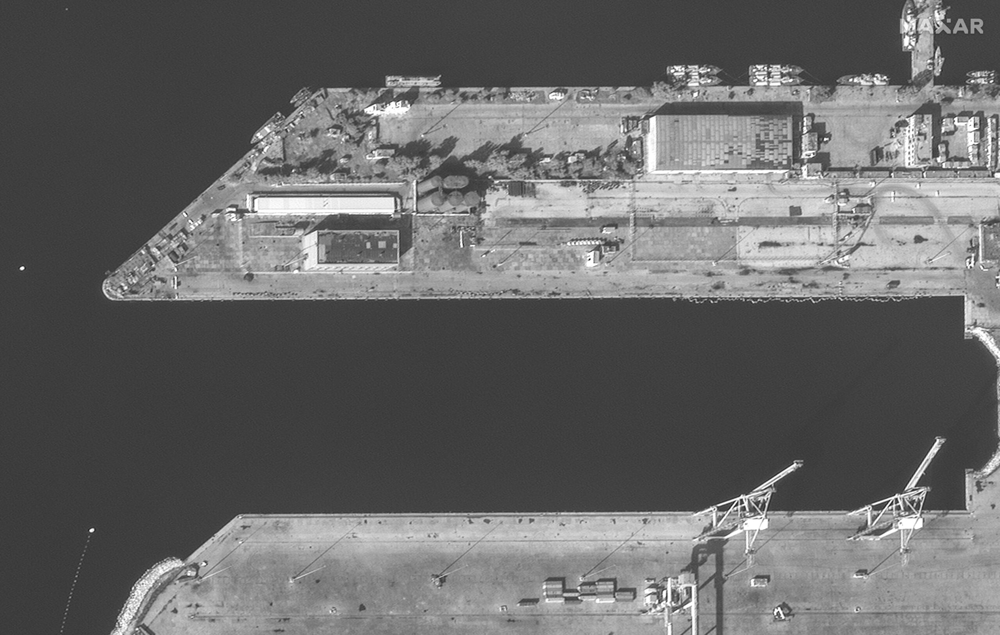

*Empty Russian naval base at Tartus on December 10, 2024. Source: Satellite image ©2024 Maxar Technologies*

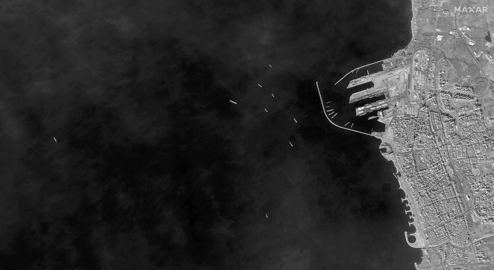

*Russian vessels offshore near the Port of Tartus on December 10, 2024. Source: Satellite image ©2024 Maxar Technologies*

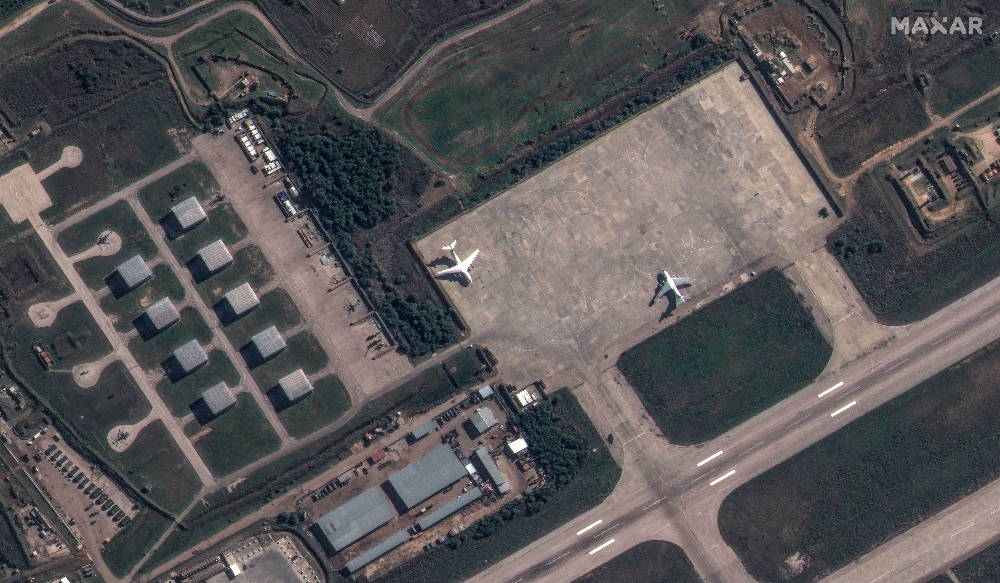

*Russian aircraft, helicopters, and military equipment at Hmeimim Air Base on December 10, 2024. Source: Satellite image ©2024 Maxar Technologies*

**Russia intends to supply North Korea with fighter jets amid growing military partnership between the two countries.** US Indo-Pacific Command (INDOPACOM) commander Admiral Samuel Paparo revealed on December 10 that Russia and North Korea struck a deal in which Russia agreed to send MiG-29 and Su-27 fighter aircraft to Pyongyang in exchange for North Korea deploying troops to Russia to support Russia’s war in Ukraine.[8] Paparo highlighted that North Korea’s receipt of these aircraft will enhance its military capabilities and that Pyongyang likely expects additional military equipment and technologies from Russia, including ballistic missile reentry vehicles, submarine technologies, and air defense systems, as part of the agreement. Paparo noted that North Korean soldiers remain in combat zones, likely in reference to Kursk Oblast, but are not yet actively fighting. South Korean network TV *Chosun* published an exclusive report on October 21 stating that North Korea dispatched an unspecified number of fighter pilots to Vladivostok before the deployment of ground troops to Russia in early October likely in an effort to train its pilots to fly Russian fighter jets.[9] North Korean pilots are trained on Russian Su-25 attack aircraft (which are already part of the Korean People’s Army [KPA] Air Force fleet) further indicating that a Russian delivery of fighter jets will benefit and expand North Korea’s military capabilities, especially in the air domain.[10] ISW continues to assess that military cooperation between Russia and North Korea has particularly intensified since the two countries signed their Treaty on Comprehensive Strategic Partnership in June 2024, and especially since it entered into force on December 4.[11]

**Russian President Vladimir Putin met with Indian Defense Minister Rajnath Singh in Moscow on December 10 as India continues efforts to balance military technical cooperation with Russia and maintain good relations with key Western allies.[12]** Singh announced the commissioning of a Russian-produced “Tushil” Project 1135 Burevestnik Krivak-class frigate into the Indian Navy at the Yantar Shipbuilding Plant in Kaliningrad Oblast on December 9.[13] Indian outlet *The Sunday Guardian* reported on December 8 that India and Russia are finalizing a deal for India to purchase a Russian-made early warning radar system with a range of over 6,000 kilometers, possibly a Voronezh radar.[14] *The Sunday Guardian* noted that it is unclear exactly which radar system Russia intends to sell to India and that Indian officials may have requested an upgraded version of the Voronezh radar. *Bloomberg* reported on December 3 that India has sharply reduced its defense equipment orders from Russia and has started purchasing defense equipment from Western suppliers, however, emphasizing the tenuous balance that India is striking between Russia and its Western partners.[15]

**Key Takeaways:**

- **Russia’s force posture around Syria continues to reflect the Kremlin’s current cautious and indecisive response to the fall of Bashar al Assad’s regime.**
- **Russia intends to supply North Korea with fighter jets amid a growing military partnership between the two countries.**
- **Russian President Vladimir Putin met with Indian Defense Minister Rajnath Singh in Moscow on December 10 as India continues efforts to balance military technical cooperation with Russia and maintain good relations with key Western allies.**
- **Ukrainian forces recently advanced in the Vuhledar direction, and Russian forces recently advanced in Kursk and Kharkiv oblasts and in the Svatove, Toretsk, Pokrovsk, Kurakhove, Vuhledar, and Velyka Novosilka directions.**
- **The Russian government continues efforts to formalize irregular Russian military units and veterans from the Donetsk and Luhansk People’s Republics army corps (DNR and LNR ACs) and formally integrate them under the Russian Ministry of Defense (MoD).**
- **Russia continues to utilize Western-produced high-tech components in Russian weapons systems despite Western sanctions against Russia and cobelligerent states.**
- **A Russian insider source who has previously correctly predicted command changes within the Russian MoD claimed on December 9 that Russian President Vladimir Putin promoted the Russian Deputy Defense Minister, Pavel Fradkov, to the rank of Major General.**

***We do not report in detail on Russian war crimes because these activities are well-covered in Western media and do not directly affect the military operations we are assessing and forecasting. We will continue to evaluate and report on the effects of these criminal activities on the Ukrainian military and the Ukrainian population and specifically on combat in Ukrainian urban areas. We utterly condemn Russian violations of the laws of armed conflict and the Geneva Conventions and crimes against humanity even though we do not describe them in these reports.***

- Ukrainian Operations in the Russian Federation
- Russian Main Effort – Eastern Ukraine (comprised of three subordinate main efforts)
- Russian Subordinate Main Effort #1 – Push Ukrainian forces back from the international border with Belgorod Oblast and approach to within tube artillery range of Kharkiv City
- Russian Subordinate Main Effort #2 – Capture the remainder of Luhansk Oblast and push westward into eastern Kharkiv Oblast and encircle northern Donetsk Oblast
- Russian Subordinate Main Effort #3 – Capture the entirety of Donetsk Oblast
- Russian Supporting Effort – Southern Axis
- Russian Air, Missile, and Drone Campaign
- Russian Mobilization and Force Generation Efforts
- Russian Technological Adaptations
- Activities in Russian-occupied areas
- Significant Activity in Belarus

**Ukrainian Operations in the Russian Federation**

Russian forces recently advanced in the main Ukrainian salient in Kursk Oblast amid continued fighting in the area on December 10. Geolocated footage published on December 10 indicates that Russian forces advanced in southern Darino (southeast of Korenevo).[16] Russian milbloggers continued to claim that Russian forces seized Plekhovo (southeast of Sudzha) and the nearby forest area and Novoivanovka (also southeast of Korenevo) on December 10.[17] A Russian milblogger claimed that Russian forces advanced near Malaya Loknya (north of Sudzha) and repelled two Ukrainian counterattacks in the area.[18] Ukrainian sources reported on December 10 that Ukrainian forces repelled at least a platoon-sized Russian mechanized assault on an unspecified date, likely near Darino.[19] Another Russian milblogger claimed that Russian forces attacked eastward near Kamyshevka (north of Sudzha) and toward Guyevo (south of Sudzha).[20] Russian sources claimed that fighting continued near Pogrebki (northwest of Sudzha), Darino, Nikolayevo-Darino (southeast of Korenevo), and Guyevo.[21] A Ukrainian company commander operating in the Kursk direction stated that Russian forces are using a wide array of both modern and Soviet-era vehicles in the Kursk direction, including modern T-90 main battle tanks.[22] Elements of the Russian “Phoenix” Mining Battalion and drone operators of the Russian 56th Airborne (VDV) Regiment (7th VDV Division) are reportedly operating in the Kursk direction.[23] Elements of the Russian 104th VDV Regiment (76th VDV Division) and 51st VDV Regiment (106th VDV Division) are reportedly operating near Darino and Nikolayevo-Darino, and elements of the Russian 1427th Motorized Rifle Regiment (a mobilized element of the Russian Territorial Troops) are operating near Kamyshevka.[24]

[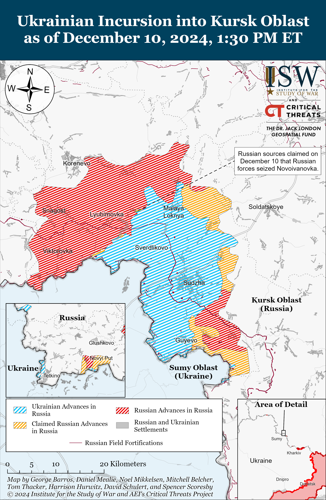](https://understandingwar.org/map/ukrainian-incursion-into-kursk-oblast-as-of-december-10-2024-130-pm-et/)

**Russian Main Effort – Eastern Ukraine**

**Russian Subordinate Main Effort #1 – Kharkiv Oblast (Russian objective: Push Ukrainian forces back from the international border with Belgorod Oblast and approach to within tube artillery range of Kharkiv City)**

The Sumy Oblast Military Administration and Ukraine’s State Border Service dismissed claims that Russian forces advanced into northeastern Sumy Oblast as disinformation.[25] Select Russian milbloggers claimed on December 10 that Russian forces advanced across the Kursk-Sumy Oblast border and seized Oleksandriya (northeast of Sumy City along the international border), although one Russian milblogger also denied these claims as “nonsense.”[26] ISW has not observed any evidence of Russian forces operating in or near Oleksandriya.

Russian forces continued offensive operations north of Kharkiv City near Hlyboke and northeast of Kharkiv City near Vovchansk and Starytsya on December 9 and 10.[27] A Russian source claimed that Russian forces seized a position in southern Vovchansk, but ISW has not observed confirmation of this claim.[28] The spokesperson of a Ukrainian brigade operating in the northern Kharkiv direction reported that Russian forces are trying to cross the Vovcha River near Vovchansk and warned that Russian advances east and south of Vovchansk could begin to threaten Ukrainian rear areas in the Kupyansk direction.[29] The spokesperson noted that inexperienced Russian infantry are conducting the first wave of an attack and that if these infantry personnel advance, more experienced Russian units then follow-on to consolidate and exploit newly seized positions. Ukrainian Kharkiv Group of Forces Spokesperson Lieutenant Colonel Yevheniy Romanov stated that Russian forces are not using armored vehicles in their assaults in the Kharkiv direction due to limited armored vehicle stocks.[30]

[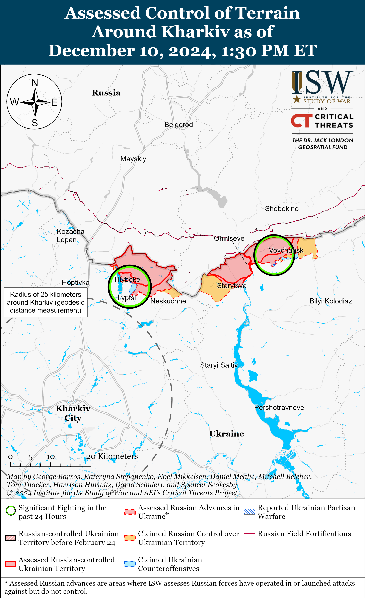](https://understandingwar.org/map/assessed-control-of-terrain-around-kharkiv-as-of-december-10-2024-130-pm-et/)

**Russian Subordinate Main Effort #2 – Luhansk Oblast (Russian objective: Capture the remainder of Luhansk Oblast and push westward into eastern Kharkiv Oblast and northern Donetsk Oblast)**

Russian forces recently advanced west of Svatove amid continued offensive operations along the Kupyansk-Svatove-Kreminna line on December 10. A Ukrainian battalion commander reported on December 9 that Russian forces seized Vyshneve and Pershotravneve (both west of Svatove) and are trying to secure a bridgehead in this area from which to cross the Oskil River.[31] Russian forces are still about 15km east of the Oskil River in the Vyshneve-Pershotravneve area, however. Russian sources claimed that Russian forces made gains near Lozova (northwest of Svatove), Zeleny Hai (west of Svatove), Novoyehorivka (southwest of Svatove), and Hrekivka (also southwest of Svatove), although ISW has not yet observed confirmation of Russian advances in these areas.[32] A Russian milblogger claimed that Ukrainian forces continue counterattacks near Dvorichna (north of Kupyansk) and that Russian forces are holding a position on the west (right) bank of the Oskil River.[33] Ukrainian military sources noted that Russian forces maintain a high tempo of assaults in the Kupyansk direction and are using mostly light, unarmored vehicles such as motorcycles, buggies, and cars to support infantry fireteams comprised of seven to eight personnel.[34] The Ukrainian General Staff reported that Russian forces conducted ground attacks east of Kupyansk near Petropavlivka; southeast of Kupyansk near Kolisnykivka and Zahryzove; west of Svatove near Kopanky, Zeleny Hai, and Nadiya; southwest of Svatove near Lozova, Makiivka, Cherneshchyna, and Druzhelyubivka; northwest of Kreminna near Terny; and west of Kreminna near Torske and Yampolivka.[35]

[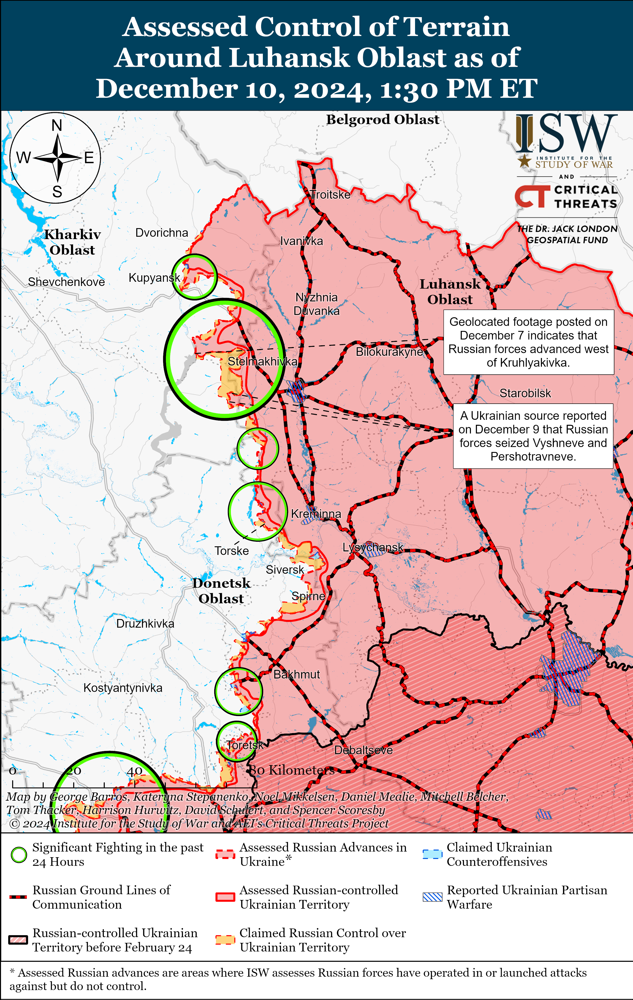](https://understandingwar.org/map/assessed-control-of-terrain-around-luhansk-oblast-as-of-december-10-2024-130-pm-et/)

**Russian Subordinate Main Effort #3 – Donetsk Oblast (Russian objective: Capture the entirety of Donetsk Oblast, the claimed territory of Russia’s proxies in Donbas)**

A Russian milblogger claimed on December 10 that fighting continued northeast of Siversk near Bilohorivka and east of Siversk near Verkhnokamyanske.[36] Another Russian milblogger claimed on December 10 that Ukrainian forces are using drone swarms against Russian forces in the Siversk direction to “block” Russian forces from combat zones and hinder Russian advances towards Siversk itself.[37]

Russian forces continued offensive operations in the Chasiv Yar direction on December 10, but did not make any confirmed advances. Russian forces conducted offensive operations in and near Chasiv Yar; northeast of Chasiv Yar near Orikhovo-Vasylivka; and south of Chasiv Yar near Bila Hora.[38] A Ukrainian company commander operating in the Chasiv Yar direction reported on December 10 that subzero temperatures and precipitation are negatively affecting drone operations in this direction.[39] The commander also noted that Russian forces use drones to remotely mine Ukrainian ground lines of communication (GLOCs) in the Kramatorsk (Chasiv Yar) direction, forcing Ukrainian units to check GLOCs several times for mines.[40] Elements of the Russian 98th Airborne (VDV) Division reportedly continue to operate in Chasiv Yar.[41]

[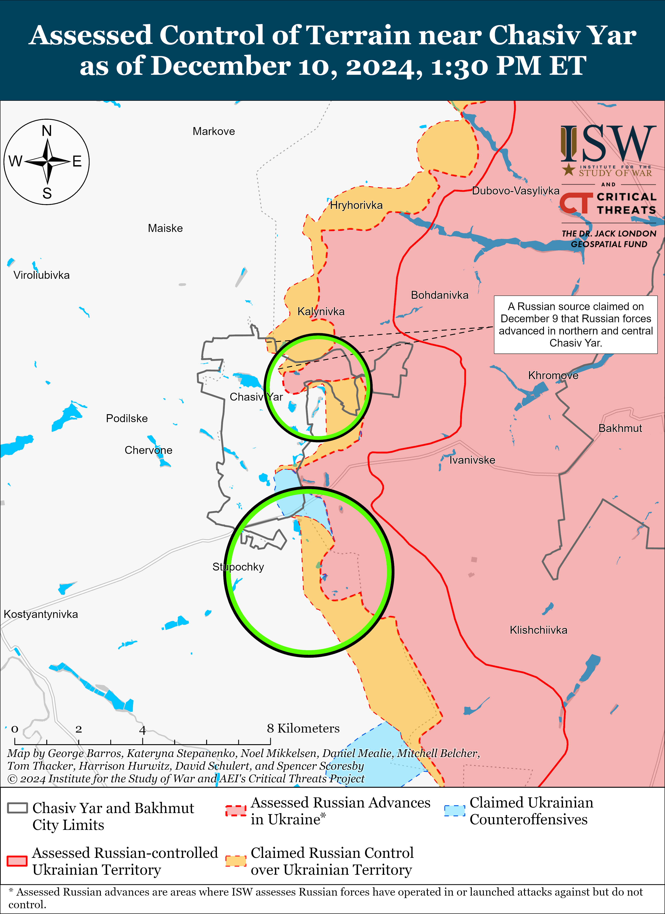](https://understandingwar.org/map/assessed-control-of-terrain-near-chasiv-yar-as-of-december-10-2024-130-pm-et/)

Russian forces recently advanced within Toretsk and west of Toretsk amid continued fighting in this direction on December 10. Geolocated footage posted on December 9 and 10 indicates that Russian forces advanced westward along Frunze Street in central Toretsk and southeastern Shcherbynivka (west of Toretsk).[42] A Russian milblogger claimed on December 9 that Russian forces advanced east of Shcherbynivka, but ISW has not yet observed confirmation of this claim.[43]  The Ukrainian General Staff reported that Russian forces conducted ground attacks within and near Toretsk itself; west of Toretsk near Shcherbynivka; and southwest of Toretsk near Nelipivka on December 9 and 10.[44] A Ukrainian brigade spokesperson operating in the Toretsk direction reported on December 10 that Ukrainian forces successfully counterattacked northeast of Toretsk near the Siverskyi-Donets Donbas Canal, where Russian forces are increasing drone and artillery strikes.[45]

[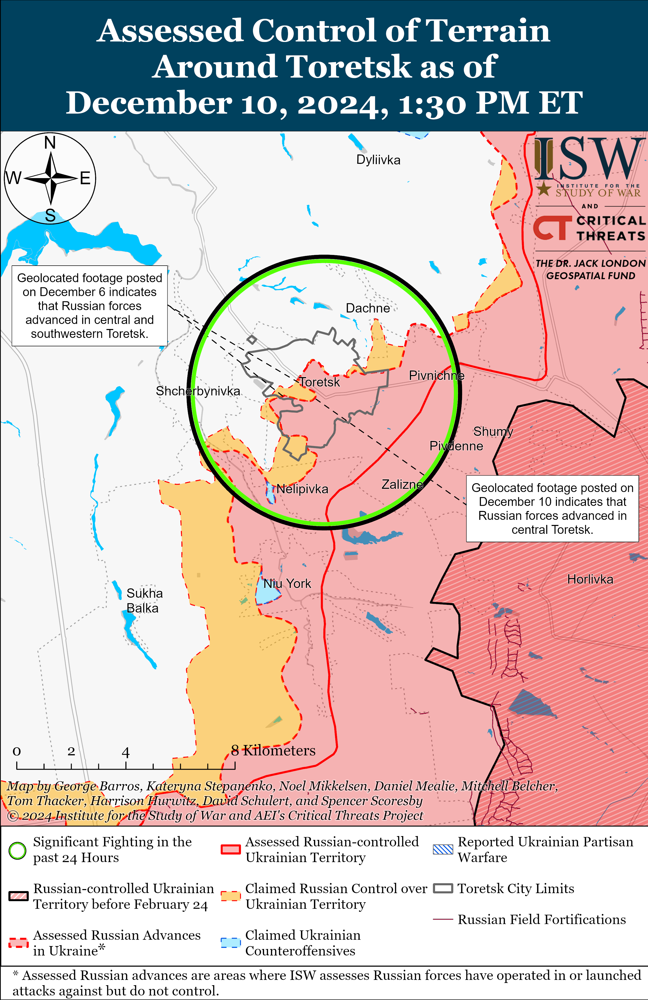](https://understandingwar.org/map/assessed-control-of-terrain-around-toretsk-as-of-december-10-2024-130-pm-et/)

Russian forces recently advanced southwest of Pokrovsk amid continued fighting in this direction on December 10. Geolocated footage posted on December 9 indicates that Russian forces advanced westward across Myru Street in northern Novotroitske (southwest of Pokrovsk).[46] The Russian Ministry of Defense (MoD) claimed on December 10 that Russian forces seized Zhovte (south of Pokrovsk).[47] ISW confirmed Russian gains in and near Zhovte between December 1 to 4. Russian milbloggers claimed on December 9 and 10 that Russian forces seized Shevchenko (south of Pokrovsk) but ISW has not observed confirmation of these claims.[48] Russian forces conducted ground attacks near Pokrovsk; east of Pokrovsk near Promin and Myrolyubivka; southeast of Pokrovsk near Lysivka; and south of Pokrovsk near Dachenske, Zelene, Chumatske, Novyi Trud, and Shevchenko on December 9 and 10.[49] Ukrainian military observer Yuriy Butusov reported on December 10 that Russian forces maintain a significant drone advantage in the Pokrovsk direction, which is facilitating rapid tactical advances.[50] Elements of the Russian 90th Tank Division (41st Combined Arms Army [CAA], Central Military District [CMD]) are operating near Novopustynka (southwest of Pokrovsk).[51]

[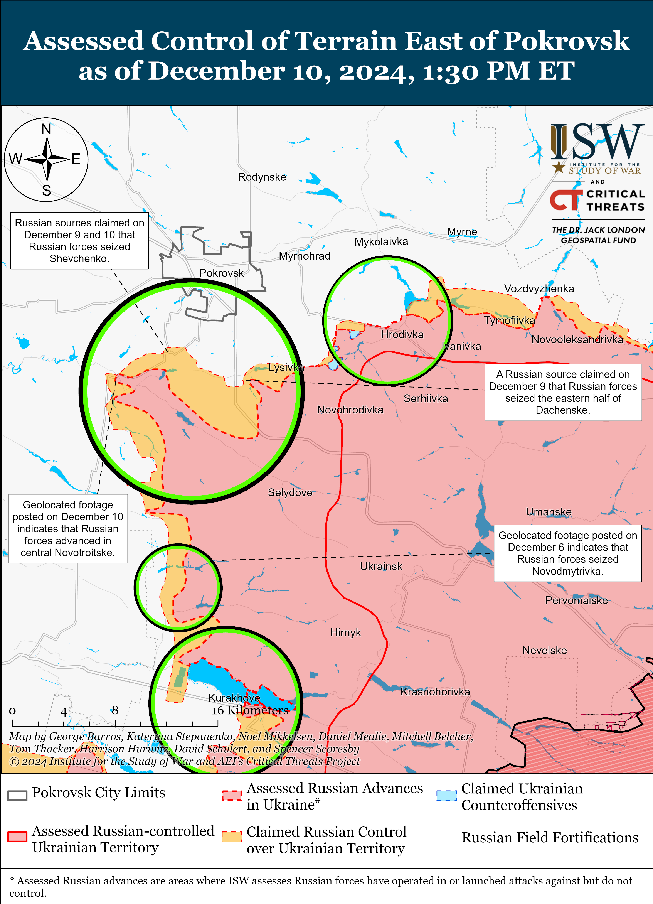](https://understandingwar.org/map/assessed-control-of-terrain-east-of-pokrovsk-as-of-december-10-2024-130-pm-et/)

Ukrainian Khortytsia Group of Forces Spokesperson Colonel Nazar Voloshyn reported on December 10 that Russian forces have a 3 to 1 artillery advantage over Ukrainian forces- significantly less than the 5 to 1 artillery advantage that Russia had at the start of the full-scale invasion. Voloshyn reported that there are roughly 150,000 Russian personnel operating in the Pokrovsk, Kurakhove, and Vremivka (Donetsk-Zaporizhia Oblast border area) directions including over 70,000 personnel in the Pokrovsk direction; 35,000 to 36,000 personnel in the Kurakhove direction; and over 40,000 personnel in the Vremivka direction.[52]

[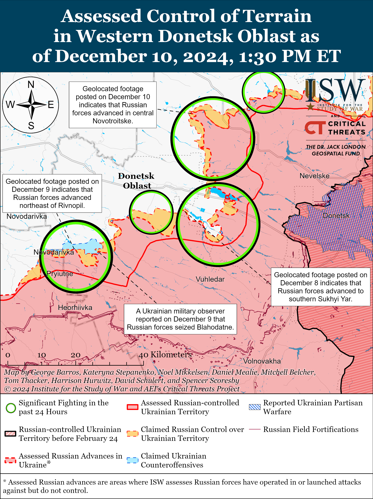](https://understandingwar.org/map/assessed-control-of-terrain-in-western-donetsk-oblast-as-of-december-10-2024-130-pm-et/)

Russian forces recently advanced in the Kurakhove direction amid continued Russian offensive operations in the area on December 10. Geolocated footage published on December 10 indicates that elements of the Russian 5th Motorized Rifle Brigade (51st Combined Arms Army [CAA], Southern Military District [SMD], formerly the 1st Donetsk People’s Republic Army Corps [DNR AC]) advanced westward in central Kurakhove and seized the Kurakhove grain elevator.[53] Russian milbloggers claimed that Russian forces advanced to Pushkina and Lermontova streets in western Kurakhove, up to the Kurakhove City Council building in southwestern Kurakhove, and seized part of the Yuzhnyi Microraion in southern Kurakhove.[54] Russian milbloggers also claimed that Russian forces consolidated positions between Sontsivka (northwest of Kurakhove) and Stari Terny (northwest of Kurakhove on the northern shore of the Kurakhivske Reservoir) and advanced from Stari Terny towards the western outskirts of Kurakhove.[55] Another Russian milblogger claimed that Russian forces advanced from Stari Terny into Dachne (west of Kurakhove), up to the H-15 Kurakhove-Zaporizhzhia City highway, and onto the western outskirts of Kurakhove.[56] ISW has not observed confirmation of any of these claims, however. Russian forces conducted ground attacks near Kurakhove itself; northwest of Kurakhove near Sontsivka, Stari Terny, and Zorya; west of Kurakhove near Dachne; and south of Kurakhove near Dalne on December 9 and 10.[57] Russian milbloggers claimed that Russian forces have fire control over or have seized positions along all ground lines of communication (GLOCs) leading into Kurakhove and that Russian forces are attempting to “even out” the frontline north of the Kurakhivske Reservoir.[58]

Ukrainian and Russian forces recently advanced in the Vuhledar direction amid continued Russian offensive operations in the area on December 10. Geolocated footage published on December 10 indicates that Ukrainian forces recently recaptured lost positions in western Romanivka (northeast of Vuhledar).[59] Geolocated footage published on December 10 of a Russian reinforced platoon-sized mechanized assault indicates that Russian forces advanced in southeastern Kostyantynopolske (northwest of Vuhledar).[60] Additional geolocated footage published on December 10 indicates that Russian forces advanced within eastern Uspenivka (northwest of Vuhledar).[61] Russian milbloggers claimed that Russian forces advanced in the fields north of Uspenivka and east of Hannivka (north of Vuhledar), but ISW has not observed confirmation of these claims.[62] Russian forces continued attacking north of Vuhledar near Veselyi Hai and Hannivka;  and northwest of Vuhledar near Uspenivka, Kostyantynopolske, Sukhi Yaly, and Rozlyv on December 9 and 10.[63] Elements of the Russian 14th Spetsnaz Brigade (Russian General Staff’s Main Directorate [GRU]) are reportedly operating near the Sukhi Yaly River north of Vuhledar.[64]

Russian forces recently advanced near Velyka Novosilka amid continued offensive operations in the area on December 10. Ukrainian military observer Kostyantyn Mashovets stated on December 9 that elements of the 60th Motorized Rifle Brigade (5th CAA, Eastern Military District [EMD]) with support of the 5th Tank Brigade (36th CAA, EMD) seized Blahodatne (south of Velyka Novosilka).[65] Russian forces continued attacking near Velyka Novosilka itself; northeast of Velyka Novosilka near Rozdolne; south of Velyka Novosilka near Blahodatne and Makarivka; and southwest of Velyka Novosilka near Storozheve, Novodarivka and Rivnopil and toward Zelene Pole on December 9 and 10.[66] Elements of the Russian 37th Motorized Rifle Brigade (36th CAA, EMD) are reportedly operating near Velyka Novosilka.[67]

[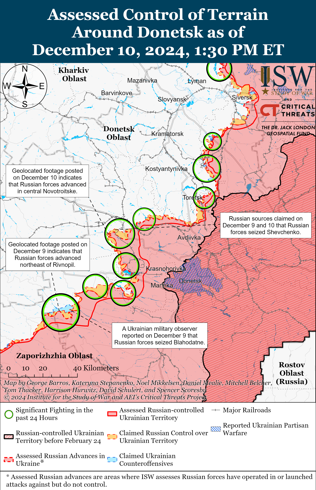](https://understandingwar.org/map/assessed-control-of-terrain-around-donetsk-as-of-december-10-2024-130-pm-et/)

**Russian Supporting Effort – Southern Axis (Russian objective: Maintain frontline positions and secure rear areas against Ukrainian strikes)**

Russian forces recently advanced north of Roboytne amid limited Russian offensive operations in western Zaporizhia Oblast on December 10. Geolocated footage published on December 9 indicates that Russian forces advanced northward along the Tokmak-Orikhiv T-04-08 highway north of Robotyne.[68] A Russian milblogger claimed that Russian assault groups are engaged in heavy fighting in the Zaporizhia direction but that the Russian military command has not yet deployed Russia’s main forces to the area.[69] Elements of the Russian 4th Military Base (58th Combined Arms Army [CAA], Southern Military District [SMD]), 247th Guards Air Assault (VDV) Regiment (7th VDV Division), and drone operators of the 1152nd Motorized Rifle Regiment’s “Shmeli” Detachment (58th CAA, SMD) are reportedly operating in the Zaporizhia direction.[70] Ukrainian military observer Yuryi Butusov stated that elements of the 55th Motorized Rifle Brigade (41st CAA, Central Military District [CMD]) are reportedly operating in the Zaporizhia direction.[71] ISW previously observed elements of the 55th Motorized Rifle Brigade east of Pokrovsk in Hrodivka on October 7, 2024.[72] The 41st CAA has long been a lead Russian offensive element in the Pokrovsk direction, which is a priority sector of the front for Russian forces.[73] If Russia has indeed redeployed elements of the 41st CAA to Zaporizhia Oblast, it could be an indicator of shifting Russian offensive prioritization and an increased focus on western Zaporizhia Oblast. ISW has not yet observed additional confirmation of the 55th Motorized Rifle Brigade in this area but will update its assessments accordingly if additional sources report on this redeployment.

[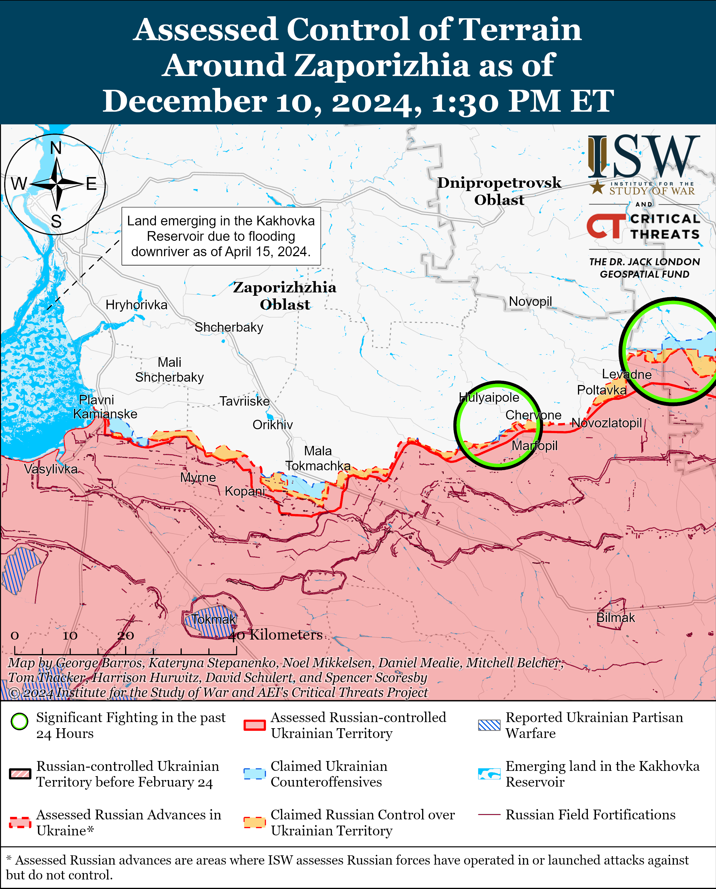](https://understandingwar.org/map/assessed-control-of-terrain-around-zaporizhia-as-of-december-10-2024-130-pm-et/)

Russian forces continued assaults in the Dnipro direction in east (left) bank Kherson Oblast and on the islands of the Dnipro River Delta on December 9 and 10 but did not make any confirmed advances in the area.[74] Ukraine’s Southern Operational Command reported that the Russian command is prioritizing attempts to advance on the islands near the mouth of the Dnipro River.[75]

[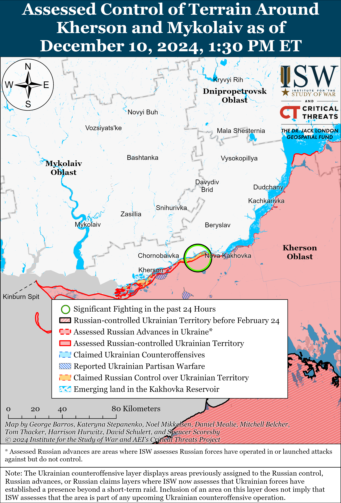](https://understandingwar.org/map/assessed-control-of-terrain-around-kherson-and-mykolaiv-as-of-december-10-2024-130-pm-et/)

**Russian Air, Missile, and Drone Campaign (Russian Objective: Target Ukrainian military and civilian infrastructure in the rear and on the frontline)**

Russian forces conducted limited missile strikes against Kharkiv and Zaporizhia oblasts on December 10. Kharkiv Oblast Head Oleh Synehubov stated that three Russian ballistic missiles – likely Iskander-Ms – struck central Zlatopil and the outskirts of the settlement and damaged an administrative building and residential buildings.[76] Zaporizhia Oblast Administration Head Ivan Fedorov stated that a Russian missile of unspecified variety struck a clinic and nearby buildings in Zaporizhzhia City.[77]

**Russian Mobilization and Force Generation Efforts (Russian objective: Expand combat power without conducting general mobilization)**

The Russian government continues efforts to formalize irregular Russian military units and veterans from the Donetsk and Luhansk People’s Republics army corps (DNR and LNR ACs) and formally integrate them under the Russian Ministry of Defense (MoD).The Russian State Duma adopted a bill on December 10 extending combat veteran status to veterans who served with volunteer formations in occupied Donetsk and Luhansk oblasts beginning on February 24, 2022, and in occupied Kherson and Zaporizhia oblasts beginning on September 30, 2022.[78] The new bill also extends Russian combat veteran status to civilian and governmental employees who worked in occupation administrations in Ukraine’s occupied territories for over six months.[79] The move is likely intended to aid ongoing efforts within the Russian MoD to consolidate control over the DNR and LNR ACs while incentivizing military service in occupied Ukraine.

Russia continues to utilize Western-produced high-tech components in Russian weapons systems despite Western sanctions against Russia and cobelligerent states. *Bloomberg* reported on December 9 that Russian defense industrial companies continue to benefit from a “surprisingly resilient” semi-conductor supply chain connecting Russian companies with high tech Western components produced in the United States.[80] *Bloomberg* added that the supply chain relies on companies based in third countries to import sanctioned components from US companies and then export the components to businesses based in Russia. Ukraine’s Main Military Intelligence Directorate (GUR) reported on December 10 that commonly used Russian “Molniya”, and “Phoenix” drones contain components from American, Swiss, and Dutch companies.[81] The GUR noted that the drones’ flight controllers and engine control boards contain Western components.

A Russian insider source who has previously correctly predicted command changes within the Russian MoD claimed on December 9 that Russian President Vladimir Putin promoted the Russian Deputy Defense Minister, Pavel Fradkov, to the rank of Major General**.**[82]  The insider source claimed that Putin will “almost certainly” promote Fradkov to the rank of lieutenant general in the next six months. Another Russian insider source claimed on December 10 that high-level Russian officials view Fradkov as a promising future leader and have previously credited Fradkov with successfully solving complex problems.[83]

**Russian Technological Adaptations (Russian objective: Introduce technological innovations to optimize systems for use in Ukraine)**

The People’s Front (*Narodnyi Front,* formerly known as the All-Russia People’s Front) told Kremlin newswire *TASS* on December 10 that the organization successfully developed a new “Venom-Totem” unmanned ground vehicle (UGV) to transport Russian military logistical supplies and evacuate wounded Russian military personnel from frontline positions.[84] The People’s Front reported that the organization will soon deliver 50 of the new UGVs to Russian forces.

**Activities in Russian-occupied areas (Russian objective: Consolidate administrative control of annexed areas; forcibly integrate Ukrainian citizens into Russian sociocultural, economic, military, and governance systems)**

*ISW is not reporting on activities in Russian-occupied areas today.*

**Significant activity in Belarus (Russian efforts to increase its military presence in Belarus and further integrate Belarus into Russian-favorable frameworks and Wagner Group activity in Belarus)**

Belarusian President Alexander Lukashenko asserted that Belarusian companies plan to manufacture missile launchers for Russian “Oreshnik” ballistic missiles. Lukashenko stated on December 10 that the Belarusian state-owned Minsk Wheeled Tractor Plant (MZKT) company will start manufacturing launch systems for the Russian “Oreshnik” ballistic missiles starting in the second half of 2025.[85] Lukashenko insinuated that the Belarusian MZKT company would provide Russia with Oreshnik launchers in exchange for free Oreshnik missiles and that Belarus could deploy Oreshnik missiles to 30 locations across the country.[86] This move represents a further intermeshing of the Russian and Belarusian defense industrial bases in line with Russian efforts to accelerate the absorption of Belarus into the Union State framework.

Belarusian President Alexander Lukashenko continues to make bellicose nuclear threats implicitly threatening Western countries.Lukashenko claimed on December 10 that Belarus secretly imported more than a “few dozen” tactical nuclear warheads from Russia and threatened to conduct strikes against Western countries if a Western country “violates Belarusian borders.”[87] The bellicose rhetoric is an extension of the Kremlin’s nuclear saber rattling aimed at blackmailing the West into decreasing military support for Ukraine.

**Note: ISW does not receive any classified material from any source, uses only publicly available information, and draws extensively on Russian, Ukrainian, and Western reporting and social media as well as commercially available satellite imagery and other geospatial data as the basis for these reports. References to all sources used are provided in the endnotes of each update.**

[1] https://x.com/MT\_Anderson/status/1866506906170237070; https://x.com/kromark/status/1866479146144325861

[2] https://x.com/MT\_Anderson/status/1866506906170237070/photo/1

[3] https://x.com/kromark/status/1866154120257671340; https://x.com/MT\_Anderson/status/1866124525647143118; https://x.com/MT\_Anderson/status/1866155694593810766; https://x.com/MassDara/status/1866182509043527760; https://understandingwar.org/backgrounder/russian-offensive-campaign-assessment-december-9-2024

[4] https://x.com/Drox\_Maritime/status/1866471867005255976; https://x.com/OAlexanderDK/status/1866507293958774830

[5] https://t.me/ne\_rybar/3717; https://t.me/tass\_agency/290151 ; https://t.me/tass\_agency/290154

[6] https://t.me/DIUkraine/4989

[7] https://isw.pub/UkrWar120924; https://isw.pub/UkrWar120824; https://x.com/TheStudyofWar/status/1865927944922611976

[8] https://aviationweek.com/defense/aircraft-propulsion/russia-north-korea-agree-su-27-mig-29-transfer; https://mil.in dot ua/uk/news/rosiya-peredast-kndr-vynyshhuvachi-myg-29-ta-su-27-admiral-ssha/#google\_vignette

[9] https://news.tvchosun dot com/site/data/html\_dir/2024/10/21/2024102190234.html

[10] https://militarywatchmagazine.com/article/north-korean-su25-attack-jets-train-to-give-ground-troops-rocket-support-in-new-footage; https://understandingwar.org/backgrounder/north-korea-joins-russias-war-against-ukraine-operational-and-strategic-implications

[11] https://understandingwar.org/backgrounder/north-korea-joins-russias-war-against-ukraine-operational-and-strategic-implications; http://kremlin dot ru/supplement/6154 ; https://t.me/MID\_Russia/42180; https://isw.pub/UkrWar120524

[12] https://t.me/tass\_agency/290261 ; https://t.me/tass\_agency/290263 ; http://kremlin dot ru/events/president/news/75820 ; https://isw.pub/UkrWar101224 ; https://isw.pub/UkrWar091924 ; https://isw.pub/UkrWar090424  ; https://isw.pub/UkrWar082724 ; https://isw.pub/UkrWar082324 ; https://understandingwar.org/backgrounder/russian-offensive-campaign-assessment-july-17-2024 ; https://isw.pub/UkrWar070924

[13] https://mil.in dot ua/uk/news/u-rosiyi-vvely-v-ekspluatatsiyu-indijskyj-fregat-z-ukrayinskym-dvygunom/; https://x.com/DefenceMinIndia/status/1866081280418361409

[14] https://sundayguardianlive.com/news/india-may-acquire-advanced-russian-radar-system#google\_vignette

[15] https://isw.pub/UkrWar120324

[16] https://t.me/black\_swan\_ukraine/257  ; https://x.com/MikiValbuena/status/1866423693171134832  ; https://x.com/MikiValbuena/status/1866423996184510659

[17] https://t.me/dva\_majors/59808  ; https://t.me/motopatriot/30230 ; https://t.me/dva\_majors/59831 ; https://t.me/vrogov/18203 ; https://t.me/dva\_majors/59831 ; https://t.me/dva\_majors/59808 ; https://t.me/dva\_majors/59808

[18] https://t.me/dva\_majors/59808

[19] https://t.me/ButusovPlus/15717 ; https://t.me/OSHB\_225/4807 ; https://armyinform.com dot ua/2024/12/10/palaty-tak-kolonoyu-rosiyany-prodovzhuyut-organizovano-gynuty-na-kurshhyni/

[20] https://t.me/motopatriot/30230

[21] https://t.me/motopatriot/30230 ; https://t.me/dva\_majors/59808 ; https://t.me/dva\_majors/59808

[22] https://armyinform.com dot ua/2024/12/10/vid-stalina-do-putina-yakoyu-tehnikoyu-rosiyany-namagayutsya-nastupaty-na-kurshhyni/

[23] https://t.me/rusich\_army/19224; https://t.me/rusich\_army/19223 ; https://t.me/wargonzo/23626 ; https://rutube dot ru/video/3b5445ef653b90ded3555f1eb69aded7/?r=a/ ; https://t.me/wargonzo/23626

[24] https://t.me/motopatriot/30230

[25] https://t.me/Sumy\_news\_ODA/32070; https://www.youtube.com/watch?v=-OmevBV\_b38&ab\_channel=%D0%A1%D1%83%D1%81%D0%BF%D1%96%D0%BB%D1%8C%D0%BD%D0%B5%D0%A3%D0%B6%D0%B3%D0%BE%D1%80%D0%BE%D0%B4; https://deepstatemap.live/#14/51.0600896/35.2968407; https://suspilne dot media/sumy/898975-informacia-pro-proriv-rosieu-kordonu-na-sumsini-fejk/

[26] https://t.me/z\_arhiv/30024 ; https://t.me/voenkorKotenok/60637 ; https://t.me/boris\_rozhin/147339 ; https://t.me/motopatriot/30226 ; https://t.me/motopatriot/3022 ; https://t.me/DnevnikDesantnika/20637

[27] https://www.facebook.com/GeneralStaff.ua/posts/pfbid0ML53BxDRYBaUYRyjqAheKximtyto1cMoS8MYQypnJKRXQUYgDcjxhdjpdgR4nFJjl ; https://www.facebook.com/GeneralStaff.ua/posts/pfbid0oCQ6ACmFUiJPqXkxuniVSS6enH1NEGxYeYUQLT47LTmngfPTyhudnV6gJ9mU9Btcl ; https://www.facebook.com/GeneralStaff.ua/posts/pfbid02d5iohV4tggzbtWue89A5tuh9MWJuM9ukMuuWHM3tVcXB9fzXJ2qJ5j1YkxefyPbZl ; https://t.me/otukharkiv/2995

[28] https://t.me/tass\_agency/290090

[29] https://armyinform.com dot ua/2024/12/10/pivsotni-tyh-kogo-ne-shkoda-kydayut-na-prolom-u-vovchansku-vorog-ne-prypynyaye-shturmuvaty/

[30] https://armyinform.com dot ua/2024/12/10/ne-vijsko-a-zbigovysko-okupanty-voyuyut-marginalamy-nepotrebom-z-tyurem-ta-pivnichnoyi-koreyi/  ; https://www.youtube.com/watch?v=j5TqaWCCdUg

[31] https://suspilne dot media/kharkiv/898441-rf-stvorue-placdarm-zahopivsi-dva-sela-na-harkivsini-okupanti-zastosovuvatimut-mehanizovani-nakati-3-osbr/

[32] https://t.me/DnevnikDesantnika/20686; https://t.me/DnevnikDesantnika/20653; https://t.me/DnevnikDesantnika/20637; https://t.me/tass\_agency/290106

[33] https://t.me/motopatriot/30217

[34] https://armyinform.com dot ua/2024/12/09/atakuyut-z-napoleglyvistyu-myshej-targaniv-abo-zh-plisnyavy-yak-baba-yaga-z-krylamy-omegy-nyshhyt-vorogiv-na-harkivshhyni/; https://armyinform.com dot ua/2024/12/09/okupanty-vmyrayut-na-hodu-rosijskyh-dryfteriv-pid-kajfom-u-finalah-zayizdiv-nagorodzhuyut-ukrayinski-drony/; https://armyinform.com dot ua/2024/12/10/bronetehnika-goryt-pihota-jde-na-farsh-na-harkivshhyni-okupanty-po-durnomu-vytrachayut-svoyih/; https://armyinform.com dot ua/2024/12/10/styrayut-v-nul-a-todi-zaminyuyut-rosijski-rezervy-na-stoyat-u-cherzi-a-velycheznomu-konveyeri-smerti/

[35] https://www.facebook.com/GeneralStaff.ua/posts/pfbid0ML53BxDRYBaUYRyjqAheKximtyto1cMoS8MYQypnJKRXQUYgDcjxhdjpdgR4nFJjl; https://www.facebook.com/GeneralStaff.ua/posts/pfbid0oCQ6ACmFUiJPqXkxuniVSS6enH1NEGxYeYUQLT47LTmngfPTyhudnV6gJ9mU9Btcl; https://www.facebook.com/GeneralStaff.ua/posts/pfbid02d5iohV4tggzbtWue89A5tuh9MWJuM9ukMuuWHM3tVcXB9fzXJ2qJ5j1YkxefyPbZl

[36] https://t.me/DnevnikDesantnika/20663

[37] https://t.me/epoddubny/21856

[38] https://www.facebook.com/GeneralStaff.ua/posts/pfbid0ML53BxDRYBaUYRyjqAheKximtyto1cMoS8MYQypnJKRXQUYgDcjxhdjpdgR4nFJjl; https://www.facebook.com/GeneralStaff.ua/posts/pfbid0oCQ6ACmFUiJPqXkxuniVSS6enH1NEGxYeYUQLT47LTmngfPTyhudnV6gJ9mU9Btcl; https://www.facebook.com/GeneralStaff.ua/posts/pfbid02d5iohV4tggzbtWue89A5tuh9MWJuM9ukMuuWHM3tVcXB9fzXJ2qJ5j1YkxefyPbZl; https://t.me/wargonzo/23628

[39] https://armyinform.com dot ua/2024/12/10/chas-zbyraty-drony-rosijsky-komandyry-vidpravlyayut-svoyih-soldativ-shukaty-bpla-yaki-vpaly-cherez-negodu/

[40] https://armyinform.com dot ua/2024/12/10/perevirka-dorig-po-kilka-raziv-na-dobu-yak-nashi-bijczi-boryutsya-z-dystanczijnym-minuvannyam-voroga/

[41] https://t.me/rusich\_army/19219

[42] https://t.me/WarArchive\_ua/23350; https://t.me/Khyzhak\_brigade/240; https://t.me/creamy\_caprice/7763; https://x.com/AudaxonX/status/1866378608672972870; https://t.me/Khyzhak\_brigade/194

[43] https://t.me/RVvoenkor/82340

[44] https://www.facebook.com/GeneralStaff.ua/posts/pfbid0oCQ6ACmFUiJPqXkxuniVSS6enH1NEGxYeYUQLT47LTmngfPTyhudnV6gJ9mU9Btcl; https://www.facebook.com/GeneralStaff.ua/posts/pfbid02d5iohV4tggzbtWue89A5tuh9MWJuM9ukMuuWHM3tVcXB9fzXJ2qJ5j1YkxefyPbZl

[45] https://suspilne dot media/donbas/899041-na-pivnic-vid-torecka-zsu-proveli-vdalu-kontrataku-recnik-28-brigadi-rozpoviv-pro-boi-bila-mista/; https://www.youtube.com/watch?v=aDXWlQ2K0dM

[46] https://t.me/WarArchive\_ua/23328; https://t.me/skalabatalion/465

[47] https://t.me/mod\_russia/46713; https://t.me/sashakots/50656  ;https://t.me/NgP\_raZVedka/19895 ; https://t.me/RVvoenkor/82368

[48] https://t.me/motopatriot/30231

[49] https://www.facebook.com/GeneralStaff.ua/posts/pfbid0ML53BxDRYBaUYRyjqAheKximtyto1cMoS8MYQypnJKRXQUYgDcjxhdjpdgR4nFJjl; https://www.facebook.com/GeneralStaff.ua/posts/pfbid0oCQ6ACmFUiJPqXkxuniVSS6enH1NEGxYeYUQLT47LTmngfPTyhudnV6gJ9mU9Btcl; https://www.facebook.com/GeneralStaff.ua/posts/pfbid02d5iohV4tggzbtWue89A5tuh9MWJuM9ukMuuWHM3tVcXB9fzXJ2qJ5j1YkxefyPbZl

[50] https://t.me/ButusovPlus/15715 ; https://www.facebook.com/butusov.yuriy/posts/pfbid02PLvZKat7TgtMH1zxhPBcuwcfJGYMcAjt6cWbo4eS54G4CTawy7enCPFwK9GPWeMAl

[51] https://www.forbes.com/sites/davidaxe/2024/12/08/a-russian-tank-army-is-closing-in-on-pokrovsk-its-not-as-strong-as-it-looks/

[52] https://armyinform.com dot ua/2024/12/10/okupanty-vtrachayut-perevagu-v-artyleriyi-syly-oborony-potrohu-skorochuyut-rozryv-u-rahunku/

[53] https://t.me/z\_arhiv/30031 ; https://t.me/motopatriot/30240; https://t.me/voenkorKotenok/60640 ; https://t.me/Sladkov\_plus/12019 ; https://t.me/nm\_dnr/13075 ; https://t.me/RVvoenkor/82373;

[54] https://t.me/motopatriot/30235; https://t.me/tass\_agency/290132; https://t.me/voenkorKotenok/60638; https://t.me/voenkorKotenok/60626

[55] https://t.me/DnevnikDesantnika/20637; https://t.me/dva\_majors/59808

[56] https://t.me/tass\_agency/290160

[57] https://www.facebook.com/GeneralStaff.ua/posts/pfbid0ML53BxDRYBaUYRyjqAheKximtyto1cMoS8MYQypnJKRXQUYgDcjxhdjpdgR4nFJjl; https://www.facebook.com/GeneralStaff.ua/posts/pfbid0oCQ6ACmFUiJPqXkxuniVSS6enH1NEGxYeYUQLT47LTmngfPTyhudnV6gJ9mU9Btcl; https://www.facebook.com/GeneralStaff.ua/posts/pfbid02d5iohV4tggzbtWue89A5tuh9MWJuM9ukMuuWHM3tVcXB9fzXJ2qJ5j1YkxefyPbZl

[58] https://t.me/epoddubny/21853; https://t.me/dva\_majors/59811

[59] https://x.com/PuenteUribarri/status/1866403173297967576; https://x.com/PuenteUribarri/status/1866446477586776105; https://x.com/MikiValbuena/status/1866427200947286177

[60] https://t.me/WarArchive\_ua/23352; https://t.me/ukrainian\_navy/10199; https://t.me/creamy\_caprice/7764

[61] https://x.com/moklasen/status/1866530670572404872; https://t.me/echoTrophyHunters/122

[62] https://t.me/voenkorKotenok/60625 ; https://t.me/boris\_rozhin/147319 ; https://t.me/voenkorKotenok/60636 ; https://t.me/motopatriot/30256

[63] https://www.facebook.com/GeneralStaff.ua/posts/pfbid0ML53BxDRYBaUYRyjqAheKximtyto1cMoS8MYQypnJKRXQUYgDcjxhdjpdgR4nFJjl ; https://www.facebook.com/GeneralStaff.ua/posts/pfbid0oCQ6ACmFUiJPqXkxuniVSS6enH1NEGxYeYUQLT47LTmngfPTyhudnV6gJ9mU9Btcl ; https://www.facebook.com/GeneralStaff.ua/posts/pfbid02d5iohV4tggzbtWue89A5tuh9MWJuM9ukMuuWHM3tVcXB9fzXJ2qJ5j1YkxefyPbZl ; https://t.me/DnevnikDesantnika/20637

[64] https://t.me/voin\_dv/12204

[65] https://t.me/zvizdecmanhustu/2396

[66] https://www.facebook.com/GeneralStaff.ua/posts/pfbid0ML53BxDRYBaUYRyjqAheKximtyto1cMoS8MYQypnJKRXQUYgDcjxhdjpdgR4nFJjl ; https://www.facebook.com/GeneralStaff.ua/posts/pfbid0oCQ6ACmFUiJPqXkxuniVSS6enH1NEGxYeYUQLT47LTmngfPTyhudnV6gJ9mU9Btcl ; https://www.facebook.com/GeneralStaff.ua/posts/pfbid02d5iohV4tggzbtWue89A5tuh9MWJuM9ukMuuWHM3tVcXB9fzXJ2qJ5j1YkxefyPbZl

[67] https://t.me/voin\_dv/12209

[68] https://t.me/creamy\_caprice/7773; https://t.me/eyes\_hawk/97

[69] https://t.me/dva\_majors/59808

[70] https://t.me/dva\_majors/59792

[71] https://t.me/ButusovPlus/15711

[72] https://understandingwar.org/backgrounder/russian-offensive-campaign-assessment-october-7-2024

[73] https://understandingwar.org/backgrounder/ukrainian-defense-pokrovsk-has-compelled-russia-change-its-approach-eastern-ukraine

[74] https://www.facebook.com/GeneralStaff.ua/posts/pfbid0ML53BxDRYBaUYRyjqAheKximtyto1cMoS8MYQypnJKRXQUYgDcjxhdjpdgR4nFJjl; https://www.facebook.com/GeneralStaff.ua/posts/pfbid0oCQ6ACmFUiJPqXkxuniVSS6enH1NEGxYeYUQLT47LTmngfPTyhudnV6gJ9mU9Btcl; https://www.facebook.com/GeneralStaff.ua/posts/pfbid02d5iohV4tggzbtWue89A5tuh9MWJuM9ukMuuWHM3tVcXB9fzXJ2qJ5j1YkxefyPbZl; https://t.me/SJTF\_Odes/11848

[75] https://t.me/SJTF\_Odes/11848

[76] https://t.me/synegubov/12405; https://t.me/synegubov/12406

[77] https://t.me/ivan\_fedorov\_zp/14092 ; https://t.me/ivan\_fedorov\_zp/14094 ; https://t.me/ivan\_fedorov\_zp/14101 ; https://t.me/ivan\_fedorov\_zp/14102 ; https://t.me/ivan\_fedorov\_zp/14110 ; https://t.me/ivan\_fedorov\_zp/14111 ; https://t.me/ivan\_fedorov\_zp/14112 ; https://t.me/ivan\_fedorov\_zp/14114

[78] https://t.me/tass\_agency/290206 ; https://news dot rambler.ru/army/53888032-gd-nadelila-statusom-veterana-boevyh-deystviy-boytsov-na-zaporozhe-i-hersonschine/

[79] https://t.me/epoddubny/21857

[80] https://www.bloomberg.com/news/features/2024-12-09/russia-s-military-buying-us-chips-from-texas-instruments-despite-sanctions?embedded-checkout=true

[81] https://t.me/DIUkraine/4990

[82] https://t.me/arbat/1946

[83] https://t.me/kremlin\_sekret/16589

[84] https://t.me/tass\_agency/290122 ; https://t.me/tass\_agency/290147

[85] https://belta dot by/president/view/lukashenko-v-raketnom-komplekse-oreshnik-vsja-puskovaja-ustanovka-belorusskaja-681658-2024/ ; https://t.me/tass\_agency/290172 ; https://t.me/belta\_telegramm/283046 ;

[86] https://t.me/tass\_agency/290175

[87] https://belta dot by/president/view/lukashenko-podtverdil-chto-v-belarusi-dejstvitelno-est-jadernoe-oruzhie-681659-2024/ ; https://t.me/belta\_telegramm/283044 ; https://t.me/tass\_agency/290169 ; https://t.me/tass\_agency/290176 ;
