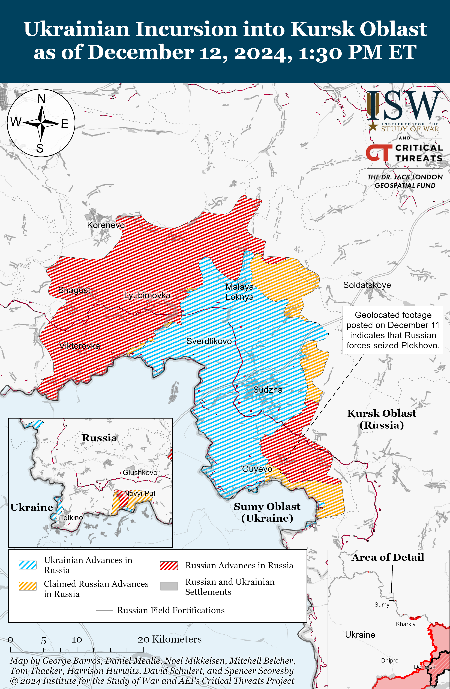
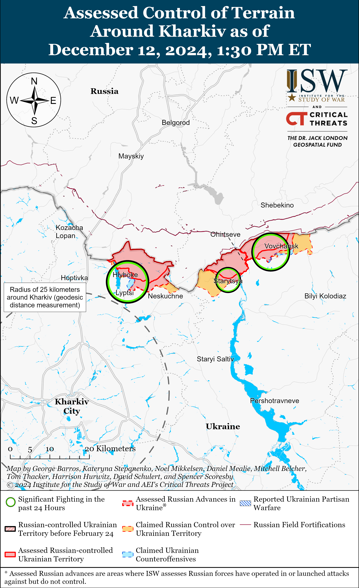
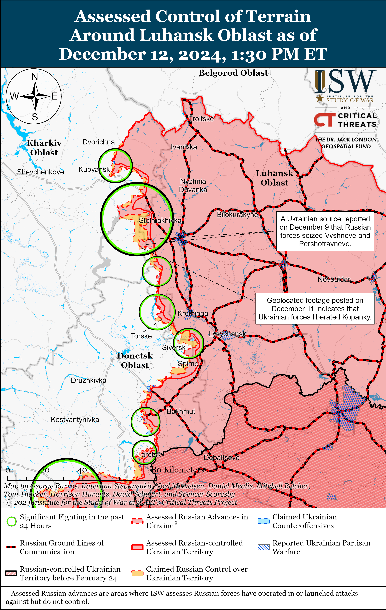
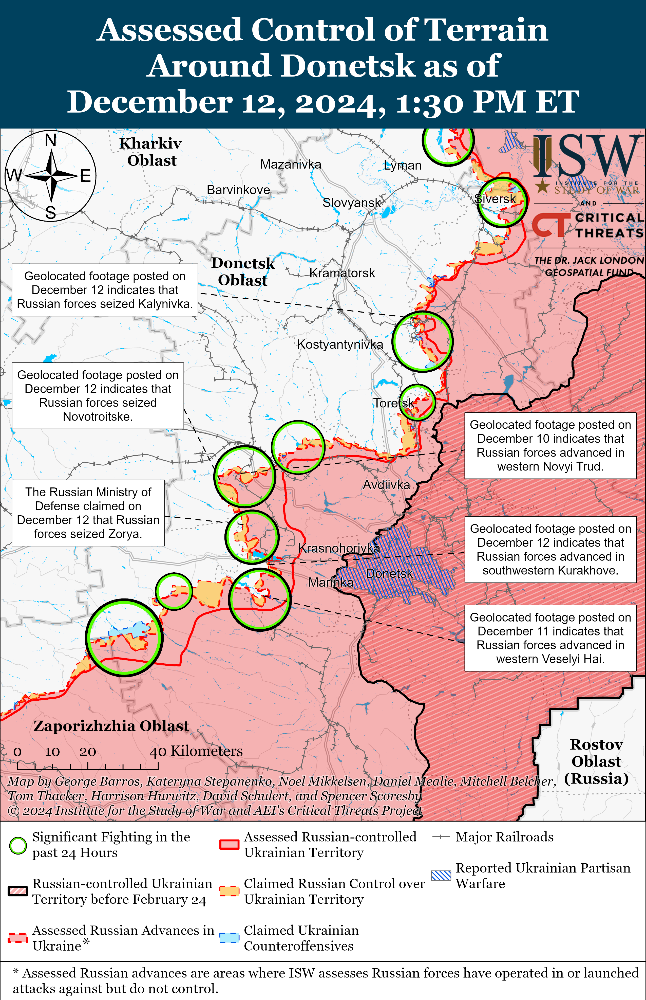
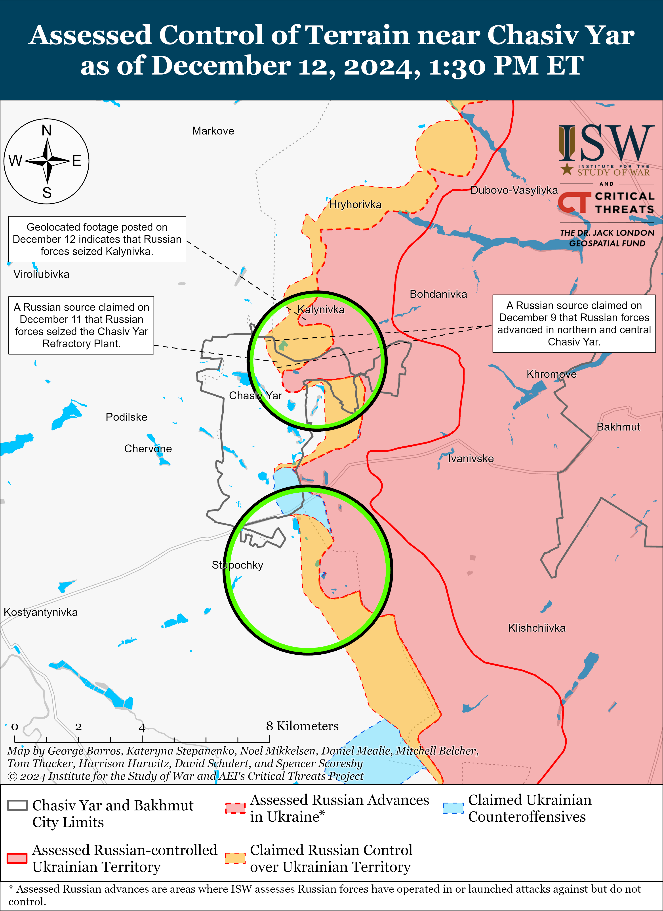
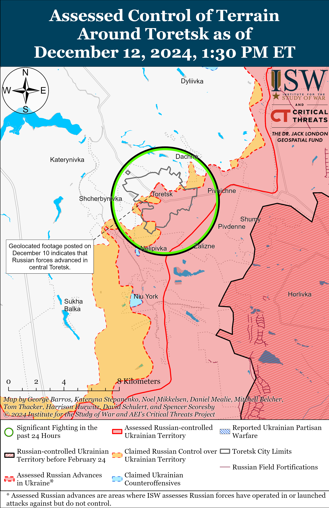
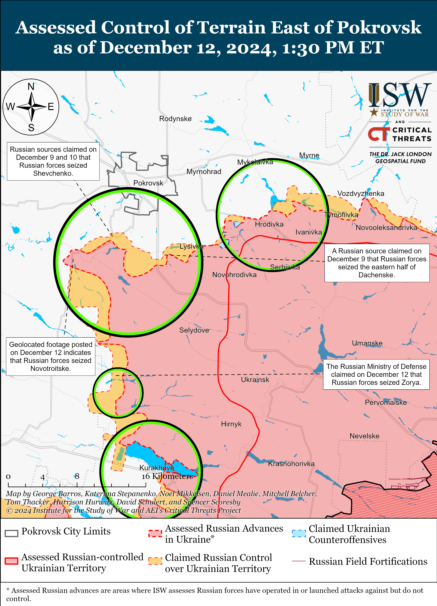
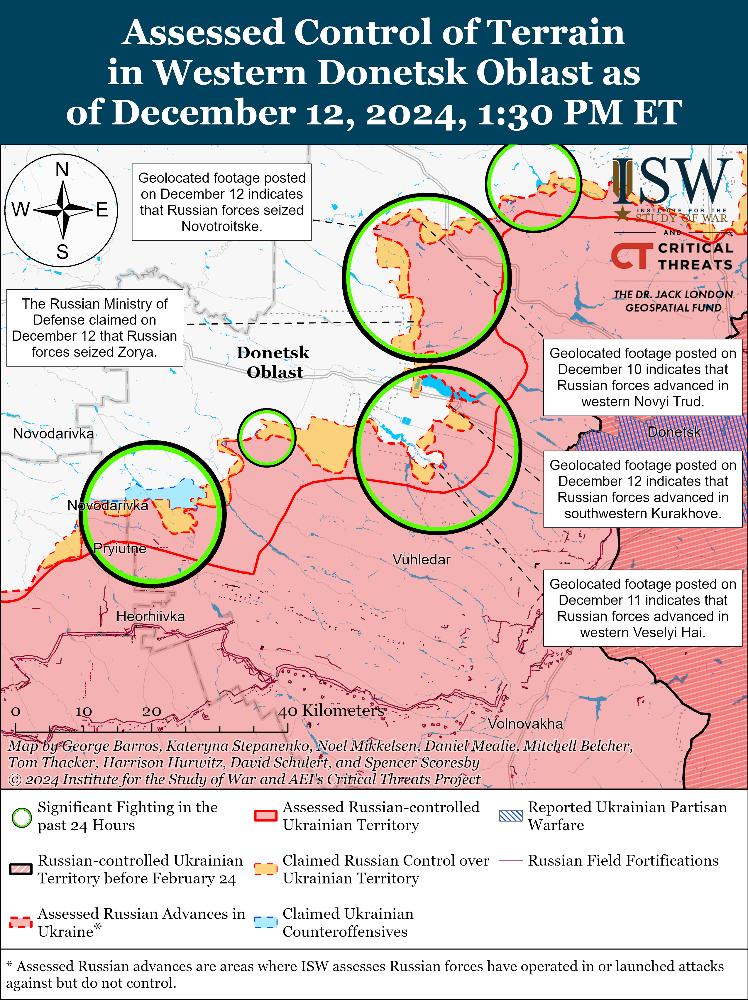
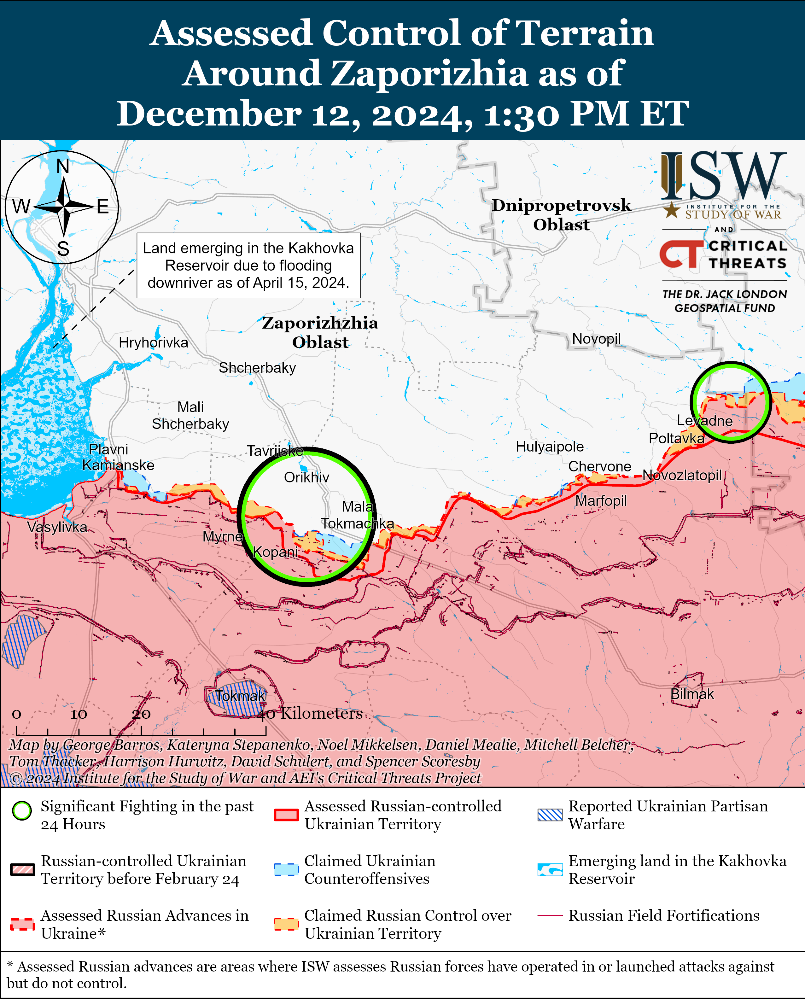
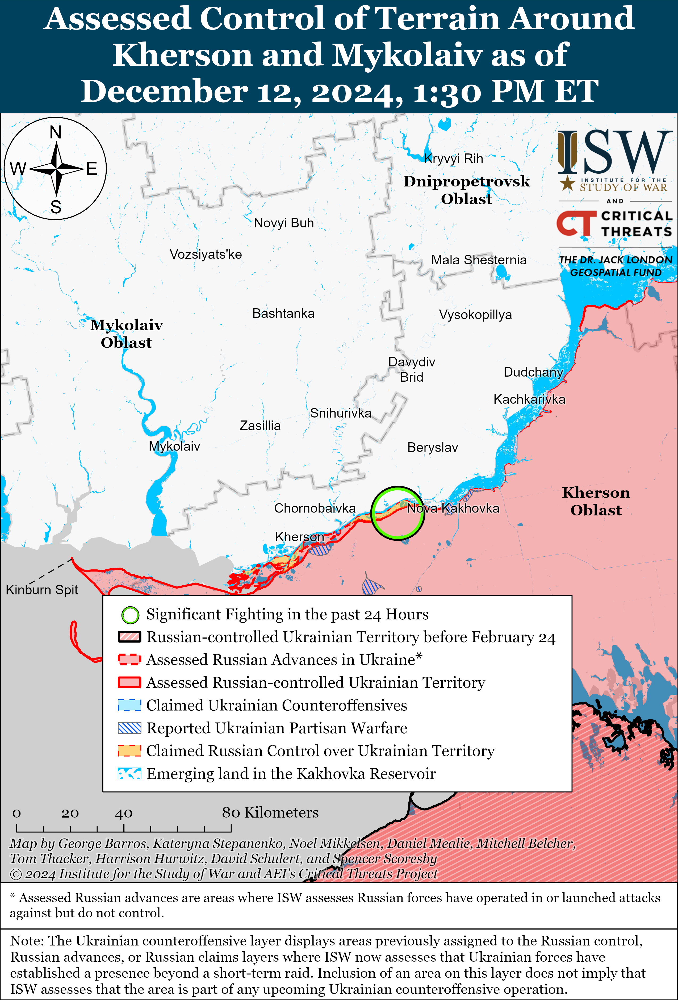

# Russian Offensive Campaign Assessment, December 12, 2024

**Christina Harward, Karolina Hird, Davit Gasparyan, Nate Trotter, Grace Mappes, Olivia Gibson, William Runkel, and Frederick W. Kagan**

**December 12, 2024, 6:40pm ET**

**Click** [**here**](https://storymaps.arcgis.com/stories/36a7f6a6f5a9448496de641cf64bd375) **to see ISW’s interactive map of the Russian invasion of Ukraine. This map is updated daily alongside the static maps present in this report.**

**Click** [**here**](https://storymaps.arcgis.com/stories/83a2f24901c941d581c0c523ecd2619b)**to see ISW’s interactive map of Ukraine’s offensive in Kursk Oblast.**

**Click** [**here**](https://understandingwar.maps.arcgis.com/apps/instant/3dviewer/index.html?appid=1602762dbcde419bb957dea358449580) **to see ISW’s 3D control of terrain topographic map of Ukraine. Use of a computer (not a mobile device) is strongly recommended for using this data-heavy tool.**

**Click** [**here**](https://storymaps.arcgis.com/stories/733fe90805894bfc8562d90b106aa895) **to access ISW’s archive of interactive time-lapse maps of the Russian invasion of Ukraine. These maps complement the static control-of-terrain map that ISW produces daily by showing a dynamic frontline. ISW will update this time-lapse map archive monthly.**

**Note: The data cut-off for this product was 12:15pm ET on December 12. ISW will cover subsequent reports in the December 13 Russian Offensive Campaign Assessment.**

**Russia has reportedly reached an agreement with select elements of the Syrian opposition about control over Russian military bases in Syria, but it remains unclear if the alleged agreement ensures the security of Russia’s bases in Syria in the long term.** *Bloomberg* reported on December 12 that unspecified sources with knowledge of the matter stated that the Russian Ministry of Defense (MoD) thinks it has an “informal understanding” with Hayat Tahrir al Sham (HTS) that would allow Russian forces to stay at Hmeimim Air Base and the Port of Tartus but noted that the situation could change due to instability in Syria.[1] Russian Deputy Foreign Affairs Minister Mikhail Bogdanov stated on December 12 that Russia has established contacts with HTS in Damascus and that Russian bases “continue to be located on Syrian territory.”[2] Bogdanov expressed hesitancy in response to a question about whether Russia expects its bases to remain in Syria, stating that the bases will “probably” remain but that there are no other decisions yet on the matter.[3] Bogdanov implied that Russia’s continued presence in Syria is important for the ongoing fight against terrorism in the country, likely as part of efforts to convince Syrian authorities to allow Russia to continue to operate its bases in the long-term. Russia has been using the cover of “fighting terrorism” as an excuse for military activities primarily aimed at supporting the Bashar al-Assad regime since it entered the Syrian Civil War in 2015.[4] A Russian milblogger claimed on December 11 that Syrian “militants” have surrounded Hmeimim Air Base and are periodically attempting to conduct provocations and shell the facility.[5] The milblogger claimed that Russia reached a “preliminary” agreement about the continued presence of Russian forces in Syria but that the agreement only lasts for 75 days, after which Russia will withdraw from Syria. It is unclear if the reported Russian agreement with Syrian authorities is permanent or temporary. The Syrian opposition encompasses several factions with varying ideologies and political objectives, and it is unclear if Russia is in contact with all the Syrian opposition factions necessary to guarantee the safety of Russian military bases in Syria.[6]

**Russia is reportedly moving four ships from Russian ports to Syria, possibly to facilitate evacuations —further demonstrating the Kremlin’s current cautious response to the developing situation in Syria.** Ukraine’s Main Military Intelligence Directorate (GUR) stated on December 12 that Russian forces from throughout Syria are withdrawing to Hmeimim Air Base and the Port of Tartus and that Russian forces are flying four to five miliary transport sorties daily between Hmeimim and unspecified airfields in Russia.[7] The GUR stated that Russia is moving its *Ivan Gren* Ivan Gren-class large landing ship and the *Aleksandr Otrakovsky* Ropucha-class landing ship to Tartus to evacuate weapons and equipment. The GUR stated that the two ships are currently in the Norwegian Sea and are scheduled to pass the English Channel in “a few days.” The GUR stated that the Russian *Sparta* and *Sparta II* cargo ships also left Baltiysk, Kaliningrad Oblast and St. Petersburg, respectively, and are heading to Tartus. It will likely be weeks until these ships reach the Mediterranean Sea and arrive at the Port of Tartus, and Russia may be moving these ships as a precaution should Moscow decide to conduct wider evacuations of the Port of Tartus and Hmeimim Air Base in the coming weeks. ISW continues to assess that the Kremlin is very likely hesitant to completely evacuate all military assets from Syria in the event that it can establish a relationship with Syrian opposition forces and the transitional government and continue to ensure the security of its basing and personnel in Syria.[8]

**Ukrainian officials denied Hungarian Prime Minister Viktor Orban’s claim that Ukraine rejected his offer to mediate a Christmas ceasefire and a large-scale prisoner of war (POW) exchange with Russia.** Orban accused Ukrainian President Volodymyr Zelensky on December 11 of rejecting his proposal for a ceasefire and POW swap with Russia — a statement that Russian authorities subsequently used to forward Russia’s ongoing information operation portraying Ukraine as unwilling to engage in POW exchanges and broader peace talks.[9] Ukrainian presidential aide Dmytro Lytvyn responded on December 12, stating that Hungarian officials did not discuss anything with Ukraine or inform Ukraine about Orban’s December 11 call with Russian President Vladimir Putin.[10] Lytvyn added that Ukraine has been negotiating with Russia for two weeks about a large-scale POW exchange at the end of 2024.[11] Zelensky criticized Orban’s direct engagement with Putin without consulting Ukraine and stated that Orban is undermining European unity around support to Ukraine.[12] Russia — not Ukraine — has previously demonstrated an unwillingness to conduct POW exchanges, as Russia reportedly rebuffed Ukrainian overtures for exchanges for months before the start of Ukraine’s offensive in Kursk Oblast in August 2024.[13]

**People’s Republic of China (PRC) President Xi Jinping continues to provide Kremlin officials with a platform from which to articulate their uncompromising demands on Ukrainian sovereignty.** Russian Security Council Deputy Chairperson Dmitry Medvedev met with Xi in Beijing on December 12.[14] Xi and Medvedev discussed the situations in Syria and Ukraine and highlighted the bilateral Russia-PRC relationship and their cooperation in multilateral institutions. Xi reiterated the PRC’s standard stance on the war in Ukraine, calling for “de-escalation” and advertising the PRC’s “Friends of Peace” Initiative with Brazil.[15] Medvedev later told Russian media on December 12 that he and Xi discussed potential settlements in Ukraine and claimed that Russia is “ready to resume negotiations with Ukraine” but only if “Ukraine understands the realities that have developed … on the ground.”[16] Medvedev explicitly invoked Russian President Vladimir Putin’s June 14, 2024 speech at the Russian Ministry of Foreign Affairs (MFA), wherein Putin stated that Ukrainian forces must “completely withdraw” from Ukrainian-controlled territory in Donetsk, Luhansk, Zaporizhia, and Kherson oblasts before Russia would agree to enter into negotiations.[17] Kremlin officials have long used the expression “realities on the ground” to refer to Russian gains on the battlefield, albeit largely incremental and gradual, and to force Ukraine and its partners to make concessions on Ukraine’s sovereignty by recognizing the territories that Russia has illegally occupied and annexed as part of Russia including those that Ukrainian forces still hold.[18] Russia’s version of “negotiations” that take into account the “realities on the ground” call forUkraine to surrender nearly 20 percent of its territory and millions of its people living under Russian occupation. Xi and the PRC have continually provided Kremlin officials with a platform to advocate for this desired end-state to the war, as ISW has previously reported.[19]

**India continues to preserve and enhance its economic relations with Russia despite recent efforts to reduce its reliance on Russia as a security partner.** *Reuters* reported on December 12 that Russian state oil company Rosneft and Indian refining company Reliance Industrieshave signed a historic 10-year deal through which Russia will supply 500,000 barrels of oil daily to India, valued at approximately $13 billion annually.[20] India has benefitted from cheap Russian energy supplies since the start of Russia’s full-scale invasion of Ukraine and subsequent Western sanctions, ultimately becoming the largest importer of Russian oil.[21] ISW has recently noted India’s efforts to reduce its reliance on Russian military cooperation, strengthen ties with the West, and distance itself from explicitly pro-Russian rhetoric on the war in Ukraine, but India nevertheless continues to balance these moves by maintaining strategic economic relations with Russia that are in India’s interest.[22]

**Russian authorities are set to equate the violation of Russian censorship laws with extremism and terrorism, furthering the Kremlin’s effort to establish a pseudo-state ideology.** The Russian State Duma adopted a bill in its second and third readings on December 12 that expands the legal grounds for putting individuals on the legal list of terrorists and extremists to include disseminating “fake” information or discrediting the Russian military in violation of Russia’s censorship laws.[23] This bill is the latest Kremlin measure to legally equate opposition to its war in Ukraine and criticism of Russia’s methods of waging the war with behavior that is illegal and undesirable in Russian society.[24] These measures to create a de-facto state ideology through the Russian legal system notably bypass the Russian Constitution, as Article 13 forbids the Russian state from establishing an official state ideology and commits Russia to recognizing ideological diversity.[25] The Russian State Duma passed a bill on December 10 that would remove the Taliban from the register of extremist and terrorist organizations.[26]

**Russian President Vladimir Putin awarded the Russian “Golden Star” Medal to a military correspondent for the first time since World War II as the Kremlin continues to use state awards to co-opt milbloggers and gain control over the Russian information space.** Putin awarded the “Golden Star” Medal — a medal awarded for an “act of heroism in service to the Russian government and people” and that accompanies the Hero of Russia title — to Russian milblogger and Russian State Television and Radio Broadcasting Company (VGTRK) correspondent Yevgeny Poddubny on December 12 and thanked other Russian military correspondents and journalists for covering the war in Ukraine and for their “faith in Russia.”[27] Putin awarded the Hero of Russia title to Poddubny in September 2024 for injuries that Poddubny sustained while reporting from Kursk Oblast in August 2024, and ISW previously assessed that the Kremlin has been increasingly trying to use Poddubny to disseminate official narratives in the Russian ultranationalist information space since late 2022.[28] Putin has also recently awarded prominent Russian milblogger and founder of the *Rybar* Telegram channel Mikhail Zvinchuk, who was initially critical of Russia’s military performance during its full-scale invasion, with the less prestigious Russian Order of Merit of the Fatherland Second Class part of continued Kremlin efforts to incentivize Russian milbloggers to be loyal to the Kremlin.[29]

**Actors affiliated with Ukraine’s Main Military Intelligence Directorate (GUR) likely assassinated the Deputy General Designer and Functional Software Department Head of the Russian Rosatom-owned “Mars” design bureau Mikhail Shatsky in Russia on December 12**. GUR sources told Ukrainian media outlet *Suspilne* that GUR actors may have been involved in the murder of Shatsky in Kotelniki, Moscow Oblast.[30] GUR sources alleged that Shatsky was working to modernize Russian Kh-59 cruise missiles into Kh-69 missiles and implementing artificial intelligence (AI) technology into Russian drones and other Russian military aerospace systems. ISW cannot confirm these reports.

**Key Takeaways:**

- **Russia has reportedly reached an agreement with select elements of the Syrian opposition about control over Russian military bases in Syria, but it remains unclear if the alleged agreement ensures the security of Russia’s bases in Syria in the long-term.**
- **Russia is reportedly moving four ships from Russian ports to Syria, possibly to facilitate evacuations — further demonstrating the Kremlin’s current cautious response to the developing situation in Syria.**
- **Ukrainian officials denied Hungarian Prime Minister Viktor Orban’s claim that Ukraine rejected his offer to mediate a Christmas ceasefire and a large-scale prisoner of war (POW) exchange with Russia.**
- **People’s Republic of China (PRC) President Xi Jinping continues to provide Kremlin officials with a platform from which to articulate their uncompromising demands on Ukrainian sovereignty.**
- **India continues to preserve and enhance its economic relations with Russia despite recent efforts to reduce its reliance on Russia as a security partner.**
- **Russian authorities are set to equate the violation of Russian censorship laws with extremism and terrorism, furthering the Kremlin’s effort to establish a pseudo-state ideology.**
- **Russian President Vladimir Putin awarded the Russian “Golden Star” Medal to a military correspondent for the first time since World War II as the Kremlin continues to use state awards to co-opt milbloggers and gain control over the Russian information space.**
- **Actors affiliated with Ukraine’s Main Military Intelligence Directorate (GUR) likely assassinated the Deputy General Designer and Functional Software Department Head of the Russian Rosatom-owned “Mars” design bureau Mikhail Shatsky in Russia on December 12**.
- **Russian forces recently advanced in the main Ukrainian salient in Kursk Oblast and in the Chasiv Yar, Pokrovsk, and Kurakhove directions.**
- **Ukrainian forces recently regained lost positions near Svatove.**
- **The Russian military command’s efforts to ensure operational security amongst Russian forces continue to draw ire from select milbloggers, who derided these efforts as disruptive overreach.**

***We do not report in detail on Russian war crimes because these activities are well-covered in Western media and do not directly affect the military operations we are assessing and forecasting. We will continue to evaluate and report on the effects of these criminal activities on the Ukrainian military and the Ukrainian population and specifically on combat in Ukrainian urban areas. We utterly condemn Russian violations of the laws of armed conflict and the Geneva Conventions and crimes against humanity even though we do not describe them in these reports.***

- Ukrainian Operations in the Russian Federation
- Russian Main Effort — Eastern Ukraine (comprised of three subordinate main efforts)
- Russian Subordinate Main Effort #1 — Push Ukrainian forces back from the international border with Belgorod Oblast and approach to within tube artillery range of Kharkiv City
- Russian Subordinate Main Effort #2 — Capture the remainder of Luhansk Oblast and push westward into eastern Kharkiv Oblast and encircle northern Donetsk Oblast
- Russian Subordinate Main Effort #3 — Capture the entirety of Donetsk Oblast
- Russian Supporting Effort — Southern Axis
- Russian Air, Missile, and Drone Campaign
- Russian Mobilization and Force Generation Efforts
- Russian Technological Adaptations
- Activities in Russian-occupied areas
- Significant Activity in Belarus

**Ukrainian Operations in the Russian Federation**

Russian forces recently advanced in the main Ukrainian salient in Kursk Oblast amid continued fighting in the area on December 12. Geolocated footage published on December 11 indicates that Russian forces recently advanced up to the east bank of the Psel River northwest of Plekhovo and southeast of Kurilovka (both south of Sudzha) and recaptured Plekhovo.[31] The Russian Ministry of Defense (MoD) claimed on December 12 that Russian forces also recaptured Darino and Novoivanovka (both southeast of Korenevo), and Russian milbloggers claimed that elements of the Russian 51st Airborne (VDV) Regiment (106th VDV Division) were responsible for the seizure of Darino.[32] Russian milbloggers claimed that Russian forces also advanced east of Novoivanovka, in the direction of Sverdlikovo (northwest of Sudzha), toward forested areas near Malaya Loknya (north of Sudzha) and Martynovka (northeast of Sudzha), and south of Guevo (south of Sudzha).[33] ISW has not observed confirmation of these claims, however. A Russian milblogger claimed the Russian forces’ slow rate of advance towards Guevo indicates that Russian forces will likely also struggle to recapture Sudzha quickly.[34] Russian forces continued offensive operations near Martynovka and in forest belts near Sverdlikovo and Novoivanovka on December 12[35] Elements of the 51st VDV Regiment are reportedly operating in the direction of Sverdlikovo and near Novoivanovka.[36] Infantry and artillery elements of the Chechen “Akhmat” Spetsnaz reportedly continue to operate in Kursk Oblast.[37]

**Russian Main Effort — Eastern Ukraine**

**Russian Subordinate Main Effort #1 — Kharkiv Oblast (Russian objective: Push Ukrainian forces back from the international border with Belgorod Oblast and approach to within tube artillery range of Kharkiv City)**

A Russian milblogger continued to claim on December 12 that fighting is ongoing in the Sumy Oblast international border area following milblogger claims of fighting and Russian advances near Oleksandriya in northeastern Sumy Oblast on December 10 and 11.[38] ISW is unable to confirm this claim.

Russian forces conducted ground attacks north of Kharkiv City near Hlyboke and Lyptsi and northeast of Kharkiv City near Vovchansk and Starytsya on December 11 and 12 but did not advance.[39]

**Russian Subordinate Main Effort #2 — Luhansk Oblast (Russian objective: Capture the remainder of Luhansk Oblast and push westward into eastern Kharkiv Oblast and northern Donetsk Oblast)**

Ukrainian forces recently regained lost positions near Svatove amid continued fighting along the Kupyansk-Svatove-Kreminna line on December 12. Geolocated footage published on December 11 indicates that Ukrainian forces recently recaptured Kopanky (west of Svatove).[40] A Russian milblogger claimed on December 12 that Russian forces advanced southeast of Kruhlyakivka (southeast of Kupyansk).[41] ISW has not observed confirmation of this claim, however. Geolocated footage published on December 12 shows Russian forces conducting an unsuccessful reduced company-sized mechanized assault consisting of eight vehicles east of Kolisnykivka (southeast of Kupyansk).[42] The Ukrainian battalion that repelled the attack reported that Ukrainian forces destroyed one tank, three infantry fighting vehicles, and three armored fighting vehicles. Russian forces continued assaults north of Kupyansk near Zapadne; northeast of Kupyansk near Synkivka; southeast of Kupyansk near Pishchane and Zahryzove; west of Svatove near Nadiya, Kopanky, and Lozova; southwest of Svatove near Hrekivka, Novoyehorivka, Tverdokhlibove, and Druzhelyubivka; northwest of Kreminna near Makiivka and Terny; west of Kreminna near Torske; and southwest of Kreminna near Hryhorivka and in the Serebryanske forest area on December 11 and 12. [43] A Russian milblogger claimed on December 11 that Russian and Ukrainian forces have decreased the intensity of their offensive operations in the Lyman direction due to poor weather conditions.[44] Drone operators of the Russian 16th Spetsnaz Brigade (Russian General Staff’s Main Directorate [GRU]) are reportedly operating in the Serebryanske forest area.[45] Elements of the Russian 144th Motorized Rifle Division (20th Combined Arms Army [CAA], Moscow Military District [MMD]) reportedly continue to operate near Terny.[46]

**Russian Subordinate Main Effort #3 — Donetsk Oblast (Russian objective: Capture the entirety of Donetsk Oblast, the claimed territory of Russia’s proxies in Donbas)**

Russian forces continued limited offensive operations east of Siversk near Verkhnokamyanske on December 11 and 12 but did not make any confirmed advances.[47]

Russian forces recently marginally advanced in the Chasiv Yar direction amid continued offensive operations in the area on December 12. Geolocated footage published on December 12 indicates that Russian forces recently advanced along Lisova Street on the western outskirts of Kalynivka (north of Chasiv Yar) and seized the settlement.[48] One Russian milblogger claimed that Russian forces are conducting clearing operations at the Chasiv Yar Refractory Plant, while other milbloggers claimed that fighting is ongoing in and near the plant and that Russian forces have not yet secured full control of the area.[49] ISW has not observed confirmation that Russian forces have seized the entire Refractory Plant. The Ukrainian General Staff reported that Russian forces conducted offensive operations near Chasiv Yar itself and south of Chasiv Yar near Bila Hora and Stupochky on December 11 and 12.[50]

Russian forces conducted ground attacks within and near Toretsk on December 11 and 12 but did not advance.[51] Elements of the 80th “Sparta” Separate Reconnaissance Battalion (51st Combined Arms Army [CAA], formerly 1st Donetsk People’s Republic Army Corps [DNR AC]) are reportedly operating in the Toretsk direction.[52]

Russian forces recently advanced south of Pokrovsk amid continued offensive operations in the area on December 12. Geolocated footage published on December 11 indicates that Russian forces recently seized Novotroitske (southwest of Pokrovsk) and advanced to a windbreak west of the settlement.[53] Additional geolocated footage published on December 10 and 11 indicates that Russian forces recently advanced northward along the Donetska railroad line west of Novyi Trud (northeast of Novotroitske and south of Pokrovsk), along Sosnova Street in western Shevchenko (southwest of Pokrovsk), and northwest along a windbreak west of Shevchenko.[54] A Russian milblogger claimed that Russian forces seized Pushkine (south of Shevchenko), but ISW has not yet observed confirmation of Russian forces operating within the settlement.[55] Several Russian milbloggers claimed that small Russian sabotage and reconnaissance groups have penetrated the southern outskirts of Pokrovsk and that Russian forces advanced northeast of Novoolenivka (southeast of Pokrovsk) and southwest of Novotroitske, but ISW has not observed confirmation of these claims.[56] One milblogger claimed that heavy fighting continues within Shevchenko and near Novotroitske, where Ukrainian forces are counterattacking, and that Russian forces are consolidating new positions near Novyi Trud.[57] A Ukrainian brigade spokesperson operating in the Pokrovsk direction noted that recent Russian advances place Russian forces about six to ten kilometers away from the outskirts of Pokrovsk and stated that Russian forces are trying to break through to Pokrovsk via its left and right flanks in order to avoid assaulting the town head-on.[58] Another Ukrainian brigade spokesperson stated that Russian forces near Pokrovsk are using light, unarmored vehicles to conduct personnel rotations and that Russian troops move in groups of two to three people (smaller than a standard fireteam).[59] The Ukrainian General Staff reported that Russian forces conducted ground attacks near Pokrovsk itself; east of Pokrovsk near Myrolyubivka and Promin; southeast of Pokrovsk near Lysivka, Novyi Trud, and Dachenske; south of Pokrovsk near Shevchenko and Pushkine; and southwest of Pokrovsk near Pishchane and Novotroitske on December 11 and 12.[60]

Russian forces recently advanced in the Kurakhove direction amid continued offensive operations in the area on December 12. Geolocated footage published on December 12 indicates that Russian forces recently advanced along Nahorna Street in southwestern Kurakhove and along Urozhaina Street in southern Kurakhove.[61] ISW further assesses that Russian forces made additional gains south of Kurakhove as Russian forces likely used the N-15 highway south of the settlement to advance into southern and southwestern Kurakhove. The Russian Ministry of Defense (MoD) claimed that Russian forces seized Zorya (northwest of Kurakhove), and Russian milbloggers claimed that Russian forces advanced west of Stari Terny (northwest of Kurakhove) and entered Shevchenko (west of Stari Terny), in western Kurakhove, and up to 700 meters in central Sontsivka (northwest of Kurakhove).[62] ISW has not observed confirmation of these claims, however. A Russian milblogger claimed that Russian forces occupy 90 percent of Sontsivka, but ISW has only observed confirmation that Russian forces occupy roughly 70 percent of the settlement.[63] Russian forces conducted offensive operations near Kurakhove itself; northwest of Kurakhove near Sontsivka, Zorya, and Stari Terny; west of Kurakhove near Dachne; and south of Kurakhove near Dalne on December 11 and 12.[64] Elements of the Russia 68th Tank Regiment (150th Motorized Rifle Division, 8th CAA, Southern Military District [SMD]) are reportedly operating in the Kurakhove direction, and elements of the 5th Motorized Rifle Brigade (51st CAA) are reportedly operating near Kurakhove.[65] Ukrainian military observer Kostyantyn Mashovets stated that elements of the Russian 39th Motorized Rifle Brigade and 18th Machine Gun-Artillery Division (both 68th AC, Eastern Military District [EMD]) are operating in the Kurakhove direction.[66]

Russian forces continued offensive operations in the Vuhledar direction on December 12 but did not make any confirmed advances. A Russian milblogger claimed that Russian forces advanced near Kostyantynopolske (northwest of Vuhledar), but ISW has not observed confirmation of this claim.[67] Russian forces conducted offensive operations northeast of Vuhledar near Antonivka, Katerynivka, and Yelizavetivka; north of Vuhledar near Veselyi Hai, Trudove, Uspenivka, and Hannivka; and northwest of Vuhledar near Sukhi Yaly and Kostyantynopolske on December 11 and 12.[68] Mashovets stated on December 12 that elements of the Russian 36th Motorized Rifle Brigade (29th AC, EMD), with support from elements of the 114th Motorized Rifle Brigade (51st CAA), regrouped northeast of Kurakhove and are attacking towards Uspenivka, Kostyantynopolske, and Sukhyi Yaly.[69] Mashovets stated that elements of the 20th Motorized Rifle Division (8th CAA, SMD) are attacking Uspenivka from Dalne (northeast of Uspenivka).

Russian forces continued offensive operations near Velyka Novosilka on December 12 but did not make any confirmed advances. A Russian milblogger claimed that Russian forces advanced near Rinvopil (southwest of Velyka Novosilka), but ISW has not observed confirmation of this claim.[70] Russian forces conducted offensive operations northeast of Velyka Novosilka near Rozdolne, south of Velyka Novosilka near Blahodatne and Neskuchne, and southwest of Velyka Novosilka near Novodarivka on December 11 and 12.[71] Russian sources claimed that Ukrainian forces counterattacked near Novyi Komar (north of Velyka Novosilka), Rozdolne, and Blahodatne.[72] A Russian milblogger claimed that Russian forces had to withdraw from the southern outskirts of Velyka Novosilka due to challenging terrain.[73] Mashovets stated that elements of the Russian elements of the Russian 36th Motorized Rifle Brigade (29th CAA, EMD), 57th Motorized Rifle Brigade (36th CAA, EMD), and 336th Naval Infantry Brigade (Baltic Fleet, Leningrad Military District [LMD]) are operating are operating in the Velyka Novosilka direction.[74] Mashovets reported that elements of the 40th Naval Infantry Brigade (Pacific Fleet, EMD) are operating near Novyi Komar and Rozdolne; that elements of the 37th Motorized Rifle Brigade and 5th Tank Brigade (both 36th CAA, EMD) are attacking east and south of Velyka Novosilka; that elements of the 60th Motorized Rifle Brigade (5th CAA, EMD), with support from elements of the 34th Motorized Rifle Brigade (49th CAA, SMD), are attacking near Makarivka and Neskuchne (both south of Velyka Novosilka); and that elements of the 127th Motorized Rifle Division (5th CAA, EMD) are attacking near Novodarivka.[75]

Mashovets stated that the Russian Eastern Grouping of Forces, which is operating in the Velyka Novosilka and Hulyaipole directions, consists of 54,000 to 55,000 personnel (most of whom are operating in the Velyka Novosilka direction), up to 348 tanks, roughly 815 to 820 armored fighting vehicles, up to 430 to 432 artillery systems, and 110 to 112 multiple launch rocket systems (MLRS).[76] Mashovets stated that the Eastern Grouping of Forces’ operational reserves include up to two motorized rifle regiments and up to four reserve battalions.

**Russian Supporting Effort — Southern Axis (Russian objective: Maintain frontline positions and secure rear areas against Ukrainian strikes)**

Russian and Ukrainian sources did not report any ground activity in the Hulyaipole or Polohy directions in eastern Zaporizhia Oblast on December 12. Ukrainian military observer Kostyantyn Mashovets stated that elements of the Russian 38th Motorized Rifle Brigade, 64th Motorized Rifle Brigade, and 69th Covering Brigade (all of the 35th Combined Arms Army [CAA], Eastern Military District [EMD]) are operating in the Hulyaipole direction, and drone operators of the Russian 38th Motorized Rifle Brigade (35th CAA, EMD) are reportedly operating in the Polohy direction.[77]

Russian forces continued limited offensive operations near Novoandriivka (northwest of Robotyne) and Novodanylivka (north of Robotyne) in western Zaporizhia Oblast on December 11 and 12 but did not make any confirmed advances.[78] The Crimea-based Ukrainian “Atesh” partisan organization reported on December 11 that Russian forces are increasingly transferring columns of military equipment from occupied Crimea to occupied Zaporizhia Oblast, including tanks and other armored vehicles.[79]

Russian forces continued limited assaults in the Dnipro direction in east (left) bank Kherson Oblast on December 11 and 12 but did not make any confirmed advances.[80]

Ukrainian forces conducted a drone strike against occupied Crimea on the night of December 11 to 12. Sevastopol occupation governor Mikhail Razvozhaev claimed that Russian forces, including from the Black Sea Fleet, shot down five drones near occupied Sevastopol and that Russian electronic warfare (EW) suppressed two more drones in an unspecified location.[81] Razvozhaev claimed that Russian forces shot down at least two drones near Balaklava and Inkerman (both on the outskirts of Sevastopol).[82] A prominent Kremlin-affiliated Russian milblogger claimed that Ukrainian forces launched eight total drones at occupied Crimea and that Russian forces repelled the attack using Su-34 fighter jets, a Pantsir-S1 air defense system, and other air defense assets.[83]

**Russian Air, Missile, and Drone Campaign (Russian Objective: Target Ukrainian military and civilian infrastructure in the rear and on the frontline)**

Nothing significant to report.

**Russian Mobilization and Force Generation Efforts (Russian objective: Expand combat power without conducting general mobilization)**

The Russian military command’s efforts to ensure operational security amongst Russian forces continue to draw ire from select milbloggers, who derided these efforts as disruptive overreach. A Russian milblogger and former Storm-Z instructor claimed on December 11 that Russian military authorities are actively enforcing a directive banning Russian military personnel from using civilian vehicles for transportation in Ukraine.[84] The milblogger stated that Russian soldiers reported widespread confiscations of civilian vehicles that they use in official military capacities and claimed that military authorities confiscated 17 vehicles in one raid in occupied Donetsk Oblast alone. The milblogger noted that the vehicle ban is complicating Russian frontline logistics and medical evacuation efforts. Russian milbloggers complained in late November 2024 about the Russian military command’s reported attempts to restrict the use of personal vehicles in the Russian military, and Russian milbloggers have complained about other bans the Russian military command has enacted, including the unpopular decision to ban Russian forces from using personal electronic devices on the frontlines.[85] Russian milbloggers frequently claim that the Russian Ministry of Defense’s (MoD)s incompetence and inability to centralize the provision of basic goods to the frontline is driving Russian soldiers to look to personal vehicles and supplies to compensate for the inadequacies —creating substantial tension in the MoD-frontline soldier dynamic.[86]

The Russian government continues efforts to evade Western sanctions targeting the import and export of goods used to support Russia’s war effort. Russian investigative outlet *The Insider* reported on December 11 that Russia continues to import thousands of Western-manufactured sniper rifles and millions of rounds of ammunition through loopholes in Western sanctions targeting Russia.[87] *The Insider* reported that Russian importers continue to purchase Western small arms through third party countries, such as Armenia, Georgia, Kazakhstan, Kyrgyzstan and Uzbekistan, whose imports of Western firearms have increased exponentially since the start of Russia’s full-scale invasion of Ukraine. *The Insider* reported that there continue to be some partnerships between Western arms manufactures and Russian arms importers despite Western sanctions banning such activities. Ukraine’s Main Military Intelligence Directorate (GUR) reported on December 12 that Russian authorities are employing a “shadow fleet” of 238 poorly maintained oil tankers under ambiguous ownership that enable the Russian government to circumvent Western sanctions and generate billions of dollars in annual revenue from oil sales.[88] The GUR reported that Russia generated $188 billion in revenue from oil sales using these sanctions evasion methods in 2023 alone.

Russia’s civilian aviation industry continues to suffer due to Western sanctions, even as Russian military imports and oil exports continue to flow freely. *BBC Russian Service* reported on December 12 that Russia’s United Aircraft Corporation has built only seven out of a planned 108 commercial aircraft since 2022 due to Western-imposed sanctions targeting the export of aviation components to Russia.[89] *BBC’s Russian Service* reported that Russian authorities responded to Western sanctions in 2022 with an ambitious domestic airline manufacturing program which has since floundered under the pressure of Western sanctions.

Russian authorities continue efforts to build specialized Russian military training facilities in Russia and occupied Ukraine. A Telegram channel affiliated with the Plenipotentiary Representative of the President of the Russian Federation in the Far Eastern Federal District announced on December 12 that Russian authorities plan to build a new Russian military sniper training center in Primorsky Krai.[90] Russian officials reported that the training ground will train Russian snipers and host ”military-patriotic and sports military” events, likely part of efforts to institutionalize “military-patriotic” education amongst Russians. A Russian milblogger reported on December 12 that Russian recruits began a sniper training course at the Russian “Nevsky” Volunteer Reconnaissance-Assault Brigade (Russian Volunteer Corps) sniper training center at an undisclosed location in occupied Ukraine.[91] The expansion of specialized Russian training centers to boost the number of specialists within the Russian military represents a continuation of long-running Kremlin efforts to increase manpower reserves over the long-term and increase the number of specialists within the Russian military.

Independent Russian-language outlet *Idel Realii* reported on December 12 that Russian Security Council Secretary Sergei Shoigu recently inspected newly built Russian military buildings that may be biological weapons laboratories in Moscow Oblast.[92] *Idel Realii* reported that the new laboratories are located at the Soviet-era Sergiev Posad-6 facility, which is now called the 48th Central Research Institute and which has been developing biological weapons for the Russian armed forces since 1948. *Idel Realii* stated that Russian authorities announced the construction of the new facilities in January 2024 and that Shoigu’s inspection follows visits from similarly high-ranking Kremlin officials to the facilities since the start of 2024. The *Washington Post* reported on October 25, 2024 that satellite imagery and interviews with current and former U.S. intelligence officials indicated that four out of the six newly constructed buildings at the site may house biological weapons laboratories.[93]

**Russian Technological Adaptations (Russian objective: Introduce technological innovations to optimize systems for use in Ukraine)**

A Russian milblogger claimed on December 11 that Russian forces recently began using new “Storm” reconnaissance drones in Ukraine to conduct reconnaissance and adjust artillery fire.[94]

**Activities in Russian-occupied areas (Russian objective: Consolidate administrative control of annexed areas; forcibly integrate Ukrainian citizens into Russian sociocultural, economic, military, and governance systems)**

*ISW is not publishing coverage of activities in Russian-occupied areas today.*

**Significant activity in Belarus (Russian efforts to increase its military presence in Belarus and further integrate Belarus into Russian-favorable frameworks and Wagner Group activity in Belarus)**

The Belarusian Ministry of Defense (MoD) announced on December 12 that President Alexander Lukashenko approved the Belarusian state defense plan for 2026 to 2030.[95] Belarusian state media agency *Belta* reported on December 12 that Belarus drafted the defense plan based upon lessons learned after domestic instability following the 2020 Belarusian presidential election, the Russian full-scale invasion of Ukraine, and recent changes to the Belarusian National Security Concept and Military Doctrine.[96]

**Note: ISW does not receive any classified material from any source, uses only publicly available information, and draws extensively on Russian, Ukrainian, and Western reporting and social media as well as commercially available satellite imagery and other geospatial data as the basis for these reports. References to all sources used are provided in the endnotes of each update.**

[1] https://www.bloomberg.com/news/articles/2024-12-12/russia-nears-deal-with-new-syria-leaders-to-keep-military-bases

[2] https://tass dot ru/politika/22656893

[3] https://ria dot ru/20241212/bogdanov-1988913948.html

[4] https://understandingwar.org/backgrounder/russian-airstrikes-syria-june-18-july-13-2016 ; https://understandingwar.org/backgrounder/russian-airstrikes-syria-february-17-28-2016-pre-and-post-cessation-hostilities

[5] https://t.me/akashevarova/7685

[6] https://understandingwar.org/backgrounder/russian-offensive-campaign-assessment-december-8-2024

[7] https://t.me/DIUkraine/5012

[8] https://isw.pub/UkrWar121024

[9] https://x.com/PM\_ViktorOrban/status/1866888070030643282 ; https://suspilne dot media/900423-orban-zaaviv-so-zelenskij-vidmovivsa-vid-rizdvanogo-peremira-z-rf/ ; https://t.me/bbcrussian/74105  ; https://t.me/bbcrussian/74080 ; https://t.me/bbcrussian/74079 ; https://t.me/tass\_agency/290602; https://t.me/tass\_agency/290617; https://t.me/tass\_agency/290605; https://t.me/tass\_agency/290604; https://t.me/tass\_agency/290604; https://t.me/tass\_agency/290603; https://t.me/tass\_agency/290602; https://t.me/tass\_agency/290661

[10] https://suspilne dot media/900423-orban-zaaviv-so-zelenskij-vidmovivsa-vid-rizdvanogo-peremira-z-rf/

[11] https://suspilne dot media/900423-orban-zaaviv-so-zelenskij-vidmovivsa-vid-rizdvanogo-peremira-z-rf/

[12] https://x.com/ZelenskyyUa/status/1866861074227626096

[13] https://isw.pub/UkrWar091524; https://understandingwar.org/backgrounder/russian-offensive-campaign-assessment-december-3-2024

[14] https://t.me/tass\_agency/290584; https://t.me/tass\_agency/290608; https://t.me/tass\_agency/290572; https://t.me/tass\_agency/290622; https://t.me/medvedev\_telegram/549

[15] https://www.mfa.gov dot cn/wjdt\_674879/gjldrhd\_674881/202412/t20241212\_11543413.shtml; http://www.news dot cn/world/20241212/c1a6f978831447fdaa03fba4a0215044/c.html; https://isw.pub/UkrWar102324; https://understandingwar.org/wp-content/uploads/2024/12/Russian20Operations20Assessment20March20172C202023.pdf

[16] https://tass dot ru/politika/22652249

[17] http://kremlin dot ru/events/president/news/74285

[18] https://understandingwar.org/backgrounder/russian-offensive-campaign-assessment-december-9; https://www.interfax dot ru/russia/962203; https://tass dot ru/politika/20842381

[19] https://isw.pub/UkrWar070824; https://isw.pub/UkrWar051624; https://isw.pub/UkrWar041624

[20] https://www.reuters.com/business/energy/rosneft-reliance-agree-biggest-ever-india-russia-oil-supply-deal-sources-say-2024-12-12/

[21] https://www.reuters.com/markets/commodities/india-surpasses-china-become-russias-top-oil-buyer-july-2024-08-22/

[22] https://understandingwar.org/backgrounder/russian-offensive-campaign-assessment-december-3-2024; https://understandingwar.org/backgrounder/russian-offensive-campaign-assessment-december-3-2024

[23] https://meduza dot io/news/2024/12/12/gosduma-razreshila-vnosit-v-spisok-ekstremistov-i-terroristov-obvinyaemyh-v-feykah-pro-armiyu; https://t.me/sotaproject/91199; https://sozd.duma.gov dot ru/bill/671687-8 ; https://t.me/astrapress/70147; https://t.me/severrealii/28736

[24] https://understandingwar.org/backgrounder/russian-offensive-campaign-assessment-november-22-2023; https://understandingwar.org/backgrounder/russian-offensive-campaign-assessment-december-11-2023; https://understandingwar.org/backgrounder/russian-offensive-campaign-assessment-august-19-2024; https://understandingwar.org/backgrounder/russian-offensive-campaign-assessment-september-6-2024; https://understandingwar.org/backgrounder/russian-offensive-campaign-assessment-july-30-2024

[25] https://rm.coe.int/constitution-of-the-russian-federation-en/1680a1a237

[26] https://sozd.duma.gov dot ru/bill/778284-8 ; https://meduza dot io/news/2024/12/10/gosduma-prinyala-v-pervom-chtenii-zakonoproekt-pozvolyayuschiy-isklyuchit-taliban-iz-spiska-terroristov

[27] https://tass dot ru/obschestvo/22654229; https://rg dot ru/2024/12/12/putin-poblagodaril-voenkorov-i-drugih-rossijskih-zhurnalistov-za-veru-v-rossiiu.html; https://tass dot ru/politika/22654305; https://t.me/tass\_agency/290641; https://t.me/tass\_agency/290651

[28] https://understandingwar.org/backgrounder/russian-offensive-campaign-assessment-september-30-2024

[29] https://understandingwar.org/backgrounder/russian-offensive-campaign-assessment-november-16-2023; https://understandingwar.org/backgrounder/russian-offensive-campaign-assessment-january-2-2023; https://understandingwar.org/backgrounder/russian-offensive-campaign-assessment-august-18-2023 ; https://understandingwar.org/backgrounder/russian-offensive-campaign-assessment-december-21

[30] https://suspilne dot media/900767-u-moskvi-likviduvali-mihajla-satskogo-akij-modernizovuvav-krilati-raketi/; https://armyinform dot com.ua/2024/12/12/raketa-na-ukrayinu-kulya-v-skronyu-u-pidmoskov%ca%bcyi-likviduvaly-rosijskogo-konstruktora/; https://t.me/army\_tv/7063 ; https://suspilne dot media/900767-u-moskvi-likviduvali-mihajla-satskogo-akij-modernizovuvav-krilati-raketi/; https://www.rbc dot ua/ukr/news/moskvi-likviduvali-topposadovtsya-kiy-zaymavsya-1733998517.html; https://www.unian dot net/world/likvidovaniy-u-pidmoskov-ji-konstruktor-buv-ideologom-vprovadzhennya-shi-u-droni-dzherelo-12850092.html; https://meduza dot io/news/2024/12/12/ukrainskie-smi-v-podmoskovie-ubit-razrabotchik-raket-h-69-mihail-shatskiy; https://www.rbc dot ua/ukr/news/moskvi-likviduvali-topposadovtsya-kiy-zaymavsya-1733998517.html; https://www.unian dot net/world/likvidovaniy-u-pidmoskov-ji-konstruktor-buv-ideologom-vprovadzhennya-shi-u-droni-dzherelo-12850092.html ; https://t.me/astrapress/70134; https://t.me/istories\_media/8481

[31] https://x.com/blinzka/status/1867190201279516708 ; https://x.com/fGr6JW3waJ1FKMN/status/1867044804586295628

[32] https://t.me/mod\_russia/46774 ; https://t.me/mod\_russia/46775 ; https://t.me/boris\_rozhin/147529 ; https://t.me/motopatriot/30332

[33] https://t.me/boris\_rozhin/147529 ; https://t.me/dva\_majors/59984 ; https://t.me/motopatriot/30344 ; https://t.me/motopatriot/30351

[34] https://t.me/motopatriot/30320

[35] https://t.me/rusich\_army/19267

[36] https://t.me/motopatriot/30332 ; https://t.me/DnevnikDesantnika/20789 ; https://t.me/boris\_rozhin/147529 ; https://t.me/boris\_rozhin/147645

[37] https://t.me/wargonzo/23662 ; https://rutube dot ru/video/8694aa01175d45bbeb92def0c585cb57/?r=a/ ; https://t.me/wargonzo/23690

[38] https://t.me/rusich\_army/19267; https://understandingwar.org/backgrounder/russian-offensive-campaign-assessment-december-11-2024; https://understandingwar.org/backgrounder/russian-offensive-campaign-assessment-december-10-2024

[39] https://www.facebook.com/GeneralStaff.ua/posts/pfbid0URFKkhiCNFoq1vne8y1KXbq5kzcZ4JvAzWFptfjeaCvwCAS3QhZK9aPxR9CitZ2Bl; https://www.facebook.com/GeneralStaff.ua/posts/pfbid024RujMVVHWXZB1bJ7TUMY5HRkS2qKjdPfUCraFvB8UmubBQWwnipdsFaV5r7CS2G4l; https://www.facebook.com/GeneralStaff.ua/posts/pfbid0ogU3qzedb87inx2dkvxVaLqFrq9Bnj3Z2FNoRQiAyuLxZuh1pVeE4FwH8hzDKLpKl; https://t.me/otukharkiv/3014; https://t.me/DnevnikDesantnika/20768

[40] https://x.com/GermanObserver1/status/1867020235456516266; https://www.youtube.com/watch?v=w7YxoEsG3L4&rco=1; https://t.me/ab3army/4982

[41] https://t.me/z\_arhiv/30046

[42] https://t.me/kiber\_boroshno/10805; https://t.me/fedorenkoys/803; https://t.me/ButusovPlus/15760; https://www.facebook.com/watch/?v=1813323696073549&rdid=J73iqR4qcEZ5aL91

[43] https://www.facebook.com/GeneralStaff.ua/posts/pfbid0URFKkhiCNFoq1vne8y1KXbq5kzcZ4JvAzWFptfjeaCvwCAS3QhZK9aPxR9CitZ2Bl; https://www.facebook.com/GeneralStaff.ua/posts/pfbid024RujMVVHWXZB1bJ7TUMY5HRkS2qKjdPfUCraFvB8UmubBQWwnipdsFaV5r7CS2G4l; https://www.facebook.com/GeneralStaff.ua/posts/pfbid0ogU3qzedb87inx2dkvxVaLqFrq9Bnj3Z2FNoRQiAyuLxZuh1pVeE4FwH8hzDKLpKl

[44] https://t.me/vysokygovorit/18275

[45] https://t.me/boris\_rozhin/147582; https://t.me/boris\_rozhin/147521

[46] https://t.me/vysokygovorit/18275

[47] https://www.facebook.com/GeneralStaff.ua/posts/pfbid024RujMVVHWXZB1bJ7TUMY5HRkS2qKjdPfUCraFvB8UmubBQWwnipdsFaV5r7CS2G4l; https://www.facebook.com/GeneralStaff.ua/posts/pfbid0ogU3qzedb87inx2dkvxVaLqFrq9Bnj3Z2FNoRQiAyuLxZuh1pVeE4FwH8hzDKLpKl

[48] https://t.me/creamy\_caprice/7794; https://t.me/sarmat21ompb3/279

[49] https://t.me/DnevnikDesantnika/20810; https://t.me/DnevnikDesantnika/20768; https://t.me/wargonzo/23663

[50] https://www.facebook.com/GeneralStaff.ua/posts/pfbid0URFKkhiCNFoq1vne8y1KXbq5kzcZ4JvAzWFptfjeaCvwCAS3QhZK9aPxR9CitZ2Bl; https://www.facebook.com/GeneralStaff.ua/posts/pfbid024RujMVVHWXZB1bJ7TUMY5HRkS2qKjdPfUCraFvB8UmubBQWwnipdsFaV5r7CS2G4l; https://www.facebook.com/GeneralStaff.ua/posts/pfbid0ogU3qzedb87inx2dkvxVaLqFrq9Bnj3Z2FNoRQiAyuLxZuh1pVeE4FwH8hzDKLpKl

[51] https://www.facebook.com/GeneralStaff.ua/posts/pfbid0URFKkhiCNFoq1vne8y1KXbq5kzcZ4JvAzWFptfjeaCvwCAS3QhZK9aPxR9CitZ2Bl; https://www.facebook.com/GeneralStaff.ua/posts/pfbid024RujMVVHWXZB1bJ7TUMY5HRkS2qKjdPfUCraFvB8UmubBQWwnipdsFaV5r7CS2G4l; https://www.facebook.com/GeneralStaff.ua/posts/pfbid0ogU3qzedb87inx2dkvxVaLqFrq9Bnj3Z2FNoRQiAyuLxZuh1pVeE4FwH8hzDKLpKl; https://t.me/wargonzo/23663

[52] https://t.me/wargonzo/23675

[53] https://t.me/creamy\_caprice/7797; https://t.me/assaultbattalion33/41; https://t.me/WarArchive\_ua/23436; https://t.me/skalabatalion/468

[54] https://t.me/WarArchive\_ua/23431; https://t.me/khornegroup/2965; https://t.me/creamy\_caprice/7791; https://t.me/urga\_74/2814; https://t.me/creamy\_caprice/7791; https://t.me/urga\_74/2814; https://x.com/TuiteroMartin/status/1867204130361704514

[55] https://t.me/z\_arhiv/30040; https://t.me/z\_arhiv/30043

[56] https://t.me/milinfolive/137397; https://t.me/milinfolive/137367; https://t.me/notes\_veterans/20992; https://t.me/boris\_rozhin/147627; https://t.me/z\_arhiv/30040

[57] https://t.me/rybar/66286; https://t.me/ne\_rybar/3757; https://t.me/rybar/66253; https://t.me/rybar/66252

[58] https://armyinform.com dot ua/2024/12/12/kryvava-gra-flangamy-poblyzu-pokrovska-vorog-kynuv-shturmuvaty-v-loba-i-pochav-obhodyty-misto/

[59] https://suspilne dot media/donbas/900887-buhanki-bagi-dzipi-rosijski-vijska-na-pokrovskomu-napramku-provodat-rotacii/

[60] https://www.facebook.com/GeneralStaff.ua/posts/pfbid0URFKkhiCNFoq1vne8y1KXbq5kzcZ4JvAzWFptfjeaCvwCAS3QhZK9aPxR9CitZ2Bl; https://www.facebook.com/GeneralStaff.ua/posts/pfbid024RujMVVHWXZB1bJ7TUMY5HRkS2qKjdPfUCraFvB8UmubBQWwnipdsFaV5r7CS2G4l; https://www.facebook.com/GeneralStaff.ua/posts/pfbid0ogU3qzedb87inx2dkvxVaLqFrq9Bnj3Z2FNoRQiAyuLxZuh1pVeE4FwH8hzDKLpKl

[61] https://t.me/creamy\_caprice/7801; https://t.me/oaembr46/1197; https://x.com/MikiValbuena/status/1867234512071172396; https://x.com/MikiValbuena/status/1867235995835588958; https://x.com/MikiValbuena/status/1867237031912305140; https://x.com/MikiValbuena/status/1867237672860688407;

[62] https://t.me/motopatriot/30337; https://t.me/mod\_russia/46773; https://t.me/boris\_rozhin/147613; https://t.me/sashakots/50690 ; https://t.me/voenkorKotenok/60677

[63] https://t.me/voenkorKotenok/60680

[64] https://www.facebook.com/GeneralStaff.ua/posts/pfbid0URFKkhiCNFoq1vne8y1KXbq5kzcZ4JvAzWFptfjeaCvwCAS3QhZK9aPxR9CitZ2Bl ; https://www.facebook.com/GeneralStaff.ua/posts/pfbid024RujMVVHWXZB1bJ7TUMY5HRkS2qKjdPfUCraFvB8UmubBQWwnipdsFaV5r7CS2G4l ; https://www.facebook.com/GeneralStaff.ua/posts/pfbid0ogU3qzedb87inx2dkvxVaLqFrq9Bnj3Z2FNoRQiAyuLxZuh1pVeE4FwH8hzDKLpKl; https://t.me/sashakots/50690; https://t.me/voenkorKotenok/60677

[65] https://t.me/dva\_majors/60051; https://t.me/pionergrupa/4300 ; https://t.me/boris\_rozhin/147635; https://t.me/Sladkov\_plus/12025

[66] https://t.me/zvizdecmanhustu/2400

[67] https://t.me/wargonzo/23663

[68] https://www.facebook.com/GeneralStaff.ua/posts/pfbid0URFKkhiCNFoq1vne8y1KXbq5kzcZ4JvAzWFptfjeaCvwCAS3QhZK9aPxR9CitZ2Bl; https://www.facebook.com/GeneralStaff.ua/posts/pfbid024RujMVVHWXZB1bJ7TUMY5HRkS2qKjdPfUCraFvB8UmubBQWwnipdsFaV5r7CS2G4l; https://www.facebook.com/GeneralStaff.ua/posts/pfbid0ogU3qzedb87inx2dkvxVaLqFrq9Bnj3Z2FNoRQiAyuLxZuh1pVeE4FwH8hzDKLpKl; https://t.me/dva\_majors/59984; https://t.me/voenkorKotenok/60677

[69] https://t.me/zvizdecmanhustu/2401

[70] https://t.me/dva\_majors/59984

[71] https://www.facebook.com/GeneralStaff.ua/posts/pfbid0URFKkhiCNFoq1vne8y1KXbq5kzcZ4JvAzWFptfjeaCvwCAS3QhZK9aPxR9CitZ2Bl ; https://www.facebook.com/GeneralStaff.ua/posts/pfbid024RujMVVHWXZB1bJ7TUMY5HRkS2qKjdPfUCraFvB8UmubBQWwnipdsFaV5r7CS2G4l ; https://www.facebook.com/GeneralStaff.ua/posts/pfbid0ogU3qzedb87inx2dkvxVaLqFrq9Bnj3Z2FNoRQiAyuLxZuh1pVeE4FwH8hzDKLpKl; https://t.me/rybar/66253; https://t.me/wargonzo/23663

[72] https://t.me/dva\_majors/59984; https://t.me/wargonzo/23663

[73] https://t.me/voenkorKotenok/60683

[74] https://t.me/zvizdecmanhustu/2400

[75] https://t.me/zvizdecmanhustu/2401; https://t.me/zvizdecmanhustu/2402

[76] https://t.me/zvizdecmanhustu/2400

[77] https://t.me/zvizdecmanhustu/2400; https://t.me/voin\_dv/12241

[78] https://www.facebook.com/GeneralStaff.ua/posts/pfbid0URFKkhiCNFoq1vne8y1KXbq5kzcZ4JvAzWFptfjeaCvwCAS3QhZK9aPxR9CitZ2Bl; https://www.facebook.com/GeneralStaff.ua/posts/pfbid024RujMVVHWXZB1bJ7TUMY5HRkS2qKjdPfUCraFvB8UmubBQWwnipdsFaV5r7CS2G4l; https://www.facebook.com/GeneralStaff.ua/posts/pfbid0ogU3qzedb87inx2dkvxVaLqFrq9Bnj3Z2FNoRQiAyuLxZuh1pVeE4FwH8hzDKLpKl

[79] https://t.me/atesh\_ua/5947

[80] https://www.facebook.com/GeneralStaff.ua/posts/pfbid024RujMVVHWXZB1bJ7TUMY5HRkS2qKjdPfUCraFvB8UmubBQWwnipdsFaV5r7CS2G4l; https://www.facebook.com/GeneralStaff.ua/posts/pfbid0ogU3qzedb87inx2dkvxVaLqFrq9Bnj3Z2FNoRQiAyuLxZuh1pVeE4FwH8hzDKLpKl

[81] https://t.me/tass\_agency/290499 ; https://t.me/dva\_majors/59984 ; https://t.me/razvozhaev/9177

[82] https://t.me/tass\_agency/290492

[83] https://t.me/rybar/66276

[84] https://t.me/philologist\_zov/1762

[85] https://understandingwar.org/backgrounder/russian-offensive-campaign-assessment-november-27-2024; https://understandingwar.org/backgrounder/russian-offensive-campaign-assessment-july-23-2024 ; https://understandingwar.org/backgrounder/russian-offensive-campaign-assessment-august-8-2024 ;

[86] https://understandingwar.org/backgrounder/russian-offensive-campaign-assessment-december-6-2024 ; https://understandingwar.org/backgrounder/russian-offensive-campaign-assessment-november-7-2024 ; https://understandingwar.org/backgrounder/russian-offensive-campaign-assessment-november-20-2024

[87] https://theins dot ru/politika/276989

[88] https://t.me/DIUkraine/5005 ; https://gur dot gov.ua/content/war-sanctions-orbita-sovkomkomflotu-iranska-armada-pryvydiv-tinovyi-tankernyi-flot-v-obiektyvi-voiennoi-rozvidky-ukrainy.html

[89] https://www.bbc dot com/russian/articles/cn8g94x4d55o?

[90] https://t.me/polpred\_dfo/6956

[91] https://t.me/milinfolive/137370 ; https://t.me/BTGR\_NEVSKIY/1846 ; https://lenta dot ru/articles/2024/07/03/lobaev/

[92] https://www.idelreal dot org/a/tayna-poselka-vaktsina-rossiyskaya-programma-biologicheskogo-oruzhiya/33237109.html

[93] https://www.washingtonpost.com/national-security/interactive/2024/russia-biological-chemical-weapons-laboratory-expansion/

[94] https://t.me/boris\_rozhin/147520

[95] https://t.me/modmilby/43817 ; https://t.me/belta\_telegramm/283482

[96] https://belta dot by/president/view/lukashenko-utverdil-zamysel-oborony-belarusi-na-sledujuschuju-pjatiletku-682257-2024/ ; https://t.me/pul\_1/14755
