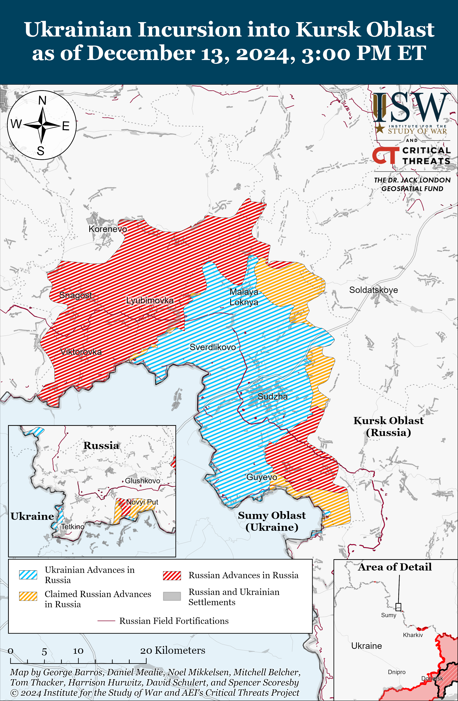
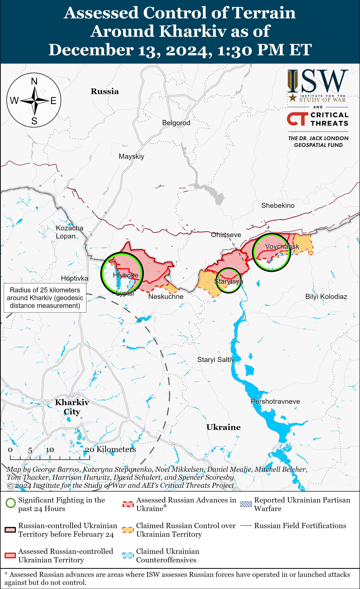
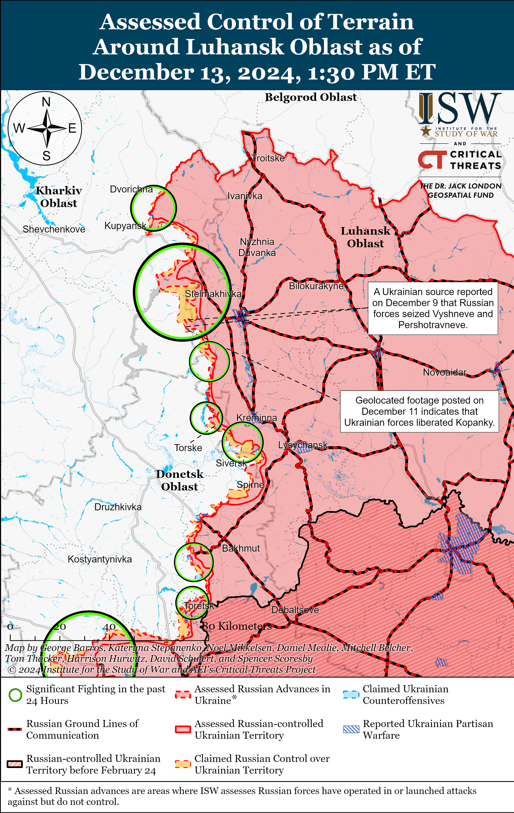
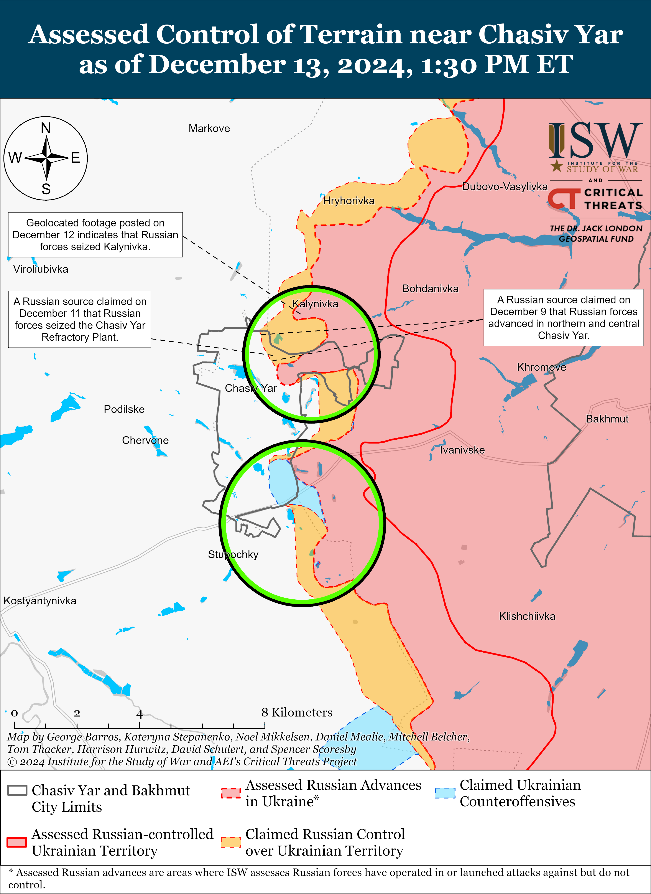
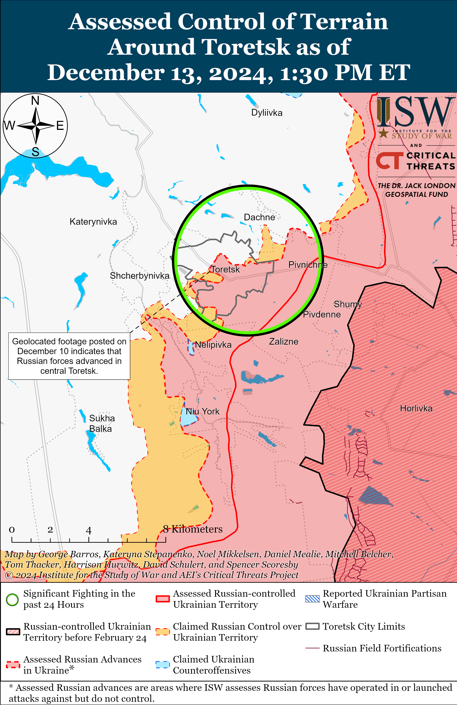
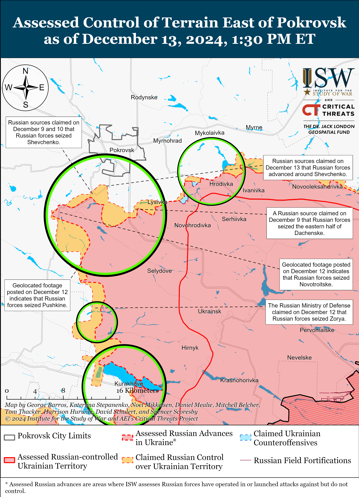
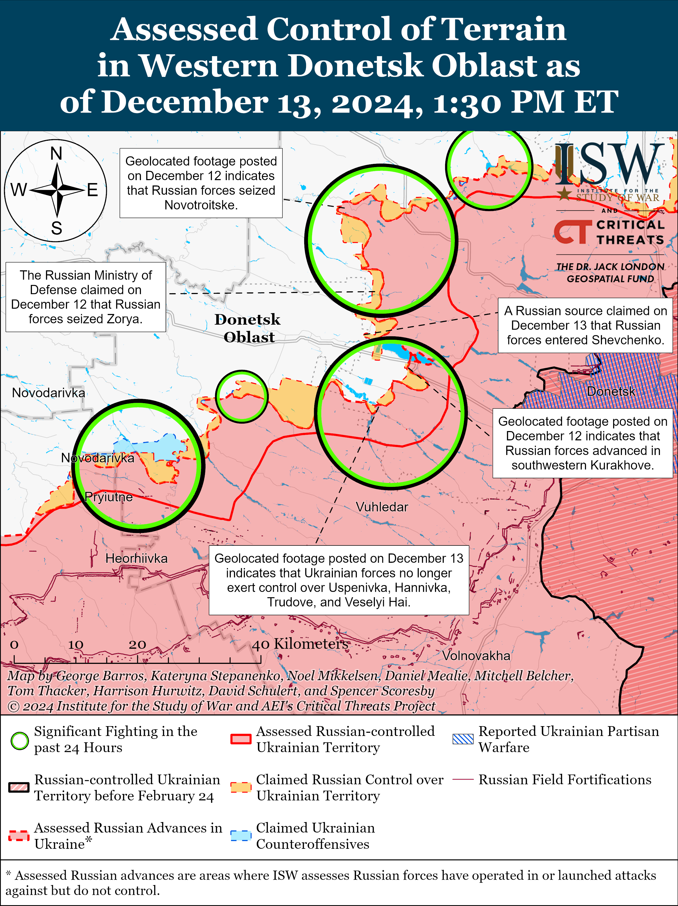
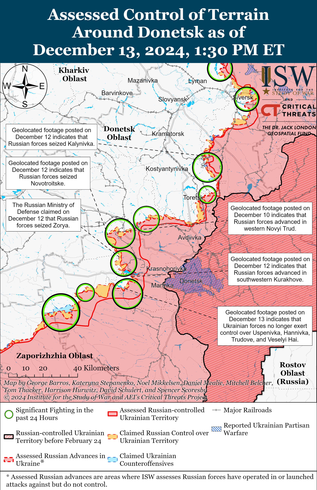
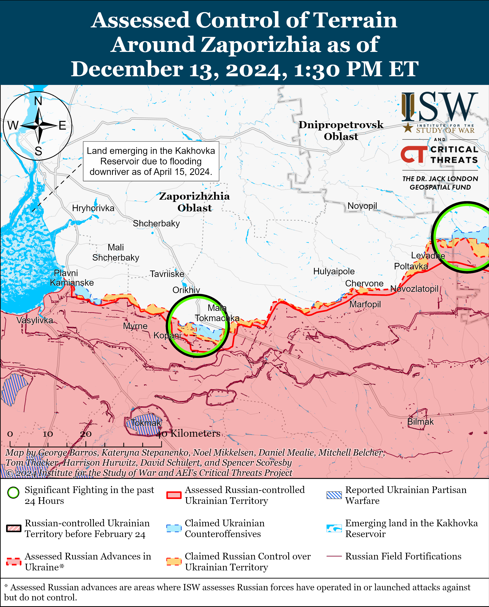
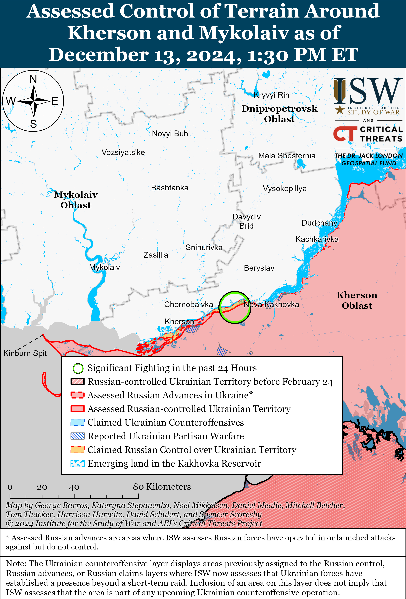

# Russian Offensive Campaign Assessment, December 13, 2024

**Christina Harward, Grace Mappes, Angelica Evans, Olivia Gibson, Nate Trotter, William Runkel, and Frederick W. Kagan**

**December 13, 2024, 7:45 pm ET**

**Click** [**here**](https://storymaps.arcgis.com/stories/36a7f6a6f5a9448496de641cf64bd375) **to see ISW’s interactive map of the Russian invasion of Ukraine. This map is updated daily alongside the static maps present in this report.**

**Click** [**here**](https://storymaps.arcgis.com/stories/83a2f24901c941d581c0c523ecd2619b) **to see ISW’s interactive map of Ukraine’s offensive in Kursk Oblast.**

**Click** [**here**](https://understandingwar.maps.arcgis.com/apps/instant/3dviewer/index.html?appid=1602762dbcde419bb957dea358449580) **to see ISW’s 3D control of terrain topographic map of Ukraine. Use of a computer (not a mobile device) is strongly recommended for using this data-heavy tool.**

**Click** [**here**](https://storymaps.arcgis.com/stories/733fe90805894bfc8562d90b106aa895) **to access ISW’s archive of interactive time-lapse maps of the Russian invasion of Ukraine. These maps complement the static control-of-terrain map that ISW produces daily by showing a dynamic frontline. ISW will update this time-lapse map archive monthly.**

**Note: The data cut-off for this product was 12 pm ET on December 13. ISW will cover subsequent reports in the December 14 Russian Offensive Campaign Assessment.**

**Russian forces conducted their largest series of missile and drone strikes against Ukraine since the start of the war overnight on December 12 to 13, largely targeting Ukrainian energy infrastructure.** The Ukrainian Air Force reported that Russian forces launched 94 missiles and 193 Shahed and other drones at Ukraine, including four Kh-47M2 “Kinzhal” aeroballistic missiles; two Iskander-M ballistic missiles, one KN-23 ballistic missile, 55 Kh-101 and Kh-55SM cruise missiles, 24 Kalibr cruise missiles, seven Iskander-K cruise missiles, and one Kh-59/69 cruise missile.[1] The Ukrainian Air Force noted that Ukrainian forces downed 80 Kh-101, Kh-55SM, Kalibr, and Iskander-K cruise missiles; one Iskander-M; and 80 drones and that 105 other drones became “lost” due to Ukrainian countermeasures and six drones flew into Russian and Belarusian airspace as of 1130 local time.

Ukrainian energy operator DTEK reported that the strike caused severe damage to DTEK’s thermal power plants (TPPs), and Ukrainian authorities reported that the Russian strikes targeted energy and critical infrastructure in Kyiv, Odesa, Chernihiv, Vinnytsia, Ivano-Frankivsk, Lviv, and Ternopil oblasts.[2] Ukrainian authorities reported rolling blackouts throughout much of the country following the strike.[3] The International Atomic Energy Agency (IAEA) stated that five of the nine nuclear reactors in Ukrainian-controlled territory reduced their output due to the Russian strikes, of which two nuclear reactors were already producing power at a reduced output due to the residual effects of Russian strikes in late November 2024 and the remaining three returned to full capacity on December 13.[4]

**Russia’s strike series targeting Ukrainian energy facilities is part of a broader campaign aimed at freezing out Ukraine in Winter 2024-2025 and compelling Ukraine and the West to self-deter into making policy decisions that benefit Russia.** Russia has repeatedly targeted Ukrainian infrastructure during the fall and winter since launching the full-scale invasion in 2022 and conducted large-scale strikes against Ukrainian infrastructure on November 16 to 17 and 25 to 26.[5] The Russian Ministry of Defense (MoD) claimed that Russian forces conducted the December 12 to 13 strike in retribution for a Ukrainian strike against Taganrog, Rostov Oblast on December 11 using Western-provided ATACMS, although Russian forces were likely planned to conduct such a strike regardless and are conveniently using the December 11 strike to justify ongoing Russian strikes against Ukrainian critical infrastructure.[6] This Russian messaging is likely aimed at assuaging the Russian ultranationalist community’s calls for retribution for Ukrainian strikes into Russia and intended to support the Kremlin’s reflexive control campaign aimed at compelling Western countries to make decisions about Ukraine’s use of Western-provided weapons and future peace negotiations that benefit Russia.[7]

**Ukrainian strikes against military airfields in Russia and Russian air defense systems in near rear areas may be prompting a decrease in Russian air operations and glide bomb strikes against Ukraine.** Russian forces launched a total of 431 glide bombs in the first 12 days of December 2024 according to data from the Ukrainian General Staff after reportedly launching 1,472 glide bombs in the first 12 days of November 2024 and over 3,300 glide bombs total throughout November 2024.[8] Russian forces are thus currently on track to launch only a third of the total number of glide bombs that Russian forces launched in November 2024 this month.

Russian opposition news outlet *Agentstvo* noted on December 12 that Russian glide bomb strikes significantly decreased after Ukraine conducted its first strikes into Russia using Western-provided long-range weapons systems in mid-November 2024.[9] Ukrainian forces conducted the first ATACMS strike on Russian territory on the night of November 18 to 19 and a Storm Shadow strike on Russian territory on the night of November 19 to 20, and data from the Ukrainian General Staff indicates that Russian forces began consistently launching fewer than 100 glide bombs per day on November 22.[10]

The threat of Ukrainian strikes against Russian airfields within ATACMS and Storm Shadow range may be forcing the Russian military to base aircraft at airfields further within Russia and complicating Russia’s ability to conduct glide bomb strikes on Ukraine. Ukrainian forces have also undertaken a concerted campaign to strike Russian radars and air defense systems in occupied Ukraine and near rear areas of Russia since late October 2024.[11] This campaign could be degrading Russia’s air defense umbrella, particularly over occupied Ukraine, to the point that Russian pilots are increasingly unwilling to operate and conduct glide bomb strikes against frontline areas and rear Ukrainian cities.

Ukrainian human rights organization Truth Hounds estimated in a recent report that Ukrainian forces destroyed at least 33 Russian Su-34 fighter aircraft between February 2022 and September 2024, and the International Institute for Strategic Studies (IISS) previously estimated that Russia has approximately 112 various Sukhoi fighter aircraft.[12] ISW is unable to confirm or verify the Truth Hounds’ report. The destruction of nearly 30 percent of Russia’s Sukhoi aircraft, could, if true, also impact Russia’s ability to conduct glide bomb strikes against Ukraine, although it is unclear when these losses took place relative to the recent drop in glide bomb attacks.

**Russia is evacuating elements of its force grouping in Syria while continuing negotiations with select Syrian groups about Russia’s longer-term military presence in the country.** Kremlin newswire *TASS* reported on December 13 that an unspecified source familiar with the matter stated that Russia is currently negotiating with unspecified new Syrian “authorities” about maintaining Russia’s military presence at Hmeimim Air Base and the Port of Tartus.[13] The source reportedly stated that Russia has only secured “temporary security guarantees” but that the two military bases are “functioning as usual.” Russian Deputy Foreign Affairs Minister Mikhail Bogdanov stated on December 12 that Russia has established contacts with Hayat Tahrir al Sham (HTS), which currently controls the areas at Hmeimim and Tartus, and the *TASS* source is likely referring to ongoing Russian talks with HTS.[14]

Maxar satellite imagery from December 13 shows two Russian An-124 military transport aircraft preparing to load cargo while a Ka-52 helicopter and elements of an S-400 air defense system are likely undergoing preparations for transport at Hmeimim Air Base (see embedded imagery below). The Maxar imagery also shows two Russian frigates still offshore of the Port of Tartus. Drone footage reportedly of Hmeimim Air Base shows An-72, An-26, and Il-76 transport aircraft; Ka-52 and Mi-8 or Mi-17 helicopters; and at least four Su-34, seven Su-24M2, and four Su-35S fighter jets under hangars.[15] Geolocated footage published on December 13 shows a Russian military convoy moving from Hisyah (south of Homs) along the M5 highway.[16] Additional footage published on December 13 reportedly shows Russian military convoys moving from Talkalakh (west of Homs), Homs, and Damascus.[17]

It is unclear if the convoys are heading toward the Port of Tartus or Hmeimim Air Base, but the reported movement of Russian military assets indicates that Russia is pulling some of its forward assets in southern Syria to the western coast. At least four Russian landing ships and cargo ships are reportedly heading from Russian ports to the Port of Tartus but will likely not reach Syria for weeks.[18]

Russia is likely evacuating forces from its two main bases in Syria while negotiations are ongoing with new Syrian authorities as the outcome of these negotiations and Russia’s longer-term presence at the bases are still unclear. Russia would be able to relatively quickly reestablish its military presence in Syria after evacuating from Hmeimim and Tartus should Moscow be able to secure more permanent agreements with the current Syrian authorities.

*Overview of the Russian naval base at Tartus on December 13, 2024. Source: Satellite image ©2024 Maxar Technologies*

*Overview of the northern section of Russian Hmeimim Air Base on December 13, 2024. Source: Satellite image ©2024 Maxar Technologies*

**The status of Russia’s helicopter base at Qamishli in northeastern Syria remains unclear, however.** A Kurdish journalist stated on December 11 that Russian forces were withdrawing from the Qamishli base after unspecified authorities granted them safe passage out of Syria.[19] However, photos from December 12 show Russian equipment, helicopters, and personnel at the Qamishli base, and a Russian source claimed on December 12 that Russia maintains a presence at Hmeimim Air Base, the Port of Tartus, Qamishli, and other unspecified sites in Syria.[20] It is unclear if Russia is preparing to withdraw assets from Qamishli in the near future. The Syrian Democratic Forces (SDF) currently control Qamishli, and Russian officials have only stated that Moscow has established contacts with HTS, which controls the area of the Hmeimim Air Base and Port of Tartus.[21] ISW has not observed reports that Russia is trying to separately negotiate with the SDF about Russia’s continued presence at the Qamishli base, and it is unclear if Russian forces intend to or will be able to remain at the base.

**The US Department of Defense (DoD) announced on December 12 a new military aid package for Ukraine valued at $500 million.[22]** The package includes counter-drone munitions; High Mobility Artillery Rocket System (HIMARS) ammunition; 155mm and 105mm artillery ammunition; High-speed Anti-radiation missiles (HARMs); unmanned aerial systems (UAS); Mine-Resistant Ambush Protected Vehicles (MRAPs); High Mobility Multipurpose Wheeled Vehicles (HMMWVs); light tactical vehicles; Tube-launched, Optically-guided, Wire-tracked (TOW) missiles; and Javelin and AT-4 anti-tank equipment and munitions.

*CNN* reported on December 12 that a senior Biden administration official stated that the Biden administration is working to surge weapons deliveries to Ukraine before the administration leaves office in January 2024.[23] The official reportedly stated that the US DoD expects to deliver hundreds of thousands of artillery rounds, thousands of rockets, hundreds of armored vehicles, and other critical capabilities to Ukraine between mid-December 2024 and mid-January 2025. ISW continues to assess that sustained US assistance to Ukraine will empower Ukrainian forces to maintain the current tempo of operations across the theater of war, which is degrading Russian combat power and Russia’s economy at a rate that Moscow will be unable to sustain long-term.[24]

**A Russian insider source who has previously correctly predicted command changes within the Russian military responded to recent claims that the Russian military command removed 3rd Combined Arms Army (formerly 2nd Luhansk People’s Republic Army Corps) commander Major General Dmitry Ovcharov.**[25] The insider source claimed that some sources are falsely reporting that the Russian military command removed Ovcharov for lying to his superiors about the rate of Russian advances in his area of responsibility (AoR) but that the actual reason for his removal was due to the recent Ukrainian capture of a Russian T-90M tank in the Russian rear after a Russian crew allegedly abandoned the tank. The insider source claimed that Russian Defense Minister Andrei Belousov ordered an inspection of the Southern Military District (SMD), whose AoR includes the Siversk direction where the 3rd CAA, after the Russian military command became aware of the incident.[26]

The Russian Ministry of Defense (MoD) posted footage on December 13 of Belousov meeting with Eastern Grouping of Forces commander Lieutenant General Andrei Ivanayev – officially confirming Ivanayev’s new position.[27] A source close to the Russian MoD told Russian state outlet *RBK* on November 26 that the Russian military command appointed Ivanayev as commander of the Eastern Military District [EMD] after the previous EMD commander, Lieutenant General Alexander Sanchik, became the SMD commander.[28] Ivanayev previously served as commander of the 20th Combined Arms Army (Moscow Military District [MMD]), which has been operating along the Kupyansk-Svatove line.[29]

**Key Takeaways:**

- **Russian forces conducted their largest series of missile and drone strikes against Ukraine since the start of the war overnight on December 12 to 13, largely targeting Ukrainian energy infrastructure.**
- **Russia’s strike series targeting Ukrainian energy facilities is part of a broader campaign aimed at freezing out Ukraine in Winter 2024-2025 and compelling Ukraine and the West to self-deter into making policy decisions that benefit Russia.**
- **Ukrainian strikes against military airfields in Russia and Russian air defense systems in near rear areas may be prompting a decrease in Russian air operations and glide bomb strikes against Ukraine.**
- **Russia is evacuating elements of its force grouping in Syria while continuing negotiations with select Syrian groups about Russia’s longer-term military presence in the country.**
- **The status of Russia’s helicopter base at Qamishli in northeastern Syria remains unclear, however.**
- **The US Department of Defense (DoD) announced on December 12 a new military aid package for Ukraine valued at $500 million.**
- **A Russian insider source who has previously correctly predicted command changes within the Russian military responded to recent claims that the Russian military command removed 3rd Combined Arms Army (formerly 2nd Luhansk People’s Republic Army Corps) commander Major General Dmitry Ovcharov.**
- **Russian forces recently advanced near Pokrovsk and Vuhledar.**
- **Russian President Vladimir Putin awarded Rosgvardia Head Viktor Zolotov with the Hero of Russia award.**

***We do not report in detail on Russian war crimes because these activities are well-covered in Western media and do not directly affect the military operations we are assessing and forecasting. We will continue to evaluate and report on the effects of these criminal activities on the Ukrainian military and the Ukrainian population and specifically on combat in Ukrainian urban areas. We utterly condemn Russian violations of the laws of armed conflict and the Geneva Conventions and crimes against humanity even though we do not describe them in these reports.***

- Ukrainian Operations in the Russian Federation
- Russian Main Effort – Eastern Ukraine (comprised of three subordinate main efforts)
- Russian Subordinate Main Effort #1 – Push Ukrainian forces back from the international border with Belgorod Oblast and approach to within tube artillery range of Kharkiv City
- Russian Subordinate Main Effort #2 – Capture the remainder of Luhansk Oblast and push westward into eastern Kharkiv Oblast and encircle northern Donetsk Oblast
- Russian Subordinate Main Effort #3 – Capture the entirety of Donetsk Oblast
- Russian Supporting Effort – Southern Axis
- Russian Air, Missile, and Drone Campaign
- Russian Mobilization and Force Generation Efforts
- Russian Technological Adaptations
- Activities in Russian-occupied areas
- Significant Activity in Belarus

**Ukrainian Operations in the Russian Federation**

Russian forces continued offensive operations in the main Ukrainian salient in Kursk Oblast on December 13 but did not advance. Russian milbloggers claimed that Russian forces advanced in Nikolayevo-Darino (southeast of Korenevo), into the forested areas north of Martynovka (northeast of Sudzha), and near Kurilovka (south of Sudzha).[30] ISW has not observed confirmation of these claims, however. A Russian milblogger claimed that Ukrainian forces counterattacked near Cherkasskaya Konopelka (southeast of Sudzha).[31] Russian forces continued assaults southeast of Korenevo near Novoivanovka and in Nikolayevo-Darino, northwest of Sudzha in the direction of Sverdlikovo, southeast of Sudzha near Cherkasskaya Konopelka, and south of Sudzha in the direction of Kurilovka and along the Psel River near Guevo.[32]

North Korean special operation forces reportedly participated in the recent seizure of Plekhovo, Kursk Oblast indicating that Russia may be utilizing North Korean forces in highly attritional infantry-led assaults. Russian milbloggers claimed on December 12 and 13 that North Korean soldiers participated in the seizure of Plekhovo on December 6 and advanced two kilometers through minefields in order to seize the settlement over the course of two hours (ISW assesses that Russian forces seized Plekhovo as of December 11).[33] Several Russian milbloggers claimed that North Korean special forces seized Plekhovo with no assistance from Russian forces, but one milblogger characterized the assault as a joint Russian-North Korean operation. Another milblogger claimed that elements of two unspecified Russian brigades are claiming responsibility for the seizure of Plekhovo despite only entering the settlement after North Korean forces seized it.[34] ISW has not observed confirmation that North Korean soldiers have participated in combat operations in Kursk either independently or jointly with Russian forces. Ukraine’s Main Military Intelligence Directorate (GUR) reported on December 4 that the Russian command subordinated the North Korean 92nd and 94th special operations brigades in Kursk Oblast to the Russian 22nd Motorized Rifle Regiment (72nd Motorized Rifle Division, 44th Army Corps (AC), Leningrad Military District [LMD]), the 810th Naval Infantry Brigade (Black Sea Fleet [BSF], Southern Military District [SMD]), and the 11th Airborne (VDV) Brigade.[35] ISW previously assessed that the North Korean military’s ability to learn and integrate lessons from fighting alongside Russia is likely to be significantly degraded if the Russian military command uses North Korean troops in the same highly attritional infantry-led assaults in which it normally uses most Russian personnel, including the improperly utilized VDV and naval infantry units to which the North Korean special forces are reportedly subordinated.[36]

**Russian Main Effort – Eastern Ukraine**

**Russian Subordinate Main Effort #1 – Kharkiv Oblast (Russian objective: Push Ukrainian forces back from the international border with Belgorod Oblast and approach to within tube artillery range of Kharkiv City)**

Russian forces conducted ground attacks north of Kharkiv City near Hlyboke and Lyptsi and northeast of Kharkiv City near Vovchansk and Starytsya on December 12 and 13 but did not advance.[37] A Russian milblogger claimed on December 13 that Russian forces repelled a Ukrainian counterattack in the Lyptsi direction.[38]

**Russian Subordinate Main Effort #2 – Luhansk Oblast (Russian objective: Capture the remainder of Luhansk Oblast and push westward into eastern Kharkiv Oblast and northern Donetsk Oblast)**

Russian forces continued offensive operations along the Kupyansk-Svatove-Kreminna line on December 13 but did not make any confirmed advances. A Russian milblogger claimed that Russian forces advanced on the west (right) bank of the Oskil River south of Dvorichna (north of Kupyansk).[39] ISW has not observed visual confirmation of this claim, however. Russian forces continued assaults north of Kupyansk near Dvorichna; northeast of Kupyansk near Synkivka; southeast of Kupyansk near Kruhlyakivka, Kolisnykivka, Bohuslavka, Lozova, and Zahryzove; west of Svatove near Nadiya, Kopanky, Lozova, Zelenyi Hai, and Shyikivka; southwest of Svatove near Hrekivka and Novoyehorivka; northwest of Kreminna near Makiivka and Terny; west of Kreminna near Torske and Zarichne; and southwest of Kreminna near Hryhorivka, Dibrova, and in the Serebryanske forest area on December 12 and 13.[40] The spokesperson for a Ukrainian brigade operating in the Lyman direction reported on December 13 that Russian forces are accumulating forces in preparation for increased infantry assaults in the area in the coming weeks.[41] The brigade spokesperson added that Russian forces are conducting small probing assaults involving teams of between two and four soldiers to exploit vulnerabilities in Ukrainian defensive lines. Elements of the Russian 16th Spetsnaz Brigade (Russian General Staff’s Main Directorate [GRU]) are reportedly operating in the Serebryanske forest area.[42]

**Russian Subordinate Main Effort #3 – Donetsk Oblast (Russian objective: Capture the entirety of Donetsk Oblast, the claimed territory of Russia’s proxies in Donbas)**

Russian forces conducted offensive operations near Bilohorivka (northeast of Siversk) on December 13 but did not make any confirmed advances.[43]

Russian forces conducted offensive operations in the Chasiv Yar direction on December 13 but did not make any confirmed advances. Russian forces conducted offensive operations near Chasiv Yar itself; north of Chasiv Yar near Hryhorivka; and south of Chasiv Yar towards Stupochky and Bila Hora on December 12 and 13.[44] Russian milbloggers claimed that fighting is ongoing on the northern and western outskirts of the Refractory Plant in central Chasiv Yar and that there are unconfirmed reports that Russian forces are clearing the rest of the plant.[45] A Russian source claimed that Ukrainian forces are counterattacking at the plant.[46] The spokesperson of a Ukrainian brigade operating in the Chasiv Yar direction reported that Russian forces are trying to enter the Ukrainian near rear in small infantry groups and that Russian forces have sufficient ammunition to conduct artillery preparation with each assault.[47] The spokesperson stated that Ukrainian minefields are repelling Russian mechanized assaults in the area.

Russian forces conducted offensive operations near Toretsk itself and north of Toretsk near Dyliivka on December 12 and 13 but did not make any confirmed advances.[48]

Russian forces recently advanced in the Pokrovsk direction amid continued offensive operations in the area on December 13. Geolocated footage published on December 12 shows Ukrainian forces striking Russian forces in western Pushkine (south of Pokrovsk), indicating that Russian forces seized the settlement.[49] Additional geolocated footage published on December 12 indicates that Russian forces recently advanced in southern Lysivka (southeast of Pokrovsk).[50] Russian milbloggers claimed that Russian forces are operating in the southwestern outskirts of Pushkine and advanced west of Novotroitske (southwest of Pokrovsk) and west and north of Shevchenko (south of Pokrovsk).[51] ISW has not observed confirmation of these claims, however. Russian forces conducted offensive operations east of Pokrovsk near Myrolyubivka and Promin; southeast of Pokrovsk near Lysivka; south of Pokrovsk near Dachenske, Shevchenko, Novyi Trud, Zelene, and Pushkine; and southwest of Pokrovsk near Pishchane on December 12 and 13.[52] Russian sources claimed that Ukrainian forces counterattacked near Novotroitske, Shevchenko, Novoolenivka (south of Pokrovsk).[53] A Russian milblogger claimed that Russian forces are currently roughly one kilometer from Pishchane and about 1.6 kilometers from Pokrovsk, but ISW has only observed geolocated footage indicating that Russian forces are roughly 1.8 kilometers from Pishchane and 3.8 kilometers from Pokrovsk.[54] Ukrainian Khortytsia Group of Forces Spokesperson Colonel Nazar Voloshyn stated on December 13 that there are no Russian sabotage and reconnaissance groups in Pokrovsk.[55] Several Russian milbloggers claimed on December 12 that small Russian sabotage and reconnaissance groups had penetrated the southern outskirts of Pokrovsk.[56] Drone operators of the Russian 55th Motorized Rifle Brigade (41st Combined Arms Army [CAA], Central Military District [CMD]) are reportedly operating in the Pokrovsk direction.[57]

Russian forces continued offensive operations in the Kurakhove direction on December 13 but did not make confirmed advances. The spokesperson for a Ukrainian brigade operating in the Kurakhove direction stated that Ukrainian forces repelled a reinforced company-sized mechanized assault on Kurakhove’s flank likely on December 12.[58] The spokesperson stated that Russian forces are constantly adjusting their tactics in this direction and are attacking in armored columns in some areas and small infantry groups on foot, motorcycles, or all-terrain vehicles (ATVs) in other areas. The spokesperson noted that Russian forces often attack during foggy weather conditions that complicate Ukrainian forces’ ability to use reconnaissance drones. Russian milbloggers claimed that Russian forces advanced northwest of Kurakhove in southern Sontsivka, from Zorya (north of Sontsivka) towards Slovyanka (west of Sontsivka), and near Shevchenko (southwest of Sontsivka).[59] A Russian milblogger claimed that elements of the Russian 5th Motorized Rifle Brigade (51st CAA, formerly 1st Donetsk People’s Republic Army Corps [DNR AC]) are advancing in central Kurakhove.[60] ISW has not observed confirmation of these claims. Russian forces continued assaults northwest of Kurakhove near Zorya, Sontsivka, and Stari Terny; in Kurakhove itself; west of Kurakhove near Dachne; and south of Kurakhove near Dalne on December 12 and 13.[61] Elements of the Russian 110th Motorized Rifle Brigade (51st CAA) are reportedly operating in Kurakhove.[62]

Russian forces recently advanced into Uspenivka and Hannivka (both northwest of Vuhledar) amid continued offensive operations in the Vuhledar direction on December 13. Geolocated footage published on December 13 indicates that Russian forces recently advanced into central Uspenivka and Haniivka and likely seized remaining Ukrainian positions in and near Romanivka, Veselyi Hai, Hannivka, Trudove, and Uspenvika.[63] Russian milbloggers claimed that elements of the Russian 255th Motorized Rifle Regiment (20th Motorized Rifle Division, 8th CAA, Southern Military District [SMD]) advanced into Uspenivka and that elements of the 242nd Motorized Rifle Regiment’s (20th Motorized Rifle Division) 3rd Battalion advanced into Hannivka and Veselyi Hai.[64] Russian milbloggers claimed that Russian forces eliminated the Ukrainian pocket in this area and that Russian forces have encircled a limited number of Ukrainian forces defending this pocket.[65] The Ukrainian Khortytsia Group of Forces denied claims that Russian forces encircled Ukrainian units in the area and stated that Ukrainian units were defending and taking necessary measures to avoid capture or encirclement.[66] The successful elimination of the Uspenvika-Haniivka pocket will allow Russian forces to level the frontline along the Kurakhove-Dale-Uspenivka line and begin pushing further westward from Kurakhove towards Dachne and from Uspenivka towards Zelenivka. Russian forces also continued assaults northwest of Vuhledar near Kostyatynopolske and Sukhyi Yaly on December 12 and 13.[67] Elements of the 39th Motorized Rifle Brigade (68th AC, Eastern Military District [EMD]) are reportedly operating near Veselyi Hai and Kostyatynopolske.[68]

Russian forces continued offensive operations in the Donetsk-Zaporizhia Oblast border area on December 23 but did not make confirmed advances. Russian milbloggers claimed that elements of the Russian 5th Tank Brigade (36th CAA, EMD) advanced in an area four kilometers by 1.6 kilometers southeast of Velyka Novosilka and that Russian forces advanced southwest of Velyka Novosilka towards Storozheve and Neskuchne.[69] ISW has not observed confirmation of these claims, however. A Russian milblogger denied claims that Russian forces recently retreated from the southern outskirts of Velyka Novosilka and claimed that Russian forces are continuing to advance towards the settlement.[70] Ukrainian Tavriisk Group of Forces Spokesperson Colonel Vladyslav Voloshyn stated that Russian forces are constantly attacking in the Vremivka (Velyka Novosilka) direction in small infantry groups and have air, drone, and armored vehicle support in this direction.[71] Voloshyn noted that Russian forces are suffering significant manpower losses in this area but assessed that the Russian military command will not abandon the objective of seizing Velyka Novosilka despite these losses.[72] Russian milbloggers also claimed that Ukrainian forces are counterattacking north of Velyka Novosilka.[73] Russian forces continued offensive operations northeast of Velyka Novosilka near Rozdolne and southwest of Velyka Novosilka from Neskuchne and Novodarivka on December 12 and 13.[74] Drone operators of the Russian 40th Naval Infantry Brigade (Pacific Fleet, EMD) are reportedly operating near Rozdolne.[75] A Russian milblogger claimed that Russian forces destroyed a bridge crossing over the Mokry Yaly River near Novoocheretuvate (north of Velyka Novosilka).[76]

**Russian Supporting Effort – Southern Axis (Russian objective: Maintain frontline positions and secure rear areas against Ukrainian strikes)**

Russian and Ukrainian sources did not report any ground activity in the Hulyaipole direction in far eastern Zaporizhia Oblast on December 13. Ukrainian Tavriisk Group of Forces Spokesperson Colonel Vladyslav Voloshyn reported that Russian forces are conducting rotations and preparing to conduct light infantry assaults in the Hulyaipole direction in the future.[77] Drone operators of the Russian 64th Motorized Rifle Brigade (35th Combined Arms Army [CAA], Eastern Military District [EMD]) are reportedly operating in the Polohy direction.[78]

Russian forces continued limited offensive operations in the direction of Novodanylivka (north of Robotyne) in western Zaporizhia Oblast on December 12 and 13 but did not make any confirmed advances.[79] Ukrainian Tavriisk Group of Forces Spokesperson Colonel Vladyslav Voloshyn reported that Russian forces are attacking in the Orikhiv direction and are occasionally assaulting Ukrainian positions with armored vehicle support and using drones to drop munitions with toxic chemicals on Ukrainian forces.[80] Drone operators of the Russian ”Troyan” Detachment (likely a volunteer unit) are reportedly operating southeast of Kamyanske (northwest of Robotyne and south of Zaporizhzhia City).[81]

Russian forces continued limited assaults in the Dnipro direction in east (left) bank Kherson Oblast on December 12 and 13 but did not make any confirmed advances.[82]

**Russian Air, Missile, and Drone Campaign (Russian Objective: Target Ukrainian military and civilian infrastructure in the rear and on the frontline)**

See topline text.

**Russian Mobilization and Force Generation Efforts (Russian objective: Expand combat power without conducting general mobilization)**

Russian President Vladimir Putin awarded Rosgvardia Head Viktor Zolotov with the Hero of Russia award.[83] A Russian insider source claimed that Zolotov’s award demonstrates his increasing importance within the Kremlin and the Kremlin’s confidence in his ability to manage Rosgvardia – a paramilitary security organization tasked with protecting Putin‘s regime from internal threats and safeguarding some critical infrastructure.[84]

The Kremlin continues efforts to militarize the Russian government with the “Time of Heroes” program.  A Russian insider source claimed on December 13 that the Kremlin wants to appoint Vladislav Golovin, a veteran of the war in Ukraine and graduate of the “Time of Heroes” program, as the head of Yunarmiya (a military-patriotic movement that instills pro-Russian and militarized ideals in youth in Russia and occupied Ukraine).[85] The Russian insider source claimed that the Presidential Administration is likely delegating the supervision of Russia’s youth policy to “Time of Heroes” graduates in order to test and train a “new generation of managers.” The insider source claimed that former Rosgvardia personnel may also enter leadership positions in the Russian government through the Time of Heroes program in the future.[86]

The Kremlin continues to use financial incentives to increase military recruitment. Kremlin newswire *TASS* reported on December 12 that the Russian State Duma proposed a bill that would cancel the negative credit histories of Russians who sign military service contracts with the Russian Ministry of Defense (MoD).[87]

**Russian Technological Adaptations (Russian objective: Introduce technological innovations to optimize systems for use in Ukraine)**

Nothing significant to report.

**Activities in Russian-occupied areas (Russian objective: Consolidate administrative control of annexed areas; forcibly integrate Ukrainian citizens into Russian sociocultural, economic, military, and governance systems)**

*ISW is not publishing coverage of activities in Russian-occupied areas today.*

**Significant activity in Belarus (Russian efforts to increase its military presence in Belarus and further integrate Belarus into Russian-favorable frameworks)**

Nothing significant to report.

**Note: ISW does not receive any classified material from any source, uses only publicly available information, and draws extensively on Russian, Ukrainian, and Western reporting and social media as well as commercially available satellite imagery and other geospatial data as the basis for these reports. References to all sources used are provided in the endnotes of each update.**

[1] https://t.me/kpszsu/24772

[2] https://suspilne dot media/ivano-frankivsk/901561-raketna-ataka-rf-na-frankivsini-vlucili-v-obekt-infrastrukturi-golova-ova/; https://t.me/onyshchuksvitlana/18570; https://t.me/kozytskyy\_maksym\_official/17956; https://www.facebook.com/stepan.kylunyak/posts/pfbid02EafMVJuQBsFtGBib8x2hFm3cu1A3NH1nnmB2AzbC2MEp7RHxha4CVU8qQ4fvzyj8l; https://suspilne dot media/ternopil/901689-podrobici-naslidkiv-raketnoi-ataki-na-ternopilsini/; https://www.facebook.com/german.galushchenko/posts/pfbid0KtXV5rQEh8QpBHrXkUbYTHrFYnYKgZ1zJsKgpWf2XphmADFLp7jCn2QJ7GZcxHPml?ref=embed\_post; https://t.me/dtek\_ua/2115; https://x.com/USAmbKyiv/status/1867541246639562972

[3] https://suspilne dot media/901683-ukrenergo-v-usih-regionah-zastosovuut-tri-cergi-vidklucen-odnocasno/ ; https://t.me/Ukrenergo/3545; https://suspilne dot media/vinnytsia/901619-na-vinniccini-zastosovuut-dodatkovi-vidklucenna-svitla/

[4] https://www.iaea.org/newscenter/pressreleases/update-266-iaea-director-general-statement-on-situation-in-ukraine; https://x.com/iaeaorg/status/1867500773627863315

[5] https://understandingwar.org/backgrounder/russian-offensive-campaign-assessment-november-26-2024; https://understandingwar.org/backgrounder/russian-offensive-campaign-assessment-november-17-2024; https://isw.pub/UkrWar122923; https://isw.pub/UkrWar120723; https://isw.pub/UkrWar111823; https://isw.pub/UkrWar121622;

[6] https://x.com/iaeaorg/status/1867500773627863315

[7] https://isw.pub/UkrWar121124; https://isw.pub/UkrWar112924; https://isw.pub/UkrWar112924; https://isw.pub/UkrWar112124;

[8] https://t.me/GeneralStaffZSU/17959;

https://t.me/GeneralStaffZSU/17997;

https://t.me/GeneralStaffZSU/18033;

https://t.me/GeneralStaffZSU/18046;

https://t.me/GeneralStaffZSU/18070;

https://t.me/GeneralStaffZSU/18082;

https://t.me/GeneralStaffZSU/18116;

https://t.me/GeneralStaffZSU/18146;

https://t.me/GeneralStaffZSU/18166;

https://t.me/GeneralStaffZSU/18177;

https://t.me/GeneralStaffZSU/18194;

https://t.me/GeneralStaffZSU/18219;

https://t.me/GeneralStaffZSU/18232;

https://t.me/GeneralStaffZSU/18242;

https://t.me/GeneralStaffZSU/18277;

https://t.me/GeneralStaffZSU/18293;

https://t.me/GeneralStaffZSU/18311;

https://t.me/GeneralStaffZSU/18342;

https://t.me/GeneralStaffZSU/18364;

https://t.me/GeneralStaffZSU/18393;

https://t.me/GeneralStaffZSU/18430;

https://t.me/GeneralStaffZSU/18449;

https://t.me/GeneralStaffZSU/18476;

https://t.me/GeneralStaffZSU/18485;

https://t.me/GeneralStaffZSU/18516;

https://t.me/GeneralStaffZSU/18543;

https://t.me/GeneralStaffZSU/18561;

https://t.me/GeneralStaffZSU/18581;

https://t.me/GeneralStaffZSU/18597;

https://t.me/GeneralStaffZSU/18615;

https://t.me/GeneralStaffZSU/18656;

https://t.me/GeneralStaffZSU/18681;

https://t.me/GeneralStaffZSU/18718;

https://t.me/GeneralStaffZSU/18728;

https://t.me/GeneralStaffZSU/18747;

https://t.me/GeneralStaffZSU/18766;

https://t.me/GeneralStaffZSU/18794;

https://t.me/GeneralStaffZSU/18811;

https://t.me/GeneralStaffZSU/18834;

https://t.me/GeneralStaffZSU/18853;

https://t.me/GeneralStaffZSU/18868;

https://t.me/GeneralStaffZSU/18893;

https://t.me/GeneralStaffZSU/18912;

https://t.me/GeneralStaffZSU/18927;

https://t.me/GeneralStaffZSU/18947;

https://t.me/GeneralStaffZSU/18975;

https://t.me/GeneralStaffZSU/19000;

https://t.me/GeneralStaffZSU/19018;

https://t.me/GeneralStaffZSU/19032;

https://t.me/GeneralStaffZSU/19056;

https://t.me/GeneralStaffZSU/19100;

https://t.me/GeneralStaffZSU/19114;

https://t.me/GeneralStaffZSU/19141;

https://t.me/GeneralStaffZSU/19160;

https://t.me/GeneralStaffZSU/19179;

https://t.me/GeneralStaffZSU/19196;

https://t.me/GeneralStaffZSU/19232;

https://t.me/GeneralStaffZSU/19246;

https://t.me/GeneralStaffZSU/19258

[9] https://t.me/agentstvonews/8498

[10] https://isw.pub/UkrWar111924 ; https://isw.pub/UkrWar112024 ; https://t.me/GeneralStaffZSU/18834

[11] https://understandingwar.org/backgrounder/russian-offensive-campaign-assessment-november-2-2024 ; https://understandingwar.org/backgrounder/russian-offensive-campaign-assessment-november-29-2024 ; https://understandingwar.org/backgrounder/russian-offensive-campaign-assessment-december-9-2024 ; https://understandingwar.org/backgrounder/russian-offensive-campaign-assessment-december-7-2024

[12] https://www.iiss.org/en/publications/the-military-balance/ ; https://understandingwar.org/backgrounder/russian-offensive-campaign-assessment-february-29-2024 ; https://truth-hounds dot org/wp-content/uploads/2024/12/kerovanyj-haos-yak-rosijski-aviabomby-znyshhuyut-czyvilnyh-ta-infrastrukturu.pdf

[13] https://tass dot ru/politika/22665553

[14] https://isw.pub/UkrWar121224

[15] https://mil.in dot ua/en/news/russian-aircraft-and-armored-vehicles-remain-blocked-in-syria/; https://x.com/BabakTaghvaee1/status/1867242403746160938 ; https://x.com/yarotrof/status/1867241875674927304

[16] https://x.com/mafihachk/status/1867535787450835118

[17] https://x.com/Daraa24\_24/status/1867563818798272859; https://x.com/ALBADIA24/status/1867564192943026341

[18] https://isw.pub/UkrWar121224; https://isw.pub/UkrWar121024

[19] https://x.com/ScharoMaroof/status/1866834676406485169

[20] https://t.me/rybar/66295; https://t.me/infomil\_live/13028 ; https://www.gettyimages.com/detail/news-photo/russian-military-mobile-radar-station-is-pictured-at-the-news-photo/2188912543?adppopup=true ; https://www.gettyimages.com/detail/news-photo/russian-military-vehicles-are-pictured-at-the-russian-news-photo/2188912480?adppopup=true; https://www.gettyimages.com/detail/news-photo/russian-military-vehicles-and-artillery-guns-are-pictured-news-photo/2188912417?adppopup=true; https://www.gettyimages.com/detail/news-photo/russian-military-vehicles-are-pictured-at-the-russian-news-photo/2188912374?adppopup=true ; https://www.gettyimages.com/detail/news-photo/russian-air-force-kamov-ka-52-alligator-military-attack-news-photo/2188912251?adppopup=true; https://www.gettyimages.com/detail/news-photo/russian-military-vehicles-are-pictured-at-the-russian-news-photo/2188912231?adppopup=true

[21] https://isw.pub/UkrWar121224

[22] https://www.defense.gov/News/Releases/Release/Article/3999956/biden-administration-announces-additional-security-assistance-for-ukraine/

[23] https://edition.cnn.com/2024/12/12/politics/biden-admin-says-it-is-surging-deliveries-to-ukraine-as-trump-criticizes-decision-to-allow-weapons-to-strike-russia/index.html

[24] https://understandingwar.org/backgrounder/russian-offensive-campaign-assessment-december-8-2024

[25] https://t.me/arbat/1948 https://isw.pub/UkrWar112324 ; https://isw.pub/UkrWar111624

[26] https://understandingwar.org/backgrounder/russian-offensive-campaign-assessment-december-9-2024; https://understandingwar.org/backgrounder/russian-offensive-campaign-assessment-november-14-2024

[27] https://t.me/mod\_russia/46797

[28] https://isw.pub/UkrWar112624

[29] https://tass dot com/politics/1886859

[30] https://t.me/motopatriot/30403;  https://t.me/motopatriot/30404; https://t.me/DnevnikDesantnika/20897; https://t.me/dva\_majors/60078

[31] https://t.me/DnevnikDesantnika/20897

[32] https://t.me/motopatriot/30403;  https://t.me/motopatriot/30404; https://t.me/dva\_majors/60078; https://t.me/DnevnikDesantnika/20897

[33] https://t.me/DnevnikDesantnika/20893; https://t.me/voenkorKotenok/60689;  https://t.me/Alekhin\_Telega/12486 ; https://t.me/romanov\_92/45708;  https://t.me/dva\_majors/60083; https://t.me/romanov\_92/45708;  https://t.me/motopatriot/30404; https://understandingwar.org/backgrounder/russian-offensive-campaign-assessment-december-12-2024

[34] https://t.me/romanov\_92/45708

[35] https://gur.gov dot ua/content/pivnichni-koreitsi-ne-doidaiut-vozhdi-rf-vidpravyly-henerala-rozbyratys.html

[36] https://understandingwar.org/backgrounder/russian-offensive-campaign-assessment-november-21-2024

[37]https://www.facebook.com/GeneralStaff.ua/posts/pfbid02Bpn74byM45KWsZjAknsCkCYwzobUJKx252dYgpo9ZkYttgZVNhr1X6MhXnDwLcPcl ; https://www.facebook.com/GeneralStaff.ua/posts/pfbid0B7iWbd6FREiTcgVJ234NRq8iStgMeMCZWqPbby6YFHrGPpYg83AJ69i1wYCXyyqpl ; https://www.facebook.com/GeneralStaff.ua/posts/pfbid02V7YbyVwyLv4tNT8LfcWZnnmrG9uZEWteTNTaThNG78iQUatNjeapMxdFjzweEJQjl ; https://t.me/otukharkiv/3050 ; https://t.me/Sladkov\_plus/12041

[38] https://t.me/dva\_majors/60078

[39] https://t.me/dva\_majors/60078

[40]https://www.facebook.com/GeneralStaff.ua/posts/pfbid02Bpn74byM45KWsZjAknsCkCYwzobUJKx252dYgpo9ZkYttgZVNhr1X6MhXnDwLcPcl ; https://www.facebook.com/GeneralStaff.ua/posts/pfbid0B7iWbd6FREiTcgVJ234NRq8iStgMeMCZWqPbby6YFHrGPpYg83AJ69i1wYCXyyqpl ; https://www.facebook.com/GeneralStaff.ua/posts/pfbid02V7YbyVwyLv4tNT8LfcWZnnmrG9uZEWteTNTaThNG78iQUatNjeapMxdFjzweEJQjl ; https://t.me/Sladkov\_plus/12041 ; https://www.facebook.com/GeneralStaff.ua/posts/pfbid02Bpn74byM45KWsZjAknsCkCYwzobUJKx252dYgpo9ZkYttgZVNhr1X6MhXnDwLcPcl ; https://www.facebook.com/GeneralStaff.ua/posts/pfbid0B7iWbd6FREiTcgVJ234NRq8iStgMeMCZWqPbby6YFHrGPpYg83AJ69i1wYCXyyqpl ; https://www.facebook.com/GeneralStaff.ua/posts/pfbid02V7YbyVwyLv4tNT8LfcWZnnmrG9uZEWteTNTaThNG78iQUatNjeapMxdFjzweEJQjl

[41] https://armyinform dot com.ua/2024/12/13/ti-shho-vyzhyly-idut-na-shturm-na-lymanskomu-napryamku-vorog-atakuye-dvijkamy/

[42] https://t.me/Secrets\_of\_Vinakos/4401 ; https://t.me/voin\_dv/12248

[43] https://www.facebook.com/GeneralStaff.ua/posts/pfbid02Bpn74byM45KWsZjAknsCkCYwzobUJKx252dYgpo9ZkYttgZVNhr1X6MhXnDwLcPcl

[44] https://www.facebook.com/GeneralStaff.ua/posts/pfbid02Bpn74byM45KWsZjAknsCkCYwzobUJKx252dYgpo9ZkYttgZVNhr1X6MhXnDwLcPcl; https://www.facebook.com/GeneralStaff.ua/posts/pfbid0B7iWbd6FREiTcgVJ234NRq8iStgMeMCZWqPbby6YFHrGPpYg83AJ69i1wYCXyyqpl; https://www.facebook.com/GeneralStaff.ua/posts/pfbid02V7YbyVwyLv4tNT8LfcWZnnmrG9uZEWteTNTaThNG78iQUatNjeapMxdFjzweEJQjl

[45] https://t.me/DnevnikDesantnika/20834; https://t.me/wargonzo/23691

[46] https://t.me/motopatriot/30391

[47] https://www.youtube.com/watch?v=aDXWlQ2K0dM ; https://armyinform.com dot ua/2024/12/12/protyvnyk-znevodnyuye-svoyi-lyudski-resursy-okupanty-vkryvayut-svoyimy-tilamy-chasiv-yar/

[48] https://www.facebook.com/GeneralStaff.ua/posts/pfbid02Bpn74byM45KWsZjAknsCkCYwzobUJKx252dYgpo9ZkYttgZVNhr1X6MhXnDwLcPcl; https://www.facebook.com/GeneralStaff.ua/posts/pfbid0B7iWbd6FREiTcgVJ234NRq8iStgMeMCZWqPbby6YFHrGPpYg83AJ69i1wYCXyyqpl ; https://www.facebook.com/GeneralStaff.ua/posts/pfbid02V7YbyVwyLv4tNT8LfcWZnnmrG9uZEWteTNTaThNG78iQUatNjeapMxdFjzweEJQjl ; https://t.me/motopatriot/30386

[49] https://t.me/creamy\_caprice/7803; https://t.me/robert\_magyar/984

[50] https://t.me/creamy\_caprice/7802; https://t.me/robert\_magyar/984; ; https://t.me/lost\_warinua/99783; https://x.com/99Dominik\_/status/1867282403754225709

[51] https://t.me/rybar/66312; https://t.me/ne\_rybar/3791; https://t.me/motopatriot/30388; https://t.me/motopatriot/30398 ; https://t.me/dva\_majors/60078; https://t.me/voenkorKotenok/60686; https://t.me/rybar/66320

[52] https://www.facebook.com/GeneralStaff.ua/posts/pfbid02Bpn74byM45KWsZjAknsCkCYwzobUJKx252dYgpo9ZkYttgZVNhr1X6MhXnDwLcPcl ; https://www.facebook.com/GeneralStaff.ua/posts/pfbid0B7iWbd6FREiTcgVJ234NRq8iStgMeMCZWqPbby6YFHrGPpYg83AJ69i1wYCXyyqpl; https://www.facebook.com/GeneralStaff.ua/posts/pfbid02V7YbyVwyLv4tNT8LfcWZnnmrG9uZEWteTNTaThNG78iQUatNjeapMxdFjzweEJQjl; https://t.me/motopatriot/30362; https://t.me/voenkorKotenok/60686

[53] https://t.me/DnevnikDesantnika/20894; https://t.me/motopatriot/30388; https://t.me/motopatriot/30398; https://t.me/voenkorKotenok/60686

[54] https://t.me/voenkorKotenok/60686

[55] https://www.youtube.com/watch?v=j5TqaWCCdUg ; https://armyinform.com dot ua/2024/12/13/bezpeka-pokrovska-dyversijno-rozviduvalnyh-grup-voroga-u-misti-nemaye/

[56] https://understandingwar.org/backgrounder/russian-offensive-campaign-assessment-december-12-2024

[57] https://t.me/milinfolive/137471

[58] https://suspilne dot media/donbas/901559-trivaut-vkraj-vazki-boi-na-kurahivskomu-napramku-aku-taktiku-zastosovuut-vijska-rf/ ; https://www.youtube.com/watch?v=j5TqaWCCdUg ; https://armyinform.com dot ua/2024/12/13/ataky-p

[59] https://t.me/DnevnikDesantnika/20834 ; https://t.me/RVvoenkor/82531 ; https://t.me/dva\_majors/60078 ; https://t.me/DnevnikDesantnika/20898 ; https://t.me/motopatriot/30381 ; https://t.me/motopatriot/30409 ; https://t.me/voenkorKotenok/60686  ; https://t.me/motopatriot/30362 ;https://t.me/voenkorKotenok/60707

[60] https://t.me/motopatriot/30409

[61] https://www.facebook.com/GeneralStaff.ua/posts/pfbid02Bpn74byM45KWsZjAknsCkCYwzobUJKx252dYgpo9ZkYttgZVNhr1X6MhXnDwLcPcl ; https://www.facebook.com/GeneralStaff.ua/posts/pfbid0B7iWbd6FREiTcgVJ234NRq8iStgMeMCZWqPbby6YFHrGPpYg83AJ69i1wYCXyyqpl ; https://www.facebook.com/GeneralStaff.ua/posts/pfbid02V7YbyVwyLv4tNT8LfcWZnnmrG9uZEWteTNTaThNG78iQUatNjeapMxdFjzweEJQjl

[62] https://t.me/RVvoenkor/82531

[63] https://t.me/creamy\_caprice/7807; https://t.me/dva\_majors/60100 ; https://t.me/creamy\_caprice/7810; https://t.me/creamy\_caprice/7807; https://t.me/motopatriot/30406

[64] https://t.me/motopatriot/30406 ; https://t.me/dva\_majors/60100 ; https://t.me/RVvoenkor/82569 ; https://t.me/motopatriot/30393

[65] https://t.me/RVvoenkor/82522 ; https://t.me/RVvoenkor/82528 ; https://t.me/RVvoenkor/82533; https://t.me/RVvoenkor/82553 ; https://t.me/dva\_majors/60078 ; https://t.me/wargonzo/23691 ; https://t.me/motopatriot/30395 ; https://t.me/motopatriot/30408 ; https://t.me/gimbatov34/3935 ; https://t.me/motopatriot/30409 ; https://t.me/boris\_rozhin/147680 ; https://t.me/z\_arhiv/30050 ; https://t.me/voenkorKotenok/60696

[66] https://t.me/Khortytsky\_wind/3284 ; https://suspilne dot media/donbas/901891-situacia-na-fronti-bila-uspenivki-na-kurahivskomu-fronti-osuv-hortica-vidpovili-na-informaciu-pro-zagrozu-otocenna/ ; https://armyinform.com dot ua/2024/12/13/zsu-sprostuvaly-chutky-pro-otochennya-pid-uspenivkoyu/

[67] https://www.facebook.com/GeneralStaff.ua/posts/pfbid02Bpn74byM45KWsZjAknsCkCYwzobUJKx252dYgpo9ZkYttgZVNhr1X6MhXnDwLcPcl ; https://www.facebook.com/GeneralStaff.ua/posts/pfbid0B7iWbd6FREiTcgVJ234NRq8iStgMeMCZWqPbby6YFHrGPpYg83AJ69i1wYCXyyqpl ; https://www.facebook.com/GeneralStaff.ua/posts/pfbid02V7YbyVwyLv4tNT8LfcWZnnmrG9uZEWteTNTaThNG78iQUatNjeapMxdFjzweEJQjl

[68] https://t.me/voin\_dv/12259 ; https://t.me/voin\_dv/12258

[69] https://t.me/voin\_dv/12245 ; https://t.me/voenkorKotenok/60687 ; https://t.me/dva\_majors/60078 ; https://t.me/dva\_majors/60074

[70] https://t.me/voin\_dv/12245

[71] https://www.youtube.com/watch?v=aDXWlQ2K0dM ; https://armyinform.com dot ua/2024/12/13/vid-svitanku-do-zahodu-shturmy-na-vremivskomu-napryamku-tryvayut-ves-svitlovyj-den/

[72] https://suspilne dot media/zaporizhzhia/902125-armia-rf-bezrezultativno-namagalas-prosunutis-na-orihivskomu-napramku-volosin/

[73] https://t.me/wargonzo/23691 ; https://t.me/voin\_dv/12255

[74] https://www.facebook.com/GeneralStaff.ua/posts/pfbid02Bpn74byM45KWsZjAknsCkCYwzobUJKx252dYgpo9ZkYttgZVNhr1X6MhXnDwLcPcl ; https://www.facebook.com/GeneralStaff.ua/posts/pfbid0B7iWbd6FREiTcgVJ234NRq8iStgMeMCZWqPbby6YFHrGPpYg83AJ69i1wYCXyyqpl ; https://www.facebook.com/GeneralStaff.ua/posts/pfbid02V7YbyVwyLv4tNT8LfcWZnnmrG9uZEWteTNTaThNG78iQUatNjeapMxdFjzweEJQjl

[75] https://t.me/voin\_dv/12255

[76] https://t.me/voenkorKotenok/60687

[77] https://suspilne dot media/zaporizhzhia/902125-armia-rf-bezrezultativno-namagalas-prosunutis-na-orihivskomu-napramku-volosin/

[78] https://t.me/voin\_dv/12251

[79] https://www.facebook.com/GeneralStaff.ua/posts/pfbid0B7iWbd6FREiTcgVJ234NRq8iStgMeMCZWqPbby6YFHrGPpYg83AJ69i1wYCXyyqpl; https://www.facebook.com/GeneralStaff.ua/posts/pfbid02V7YbyVwyLv4tNT8LfcWZnnmrG9uZEWteTNTaThNG78iQUatNjeapMxdFjzweEJQjl

[80] https://suspilne dot media/zaporizhzhia/902125-armia-rf-bezrezultativno-namagalas-prosunutis-na-orihivskomu-napramku-volosin/

[81] https://t.me/motopatriot/30401; https://understandingwar.org/backgrounder/russian-offensive-campaign-assessment-august-9

[82] https://www.facebook.com/GeneralStaff.ua/posts/pfbid02Bpn74byM45KWsZjAknsCkCYwzobUJKx252dYgpo9ZkYttgZVNhr1X6MhXnDwLcPcl; https://www.facebook.com/GeneralStaff.ua/posts/pfbid0B7iWbd6FREiTcgVJ234NRq8iStgMeMCZWqPbby6YFHrGPpYg83AJ69i1wYCXyyqpl; https://www.facebook.com/GeneralStaff.ua/posts/pfbid02V7YbyVwyLv4tNT8LfcWZnnmrG9uZEWteTNTaThNG78iQUatNjeapMxdFjzweEJQjl

[83] https://t.me/RKadyrov\_95/5321 ; https://t.me/tass\_agency/290723

[84] https://t.me/kremlin\_sekret/16605

[85] https://t.me/kremlin\_sekret/16607

[86] https://t.me/kremlin\_sekret/16605

[87] https://t.me/tass\_agency/290710
