# Russian Offensive Campaign Assessment, December 14, 2024

**Nicole Wolkov, Christina Harward, Angelica Evans, Grace Mappes, Olivia Gibson, and Frederick W. Kagan**

**December 14, 2024 5:45 pm ET**

**Click** [**here**](https://storymaps.arcgis.com/stories/36a7f6a6f5a9448496de641cf64bd375) **to see ISW’s interactive map of the Russian invasion of Ukraine. This map is updated daily alongside the static maps present in this report.**

**Click** [**here**](https://storymaps.arcgis.com/stories/83a2f24901c941d581c0c523ecd2619b)**to see ISW’s interactive map of Ukraine’s offensive in Kursk Oblast.**

**Click** [**here**](https://understandingwar.maps.arcgis.com/apps/instant/3dviewer/index.html?appid=1602762dbcde419bb957dea358449580) **to see ISW’s 3D control of terrain topographic map of Ukraine. Use of a computer (not a mobile device) is strongly recommended for using this data-heavy tool.**

**Click** [**here**](https://storymaps.arcgis.com/stories/733fe90805894bfc8562d90b106aa895) **to access ISW’s archive of interactive time-lapse maps of the Russian invasion of Ukraine. These maps complement the static control-of-terrain map that ISW produces daily by showing a dynamic frontline. ISW will update this time-lapse map archive monthly.**

**Note: The data cut-off for this product was 12:30pm ET on December 14. ISW will cover subsequent reports in the December 15 Russian Offensive Campaign Assessment.**

**Ukrainian President Volodymyr Zelensky stated on December 14 that the Russian military had deployed North Korean soldiers in infantry assaults in Kursk Oblast.**[1]Zelensky stated that the Russian military is incorporating “a significant number” of North Korean soldiers into Russian units operating in Kursk Oblast and that North Korean soldiers have already sustained “noticeable” losses. Zelensky noted that Russian forces have only deployed North Korean soldiers to offensive operations in Kursk Oblast but may use them in other unspecified areas of the frontline in the future. This is the first time a Ukrainian official has reported that North Korean forces are conducting assault operations since Ukrainian Defense Minister Rustem Umerov announced in an interview with South Korean national broadcaster *KBS* on November 5 that Ukrainian forces engaged in “small-scale” clashes with North Korean troops in Kursk Oblast.[2] Russian milbloggers recently acknowledged that North Korean forces are involved in assaults in Kursk Oblast and claimed on December 12 and 13 that North Korean soldiers participated in the seizure of Plekhovo (south of Sudzha) on December 6.[3] Several Russian milbloggers claimed that North Korean special forces seized Plekhovo with no assistance from Russian forces, but one milblogger characterized the assault as a joint Russian-North Korean operation.[4] Geolocated footage published on December 14 shows roughly 40 infantry personnel conducting an assault east of Kremyanoye (east of Korenevo), and some sources claimed that the footage shows North Korean troops, although ISW cannot independently verify if the footage shows North Korth or Russian personnel.[5] A Russian milblogger claimed on December 14 that elements of the Russian 1427th Motorized Rifle Regiment (a mobilized element of the Russian Territorial Troops) advanced near Russkoye Porechnoye (north of Sudzha) with support from North Korean personnel.[6] A Russian milblogger claimed that elements of the Russian 22nd Motorized Rifle Regiment (72nd Motorized Rifle Division, 44th Army Corps [AC], Leningrad Military District [LMD]), 810th Naval Infantry Brigade (Black Sea Fleet [BSF], Southern Military District [SMD]), and “Arbat” Special Purpose Battalion (Donetsk People’s Republic [DNR] “Pyatnashka” International Volunteer Brigade, 51st Combined Arms Army [CAA]) trained North Korean personnel operating in Kursk Oblast for “many weeks.”[7] Ukrainian defense outlet *Militarnyi* amplified several Ukrainian sources on December 14 claiming that North Korean soldiers conducted infantry assaults across open terrain in groups of 20 to 30 personnel in unspecified areas in Kursk Oblast.[8] ISW cannot independently verify any of these claims, however. ISW previously noted that North Korea’s ability to learn and integrate lessons from fighting alongside Russia is likely to be significantly degraded if the Russian military command uses North Korean troops in the same highly attritional infantry-led assaults that it uses most Russian personnel.

[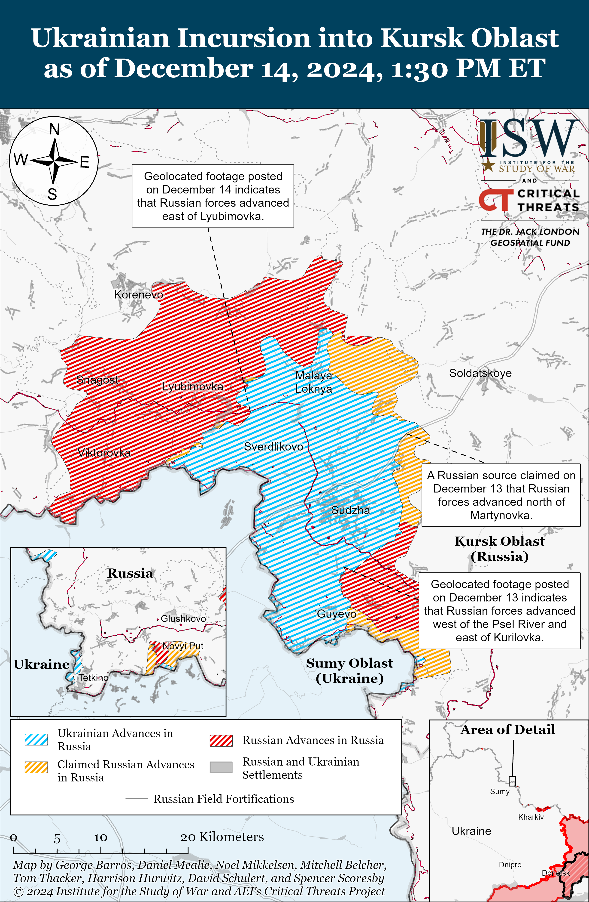](https://understandingwar.org/map/ukrainian-incursion-into-kursk-oblast-as-of-december-14-2024-130-pm-et/)

**The prospects for Russia’s continued military presence in Syria remain unclear as reports that Russia is evacuating its military assets from Syria continue.** Ukraine’s Main Military Intelligence Directorate (GUR) stated on December 14 that “hundreds” of Russian soldiers cannot reach Hmeimim Air Base from Homs Governorate out of fear that Russian forces will come under fire from unspecified actors.[9] The GUR stated that the Russian Ministry of Defense’s (MoD) Africa Corps arrived in Syria to protect Russian forces moving towards Russia’s bases on the western coast and that Russian Colonel Dmitry Motrenko is negotiating with military contingents in Syria from other unspecified states in order to secure guarantees of “immunity” for Russian soldiers waiting at the Tiyas Air Base west of Palmyra. The GUR also stated that roughly 1,000 Russian personnel left Damascus on December 13 in a column heading towards the Port of Tartus and Hmeimim Air Base, and ISW observed footage on December 13 of Russian military convoys moving from Damascus and other areas in southern Syria, likely towards the two main Russian bases.[10] *Reuters* reported on December 14 that a “Syrian security official” stationed near Hmeimim Air Base stated that at least one cargo plane flew out of the base on December 14 bound for Libya.[11] Syrian military and security sources reportedly stated that Russia is withdrawing some heavy equipment and senior officers from the Syrian Arab Army (SAA) to Moscow but is currently not planning to permanently pull out of the Port of Tartus or Hmeimim Air Base. A Russian milblogger posted photos and footage on December 14 purportedly showing Russian military assets still operating at the Russian helicopter base at Qamishli in northeastern Syria, and a Russian source claimed on December 14 that Russian forces have withdrawn from their base in Kobani in northern Syria.[12]

[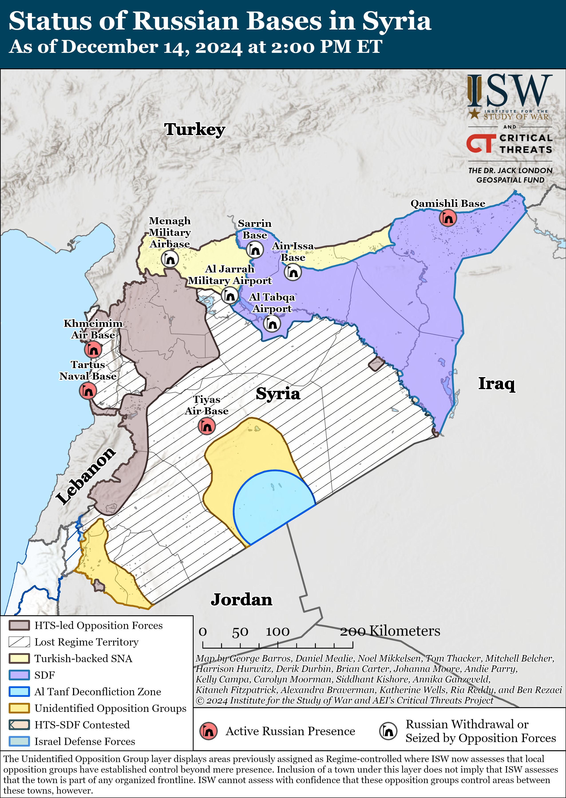](https://understandingwar.org/map/status-of-russian-bases-in-syria-as-of-december-14-2024-at-200-pm-et/)

**The complex nature of the interim Syrian government is likely resulting in conflicting reports about whether Russia is engaged in talks with Syrian opposition groups.** Hayat Tahrir al Sham (HTS) controls the Syrian interim government, but HTS and the interim government do not yet have complete control over the disparate groups that helped overthrow the Assad regime.Russian Deputy Foreign Affairs Minister Mikhail Bogdanov stated on December 12 that Russia has established contacts with HTS.[13] *Reuters* reported on December 14 that a Russian source stated that discussions between Russia and the interim Syrian government are ongoing.[14] A “senior rebel official close to the new interim administration” told *Reuters*, however, that the issue of Russia’s military presence in Syria and Russia’s previous agreements with the Assad regime are “not under discussion” and that talks at an unspecified time in the future will address this matter. The official reportedly stated that the “Syrian people will have the final say.” Kremlin newswire *TASS* reported on December 13 that Mohammed Sabra, a Syrian politician who represented the Syrian opposition’s High Negotiations Committee at the 2016 Geneva peace talks on the Syrian Civil War, similarly stated that there should be a referendum in the future to allow the Syrian people to approve any foreign military presence in Syria.[15] It is unclear if *Reuters* source described as“senior rebel official close to the new interim administration” who denied talks between Russia and the interim government is a member of HTS or another Syrian opposition group.[16] It remains unclear if Russia is in contact with all the Syrian opposition groups necessary to guarantee the short- and long-term safety of its military bases and select opposition groups may be unaware that Russia is in discussion with other groups. Russian state media has notably not differentiated between different opposition groups when reporting on the situation in Syria, possibly as part of efforts to present the interim government as more united so as to increase the legitimacy of any agreements Russia reaches with one or some of the groups.[17]

**Ukrainian forces struck an oil depot in Oryol Oblast on the night of December 13 to 14.** The Ukrainian General Staff reported that units of Ukraine’s Special Operations Forces (SSO) and the Ukrainian Armed Forces struck the “Steel Horse” Oil Depot near Oryol City and caused a fire at the facility.[18] The Ukrainian General Staff reported that the oil depot supplies products to the Russian military and noted that Ukrainian forces are still conducting a battle damage assessment (BDA). Footage published on December 13 and 14 shows the aftermath of the strike and the fire at the facility, and Russian officials acknowledged the strike and the resulting fire.[19]

**The new Georgian Dream-dominated parliament and other government bodies elected Georgian Dream’s candidate, Mikheil Kavelashvili, as Georgian President on December 14.[20]** Kavelashvili received the votes from the members of parliament and other government bodies required to meet the two thirds threshold to be president despite Georgian the fact that opposition parliament members boycotted the vote.[21] Georgian President Salome Zurabishvili continues to contest the legitimacy of the Georgian Dream party’s parliamentary electoral victory and stated that “nobody elected anyone” in response to Kavelashvili’s election.[22]

**Key Takeaways:**

- **Ukrainian President Volodymyr Zelensky stated on December 14 that the Russian military has deployed North Korean soldiers in infantry assaults in Kursk Oblast.**
- **The prospects for Russia’s continued military presence in Syria remain unclear as reports that Russia is evacuating its military assets from Syria continue.**
- **The complex nature of the interim Syrian government is likely to result in conflicting reports about whether Russia is engaged in talks with Syrian opposition groups.**
- **Ukrainian forces struck an oil depot in Oryol Oblast on the night of December 13 to 14.**
- **The new Georgian Dream-dominated parliament and other government bodies elected Georgian Dream’s candidate, Mikheil Kavelashvili, as Georgian President on December 14.**
- **Russian forces recently advanced in Kursk Oblast and near Torestk, Pokrovsk, Kurakhove, and Robotyne.**
- **Ukrainian forces regained lost positions near Vovchansk within the past several weeks.**
- **Russian President Vladimir Putin continues to exalt the “Time of Heroes” veteran program and use it to militarize the Russian government and society.**

***We do not report in detail on Russian war crimes because these activities are well-covered in Western media and do not directly affect the military operations we are assessing and forecasting. We will continue to evaluate and report on the effects of these criminal activities on the Ukrainian military and the Ukrainian population and specifically on combat in Ukrainian urban areas. We utterly condemn Russian violations of the laws of armed conflict and the Geneva Conventions and crimes against humanity even though we do not describe them in these reports.***

- Ukrainian Operations in the Russian Federation
- Russian Main Effort – Eastern Ukraine (comprised of three subordinate main efforts)
- Russian Subordinate Main Effort #1 – Push Ukrainian forces back from the international border with Belgorod Oblast and approach to within tube artillery range of Kharkiv City
- Russian Subordinate Main Effort #2 – Capture the remainder of Luhansk Oblast and push westward into eastern Kharkiv Oblast and encircle northern Donetsk Oblast
- Russian Subordinate Main Effort #3 – Capture the entirety of Donetsk Oblast
- Russian Supporting Effort – Southern Axis
- Russian Air, Missile, and Drone Campaign
- Russian Mobilization and Force Generation Efforts
- Russian Technological Adaptations
- Activities in Russian-occupied areas
- Significant Activity in Belarus

**Ukrainian Operations in the Russian Federation**

Russian forces recently advanced in the main Ukrainian salient in Kursk Oblast amid continued offensive operations in the area on December 14. Geolocated footage published on December 14 indicates that Russian forces recently advanced during a reinforced platoon-sized mechanized assault east of Lyubimovka (southeast of Korenevo).[23] The Ukrainian brigade that repelled the assault reported that Ukrainian forces destroyed six Russian armored vehicles during the assault. Additional geolocated footage published on December 13 indicates that Russian forces recently marginally advanced east of Kurilovka (south of Sudzha).[24] A senior non-commissioned officer of a Ukrainian brigade operating in the Kursk direction reported that Ukrainian forces repelled another reinforced platoon-sized mechanized assault in an unspecified area of Kursk Oblast on December 12.[25] The senior non-commissioned officer reported that Russian forces are attacking in squads of 10 to 12 soldiers in Kursk Oblast. Russian milbloggers claimed that Russian forces crossed the Psel River near Kurilovka, advanced north of Martynovka (northeast of Sudzha), and are advancing in the windbreaks east of Novoivanovka and near Darino (both southeast of Korenevo).[26] ISW has not observed confirmation of these claims, however. A Russian milblogger claimed that Ukrainian forces are counterattacking in unspecified areas of Kursk Oblast.[27] Elements of the Russian 106th Airborne (VDV) Division are reportedly operating near Novoivanovka, and elements of the Russian 56th VDV Regiment (7th VDV Division) and 11th VDV Brigade reportedly continue to operate in Kursk Oblast.[28] Elements of the Russian 1427th Motorized Rifle Regiment (formed during 2022 partial reserve call up) and the “Pyatnashka” International Volunteer Brigade are reportedly operating along the Naidenov-Nechayev line (north of Sudzha).[29]

Ukraine’s Main Military Intelligence Directorate (GUR) reported that unspecified actors set fire to an Su-30 aircraft at a military airfield near Krymsk, Krasnodar Krai on December 14 and disabled three locomotives near Krasnodar City on December 13.[30]

**Russian Main Effort – Eastern Ukraine**

**Russian Subordinate Main Effort #1 – Kharkiv Oblast (Russian objective: Push Ukrainian forces back from the international border with Belgorod Oblast and approach to within tube artillery range of Kharkiv City)**

Ukrainian forces advanced in northern Kharkiv Oblast within the past several weeks amid continued Russian offensive operations northeast of Kharkiv City near Vovchansk on December 13 and 14.[31] Geolocated footage published on December 1 indicates that Ukrainian forces advanced in southern Hlyboke (north of Kharkiv City), but this advance is not recent and likely occurred in the past several weeks.[32]

[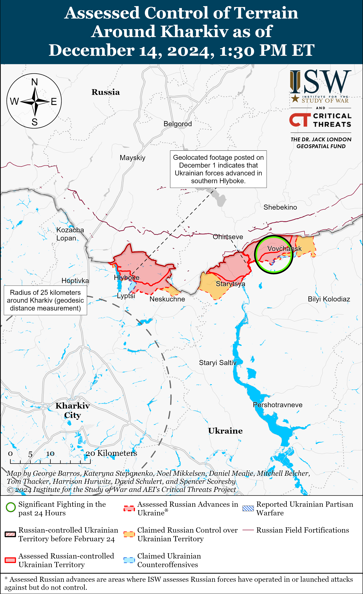](https://understandingwar.org/map/assessed-control-of-terrain-around-kharkiv-as-of-december-14-2024-130-pm-et/)

**Russian Subordinate Main Effort #2 – Luhansk Oblast (Russian objective: Capture the remainder of Luhansk Oblast and push westward into eastern Kharkiv Oblast and northern Donetsk Oblast)**

Russian forces continued offensive operations along the Kupyansk-Svatove-Kreminna line on December 14 but did not make any confirmed advances. A Russian milblogger claimed that elements of the Russian 27th Motorized Rifle Brigade (1st Guards Tank Army, Moscow Military District [MMD]) advanced in northern Lozova (northwest of Svatove), although ISW has not observed confirmation of this claim.[33] Ukrainian military observer Yurii Butusov stated on December 13 that a brigade operating in the Lyman direction noted that Russian forces have started conducting assaults in squads of 10 to 15 personnel instead of teams of two to three personnel.[34] Russian forces continued attacking southeast of Kupyansk near Kolisnykivka, Bohuslavka, and Zahryzove; west of Svatove near Pershotravneve, Nadiya, Kopanky, Lozova, Zelenyi Hai, and Shyikivka; southwest of Svatove near Cherneshchyna, Hrekivka and Novoyehorivka; northwest of Kreminna near Makiivka and Terny; west of Kreminna near Torske and Zarichne; and southwest of Kreminna near Hryhorivka and Dibrova on December 13 and 14.[35] Elements of the Russian 31st Motorized Rifle Regiment (67th Motorized Rifle Division, 25th Combined Arms Army [CAA], Central Military District [CMD]) reportedly continue operating in the Lyman direction.[36]

[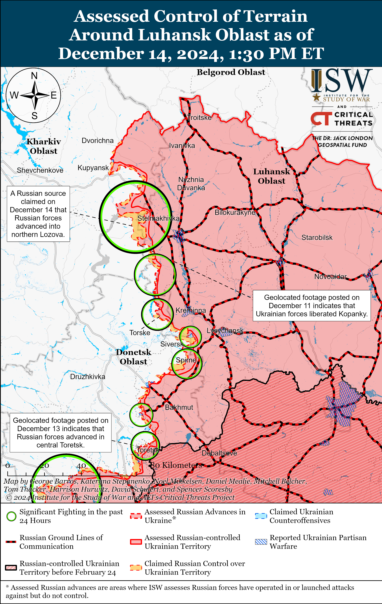](https://understandingwar.org/map/assessed-control-of-terrain-around-luhansk-oblast-as-of-december-14-2024-130-pm-et/)

**Russian Subordinate Main Effort #3 – Donetsk Oblast (Russian objective: Capture the entirety of Donetsk Oblast, the claimed territory of Russia’s proxies in Donbas)**

Russian forces continued offensive operations northeast of Siversk near Bilohorivka, east of Siversk near Verknokamyanske, and southeast of Siversk near Spirne and Vyimka on December 13 and 14 but did not make any confirmed advances.[37]

Russian forces continued offensive operations in the Chasiv Yar direction on December 14 but did not make any confirmed advances. Russian sources claimed that Russian forces pushed Ukrainian forces from additional areas of the Refractory Plant in central Chasiv Yar, and that Ukrainian forces withdrew from some positions elsewhere in central Chasiv Yar and on the settlement’s outskirts.[38] ISW has not observed visual confirmation of these claims. Russian forces continued offensive operations in Chasiv Yar itself and Stupochky (south of Chasiv Yar) on December 13 and 14.[39] Footage published on December 13 shows that Russian forces have draped nets over the O0508 Bakhmut-Chasiv Yar road to protect Russian vehicles from Ukrainian drone strikes.[40] Russian drone operators from the 98th Airborne (VDV) Division and elements of the Russian 78th “Sever-Akhmat” Motorized Rifle Regiment (42nd Motorized Rifle Division, 58th Combined Arms Army [CAA], Southern Military District [SMD]), and the 4th Motorized Rifle Brigade (3rd CAA, formerly 2nd Luhansk People’s Republic [LNR] AC, purportedly of the Southern Military District [SMD]) are reportedly operating near Chasiv Yar.[41]

[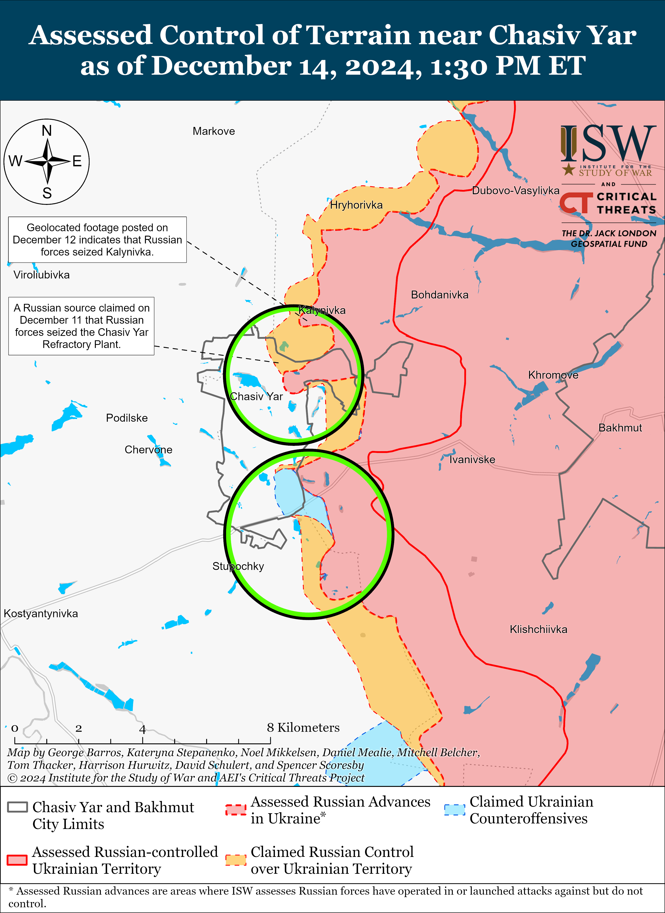](https://understandingwar.org/map/assessed-control-of-terrain-near-chasiv-yar-as-of-december-14-2024-130-pm-et/)

Russian forces recently advanced within central Toretsk amid continued offensive operations in the Toretsk direction on December 13 and 14. Geolocated footage published on December 13 indicates that Russian forces advanced northwestward at the Tsentralna Mine and to the market in central Toretsk, and a Russian milblogger claimed that Russian forces aim to secure a foothold at the market.[42] Russian sources claimed that Russian forces further advanced northwestward along 3rd Travnevyi Lane approaching the waste heap adjacent to mine number ten in central Toretsk.[43] Russian forces continued assaults in Toretsk itself, north of Toretsk near Dyliivka, and northeast of Toretsk near Krymske on December 13 and 14.[44] Ukrainian Luhansk Group of Forces Spokesperson Major Anastasiya Bobovnikova stated that Russian forces are concentrating personnel for infantry assaults within basements and destroyed buildings in Toretsk to avoid Ukrainian detection and artillery fire.[45]

[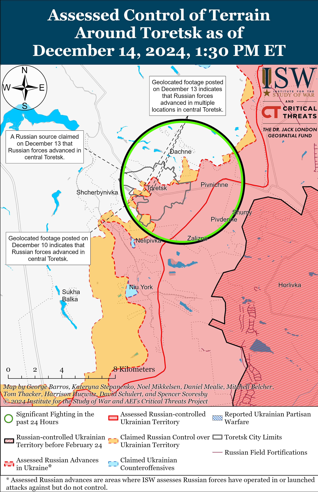](https://understandingwar.org/map/assessed-control-of-terrain-around-toretsk-as-of-december-14-2024-130-pm-et/)

Ukrainian Khortytsia Group of Forces Spokesperson Colonel Nazar Voloshyn stated on December 13 that Ukrainian forces have an artillery advantage in some unspecified areas of the front of 1.5 to one or three-to-one.[46] Voloshyn stated on December 10 that Russian forces had a three to one artillery advantage over Ukrainian forces.[47] Voloshyn is likely referring to unspecified areas in the Khortytsia Group of Forces’ area of responsibility (AoR) in eastern Ukraine.

Russian forces recently advanced in the Pokrovsk direction amid continued offensive operations in the area on December 14. Geolocated footage published on December 13 indicates that Russian forces recently advanced in western Shevchenko (south of Pokrovsk) and in southern Novotroitske (southwest of Pokrovsk).[48] Russian milbloggers claimed that Russian forces advanced 500 meters deep in eastern Shevchenko, near Mykolaivka (east of Pokrovsk), up to the outskirts of Pishchane (northwest of Shevchenko) and the southern edge of Dachenske (south of Pokrovsk), and towards Novovasylivka (west of Novotroitske).[49] ISW has not observed confirmation of these claims, however. Russian forces conducted offensive operations east of Pokrovsk near Myrolyubivka and Promin; southeast of Pokrovsk near Sukhyi Yar and Lysivka; south of Pokrovsk near Dachenske, Shevchenko, Zelene, Novyi Trud, and Puhskine; and southwest of Pokrovsk near Novoolenivka and Pishchane on December 13 and 14.[50] Russian milbloggers claimed that Ukrainian forces counterattacked near Novotroitske and Shevchenko.[51] The deputy commander of a Ukrainian drone detachment operating in the Pokrovsk direction stated that the Russian military command is sending the least trained soldiers on the first wave of assaults and then following up with better trained professional personnel.[52] A Ukrainian servicemember operating in the Pokrovsk direction stated that Russian forces are relying on drone operations and infantry assaults to compensate for an insufficient quantity of equipment and armored vehicles in this direction and are using small infantry groups to probe Ukrainian defenses.[53] Elements of the Russian 15th Motorized Rifle Brigade (2nd CAA, Central Military District [CMD]) are reportedly operating near Novotroitske; elements of the 74th Motorized Rifle Brigade (41st CAA, CMD) are reportedly operating near Shevchenko; and elements of the 27th Motorized Rifle Division (2nd CAA, CMD) are reportedly operating in the Pokrovsk direction.[54]

[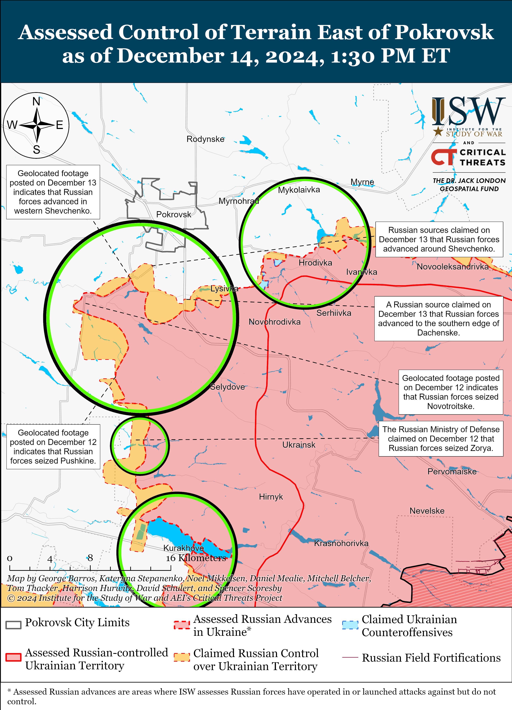](https://understandingwar.org/map/assessed-control-of-terrain-east-of-pokrovsk-as-of-december-14-2024-130-pm-et/)

Russian forces recently advanced in the Kurakhove direction amid continued offensive operations in the area on December 14. Geolocated footage published on December 14 indicates that Russian forces recently advanced to the Kurakhove City Council building along Mechnikova Street in western Kurakhove.[55] Russian milbloggers credited elements of the Russian 5th Motorized Rifle Brigade (51st CAA, formerly 1st Donetsk People’s Republic Army Corps [DNR AC]) with advancing to the city council building.[56] Russian milbloggers claimed that Russian forces also advanced towards Slovyanka (northwest of Kurakhove and west of Zorya) and to Shevchenko (northwest of Kurakhove and west of Stari Terny), but ISW has not observed confirmation of these claims.[57] Russian forces conducted offensive operations near Kurakhove itself; northwest of Kurakhove near Sonstivka, Zorya, and Stari Terny; west of Kurakhove near Dachne; and south of Kurakhove near Dalne on December 13 and 14.[58] Elements of the Russian 114th Motorized Rifle Brigade (51st CAA) are reportedly operating in Shevchenko.[59]

DNR Head Denis Pushilin claimed that Russian forces repelled a Ukrainian missile strike against Donetsk City on the evening of December 13 but that fragments of the downed missiles damaged apartment buildings in Kyivskyi Raion.[60] ISW has not observed additional reporting on the alleged Ukrainian missile strike.

Russian forces continued offensive operations in the Vuhledar direction on December 14 but did not make any confirmed advances. Russian forces conducted offensive operations northeast of Vuhledar near Yelizavetivka and Veselyi Hai; north of Vuhledar near Hannivka, Uspenivka, and Trudove; and northwest of Vuhledar near Kostyantynopolske and Sukhi Yaly on December 13 and 14.[61] Russian milbloggers claimed that Russian forces have almost completely seized Uspenivka but that the situation in the western part of the settlement remains unclear.[62] Russian sources claimed that elements of the Russian 57th Motorized Rifle Regiment (20th Motorized Rifle Division, 8th CAA, Southern Military District [SMD]) raised a flag in Yelizavetivka and established positions in the settlement.[63] An officer in a Ukrainian brigade operating near Uspenivka stated that Russian forces are using different assault tactics, first sending small groups on motorcycles on assaults followed by assaults in large columns of armored vehicles the following day.[64] Elements of the 39th Motorized Rifle Brigade (68th AC, EMD) are reportedly operating near Veselyi Hai and Kostyantypolske.[65]

[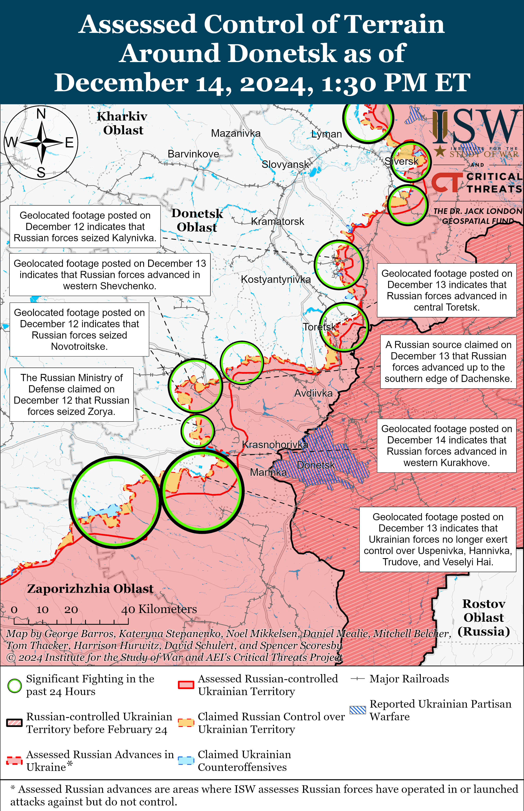](https://understandingwar.org/map/assessed-control-of-terrain-around-donetsk-as-of-december-14-2024-130-pm-et/)

Russian forces continued offensive operations near Velyka Novosilka on December 14 but did not make any confirmed advances. A Russian milblogger claimed that Russian forces advanced near Storozheve and Neskuchne (both south of Velyka Novosilka), but ISW has not observed confirmation of this claim.[66] Russian forces conducted offensive operations northeast of Velyka Novosilka near Rozdolne; north of Velyka Novosilka near Novyi Komar; south of Velyka Novosilka near Blahodatne, Storozheve, and Neskuchne; and southwest of Velyka Novosilka near Novodarivka and Novopil on December 13 and 14.[67] A Russian milblogger claimed that Ukrainian forces are counterattacking near Velyka Novosilka.[68] Russian milbloggers claimed that fighting recently resumed in Novyi Komar after Russian forces retreated from the settlement as of December 7.[69] Elements of the Russian 40th Naval Infantry Brigade (Pacific Fleet, EMD) are reportedly operating near Rozdolne, and elements of the 143rd Motorized Rifle Regiment (127th Motorized Rifle Brigade, 5th CAA, EMD) are reportedly operating in the Velyka Novosilka direction.[70]

[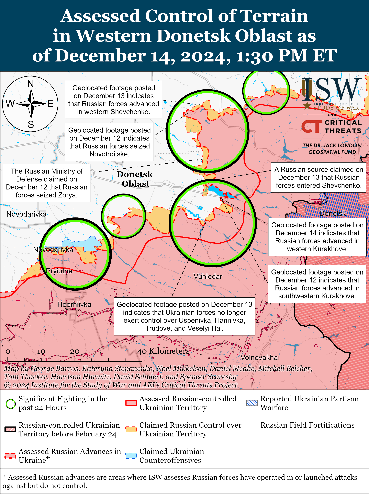](https://understandingwar.org/map/assessed-control-of-terrain-in-western-donetsk-oblast-as-of-december-14-2024-130-pm-et/)

**Russian Supporting Effort – Southern Axis (Russian objective: Maintain frontline positions and secure rear areas against Ukrainian strikes)**

Russian forces recently marginally advanced in western Zaporizhia Oblast in the Orikhiv area amid continued fighting in the area on December 14.[71] Geolocated footage published on December 14 indicates that Russian forces recently advanced northeast of Nesteryanka (northwest of Robotyne).[72]

[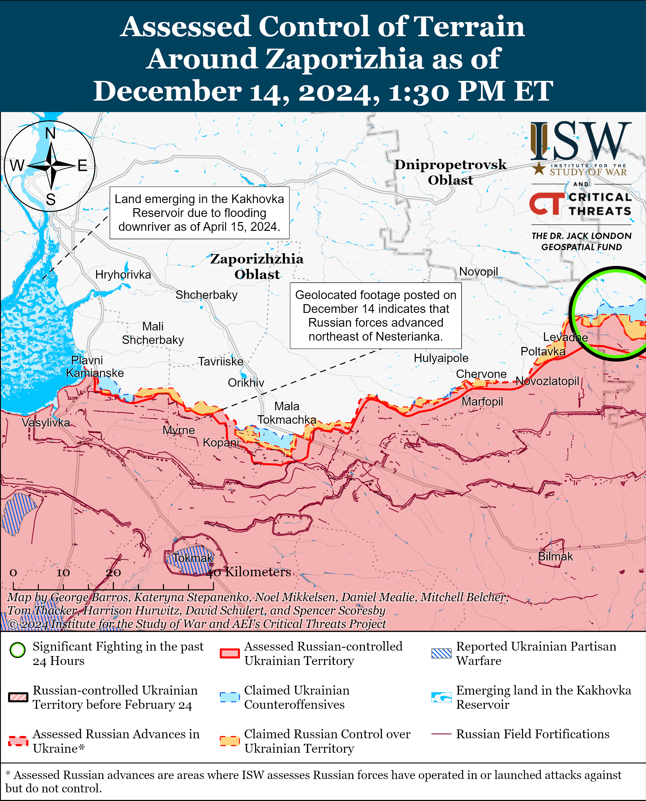](https://understandingwar.org/map/assessed-control-of-terrain-around-zaporizhia-as-of-december-14-2024-130-pm-et/)

Russian forces continued ground attacks in the Dnipro direction in east (left) bank Kherson Oblast on December 13 and 14, but there were no confirmed changes to the frontline.[73] A Kremlin-affiliated Russian milblogger amplified a claim that the Russian military is attempting to confiscate vehicles that Russian volunteers are using to transport military personnel and supplies in occupied Kherson Oblast.[74]

[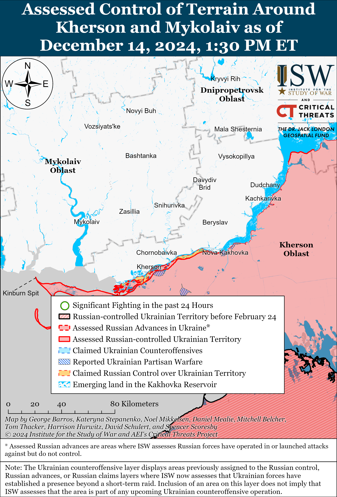](https://understandingwar.org/map/assessed-control-of-terrain-around-kherson-and-mykolaiv-as-of-december-14-2024-130-pm-et/)

**Russian Air, Missile, and Drone Campaign (Russian Objective: Target Ukrainian military and civilian infrastructure in the rear and on the frontline)**

Russian forces conducted drone strikes against Ukraine overnight on December 13 to 14. The Ukrainian Air Force reported that Russian forces launched 132 Shahed and other drones from Kursk, Oryol, and Bryansk oblasts; Millerovo, Rostov Oblast; and Primorsko-Akhtarsk, Krasnodar Krai overnight.[75] The Ukrainian Air Force reported that Ukrainian forces downed 58 drones over Chernihiv, Sumy, Kyiv, Poltava, Cherkasy, Vinnytsia, Odesa, Mykolaiv, Kharkiv, Dnipropetrovsk, and Kirovohrad oblasts; 72 drones did not reach their targets and became “lost;” and two drones returned to Russian airspace. Ukrainian officials reported that Russian drones damaged residential areas in Chernihiv Oblast and an enterprise and two warehouses in Kyiv Oblast.[76] A Russian milblogger claimed that Russian strikes also hit Ukrainian military facilities in Odesa Oblast.[77]

**Russian Mobilization and Force Generation Efforts (Russian objective: Expand combat power without conducting general mobilization)**

Russian President Vladimir Putin continues to exalt the “Time of Heroes” veteran program and use it to militarize the Russian government and society. Putin spoke at the ruling United Russia party’s congress on December 14 and called on United Russia to expand the Time of Heroes program into more Russian federal subjects and broaden applications so more Russian veterans can apply to the program.[78] The Time of Heroes program notably provides job training for Russian military veterans, and the Kremlin has recently appointed Time of Heroes alumni to positions within various Russian federal, regional, and local government structures.[79] Putin also emphasized the importance of national unity and rhetorically connected this unity to patriotic programs including Time of Heroes and Russian youth military-patriotic organizations Yunarmia and Movement of the First, all of which United Russia sponsors.[80]

Some Russian sources speculated that the Kremlin aims to reorganize Russian military-patriotic youth organizations to support long term force generation and veterans integration efforts. Russian insider sources claimed on December 13 and 14 that the Russian Presidential Administration and United Russia party approved Yunarmia Deputy Head Alexander Amelin, a Russian veteran who fought in Ukraine with the BARS-Kaskad detachment (Russian Combat Army Reserve), to lead Yunarmia.[81] One of the sources speculated that Amelin’s appointment indicates that authorities will transform Yunarmia to provide volunteer assistance to Russian veterans and soldiers in Ukraine as well as promote contract recruitment.[82] Another source criticized Amelin’s appointment as an indication that Russian authorities continue to struggle to reintegrate Russian combat veterans back into Russian society.[83]

**Russian Technological Adaptations (Russian objective: Introduce technological innovations to optimize systems for use in Ukraine)**

The Russian defense industrial base (DIB) continues efforts to counter Ukrainian drones. Russian Center for Unmanned Systems and Technologies Chairperson Andrei Bezrukov claimed on December 14 that the center developed the “Kalinka” monitoring system to detect drones that connect to satellite systems, including Starlink.[84] Bezrukov claimed that Russian forces are currently testing the system in Ukraine and that the system is able to detect Ukrainian aerial and maritime drones up to 15 kilometers away.

**Activities in Russian-occupied areas (Russian objective: Consolidate administrative control of annexed areas; forcibly integrate Ukrainian citizens into Russian sociocultural, economic, military, and governance systems)**

*ISW is not publishing coverage of activities in Russian-occupied areas today.*

**Significant activity in Belarus (Russian efforts to increase its military presence in Belarus and further integrate Belarus into Russian-favorable frameworks)**

Belarusian President Alexander Lukashenko arrived in Oman on December 14 to meet with Sultan of Oman Haitham bin Tariq Al Said to discuss trade, economic, industrial, and agricultural cooperation.[85]

**Note: ISW does not receive any classified material from any source, uses only publicly available information, and draws extensively on Russian, Ukrainian, and Western reporting and social media as well as commercially available satellite imagery and other geospatial data as the basis for these reports. References to all sources used are provided in the endnotes of each update.**

[1] https://t.me/V\_Zelenskiy\_official/12747

[2] https://understandingwar.org/backgrounder/russian-offensive-campaign-assessment-november-5-2024

[3] https://understandingwar.org/backgrounder/russian-offensive-campaign-assessment-december-13-2024

[4] https://understandingwar.org/backgrounder/russian-offensive-campaign-assessment-december-13-2024

[5] https://x.com/moklasen/status/1867934060234129641; https://x.com/bayraktar\_1love/status/1867927600473215113; https://t.me/Zigun\_Mangusta/17510; https://t.me/Zigun\_Mangusta/17508

[6] https://t.me/motopatriot/30480; https://t.me/motopatriot/30482

[7] https://t.me/motopatriot/30461

[8] https://mil.in dot ua/uk/news/vijskovyh-kndr-vidpravyly-u-bij-na-kurshhyni/; https://x.com/Paradise\_Mouse/status/1867850386457211197; https://x.com/wartranslated/status/1867888183909728442 ; https://x.com/Paradise\_Mouse/status/1867889065510543397

[9] https://t.me/DIUkraine/5022

[10] https://isw.pub/UkrWar121324; https://t.me/DIUkraine/5022

[11] https://www.reuters.com/world/russia-pulling-back-not-out-syria-sources-say-2024-12-14/

[12] https://t.me/milinfolive/137538; https://t.me/motopatriot/30485; https://t.me/novosti\_efir/63419

[13] https://isw.pub/UkrWar121224

[14] https://www.reuters.com/world/russia-pulling-back-not-out-syria-sources-say-2024-12-14/

[15] https://tass dot ru/mezhdunarodnaya-panorama/22659293

[16] https://isw.pub/UkrWar121224

[17] https://t.me/tass\_agency/290865 ; https://t.me/tass\_agency/290737 ; https://t.me/tass\_agency/290354; https://t.me/tass\_agency/290355; https://t.me/tass\_agency/290356; https://t.me/tass\_agency/290357; https://t.me/tass\_agency/290358; https://t.me/tass\_agency/290360; https://t.me/tass\_agency/290363 ; https://t.me/tass\_agency/290367; https://t.me/tass\_agency/290369 ; https://tass dot ru/mezhdunarodnaya-panorama/22612661

[18] https://t.me/GeneralStaffZSU/19311 ; https://suspilne dot media/902333-v-rosijskomu-orli-prolunali-vibuhi-gorit-naftobaza/; https://www.facebook.com/GeneralStaff.ua/posts/pfbid01ShpZkf6DwK2YaEfYy81eUdCymcXtAnkTKFL7BSFJWAh9Ngxcj6WDx5U7nxL5V7fl

[19] https://x.com/bayraktar\_1love/status/1867711628579410217; https://x.com/bayraktar\_1love/status/1867921125889691699; https://x.com/Osinttechnical/status/1867707204091941087; https://x.com/Osinttechnical/status/1867706801984352699 ; https://t.me/tass\_agency/290924 ; https://t.me/tass\_agency/290938 ; https://t.me/astrapress/70217 ; https://t.me/astrapress/70220 ; https://t.me/astrapress/70223

[20] https://www.radiotavisupleba dot ge/a/33239861.html

[21] https://www.radiotavisupleba dot ge/a/33239822.html

[22] https://mtavari dot tv/news/172535-ak-var-ak-viknebi-imitom-rom-am-kveqanas-am ; https://www.radiotavisupleba dot ge/a/%E1%83%90%E1%83%A0%E1%83%90%E1%83%95%E1%83%98%E1%83%A1-%E1%83%90%E1%83%A0%E1%83%90%E1%83%95%E1%83%98%E1%83%9C-%E1%83%90%E1%83%A0-%E1%83%90%E1%83%A3%E1%83%A0%E1%83%A9%E1%83%94%E1%83%95%E1%83%98%E1%83%90-%E1%83%96%E1%83%A3%E1%83%A0%E1%83%90%E1%83%91%E1%83%98%E1%83%A8%E1%83%95%E1%83%98%E1%83%9A%E1%83%98-%E1%83%A7%E1%83%90%E1%83%95%E1%83%94%E1%83%9A%E1%83%90%E1%83%A8%E1%83%95%E1%83%98%E1%83%9A%E1%83%96%E1%83%94/33239833.html

[23] https://x.com/moklasen/status/1867856883303997952; https://x.com/GirkinGirkin/status/1867852287470969185; https://t.me/ua\_marines\_36brigade/2554; https://x.com/moklasen/status/1867862247433027720; https://x.com/OSINTua/status/1865412956743221456

[24] https://x.com/giK1893/status/1867527434309964053; https://t.me/stepova\_61/669

[25] https://armyinform dot com.ua/2024/12/14/u-nyh-fpv-nache-na-optovolokni-oskilky-nash-reb-na-nyh-ne-diye-zsu-pro-novu-taktyku-voroga-na-kurshhyni/

[26] https://t.me/dva\_majors/60163 ; https://t.me/motopatriot/30414 ; https://t.me/DnevnikDesantnika/20914 ; https://t.me/DnevnikDesantnika/20914

[27] https://t.me/wargonzo/23706

[28] https://t.me/mod\_russia/46836 ; https://t.me/RVvoenkor/82610

[29] https://t.me/motopatriot/30419

[30] https://t.me/DIUkraine/5023; https://x.com/bayraktar\_1love/status/1867887369892049162; https://mil.in dot ua/uk/news/gur-spalyly-perehoplyuvach-su-27-u-krymsku/

[31] https://www.facebook.com/GeneralStaff.ua/posts/pfbid02L8ivFStydXDSC4nrtcazqvKpepp99TedN953fx4GNvMDQd3oFXkfR77EowNHehsAl ; https://www.facebook.com/GeneralStaff.ua/posts/pfbid02vHU2jztHdXC5Jr9HnTKq7HThsq6er3hSbugH9kq5uW7KX9kkYVZEicpazicfj6dXl ; https://t.me/z\_arhiv/30065

[32] https://x.com/AudaxonX/status/1867746009499291896; https://t.me/Karma\_Sever/8996

[33] https://t.me/motopatriot/30481

[34] https://t.me/ButusovPlus/15795

[35] https://www.facebook.com/GeneralStaff.ua/posts/pfbid0GHiYbazFVYZWCLQZt6p7EHx59XDxtaUFhLL3xHbr6U9gCtKyPkZ4tj68dPFGGswtl ; https://www.facebook.com/GeneralStaff.ua/posts/pfbid02L8ivFStydXDSC4nrtcazqvKpepp99TedN953fx4GNvMDQd3oFXkfR77EowNHehsAl ; https://www.facebook.com/GeneralStaff.ua/posts/pfbid02vHU2jztHdXC5Jr9HnTKq7HThsq6er3hSbugH9kq5uW7KX9kkYVZEicpazicfj6dXl

[36] https://t.me/milinfolive/137561

[37] https://www.facebook.com/GeneralStaff.ua/posts/pfbid0GHiYbazFVYZWCLQZt6p7EHx59XDxtaUFhLL3xHbr6U9gCtKyPkZ4tj68dPFGGswtl ; https://www.facebook.com/GeneralStaff.ua/posts/pfbid02L8ivFStydXDSC4nrtcazqvKpepp99TedN953fx4GNvMDQd3oFXkfR77EowNHehsAl ; https://www.facebook.com/GeneralStaff.ua/posts/pfbid02vHU2jztHdXC5Jr9HnTKq7HThsq6er3hSbugH9kq5uW7KX9kkYVZEicpazicfj6dXl

[38] https://t.me/tass\_agency/290934 ; https://t.me/motopatriot/30454

[39] https://www.facebook.com/GeneralStaff.ua/posts/pfbid02L8ivFStydXDSC4nrtcazqvKpepp99TedN953fx4GNvMDQd3oFXkfR77EowNHehsAl ;  https://www.facebook.com/GeneralStaff.ua/posts/pfbid02vHU2jztHdXC5Jr9HnTKq7HThsq6er3hSbugH9kq5uW7KX9kkYVZEicpazicfj6dXl ; https://t.me/wargonzo/23706

[40] https://t.me/basurin\_e/15972

[41] https://t.me/RKadyrov\_95/5323 ; https://t.me/RKadyrov\_95/5324 ; https://t.me/DnevnikDesantnika/20928

[42] https://x.com/AudaxonX/status/1867947113247838398 ; https://x.com/AudaxonX/status/1867672552442933329 ; https://www.youtube.com/watch?v=knyeLRY6ZPY ; https://t.me/motopatriot/30464

[43] https://t.me/z\_arhiv/30062 ; https://t.me/motopatriot/30450 ; https://t.me/DnevnikDesantnika/20968

[44] https://www.facebook.com/GeneralStaff.ua/posts/pfbid0GHiYbazFVYZWCLQZt6p7EHx59XDxtaUFhLL3xHbr6U9gCtKyPkZ4tj68dPFGGswtl ; https://www.facebook.com/GeneralStaff.ua/posts/pfbid02L8ivFStydXDSC4nrtcazqvKpepp99TedN953fx4GNvMDQd3oFXkfR77EowNHehsAl ; https://www.facebook.com/GeneralStaff.ua/posts/pfbid02vHU2jztHdXC5Jr9HnTKq7HThsq6er3hSbugH9kq5uW7KX9kkYVZEicpazicfj6dXl

[45] https://youtu.be/ScdUZNkwcYc ; https://suspilne dot media/donbas/902135-namagautsa-zajti-malimi-grupami-ta-shovatis-v-pidvalah-dla-atak-otuv-lugansk-pro-situaciu-v-torecku/

[46] https://armyinform dot com.ua/2024/12/13/zsu-perevazhayut-rosijsku-artyleriyu-na-deyakyh-dilyankah-u-try-razy/

[47] https://understandingwar.org/backgrounder/russian-offensive-campaign-assessment-december-10-2024

[48] https://t.me/WarArchive\_ua/23500; https://t.me/skalabatalion/471; https://t.me/WarArchive\_ua/23500; https://t.me/skalabatalion/471

[49] https://t.me/rybar/66351; https://t.me/voenkorKotenok/60722; https://t.me/RVvoenkor/82643 ; https://t.me/motopatriot/30437

[50] https://www.facebook.com/GeneralStaff.ua/posts/pfbid0GHiYbazFVYZWCLQZt6p7EHx59XDxtaUFhLL3xHbr6U9gCtKyPkZ4tj68dPFGGswtl ; https://www.facebook.com/GeneralStaff.ua/posts/pfbid02L8ivFStydXDSC4nrtcazqvKpepp99TedN953fx4GNvMDQd3oFXkfR77EowNHehsAl; https://www.facebook.com/GeneralStaff.ua/posts/pfbid02vHU2jztHdXC5Jr9HnTKq7HThsq6er3hSbugH9kq5uW7KX9kkYVZEicpazicfj6dXl ; https://t.me/dva\_majors/60163; https://t.me/voenkorKotenok/60722

[51] https://t.me/DnevnikDesantnika/20914; https://t.me/motopatriot/30415; https://t.me/motopatriot/30426; https://t.me/motopatriot/30452; https://t.me/voenkorKotenok/60722 ; https://t.me/RVvoenkor/82643; https://t.me/motopatriot/30484

[52] https://www.youtube.com/watch?v=aDXWlQ2K0dM; https://armyinformd dot com.ua/2024/12/13/zradnykiv-vykorystovuyut-dlya-myasnyh-shturmiv-u-ataky-na-pokrovsk-pershymy-zhenut-kolaborantiv/

[53] https://armyinform.com dot ua/2024/12/14/yedynyj-shans-vyzhyty-dlya-voroga-cze-zdatysya-v-polon-sytuacziya-na-pokrovskomu-napryamku/ ; https://www.youtube.com/watch?v=aDXWlQ2K0dM ; https://suspilne dot media/donbas/902395-stiraut-odnu-brigadu-zavodat-insu-vijskovij-68-brigadi-rozpoviv-pro-boi-pid-pokrovskom/

[54] https://t.me/motopatriot/30424; https://t.me/milinfolive/137616 ; https://t.me/RVvoenkor/82615

[55] https://t.me/creamy\_caprice/7819; https://t.me/korrzakadrom/1317; https://t.me/creamy\_caprice/7816; https://t.me/nm\_dnr/13096

[56] https://t.me/z\_arhiv/30072; https://t.me/Sladkov\_plus/12043; https://t.me/motopatriot/30441

[57] https://t.me/DnevnikDesantnika/20914; https://t.me/voenkorKotenok/60722

[58] https://www.facebook.com/GeneralStaff.ua/posts/pfbid0GHiYbazFVYZWCLQZt6p7EHx59XDxtaUFhLL3xHbr6U9gCtKyPkZ4tj68dPFGGswtl; https://www.facebook.com/GeneralStaff.ua/posts/pfbid02L8ivFStydXDSC4nrtcazqvKpepp99TedN953fx4GNvMDQd3oFXkfR77EowNHehsAl; https://www.facebook.com/GeneralStaff.ua/posts/pfbid02vHU2jztHdXC5Jr9HnTKq7HThsq6er3hSbugH9kq5uW7KX9kkYVZEicpazicfj6dXl; https://t.me/RVvoenkor/82643

[59] https://t.me/voenkorKotenok/60722

[60] https://t.me/PushilinDenis/5517

[61] https://www.facebook.com/GeneralStaff.ua/posts/pfbid0GHiYbazFVYZWCLQZt6p7EHx59XDxtaUFhLL3xHbr6U9gCtKyPkZ4tj68dPFGGswtl; https://www.facebook.com/GeneralStaff.ua/posts/pfbid02L8ivFStydXDSC4nrtcazqvKpepp99TedN953fx4GNvMDQd3oFXkfR77EowNHehsAl ; https://www.facebook.com/GeneralStaff.ua/posts/pfbid02vHU2jztHdXC5Jr9HnTKq7HThsq6er3hSbugH9kq5uW7KX9kkYVZEicpazicfj6dXl; https://t.me/NgP\_raZVedka/19952

[62] https://t.me/voenkorKotenok/60723; https://t.me/rybar/66321; https://t.me/NgP\_raZVedka/19952; https://t.me/dva\_majors/60163; https://t.me/motopatriot/30425; https://t.me/voin\_dv/12277 ; https://t.me/dva\_majors/60196

[63] https://t.me/RVvoenkor/82628 ; https://t.me/nm\_dnr/13097; https://t.me/motopatriot/30475

[64] https://suspilne dot media/donbas/902237-zadaca-ne-dopustiti-do-pihotnih-pozicij-boi-nepodalik-uspenivki-na-kurahivskomu-napramku/

[65] https://t.me/voin\_dv/12260; https://t.me/voin\_dv/12274; https://t.me/nm\_dnr/13099

[66] https://t.me/voenkorKotenok/60721; https://t.me/voenkorKotenok/60725

[67] https://www.facebook.com/GeneralStaff.ua/posts/pfbid0GHiYbazFVYZWCLQZt6p7EHx59XDxtaUFhLL3xHbr6U9gCtKyPkZ4tj68dPFGGswtl; https://www.facebook.com/GeneralStaff.ua/posts/pfbid02L8ivFStydXDSC4nrtcazqvKpepp99TedN953fx4GNvMDQd3oFXkfR77EowNHehsAl ; https://www.facebook.com/GeneralStaff.ua/posts/pfbid02vHU2jztHdXC5Jr9HnTKq7HThsq6er3hSbugH9kq5uW7KX9kkYVZEicpazicfj6dXl; https://understandingwar.org/backgrounder/russian-offensive-campaign-assessment-december-7-2024

[68] https://t.me/voin\_dv/12277

[69] https://t.me/motopatriot/30455; https://understandingwar.org/backgrounder/russian-offensive-campaign-assessment-december-7-2024

[70] https://t.me/motopatriot/30456; https://t.me/voin\_dv/12272

[71] https://t.me/dva\_majors/60163

[72] https://t.me/WarArchive\_ua/23512; https://t.me/spartan\_ngu/2042; https://t.me/creamy\_caprice/7818

[73] https://www.facebook.com/GeneralStaff.ua/posts/pfbid02L8ivFStydXDSC4nrtcazqvKpepp99TedN953fx4GNvMDQd3oFXkfR77EowNHehsAl ; https://www.facebook.com/GeneralStaff.ua/posts/pfbid02vHU2jztHdXC5Jr9HnTKq7HThsq6er3hSbugH9kq5uW7KX9kkYVZEicpazicfj6dXl

[74] https://t.me/zhivoff/18427 ; https://t.me/rybar/66340

[75] https://www.facebook.com/GeneralStaff.ua/posts/pfbid0e8t8iNpMCkTWixPjixF6HrEkK8gU2XWEFo4G2ydttp1RzHvPN3NogcfevR2exVrVl ; https://t.me/kpszsu/24824

[76] https://t.me/kyivoda/23492; https://suspilne dot media/cherkasy/902079-vibuhi-na-cerkasini-vnoci-14-grudna-so-vidomo-pro-rosijsku-ataku/

[77] https://t.me/RVvoenkor/82624

[78] http://kremlin dot ru/events/president/news/75881 ;

[79] https://understandingwar.org/backgrounder/russian-offensive-campaign-assessment-december-13-2024; https://understandingwar.org/backgrounder/russian-offensive-campaign-assessment-november-5-2024; https://understandingwar.org/backgrounder/russian-offensive-campaign-assessment-december-4-2024; https://understandingwar.org/backgrounder/russian-offensive-campaign-assessment-october-3-2024; https://understandingwar.org/backgrounder/russian-offensive-campaign-assessment-november-18-2024

[80] http://kremlin dot ru/events/president/news/75881 ;

[81] https://t.me/arbat/1950; https://t.me/russicaRU/60236

[82] https://t.me/russicaRU/60236

[83] https://t.me/arbat/1950

[84] https://www.kp dot ru/online/news/6138843/?ysclid=m4nya71qcv226104914

[85] https://t.me/pul\_1/14783 ; https://t.me/pul\_1/14786
