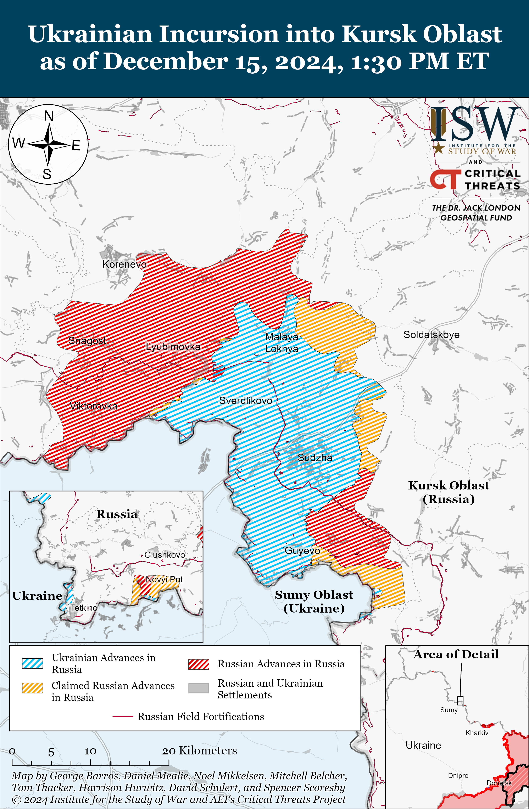
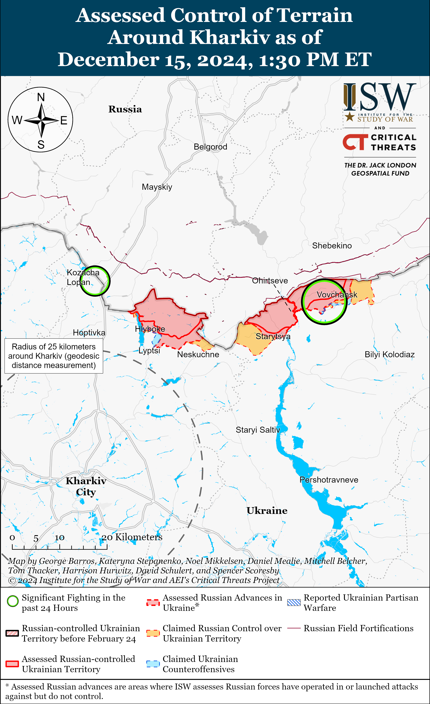
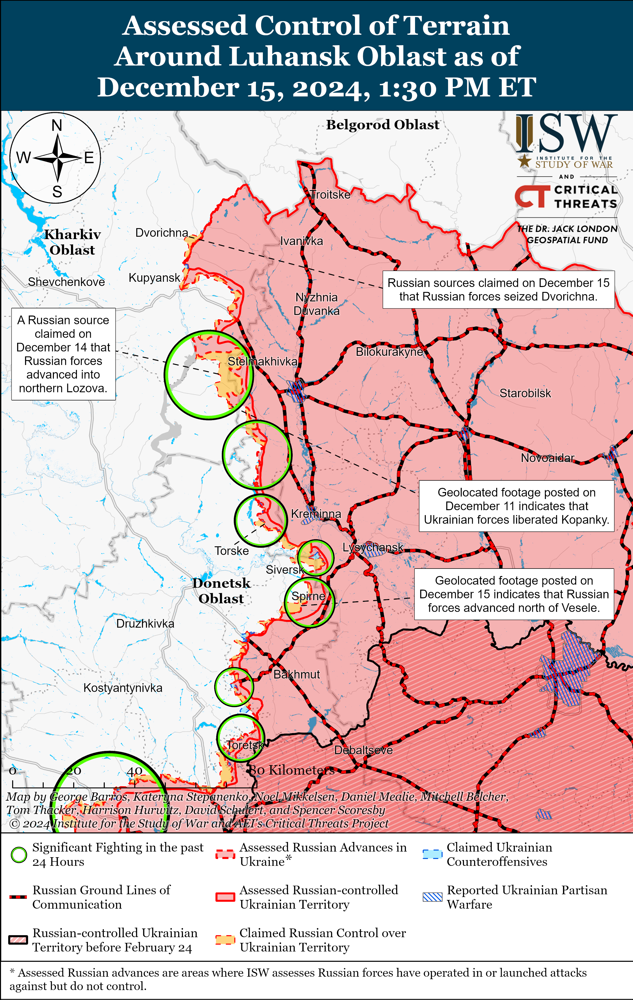
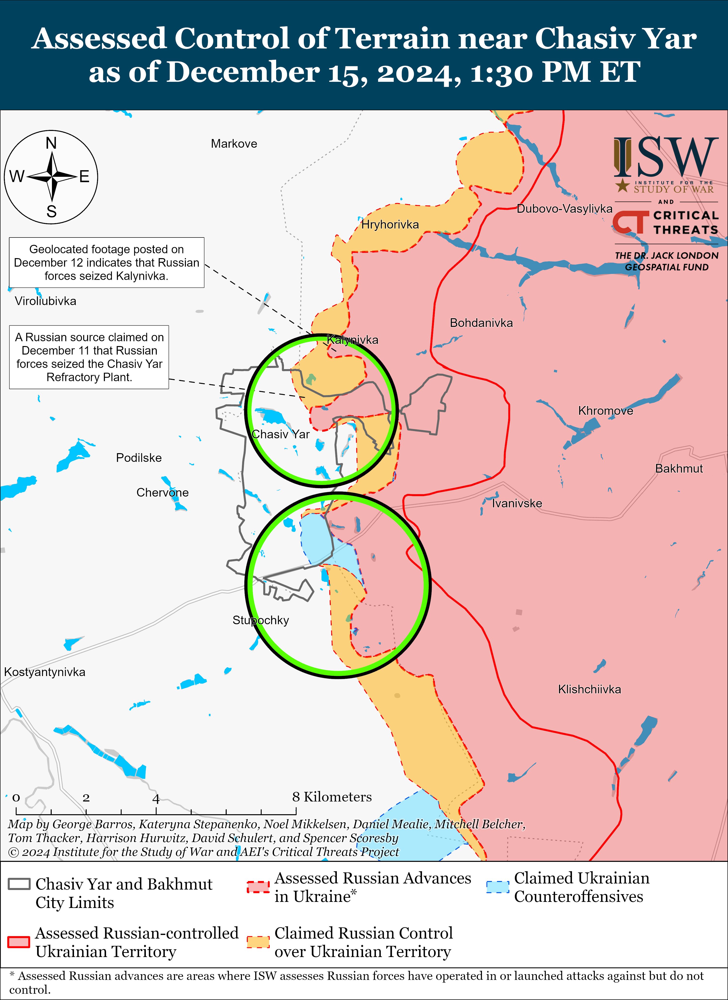
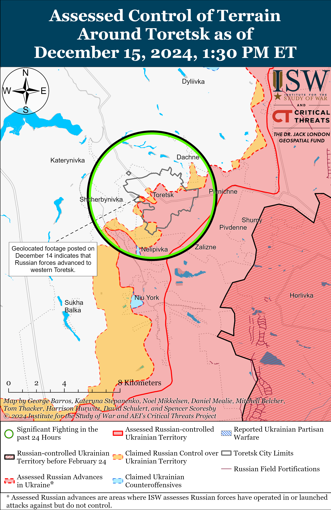
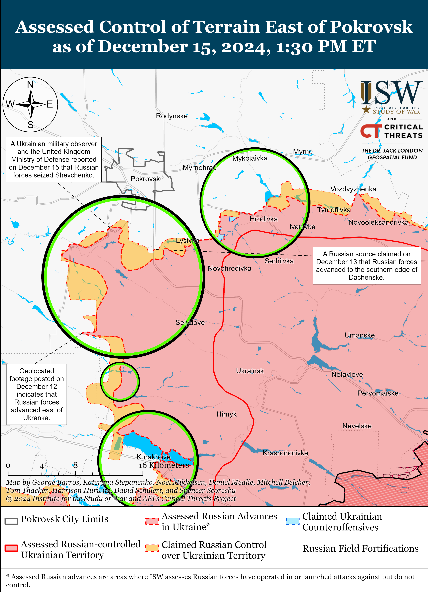
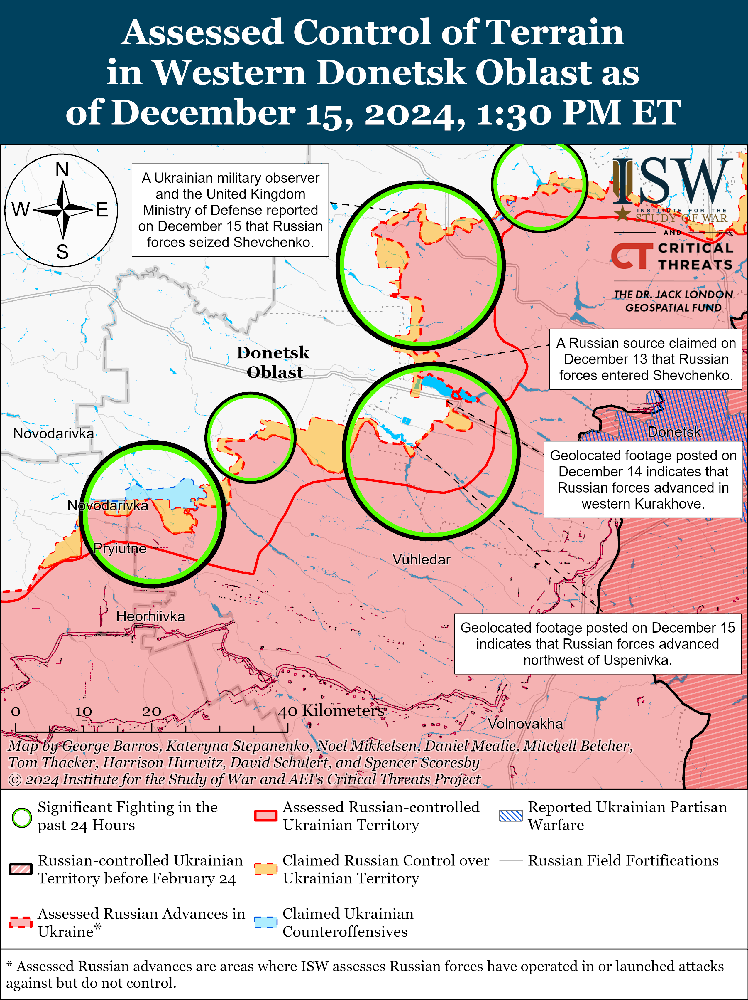
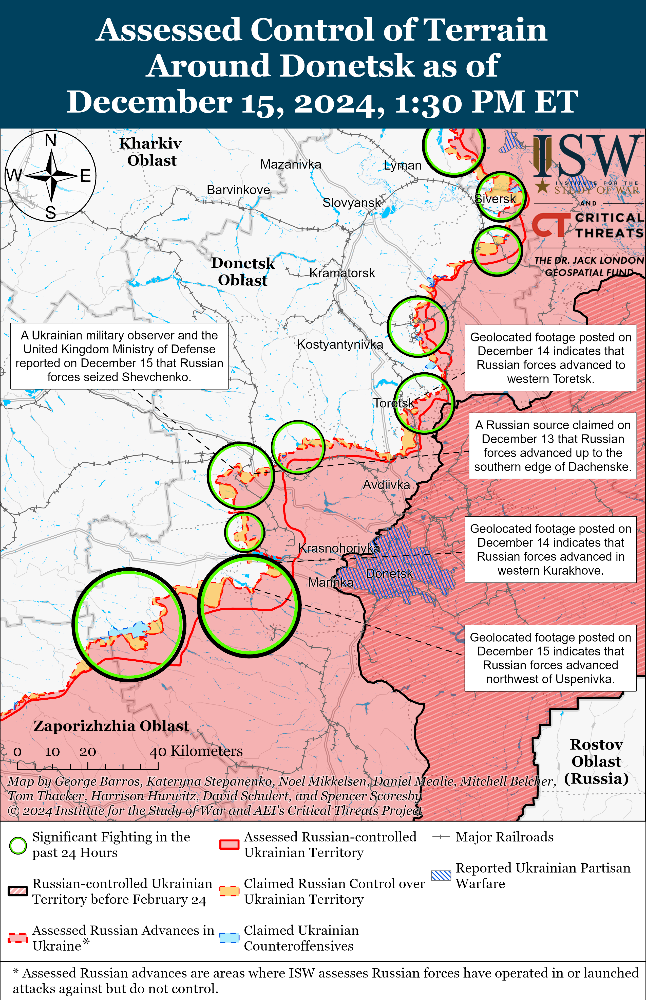
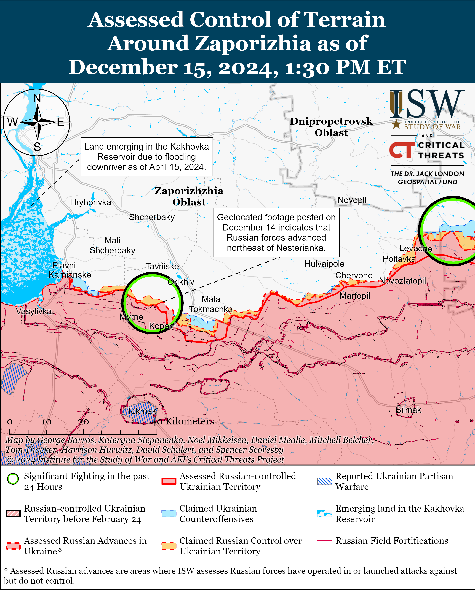
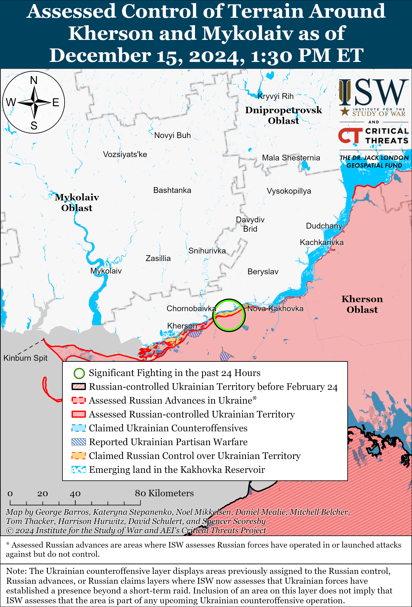

# Russian Offensive Campaign Assessment, December 15, 2024

**Russian Offensive Campaign Assessment, December 15, 2024**

**Grace Mappes, Davit Gasparyan, Nicole Wolkov, Christina Harward, Nate Trotter, William Runkel, Brian Carter, and Frederick W. Kagan**

**December 15, 2024 4:45pm ET**

**Click** [**here**](https://storymaps.arcgis.com/stories/36a7f6a6f5a9448496de641cf64bd375) **to see ISW’s interactive map of the Russian invasion of Ukraine. This map is updated daily alongside the static maps present in this report.**

**Click** [**here**](https://storymaps.arcgis.com/stories/83a2f24901c941d581c0c523ecd2619b)**to see ISW’s interactive map of Ukraine’s offensive in Kursk Oblast.**

**Click** [**here**](https://understandingwar.maps.arcgis.com/apps/instant/3dviewer/index.html?appid=1602762dbcde419bb957dea358449580) **to see ISW’s 3D control of terrain topographic map of Ukraine. Use of a computer (not a mobile device) is strongly recommended for using this data-heavy tool.**

**Click** [**here**](https://storymaps.arcgis.com/stories/733fe90805894bfc8562d90b106aa895) **to access ISW’s archive of interactive time-lapse maps of the Russian invasion of Ukraine. These maps complement the static control-of-terrain map that ISW produces daily by showing a dynamic frontline. ISW will update this time-lapse map archive monthly.**

**Note: The data cut-off for this product was 11:30am ET on December 15. ISW will cover subsequent reports in the December 16 Russian Offensive Campaign Assessment.**

**Russian forces conducted a roughly battalion-sized mechanized assault in the Siversk direction following a recent reported command change of the Russian forces operating near Siversk.** Ukrainian military observer Yuriy Butusov reported on December 15 that Russian forces conducted a three-pronged mechanized assault with over 400 personnel, up to 30 armored vehicles, 13 buggies, and 60 motorcycles north, east, and south of Siversk on December 14.[1] Geolocated footage published on December 15 shows that Russian forces marginally advanced during a roughly company-sized mechanized assault north of Vesele (south of Siversk) — likely a component of the larger attack.[2] Butusov reported that Russian forces managed to wedge into four Ukrainian defensive positions and drop infantry but that Ukrainian drone and artillery fire as well as close combat ultimately repelled the assault.[3] Butusov stated that Russian forces aimed to wedge two to three kilometers into Ukrainian defenses, and a Russian milblogger claimed that Russian forces advanced two kilometers in depth from the direction of Zolotarvika (east of Siversk).[4] ISW is currently unable to confirm the extent of Russian advances in this assault, and additional footage of the Russian assault will likely emerge in the coming days. Ukrainian Luhansk Group of Forces Spokesperson Major Anastasiya Bobovnikova stated on December 14 that Russian forces fielded more than 100 pieces of equipment in a recent assault in the Siversk direction and noted that there were 55 combat engagements in this direction on December 13 — a significant increase in tempo in this area of the frontline.[5]   
   
 **The recent Siversk assault indicates that Russian forces appear to be learning to conduct more effective assaults but remain far from restoring maneuver to the battlefield**. This Russian assault was much larger and more coherent than most Russian assaults in the Siversk direction, and Butusov assessed that Russian forces carefully prepared this assault.[6] Butusov noted that Russian forces specifically coordinated interactions between assault units and communications, electronic warfare (EW), and drone operations – all elements of command and control (C2) with which the Russian military command has historically struggled to conduct effectively.[7] A more prepared Russian assault may be the result of the recent reported command changes in the area. Russian forces near Siversk have especially struggled to conduct effective assaults, as a failed Russian mechanized assault northeast of Siversk near Bilohorivka in early November 2024 and exaggerated claims of success in the area contributed to the Russian military command’s reported removal and arrest of several brigade commanders within the 3rd Combined Arms Army (CAA) (formerly 2nd Luhansk People’s Republic Army Corps [LNR AC]).[8] A Russian insider source who has previously correctly predicted Russian command changes claimed on December 13 that the Russian military command recently removed 3rd CAA Commander Major General Dmitry Ovcharov.[9] A Russian milblogger rejected this claim on December 15, instead claiming that Major General Alexei Kolesnikov was the most recent commander of the 3rd CAA and that Kolesnikov recently took up a new, unspecified position.[10]

**North Korean forces are reportedly facing expected struggles with high casualties and poor communication with Russian forces in Kursk Oblast, likely disrupting coordination between North Korean and Russian personnel and undermining Russian military operations.** Ukraine’s Main Military Intelligence Directorate (GUR) reported on December 14 that North Korean forces operating in Kursk Oblast recently fired at Chechen “Akhmat” Spetsnaz battalion vehicles and killed eight Chechen personnel in a friendly fire incident, likely due to the language barrier between the Russian and North Korean forces.[11] The GUR noted that the language barrier also hinders effective combat coordination between Russian and North Korean forces.[12] The GUR reported that a contingent consisting of Russian and North Korean servicemen in Kursk Oblast lost 200 personnel as of December 14 and that Ukrainian drones swarmed a North Korean position, which is consistent with recent reports of North Korean forces engaging in attritional infantry assaults.[13] The poor integration and ongoing communication problems between Russian and North Korean forces will likely continue to cause friction in Russian military operations in Kursk Oblast in the near term.

**Russia’s immediate plans for its military assets in Syria remain unclear as reports continue that Russia has secured agreements to keep its main military bases in western Syria while also withdrawing from its other bases in the country. *NOTE: A version of this text also appears in ISW-CTP’s December 15 Iran Update.*** Ukraine’s Main Military Intelligence Directorate (GUR) reported on December 15 that rumors are circulating among Russian troops that the Kremlin and unspecified Syrian actors agreed to allow Russia to maintain its military presence at the Port of Tartus and Hmeimim Air Base in Latakia with up to a total of 3,000 Russian military personnel.[14] The GUR also reported that Russian military personnel at the Port of Tartus and Hmeimim Air Base and on nearby ships “in the region” are having problems with drinking water and food supplies and are awaiting food deliveries from Russian military transport aircraft involved in Russia’s evacuation of military assets from Syria. Reports that Russian military personnel are awaiting additional food supplies suggest that the Kremlin may not plan or is unable to fully evacuate the basesin the immediatefuture. OSINT analyst MT Anderson reported on December 15 that satellite imagery captured on December 15 shows the *Admiral Golovko* Admiral Gorshkov-class frigate and possibly the *Admiral Grigorovich* Grigorovich-class frigate still in a holding pattern roughly 15 kilometers away from the Port of Tartus.[15] The satellite imagery does not include the other vessels in the Russian Mediterranean Sea Flotilla that have recently been offshore.[16]

The GUR also reported on December 15 that unspecified armed groups that fought against the Assad regime are accompanying Russian forces as they withdraw from “remote areas” of Syria, likely towards the western coast.[17] A Syrian anti-Assad regime media outlet claimed on December 15 that Russian forces withdrew from the Tiyas Air Base (west of Palmyra and in Homs Governorate) toward Hmeimim Air Base.[18] The GUR reported on December 14 that some Russian soldiers were waiting at the Tiyas Air Base while a Russian military commander attempted to negotiate security guarantees for the Russian soldiers from military contingents of other unspecified states.[19] Russia has also reportedly recently withdrawn from a series of bases in the Manbij and Kobani areas in northern Syria amid the ongoing Turkish-backed offensive against the Syrian Democratic Forces (SDF).[20] Russia will probably withdraw from its last sizeable base in northern Syria, Qamishli, because Turkey and the groups on the ground in Syria—including Hayat Tahrir al Sham (HTS) and the Syrian National Army (SNA)—do not appear to be prepared to allow Russia to remain there. Turkish Defense Minister Yasar Guler also offered on December 15 to ”support” Russia’s consolidation at Hmeimim and Tartus, suggesting Turkey will not support other Russian bases.[21]

A Russian insider source claimed on December 15 that Russian Foreign Intelligence Service (SVR) Director Sergei Naryshkin may have fallen out of favor with Russian President Vladimir Putin following the Assad regime’s collapse since Putin reportedly recently rescinded a decree to present Naryshkin with a state award.[22]

**Key Takeaways:**

- **Russian forces conducted a roughly battalion-sized mechanized assault in the Siversk direction following a recent reported command change of the Russian forces operating near Siversk.**
- **The recent Siversk assault indicates that Russian forces appear to be learning to conduct more effective assaults but remain far from restoring maneuver to the battlefield.**
- **North Korean forces are reportedly facing expected struggles with high casualties and poor communication with Russian forces in Kursk Oblast, likely disrupting coordination between North Korean and Russian personnel and undermining Russian military operations.**
- **Russia’s immediate plans for its military assets in Syria remain unclear as reports continue that Russia has secured agreements to keep its main military bases in western Syria while also withdrawing from its other bases in the country.**
- **Russian forces recently advanced near Siversk, Toretsk, Pokrovsk, and Vuhledar.**
- **Russian sources continue to complain about the Russian military’s insufficient training system and inept military instructors.**

[](https://understandingwar.org/map/assessed-control-of-terrain-in-ukraine-and-main-russian-maneuver-axes-as-of-december-15-2024-130-pm-et/)

***We do not report in detail on Russian war crimes because these activities are well-covered in Western media and do not directly affect the military operations we are assessing and forecasting. We will continue to evaluate and report on the effects of these criminal activities on the Ukrainian military and the Ukrainian population and specifically on combat in Ukrainian urban areas. We utterly condemn Russian violations of the laws of armed conflict and the Geneva Conventions and crimes against humanity even though we do not describe them in these reports.***   

- Ukrainian Operations in the Russian Federation
- Russian Main Effort – Eastern Ukraine (comprised of three subordinate main efforts)
- Russian Subordinate Main Effort #1 – Push Ukrainian forces back from the international border with Belgorod Oblast and approach to within tube artillery range of Kharkiv City
- Russian Subordinate Main Effort #2 – Capture the remainder of Luhansk Oblast and push westward into eastern Kharkiv Oblast and encircle northern Donetsk Oblast
- Russian Subordinate Main Effort #3 – Capture the entirety of Donetsk Oblast
- Russian Supporting Effort – Southern Axis
- Russian Air, Missile, and Drone Campaign
- Russian Mobilization and Force Generation Efforts
- Russian Technological Adaptations
- Activities in Russian-occupied areas
- Significant Activity in Belarus

**Ukrainian Operations in the Russian Federation**

Russian forces continued offensive operations in the main Ukrainian salient in Kursk Oblast on December 15 but did not make any confirmed advances. Russian milbloggers claimed that Russian forces advanced near Cherkasskoye Porechnoye (north of Sudzha) and from Plekhovo toward Kurilovka (both south of Sudzha), but ISW has not observed confirmation of these claims.[23] Elements of the Russian 1427th Motorized Rifle Regiment (formed during 2022 partial reserve call up) and the “Pyatnashka” International Volunteer Brigade are reportedly operating near Russkoye Porechnoye (north of Sudzha); and elements of the Russian 11th Airborne (VDV) Brigade and 810th Naval Infantry Brigade (Black Sea Fleet [BSF], Southern Military District [SMD]) are reportedly operating in Kursk Oblast.[24]

[](https://understandingwar.org/map/ukrainian-incursion-into-kursk-oblast-as-of-december-15-2024-130-pm-et/)

Ukraine’s Main Military Intelligence Directorate (GUR) reported on December 15 that an explosion on December 14 destroyed a railway track that supports Russian military logistics near the Sviyaga River near the Ulyanovsk Motor Plant in Ulyanovsk City.[25]

Chechen Republic Head Ramzan Kadyrov claimed on December 15 that Russian forces shot down two Ukrainian drones over Grozny, Republic of Chechnya and that a third Ukrainian drone fell on a Chechen “Akhmat-Grozny” Special Purposes Mobile Unit (OMON) base in Grozny.[26] Footage published on December 15 purportedly shows drones striking Grozny.[27]

**Russian Main Effort – Eastern Ukraine**

**Russian Subordinate Main Effort #1 – Kharkiv Oblast** **(Russian objective: Push Ukrainian forces back from the international border with Belgorod Oblast and approach to within tube artillery range of Kharkiv City)**

Russian forces conducted offensive operations north of Kharkiv City near Vysoka Yaruha and Lyptsi and northeast of Kharkiv City near Vovchansk and Tykhe on December 14 and 15 but did not advance.[28] A Russian milblogger claimed on December 15 that Ukrainian forces counterattacked near Hlyboke (north of Kharkiv City).[29]

[](https://understandingwar.org/map/assessed-control-of-terrain-around-kharkiv-as-of-december-15-2024-130-pm-et/)

**Russian Subordinate Main Effort #2 – Luhansk Oblast** **(Russian objective: Capture the remainder of Luhansk Oblast and push westward into eastern Kharkiv Oblast and northern Donetsk Oblast)**

Russian forces continued offensive operations along the Kupyansk-Svatove-Kreminna line on December 15 but did not make any confirmed advances. Russian milbloggers claimed on December 15 that Russian forces seized Dvorichna (north of Kupyansk); advanced south of Dvorichna along the western (right) bank of the Oskil River; advanced on the western bank of the Oskil River; and advanced north of Zelenyi Hai (west of Svatove).[30] ISW has not observed confirmation of these claims, however. A Russian milblogger claimed on December 15 that Russian forces withdrew from their bridgehead on the west bank of the Oskil River near Novomlynsk (north of Kupyansk) but maintain a bridgehead near Masyutivka (north of Kupyansk and southeast of Dvorichna).[31] Russian forces continued attacking southeast of Kupyansk near Zahryzove; west of Svatove near Lozova, Pershotravneve, Zelenyi Hai, Kopanky, and Nadiya; southwest of Svatove near Hrekivka, Novoserhiivka,  Tverdokhlibove, Druzhelyubivka, and Novoyehorivka; northwest of Kreminna near Makiivka and Terny on December 14 and 15.[32] A Ukrainian battalion commander operating in the Kupyansk direction stated on December 15 that Russian forces commit all their forces in the area into pushing Ukrainian forces from the eastern (left) bank of the Oskil River.[33] The battalion commander added that Russian forces are conducting high-intensity assaults that result in high casualties.[34]

[](https://understandingwar.org/map/assessed-control-of-terrain-around-luhansk-oblast-as-of-december-15-2024-130-pm-et/)

**Russian Subordinate Main Effort #3 – Donetsk Oblast** **(Russian objective: Capture the entirety of Donetsk Oblast, the claimed territory of Russia’s proxies in Donbas)**

*Please see topline text for updates on the Siversk direction.*

Russian forces continued offensive operations in Chasiv Yar itself and south of Chasiv Yar near Stupochky on December 14 and 15 but did not make any confirmed advances.[35] Elements of the Russian 98th Airborne (VDV) Division reportedly continue to operate in Chasiv Yar.[36]

[](https://understandingwar.org/map/assessed-control-of-terrain-near-chasiv-yar-as-of-december-15-2024-130-pm-et/)

Russian forces recently advanced in the Toretsk direction amid continued offensive operations in the area on December 15. Geolocated footage published on December 14 indicates that Russian forces recently advanced westward along Volodina Street in western Toretsk.[37] Russian forces continued assaults in Toretsk itself and west of Toretsk near Shcherbynivka on December 14 and 15.[38] A Kremlin-affiliated Russian milblogger claimed that Ukrainian forces are counterattacking near the waste heaps at the Tsentralna Mine in central Toretsk and that the waste heaps are contested ”gray zones.”[39] The milblogger also claimed that Russian forces are struggling to find shelter and to consolidate positions in the destroyed buildings within Toretsk. An officer in a Ukrainian brigade operating in the Toretsk direction reported that the casualty ratio between Ukrainian and Russian forces is at least one-to-fifteen and that Russian forces are relying on all-terrain vehicles (ATVs) and other light vehicles within Toretsk but are using heavy equipment on the outskirts of the settlement.[40] Ukrainian military observer Kostyantyn Mashovets stated that elements of the Russian 55th Motorized Rifle Brigade (41st Combined Arms Army [CAA], Central Military District [CMD]) are reportedly operating in Toretsk.[41]

[](https://understandingwar.org/map/assessed-control-of-terrain-around-toretsk-as-of-december-15-2024-130-pm-et/)

Russian forces recently advanced in the Pokrovsk direction amid continued offensive operations in the area on December 15. Geolocated footage published on December 15 indicates that Russian forces recently advanced east of Ukrainka (south of Pokrovsk and west of Selydove).[42] Mashovets and the United Kingdom Ministry of Defense (UK MoD) stated on December 15 that Russian forces seized Shevchenko (south of Pokrovsk).[43] A Kremlin-affiliated Russian milblogger claimed that the exact configuration of the frontline is unclear in Shevchenko, and another Russian source claimed that Russian forces pulled back to an area north of Shevchenko after Ukrainian forces broke through into the settlement.[44] The Russian MoD claimed on December 15 that Russian forces seized Pushkine (south of Pokrovsk and west of Selydove), but ISW assessed that Russian forces had seized the settlement as of December 13.[45] A Russian milblogger claimed that Russian forces advanced to the outskirts of Pishchane (southwest of Pokrovsk and northwest of Shevchenko), but ISW has not observed confirmation of this claim.[46] Russian forces conducted offensive operations east of Pokrovsk near Myrolyubivka and Promin; southeast of Pokrovsk near Lysivka and Sukhyi Yar; south of Pokrovsk near Dachenske, Zelene, Novyi Trud, Shevchenko, Novoolenivka, and Petrivka; and southwest of Pokrovsk near Pishchane, Novotroitske, and Ukrainka on December 14 and 15.[47] Russian sources claimed that Ukrainian forces counterattacked near Shevchenko.[48] Mashovets stated that elements of the Russian 433rd Motorized Rifle Regiment (27th Motorized Rifle Division, 2nd CAA, CMD), 228th Motorized Rifle Regiment, and 239th Tank Regiment (both of the 90th Tank Division, 41st CAA, CMD) are operating near Novotroitske; elements of the 428th Motorized Rifle Regiment and 6th Tank Regiment (90th Tank Division, 41st CAA, CMD) are operating near Zorya and Ukrainka (both south of Pokrovsk); elements of the 27th Motorized Rifle Division and 30th Motorized Rifle Brigade (both of the 2nd CAA, CMD) are operating near Lysivka and Dachenske; and elements of the 589th and 506th motorized rifle regiments (both of the 27th Motorized Rifle Division, 2nd CAA, CMD) are operating near Mykolaivka (southeast of Pokrovsk).[49] Drone operators of the “Maxim Krivonos” volunteer detachment, allegedly formed by former members of the Ukrainian Armed Forces who defected to fight for Russia, are reportedly operating in the Pokrovsk direction.[50]

[](https://understandingwar.org/map/assessed-control-of-terrain-east-of-pokrovsk-as-of-december-15-2024-130-pm-et/)

Russian forces continued offensive operations in the Kurakhove direction on December 15 but did not make any confirmed advances. A Russian milblogger claimed that Russian forces advanced up to Mechnykova Street in Kurakhove, but ISW has not observed confirmation of this claim.[51] Russian forces conducted offensive operations near Kurakhove itself and northwest of Kurakhove near Stari Terny, Sontsivka, and Zorya on December 14 and 15.[52] A Russian source claimed that Ukrainian forces unsuccessfully counterattacked with armored vehicles in Kurakhove.[53] The acting spokesperson of a Ukrainian brigade operating in the Kurakhove direction stated that Russian forces are attacking both during the day and at night and more frequently conduct infantry assaults than mechanized assaults in large columns.[54] The spokesperson of another Ukrainian brigade operating in the Kurakhove direction stated that the quantity of Russian assaults had decreased recently to two to three assaults per day during bad weather but that Russian forces immediately increased their assaults to seven to eight per day once the ground froze.[55] The spokesperson stated that Russian forces usually use three to seven vehicles in mechanized columns and place a tank first, followed by infantry fighting vehicles and then fewer armored personnel carriers. Mashovets stated that elements of the Russian 6th and 80th tank regiments and 428th Motorized Rifle Regiment (all of the 90th Tank Division, 41st CAA, CMD) are operating in the Kurakhove direction.[56] Elements of the 5th Motorized Rifle Brigade (51st CAA, formerly 1st Donetsk People’s Republic Army Corps [DNR AC]) are reportedly operating in Kurakhove.[57]

Russian forces recently advanced northeast of Vuhledar amid continued offensive operations in the Vuhledar direction on December 15. Geolocated footage published on December 14 shows that Russian forces recently advanced across fields northwest of Uspenivka (Vuhledar) and across the O0515 Kurakhove-Velyka Novosilka highway in the area.[58] The Russian Ministry of Defense (MoD) claimed that elements of the Russian Southern Group of Forces seized Veselyi Hai (north of Vuhledar), but ISW assessed that Russian forces seized the settlement as of December 13.[59] Russian sources claimed that Russian forces seized and are conducting clearing operations north of Vuhledar in Uspenivka and Hannivka.[60] A Russian milblogger claimed that Russian forces broke through the left bank of the Sukhyi Yaly River to Zelenivka (northwest of Vuhledar) and are roughly four kilometers from Kostyantynopil (northwest of Zelenivka).[61] ISW has not observed confirmation of this claim and currently assesses that Russian forces have advanced roughly 7.4 kilometers from Kostyantynopil. Russian forces continued ground attacks northeast of Vuhledar near Yelizavetivka; north of Vuhledar near Uspenivka, Hannivka, and Trudove; and northwest of Vuhledar near Kostyantynopolske , Sukhyi Yaly, Rozlyv, and Zelenivka on December 14 and 15.[62] A Russian milblogger claimed that Ukrainian forces also counterattacked near Kostyantynopolske.[63] Elements of the Russian 39th Motorized Rifle Brigade (68th AC, EMD) are reportedly operating near Vesely Hai, elements of the 3rd Battalion of the Russian 242nd Motorized Rifle Regiment (20th Motorized Rifle Division, 8th CAA, SMD) are reportedly clearing Hannivka, and elements of the Russian 14th Spetsnaz Brigade (Russian General Staff’s Main Directorate [GRU]) are reportedly operating in the south Donetsk direction.[64]

[](https://understandingwar.org/map/assessed-control-of-terrain-in-western-donetsk-oblast-as-of-december-15-2024-130-pm-et/)

Russian forces continued offensive operations near Velyka Novosilka on December 15 but did not make any confirmed advances. Russian milbloggers claimed that Russian forces crossed the Mokri Yaly River west of Blahodatne (south of Velyka Novosilka) and advanced south of Velyka Novosilka to within 1.5 kilometers from the O0510 Velyka Novosilka-Hulyaipole highway.[65] ISW has not observed confirmation of these claims and has only observed geolocated evidence that Russian forces south of Velyka Novosilka are roughly 3.5 kilometers from the highway. Russian milbloggers claimed that Russian naval infantry advanced in southern and central Novyi Komar (north of Velyka Novosilka) and that elements of the Russian 40th Naval Infantry Brigade (Pacific Fleet, Eastern Military District [EMD]) repelled a Ukrainian counterattack near the settlement.[66] Russian milbloggers claimed on December 14 that fighting had recently resumed in Novyi Komar after Russian forces had retreated from the settlement as of December 7.[67] Russian forces conducted offensive operations near Velyka Novosilka itself; northeast of Velyka Novosilka near Rozdolne; north of Velyka Novosilka near Novyi Komar; south of Velyka Novosilka near Blahodatne, Storozheve, Makarivka, and Neskuchne; southwest of Velyka Novosilka near Novodarivka and Novopil; and west of Velyka Novosilka near Novosilka on December 14 and 15.[68] A Russian milblogger claimed that Ukrainian forces are counterattacking near Novoocheretuvate (northwest of Velyka Novosilka) and Novyi Komar.[69] A Russian source claimed that Russian forces are placing tanks with metal plate protections and electronic warfare (EW) systems at the front of Russian mechanized columns and that the columns retreat after Ukrainian forces strike the leading vehicle.[70] Russian milbloggers claimed that Russian forces destroyed a crossing over the Mokri Yaly River near Novoochertuvate (northeast of Velyka Novosilka) with a FAB glide bomb.[71] ”Storm-V” likely convict elements of the Russian 218th Tank Regiment and drone operators of the 143rd Motorized Rifle Regiment (both of the 127th Motorized Rifle Division, 5th CAA, EMD) are reportedly operating in the Velyka Novosilka direction.[72]

[](https://understandingwar.org/map/assessed-control-of-terrain-around-donetsk-as-of-december-15-2024-130-pm-et/)

**Russian Supporting Effort – Southern Axis** **(Russian objective: Maintain frontline positions and secure rear areas against Ukrainian strikes)**

Russian and Ukrainian sources did not report fighting in western Zaporizhia Oblast on December 15. Ukrainian sources posted footage on December 15 of a burning Russian train carrying fuel for the Russian military near occupied Tokmak on December 14.[73] The Ukrainian sources reported that a Ukrainian sabotage and reconnaissance group planted explosives on a railway line to immobilize the train before Ukrainian forces destroyed the train with HIMARS.

[](https://understandingwar.org/map/assessed-control-of-terrain-around-zaporizhia-as-of-december-15-2024-130-pm-et/)

Russian forces continued limited ground attacks in the Dnipro direction in Kherson Oblast on December 14 and 15 but did not advance.[74] Ukraine’s Southern Operational Command reported that Ukrainian forces destroyed a Russian Tor air defense system and a Terek radar system in southern Ukraine on December 14.[75]

[](https://understandingwar.org/map/assessed-control-of-terrain-around-kherson-and-mykolaiv-as-of-december-15-2024-130-pm-et/)

**Russian Air, Missile, and Drone Campaign** **(Russian Objective: Target Ukrainian military and civilian infrastructure in the rear and on the frontline)**

Russian forces conducted drone and missile strikes against Ukraine overnight on December 14 to 15. The Ukrainian Air Force reported that Russian forces launched one S-300 ground-to-air missile and 108 Shahed and other drones at Ukraine from Kursk, Oryol, and Bryansk Oblasts and Millerovo, Rostov Oblast overnight.[76] The Ukrainian Air Force reported that Ukrainian air defenses downed 56 drones in Chernihiv, Sumy, Kyiv, Poltava, Cherkasy, Khmelnytskyi, Mykolaiv, Kharkiv, Donetsk, and Dnipropetrovsk oblasts; that Ukrainian countermeasures caused 49 drones to become “lost” and fail to reach their targets; and that three drones returned to Russian airspace. Mykolaiv Oblast Military Administration Head Vitaliy Kim stated that a Shahed strike damaged an infrastructure facility in Mykolaiv City.[77] Kharkiv Oblast authorities reported that Russian forces struck a sports complex in Kharkiv City with an Iskander-M ballistic missile.[78]

**Russian Mobilization and Force Generation Efforts** **(Russian objective: Expand combat power without conducting general mobilization)**

Russian sources continue to complain about the Russian military’s insufficient training system and inept military instructors. A Russian milblogger and former Storm-Z instructor claimed that the Russian military training system continues to rely upon military instructors who either have no direct combat experience or outdated military experience.[79] The milblogger claimed that Russian military instructors are not adapting their lessons to the changing conduct of war, but are instead only drawing from their “irrelevant” and “insufficient” combat experience. Another Russian milblogger similarly complained that Russian soldiers who had previously served in private military companies (PMCs) often struggle to adjust to the command culture of the regular Russian military, as the former PMC fighters believe they are superior to other soldiers and their commanding officers.[80] The milbloggers also claimed that most Russian junior officers only receive tactical military training and no leadership training.[81]

**Russian Technological Adaptations** **(Russian objective: Introduce technological innovations to optimize systems for use in Ukraine)**

*The War Zone* reported on December 10 that Russia has fitted a Su-57 fighter jet with a new flat thrust-vectoring engine nozzle.[82] *The War Zone* stated similar flat nozzles on F-22 fighter aircraft reduce radar signatures and provide infrared signature advantages. A Russian milblogger claimed on December 15 that Russia likely manufactured the new flat nozzles using 3D printers.[83]

**Activities in Russian-occupied areas** **(Russian objective: Consolidate administrative control of annexed areas; forcibly integrate Ukrainian citizens into Russian sociocultural, economic, military, and governance systems)**

*ISW is not publishing coverage of activities in Russian-occupied areas today.*

**Significant activity in Belarus** **(Russian efforts to increase its military presence in Belarus and further integrate Belarus into Russian-favorable frameworks)**

Nothing significant to report.

**Note: ISW does not receive any classified material from any source, uses only publicly available information, and draws extensively on Russian, Ukrainian, and Western reporting and social media as well as commercially available satellite imagery and other geospatial data as the basis for these reports. References to all sources used are provided in the endnotes of each update.**

[1] https://t.me/ButusovPlus/15832

[2] https://t.me/edelweiss10tg/1545; https://t.me/WarArchive\_ua/23549; https://x.com/blinzka/status/1868282245389377968; https://x.com/GirkinGirkin/status/1868248829721796670; https://x.com/GermanObserver1/status/1868292562408063173; https://x.com/GermanObserver1/status/1868297591546384826; https://armyinform dot com.ua/2024/12/15/visim-shturmiv-za-den-edelvejsy-vidbyly-rekordnu-kilkist-atak/

[3] https://t.me/ButusovPlus/15832

[4] https://t.me/voenkorKotenok/60737; https://t.me/ButusovPlus/15832

[5] https://suspilne dot media/902789-vijska-z-kndr-u-kurskij-oblasti-ta-zagibel-ukrainskogo-pilota-1026-den-vijni-onlajn/?anchor=live\_1734266922&utm\_source=copylink&utm\_medium=ps

[6] https://t.me/ButusovPlus/15832

[7] https://t.me/ButusovPlus/15832; https://understandingwar.org/backgrounder/russian-offensive-campaign-assessment-august-15-2024; https://understandingwar.org/backgrounder/russian-offensive-campaign-assessment-august-20-2024; https://understandingwar.org/backgrounder/russian-offensive-campaign-assessment-july-23-2024; https://understandingwar.org/backgrounder/russian-winter-spring-2024-offensive-operation-kharkiv-luhansk-axis; https://understandingwar.org/backgrounder/russian-offensive-campaign-assessment-november-24-2024

[8] https://isw.pub/UkrWar110724; https://isw.pub/UkrWar111624

[9] https://understandingwar.org/backgrounder/russian-offensive-campaign-assessment-december-13-2024; https://t.me/arbat/1948

[10] https://t.me/RVvoenkor/82659

[11] https://suspilne dot media/902741-soldati-kndr-pomilkovo-vbili-8-vijskovih-pidrozdilu-ahmat-u-kurskij-oblasti-gur-mo/; https://t.me/DIUkraine/5024

[12] https://suspilne dot media/902741-soldati-kndr-pomilkovo-vbili-8-vijskovih-pidrozdilu-ahmat-u-kurskij-oblasti-gur-mo/; https://t.me/DIUkraine/5024

[13] https://understandingwar.org/backgrounder/russian-offensive-campaign-assessment-december-14-2024; https://understandingwar.org/backgrounder/russian-offensive-campaign-assessment-december-13-2024;

[14] https://t.me/DIUkraine/5025 ; https://gur.gov dot ua/content/u-syrii-rosiiskym-viiskam-brakuie-pytnoi-vody-ta-prodovolstva.html

[15] https://x.com/MT\_Anderson/status/1868295196485865519

[16] https://isw.pub/UkrWar121024

[17] https://t.me/DIUkraine/5025 ; https://gur.gov dot ua/content/u-syrii-rosiiskym-viiskam-brakuie-pytnoi-vody-ta-prodovolstva.html

[18] https://x.com/ALBADIA24/status/1868321680831189235

[19] https://understandingwar.org/backgrounder/russian-offensive-campaign-assessment-december-14-2024; https://t.me/DIUkraine/5022

[20] https://www.washingtonpost.com/world/2019/10/15/video-appears-show-russian-soldiers-abandoned-us-base-syria/

[21] https://x.com/tcsavunma/status/1868243974588367331

[22] https://t.me/vchkogpu/53278

[23] https://t.me/RVvoenkor/82721 ; https://t.me/RVvoenkor/82725

[24] https://t.me/motopatriot/30494 ; https://t.me/DnevnikDesantnika/20982 ; https://t.me/NgP\_raZVedka/19961 ; https://t.me/NeoficialniyBeZsonoV/42233 ; https://t.me/rybar/66373

[25] https://t.me/DIUkraine/5028 ; https://x.com/blinzka/status/1868290168278626464

[26] https://t.me/RKadyrov\_95/5327

[27] https://x.com/GirkinGirkin/status/1868199444463878634 ; https://t.me/oko\_gora/13922 ; https://t.me/sotaproject/91280; https://t.me/astrapress/70295; https://t.me/ostorozhno\_novosti/32140

[28]https://www.facebook.com/GeneralStaff.ua/posts/pfbid0MWZHz49VYAiqqbvkRk7X6yVT4MLS4uzVELZu7WzeGesrQzX5gzzvzWkroqvvh79El ; https://www.facebook.com/GeneralStaff.ua/posts/pfbid09YCWgFuK8DnWxjawRbDenz6m4jpuXoXbZKHBqXyFCHUKjHWLmNpi3UDJGbUxsHWjl ; https://www.facebook.com/GeneralStaff.ua/posts/pfbid0jcuJsnFATPFttNqKGLy3Lrz8xKWX9i1YSJbK7jWtwo8orSDU49qyYVoifBnucjuql ; https://t.me/Sladkov\_plus/12046

[29] https://t.me/Sladkov\_plus/12046

[30] https://t.me/z\_arhiv/30082; https://t.me/RVvoenkor/82673; https://t.me/DnevnikDesantnika/20996; https://t.me/dva\_majors/60225; https://t.me/Sladkov\_plus/12046; https://t.me/z\_arhiv/30085

[31] https://t.me/DnevnikDesantnika/20996

[32] https://www.facebook.com/GeneralStaff.ua/posts/pfbid0MWZHz49VYAiqqbvkRk7X6yVT4MLS4uzVELZu7WzeGesrQzX5gzzvzWkroqvvh79El; https://www.facebook.com/GeneralStaff.ua/posts/pfbid09YCWgFuK8DnWxjawRbDenz6m4jpuXoXbZKHBqXyFCHUKjHWLmNpi3UDJGbUxsHWjl; https://www.facebook.com/GeneralStaff.ua/posts/pfbid0jcuJsnFATPFttNqKGLy3Lrz8xKWX9i1YSJbK7jWtwo8orSDU49qyYVoifBnucjuql

[33] https://armyinform dot com.ua/2024/12/15/atakuyut-v-rezhymi-kamikadze-rosiyany-tysnut-do-oskolu/

[34] https://armyinform dot com.ua/2024/12/15/atakuyut-v-rezhymi-kamikadze-rosiyany-tysnut-do-oskolu/

[35] https://www.facebook.com/GeneralStaff.ua/posts/pfbid0MWZHz49VYAiqqbvkRk7X6yVT4MLS4uzVELZu7WzeGesrQzX5gzzvzWkroqvvh79El;  https://www.facebook.com/GeneralStaff.ua/posts/pfbid09YCWgFuK8DnWxjawRbDenz6m4jpuXoXbZKHBqXyFCHUKjHWLmNpi3UDJGbUxsHWjl; https://www.facebook.com/GeneralStaff.ua/posts/pfbid0jcuJsnFATPFttNqKGLy3Lrz8xKWX9i1YSJbK7jWtwo8orSDU49qyYVoifBnucjuql

[36] https://t.me/creamy\_caprice/7827; https://t.me/rodnaya98vdd/59; https://t.me/DnevnikDesantnika/20982

[37] https://x.com/AudaxonX/status/1868121501343654240; https://t.me/voron1OO/103; https://t.me/creamy\_caprice/7824

[38] https://www.facebook.com/GeneralStaff.ua/posts/pfbid0MWZHz49VYAiqqbvkRk7X6yVT4MLS4uzVELZu7WzeGesrQzX5gzzvzWkroqvvh79El;  https://www.facebook.com/GeneralStaff.ua/posts/pfbid09YCWgFuK8DnWxjawRbDenz6m4jpuXoXbZKHBqXyFCHUKjHWLmNpi3UDJGbUxsHWjl; https://www.facebook.com/GeneralStaff.ua/posts/pfbid0jcuJsnFATPFttNqKGLy3Lrz8xKWX9i1YSJbK7jWtwo8orSDU49qyYVoifBnucjuql;  https://t.me/rybar/66377

[39] https://t.me/rybar/66377

[40] https://suspilne dot media/donbas/902591-u-torecku-spivvidnosenna-vtrat-1-do-15-oficer-12-brigad/

[41] https://t.me/zvizdecmanhustu/2408

[42] https://t.me/creamy\_caprice/7830; https://t.me/mapukrdailyupdate/560

[43] https://t.me/zvizdecmanhustu/2408; https://x.com/DefenceHQ/status/1868250014343901622

[44] https://t.me/rybar/66362; https://t.me/voenkorKotenok/60749

[45] https://understandingwar.org/backgrounder/russian-offensive-campaign-assessment-december-13-2024; https://t.me/mod\_russia/46851

[46] https://t.me/voenkorKotenok/60752

[47] https://www.facebook.com/GeneralStaff.ua/posts/pfbid0MWZHz49VYAiqqbvkRk7X6yVT4MLS4uzVELZu7WzeGesrQzX5gzzvzWkroqvvh79El; https://www.facebook.com/GeneralStaff.ua/posts/pfbid09YCWgFuK8DnWxjawRbDenz6m4jpuXoXbZKHBqXyFCHUKjHWLmNpi3UDJGbUxsHWjl ; https://www.facebook.com/GeneralStaff.ua/posts/pfbid0jcuJsnFATPFttNqKGLy3Lrz8xKWX9i1YSJbK7jWtwo8orSDU49qyYVoifBnucjuql; https://t.me/DnevnikDesantnika/20970 ; https://t.me/voenkorKotenok/60749

[48] https://t.me/voenkorKotenok/60749; https://t.me/voenkorKotenok/60752 ; https://t.me/RVvoenkor/82664

[49] https://t.me/zvizdecmanhustu/2408

[50] https://t.me/RVvoenkor/82695

[51] https://t.me/voenkorKotenok/60733

[52] https://t.me/motopatriot/30544; https://www.facebook.com/GeneralStaff.ua/posts/pfbid0MWZHz49VYAiqqbvkRk7X6yVT4MLS4uzVELZu7WzeGesrQzX5gzzvzWkroqvvh79El ; https://www.facebook.com/GeneralStaff.ua/posts/pfbid09YCWgFuK8DnWxjawRbDenz6m4jpuXoXbZKHBqXyFCHUKjHWLmNpi3UDJGbUxsHWjl; https://www.facebook.com/GeneralStaff.ua/posts/pfbid0jcuJsnFATPFttNqKGLy3Lrz8xKWX9i1YSJbK7jWtwo8orSDU49qyYVoifBnucjuql

[53] https://t.me/rybar/66361

[54] https://armyinform dot com.ua/2024/12/15/na-kurahivskomu-napryamku-vorog-perejshov-do-czilodobovyh-shturmiv/; https://youtu.be/EUIDF\_X\_E-k

[55] https://armyinform dot com.ua/2024/12/14/horosha-pogoda-shhob-pomerty-rosiyany-voliyut-gynuty-na-sonyachnomu-svitli/

[56] https://t.me/zvizdecmanhustu/2407

[57] https://t.me/rybar/66361; https://t.me/motopatriot/30545

[58] https://t.me/creamy\_caprice/7825; https://t.me/opforukraine/67

[59] https://t.me/mod\_russia/46851 ; https://t.me/sashakots/50727; https://understandingwar.org/backgrounder/russian-offensive-campaign-assessment-december-13-2024

[60] https://t.me/tass\_agency/291076; https://t.me/DnevnikDesantnika/20985; https://t.me/DnevnikDesantnika/20978; https://t.me/dva\_majors/60267

[61] https://t.me/voenkorKotenok/60751

[62] https://www.facebook.com/GeneralStaff.ua/posts/pfbid0MWZHz49VYAiqqbvkRk7X6yVT4MLS4uzVELZu7WzeGesrQzX5gzzvzWkroqvvh79El; https://www.facebook.com/GeneralStaff.ua/posts/pfbid09YCWgFuK8DnWxjawRbDenz6m4jpuXoXbZKHBqXyFCHUKjHWLmNpi3UDJGbUxsHWjl; https://www.facebook.com/GeneralStaff.ua/posts/pfbid0jcuJsnFATPFttNqKGLy3Lrz8xKWX9i1YSJbK7jWtwo8orSDU49qyYVoifBnucjuql; https://t.me/rybar/66361

[63] https://t.me/rybar/66361;

[64] https://t.me/RVvoenkor/82658; https://t.me/dva\_majors/60267; https://t.me/ZA\_FROHT/35833 ;  https://t.me/voin\_dv/12280

[65] https://t.me/DnevnikDesantnika/20994; https://t.me/voenkorKotenok/60735

[66] https://t.me/voenkorKotenok/60751; https://t.me/voin\_dv/12289

[67] https://understandingwar.org/backgrounder/russian-offensive-campaign-assessment-december-14-2024

[68] https://www.facebook.com/GeneralStaff.ua/posts/pfbid0MWZHz49VYAiqqbvkRk7X6yVT4MLS4uzVELZu7WzeGesrQzX5gzzvzWkroqvvh79El; https://www.facebook.com/GeneralStaff.ua/posts/pfbid09YCWgFuK8DnWxjawRbDenz6m4jpuXoXbZKHBqXyFCHUKjHWLmNpi3UDJGbUxsHWjl; https://www.facebook.com/GeneralStaff.ua/posts/pfbid0jcuJsnFATPFttNqKGLy3Lrz8xKWX9i1YSJbK7jWtwo8orSDU49qyYVoifBnucjuql; https://t.me/DnevnikDesantnika/21012; https://t.me/motopatriot/30544;   https://t.me/voenkorKotenok/60735

[69] https://t.me/voenkorKotenok/60735; https://t.me/voenkorKotenok/60751

[70] https://t.me/RVvoenkor/82719

[71] https://t.me/DnevnikDesantnika/21011; https://t.me/voin\_dv/12287

[72] https://t.me/voin\_dv/12292;  https://t.me/boris\_rozhin/147977

[73] https://t.me/zvizdecmanhustu/2410; https://t.me/zloyodessit/23254 ; https://t.me/ButusovPlus/15840; https://t.me/oko\_gora/13926; https://armyinform dot com.ua/2024/12/15/spochatku-vybuhivka-potim-himars-na-okupovanomu-zaporizhzhi-spalyly-czilyj-eshelon-z-palyvom/

[74] https://www.facebook.com/GeneralStaff.ua/posts/pfbid0MWZHz49VYAiqqbvkRk7X6yVT4MLS4uzVELZu7WzeGesrQzX5gzzvzWkroqvvh79El; https://www.facebook.com/GeneralStaff.ua/posts/pfbid09YCWgFuK8DnWxjawRbDenz6m4jpuXoXbZKHBqXyFCHUKjHWLmNpi3UDJGbUxsHWjl; https://www.facebook.com/GeneralStaff.ua/posts/pfbid0jcuJsnFATPFttNqKGLy3Lrz8xKWX9i1YSJbK7jWtwo8orSDU49qyYVoifBnucjuql

[75] https://t.me/SJTF\_Odes/11868

[76] https://t.me/kpszsu/24877

[77] https://t.me/mykolaivskaODA/12489

[78] https://t.me/synegubov/12462; https://suspilne dot media/kharkiv/902921-u-harkovi-prolunali-vibuhi-rosijski-vijskovi-zavdali-udaru-po-kiivskomu-rajonu/; https://www.facebook.com/permalink.php?story\_fbid=pfbid02jTqWdjhhy6knAswcduMvFkroVKp6cGTBec1b9PF7YxMNTS47PJknnifUtbHSJ5mEl&id=100002276907245&locale=uk\_UA

[79] https://t.me/philologist\_zov/1765

[80] https://t.me/glockmeister\_lj/3223

[81] https://t.me/philologist\_zov/1773  ; ttps://t.me/glockmeister\_lj/3223

[82] https://www.twz.com/air/su-57-felons-two-dimensional-thrust-vectoring-engine-nozzle-breaks-cover

[83] https://t.me/DnevnikDesantnika/20977
