# Russian Offensive Campaign Assessment, December 16, 2024

**Karolina Hird, Christina Harward, Grace Mappes, William Runkel, Davit Gasparyan, and Frederick W. Kagan**

**December 16, 2024 8:40PM ET**

**Click** [**here**](https://storymaps.arcgis.com/stories/36a7f6a6f5a9448496de641cf64bd375) **to see ISW’s interactive map of the Russian invasion of Ukraine. This map is updated daily alongside the static maps present in this report.**

**Click** [**here**](https://storymaps.arcgis.com/stories/83a2f24901c941d581c0c523ecd2619b)**to see ISW’s interactive map of Ukraine’s offensive in Kursk Oblast.**

**Click** [**here**](https://understandingwar.maps.arcgis.com/apps/instant/3dviewer/index.html?appid=1602762dbcde419bb957dea358449580) **to see ISW’s 3D control of terrain topographic map of Ukraine. Use of a computer (not a mobile device) is strongly recommended for using this data-heavy tool.**

**Click** [**here**](https://storymaps.arcgis.com/stories/733fe90805894bfc8562d90b106aa895) **to access ISW’s archive of interactive time-lapse maps of the Russian invasion of Ukraine. These maps complement the static control-of-terrain map that ISW produces daily by showing a dynamic frontline. ISW will update this time-lapse map archive monthly.**

**Note: The data cut-off for this product was 12:50 pm ET on December 16. ISW will cover subsequent reports in the December 17 Russian Offensive Campaign Assessment.**

**Russian President Vladimir Putin’s continued fixation on the Russian “Oreshnik” ballistic missile and Russia’s non-nuclear deterrents suggests that the Kremlin may be searching for off-ramps from its continued nuclear saber-rattling narrative.** Putin addressed the Russian Ministry of Defense (MoD) board on December 16 and discussed Russian military developments in 2024 and Russia’s military goals for 2025.[1] Putin stated that Russia is developing military capabilities and technologies alongside its nuclear triad and emphasized that the Oreshnik ballistic missile is Russia’s “latest powerful weapon,” of which Russia will soon serialize production. Putin also notably claimed that if Russia were to use the Oreshnik in a “complex manner” in tandem with other non-nuclear munitions, the resulting strike would be “comparable in power to the use of nuclear weapons.” Putin noted that the Oreshnik does not have a nuclear payload and therefore does not create nuclear contamination, emphasizing that the Oreshnik’s non-nuclear nature “is a very important element when deciding what means of armed struggle” Russia will employ. Putin has previously lauded the technical specifications of the Oreshnik ballistic missile, including by comparing it to a nuclear weapon or a meteorite in terms of the damage it can cause.[2]

Putin’s recent emphasis on the purported power of Oreshnik is notable and suggests that the Kremlin may seek an off-ramp from the intense nuclear saber-rattling it has employed thus far in the war. Putin’s December 16 MoD address, his statements at the Collective Security Treaty Organization’s (CSTO) Security Council in Astana, Kazakhstan, on November 28, and his speech to the MoD on November 22 all appear to be trying to establish the Oreshnik as the bastion of Russia’s non-nuclear deterrent.[3] Russia has repeatedly invoked the threat of nuclear retaliation in order to force Ukraine and the West into self-deterrence, but Ukrainian and Western actions have challenged Kremlin’s nuclear narrative every time the Kremlin has employed it, constantly undermining Russia’s self-defined thresholds for nuclear use.[4] ISW has previously assessed that there is nothing particularly new about the Oreshnik’s capabilities, so Putin is likely extolling its technical specifications in order to create fear and uncertainty about the damage the Oreshnik can inflict and to pressure Ukraine’s partners to push Ukraine to limit its strikes against Russia out of fear that he will actually conduct retaliation.[5] Putin likely introduced the Oreshnik as a new element in the Kremlin’s wider reflexive-control toolkit as the Kremlin increasingly comes to terms with the fact that Putin’s unwillingness to follow through on hints of nuclear threats is devaluing them such that he must find a rhetorical off-ramp in order to maintain its credibility in the international information space.

**Putin once again reiterated the false Russian narrative that Ukrainian President Volodymyr Zelensky is illegitimate—firmly establishing that the deposition of Ukraine’s legitimate, democratic government is one of the Kremlin’s prerequisites for a negotiated settlement to the war.** Putin falsely claimed on December 16 that the Ukrainian Constitution only provides for the extension of powers of the Ukrainian Verkhovna Rada (parliament) and does not extend the president’s power, even under martial law.[6] Ukraine’s constitution and domestic martial law legislation stipulate that presidential, parliamentary, and local elections cannot occur under martial law, and Ukraine has been under martial law since the start of Russia’s full-scale invasion in February 2022.[7] Zelensky was legally required to suspend Ukrainian elections in 2024 under these provisions and did so.[8] Kremlin officials have previously invoked this false narrative to claim that Zelensky is illegitimate and lacks power and to suggest that the Ukrainian Rada is the only legitimate actor with which Russia can negotiate.[9] ISW has previously assessed that Kremlin officials are using a gross misrepresentation of the Ukrainian Constitution and Ukrainian domestic law to further this claim, which is consistent with Russian decade-long efforts to rhetorically delegitimize Ukraine’s government and sovereignty.[10] Putin very likely resurrected this narrative—which has been largely dormant since early Summer 2024—in order to reiterate that the Kremlin views regime change in Kyiv as a necessary precondition to “negotiate” with Ukraine. ISW continues to assess that Russia has no interest in engaging in good-faith negotiations with Ukraine and will only sit down at the negotiating table if and when it feels it has secured maximalist concessions on Ukraine’s sovereignty, including by removing Ukraine’s legitimate government and cutting Ukrainian actors out of the conversation entirely.[11]

**Russian Defense Minister Belousov also used the December 16 Russian MoD board meeting to reiterate Putin’s previously stated territorial objectives in Ukraine as another Kremlin prerequisite to a negotiated settlement to the war.** Belousov reiterated that Russia can only ensure victory in its war in Ukraine by achieving the goals that Putin set out in his June 2024 speech to the Ministry of Foreign Affairs (MFA), wherein Putin stated that Ukrainian forces must “completely withdraw” from Ukrainian-controlled territory in Donetsk, Luhansk, Zaporizhia, and Kherson oblasts before Russia would agree to enter into negotiations.[12] Russian Security Council Deputy Chairperson Dmitry Medvedev similarly invoked Putin’s June 2024 speech on December 12, indicating that the Russian occupation of all four oblasts – including the territory that Russian forces do not currently occupy – remains the Kremlin’s current territorial objective and that the Kremlin is undertaking a concerted effort to publicly promote this position throughout various branches of Russian government.[13] Kremlin officials’ recent emphasis on Putin’s territorial demands, coupled with Putin’s continued claim that the current Ukrainian government is illegitimate, demonstrate that the Kremlin is demanding that other negotiating parties hand over sovereign Ukrainian territory, including some that Russia has been unable to seize militarily to Russia without Ukraine’s consent.

**Belousov also used his December 16 address to posture as an effective and innovative manager—sharply contrasting his leadership of the MoD with that of former Defense Minister and current Security Council Secretary Sergei Shoigu.** Belousov highlighted the Russian military’s recent investment in technologies, such as artificial intelligence (AI), robotics, and quantum computing, and noted that the MoD is following Putin’s directive to make the Russian Armed Forces more flexible and receptive to innovation.[14] Belousov claimed that the Russian logistics and supply system faced “practically no disruptions” in 2024 and that the Russian MoD “regularly” meets with Russian military correspondents, after which the MoD has relayed issues raised by such correspondents to relevant military command bodies.[15] **Belousov also notably acknowledged that Ukrainian strikes on the Russian rear have forced Russian military authorities to respond by taking “priority measures” to protect arsenals and fuel depots and reviewing how Russian forces organize and disperse storage and logistics bases.**[16] Several Russian milbloggers and insider sources praised Belousov’s speech and noted that it is reflective of a new era of Russian MoD leadership that aims to eliminate the bureaucratic barriers and inefficiency characteristic of Shoigu’s MoD.[17] Milbloggers also noted that Belousov does not cover up issues but is willing to discuss shortcomings within the Russian military, such as obliquely acknowledging that Ukrainian strikes on the Russian rear have driven Russian command to make difficult decisions—praise that contrasts with a common critique of Shoigu and the policies he encouraged while at the head of the MoD.[18] Shoigu long faced accusations of corruption, bureaucratic inertia, and organizational incompetence, and Belousov appears to be trying to set himself apart from that legacy.[19]

**Putin ordered the MoD to establish the Unmanned Systems Forces as part of continued efforts to centralize control over Russian irregular drone units.** Belousov stated that Putin issued the order to establish the Unmanned Systems Forces within the Russian military and that the MoD will complete its formation in the third quarter of 2025 — consistent with ISW’s recent assessment that this reorganization will take at least six to twelve months.[20] Belousov described the Unmanned Systems Forces as a combat arms branch (род войск; *rod voysk*), while Putin previously described the Unmanned Systems Forces as a separate branch (отдельный род; *otdelnyi rod*).[21] The organization of the Unmanned Systems Forces within the larger Russian military remains unclear given the differences between Putin’s and Belousov’s descriptions. ISW has previously reported on the Russian MoD’s efforts to largely centralize control over its informal and ad-hoc drone units to free up manpower for infantry assaults, and ISW continues to assess that this reorganization may impact the Russian tactical reconnaissance strike complex (the integration of electronic warfare [EW] and unmanned systems with ground-based fires and attack drones) and reduce the cohesion between assault, drone, and artillery elements.[22]

**Belousov’s statements confirm that the Russian military is recruiting just enough military personnel to replace its recent casualty rates, but intensified offensive operations have and will likely continue to strain the efficacy of Russia’s cryptomobilization efforts.** Belousov claimed that the Russian military has recruited over 427,000 volunteer servicemembers so far in 2024, a daily average of more than 1,200 people.[23] US Defense Secretary Lloyd Austin stated on October 31 that Russian forces are suffering roughly 1,200 casualties per day, and the UK Ministry of Defense (MoD) recently observed that Russian forces suffered record-high casualty rates in November 2024 with an average 1,523 casualties per day – notably higher than Belousov’s claimed 1,200 recruits per day.[24] Russian opposition outlet *Vazhnye Istorii* reported on December 16 that data from federal budget expenditures on one-time payments to those who sign military service contracts with the Russian MoD indicate that between 215,700 and 249,000 people signed contracts in the first three quarters of 2024.[25] *Vazhnye Istorii* noted that the Russian government has not published data from the fourth quarter of 2024 yet but that at least 178,000 people would have had to have signed contracts between October 2024 and mid-December 2024 in order to reach Belousov’s 427,000 figure. ISW cannot independently verify Russia’s recruitment rates, and the Russian government may be delaying or even refusing to pay one-time payments to recruits such that the expenditure data does not reflect actual recruitment rates. ISW has recently observed indications that the Russian military has been struggling to recruit enough soldiers to replace its frontline losses.[26] Continued intensified offensive operations in Ukraine, particularly in western Donetsk Oblast, have put an unsustainable strain on Russia’s force generation apparatus and economy. Russian authorities will likely have to balance mounting personnel losses and the growing pressure to enact a deeply unpopular partial involuntary reserve callup.

**Russia continues to negotiate with the interim Syrian government to maintain its military presence at the Hmeimim Air Base and Port of Tartus in Syria, but Chechen Republic Head Ramzan Kadyrov’s recent appeals to Hayat Tahrir al Sham (HTS) suggest that talks may have hit a snag.** Kremlin Spokesperson Dmitry Peskov stated on December 16 that there are “no final decisions” about Russia’s military bases in Syria and that Moscow is in contact with “representatives of the forces that currently control the situation” in Syria — likely referring to HTS.[27] Kadyrov claimed on December 15 in a post in both English and Arabic that Russian President Vladimir Putin has “always treated the Syrian people with respect and compassion” and that Russia considers it a duty to stand by Russia’s “brotherly people” in Syria.[28] Kadyrov emphasized Russia’s efforts to restore mosques in Syria and provide humanitarian aid to the country. Kadyrov also applauded the interim Syrian government on December 16 for its efforts to bring stability and peace to the country.”[29] Kadyrov claimed that it will be difficult to achieve stability “without the help of partners,” however, and highlighted Russia’s “strength and means” that can help prevent a humanitarian crisis from developing in the country. Kadyrov called on Russia to remove HTS from Russia’s list of terrorist organizations and create a Russian-HTS contact group, which should also involve Syrians who have been living in Chechnya. Kadyrov has previously used his position as a leader of the Russian Muslim community to reach out to the Arab world.[30] The relatively late timing of Kadyrov’s overtures to HTS — one week after the fall of the Assad regime and days into reported Russian-HTS talks — and his overt emphasis on how the interim Syrian government can benefit from cooperation with Russia suggest that Russian-HTS talks may have hit obstacles and that the Kremlin is trying to use alternative channels to appeal to HTS.

[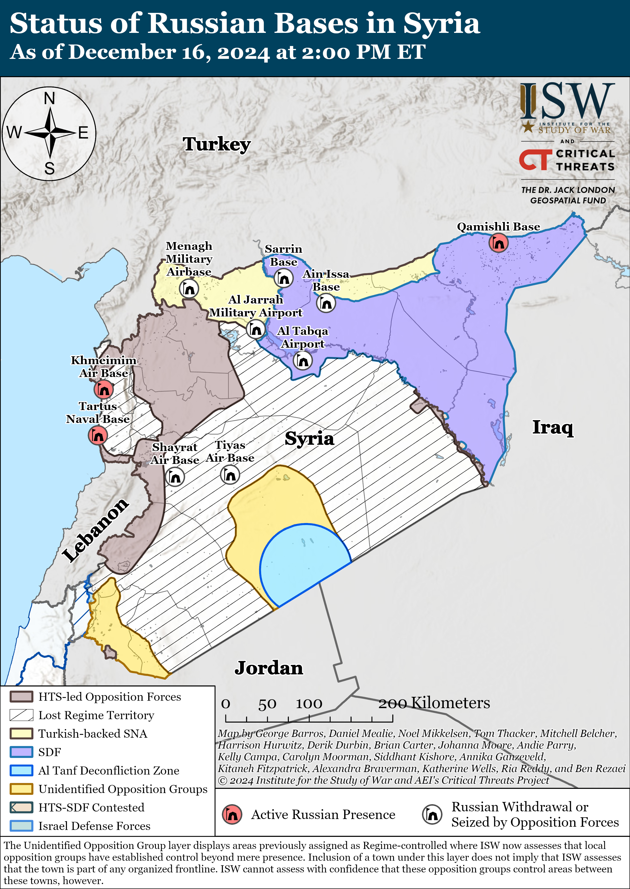](https://understandingwar.org/map/status-of-russian-bases-in-syria-as-of-december-16-2024-at-200-pm-et/)

**Russia continues to withdraw elements of its force grouping in Syria to the western coast amid limited reports that Moscow plans to fully withdraw within one month.** Ukraine’s Foreign Intelligence Service (SZRU) stated on December 15 that Russian forces are withdrawing from the Russian bases near Manbij, Kobani, and Qamishli and that Russian negotiations with HTS are not covering these other bases.***[31]***Ukraine’s Main Military Intelligence Directorate (GUR) stated on December 16 that Russian military transport aircraft, including three Il-76MD and two An-124 transport aircraft, are flying from Syria to Chkalovsk, Nizhny Novgorod Oblast and Makhachkla, Republic of Dagestan as Russian forces in Syria continue to withdraw westward to Hmeimim and Tartus.[32] *CNN* reported on December 16 that two US officials and one Western official familiar with intelligence on the matter stated that Russia has been withdrawing a large amount of military equipment and soldiers from Syria but that it is not clear if the withdrawal is intended to be permanent.[33] The two US officials reportedly stated that Russia has started to move naval assets from Syria to Libya, with another defense official stating that Russia is increasing pressure on Libyan warlord Khalifa Haftar in order to secure Russia’s use of a port in Benghazi. The *Financial Times* reported on December 15 that Kamal Lababidi, a member of the political bureau of HTS who has been involved in the HTS-led Syrian Salvation Government, stated that Russia, in coordination with HTS, recently evacuated at least 400 soldiers from Qudsayya near Damascus to Hmeimim, from where the Russian personnel flew back to Russia.[34] Lababidi reportedly stated that Russia is withdrawing forces to Hmeimim from elsewhere in Syria but is not currently evacuating Hmeimim.

UK-based, Qatari-owned news outlet *Al Araby al Jadeed* reported on December 16 that sources “close to the [HTS-led] military operations department” in Syria stated that Russia will withdraw all its military forces from Syria within one month.[35] The SZRU reported on December 15 that Russia is “urgently” transferring large landing ships from the Baltic and North seas to Syria for evacuations and that Russia is also chartering ships flagged in unspecified countries to load equipment from the Port of Tartus.[36] The GUR stated on December 12 that Russia was moving two landing ships from its Northern Fleet to Tartus and that the ships were in the Norwegian Sea at the time.[37] It will likely be weeks before the landing ships reach the Mediterranean Sea and the Port of Tartus, but Russia may be able to evacuate limited military assets with other chartered ships. OSINT analyst MT Anderson reported that satellite imagery captured on December 16 shows that the Russian vessels that recently left the Port of Tartus, including some that were in a holding pattern off the coast as of December 15, have yet to return.[38]

**Key Takeaways:**

- **Russian President Vladimir Putin’s continued fixation on the Russian “Oreshnik” ballistic missile and Russia’s non-nuclear deterrents suggests that the Kremlin may be searching for off-ramps from its continued nuclear saber-rattling narrative.**
- **Putin once again reiterated the false Russian narrative that Ukrainian President Volodymyr Zelensky is illegitimate—firmly establishing that the deposition of Ukraine’s legitimate, democratic government is one of the Kremlin’s prerequisites for a negotiated settlement to the war.**
- **Russian Defense Minister Belousov also used the December 16 Russian MoD board meeting to reiterate Putin’s previously stated territorial objectives in Ukraine as another Kremlin prerequisite to a negotiated settlement to the war.**
- **Belousov also used his December 16 address to posture as an effective and innovative manager—sharply contrasting his leadership of the MoD with that of former Defense Minister and current Security Council Secretary Sergei Shoigu.**
- **Putin ordered the MoD to establish the Unmanned Systems Forces as part of continued efforts to centralize control over Russian irregular drone units.**
- **Belousov’s statements confirm that the Russian military is recruiting just enough military personnel to replace its recent casualty rates, but intensified offensive operations have and will likely continue to strain the efficacy of Russia’s cryptomobilization efforts.**
- **Russia continues to negotiate with the interim Syrian government to maintain its military presence at the Hmeimim Air Base and Port of Tartus in Syria, but Chechen Republic Head Ramzan Kadyrov’s recent appeals to Hayat Tahrir al Sham (HTS) suggest that talks may have hit a snag.**
- **Russia continues to withdraw elements of its force grouping in Syria to the western coast amid limited reports that Moscow plans to fully withdraw within one month.**
- **Ukrainian forces recently regained lost positions near Pokrovsk, and Russian forces recently advanced near Chasiv Yar, Kurakhove, and Velyka Novosilka and in Kursk Oblast.**
- **The Russian government appointed Russian Defense Minister Andrei Belousov as the Chairperson of the Supervisory Board of the Russian Ministry of Defense’s (MoD) Military Construction Company, likely as part of ongoing anti-corruption efforts within the Russian MoD.**

***We do not report in detail on Russian war crimes because these activities are well-covered in Western media and do not directly affect the military operations we are assessing and forecasting. We will continue to evaluate and report on the effects of these criminal activities on the Ukrainian military and the Ukrainian population and specifically on combat in Ukrainian urban areas. We utterly condemn Russian violations of the laws of armed conflict and the Geneva Conventions and crimes against humanity even though we do not describe them in these reports.***

- Ukrainian Operations in the Russian Federation
- Russian Main Effort – Eastern Ukraine (comprised of three subordinate main efforts)
- Russian Subordinate Main Effort #1 – Push Ukrainian forces back from the international border with Belgorod Oblast and approach to within tube artillery range of Kharkiv City
- Russian Subordinate Main Effort #2 – Capture the remainder of Luhansk Oblast and push westward into eastern Kharkiv Oblast and encircle northern Donetsk Oblast
- Russian Subordinate Main Effort #3 – Capture the entirety of Donetsk Oblast
- Russian Supporting Effort – Southern Axis
- Russian Air, Missile, and Drone Campaign
- Russian Mobilization and Force Generation Efforts
- Russian Technological Adaptations
- Activities in Russian-occupied areas
- Significant Activity in Belarus

**Ukrainian Operations in the Russian Federation**

Russian forces recently advanced in the main Ukrainian salient in Kursk Oblast amid continued fighting in the area on December 16. Geolocated footage published on December 15 indicates that Russian forces recently advanced in fields southwest of Nechaev (northeast of Sudzha), and Russian forces have likely seized Nechaev and Nizhnyaya Parovaya (immediately east of Nechaev).[39] Russian milbloggers claimed that Russian forces also advanced near Guyevo (south of Sudzha) and 1.5 kilometers in depth north of Russkoye Porechnoye (southwest of Nechaev), but ISW has not observed confirmation of these claims.[40] Russian forces also continued offensive operations east of Kremyanoye (east of Korenevo), south of Novoivanovka (southeast of Korenevo), northwest of Plekhovo (south of Sudzha) towards Kurilovka, and near Cherkasskaya Konopelka (southeast of Sudzha).[41] A Russian milblogger claimed on December 15 that Ukrainian forces conducted a mechanized counterattack near Novoivanovka.[42] Elements of the Russian 56th Airborne (VDV) Regiment (7th VDV Division) reportedly participated in the seizure of Novoivanovka, and elements of the Russian 810th Naval Infantry Brigade (Black Sea Fleet [BSF], Southern Military District [SMD]) reportedly continue to operate in Kursk Oblast.[43]

[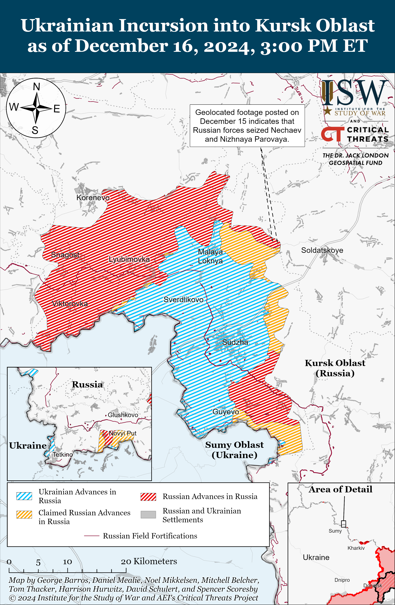](https://understandingwar.org/map/ukrainian-incursion-into-kursk-oblast-as-of-december-16-2024-300-pm-et/)

North Korean forces reportedly continue to sustain high casualties during combat operations in Kursk Oblast. Ukrainian Center for Disinformation Head Andriy Kovalenko stated on December 16 that Russian forces send North Korean forces into battle without armored vehicle support and are sending North Korean infantry on multi-pronged attritional assaults along narrow fronts.[44] Kovalenko stated that Russia is trying to prevent news of North Korean failures and high casualty rates from spreading and is instead promoting narratives about North Korean battlefield successes. Ukraine’s Main Military Intelligence Directorate (GUR) reported on December 16 that North Korean forces sustained at least 30 casualties during assaults near Plekhovo, Vorobzha (southeast of Sudzha), and Martynovka (northeast of Sudzha) on December 14 and 15 and that at least three North Korean personnel went missing near Kurilovka.[45] The GUR noted that elements of the North Korean 94th Special Forces Brigade, which the GUR previously identified as subordinated to Russian naval infantry and VDV forces, are replenishing North Korean losses.[46] A Russian milblogger continued praising North Korean forces on December 16 for their alleged speed in combat operations and “savagery” for refusing to take prisoners.[47]

**Russian Main Effort – Eastern Ukraine**

**Russian Subordinate Main Effort #1 – Kharkiv Oblast (Russian objective: Push Ukrainian forces back from the international border with Belgorod Oblast and approach to within tube artillery range of Kharkiv City)**

Russian forces conducted offensive operations north of Kharkiv City near Vysoka Yaruha and northeast of Kharkiv City near Vovchansk and Tykhe on December 15 and 16 but did not make any confirmed advances.[48]

[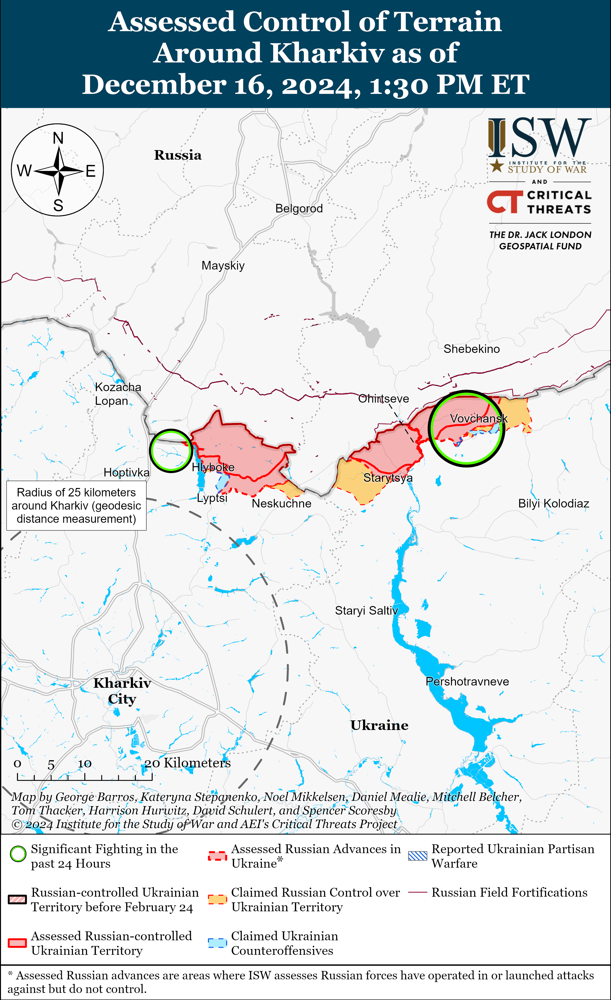](https://understandingwar.org/map/assessed-control-of-terrain-around-kharkiv-as-of-december-16-2024-130-pm-et/)

**Russian Subordinate Main Effort #2 – Luhansk Oblast (Russian objective: Capture the remainder of Luhansk Oblast and push westward into eastern Kharkiv Oblast and northern Donetsk Oblast)**

Russian forces continued offensive operations along the Kupyansk-Svatove-Kreminna line on December 16 but did not make any confirmed advances. Ukrainian military observer Kostyantyn Mashovets stated on December 16 that Ukrainian forces have pushed Russian forces off the west bank of the Oskil River north of Dvorichna (north of Kupyansk) but that Russian forces significantly expanded their tactical bridgehead along the river south of the settlement.[49] A Ukrainian brigade operating in the Borova direction (south of Kupyansk) posted footage on December 16 showing Ukrainian forces repelling a reinforced platoon-size Russian mechanized assault, destroying at least four tanks.[50] Russian forces continued attacking southeast of Kupyansk near Zahryzove and Lozova; west of Svatove near Nadiya; southwest of Svatove near Hrekivka, Tverdokhlibove, and Novoyehorivka; and northwest of Kreminna near Terny on December 15 and 16.[51] Elements of the Russian 16th Spetsnaz Brigade (Russian General Staff’s Main Directorate [GRU]) are reportedly operating in the Serebryanske forest area (southwest of Kreminna).[52]

[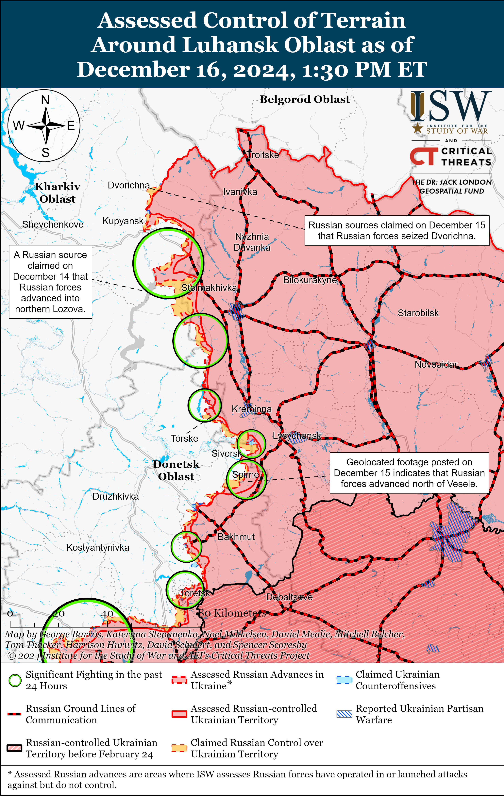](https://understandingwar.org/map/assessed-control-of-terrain-around-luhansk-oblast-as-of-december-16-2024-130-pm-et/)

**Russian Subordinate Main Effort #3 – Donetsk Oblast (Russian objective: Capture the entirety of Donetsk Oblast, the claimed territory of Russia’s proxies in Donbas)**

Russian forces conducted offensive operations northeast of Siversk near Bilohorivka, east of Siversk near Verkhnokamyanske, and southeast of Siversk near Ivano-Darivka and Vyimka on December 15 and 16 and did not make any confirmed advances.[53]

[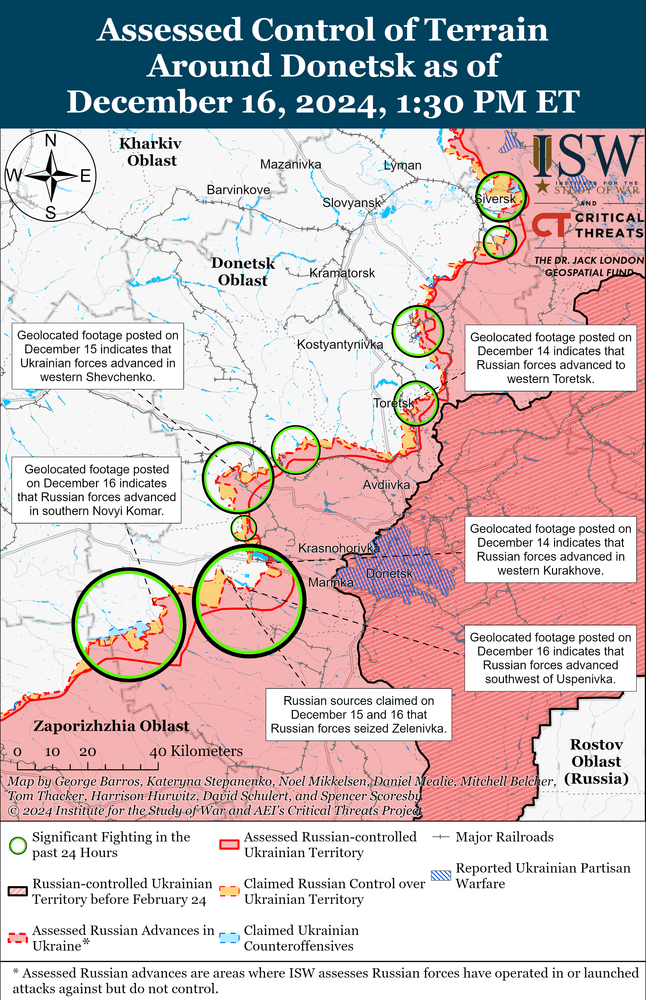](https://understandingwar.org/map/assessed-control-of-terrain-around-donetsk-as-of-december-16-2024-130-pm-et/)

Ukrainian sources continued to publish footage of a recent large, multi-pronged Russian mechanized assault near Siversk. Geolocated footage indicates that Russian forces did not advance during a roughly platoon-sized Russian mechanized assault southeast of Vyimka (southeast of Siversk) on December 14 that was likely part of the larger battalion-sized mechanized assault north, east, and south of Siversk.[54] The Ukrainian Luhansk Group of Forces reported on December 16 that elements of three Ukrainian brigades destroyed 15 Russian tanks and armored vehicles and 40 motorcycles and injured and killed up to 400 Russian personnel during a large assault on December 14.[55] Additional footage of the assault will likely continue to emerge in the coming days.

The Russian military command reportedly continues to inappropriately commit specialists to fight as infantry despite recent command changes. A Russian milblogger claimed on December 16 that Lieutenant Nikita Korelev (callsign “Krechet”), the commander of a communications platoon in the 123rd Mechanized Brigade (3rd Combined Arms Army [CAA], formerly 2nd Luhansk People’s Republic Army Corps [LNR AC]), was killed during the large-scale mechanized assault near Siversk on December 14. The milblogger compared Krechet’s death to those of two Russian drone operators of the 87th Separate Rifle Regiment of the 1st “Slavic” Motorized Rifle Brigade (51st CAA, formerly 1st Donetsk People’s Republic Army Corps [DNR AC]), Dmitry Lysakovsky (alias Goodwin) and Lieutenant Colonel Sergey Gritsai (alias Ernest), after their command committed both to infantry assaults in Donetsk Oblast in September 2024.[56] The milblogger complained that corruption in the military command enabled the Russian command to transfer “Krechet” to an infantry unit and asked how many specialists need to die for Russian commanders to maintain their reputations.[57] The milblogger called complaints about the lack of drone and artillery cover ironic due to the lack of specialists.[58] The milblogger stated that there is “much, much more” they wanted to write about this situation but “cannot write about it in a post,” indicating the milblogger may be under pressure to self-censor their complaints.[59] The Russian military command reportedly recently replaced the 3rd CAA’s commander; the 123rd Motorized Rifle Brigade’s commander; and the commanders of the 123rd Brigade’s 1st, 2nd, and 3rd motorized rifle battalions, and the reported continued usage of specialists in attritional infantry assaults suggests that improvements in the 3rd CAA’s conduct of combat operations under the new command are limited or that the command changes were for reasons unrelated to this issue.[60]

Russian forces continued offensive operations in the Chasiv Yar direction on December 16 but did not make any confirmed advances. Russian forces conducted offensive operations in Chasiv Yar itself and south of Chasiv Yar near Stupochky on December 15 and 16.[61] Russian sources claimed on December 15 that Russian forces marginally advanced in southern Chasiv Yar and advanced south of Chasiv Yar, but ISW has not observed confirmation of these claims.[62] Some Russian milbloggers claimed on December 15 that Russian forces seized the entirety of the Refractory Plant in central Chasiv Yar, while other Russian milbloggers claimed on December 16 that Russian forces are still trying to push Ukrainian forces out of part of the plant, with one milblogger accusing other Russian sources of ”lying” about the situation.[63] ISW has also not observed confirmation that Russian forces have seized most or all of the Refractory Plant.[64] A Ukrainian brigade operating in the Chasiv Yar direction reported on December 15 that Russian forces are conducting small infantry assaults rather than larger mechanized assaults and are trying to use the pipes of the Siverskyi Donets Donbas Canal to infiltrate Ukrainian defensive positions.[65] Elements of the Russian 7th Assault Brigade (Russian Volunteer Corps) and the “Shustry” detachment of Chechen “Akhmat” Spetsnaz are reportedly operating near Chasiv Yar, and elements of the 299th Airborne (VDV) Regiment (98th VDV Division) are reportedly operating in the Refractory Plant.[66]

[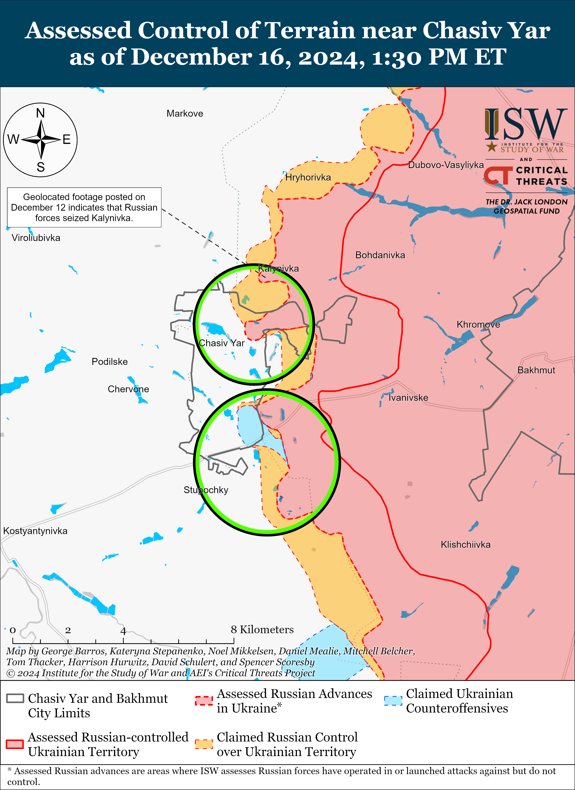](https://understandingwar.org/map/assessed-control-of-terrain-near-chasiv-yar-as-of-december-16-2024-130-pm-et/)

Russian forces recently advanced near Toretsk amid continued offensive operations in the area on December 16. Geolocated footage published on December 16 indicates that Russian forces recently marginally advanced in northern Nelipivka (south of Toretsk).[67] Russian milbloggers claimed that Russian forces advanced into western Toretsk and on the southern outskirts of the Tsentralna Mine waste heaps in central Toretsk.[68] ISW has not observed confirmation of these claims, however. The Ukrainian General Staff reported that Russian forces continued offensive operations near Toretsk and Shcherbynivka (west of Toretsk) on December 15.[69] Elements of the Russian 9th Motorized Rifle Brigade (51st CAA) are reportedly operating in the Toretsk direction.[70]

[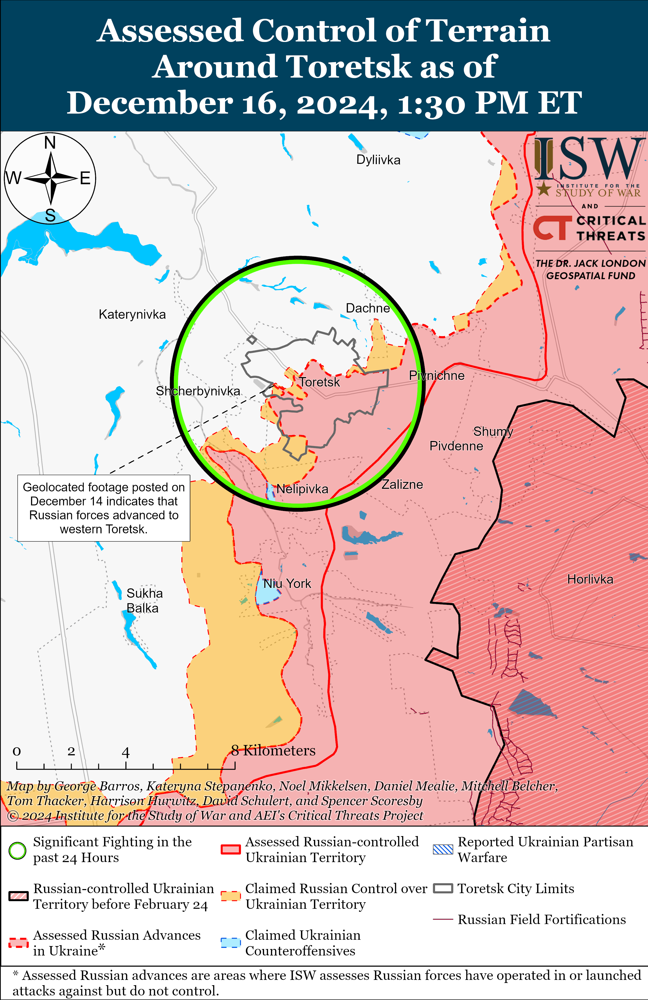](https://understandingwar.org/map/assessed-control-of-terrain-around-toretsk-as-of-december-16-2024-130-pm-et/)

Ukrainian forces recently regained lost positions in the Pokrovsk direction amid continued fighting in the area on December 16. Geolocated footage published on December 15 indicates that Ukrainian forces recently recaptured positions in western Shevchenko (southwest of Pokrovsk).[71] DNR Head Denis Pushilin claimed on December 16 that Russian forces recaptured Shevchenko, and a Russian milblogger claimed that Russian forces pushed Ukrainian forces from their new positions within Shevchenko before they could consolidate.[72] Other Russian milbloggers claimed on December 15 and 16 that Russian forces advanced east of Pokrovsk near Myrnohrad; south of Pokrovsk near Dachenske and Pushkine; and southwest of Pokrovsk near Novotroitske, Novoolenivka, and Ukrainka.[73] Russian milbloggers claimed that Russian forces advanced to within one kilometer of Pokrovsk.[74] ISW has not observed visual confirmation of these claims and has only observed geolocated evidence that Russian forces are roughly 2.5 kilometers from Pokrovsk’s southern boundary. Russian forces conducted offensive operations east of Pokrovsk near Myrolyubivka and Promin; southeast of Pokrovsk near Lysivka; south of Pokrovsk near Dachenske, and Zelene; and southwest of Pokrovsk near Novoolenivka, Pishchane, and Novotroitske on December 15 and 16.[75] Elements of the Russian 24th Spetsnaz Brigade (Main Intelligence Directorate of the Russian General Staff [GRU]) are reportedly operating in the Pokrovsk direction, and elements of the 1453rd Regiment (1st Slavic Motorized Rifle Brigade, 51st CAA ), 30th Motorized Rifle Brigade (2nd CAA, Central Military District [CMD]), and 15th Motorized Rifle Brigade (2nd CAA) are reportedly operating near Novotroitske.[76]

[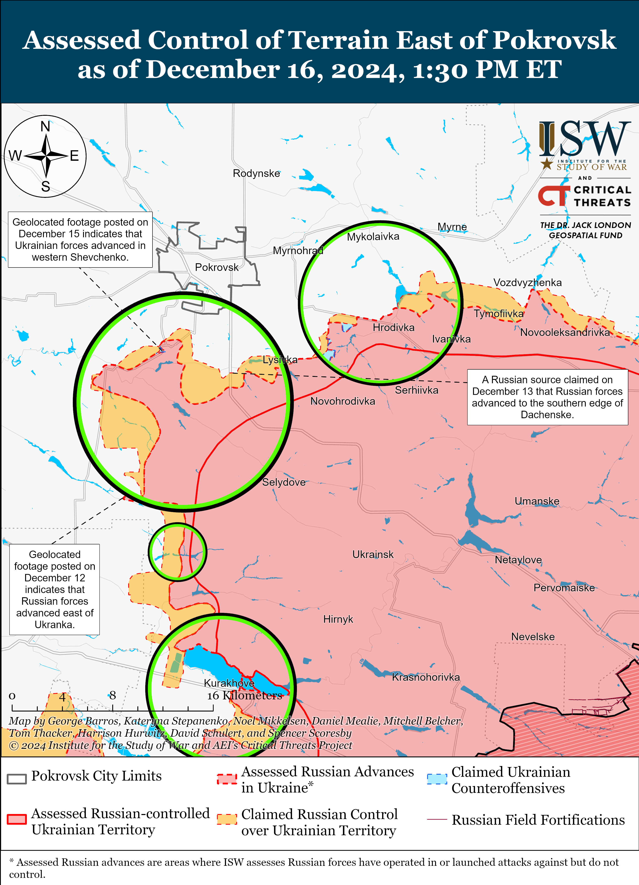](https://understandingwar.org/map/assessed-control-of-terrain-east-of-pokrovsk-as-of-december-16-2024-130-pm-et/)

Russian forces recently advanced northwest of Kurakhove amid continued offensive operations in the Kurakhove direction on December 16. Geolocated footage published on December 16 indicates that Russian forces recently advanced north of Zorya (northwest of Kurakhove) during a small, mechanized attack of an unknown echelon.[77] Russian milbloggers claimed that Russian forces advanced north of Dalne (south of Kurakhove) and reached the outskirts of Shevchenko from positions in Stari Terny (both northwest of Kurakhove), although ISW has not yet observed confirmation of either of these claims.[78] Several Russian sources claimed that Russian forces continued to advance within Kurakhove itself and occupied several high-rise buildings in the center of the town.[79] Pushilin claimed that Ukrainian forces occupy less than 20 percent of Kurakhove, but ISW assesses that Ukrainian forces still hold 27 percent of the town.[80] Ukraine’s Khortytsia Group of Forces warned on December 16 that Russian forces are disguising themselves as civilians in order to penetrate further into Kurakhove, which amounts to perfidy and constitutes a violation of the laws of war.[81] The Ukrainian General Staff reported that Russian forces conducted ground attacks near Kurakhove itself and northwest of Kurakhove near Stari Terny, Sontsivka, and Zorya on December 15 and 16.[82] Elements of the Russian 114th Motorized Rifle Brigade (51st CAA) are reportedly operating near Stari Terny, and elements of the 33rd and 255th motorized rifle regiments (both of the 20th Motorized Rifle Division, 8th CAA, Southern Military District [SMD] and the 238th Artillery Brigade (8th CAA, SMD) are reportedly operating in the Kurakhove direction.[83]

Russian forces recently advanced northwest of Vuhledar amid continued offensive operations in the Vuhledar direction on December 16. Geolocated footage published on December 16 indicates that Russian forces recently advanced west of Uspenivka (north of Vuhledar) during a platoon-sized mechanized assault.[84] Ukrainian and Russian sources reported that Russian forces advanced from positions near Sukhi Yaly (northwest of Vuhledar) and began fighting on the outskirts of Zelenivka (just northwest of Sukhi Yaly).[85] One Russian milblogger claimed that Russian forces seized Zelenivka, but ISW has not observed confirmation of this claim.[86] Several Russian sources claimed that Russian forces have blocked a contingent of Ukrainian troops within Hannivka (north of Vuhledar).[87] The Ukrainian General Staff reported that fighting continued north of Vuhledar near Uspenivka, Kostyantynopolske, and Trudove and northwest of Vuhledar near Sukhi Yaly and Zelenivka on December 15 and 16.[88] Elements of the Russian 3rd Motorized Rifle Battalion of the “69th Motorized Rifle Brigade” (likely in reference to the 69th Covering Brigade, 35th CAA, Eastern Military District [EMD]) are reportedly operating near Veselyi Hai (north of Vuhledar); drone operators of the “Nerve” group of the 36th Motorized Rifle Brigade (29th CAA, EMD) are reportedly operating near Sukhi Yaly; elements of the 1st Motorized Rifle Battalion of the 39th Motorized Rifle Brigade (68th AC, EMD) are reportedly operating near Trudove; other elements of the 68th AC are reportedly operating near Kostyantynopolske; elements of the 29th CAA are reportedly operating near Rozlyv (northwest of Vuhledar); elements of the 242nd Motorized Rifle Regiment (20th Motorized Rifle Division, 8th CAA, SMD) are reportedly operating near Hannivka; and elements of the 57th Motorized Rifle Regiment (20th Motorized Rifle Division, 8th CAA, SMD) are reportedly operating near Yelyzavetivka (northeast of Vuhledar).[89]

Russian forces recently advanced north of Velyka Novosilka amid continued fighting near the settlement on December 16. Geolocated footage published on December 16 indicates that Russian forces recently advanced westward over Kosmonavta Komarova Street in southern Novyi Komar (north of Velyka Novosilka).[90] A Russian milblogger claimed on December 16 that Russian forces also advanced west of Neskuchne (south of Velyka Novosilka).[91] ISW has not observed confirmation of this claim, however. Russian forces conducted offensive operations near Velyka Novosilka itself; north of Velyka Novosilka near Novyi Komar; south of Velyka Novosilka near Storozheve and Makarivka; and west of Velyka Novosilka near Novosilka on December 15 and 16.[92] A Russian milblogger claimed on December 15 that Russian forces repelled a series of Ukrainian counterattacks near Novyi Komar and that Russian forces have occupied half of the settlement.[93] Elements of the Russian 40th Naval Infantry Brigade (Pacific Fleet, EMD) are reportedly operating near Novyi Komar.[94]

[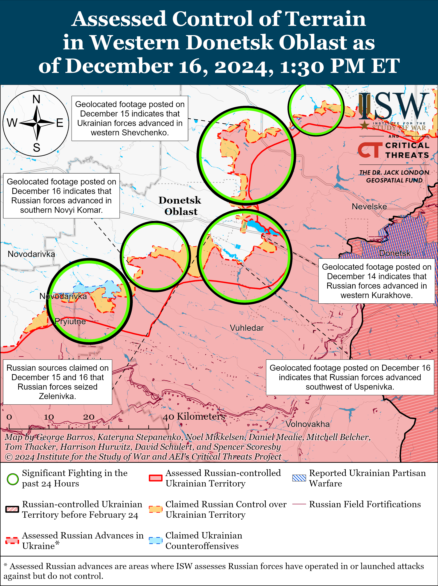](https://understandingwar.org/map/assessed-control-of-terrain-in-western-donetsk-oblast-as-of-december-16-2024-130-pm-et/)

**Russian Supporting Effort – Southern Axis (Russian objective: Maintain frontline positions and secure rear areas against Ukrainian strikes)**

Neither Russian nor Ukrainian sources reported fighting in western Zaporizhia Oblast on December 16. Russian milbloggers claimed on December 16 that Russian forces are intensifying combat operations in the Zaporizhia direction and are slowly advancing in the Orikhiv direction.[95]ISW has not yet observed a commensurate intensification in ground attacks in this direction, however. Ukrainian military observer Kostyantyn Mashovets stated on December 16 that Russian forces recently began transferring armored vehicles to the areas of responsibility of the Russian 58th Combined Arms Army (CAA, Southern Military District [SMD]) and the 35th Combined Arms Army (Eastern Military District [EMD]) in Zaporizhia Oblast.[96]

[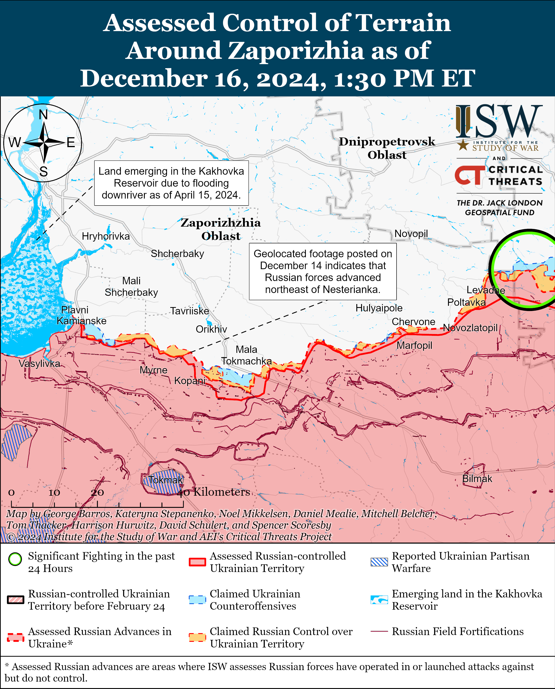](https://understandingwar.org/map/assessed-control-of-terrain-around-zaporizhzhia-as-of-december-16-2024-130-pm-et/)

Russian forces continued ground attacks in the Dnipro direction in east (left) bank Kherson Oblast on December 15 and 16, but there were no confirmed changes to the frontline.[97] A Russian milblogger claimed on December 16 that Russian drone operators are using “cargo quadcopters” to resupply Russian forces occupying islands in the Kherson River Delta area[98] Elements of the Russian 61st Naval Infantry Brigade (Leningrad Military District [LMD], formerly Northern Fleet) are reportedly operating in the Kherson direction.[99]

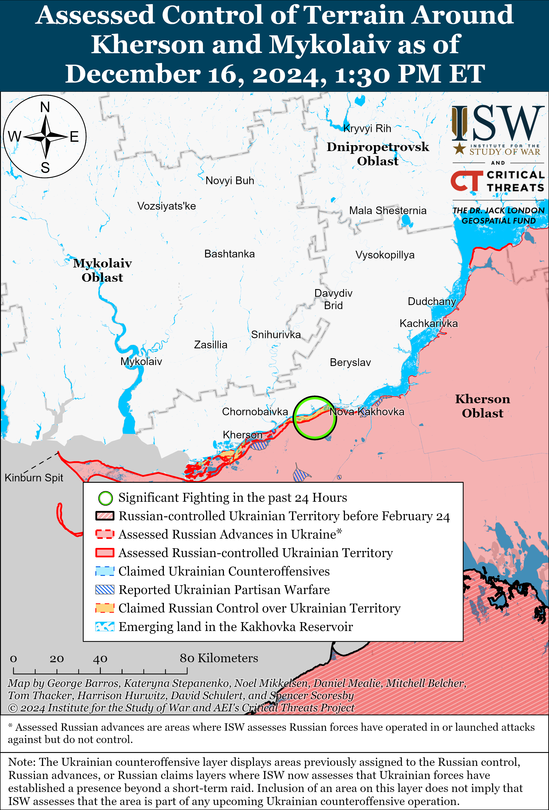

**Russian Air, Missile, and Drone Campaign (Russian Objective: Target Ukrainian military and civilian infrastructure in the rear and on the frontline)**

Russian forces conducted a mid-sized series of drone strikes against Ukraine overnight on December 15 to 16. The Ukrainian Air Force reported on December 16 that Russian forces launched 49 Shahed and other drones (likely referring to decoy drones) from Kursk and Oryol oblasts.[100] The Ukrainian Air Force reported that Ukrainian forces downed 27 drones over Chernihiv, Sumy, Cherkasy, Khmelnytskyi, Kharkiv, and Dnipropetrovsk oblasts; that Ukrainian countermeasures caused 19 drones to become “lost” and fail to reach their targets, likely due to Ukrainian electronic warfare (EW) interference; and that three drones remained in Ukrainian airspace as of 0830 local time on December 16.

**Russian Mobilization and Force Generation Efforts (Russian objective: Expand combat power without conducting general mobilization)**

The Russian government appointed Russian Defense Minister Andrei Belousov as the Chairperson of the Supervisory Board of the Russian Ministry of Defense’s (MoD) Military Construction Company, likely as part of ongoing anti-corruption efforts within the Russian MoD.[101] Belousov will replace former Russian Defense Minister and current Russian Security Council Secretary Sergei Shoigu and will serve a five-year term as chairperson. Russian state outlet *RBK* reported on December 16 that the Russian MoD filed 73 lawsuits against the company in August 2024 alone.[102] Russian authorities have recently detained Russian MoD officials, including those who held positions within the Military Construction Company, for abuse of office and fraud.[103] Belousov called on for the Russian MoD to complete various construction projects, including hospitals, during his speech to the Russian MoD Supervisory Board on December 16.[104]

Russian state defense conglomerate Rostec stated on December 16 that it is commissioning large facilities at the Kazan Aviation Plant to scale up production of Tu-214 airliners in 2025.[105] Rostec stated that it started a flight test program with new Russian components in November 2024.

**Russian Technological Adaptations (Russian objective: Introduce technological innovations to optimize systems for use in Ukraine)**

Nothing significant to report.

**Activities in Russian-occupied areas (Russian objective: Consolidate administrative control of annexed areas; forcibly integrate Ukrainian citizens into Russian sociocultural, economic, military, and governance systems)**

*ISW is not publishing coverage of activities in Russian-occupied areas today.*

**Significant activity in Belarus (Russian efforts to increase its military presence in Belarus and further integrate Belarus into Russian-favorable frameworks)**

Nothing significant to report.

**Note: ISW does not receive any classified material from any source, uses only publicly available information, and draws extensively on Russian, Ukrainian, and Western reporting and social media as well as commercially available satellite imagery and other geospatial data as the basis for these reports. References to all sources used are provided in the endnotes of each update.**

[1] http://kremlin dot ru/events/president/news/75887

[2] https://isw.pub/UkrWar112924

[3] https://isw.pub/UkrWar112224; https://isw.pub/UkrWar112924

[4] https://understandingwar.org/backgrounder/russian-offensive-campaign-assessment-november-21-2024; https://understandingwar.org/backgrounder/russian-offensive-campaign-assessment-november-19-2024; https://understandingwar.org/backgrounder/russian-offensive-campaign-assessment-november-18-2024; https://understandingwar.org/backgrounder/russian-offensive-campaign-assessment-september-27-2024; https://understandingwar.org/backgrounder/russian-offensive-campaign-assessment-august-4-2024; https://isw.pub/UkrWar120822; https://understandingwar.org/backgrounder/russian-offensive-campaign-assessment-december-7; https://isw.pub/UkrWar110622

[5] https://isw.pub/UkrWar112924; https://meduza dot io/en/feature/2024/12/05/introducing-the-oreshnik

[6] http://kremlin dot ru/events/president/news/75887

[7] https://rm.coe.int/constitution-of-ukraine/168071f58b; https://zakon.rada dot gov.ua/laws/show/389-19#n173

[8] https://foreignpolicy.com/2023/11/17/ukraine-elections-war-russia-zelensky/

[9] https://understandingwar.org/backgrounder/russian-offensive-campaign-assessment-may-28-2024; https://understandingwar.org/backgrounder/russian-offensive-campaign-assessment-may-26-2024; https://understandingwar.org/backgrounder/russian-offensive-campaign-assessment-may-24-2024; https://understandingwar.org/backgrounder/russian-offensive-campaign-assessment-june-7-2024

[10] https://understandingwar.org/backgrounder/russian-offensive-campaign-assessment-may-28-2024; https://understandingwar.org/backgrounder/russian-offensive-campaign-assessment-may-26-2024; https://understandingwar.org/backgrounder/russian-offensive-campaign-assessment-may-24-2024; https://understandingwar.org/backgrounder/russian-offensive-campaign-assessment-june-7-2024

[11] https://understandingwar.org/backgrounder/russian-offensive-campaign-assessment-november-26-2024; https://understandingwar.org/backgrounder/russian-offensive-campaign-assessment-december-2-2024; https://understandingwar.org/backgrounder/russian-offensive-campaign-assessment-november-21-2024

[12] https://t.me/mod\_russia/46879 ; https://understandingwar.org/backgrounder/russian-offensive-campaign-assessment-june-14-2024

[13] https://understandingwar.org/backgrounder/russian-offensive-campaign-assessment-december-12-2024

[14] https://t.me/mod\_russia/46877; https://t.me/mod\_russia/46894

[15] https://t.me/mod\_russia/46888

[16] https://t.me/mod\_russia/46890

[17] https://t.me/dva\_majors/60345; https://t.me/kremlin\_sekret/16625; https://t.me/rogozin\_do/6563; https://t.me/rybar/66396

[18] https://t.me/dva\_majors/60345

[19] https://isw.pub/UkrWar042424 ; https://isw.pub/UkrWar030524 ; https://understandingwar.org/backgrounder/russian-offensive-campaign-assessment-july-13-2023 ; https://isw.pub/UkrWar022224 ; https://isw.pub/UkrWarO22124 ; https://isw.pub/UkrWar020424 ; https://isw.pub/UkrWar020224 ; https://isw.pub/UkrWar020124 ; https://isw.pub/UkrWar031624 ; https://understandingwar.org/backgrounder/russian-offensive-campaign-assessment-march-14-2024 ; https://isw.pub/UkrWar031024

[20] https://understandingwar.org/backgrounder/russian-efforts-centralize-drone-units-may-degrade-russian-drone-operations; https://t.me/mod\_russia/46901; https://ria dot ru/20241216/belousov-1989450138.html; https://www.rbc dot ru/politics/16/12/2024/67600bb59a79476fd59b2a16

[21] https://t.me/mod\_russia/46901; https://ria dot ru/20241216/belousov-1989450138.html; https://www.rbc dot ru/politics/16/12/2024/67600bb59a79476fd59b2a16; http://kremlin dot ru/events/president/news/75689; https://understandingwar.org/backgrounder/russian-efforts-centralize-drone-units-may-degrade-russian-drone-operations

[22] https://understandingwar.org/backgrounder/russian-efforts-centralize-drone-units-may-degrade-russian-drone-operations; https://understandingwar.org/backgrounder/ukraine-and-problem-restoring-maneuver-contemporary-war

[23] https://t.me/mod\_russia/46886

[24] https://understandingwar.org/backgrounder/russian-offensive-campaign-assessment-december-7-2024; https://understandingwar.org/backgrounder/russian-offensive-campaign-assessment-november-9-2024

[25] https://storage dot googleapis.com/istories/news/2024/12/16/ministr-oboroni-andrei-belousov-zayavil-chto-v-2024-godu-na-kontrakt-nabrali-bolee-427-tisyach-chelovek-tak-li-eto/index.html

[26] https://understandingwar.org/backgrounder/russian-offensive-campaign-assessment-november-9-2024

[27] https://ria dot ru/20241216/peskov-1989410319.html

[28] https://t.me/RKadyrov\_95/5329

[29] https://t.me/RKadyrov\_95/5332

[30] https://understandingwar.org/backgrounder/russian-offensive-campaign-assessment-july-15-2024; https://isw.pub/UkrWar042324; https://isw.pub/UkrWar120123

[31] https://szru.gov dot ua/news-media/news/rf-ne-v-zmozi-heopolitychno-vplyvaty-na-dekilkokh-frontakh-odnochasno

[32] https://gur.gov dot ua/content/na-makhachkalu-vidstup-rosii-iz-syrii-tryvaie.html

[33] https://www.cnn.com/2024/12/16/politics/russia-military-syria-withdrawal/index.html

[34] https://www.ft.com/content/6782dbd1-39cb-48b4-8b94-92925dbd60d5

[35] https://www.alaraby dot co.uk/politics/%D8%B1%D9%88%D8%B3%D9%8A%D8%A7-%D9%84%D9%85-%D8%AA%D8%AD%D8%AF%D9%91%D8%AF-%D8%A8%D8%B9%D8%AF-%D9%85%D8%B5%D9%8A%D8%B1-%D9%82%D9%88%D8%A7%D8%B9%D8%AF%D9%87%D8%A7-%D9%81%D9%8A-%D8%B3%D9%88%D8%B1%D9%8A%D8%A9

[36] https://szru.gov dot ua/news-media/news/rf-ne-v-zmozi-heopolitychno-vplyvaty-na-dekilkokh-frontakh-odnochasno

[37] https://isw.pub/UkrWar121224

[38] https://x.com/MT\_Anderson/status/1868767160459485679; https://isw.pub/UkrWar121524

[39] https://t.me/creamy\_caprice/7831; https://t.me/dontstopwar/17910; https://x.com/moklasen/status/1868400685026566655

[40] https://t.me/RVvoenkor/82768; https://t.me/ne\_rybar/3829; https://t.me/rybar/66390; https://t.me/dva\_majors/60293

[41] https://t.me/DnevnikDesantnika/21056; https://t.me/RVvoenkor/82768

[42] https://t.me/RVvoenkor/82741

[43] https://t.me/mod\_russia/46947; https://t.me/RVvoenkor/82741; https://t.me/NeoficialniyBeZsonoV/42242

[44] https://armyinform dot com.ua/2024/12/16/kndrivcziv-kydayut-v-boyi-na-kurshhyni-bez-bronetehniky-yak-garmatne-myaso/

[45] https://gur.gov dot ua/content/pidrozdily-armii-kndr-doukomplektovuiut-pislia-vtrat-u-shturmakh-na-kurshchyni.html

[46] https://gur.gov dot ua/content/pivnichni-koreitsi-ne-doidaiut-vozhdi-rf-vidpravyly-henerala-rozbyratys.html; https://gur.gov dot ua/content/pidrozdily-armii-kndr-doukomplektovuiut-pislia-vtrat-u-shturmakh-na-kurshchyni.html

[47] https://t.me/notes\_veterans/21044

[48]https://www.facebook.com/GeneralStaff.ua/posts/pfbid02oTULzq8nt2916KEByaBbKeLFFFDPRC8n3ZRNaWBJjCgFwHVdvqTiGg7m9ey98V53l ; https://www.facebook.com/GeneralStaff.ua/posts/pfbid02ucb8mZ7peZwi9tLEDRxCNXPZzf8JjZRxVuQeks6EjPaP3HuNfW6wyXv4BJLXvEzvl ; https://t.me/otukharkiv/3080

[49] https://t.me/zvizdecmanhustu/2413

[50] https://t.me/oaembr77/661; https://mil.in dot ua/uk/news/77-brygada-dshv-ta-ahilles-vidbyly-shturm-na-shidnomu-berezi-oskolu/

[51] https://www.facebook.com/GeneralStaff.ua/posts/pfbid02oTULzq8nt2916KEByaBbKeLFFFDPRC8n3ZRNaWBJjCgFwHVdvqTiGg7m9ey98V53l; https://www.facebook.com/GeneralStaff.ua/posts/pfbid02ucb8mZ7peZwi9tLEDRxCNXPZzf8JjZRxVuQeks6EjPaP3HuNfW6wyXv4BJLXvEzvl

[52] https://t.me/voin\_dv/12314 ; https://t.me/Secrets\_of\_Vinakos/4457

[53] https://www.facebook.com/GeneralStaff.ua/posts/pfbid02oTULzq8nt2916KEByaBbKeLFFFDPRC8n3ZRNaWBJjCgFwHVdvqTiGg7m9ey98V53l ; https://www.facebook.com/GeneralStaff.ua/posts/pfbid02ucb8mZ7peZwi9tLEDRxCNXPZzf8JjZRxVuQeks6EjPaP3HuNfW6wyXv4BJLXvEzvl

[54] https://understandingwar.org/backgrounder/russian-offensive-campaign-assessment-december-15-2024; https://t.me/WarArchive\_ua/23586; https://t.me/OGSHB\_109/822

[55] https://t.me/OTU\_Luhansk/230; https://x.com/GirkinGirkin/status/1868704967474941961

[56] https://understandingwar.org/backgrounder/russian-offensive-campaign-assessment-september-24-2024

[57] https://t.me/philologist\_zov/1778; https://t.me/KaskadNerv/3198

[58] https://t.me/KaskadNerv/3198; https://t.me/philologist\_zov/1778

[59] https://t.me/philologist\_zov/1778

[60] https://understandingwar.org/wp-content/uploads/2024/12/Russian20Offensive20Campaign20Assessment2C20November2072C20202420PDF.pdf; https://understandingwar.org/backgrounder/russian-offensive-campaign-assessment-december-13-2024

[61]https://www.facebook.com/GeneralStaff.ua/posts/pfbid02oTULzq8nt2916KEByaBbKeLFFFDPRC8n3ZRNaWBJjCgFwHVdvqTiGg7m9ey98V53l ; https://www.facebook.com/GeneralStaff.ua/posts/pfbid02ucb8mZ7peZwi9tLEDRxCNXPZzf8JjZRxVuQeks6EjPaP3HuNfW6wyXv4BJLXvEzvl

[62] https://t.me/tass\_agency/291158 ; https://t.me/voenkorKotenok/60755 ; https://t.me/z\_arhiv/30097

[63] https://t.me/rusich\_army/19389 ; https://t.me/motopatriot/30581 ; https://t.me/DnevnikDesantnika/21026 ; https://t.me/voenkorKotenok/60755

[64]https://t.me/motopatriot/30566 ; https://t.me/motopatriot/30595 ; https://t.me/wargonzo/23756 ; https://t.me/wargonzo/23772

[65] https://t.me/official24ombr/760 ; https://armyinform dot com.ua/2024/12/16/trupy-u-trubah-pid-chasovym-yarom-voroga-nyshhat-u-kanali/

[66] https://t.me/wargonzo/23772 ; https://t.me/DnevnikDesantnika/21026 ; https://t.me/motopatriot/30581 ; https://t.me/wargonzo/23756

[67] https://t.me/azov\_media/6363 ; https://x.com/PuenteUribarri/status/1868674440378331286 ; https://x.com/MikiValbuena/status/1868677930823643179 ; https://x.com/MikiValbuena/status/1868679059775123554 ; https://x.com/MikiValbuena/status/1868680177909411870 ; https://x.com/MikiValbuena/status/1868681532548043170 ; https://x.com/MikiValbuena/status/1868685206686961967

[68] https://t.me/dva\_majors/60293 ; https://t.me/RVvoenkor/82766

[69]https://www.facebook.com/GeneralStaff.ua/posts/pfbid02ucb8mZ7peZwi9tLEDRxCNXPZzf8JjZRxVuQeks6EjPaP3HuNfW6wyXv4BJLXvEzvl

[70] https://www.youtube.com/watch?v=U0K3D5IBu-E ; https://x.com/666\_mancer/status/1868568756970254382

[71]https://x.com/small10space/status/1868397221827494348 ; https://x.com/Bielitzling/status/1868414993303261285

[72] https://t.me/tass\_agency/291193 ; https://t.me/DnevnikDesantnika/21051

[73] https://t.me/z\_arhiv/30100 ; https://t.me/z\_arhiv/30103 ; https://t.me/DnevnikDesantnika/21051

[74] https://t.me/smotri\_z/37966 ; https://t.me/sashakots/50740

[75] https://www.facebook.com/GeneralStaff.ua/posts/pfbid02oTULzq8nt2916KEByaBbKeLFFFDPRC8n3ZRNaWBJjCgFwHVdvqTiGg7m9ey98V53l ; https://www.facebook.com/GeneralStaff.ua/posts/pfbid02ucb8mZ7peZwi9tLEDRxCNXPZzf8JjZRxVuQeks6EjPaP3HuNfW6wyXv4BJLXvEzvl ; https://t.me/Khortytsky\_wind/3389 ; https://t.me/dva\_majors/60293 ; https://t.me/motopatriot/30571

[76] https://t.me/rusich\_army/19391 ; https://t.me/SolovievLive/302608 ; https://t.me/motopatriot/30571 ; https://t.me/motopatriot/30595

[77] https://t.me/creamy\_caprice/7835; https://t.me/osirskiy/996

[78] https://t.me/RVvoenkor/82748; https://t.me/motopatriot/30595; https://t.me/z\_arhiv/30107

[79] https://t.me/RVvoenkor/82766; https://t.me/dva\_majors/60293

[80] https://t.me/tass\_agency/291152

[81] https://t.me/Khortytsky\_wind/3381

[82] https://www.facebook.com/GeneralStaff.ua/posts/pfbid02oTULzq8nt2916KEByaBbKeLFFFDPRC8n3ZRNaWBJjCgFwHVdvqTiGg7m9ey98V53l; https://www.facebook.com/GeneralStaff.ua/posts/pfbid02ucb8mZ7peZwi9tLEDRxCNXPZzf8JjZRxVuQeks6EjPaP3HuNfW6wyXv4BJLXvEzvl

[83] https://t.me/RVvoenkor/82787; https://t.me/boris\_rozhin/148075; https://t.me/motopatriot/30595; https://t.me/RVvoenkor/82744; https://t.me/dva\_majors/60304; https://t.me/dva\_majors/60303; https://t.me/dva\_majors/60301; https://t.me/dva\_majors/60291; https://t.me/milinfolive/137703

[84] https://t.me/creamy\_caprice/7836; https://t.me/kyianyn204/2071

[85] https://t.me/officer\_alex33/4460; https://t.me/RVvoenkor/82748; https://t.me/tass\_agency/291205; https://t.me/Khortytsky\_wind/3389; https://t.me/z\_arhiv/30107

[86] https://t.me/DnevnikDesantnika/21040

[87] https://t.me/tass\_agency/291156; https://t.me/DnevnikDesantnika/21017

[88] https://www.facebook.com/GeneralStaff.ua/posts/pfbid02oTULzq8nt2916KEByaBbKeLFFFDPRC8n3ZRNaWBJjCgFwHVdvqTiGg7m9ey98V53l; https://www.facebook.com/GeneralStaff.ua/posts/pfbid02ucb8mZ7peZwi9tLEDRxCNXPZzf8JjZRxVuQeks6EjPaP3HuNfW6wyXv4BJLXvEzvl

[89] https://t.me/voin\_dv/12315; https://t.me/voin\_dv/12313; https://t.me/voin\_dv/12306; https://t.me/voin\_dv/12304; https://t.me/tass\_agency/291354; https://t.me/boris\_rozhin/148048; https://t.me/boris\_rozhin/148080; https://t.me/nm\_dnr/13106; https://t.me/mod\_russia/46931

[90] https://t.me/creamy\_caprice/7834; https://t.me/pidrozdilshadowoficial/633

[91] https://t.me/RVvoenkor/82798

[92] https://www.facebook.com/GeneralStaff.ua/posts/pfbid02oTULzq8nt2916KEByaBbKeLFFFDPRC8n3ZRNaWBJjCgFwHVdvqTiGg7m9ey98V53l; https://www.facebook.com/GeneralStaff.ua/posts/pfbid02ucb8mZ7peZwi9tLEDRxCNXPZzf8JjZRxVuQeks6EjPaP3HuNfW6wyXv4BJLXvEzvl; https://t.me/Khortytsky\_wind/3389

[93] https://ria dot ru/20241216/rogov-1989360073.html; https://t.me/tass\_agency/291180

[94] https://t.me/z\_arhiv/30110

[95] https://t.me/dva\_majors/60346 ; https://t.me/wargonzo/23756

[96]https://www.facebook.com/pashtetof/posts/pfbid0sk9NYmCt3k4pPD1v3aXYFsfnuMnyumoWH9Sik9carBLL31NCvw3UwAksUjkdxSnUl

[97]https://www.facebook.com/GeneralStaff.ua/posts/pfbid02oTULzq8nt2916KEByaBbKeLFFFDPRC8n3ZRNaWBJjCgFwHVdvqTiGg7m9ey98V53l ; https://www.facebook.com/GeneralStaff.ua/posts/pfbid02ucb8mZ7peZwi9tLEDRxCNXPZzf8JjZRxVuQeks6EjPaP3HuNfW6wyXv4BJLXvEzvl ; https://t.me/SJTF\_Odes/11867

[98] https://t.me/DnevnikDesantnika/21026

[99] https://t.me/DnevnikDesantnika/21026 ; https://t.me/SALDO\_VGA/5284

[100] https://t.me/kpszsu/24916

[101] http://publication.pravo.gov.ru/document/0001202412160017; https://t.me/mod\_russia/46944; https://www.rbc dot ru/rbcfreenews/67604c6e9a7947512d417f5c

[102] https://www.rbc dot ru/rbcfreenews/67604c6e9a7947512d417f5c

[103] https://understandingwar.org/backgrounder/russian-offensive-campaign-assessment-november-9-2024 ; https://understandingwar.org/backgrounder/russian-offensive-campaign-assessment-august-5-2024 ; https://www.rbc dot ru/rbcfreenews/67604c6e9a7947512d417f5c

[104] https://tass dot ru/armiya-i-opk/22682451; https://lenta dot ru/news/2024/12/16/belousova-naznachili-na-esche-odnu-dolzhnost/

[105] https://rt.rbc dot ru/tatarstan/16/12/2024/675be2169a79471f8424e1f0
