# Russian Offensive Campaign Assessment, December 17, 2024

**Kateryna Stepanenko, Nicole Wolkov, Nate Trotter, William Runkel, Olivia Gibson, Karolina Hird, and Frederick W. Kagan**

**December 17, 2024, 7:15 pm ET**

**Click** [**here**](https://storymaps.arcgis.com/stories/36a7f6a6f5a9448496de641cf64bd375) **to see ISW’s interactive map of the Russian invasion of Ukraine. This map is updated daily alongside the static maps present in this report.**

**Click** [**here**](https://storymaps.arcgis.com/stories/83a2f24901c941d581c0c523ecd2619b)**to see ISW’s interactive map of Ukraine’s offensive in Kursk Oblast.**

**Click** [**here**](https://understandingwar.maps.arcgis.com/apps/instant/3dviewer/index.html?appid=1602762dbcde419bb957dea358449580) **to see ISW’s 3D control of terrain topographic map of Ukraine. Use of a computer (not a mobile device) is strongly recommended for using this data-heavy tool.**

**Click** [**here**](https://storymaps.arcgis.com/stories/733fe90805894bfc8562d90b106aa895) **to access ISW’s archive of interactive time-lapse maps of the Russian invasion of Ukraine. These maps complement the static control-of-terrain map that ISW produces daily by showing a dynamic frontline. ISW will update this time-lapse map archive monthly.**

**Note: The data cut-off for this product was 1pm ET on December 17. ISW will cover subsequent reports in the December 18 Russian Offensive Campaign Assessment.**

**The Ukrainian Security Service (SBU) killed Russian Nuclear, Biological, Chemical Defense Forces (NBC) Head Lieutenant General Igor Kirillov and his assistant, Major Ilya Polikarpov, in Moscow on December 17.** SBU sources confirmed to various Ukrainian and Western outlets that the SBU carried out a “special operation” to kill Kirillov, whom the SBU sources described as a “legitimate target” for his war crimes and use of banned chemical weapons against the Ukrainian military.[1] Russian Investigative Committee (Sledkom) Representative Svetlana Petrenko announced that Sledkom’s Main Investigative Department for Moscow launched an investigation into Kirillov’s and Polikarpov’s deaths after an improvised explosive device (IED) planted in a scooter remotely detonated near a residential building on Ryazansky Prospect.[2] Russian sources released later geolocated footage of the IED attack and its aftermath, showing a badly damaged entrance to the building and blown out windows.[3] The SBU notably charged Kirillov in absentia on December 16 for being responsible for the mass use of banned chemical weapons in Ukraine and reported that Russian forces carried out over 4,800 attacks with chemical weapons in Ukraine under Kirillov’s command.[4]

**The Kremlin and Russian propagandists overwhelmingly attempted to frame Kirillov’s assassination as an unprovoked terrorist act, rather than a consequence of Russia’s full-scale invasion of Ukraine and Kirillov’s responsibility for Russian chemical weapons attacks and information operations against Ukraine.** Petrenko announced that Sledkom designated Kirillov’s and Polokarpov’s deaths as a terrorist act, and Russian officials such as Ministry of Foreign Affairs (MFA) Spokesperson Maria Zakharova emphasized Kirillov’s prominent role in spreading numerous (false) narratives about Ukraine’s and NATO’s alleged use of chemical and biological weapons.[5] Kirillov spread several false narratives over the years, such as nonsensically claiming that the United States established “biolabs” in Ukraine and other countries around Russia and that the Pentagon deliberately destroyed the Kakhovka Hydroelectric Power Plant (KHPP) to spread contagious diseases via insects.[6] The Kremlin notably used the false claims of Ukrainian use of biolabs as a pretext for Russia’s full-scale invasion of Ukraine.[7] Federation Council Committee of Defense and Security Member Vladimir Chizhov among other Russian officials and propagandists claimed that Western and Ukrainian security officials hated Kirillov for “exposing” Western provocations in Russia.[8]

**The Russian ultranationalist information space overwhelmingly called on the Kremlin to retaliate against Ukraine by targeting its military-political leadership and indirectly criticized the Kremlin’s decision to not recognize the war in Ukraine as a full-scale war that also impacts the Russian rear.[9]** A Kremlin-affiliated milblogger called on the Kremlin to target Ukrainian commanders instead of “launching 100 missiles at [Ukrainian] energy infrastructure.”[10] The milblogger added that the war is only eight hours from Moscow and cautioned that Russia remains vulnerable to Ukrainian agents working inside Russia.[11] Russian Security Council Deputy Chairperson Dmitry Medvedev attempted to appease the Russian ultranationalist crowd by claiming that the Russian military will avenge Kirillov’s death by targeting Ukraine’s military-political leadership–which the Kremlin has long been seeking to do.[12] Another Kremlin-affiliated milblogger noted that Kirillov’s assassination once again showed that Ukrainian forces are able to conduct intricate operations despite Russian gains on the frontlines, and implied that more Russians should stop treating Russia’s war in Ukraine as just a war in Donbas.[13] One Russian milblogger claimed that Russia cannot win this war simply by launching unguided aerial bombs and Oreshnik ballistic missiles at Ukraine and that Russia needs to destroy Ukrainian military-political leadership, effectively undermining the Kremlin’s recent attempts to present Oreshnik as Russia’s “latest powerful weapon.”[14]

**White House national security communications adviser John Kirby confirmed on December 16 that North Korean forces are engaged in combat operations and suffering losses in Kursk Oblast as Russian official sources continue to avoid reporting on or confirming the deployment of North Korean forces to combat in Russia.[15]** Kirby stated that the US has observed North Korean soldiers moving from the “second lines” of the battlefield in Kursk Oblast to the frontline over the past several days. Pentagon Spokesperson Major General Patrick Ryder stated on December 16 that North Korean military personnel have been killed and wounded in combat operations in Kursk Oblast but did not specify how many casualties North Korean personnel have suffered.[16] Ukrainian President Volodymyr Zelensky stated on December 16 that the Russian military is attempting to conceal North Korean personnel losses and is burning the faces of killed North Korean soldiers to conceal their presence in Russia.[17] Zelensky added that the Russian military forbids North Korean personnel from showing their faces while training in Russia and attempted to remove any video evidence of North Korean soldiers operating in Russia. Ukrainian military officials and intelligence sources have previously noted that the Russian military attempted to disguise North Korean soldiers as Russian forces from the Republic of Buryatia.[18] ISW has not observed Russian officials and state media acknowledging the presence of North Korean forces in Russia or their participation in combat operations in Kursk Oblast. The Kremlin will likely continue to avoid reporting on the deployment of North Korean forces in Kursk Oblast as doing so would tacitly acknowledge that Russia needs foreign troops to recapture its own territory and invalidate Russian President Vladimir Putin’s claims that the Ukrainian incursion into Kursk Oblast resulted in high Russian recruitment rates.[19]

**Neither the Kremlin nor the interim Syrian government appear sure of the future of Russian bases in Syria, likely accounting for Russia’s continued visible preparations at Hmeimim Air Base and the Port of Tartus to withdraw forces despite claims and reports that the interim Syrian government might extend Russian basing rights.** Various Hayat Tahrir al Sham (HTS)-affiliated sources have given Western media outlets conflicting statements about the status of Russian bases—suggesting that there is likely some dissonance even within the transitional Syrian government about its plan regarding Russian bases. The *Economist* cited an HTS source on December 17 saying that Russia and HTS have “now entered negotiations” and that HTS “has conceded that it will probably allow Russia to keep some or all of its bases.”[20] UK-based, Qatari-owned news outlet *Al Araby al Jadeed* reported on December 16, in contrast, that sources “close to the [HTS-led] military operations department” in Syria stated that Russia will withdraw all its military forces from Syria within one month, as ISW reported.[21] The divergent HTS-affiliated reporting suggests that HTS itself has not come to a decision on Russian basing yet, and HTS is likely facing substantial international pressure to fully remove the Russian presence from Syria. EU High Representative for Foreign Affairs and Security Policy Kaja Kallas stated on December 16 that the EU will raise the possibility of closing all Russian bases in Syria “with the country’s new leadership.”[22] The Russian Ministry of Foreign Affairs (MFA) noted on December 16 that Russia is “closely monitoring” developments in Syria and that Moscow believes that there is a path to a “sustainable normalization of the situation in Syria…through the launch of an inclusive intra-Syrian dialogue.”[23]

Visual evidence and Syrian reporting continue to indicate that Russian forces are preparing to either significantly draw down or fully withdraw from Syria, however. A well-placed Damascus-based outlet reported on December 17 that Russian forces were evacuating their positions in Latakia (Hmeimim Air Base) and preparing a large military convoy to leave via the Port of Tartus.[24] Maxar satellite imagery from December 15-17 shows a Russian Il-76 transport aircraft and dozens of military vehicles on the tarmac at Hmeimim Airbase and dozens of Russian military vehicles assembled at the Port of Tartus (see embedded images below). Russia is likely adopting this tentative posture and withdrawing some assets on the chance that HTS decides deny Russia a continued military presence in Syria, but it remains unclear what HTS intends to do.

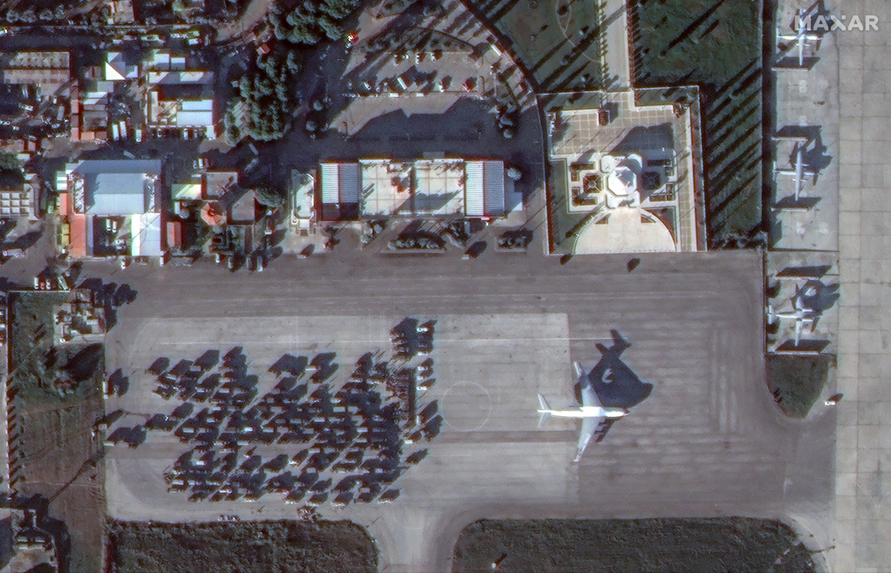

*Russian Il-76 transport aircraft and military vehicles on the tarmac at Hmeimim Airbase on December 15, 2024. Source: Satellite image ©2024 Maxar Technologies*

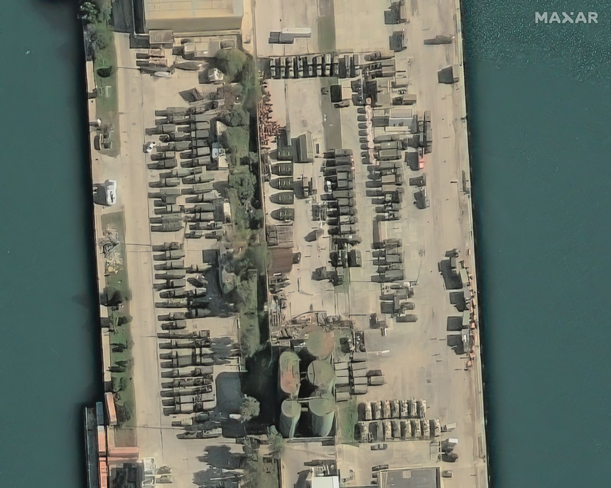

*Russian military vehicles assembled at the Port of Tartus on December 17. Source: Satellite image ©2024 Maxar Technologies*

**Key Takeaways:**

- **The Ukrainian Security Service (SBU) killed Russian Nuclear, Biological, Chemical Defense Forces (NBC) Head Lieutenant General Igor Kirillov and his assistant, Major Ilya Polikarpov, in Moscow on December 17.**
- **The Kremlin and Russian propagandists overwhelmingly attempted to frame Kirillov’s assassination as an unprovoked terrorist act, rather than a consequence of Russia’s full-scale invasion of Ukraine and Kirillov’s responsibility for Russian chemical weapons attacks and information operations against Ukraine.**
- **The Russian ultranationalist information space overwhelmingly called on the Kremlin to retaliate against Ukraine by targeting its military-political leadership and indirectly criticized the Kremlin’s decision to not recognize the war in Ukraine as a full-scale war that also impacts the Russian rear.**
- **White House national security communications adviser John Kirby confirmed on December 16 that North Korean forces are engaged in combat operations and suffering losses in Kursk Oblast as Russian official sources continue to avoid reporting on or confirming the deployment of North Korean forces to combat in Russia.**
- **Neither the Kremlin nor the interim Syrian government appear sure of the future of Russian bases in Syria, likely accounting for Russia’s continued visible preparations at Hmeimim Air Base and the Port of Tartus to withdraw forces despite claims and reports that the interim Syrian government might extend Russian basing rights.**
- **Russian forces recently advanced near Kupyansk, Toretsk, Pokrovsk, Vuhledar, Velyka Novosilka, and in Kursk Oblast.**
- **The Kremlin is scaling up the intended effects of its “Time of Heroes” program, which aims to install Kremlin-selected veterans into government officials, by tasking Russian regional governments to create more localized analogues.**

***We do not report in detail on Russian war crimes because these activities are well-covered in Western media and do not directly affect the military operations we are assessing and forecasting. We will continue to evaluate and report on the effects of these criminal activities on the Ukrainian military and the Ukrainian population and specifically on combat in Ukrainian urban areas. We utterly condemn Russian violations of the laws of armed conflict and the Geneva Conventions and crimes against humanity even though we do not describe them in these reports.***

- Ukrainian Operations in the Russian Federation
- Russian Main Effort – Eastern Ukraine (comprised of three subordinate main efforts)
- Russian Subordinate Main Effort #1 – Push Ukrainian forces back from the international border with Belgorod Oblast and approach to within tube artillery range of Kharkiv City
- Russian Subordinate Main Effort #2 – Capture the remainder of Luhansk Oblast and push westward into eastern Kharkiv Oblast and encircle northern Donetsk Oblast
- Russian Subordinate Main Effort #3 – Capture the entirety of Donetsk Oblast
- Russian Supporting Effort – Southern Axis
- Russian Air, Missile, and Drone Campaign
- Russian Mobilization and Force Generation Efforts
- Russian Technological Adaptations
- Activities in Russian-occupied areas
- Significant Activity in Belarus

**Ukrainian Operations in the Russian Federation**

[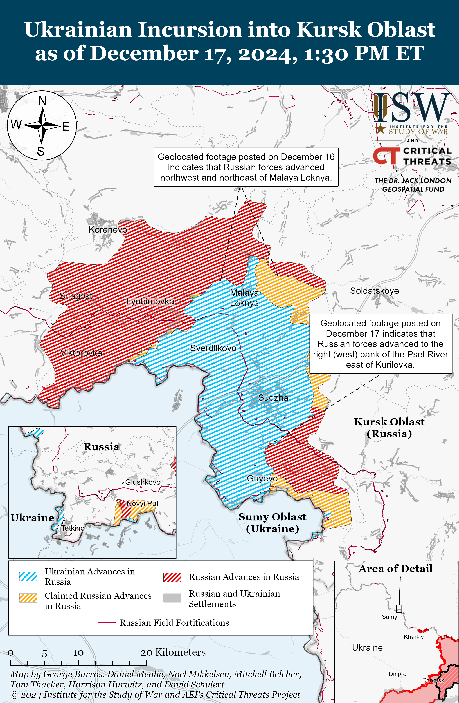](https://understandingwar.org/map/ukrainian-incursion-into-kursk-oblast-as-of-december-17-2024-130-pm-et/)

Russian opposition outlet *Verstka* reported on December 17 that Russian Ministry of Defense (MoD) data shows that Ukrainian forces conducted 7,339 drone strikes on Russian territory in 2024 and hit targets in 30 different Russian regions—a record thus far since 2022.[33] *Verstka* reported that Ukrainian drones most frequently targeted border regions such as Belgorod, Kursk, and Bryansk oblasts, as well as occupied Ukrainian territory in Crimea and the Black and Azov seas. *Verstka* noted that the Russian MoD data is incomplete, because Russian military authorities failed to report on Ukrainian drone strikes further within the Russian rear, such as strikes on Murmansk Oblast in October and strikes on Chechnya in early December.

**Russian Main Effort – Eastern Ukraine**

**Russian Subordinate Main Effort #1 – Kharkiv Oblast** **(Russian objective: Push Ukrainian forces back from the international border with Belgorod Oblast and approach to within tube artillery range of Kharkiv City)**

[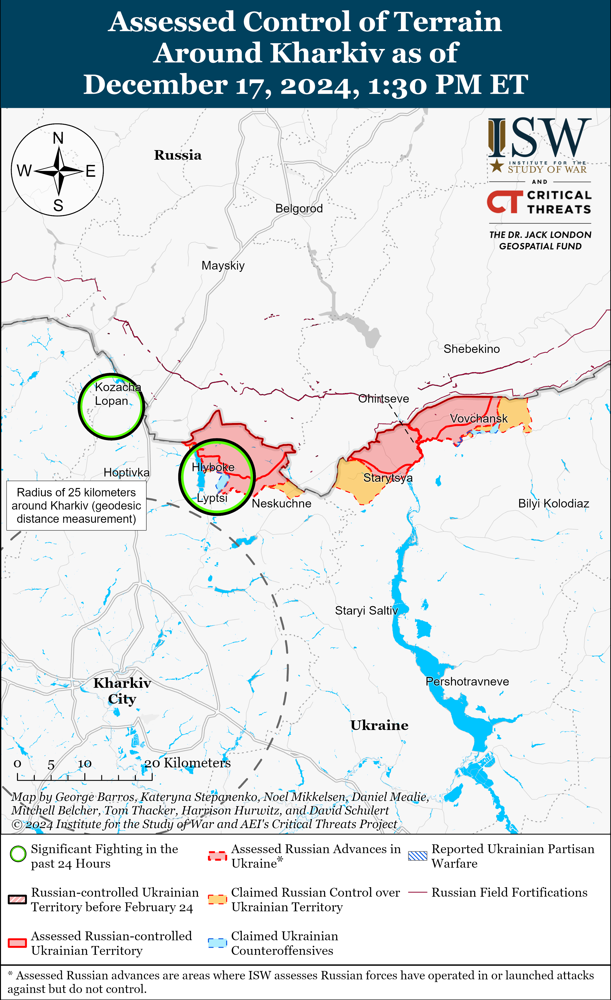](https://understandingwar.org/map/assessed-control-of-terrain-around-kharkiv-as-of-december-17-2024-130-pm-et/)

**Russian Subordinate Main Effort #2 – Luhansk Oblast** **(Russian objective: Capture the remainder of Luhansk Oblast and push westward into eastern Kharkiv Oblast and northern Donetsk Oblast)**

[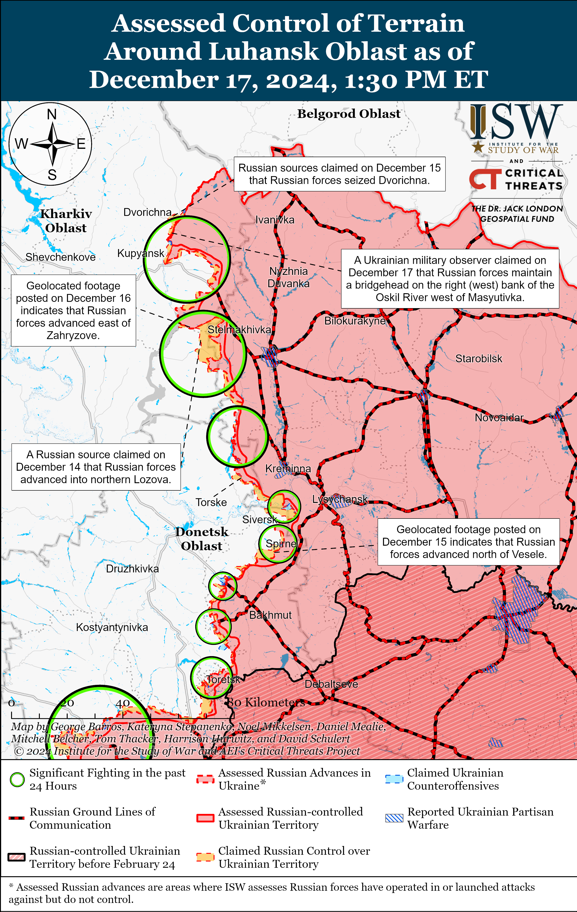](https://understandingwar.org/map/assessed-control-of-terrain-around-luhansk-oblast-as-of-december-17-2024-130-pm-et/)

**Russian Subordinate Main Effort #3 – Donetsk Oblast** **(Russian objective: Capture the entirety of Donetsk Oblast, the claimed territory of Russia’s proxies in Donbas)**

Russian forces conducted offensive operations near Siversk itself, northeast of Siversk near Bilohorivka, east of Siversk near Verkhnokamyanske, and southeast of Siversk near Ivano-Darivka and Spirne on December 16 and 17 but did not make any confirmed advances.[43]

[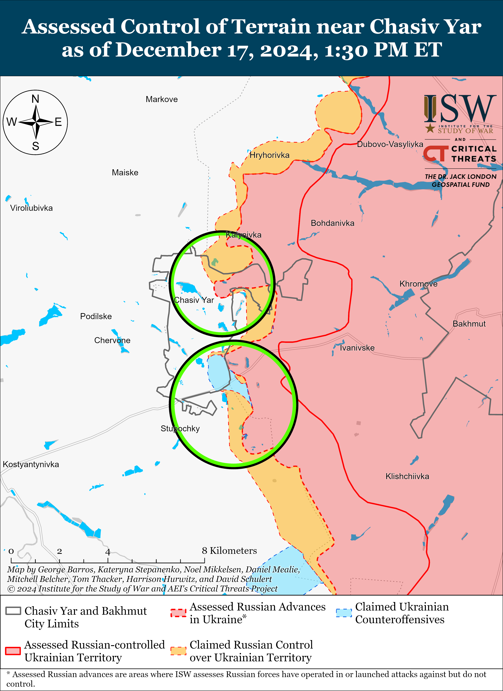](https://understandingwar.org/map/assessed-control-of-terrain-near-chasiv-yar-as-of-december-17-2024-130-pm-et/)[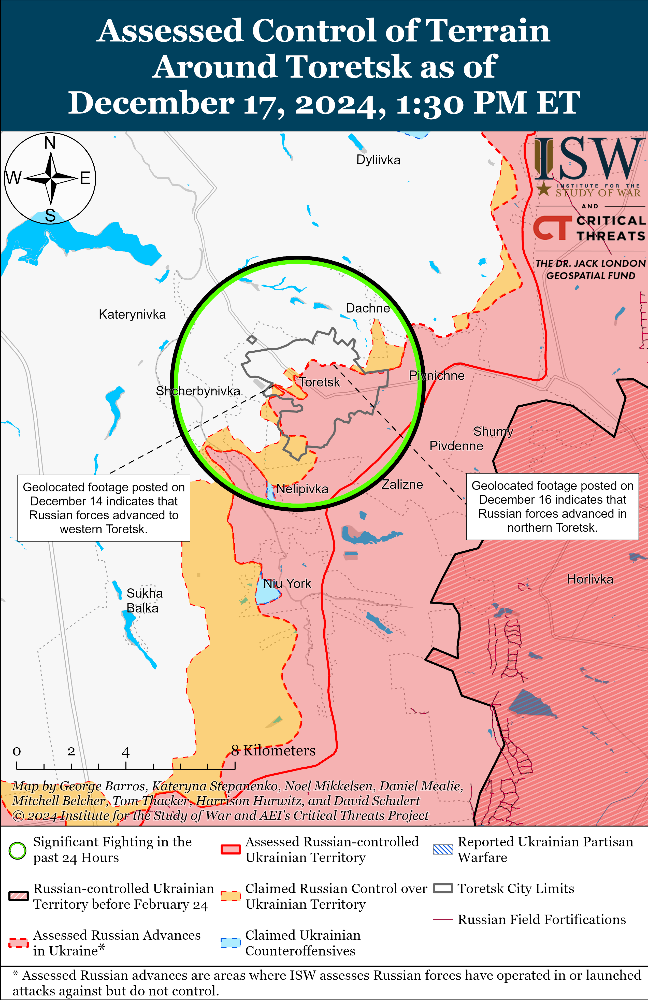](https://understandingwar.org/map/assessed-control-of-terrain-around-toretsk-as-of-december-17-2024-130-pm-et/)[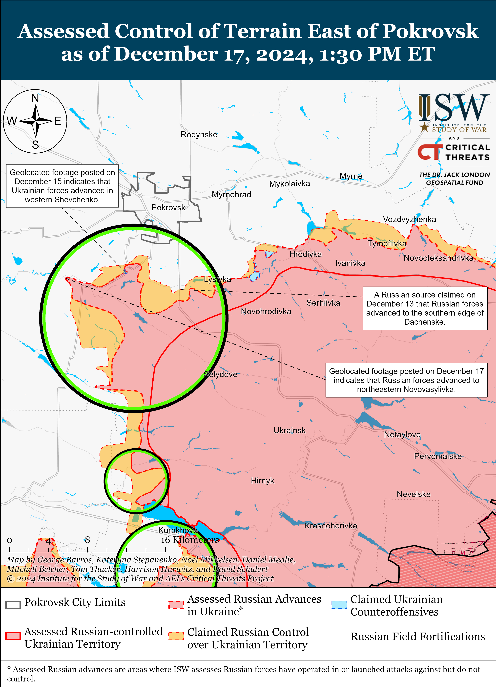](https://understandingwar.org/map/assessed-control-of-terrain-east-of-pokrovsk-as-of-december-17-2024-130-pm-et/)[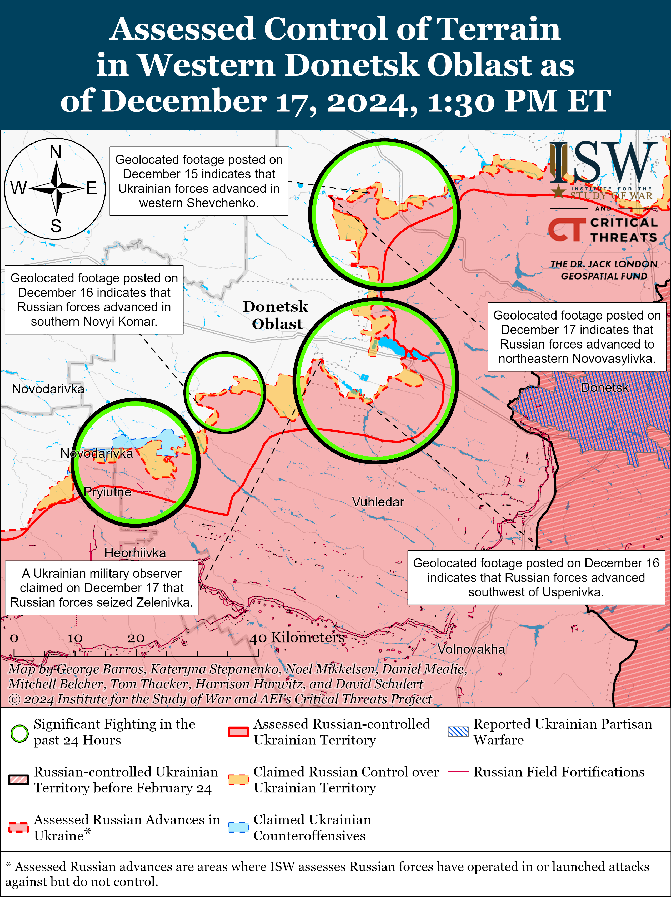](https://understandingwar.org/map/assessed-control-of-terrain-in-western-donetsk-oblast-as-of-december-17-2024-130-pm-et/)[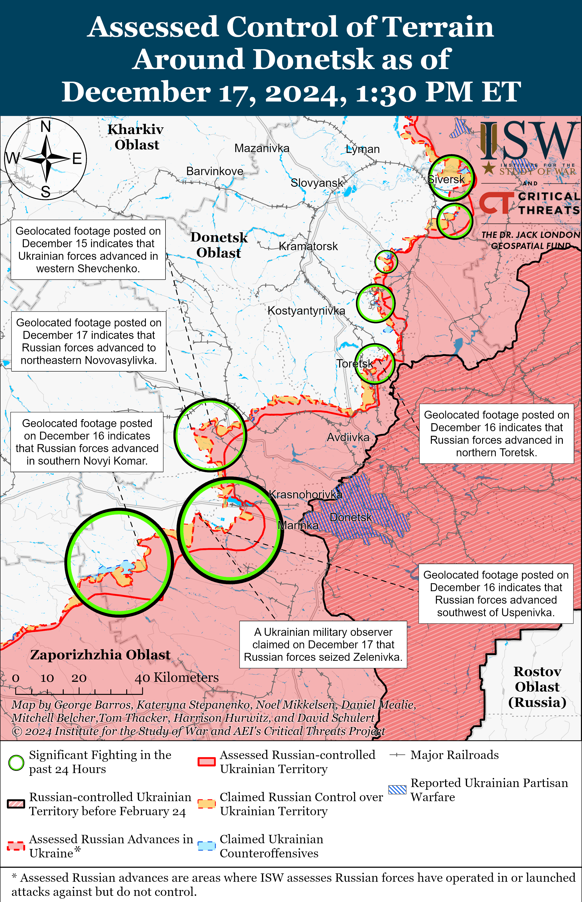](https://understandingwar.org/map/assessed-control-of-terrain-around-donetsk-as-of-december-17-2024-130-pm-et/)

Russian forces recently advanced in the Velyka Novosilka area amid continued offensive operations in the area on December 17. Mashovets stated that Russian forces advanced over Druzhby Street (the Makarivka-Neskuchne-Vremivka road) on the left (west) bank of the Mokryi Yaly River northwest of Makarivka (south of Velyka Novosilka).[69] Russian milbloggers claimed that Russian forces advanced southeast of Novyi Komar (north of Velyka Novosilka) near the Maltabar gully, towards Neskuchne (south of Velyka Novosilka), towards other settlements south of Velyka Novosilka from Rivnopil (southwest of Velyka Novosilka), across the Kuchuhurnyi River between Storozheve and Makarivka (both south of Velyka Novosilka), north of Makarivka over a bridge crossing the Mokryi Yaly River, and into Velyka Novosilka from both the north and south.[70] ISW has not observed confirmation of these claims, however. Russian forces conducted offensive operations north of Velyka Novosilka near Novyi Komar; northeast of Velyka Novosilka near Rozdolne; south of Velyka Novosilka near Blahodatne, Neskuchne, Storozheve and Makarivka; southwest of Velyka Novosilka near Novodarivka; and west of Velyka Novosilka near Novosilka on December 16 and 17.[71] Mashovets stated that elements of the Russian 127th Motorized Rifle Division and the 60th Motorized Rifle Brigade (both of the 5th CAA, EMD) and the 5th Tank Brigade (36th CAA, EMD) cut off the remaining Ukrainian ground line of communication (GLOC) near Makarivka leading into Neskuchne and that elements of the Russian 37th Motorized Rifle Brigade (36th CAA, EMD) and 40th Naval Infantry Brigade (Pacific Fleet, EMD) are operating in the east and northeast of Velyka Novosilka.[72] Drone operators of the 57th Motorized Rifle Brigade (5th CAA, EMD) are reportedly operating in the Velyka Novosilka direction.[73]

**Russian Supporting Effort – Southern Axis** **(Russian objective: Maintain frontline positions and secure rear areas against Ukrainian strikes)**

[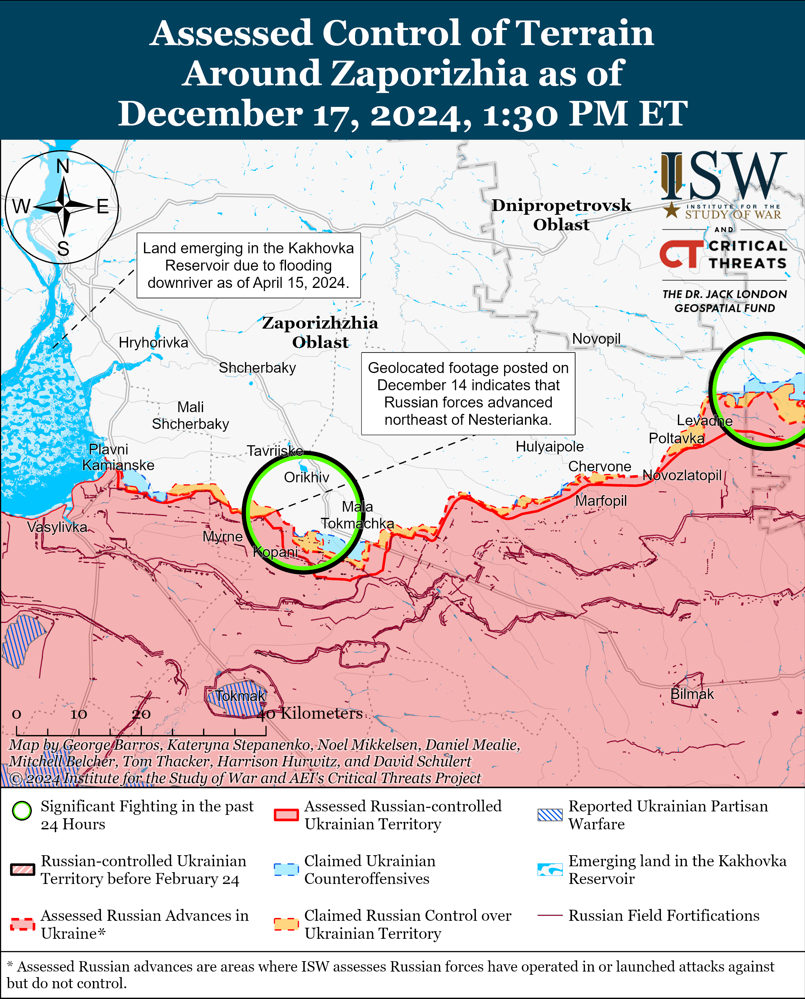](https://understandingwar.org/map/assessed-control-of-terrain-around-zaporizhzhia-as-of-december-17-2024-130-pm-et/)[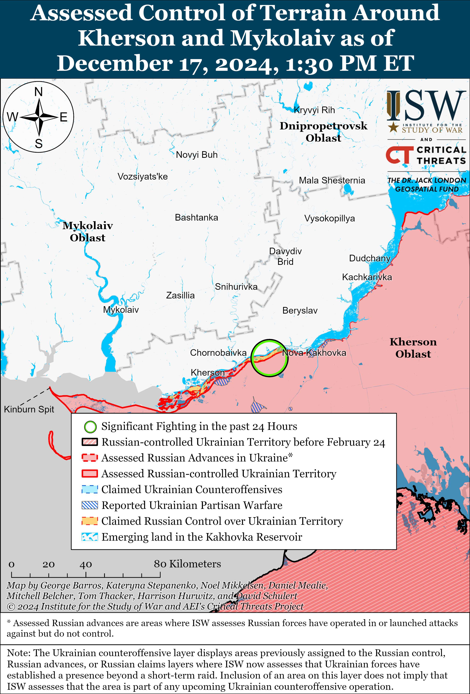](https://understandingwar.org/map/assessed-control-of-terrain-around-kherson-and-mykolaiv-as-of-december-17-2024-130-pm-et/)

Two Russian oil tankers sank due to inclement weather off the coast of occupied Crimea near the Kerch Straight on December 15.[82] Kremlin newswire *TASS* reported on December 16 that satellite imagery shows fuel oil stains covering approximately 100 square kilometers near the Kerch Straight following the oil tanker incident.[83] *TASS* reported on December 17 that the Minister of Civil Defense and Emergencies for Krasnodar Krai, Sergei Shtrikov, declared a state of emergency in two municipalities in Krasnodar Krai following the oil spill.[84]

**Russian Air, Missile, and Drone Campaign** **(Russian Objective: Target Ukrainian military and civilian infrastructure in the rear and on the frontline)**

Russian forces conducted a limited series of drone strikes against Ukraine on the night of December 16 to 17. The Ukrainian Air Force reported that Russian forces launched 31 Shahed and other drones at Ukraine from Bryansk and Oryol oblasts.[85] The Ukrainian Air Force reported that Ukrainian air defenses downed 20 drones over Poltava, Sumy, Kyiv, Zhytomyr and Cherkasy oblasts; that Ukrainian countermeasures caused 10 drones to become “lost” and fail to reach their targets; and that one drone remained in Ukrainian airspace. The Kyiv City Military Administration reported on December 17 that that falling debris from Russian drone strikes targeting Kyiv City caused minimal damage to civilian objects in the Solomyanskyi, Pecherskyi, and Dniprovskyi raions of Kyiv City.[86]

**Russian Mobilization and Force Generation Efforts** **(Russian objective: Expand combat power without conducting general mobilization)**

The Kremlin is scaling up the intended effects of its “Time of Heroes” program, which aims to install Kremlin-selected veterans into government officials, by tasking Russian regional governments to create more localized analogues. A Kremlin-affiliated milblogger claimed that Tula Oblast established the “Hero 71” program in March 2024 in an effort to help Russian veterans to find jobs upon their return from the frontlines and that Lipetsk Oblast is launching the “People’s Pride” (*Gordost’ Naroda*) initiative, both of which are analogous to the “Time of Heroes” program.[87] The milblogger added that Khanty-Mansi Autonomous Okrug is launching the “Heroes of Yugra” educational project in 2025 for Russian veterans, and that Samara Oblast had already held the first meeting of the “School of Heroes” program which supports returning veterans and their families. The milblogger noted that Ryazan Oblast similarly launched the “Heroes 62” program, which provides Russian veterans with civil service education. A Kremlin insider source noted that Moscow Oblast Governor Andrey Vorobyev has increasingly attempted to institutionalize the “Time of Heroes” program within Moscow Oblast power structures and recalled that Vorobyev even appointed the program’s alumnus Kirill Losunchukov as Moscow Oblast’s deputy minister of investment, industry, and science to retain favor with the Kremlin.[88] Vorobyev reported that efforts to appease the Kremlin by instituting and proliferating the “Time of Heroes” program in Moscow Oblast suggest that the Kremlin is pressuring and rewarding regional authorities who implement this program in a way that resembles ongoing regional volunteer recruitment drives. The rapid regional expansion of programs similar to the “Time of Heroes” initiative indicates that the Kremlin launched a coordinated effort across Russia that aims to prevent the destabilization of the regime, and that Russia is doubling down on the deep militarization of local, regional, and federal governments.

The Russian Ministry of Defense (MoD) is increasingly tricking conscripts and civilians into signing military service contracts to fight in Ukraine in an effort to generate more assault forces. *Radio Free Europe/ Radio Liberty’s* Tatar-Bashkir Service *Idel Realii* shared stories of several Russian conscripts whom Russian authorities coerced into signing military contracts or had their military contracts falsified.[89] *Idel Realii* reported that a Russian lieutenant killed a conscript, and relatives of the conscript claimed that he was killed after Russian recruiters unsuccessfully attempted to coerce the conscript into signing a military service contract.

Moscow City is reportedly failing to meet its conscription quotas for the Fall 2024 conscription cycle, which may indicate that the Russian military still faces problems with draft dodging despite increasing emphasis on military-patriotic education and adoption of stricter conscription measures. Moscow City Military Recruitment Head Maksim Loktev announced on December 17 that Moscow completed its conscription processes two weeks earlier than expected and claimed that Moscow fully met its conscription goals as a result of growing patriotic sentiment among Russian young men.[90] Russian lawyer of the “Movement of Conscious Objectors” Artem Klyga stated that conscription is ongoing in Moscow and that Moscow is unlikely to have met its quota of conscripting 8,000 men.[91]

**Russian Technological Adaptations** **(Russian objective: Introduce technological innovations to optimize systems for use in Ukraine)**

Russian state defense conglomerate Rostec presented a new modification of the “Depesha” tracked robot operated via fiber optic cable and claimed that the “Depesha” drone is resistant to electronic warfare (EW).[92] Rostec also presented the “Karakal” tracked drone, which can reportedly be used for equipment deliveries, reconnaissance, and artillery fire support.[93]

**Activities in Russian-occupied areas** **(Russian objective: Consolidate administrative control of annexed areas; forcibly integrate Ukrainian citizens into Russian sociocultural, economic, military, and governance systems)**

Russian video-streaming platform RuTube announced on December 16 that it will launch several projects and open new studios in occupied Ukraine—further extending Russian informational control over occupied areas.[94] RuTube told Kremlin newswire *TASS* that it sent representatives on a trip to occupied Ukraine in order to facilitate the media integration of these areas into the “single information space of Russia.”[95] RuTube representatives met with local media representatives in occupied Luhansk City and Mariupol and reportedly signed a memorandum of cooperation with occupation administrators, installed RuTube servers in some areas, and are preparing to open studios to train milbloggers and news correspondents.[96] Russia is currently pursuing several projects to consolidate control over local media and the information space in occupied Ukraine—Russian federal censor Roskomnadzor registered over 105 local media outlets in occupied Donetsk, Luhansk, Zaporizhia, and Kherson oblasts in summer 2023, and Russian occupation administrators have installed “Russkyi Mir” satellite dishes throughout occupied Ukraine in order to control access to Russian federal and regional television channels and entertainment programs.[97]

**Significant activity in Belarus** **(Russian efforts to increase its military presence in Belarus and further integrate Belarus into Russian-favorable frameworks)**

Belarusian Defense Minister Lieutenant General Viktor Khrenin met with Vietnamese President Luong Cuong on December 17 to discuss further efforts to strengthen bilateral military cooperation.[98]

The Belarusian Central Election Commission registered Alexander Lukashenko as a presidential candidate on December 17 in the upcoming January 26, 2025, presidential election.[99]

**Note: ISW does not receive any classified material from any source, uses only publicly available information, and draws extensively on Russian, Ukrainian, and Western reporting and social media as well as commercially available satellite imagery and other geospatial data as the basis for these reports. References to all sources used are provided in the endnotes of each update.**

*This article was corrected on December 18, 2024, to fix John Kirby’s title. John Kirby is the White House national security communications adviser, not the US National Security Council Spokesperson. We apologize for the oversight.*

[1] https://www.bbc.com/news/articles/cm2ek388yxzo ; https://t.me/SBUkr/13602 ; https://t.me/bbcrussian/74261; https://www.dw.com/en/russia-bomb-kills-senior-general-igor-kirillov-in-moscow/a-71076861;

[2] https://t.me/sledcom\_press/17864 ; https://t.me/dva\_majors/60398; https://t.me/dva\_majors/60399 ; https://t.me/sashakots/50760; https://t.me/motopatriot/30636 ; https://t.me/rusich\_army/19401 ; https://t.me/epoddubny/21908 ; https://t.me/epoddubny/21905; https://t.me/tass\_agency/291506

[3] https://t.me/tass\_agency/291436 ; https://t.me/tass\_agency/291441 ; https://t.me/tass\_agency/291447 ; https://t.me/tass\_agency/291474 ; https://t.me/tass\_agency/291513 ; https://t.me/dva\_majors/60397; https://x.com/Dmojavensis/status/1868906684447703428; https://x.com/censor\_net/status/1868891967587074164; https://x.com/censor\_net/status/1868892131747938365; https://censor [dot] net/ua/news/3525432/17-grudnya-u-moskvi-prolunav-vybuh; https://x.com/Maks\_NAFO\_FELLA/status/1868986054856110278; https://x.com/99Dominik\_/status/1868989492016865329; https://www.bbc.com/news/articles/cm2ek388yxzo

[4] https://t.me/SBUkr/13602; https://www.bbc.com/news/articles/cm2ek388yxzo

[5]https://t.me/tass\_agency/291477 ; https://t.me/dva\_majors/60404; https://t.me/tass\_agency/291454; https://t.me/tass\_agency/291572 ; https://t.me/tass\_agency/291573 ; https://t.me/tass\_agency/291585 ; https://t.me/rybar/66413 ; https://t.me/dva\_majors/60403

[6] https://t.me/astrapress/70431 ; https://www.golosameriki.com/a/v-moskve-ubit-nachal-nik-vojsk-himzaschity-general-kirillov-/7903979.html; https://t.me/bbcrussian/74268

[7] https://understandingwar.org/backgrounder/ukraine-invasion-update-23; https://understandingwar.org/backgrounder/ukraine-conflict-update-17

[8] https://t.me/tass\_agency/291490; https://t.me/voin\_dv/12332 ; https://t.me/tass\_agency/291559 ; https://t.me/sashakots/50762 ;https://t.me/sashakots/50757; https://t.me/dva\_majors/60406; https://t.me/dva\_majors/60405

[9] https://t.me/rybar/66413 ; https://t.me/dva\_majors/60403; https://t.me/dva\_majors/60400; https://t.me/dva\_majors/60401 ; https://t.me/sashakots/50757; https://t.me/voenkorKotenok/60783

[10] https://t.me/sashakots/50764 ; https://t.me/epoddubny/21913;

[11] https://t.me/sashakots/50757

[12] https://ria dot ru/20241217/kirillov-1989642311.html; https://t.me/RVvoenkor/82840 ; https://t.me/tass\_agency/291491 ; https://t.me/tass\_agency/291492 ; https://t.me/tass\_agency/291493 ; https://t.me/tass\_agency/291496 ; https://t.me/RVvoenkor/82857 ; https://t.me/tass\_agency/291564 ; https://t.me/tass\_agency/291565 ; https://t.me/tass\_agency/291568 ; https://t.me/DnevnikDesantnika/21098

[13] https://t.me/rybar/66413 ; https://t.me/dva\_majors/60403

[14] https://understandingwar.org/backgrounder/russian-offensive-campaign-assessment-december-16-2024; https://t.me/voenkorKotenok/60783

[15] https://www.whitehouse.gov/briefing-room/speeches-remarks/2024/12/16/on-the-record-press-gaggle-by-white-house-national-security-communications-advisor-john-kirby-37/

[16] https://www.reuters.com/world/north-korean-troops-killed-combat-against-ukraine-first-time-pentagon-says-2024-12-16/

[17] https://t.me/V\_Zelenskiy\_official/12764

[18] https://isw.pub/UkrWar110524 ; https://isw.pub/UkrWar112124

[19] https://understandingwar.org/backgrounder/russian-offensive-campaign-assessment-september-21-2024 ; https://isw.pub/UkrWar082924 ; https://isw.pub/UkrWar082924

[20] https://www.economist.com/middle-east-and-africa/2024/12/16/the-secret-talks-between-syrias-new-leaders-and-the-kremlin

[21] https://www.alaraby dot co.uk/politics/%D8%B1%D9%88%D8%B3%D9%8A%D8%A7-%D9%84%D9%85-%D8%AA%D8%AD%D8%AF%D9%91%D8%AF-%D8%A8%D8%B9%D8%AF-%D9%85%D8%B5%D9%8A%D8%B1-%D9%82%D9%88%D8%A7%D8%B9%D8%AF%D9%87%D8%A7-%D9%81%D9%8A-%D8%B3%D9%88%D8%B1%D9%8A%D8%A9; https://understandingwar.org/backgrounder/russian-offensive-campaign-assessment-december-16-2024

[22] https://www.politico.eu/article/syria-rebels-russia-bases-brussels-kaja-kallas-bashar-assad/

[23] https://t.me/MID\_Russia/49744; https://mid dot ru/ru/foreign\_policy/news/1987700/

[24] https://t.me/damascusv011/26525; https://t.me/damascusv011/26528

[25] https://t.me/WarArchive\_ua/23647; https://t.me/svoboda\_radio/32562; https://t.me/creamy\_caprice/7837 https://x.com/moklasen/status/1868731495487357117; https://t.me/informnapalm/23632; https://x.com/moklasen/status/1868796407437836315; https://t.me/SyndicateAirAssassins\_95/31; https://t.me/SyndicateAirAssassins\_95/30

[26] https://t.me/WarArchive\_ua/23673; https://t.me/Khyzhak\_brigade/273

[27] https://www.economist.com/europe/2024/12/16/ukrainian-troops-celebrate-a-grim-christmas-in-kursk

[28] https://t.me/RVvoenkor/82845; https://t.me/DnevnikDesantnika/21103

[29] https://t.me/dva\_majors/60392; https://t.me/boris\_rozhin/148149

[30] https://t.me/DnevnikDesantnika/21066; https://t.me/DnevnikDesantnika/21066; https://t.me/dva\_majors/60392

[31] https://t.me/DnevnikDesantnika/21081; https://t.me/RVvoenkor/82818

[32] https://t.me/ZarodinuVmesteZOV/18904; https://t.me/boris\_rozhin/148121

[33] https://verstka dot media/kak-stroykompanii-zarabotali-milliardy-na-atakakh-dronov-po-rossii

[34] https://www.facebook.com/GeneralStaff.ua/posts/pfbid0YDJriVLg547FTVUaTj2q1ZK2neDPuVwhS4woE3QisN13uSjPDaNshyjGVN6QcEe3l; https://t.me/dva\_majors/60392; https://t.me/Sladkov\_plus/12060

[35] https://t.me/Sladkov\_plus/12060

[36] https://x.com/ZoamSc2/status/1868851208972390779; https://x.com/ZoamSc2/status/1868851211660935664; https://t.me/seekservice/3158;

[37]https://t.me/zvizdecmanhustu/2416

[38] https://t.me/DnevnikDesantnika/21095

[39] https://t.me/tass\_agency/291438

[40] https://www.facebook.com/GeneralStaff.ua/posts/pfbid02fsnwG8DF6rLLQy7XYVErt9UfXjyY29pK88NEk49uosHCLixCHGj5uur9B84vF4Bxl; https://www.facebook.com/GeneralStaff.ua/posts/pfbid0YDJriVLg547FTVUaTj2q1ZK2neDPuVwhS4woE3QisN13uSjPDaNshyjGVN6QcEe3l; https://www.facebook.com/GeneralStaff.ua/posts/pfbid02HgeDXUuVLZVEZKLqkEvfwRUV3rfsStTjhUdUaXDnRAiS623SbK2jkh8rTUPSVHDkl; https://www.facebook.com/GeneralStaff.ua/posts/pfbid02fsnwG8DF6rLLQy7XYVErt9UfXjyY29pK88NEk49uosHCLixCHGj5uur9B84vF4Bxl; https://www.facebook.com/GeneralStaff.ua/posts/pfbid0YDJriVLg547FTVUaTj2q1ZK2neDPuVwhS4woE3QisN13uSjPDaNshyjGVN6QcEe3l; https://www.facebook.com/GeneralStaff.ua/posts/pfbid02HgeDXUuVLZVEZKLqkEvfwRUV3rfsStTjhUdUaXDnRAiS623SbK2jkh8rTUPSVHDkl;

[41] https://t.me/zvizdecmanhustu/2417

[42] https://t.me/voin\_dv/12323; https://t.me/RKadyrov\_95/5334

[43] https://www.facebook.com/GeneralStaff.ua/posts/pfbid02HgeDXUuVLZVEZKLqkEvfwRUV3rfsStTjhUdUaXDnRAiS623SbK2jkh8rTUPSVHDkl ; https://www.facebook.com/GeneralStaff.ua/posts/pfbid0YDJriVLg547FTVUaTj2q1ZK2neDPuVwhS4woE3QisN13uSjPDaNshyjGVN6QcEe3l ; https://www.facebook.com/GeneralStaff.ua/posts/pfbid02fsnwG8DF6rLLQy7XYVErt9UfXjyY29pK88NEk49uosHCLixCHGj5uur9B84vF4Bxl

[44] https://t.me/dva\_majors/60392 ; https://t.me/DnevnikDesantnika/21093 ; https://t.me/DnevnikDesantnika/21063

[45] https://suspilne dot media/donbas/904261-armia-rf-hoce-zajnati-casovoarskij-vognetrivkij-zavod-comu-vin-vazlivij/; https://www.youtube.com/watch?v=aDXWlQ2K0dM

[46] https://www.facebook.com/GeneralStaff.ua/posts/pfbid02HgeDXUuVLZVEZKLqkEvfwRUV3rfsStTjhUdUaXDnRAiS623SbK2jkh8rTUPSVHDkl ; https://www.facebook.com/GeneralStaff.ua/posts/pfbid0YDJriVLg547FTVUaTj2q1ZK2neDPuVwhS4woE3QisN13uSjPDaNshyjGVN6QcEe3l ; https://www.facebook.com/GeneralStaff.ua/posts/pfbid02fsnwG8DF6rLLQy7XYVErt9UfXjyY29pK88NEk49uosHCLixCHGj5uur9B84vF4Bxl ; https://t.me/Khortytsky\_wind/3428

[47] https://suspilne dot media/donbas/904261-armia-rf-hoce-zajnati-casovoarskij-vognetrivkij-zavod-comu-vin-vazlivij/; https://www.youtube.com/watch?v=aDXWlQ2K0dM

[48] https://armyinform dot com.ua/2024/12/16/shturmuyut-chasiv-yar-nashestyam-droniv-vorog-zastosovuye-novu-taktyku/

[49] https://t.me/Sever\_Z/8526 ; https://t.me/motopatriot/30645 ; https://t.me/tass\_agency/291512 ; https://t.me/boris\_rozhin/148154 ; https://t.me/DnevnikDesantnika/21081 ; https://t.me/mod\_russia/46967

[50] https://x.com/AudaxonX/status/1868716376137031741 ; https://t.me/Khyzhak\_brigade/270

[51] https://t.me/boris\_rozhin/148131

[52] https://www.facebook.com/GeneralStaff.ua/posts/pfbid02fsnwG8DF6rLLQy7XYVErt9UfXjyY29pK88NEk49uosHCLixCHGj5uur9B84vF4Bxl ; https://www.facebook.com/GeneralStaff.ua/posts/pfbid0YDJriVLg547FTVUaTj2q1ZK2neDPuVwhS4woE3QisN13uSjPDaNshyjGVN6QcEe3l ; https://www.facebook.com/GeneralStaff.ua/posts/pfbid02HgeDXUuVLZVEZKLqkEvfwRUV3rfsStTjhUdUaXDnRAiS623SbK2jkh8rTUPSVHDkl

[53] https://t.me/WarArchive\_ua/23666 ; https://t.me/kyianyn204/2076 ; https://x.com/giK1893/status/1868956704215646526

[54] https://t.me/z\_arhiv/30125 ; https://t.me/motopatriot/30652 ; https://t.me/z\_arhiv/30125 ; https://t.me/RVvoenkor/82850 ; https://t.me/DnevnikDesantnika/21066 ; https://t.me/voenkorKotenok/60786

[55] https://www.facebook.com/GeneralStaff.ua/posts/pfbid02fsnwG8DF6rLLQy7XYVErt9UfXjyY29pK88NEk49uosHCLixCHGj5uur9B84vF4Bxl ; https://www.facebook.com/GeneralStaff.ua/posts/pfbid0YDJriVLg547FTVUaTj2q1ZK2neDPuVwhS4woE3QisN13uSjPDaNshyjGVN6QcEe3l ; https://www.facebook.com/GeneralStaff.ua/posts/pfbid02HgeDXUuVLZVEZKLqkEvfwRUV3rfsStTjhUdUaXDnRAiS623SbK2jkh8rTUPSVHDkl ; https://t.me/voenkorKotenok/60774

[56] https://t.me/voenkorKotenok/60774

[57] https://t.me/mod\_russia/46969

[58] https://t.me/Khortytsky\_wind/3428

[59] https://www.facebook.com/GeneralStaff.ua/posts/pfbid02fsnwG8DF6rLLQy7XYVErt9UfXjyY29pK88NEk49uosHCLixCHGj5uur9B84vF4Bxl ; https://www.facebook.com/GeneralStaff.ua/posts/pfbid0YDJriVLg547FTVUaTj2q1ZK2neDPuVwhS4woE3QisN13uSjPDaNshyjGVN6QcEe3l ; https://www.facebook.com/GeneralStaff.ua/posts/pfbid02HgeDXUuVLZVEZKLqkEvfwRUV3rfsStTjhUdUaXDnRAiS623SbK2jkh8rTUPSVHDkl ; https://t.me/dva\_majors/60395 ; https://t.me/voenkorKotenok/60774 ; https://t.me/voenkorKotenok/60775

[60] https://armyinform.com dot ua/2024/12/17/vdalosya-zakaczapyty-17-moskaliv-mali-shturmovi-grupy-poblyzu-kurahovogo-peretvoryuyut-na-shhe-menshi/

[61] https://t.me/zvizdecmanhustu/2414

[62] https://t.me/RVvoenkor/82868 ; https://t.me/dva\_majors/60409; https://t.me/dva\_majors/60382

[63] https://t.me/zvizdecmanhustu/2414

[64] https://t.me/mod\_russia/46965 ; https://understandingwar.org/backgrounder/russian-offensive-campaign-assessment-december-5-2024

[65] https://t.me/z\_arhiv/30122; https://t.me/DnevnikDesantnika/21108; https://t.me/voenkorKotenok/60775; https://t.me/voin\_dv/12339 ; https://t.me/z\_arhiv/30122 ; https://t.me/DnevnikDesantnika/21105 ; https://t.me/dva\_majors/60392 ; https://t.me/voin\_dv/12339 ; https://t.me/dva\_majors/60458 ; https://t.me/RVvoenkor/82866

[66] https://t.me/Khortytsky\_wind/3428

[67] https://www.facebook.com/GeneralStaff.ua/posts/pfbid02fsnwG8DF6rLLQy7XYVErt9UfXjyY29pK88NEk49uosHCLixCHGj5uur9B84vF4Bxl ; https://www.facebook.com/GeneralStaff.ua/posts/pfbid0YDJriVLg547FTVUaTj2q1ZK2neDPuVwhS4woE3QisN13uSjPDaNshyjGVN6QcEe3l ; https://www.facebook.com/GeneralStaff.ua/posts/pfbid02HgeDXUuVLZVEZKLqkEvfwRUV3rfsStTjhUdUaXDnRAiS623SbK2jkh8rTUPSVHDkl ; https://t.me/dva\_majors/60392 ; https://t.me/dva\_majors/60395 ; https://t.me/voenkorKotenok/60786 ; https://t.me/voenkorKotenok/60786

[68] https://t.me/voin\_dv/12322

[69] https://t.me/zvizdecmanhustu/2415

[70] https://t.me/rybar/66406; https://t.me/dva\_majors/60392; https://t.me/voenkorKotenok/60776; https://t.me/voenkorKotenok/60787; https://t.me/ne\_rybar/3841; https://t.me/wargonzo/23777

[71] https://www.facebook.com/GeneralStaff.ua/posts/pfbid02fsnwG8DF6rLLQy7XYVErt9UfXjyY29pK88NEk49uosHCLixCHGj5uur9B84vF4Bxl; https://www.facebook.com/GeneralStaff.ua/posts/pfbid0YDJriVLg547FTVUaTj2q1ZK2neDPuVwhS4woE3QisN13uSjPDaNshyjGVN6QcEe3l; https://www.facebook.com/GeneralStaff.ua/posts/pfbid02HgeDXUuVLZVEZKLqkEvfwRUV3rfsStTjhUdUaXDnRAiS623SbK2jkh8rTUPSVHDkl; https://t.me/Khortytsky\_wind/3428; https://t.me/wargonzo/23777; https://t.me/dva\_majors/60392; https://t.me/rybar/66406; https://t.me/voenkorKotenok/60776; https://t.me/voenkorKotenok/60787

[72] https://t.me/zvizdecmanhustu/2415; https://t.me/voin\_dv/12327; https://t.me/dva\_majors/60418; https://t.me/voin\_dv/12328 ; https://t.me/voenkorKotenok/60787

[73] https://t.me/voin\_dv/12324

[74]https://www.facebook.com/GeneralStaff.ua/posts/pfbid02fsnwG8DF6rLLQy7XYVErt9UfXjyY29pK88NEk49uosHCLixCHGj5uur9B84vF4Bxl ; https://www.facebook.com/GeneralStaff.ua/posts/pfbid0YDJriVLg547FTVUaTj2q1ZK2neDPuVwhS4woE3QisN13uSjPDaNshyjGVN6QcEe3l ; https://www.facebook.com/GeneralStaff.ua/posts/pfbid02HgeDXUuVLZVEZKLqkEvfwRUV3rfsStTjhUdUaXDnRAiS623SbK2jkh8rTUPSVHDkl

[75] https://t.me/z\_arhiv/30119

[76]https://www.facebook.com/OperationalCommandSouth/posts/pfbid0RhLGGHqnpnTQnBBdLAqz25HnmVcMKVttFnU8aKoxnAcPTe6oGxJi74wiJFEDwNsml

[77] https://t.me/dva\_majors/60392 ; https://t.me/dva\_majors/60383 ; https://t.me/fronttyagach82

[78] https://t.me/wargonzo/23777

[79]https://www.facebook.com/GeneralStaff.ua/posts/pfbid02fsnwG8DF6rLLQy7XYVErt9UfXjyY29pK88NEk49uosHCLixCHGj5uur9B84vF4Bxl ; https://www.facebook.com/GeneralStaff.ua/posts/pfbid0YDJriVLg547FTVUaTj2q1ZK2neDPuVwhS4woE3QisN13uSjPDaNshyjGVN6QcEe3l ; https://www.facebook.com/GeneralStaff.ua/posts/pfbid02HgeDXUuVLZVEZKLqkEvfwRUV3rfsStTjhUdUaXDnRAiS623SbK2jkh8rTUPSVHDkl ; https://www.facebook.com/OperationalCommandSouth/posts/pfbid0RhLGGHqnpnTQnBBdLAqz25HnmVcMKVttFnU8aKoxnAcPTe6oGxJi74wiJFEDwNsml

[80] https://t.me/rusich\_army/19409

[81] https://t.me/DnevnikDesantnika/21066

[82] https://t.me/RVvoenkor/82700 ; https://t.me/vchkogpu/53279 ; https://x.com/GirkinGirkin/status/1868235329330921859 ; https://x.com/GirkinGirkin/status/1868234146562388087 ; https://meduza dot io/feature/2024/12/15/v-kerchenskom-prolive-poterpeli-krushenie-dva-tankera; https://t.me/prokutp/3546; https://t.me/good78news/96904; https://meduza.io/news/2024/12/15/v-kerchenskom-prolive-terpyat-bedstvie-dva-rossiyskih-tankera ; https://t.me/bbcrussian/74206; https://t.me/istories\_media/8510; https://t.me/tass\_agency/291137 ; https://t.me/tass\_agency/291138 ; https://t.me/tass\_agency/291146 ; https://t.me/vchkogpu/53291 ; https://t.me/bazabazon/33602 ; https://t.me/bbcrussian/74208

[83] https://t.me/tass\_agency/291409

[84] https://t.me/tass\_agency/291523 ; https://t.me/bbcrussian/74267

[85] https://t.me/kpszsu/24994

[86] https://t.me/VA\_Kyiv/10059

[87] https://t.me/sashakots/50777

[88] https://t.me/kremlin\_sekret/16627

[89] https://www.idelreal.org/a/ty-obyazan-otdat-dolg-rodine-srochnikov-i-grazhdanskih-vse-chasche-zastavlyayut-podpisyvat-kontrakt-i-otpravlyatsya-na-voynu-/33240659.html

[90] https://www.mskagency dot ru/materials/3440761

[91] https://t.me/istories\_media/8542

[92] https://t.me/tass\_agency/291531

[93] https://t.me/tass\_agency/291521

[94] https://tass dot ru/obschestvo/22686381

[95] https://tass dot ru/obschestvo/22686381

[96] https://t.me/sashakots/50753; https://t.me/RVvoenkor/82805

[97] https://understandingwar.org/backgrounder/russian-offensive-campaign-assessment-may-7-2024; https://understandingwar.org/backgrounder/russian-offensive-campaign-assessment-november-1-2023-0; https://tass dot ru/obschestvo/18262599

[98] https://t.me/modmilby/43888

[99] https://belta dot by/society/view/tsik-prinjal-dokumenty-dlja-registratsii-lukashenko-kandidatom-v-prezidenty-belarusi-683329-2024/ ; https://t.me/tass\_agency/291499; ; https://t.me/newsby\_btrc/149859 ;
