# Russian Offensive Campaign Assessment, December 18, 2024

**Angelica Evans, Christina Harward, Nicole Wolkov, Nate Trotter, Olivia Gibson, William Runkel, and Frederick W. Kagan**

**December 18, 2024, 7:15pm ET**

**Click** [**here**](https://storymaps.arcgis.com/stories/36a7f6a6f5a9448496de641cf64bd375) **to see ISW’s interactive map of the Russian invasion of Ukraine. This map is updated daily alongside the static maps present in this report.**

**Click** [**here**](https://storymaps.arcgis.com/stories/83a2f24901c941d581c0c523ecd2619b)**to see ISW’s interactive map of Ukraine’s offensive in Kursk Oblast.**

**Click** [**here**](https://understandingwar.maps.arcgis.com/apps/instant/3dviewer/index.html?appid=1602762dbcde419bb957dea358449580) **to see ISW’s 3D control of terrain topographic map of Ukraine. Use of a computer (not a mobile device) is strongly recommended for using this data-heavy tool.**

**Click** [**here**](https://storymaps.arcgis.com/stories/733fe90805894bfc8562d90b106aa895) **to access ISW’s archive of interactive time-lapse maps of the Russian invasion of Ukraine. These maps complement the static control-of-terrain map that ISW produces daily by showing a dynamic frontline. ISW will update this time-lapse map archive monthly.**

**Note: The data cut-off for this product was 2:00 pm ET on December 18. ISW will cover subsequent reports in the December 19 Russian Offensive Campaign Assessment.**

**Ukrainian forces reportedly struck a chemical plant in Rostov Oblast on December 18.** Ukrainian Center for Countering Disinformation Head Lieutenant Andriy Kovalenko reported that unspecified actors struck the Kamensky Chemical Plant and that the plant produces rocket fuel, explosives, and ammunition components and disposes of spent rocket systems.[1] Acting Rostov Oblast Governor Yury Slyusar claimed that Russian forces downed 10 missiles over Rostov Oblast, and Russian milbloggers claimed that Ukrainian forces used Storm Shadow or ATACMS missiles in the strike.[2] Russian sources amplified footage purportedly showing Russian air defenses downing the missiles, and a Russian insider source claimed that Ukrainian forces also targeted the Taganrog Metallurgical Plant.[3]

**Ukraine’s European allies continue to provide monetary and defense industrial support to sustain Ukraine’s war effort.** German arms manufacturer Rheinmetall announced on December 17 that the company will supply Ukraine with nine million euros ($9.34 million) worth of 155mm propellant charge modules of various types in January 2025.[4] Rheinmetall will deliver tens of thousands of propellant charges as part of the contract and is also planning to produce unspecified artillery ammunition and produce and deliver an unspecified number of Lynx infantry fighting vehicles to Ukraine in the future. Global propellant charge shortages may be limiting Ukraine’s ability to produce ammunition domestically, and the delivery of additional modules will likely support Ukraine’s ongoing efforts to expand its domestic ammunition production capabilities.[5] The European Commission reported on December 18 that it disbursed nearly 4.1 billion euros ($4.25 billion) worth of grants and loans to Ukraine as part of the second payment of the European Union’s (EU) Ukraine Facility program.[6] *Reuters* reported on December 17 that an unspecified source stated that NATO recently began overseeing coordination of Western military assistance to Ukraine.[7]

**Russian Chief of the General Staff Army General Valery Gerasimov heavily inflated alleged statistics about Russian territorial gains in 2024.** Gerasimov claimed on December 18 that Russian forces seized roughly 4,500 square kilometers in 2024.[8] ISW has observed confirmation that Russian forces have only seized 3,306 square kilometers in 2024, however. Gerasimov’s exaggerated figures contrast with Russian Defense Minister Andrei Belousov’s more accurate statements to the Russian Ministry of Defense (MoD) board meeting on December 16. Belousov claimed, for example, that Russian forces’ average daily rate of advance is about 30 square kilometers.[9] ISW observed geolocated evidence to assess that Russian forces advanced at a rate of roughly 27.96 square kilometers per day in November 2024.[10] Belousov also claimed that Russian forces have seized roughly 99 percent of Luhansk Oblast, 70 percent of Donetsk Oblast, roughly 74 percent of Zaporizhia Oblast, and roughly 76 percent of Kherson Oblast.[11] ISW assesses that Russian forces occupy roughly 99 percent of Luhansk Oblast, 66 percent of Donetsk Oblast, and 73 percent of Zaporizhia and Kherson oblasts each.

**The Russian Federal Security Service (FSB) announced on December 18 that Russian authorities detained the suspect who planted the improvised explosive device (IED) that killed Russian Nuclear, Biological, Chemical Defense Forces (NBC) Head Lieutenant General Igor Kirillov and his aide, Major Ilya Polikarpov, in Moscow on December 17.[12]** The FSB claimed that the alleged perpetrator is a 29-year-old citizen of Uzbekistan who claimed that Ukrainian special services recruited him to place an IED planted in an electric scooter near Kirillov’s residence in exchange for money and permission to live in the European Union.[13] The Uzbek Embassy in Moscow stated on December 18 that it is in contact with Russian law enforcement to clarify information about the alleged suspect.[14] ISW cannot independently confirm if the suspect was involved in Kirillov’s and his assistant’s death. Russian milbloggers seized on the suspect’s Central Asian origins to call for harsher migration laws and restrictions against migrants.[15] Russian milbloggers’ hyperfocus on the alleged perpetrator’s ethnic origins highlights the polarizing debate over the role and treatment of migrants and ethnic minorities in Russian society, suggesting that the Kremlin is increasingly struggling to foster civic Russian nationalism and portray Russia as inclusive and harmonious multicultural country.

**Key Takeaways:**

- **Ukrainian forces reportedly struck a chemical plant in Rostov Oblast on December 18.**
- **Ukraine’s European allies continue to provide monetary and defense industrial support to sustain Ukraine’s war effort.**
- **Russian Chief of the General Staff Army General Valery Gerasimov heavily inflated alleged statistics about Russian territorial gains in 2024.**
- **The Russian Federal Security Service (FSB) announced on December 18 that Russian authorities detained the suspect who planted the improvised explosive device (IED) that killed Russian Nuclear, Biological, Chemical Defense Forces (NBC) Head Lieutenant General Igor Kirillov and his aide, Major Ilya Polikarpov, in Moscow on December 17.**
- **Russian forces recently advanced near Kupyansk, Kreminna, and Pokrovsk.**
- **The Russian Ministry of Defense (MoD) is increasingly tricking conscripts into signing military service contracts to fight in Ukraine likely in an effort to generate more assault forces and maintain the tempo of Russian offensive operations in Ukraine.**

***We do not report in detail on Russian war crimes because these activities are well-covered in Western media and do not directly affect the military operations we are assessing and forecasting. We will continue to evaluate and report on the effects of these criminal activities on the Ukrainian military and the Ukrainian population and specifically on combat in Ukrainian urban areas. We utterly condemn Russian violations of the laws of armed conflict and the Geneva Conventions and crimes against humanity even though we do not describe them in these reports.***

- Ukrainian Operations in the Russian Federation
- Russian Main Effort – Eastern Ukraine (comprised of three subordinate main efforts)
- Russian Subordinate Main Effort #1 – Push Ukrainian forces back from the international border with Belgorod Oblast and approach to within tube artillery range of Kharkiv City
- Russian Subordinate Main Effort #2 – Capture the remainder of Luhansk Oblast and push westward into eastern Kharkiv Oblast and encircle northern Donetsk Oblast
- Russian Subordinate Main Effort #3 – Capture the entirety of Donetsk Oblast
- Russian Supporting Effort – Southern Axis
- Russian Air, Missile, and Drone Campaign
- Russian Mobilization and Force Generation Efforts
- Russian Technological Adaptations
- Activities in Russian-occupied areas
- Significant Activity in Belarus

**Ukrainian Operations in the Russian Federation**

Fighting continued in the main Ukrainian salient in Kursk Oblast on December 18, but there were no confirmed advances. Russian milbloggers claimed that Russian forces advanced near Kruglenkoye (southeast of Korenevo), Plekhovo (south of Sudzha), Russkoye Porechnoye, and Cherkasskoye Porechnoye (both of north of Sudzha).[16] The commander of a Ukrainian platoon operating in Kursk Oblast stated that Russian forces are attacking in small and large infantry groups but are using less equipment due to Ukrainian first-person view (FPV) drone strikes.[17] Elements of the Russian “Arbat” Special Purpose Battalion (Donetsk People’s Republic [DNR] “Pyatnashka” International Volunteer Brigade, 51st Combined Arms Army [CAA]) are reportedly operating near Plekhovo; elements of the 56th Airborne (VDV) Regiment (7th VDV Division) are reportedly operating near Novoivanovka (southeast of Korenevo); and elements of the 1434th “Akhmat-Chechnya” Regiment are reportedly operating in the Sudzha direction.[18]

[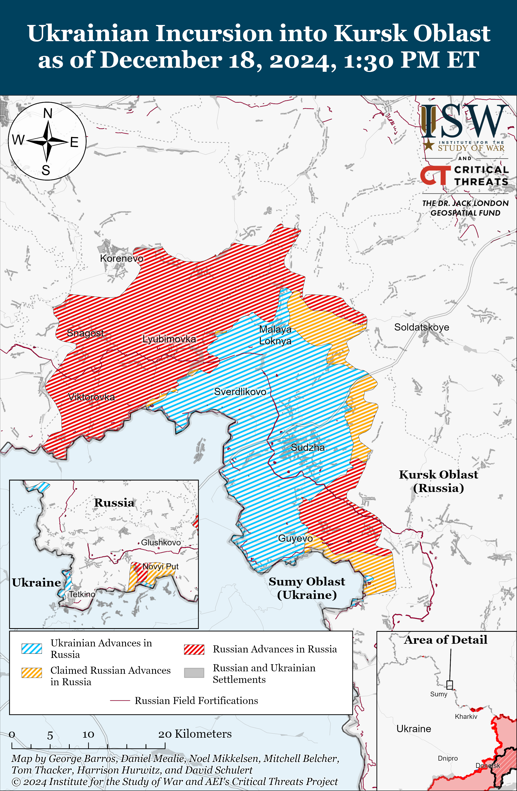](https://understandingwar.org/map/ukrainian-incursion-into-kursk-oblast-as-of-december-18-2024-130-pm-et/)

Russian sources continue to avoid acknowledging the deployment of North Korean troops to Kursk Oblast and to question continued Western reports that North Korean forces are operating in the area. The Ukrainian Security Service (SBU) stated on December 18 that radio intercepts indicate that North Korean forces suffered at least 220 casualties over the course of an unspecified “few days” of assaults in Kursk Oblast.[19] The *New York Times* reported on December 17 that a senior Pentagon official stated that Ukrainian forces have killed or wounded “several hundred” North Korean soldiers in Kursk Oblast and that North Korean forces do not have sufficient combat experience.[20] A Kremlin-affiliated Russian milblogger questioned the veracity of Western reporting and claimed on December 18 that there is no footage “unmistakably” showing captured or killed North Korean forces near Kremyanoye (east of Korenevo) and Plekhovo.[21] ISW continues to assess that the Kremlin will likely continue to avoid reporting on the deployment of North Korean forces in Kursk Oblast as doing so would tacitly acknowledge that Russia needs foreign troops to recapture its own territory and invalidate Russian President Vladimir Putin’s claims that the Ukrainian incursion into Kursk Oblast resulted in high Russian recruitment rates.[22]

**Russian Main Effort – Eastern Ukraine**

**Russian Subordinate Main Effort #1 – Kharkiv Oblast (Russian objective: Push Ukrainian forces back from the international border with Belgorod Oblast and approach to within tube artillery range of Kharkiv City)**

Russian forces recently marginally advanced in the Kharkiv direction amid continued offensive operations in the area on December 18. Geolocated footage published on December 18 indicates that Russian forces recently marginally advanced in central Vovchansk (northeast of Kharkiv City).[23] Russian forces continued attacking near Vovchansk on December 17 and 18.[24] A Russian milblogger claimed that Ukrainian forces counterattacked north of Kharkiv City toward Hlyboke (north of Kharkiv City), and a Ukrainian battalion commander stated on December 17 that Ukrainian forces recently gained a foothold near Hlyboke.[25] The battalion commander also warned that Russian sabotage and reconnaissance groups are disguising themselves in Ukrainian uniforms to penetrate Ukrainian units, which amounts to perfidy and constitutes a violation of the laws of war.[26]

[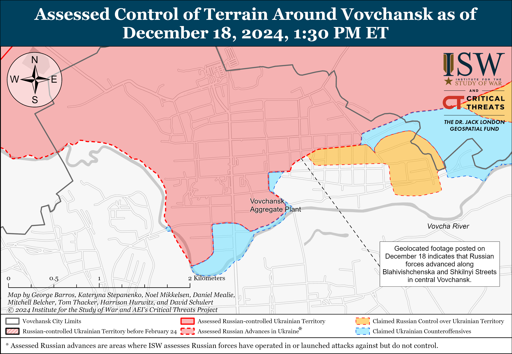](https://understandingwar.org/map/assessed-control-of-terrain-around-vovchansk-as-of-december-18-2024-130-pm-et/)[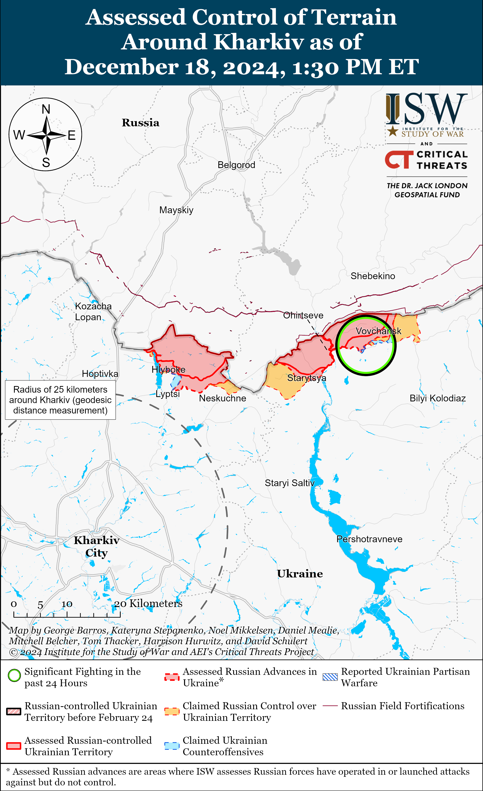](https://understandingwar.org/map/assessed-control-of-terrain-around-kharkiv-as-of-december-18-2024-130-pm-et/)

**Russian Subordinate Main Effort #2 – Luhansk Oblast (Russian objective: Capture the remainder of Luhansk Oblast and push westward into eastern Kharkiv Oblast and northern Donetsk Oblast)**

Russian forces recently marginally advanced in the Kupyansk and Kreminna directions amid continued offensive operations along the Kupyansk-Svatove-Kreminna line on December 18. Geolocated footage published on December 18 indicates that Russian forces recently marginally advanced in southern Dvorichna (north of Kupyansk) and east of Terny (northwest of Kreminna).[27] A Russian source claimed on December 18 that Russian forces pushed Ukrainian forces back approximately five kilometers from Tabaivka and improved positions near Lozova (both southeast of Kupyansk).[28] ISW has not observed visual confirmation of this claim, however. Russian forces continued attacking northeast of Kupyansk near Petropavlivka; southeast of Kupyansk near Lozova; southwest of Svatove near Novoyehorivka, Hrekivka, and Makiivka; west of Svatove near Nadiya and Zelenyi Hai; northwest of Kreminna near Terny and Yampolivka; and southwest of Kreminna in the Serebryanske forest area on December 17 and 18.[29] A Ukrainian battalion commander reported on December 17 that Russian forces have used nearly 100 armored and lightly armored vehicles near Kruhlyakivka (southeast of Kupyansk) over the past two and a half weeks (since roughly December 1) and that Ukrainian forces destroyed 90 of these vehicles.[30] The battalion commander stated that Russian forces entered Kruhlyakivka, but that Ukrainian forces prevented Russian forces from advancing toward Kolisnykivka (north of Kruhlyakivka). A Ukrainian drone crew commander operating in the area observed that Russian forces conduct daily infantry assaults in the Kupyansk and Lyman directions.[31] Russian drone operators from the Russian 27th Motorized Rifle Brigade (1st Guards Tank Army [GTA], Moscow Military District [MMD]) are reportedly operating near Kupyansk.[32]

[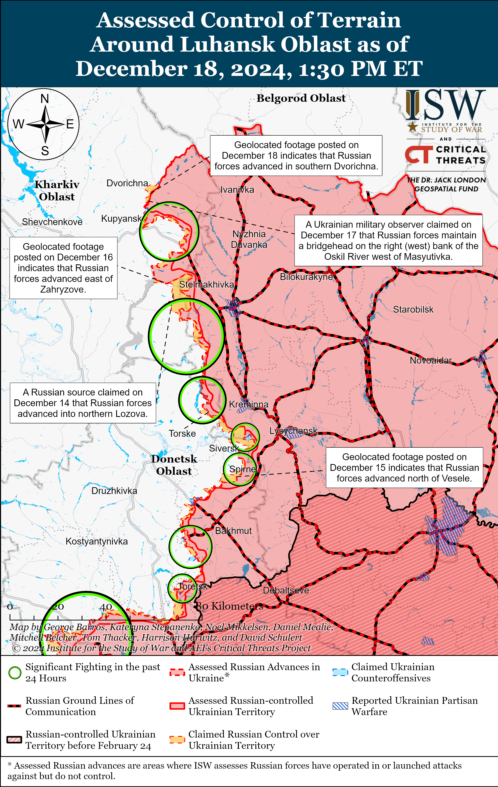](https://understandingwar.org/map/assessed-control-of-terrain-around-luhansk-oblast-as-of-december-18-2024-130-pm-et/)

**Russian Subordinate Main Effort #3 – Donetsk Oblast (Russian objective: Capture the entirety of Donetsk Oblast, the claimed territory of Russia’s proxies in Donbas)**

Russian forces continued offensive operations in the Siversk direction on December 18 but did not make any confirmed advances. Russian forces conducted offensive operations near Siversk itself, northeast of Siversk near Hryhorivka, and east of Siversk near Verkhnokamyanske on December 17 and 18.[33] The commander of a Ukrainian battalion operating in the Siversk direction reported that Russian forces took advantage of poor weather conditions to conduct an assault involving about 60 personnel, buggies, armored personnel carriers, and motorcycles on the night of December 17 to 18.[34] The commander stated the Russian forces recently increased the number of guided glide bomb strikes from 14 to 16 strikes during an unspecified previous week to over 30 strikes this week.[35] An officer in a Ukrainian brigade operating in the Siversk direction reported on December 18 that Russian forces have been displaying a higher level of training and coordination between units, which the officer attributed to recent command changes in the 3rd Combined Arms Army [CAA, formerly 2nd Luhansk People’s Republic Army Corps [LNR AC]).[36]

[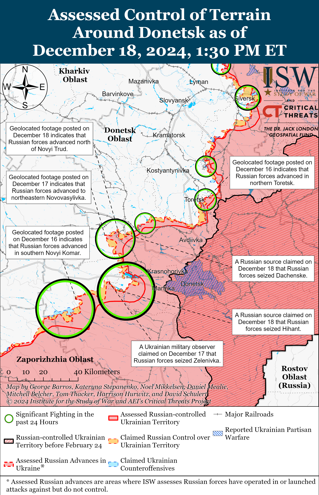](https://understandingwar.org/map/assessed-control-of-terrain-around-donetsk-as-of-december-18-2024-130-pm-et/)

Russian forces continued offensive operations near Chasiv Yar on December 18 but did not make any confirmed advances. Russian forces conducted offensive operations in and near Chasiv Yar itself, north of Chasiv Yar near Hryhorivka, and south of Chasiv Yar near Bila Hora and Stupochky on December 17 and 18.[37] Russian milbloggers claimed that fighting for the Refractory Plant in central Chasiv Yar is ongoing but that the configuration of Russian and Ukrainian positions within the plant is unclear.[38] Elements of the Russian “Hispaniola” Volunteer Brigade (Russian Volunteer Corps) and the 98th Airborne (VDV) Division are reportedly operating near Chasiv Yar.[39]

[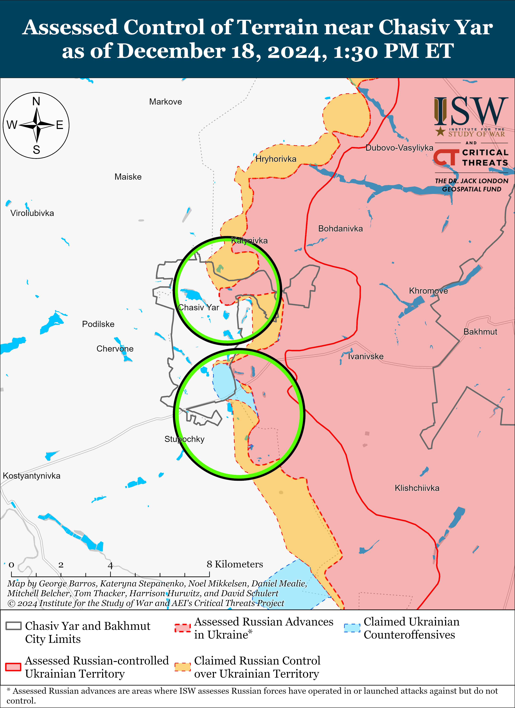](https://understandingwar.org/map/assessed-control-of-terrain-near-chasiv-yar-as-of-december-18-2024-130-pm-et/)

Both Ukrainian and Russian forces recently advanced near Toretsk amid continued Russian offensive operations in the area on December 18. Geolocated footage published on December 18 indicates that Ukrainian forces recently regained lost positions in southern Shcherbynivka (west of Toretsk).[40] Additional geolocated footage published on December 18 indicates that Russian forces marginally advanced west of Nelipivka (south of Toretsk).[41] A Russian milblogger claimed that Russian forces advanced towards the Tsentralna Mine in central Toretsk, but ISW has not observed confirmation of this claim.[42] Russian forces conducted offensive operations near Toretsk itself, west of Toretsk near Shcherbynivka, and north of Toretsk near Dyliivka on December 17 and 18.[43] Ukrainian Luhansk Group of Forces Spokesperson Major Anastasiya Bobovnikova reported on December 17 that fighting continues for the Tsentralna Mine and the nearby heights at the waste heaps.[44] Bobovnikova stated that it is too early to say that Russian forces have entered the mine. Elements of the Russian 9th Motorized Rifle Brigade (51st CAA, formerly 1st Donetsk People’s Republic’s [DNR] AC) are reportedly operating near Toretsk.[45]

[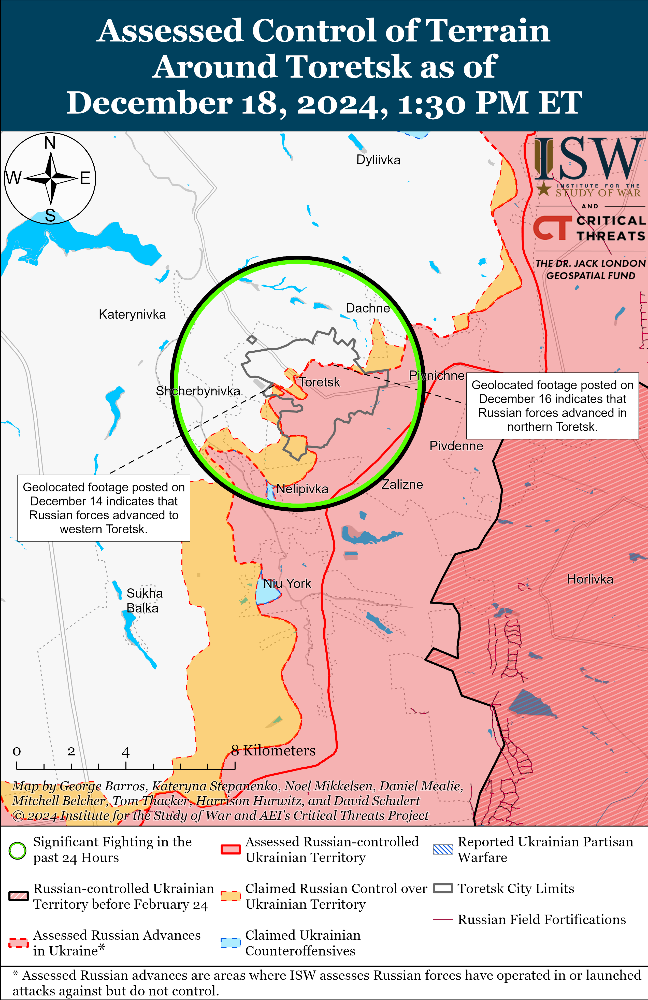](https://understandingwar.org/map/assessed-control-of-terrain-around-toretsk-as-of-december-18-2024-130-pm-et/)

Russian forces recently advanced near Pokrovsk amid continued offensive operations in the area on December 18. Geolocated footage published on December 18 indicates that Russian forces recently advanced near the railroad line north of Novyi Trud (south of Pokrovsk).[46] Russian milbloggers claimed that Russian forces seized half of Dachenske (south of Pokrovsk) and advanced near Novoolenivka (south of Pokrovsk), in an area 2.3 kilometers wide and 1.35 kilometers deep near Ukrainka (south of Pokrovsk), along a front up to 800 meters wide west of Novotroitske (southwest of Pokrovsk), and up to Vovkove (southwest of Pokrovsk).[47] ISW has not observed confirmation of these claims, however. A Russian source claimed that Russian forces are advancing from Novotroitske (southwest of Pokrovsk) towards Novovasylivka (west of Novotroitske) but that it is unclear if Russian forces have been able to secure a foothold.[48] Some Russian sources claimed that Russian forces have started assaults on Pishchane (southwest of Pokrovsk and northwest of Shevchenko) and advanced to the settlement’s outskirts, but another Russian source claimed that information about Russian positions in Pishchane is unconfirmed.[49] One Russian milblogger claimed on December 18 that Ukrainian forces counterattacked near Shevchenko.[50] Russian forces continued offensive operations east of Pokrovsk near Myrolyubivka and Promin; southeast of Pokrovsk near Lysivka and Sukhyi Yar; south of Pokrovsk near Dachenske, Zelene, Novyi Trud, Novooleksiivka, and Pushkine; and southwest of Pokrovsk near Novoolenivka, Novovasylivka, Novopustynka, Pishchane, Novotroitske, Solone, Shevchenko, Novoyelyzavetivka, and Ukrainka on December 17 and 18.[51] Ukrainian Donetsk Oblast Military Administration Head Vadym Filashkin reported on December 18 that Russian forces are roughly three kilometers away from Pokrovsk and that Ukrainian authorities have evacuated all children and their families from the city.[52]

[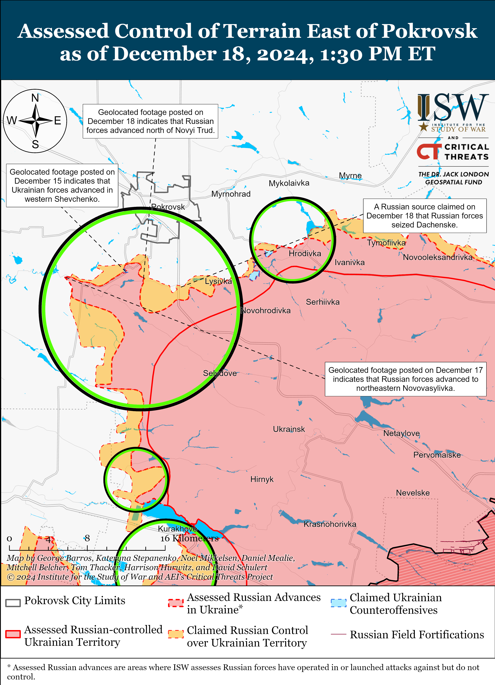](https://understandingwar.org/map/assessed-control-of-terrain-east-of-pokrovsk-as-of-december-18-2024-130-pm-et/)

Russian forces continued offensive operations in the Kurakhove direction on December 18 but did not make any confirmed advances. Ukraine’s Khortytsia Group of Forces reported that Ukrainian forces were unable to hold some positions on the southeastern outskirts of Sontsivka (northwest of Kurakhove) after Russian attacks in the area.[53] The Russian Ministry of Defense (MoD) claimed on December 18 that Russian forces seized Stari Terny (northwest of Kurakhove), although ISW assesses that Russian forces seized Stari Terny as of December 6.[54] Russian milbloggers claimed that Russian forces seized the remaining part of Sontsivka and advanced in Kurakhove, west of Sontsivka and Zorya (northwest of Kurakhove), between Sontsivka and Berestky (northwest of Kurakhove and southeast of Sontsivka), and towards Dachne.[55] A Russian milblogger claimed that elements of the Russian 114th Motorized Rifle Brigade (51st CAA) are advancing in Shevchenko (northwest of Kurakhove).[56] ISW has not observed confirmation of these claims, however. A Russian milblogger claimed that Russian positions southwest of Stari Terny are less than one kilometer from Dachne, but ISW has only observed geolocated evidence to assess that Russian forces near Stari Terny are roughly 2.2 kilometers from Dachne.[57] Russian forces continued attacking near Kurakhove itself; northwest of Kurakhove near Stari Terny, Sontsivka, and Petropavlivka; and west of Kurakhove near Dachne on December 17 and 18.[58] Elements of the Russian 5th Tank Brigade (36th CAA, Eastern Military District [EMD]) and 33rd and 255th motorized rifle regiments (both of the 20th Motorized Rifle Division, 8th CAA, Southern Military District [SMD]) are reportedly operating in the Kurakhove direction.[59] Elements of the Russian 68th Tank Regiment (150th Motorized Rifle Division, 8th CAA, SMD) are reportedly operating near Kurakhove, and drone operators of the Russian 39th Motorized Rifle Brigade (68th AC, EMD) are reportedly operating near Ostrivske (northeast of Kurakhove).[60]

Russian forces continued offensive operations in the Vuhledar direction on December 18 but did not make any confirmed advances. Russian milbloggers claimed that Russian forces operating northwest of Vuhledar advanced towards Kostyantynopil and Ulaky (east of Kostyantynopil) and are one kilometer from Kostyantynopil and three kilometers from Rozlyv (southwest of Kostyantynopil) and that Russian forces seized Zelenivka and Hihant (both southeast of Kostyantynopil) and advanced one kilometer deep and 2.5 kilometers wide near Zelenivka.[61] Russian milbloggers claimed that the Russian 255th Regiment (20th Motorized Rifle Division, 8th CAA, SMD) participated in the seizure of Uspenivka and that Russian forces also recently seized Kostyantynopolske (both north of Vuhledar).[62] Russian forces continued attacking northwest of Vuhledar near Kostyantynopolske, Sukhi Yaly, Zelenivka, Rozlyv, and Yantarne on December 17 and 18.[63] Elements of the Russian 1472nd Motorized Rifle Regiment (68th Army Corps [AC], EMD) are reportedly operating near Kostyantynopolske.[64]

[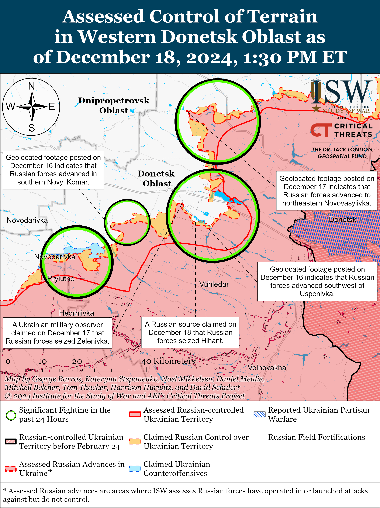](https://understandingwar.org/map/assessed-control-of-terrain-in-western-donetsk-oblast-as-of-december-18-2024-130-pm-et/)

Russian forces continued offensive operations near Velyka Novosilka on December 18 but did not make any confirmed advances. Ukraine’s Khortytsia Group of Forces reported on December 18 that Ukrainian forces were unable to hold some unspecified positions following Russian attacks near Novyi Komar (north of Velyka Novosilka).[65] Russian milbloggers claimed that Russian forces seized Novyi Komar and Makarivka (south of Velyka Novosilka) and advanced north of Makarivka and in an area 1.5 kilometers by one kilometer near Storozheve (south of Velyka Novosilka).[66] A Russian source claimed that Russian forces crossed the Mokri Yaly River while attacking Storozheve.[67] ISW has not observed confirmation of these claims, however. Russian forces conducted offensive operations near Velyka Novosilka itself; south of Velyka Novosilka near Storozheve and Blahodatne; southeast of Velyka Novosilka near Novodarivka; east of Velyka Novosilka in the direction of Temyrivka and Novopil; north of Velyka Novosilka near Novyi Komar; and northeast of Velyka Novosilka near Rozdolne on December 17 and 18.[68] A Russian source claimed that Ukrainian forces are counterattacking near Velyka Novosilka.[69] Elements of the Russian 40th Naval Infantry Brigade (Pacific Fleet, EMD) are reportedly operating near Novyi Komar, and snipers of the 5th Tank Brigade (36th CAA, EMD) are reportedly operating near Velyka Novosilka.[70]

**Russian Supporting Effort – Southern Axis (Russian objective: Maintain frontline positions and secure rear areas against Ukrainian strikes)**

Russian forces continued assaults in western Zaporizhia Oblast near Novoandriivka (northwest of Robotyne) and Novodanylivka and in the direction of Orikhiv (both north of Robotyne) on December 17 and 18 but did not make confirmed advances.[71] A Russian milblogger claimed that Russian forces advanced to the eastern outskirts of Bilohirya (northeast of Robotyne), but ISW has not observed confirmation of these claims.[72] Ukraine’s Southern Operational Command reported on December 18 that Russian forces continued to conduct reconnaissance for future assaults in the Hulyaipole and Orikhiv directions.[73]

Russian sources, including Zaporizhia Oblast occupation head Yevgeny Balitsky, claimed on December 18 that Ukrainian forces launched four likely Storm Shadow missiles at occupied Berdyansk and Tokmak, Zaporizhia Oblast but did not strike the intended targets.[74]

[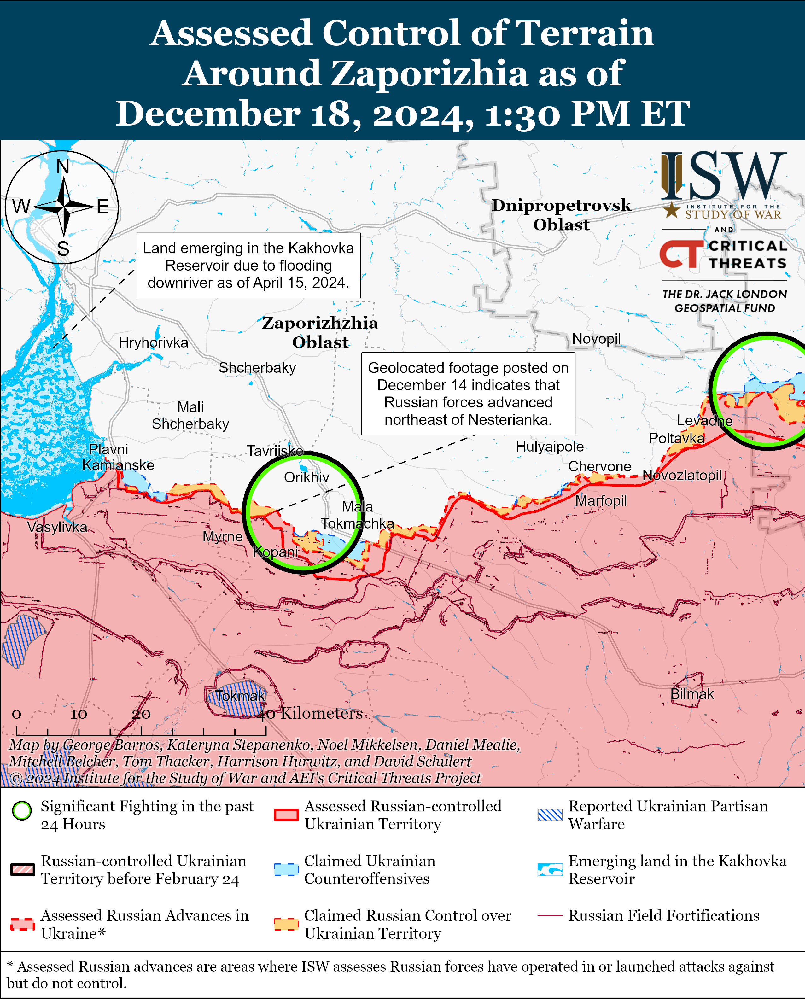](https://understandingwar.org/map/assessed-control-of-terrain-around-zaporizhia-as-of-december-18-2024-130-pm-et/)

Russian forces continued assaults in the Dnipro direction, including in east (left) bank Kherson Oblast, on December 17 and 18 but did not make confirmed advances.[75]

[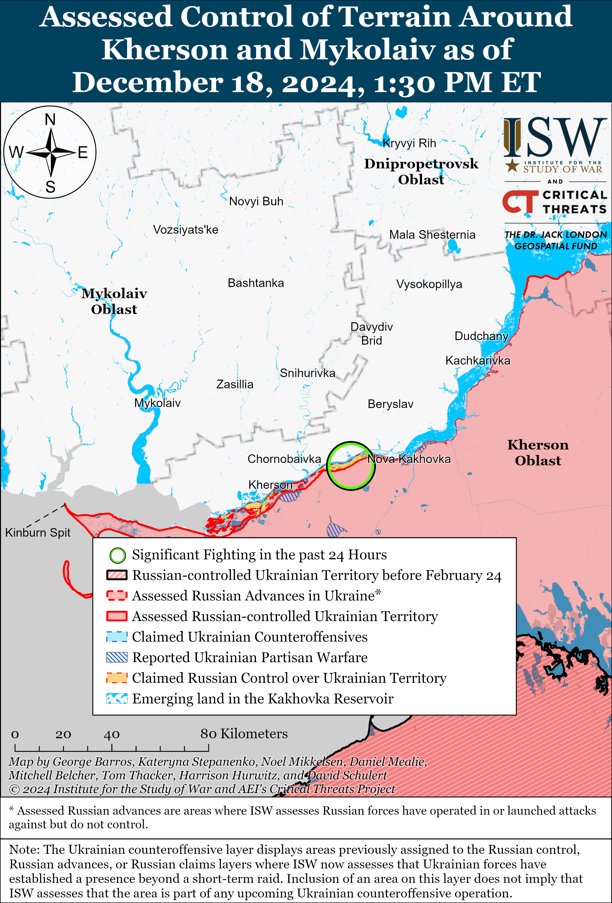](https://understandingwar.org/map/assessed-control-of-terrain-around-kherson-and-mykolaiv-as-of-december-18-2024-130-pm-et/)

Crimean occupation officials claimed on December 17 and 18 that Russian authorities are able to disconnect the mobile internet in occupied Sevastopol, Crimea with no advanced warning at any time due to unspecified “security concerns.”[76] Sevastopol occupation governor Mikhail Razvozhayev stated that residents are able to send text messages and make calls in the event of an internet outage. A Kremlin-affiliated Russian milblogger claimed that Russian authorities likely want to block mobile internet access in occupied Crimea in order to prevent Ukrainian drones that use local SIM cards from striking their intended targets and Ukrainian partisans from reporting on the aftermath of Ukrainian drone strikes.[77]

**Russian Air, Missile, and Drone Campaign (Russian Objective: Target Ukrainian military and civilian infrastructure in the rear and on the frontline)**

Russian forces conducted a series of drone strikes on Ukraine on the night of December 17 to 18. The Ukrainian Air Force reported that Russian forces launched 81 Shahed drones and other types of drones from Bryansk, Kursk, and Oryol oblasts and Millerovo, Rostov Oblast.[78] The Ukrainian Air Force reported that Ukrainian forces downed 51 drones over Poltava, Sumy, Kharkiv, Kyiv, Zhytomyr, Khmelnytskyi, Cherkasy, Kirovohrad, Dnipropetrovsk, and Zaporizhia oblasts and that 30 drones were “lost” due to Ukrainian countermeasures.

**Russian Mobilization and Force Generation Efforts (Russian objective: Expand combat power without conducting general mobilization)**

The Russian Ministry of Defense (MoD) is increasingly tricking conscripts into signing military service contracts to fight in Ukraine likely in an effort to generate more assault forces and maintain the tempo of Russian offensive operations in Ukraine. *Radio Free Europe/Radio Liberty’s* Tatar-Bashkir Service *Idel Realii* reported on December 18 that the parents of Russian conscripts serving in a Russian military unit in Chebarkul, Chelyabinsk Oblast wrote an appeal to submit to Russian President Vladimir Putin’s Direct Line engagement on December 19, claiming that the Russian military has coerced and forced their children into signing Russian military service contracts.[79] Russian opposition outlet *Mobilization News* reported on December 18 that a Russian conscript from Pskov Oblast recently died in occupied Zaporizhia Oblast due to unknown causes.[80]

Russian Chief of the General Staff Army General Valery Gerasimov stated on December 18 in a briefing to foreign military attaches that the Russian Aerospace Forces (VKS) is finishing forming its first S-500 air defense system regiment.[81] Gerasimov added that the Russian military is also completing tests of *Prince Pozharsky* Borei-A class nuclear-powered ballistic missile submarine and that the Russian military plans to add two additional Borei-A class submarines to the Russian Navy by 2028.[82]

Ukrainian military observer Petro Chernyk stated on December 18 that Ukrainian forces have damaged and destroyed up to 28 Russian surface ships since the start of Russia’s full-scale invasion of Ukraine in February 2022.[83] Chernyk added that Ukrainian forces have damaged and destroyed 10 of the Russian Black Sea Fleet’s (BSF) 15 landing ships but that the BSF still has 20 Kalibr cruise missile carriers in service. Chernyk also stated that destroying landing-class ships is particularly important because Russia relies on these ships to transport supplies to occupied Crimea, and Russia is no longer capable of building landing-class ships. Ukrainian Navy Spokesperson Captain Third Rank Dmytro Pletenchuk reported in February 2024 that the BSF had almost 80 pieces of naval combat equipment at the start of Russia’s full-scale invasion of Ukraine.[84]

**Russian Technological Adaptations (Russian objective: Introduce technological innovations to optimize systems for use in Ukraine)**

Nothing significant to report.

**Activities in Russian-occupied areas (Russian objective: Consolidate administrative control of annexed areas; forcibly integrate Ukrainian citizens into Russian sociocultural, economic, military, and governance systems)**

*ISW is not publishing coverage of activities in Russian-occupied areas today.*

**Significant activity in Belarus (Russian efforts to increase its military presence in Belarus and further integrate Belarus into Russian-favorable frameworks)**

Nothing significant to report.

**Note: ISW does not receive any classified material from any source, uses only publicly available information, and draws extensively on Russian, Ukrainian, and Western reporting and social media as well as commercially available satellite imagery and other geospatial data as the basis for these reports. References to all sources used are provided in the endnotes of each update.**

[1] https://t.me/akovalenko1989/8461

[2] https://t.me/tass\_agency/291773 ; https://t.me/milinfolive/137892 ; https://t.me/milinfolive/137895

[3] https://t.me/vchkogpu/53381 ; https://t.me/RVvoenkor/82901 ; https://t.me/milinfolive/137892 ; https://t.me/bbcrussian/74294

[4] https://www.rheinmetall.com/en/media/news-watch/news/2024/12/2024-12-18-rheinmetall-supplies-artillery-propelling-charges-to-ukraine

[5] https://en.defence-ua.com/industries/ukraine\_orders\_an\_urgent\_supply\_of\_artillery\_propellant\_charges\_from\_rheinmetall\_for\_9\_million-12901.html ; https://en.defence-ua.com/news/sbs\_south\_korea\_doesnt\_want\_to\_sell\_weapons\_to\_ukraine\_what\_kyiv\_was\_hoping\_to\_acquire-12684.html

[6] https://neighbourhood-enlargement.ec.europa.eu/news/commission-disburses-second-regular-payment-eu41-billion-under-ukraine-facility-2024-12-18\_en

[7] https://www.reuters.com/world/nato-takes-over-coordination-military-aid-kyiv-us-source-says-2024-12-17/

[8] https://t.me/mod\_russia/47009

[9] https://t.me/mod\_russia/46882

[10] https://isw.pub/UkrWar120524

[11] https://t.me/tass\_agency/291334; https://t.me/mod\_russia/46928

[12] https://tass dot ru/proisshestviya/22700187

[13] https://tass dot ru/proisshestviya/22700267

[14] https://t.me/uzembassy\_ru/4461

[15] https://t.me/inners\_of\_the\_politics/215 ; https://t.me/dva\_majors/60489 ; https://t.me/dva\_majors/60491 ; https://t.me/vysokygovorit/18312 ; https://t.me/MedvedevVesti/19436 ; https://t.me/vysokygovorit/18313

[16] https://t.me/z\_arhiv/30131 ; https://t.me/dva\_majors/60475; https://t.me/boris\_rozhin/148211

[17] https://armyinform dot com.ua/2024/12/17/kupy-chornyh-trupiv-na-snigu-desantnykiv-na-kurshhyni-zalyvayut-hvylyamy-myasnyh-shturmiv/ ; https://www.youtube.com/watch?v=j5TqaWCCdUg

[18] https://t.me/motopatriot/30663; https://t.me/mod\_russia/46994; https://t.me/RKadyrov\_95/5340

[19] https://t.me/SBUkr/13615

[20] https://www.nytimes.com/2024/12/17/us/politics/ukraine-aid-biden-trump.html?register=email&amp;auth=register-email

[21] https://t.me/rybar/66443

[22] https://understandingwar.org/backgrounder/russian-offensive-campaign-assessment-december-17-2024

[23] https://t.me/hart\_brigade/263 ; https://x.com/Bielitzling/status/1869437701566681470

[24] https://t.me/otukharkiv/3104 ; https://www.facebook.com/GeneralStaff.ua/posts/pfbid04DMXr4554AQPhqqJ2df6uMw26UKSYgg1VHPvUoEYTk7rV6PWcABuhjy8nPW4eQ68l ; https://www.facebook.com/GeneralStaff.ua/posts/pfbid0N32dXYH1uwbWZw6Y9tx1DdFkH9wkGNFYnP3erxz1AEDe6pCC6UZeASjsxugvvw36l ; https://www.facebook.com/GeneralStaff.ua/posts/pfbid0226AWaDq8RTct7UsERwbfZ9EwQLm8xTXzfsb565YP1ycw6Y3ZHkCdL78ojADQPiz8l

[25] https://t.me/DnevnikDesantnika/21158 ; https://suspilne dot media/kharkiv/904985-postijne-perevdaganna-v-ukrainsku-formu-udari-po-medevaku-ta-zahid-v-kruglakivku-fedorenko-pro-dii-rf-na-harkivsini/

[26] https://suspilne dot media/kharkiv/904985-postijne-perevdaganna-v-ukrainsku-formu-udari-po-medevaku-ta-zahid-v-kruglakivku-fedorenko-pro-dii-rf-na-harkivsini/

[27] https://t.me/creamy\_caprice/7847 ; https://t.me/DeepStateUA/20933 ; https://t.me/OMIBr\_60/707 ; https://x.com/MikiValbuena/status/1869415502784999920; https://x.com/MikiValbuena/status/1869416010610266347; https://x.com/PuenteUribarri/status/1869406238255268194

[28] https://t.me/tass\_agency/291624 ; https://t.me/tass\_agency/291631

[29] https://www.facebook.com/GeneralStaff.ua/posts/pfbid04DMXr4554AQPhqqJ2df6uMw26UKSYgg1VHPvUoEYTk7rV6PWcABuhjy8nPW4eQ68l ; https://www.facebook.com/GeneralStaff.ua/posts/pfbid0N32dXYH1uwbWZw6Y9tx1DdFkH9wkGNFYnP3erxz1AEDe6pCC6UZeASjsxugvvw36l ; https://www.facebook.com/GeneralStaff.ua/posts/pfbid0226AWaDq8RTct7UsERwbfZ9EwQLm8xTXzfsb565YP1ycw6Y3ZHkCdL78ojADQPiz8l ; https://www.facebook.com/GeneralStaff.ua/posts/pfbid04DMXr4554AQPhqqJ2df6uMw26UKSYgg1VHPvUoEYTk7rV6PWcABuhjy8nPW4eQ68l ; https://www.facebook.com/GeneralStaff.ua/posts/pfbid0N32dXYH1uwbWZw6Y9tx1DdFkH9wkGNFYnP3erxz1AEDe6pCC6UZeASjsxugvvw36l ; https://www.facebook.com/GeneralStaff.ua/posts/pfbid0226AWaDq8RTct7UsERwbfZ9EwQLm8xTXzfsb565YP1ycw6Y3ZHkCdL78ojADQPiz8l

[30] https://suspilne dot media/kharkiv/904985-postijne-perevdaganna-v-ukrainsku-formu-udari-po-medevaku-ta-zahid-v-kruglakivku-fedorenko-pro-dii-rf-na-harkivsini/

[31] https://www.youtube.com/watch?v=j5TqaWCCdUg; https://armyinform.com dot ua/2024/12/18/yakshho-ne-jdesh-v-shturm-tebe-obnulyat-pekelna-aryfmetyka-vid-rosijskyh-oficzeriv/

[32] https://t.me/RVvoenkor/82873

[33]https://www.facebook.com/GeneralStaff.ua/posts/pfbid0226AWaDq8RTct7UsERwbfZ9EwQLm8xTXzfsb565YP1ycw6Y3ZHkCdL78ojADQPiz8l ; https://www.facebook.com/GeneralStaff.ua/posts/pfbid0N32dXYH1uwbWZw6Y9tx1DdFkH9wkGNFYnP3erxz1AEDe6pCC6UZeASjsxugvvw36l ; https://www.facebook.com/GeneralStaff.ua/posts/pfbid04DMXr4554AQPhqqJ2df6uMw26UKSYgg1VHPvUoEYTk7rV6PWcABuhjy8nPW4eQ

[34] https://suspilne dot media/donbas/905205-sturmi-vden-i-vnoci-u-bataljoni-k-2-rozpovili-pro-boi-bila-siverska/

[35] https://armyinform dot com.ua/2024/12/18/nespodivanyj-soyuznyk-okupantiv-dopomagaye-vorogu-shturmuvaty-poblyzu-siverska/

[36] https://www.youtube.com/watch?v=ScdUZNkwcYc; https://armyinform.com dot ua/2024/12/18/vidpravyly-na-pensiyu-rosijskogo-komandarma-teper-zahysnyky-siverska-hochut-zvilnyty-jogo-nastupnyka/ ; https://understandingwar.org/wp-content/uploads/2024/12/Russian20Offensive20Campaign20Assessment20December20152C2020242028PDF29.pdf ; https://understandingwar.org/backgrounder/russian-offensive-campaign-assessment-december-13-2024

[37]https://www.facebook.com/GeneralStaff.ua/posts/pfbid0226AWaDq8RTct7UsERwbfZ9EwQLm8xTXzfsb565YP1ycw6Y3ZHkCdL78ojADQPiz8l ; https://www.facebook.com/GeneralStaff.ua/posts/pfbid0N32dXYH1uwbWZw6Y9tx1DdFkH9wkGNFYnP3erxz1AEDe6pCC6UZeASjsxugvvw36l ; https://www.facebook.com/GeneralStaff.ua/posts/pfbid04DMXr4554AQPhqqJ2df6uMw26UKSYgg1VHPvUoEYTk7rV6PWcABuhjy8nPW4eQ68l ; https://t.me/Khortytsky\_wind/3482

[38] https://t.me/DnevnikDesantnika/21121 ; https://t.me/wargonzo/23797

[39] https://t.me/tass\_agency/291653 ; https://t.me/boris\_rozhin/148174

[40] https://x.com/AudaxonX/status/1869328233440940521 ; https://t.me/nm\_dnr/13114

[41] https://x.com/AudaxonX/status/1869321420188373052 ; https://t.me/ngu\_3005/2476

[42] https://t.me/rybar/66445

[43]https://www.facebook.com/GeneralStaff.ua/posts/pfbid0226AWaDq8RTct7UsERwbfZ9EwQLm8xTXzfsb565YP1ycw6Y3ZHkCdL78ojADQPiz8l ; https://www.facebook.com/GeneralStaff.ua/posts/pfbid0N32dXYH1uwbWZw6Y9tx1DdFkH9wkGNFYnP3erxz1AEDe6pCC6UZeASjsxugvvw36l ; https://www.facebook.com/GeneralStaff.ua/posts/pfbid04DMXr4554AQPhqqJ2df6uMw26UKSYgg1VHPvUoEYTk7rV6PWcABuhjy8nPW4eQ68l

[44] https://suspilne dot media/donbas/904883-za-sahtu-centralna-tocatsa-skladni-boi-otuv-lugansk-pro-situaciu-u-torecku/

[45]https://t.me/RVvoenkor/82885 ; https://t.me/nm\_dnr/13114 ; https://x.com/AudaxonX/status/1869328233440940521 ; https://t.me/nm\_dnr/13114

[46] https://t.me/creamy\_caprice/7852 ; https://x.com/CinC\_AFU/status/1869313052572823562

[47]https://t.me/voenkorKotenok/60800 ; https://t.me/rybar/66441 ; https://t.me/RVvoenkor/82907 ; https://t.me/boris\_rozhin/148234 ; https://t.me/boris\_rozhin/148252

[48] https://t.me/rybar/66441

[49] https://t.me/RVvoenkor/82907 ; https://t.me/dva\_majors/60475 ; https://t.me/rybar/66441

[50] https://t.me/boris\_rozhin/148252

[51]https://www.facebook.com/GeneralStaff.ua/posts/pfbid0226AWaDq8RTct7UsERwbfZ9EwQLm8xTXzfsb565YP1ycw6Y3ZHkCdL78ojADQPiz8l ; https://www.facebook.com/GeneralStaff.ua/posts/pfbid0N32dXYH1uwbWZw6Y9tx1DdFkH9wkGNFYnP3erxz1AEDe6pCC6UZeASjsxugvvw36l ; https://www.facebook.com/GeneralStaff.ua/posts/pfbid04DMXr4554AQPhqqJ2df6uMw26UKSYgg1VHPvUoEYTk7rV6PWcABuhjy8nPW4eQ68l ; https://t.me/Khortytsky\_wind/3482 ; https://t.me/dva\_majors/60475 ; https://t.me/DnevnikDesantnika/21121 ; https://t.me/voenkorKotenok/60800

[52] https://suspilne dot media/donbas/903185-z-pokrovska-evakuuvali-vsih-ditej-filaskin/ ; https://www.youtube.com/watch?v=j5TqaWCCdUg

[53] https://t.me/Khortytsky\_wind/3482

[54] https://t.me/mod\_russia/46996; https://understandingwar.org/backgrounder/russian-offensive-campaign-assessment-december-6-2024

[55] https://t.me/voenkorKotenok/60800; https://t.me/RVvoenkor/82907; https://t.me/boris\_rozhin/148234; https://t.me/DnevnikDesantnika/21135; https://t.me/dva\_majors/60475

[56] https://t.me/voenkorKotenok/60801;

[57] https://t.me/voenkorKotenok/60801

[58] https://www.facebook.com/GeneralStaff.ua/posts/pfbid0226AWaDq8RTct7UsERwbfZ9EwQLm8xTXzfsb565YP1ycw6Y3ZHkCdL78ojADQPiz8l; https://www.facebook.com/GeneralStaff.ua/posts/pfbid0N32dXYH1uwbWZw6Y9tx1DdFkH9wkGNFYnP3erxz1AEDe6pCC6UZeASjsxugvvw36l; https://www.facebook.com/GeneralStaff.ua/posts/pfbid04DMXr4554AQPhqqJ2df6uMw26UKSYgg1VHPvUoEYTk7rV6PWcABuhjy8nPW4eQ68l; https://t.me/voenkorKotenok/60801; https://t.me/RVvoenkor/82907; https://www.youtube.com/watch?v=j5TqaWCCdUg; https://armyinform dot com.ua/2024/12/18/shalenyj-opir-atakam-z-pivdnya-okupanty-shturmuyut-kurahove/; https://t.me/Khortytsky\_wind/3482

[59] https://t.me/bronya\_03/3474 ; https://t.me/voin\_dv/12341; https://t.me/dva\_majors/60483

[60] https://t.me/RVvoenkor/82918; https://t.me/nm\_dnr/13115

[61] https://t.me/voenkorKotenok/60801; https://t.me/tass\_agency/291622; https://t.me/RVvoenkor/82899 ; https://t.me/DeepStateUA/20934; https://t.me/dva\_majors/60475; https://t.me/DnevnikDesantnika/21121; https://t.me/voin\_dv/12349 ; https://t.me/dva\_majors/60514; https://t.me/voenkorKotenok/60801; https://t.me/boris\_rozhin/148234; https://t.me/voenkorKotenok/60801; https://t.me/DnevnikDesantnika/21135

[62] https://t.me/nm\_dnr/13122; https://t.me/wargonzo/23797; https://t.me/RVvoenkor/82899 ; https://t.me/DeepStateUA/20934; https://t.me/DnevnikDesantnika/21121; https://t.me/boris\_rozhin/148234; https://t.me/dva\_majors/60475; https://t.me/voenkorKotenok/60792; https://t.me/RVvoenkor/82914

[63] https://www.facebook.com/GeneralStaff.ua/posts/pfbid0N32dXYH1uwbWZw6Y9tx1DdFkH9wkGNFYnP3erxz1AEDe6pCC6UZeASjsxugvvw36l; https://www.facebook.com/GeneralStaff.ua/posts/pfbid04DMXr4554AQPhqqJ2df6uMw26UKSYgg1VHPvUoEYTk7rV6PWcABuhjy8nPW4eQ68l; https://www.facebook.com/GeneralStaff.ua/posts/pfbid0226AWaDq8RTct7UsERwbfZ9EwQLm8xTXzfsb565YP1ycw6Y3ZHkCdL78ojADQPiz8l; https://www.facebook.com/GeneralStaff.ua/posts/pfbid0N32dXYH1uwbWZw6Y9tx1DdFkH9wkGNFYnP3erxz1AEDe6pCC6UZeASjsxugvvw36l; https://www.facebook.com/GeneralStaff.ua/posts/pfbid04DMXr4554AQPhqqJ2df6uMw26UKSYgg1VHPvUoEYTk7rV6PWcABuhjy8nPW4eQ68l; https://t.me/Khortytsky\_wind/3482; https://t.me/wargonzo/23797

[64] https://t.me/voin\_dv/12344

[65] https://t.me/Khortytsky\_wind/3482

[66] https://t.me/rybar/66433; https://t.me/dva\_majors/60475; https://t.me/voin\_dv/12349; https://t.me/boris\_rozhin/148234; https://t.me/voenkorKotenok/60792

[67] https://t.me/tass\_agency/291625

[68] https://t.me/voenkorKotenok/60802; https://www.facebook.com/GeneralStaff.ua/posts/pfbid0226AWaDq8RTct7UsERwbfZ9EwQLm8xTXzfsb565YP1ycw6Y3ZHkCdL78ojADQPiz8l ; https://www.facebook.com/GeneralStaff.ua/posts/pfbid0N32dXYH1uwbWZw6Y9tx1DdFkH9wkGNFYnP3erxz1AEDe6pCC6UZeASjsxugvvw36l; https://www.facebook.com/GeneralStaff.ua/posts/pfbid04DMXr4554AQPhqqJ2df6uMw26UKSYgg1VHPvUoEYTk7rV6PWcABuhjy8nPW4eQ68l; https://t.me/rybar/66433; https://t.me/dva\_majors/60514; https://t.me/Khortytsky\_wind/3482; https://t.me/Khortytsky\_wind/3464

[69] https://t.me/voin\_dv/12349

[70] https://t.me/voin\_dv/12349; https://t.me/voin\_dv/12347

[71] https://www.facebook.com/GeneralStaff.ua/posts/pfbid0226AWaDq8RTct7UsERwbfZ9EwQLm8xTXzfsb565YP1ycw6Y3ZHkCdL78ojADQPiz8l ; https://www.facebook.com/GeneralStaff.ua/posts/pfbid0N32dXYH1uwbWZw6Y9tx1DdFkH9wkGNFYnP3erxz1AEDe6pCC6UZeASjsxugvvw36l ; https://www.facebook.com/GeneralStaff.ua/posts/pfbid04DMXr4554AQPhqqJ2df6uMw26UKSYgg1VHPvUoEYTk7rV6PWcABuhjy8nPW4eQ68l

[72] https://t.me/DnevnikDesantnika/21140

[73] https://www.facebook.com/OperationalCommandSouth/posts/pfbid02cvSeWcK4ArC7dHrKPFYiq4qZcz4YRE3njcJXhYsHzoBJaGYHwYxkzp4oYwp5EqSCl

[74] https://t.me/BalitskyEV/4479 ; https://t.me/vrogov/18321 ; https://t.me/RVvoenkor/82912?single

[75] https://www.facebook.com/GeneralStaff.ua/posts/pfbid0N32dXYH1uwbWZw6Y9tx1DdFkH9wkGNFYnP3erxz1AEDe6pCC6UZeASjsxugvvw36l ; https://www.facebook.com/GeneralStaff.ua/posts/pfbid04DMXr4554AQPhqqJ2df6uMw26UKSYgg1VHPvUoEYTk7rV6PWcABuhjy8nPW4eQ68l ; https://www.facebook.com/OperationalCommandSouth/posts/pfbid02cvSeWcK4ArC7dHrKPFYiq4qZcz4YRE3njcJXhYsHzoBJaGYHwYxkzp4oYwp5EqSCl

[76] https://t.me/razvozhaev/9271 ; https://t.me/tass\_agency/291579

[77] https://t.me/rybar/66429

[78] https://t.me/kpszsu/25043

[79] https://t.me/idelrealii/39082 ; https://t.me/astrapress/70507

[80] https://t.me/mobilizationnews/21388

[81] https://t.me/mod\_russia/47013

[82] https://t.me/mod\_russia/47012

[83] https://armyinform.com dot ua/2024/12/18/pognaly-poganym-vinykom-ekspert-pro-unikalni-uspihy-syl-oborony-u-chornomu-mori/

[84] https://isw.pub/UkrWar021524
