# Russian Offensive Campaign Assessment, December 19, 2024

**Kateryna Stepanenko, Angelica Evans, Christina Harward, Nicole Wolkov, Grace Mappes, Nate Trotter, Olivia Gibson, William Runkel, and Frederick W. Kagan**

**December 19, 2024, 10:20 pm ET**

**Click** [**here**](https://storymaps.arcgis.com/stories/36a7f6a6f5a9448496de641cf64bd375) **to see ISW’s interactive map of the Russian invasion of Ukraine. This map is updated daily alongside the static maps present in this report.**

**Click** [**here**](https://storymaps.arcgis.com/stories/83a2f24901c941d581c0c523ecd2619b)**to see ISW’s interactive map of Ukraine’s offensive in Kursk Oblast.**

**Click** [**here**](https://understandingwar.maps.arcgis.com/apps/instant/3dviewer/index.html?appid=1602762dbcde419bb957dea358449580) **to see ISW’s 3D control of terrain topographic map of Ukraine. Use of a computer (not a mobile device) is strongly recommended for using this data-heavy tool.**

**Click** [**here**](https://storymaps.arcgis.com/stories/733fe90805894bfc8562d90b106aa895) **to access ISW’s archive of interactive time-lapse maps of the Russian invasion of Ukraine. These maps complement the static control-of-terrain map that ISW produces daily by showing a dynamic frontline. ISW will update this time-lapse map archive monthly.**

**Note: The data cut-off for this product was 1:00 pm ET on December 19. ISW will cover subsequent reports in the December 20 Russian Offensive Campaign Assessment.**

**Russian President Vladimir Putin said that he should have violated the ceasefire he had imposed on Ukraine in 2014 by launching a full-scale invasion even earlier when asked to reflect on his 2022 decision to attack.** Putin responded to a media question during his annual Direct Line televised press conference on December 19 on whether he would change his decision to launch the full-scale invasion of Ukraine if he had it to do over again, stating that he should have made this decision earlier.[1] Putin added that Russia should have systematically prepared ahead of the full-scale invasion and falsely claimed that Russia “spontaneously” invaded Ukraine in 2022 after Ukraine “directly” announced that it would not abide by the Minsk II Accords.

The Minsk II Accords were extremely favorable to Russia, imposing a set of commitments on Ukraine that surrendered core elements of Ukrainian sovereignty and allowing Russian proxies supported by Russian military forces to continue to occupy the areas they had seized during their initial invasions in 2014. The accords imposed no obligations on Russia — which was party to the negotiations as an alleged neutral mediator.[2] They established a “ceasefire” that Russian proxies continually violated with Russian support.[3] The Minsk II Accords also accepted the false Russian narrative that Russian proxies in Ukraine were independent of Moscow, and Putin insisted that Ukraine uphold its commitments even as the proxies, operating directly on orders from Moscow, violated their own obligations.[4] The Minsk II Accords did not require Russia to withdraw its armed forces from occupied areas of Ukraine, and Russia used positions in the occupied areas as staging areas for the 2022 full-scale invasion.

**Putin insisted that negotiations with Ukraine must be based on the same demands he made before the invasion and at the moment of Russia’s greatest territorial gains, despite the fact that Ukraine has secured Kyiv and liberated much of the territory his forces held at that time.** Putin said during Direct Line that he is ready to hold talks with Ukraine without preconditions, that any talks must be based on what Russia and Ukraine had agreed upon during negotiations in Istanbul in March 2022, when Russian troops were advancing on Kyiv and throughout eastern and southern Ukraine, and on “the realities that are developing on the ground today.”[5] Putin reiterated that the demands he made at the Ministry of Foreign Affairs (MFA) in June 2024 — that Ukrainian forces withdraw from the entirety of Luhansk, Donetsk, Zaporizhia, and Kherson oblasts before Russia can agree to a ceasefire or peace negotiations — still stand.[6] The draft treaty that resulted from the Ukraine-Russia negotiations in Istanbul in March 2022 stated that Ukraine would be a permanently neutral state that could not join NATO, and imposed limitations on the Ukrainian military similar to those imposed by the Treaty of Versailles on Germany after World War I, restricting Ukraine’s armed forces to 85,000 soldiers.[7] Russia’s demands at Istanbul were mainly more detailed versions of the demands that Putin made in the months before he launched the full-scale invasion in February 2022, including Ukraine’s “demilitarization” and neutrality.[8]

Putin’s reference to conditions he attempted to impose on Ukraine when he believed his invasion could succeed in a few days and then, later, as his forces were still driving on Kyiv, reflects his projected confidence that he can completely defeat Ukraine militarily despite the tremendous setbacks Ukraine has inflicted on Russian forces since then.  Russian forces were driving on Kyiv and advancing in southern, eastern, and northern Ukraine while the Istanbul negotiations were ongoing in March 2022.[9] Ukrainian forces have since pushed Russian forces away from Kyiv and secured the city and its environs from ground attack while conducting counteroffensives that pushed Russian forces away from Kharkiv City and liberated Kherson as well as much other territory. **Kremlin officials have repeatedly invoked the concept of the “realities on the ground” in reference to Russian gains on the battleground, but realities on the ground reflect Ukraine’s demonstrated ability to stop Russian advances and reverse them**.[10]

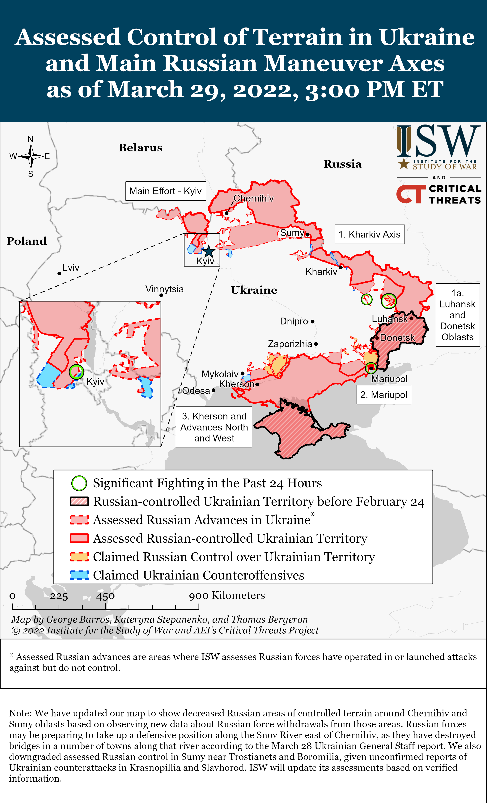

**Putin’s insistence on Ukraine’s complete surrender reflects his belief that Russia is winning and will outlast Ukrainian and Western resolve. Putin will not likely accept a lesser settlement unless Ukrainian forces inflict other significant battlefield setbacks on Russia and demonstrate to him that he cannot win militarily.** Putin claimed during Direct Line that Russia’s combat readiness is the highest in the world and that Russia’s defense industrial base (DIB) is producing everything that the Russian military needs.[11] Putin claimed that the battlefield situation is changing significantly in Russia’s favor and that Russian forces are advancing across the entire frontline. Putin bragged that Russian forces are not advancing in “100, 200, 300 meters” but in square kilometers and that Russian forces are advancing to accomplish the goals that Putin has established for the war. Russian forces’ rate of advance in Kursk Oblast and Ukraine has recently slowed, however, Putin’s rhetoric notwithstanding. ISW assesses that Russian forces advanced at a rate of roughly 27.96 square kilometers per day in November 2024 but haveonly advanced at a rate of roughly 17.1 square kilometers per day between December 1 and December 18.

Putin’s articulated theory of victory assumes that Russian forces will be able to continue gradual, creeping advances indefinitely, prevent Ukraine from conducting successful, operationally significant counteroffensive operations against Russian forces, and will win a war of will and attrition against Ukrainian forces.[12] This theory of victory rests on Putin’s assumptions that Russia can outlast and overcome Western security assistance to Ukraine and Ukraine’s ongoing efforts to man and equip its military and that the West will abandon Ukraine. Western decision-makers can invalidate these assumptions and compel Putin to negotiate on bases acceptable to the United States, Ukraine, and Europe by proving their will to continue supporting Ukraine and enabling Ukrainian forces to inflict significant battlefield setbacks on Russia.

**Putin reiterated the false narrative that Ukrainian President Volodymyr Zelensky’s presidency is illegitimate, in part, to blame Ukraine for delaying negotiations and garner support for full Ukrainian capitulation among a Russian population that increasingly wants the war to end.** Putin falsely claimed that Zelensky is the illegitimate president of Ukraine and that any governmental body formed under his presidency is by extension illegitimate.[13] Putin also reiterated the claim that the Ukrainian Verkhovna Rada is the only legitimate governing body in Ukraine.[14] ISW has previously observed that Kremlin officials are using a false reading of the Ukrainian Constitution and Ukrainian law to delegitimize Ukraine’s government and sovereignty.[15] Putin has claimed that the Ukrainian government has been illegitimate since the 2014 Euromaidan Revolution and has used this false assertion to justify the full-scale invasion of Ukraine.[16] Kremlin newswire *TASS* reported on December 19 that the most popular question that Russian citizens submitted to the Direct Line press conference asked when the war would end.[17]Putin is likely promoting the false narrative about Zelensky’s illegitimacy to Russia’s war fatigued domestic population in order to set conditions to blame Ukraine — and not Russia — for the lack of negotiations to end the war on his terms and to garner support for the removal of the legitimate Ukrainian government — one of Russia’s ongoing maximalist demands. ISW observed polling published in October and November 2024 indicating that the Russian population is increasingly interested in ending the war in exchange for Russian territorial concessions, and ISW assessed that Russian authorities are increasingly concerned about waning public support for the war.[18]

**Putin continues to justify his decision to prioritize Russian offensive operations in Donetsk Oblast over expelling Ukrainian forces from Kursk Oblast.** Putin claimed during the Direct Line that he has no doubt that Russian forces will push Ukrainian forces from Kursk Oblast and promised the restoration of all settlements to Russian control but refused to provide an exact timeline for the completion of the Russian operation to re-take the remainder of Kursk Oblast.[19] Putin claimed that he refuses to provide an exact timeline because Russian servicemembers will hear him and immediately begin more aggressive and costly efforts to retake the remainder of Kursk Oblast regardless of manpower losses, which Putin absurdly insinuated is against the Russian military’s code of conduct. Putin’s claim that Russian officials care about manpower losses is ironic considering that Russia has suffered an estimated 125,800 casualties in September, October, and November 2024 in exchange for just over 2,000 square kilometers of gains — roughly 53 casualties per square kilometer gained.[20] The Russian military command has prioritized offensive operations and advances in the Pokrovsk, Kurakhove, Vuhledar, and Velyka Novosilka directions over the last five months (since about July 2024) at the expense of expelling Ukrainian forces from Kursk Oblast, and Putin’s claim about wanting to avoid increased manpower losses in Kursk Oblast is likely aimed at justifying Russia’s delayed efforts to retake Kursk oblast to the Russian public.

**Putin is apparently embarrassed to admit his need for North Korean forces to push Ukrainian forces out of Russian territory, despite his openness about the Russia-North Korea relationship**. Putin notably did not mention North Korea during the entire four and a half hours of his Direct Line press conference and instead highlighted the Russian 155th Naval Infantry Brigade (Pacific Fleet, Eastern Military District [EMD]) for its participation in combat operations in Kursk Oblast.[21] Russian milbloggers have recently attributed the seizure of Plekhovo, Kursk Oblast in part to elements of the 155th Naval Infantry Brigade and North Korean forces, and one milblogger claimed that elements of two unspecified Russian brigades have claimed responsibility for the seizure even though North Korean forces had seized the settlement with no assistance from Russian forces.[22] North Korean forces reportedly trained at Russian military facilities in Primorsky Krai, including in Vladivostok where the 155th Naval Infantry Brigade is based.[23] Putin’s decision not to recognize North Korean forces’ contributions to combat operations is likely placing limits on the extent of the aid that Russia can get from North Korea as Putin tries to minimize evidence of their help. The Kremlin would very likely struggle to conceal larger numbers of North Korean forces fighting within Kursk Oblast or in Ukraine itself, for example.

**Putin continues to fixate on the Russian “Oreshnik” ballistic missile as part of his non-nuclear deterrent aimed at simultaneously forcing the West to make decisions favorable to Russia and providing Putin with an off-ramp from his failed nuclear saber-rattling narrative.** Putin claimed that the Oreshnik is a “medium and shorter” range missile with a range somewhere between 1,500 and 5,500 kilometers and that modern Western air defense systems cannot intercept the Oreshnik.[24] Putin has leaned into highlighting the Oreshnik missile’s technical specifications in recent weeks, likely to create fear and uncertainty about the damage that the Oreshnik can inflict and to pressure Ukraine’s partners to limit Ukrainian strikes against military targets in Russia with Western-provided weapons.[25] Putin has emphasized recently the Oreshnik’s non-nuclear capabilities, likely to provide an off-ramp from his nuclear posturing as Ukrainian and Western actions have challenged the Kremlin’s nuclear saber-rattling every time the Kremlin has employed it. ISW has previously assessed that there is nothing particularly new about the Oreshnik’s capabilities, and Russia already possesses missiles that Western air defenses likely cannot reliably shoot down.[26]

**Putin’s boasting about Russia’s military capabilities ignores the reality of the serious and unsustainable losses that Russia has suffered to advance relatively more rapidly in Donetsk Oblast in recent months.** Russian forces advanced more rapidly in Ukraine and Kursk Oblast in September, October, and November 2024 than during the first eight months of 2024 — but Russian forcessimultaneously sustained increasedlosses during this period as well.[27] The United Kingdom (UK) Ministry of Defense (MoD) reported that Russian forces reached an average of 1,523 personnel casualties per day and over 45,000 per month in November 2024 as Russia prioritized advances in eastern Ukraine – a new high for the war thus far.[28] Russia has also reportedly expended a significant percentage of its operational reserves on its 2024 offensive campaign in Donetsk Oblast. Ukrainian Khortytsia Group of Forces Spokesperson Colonel Nazar Voloshyn stated on December 19 that Russian forces expended a significant part of their operational reserves that Russia accumulated in 2024 in pursuit of gains in the Kupyansk, Pokrovsk, Kurakhove, and Vremivka directions, and Ukrainian military observer Kostyantyn Mashovets reported in October 2024 that Russian forces had intended to commit most of their operational reserves formed from the Northern Grouping of Forces and Central Military District (CMD) to these directions.[29] Russian forces still need to seize over 8,000 square kilometers to achieve Russia’s long-standing objective of seizing the entirety of Donetsk Oblast and will likely continue to suffer significant manpower losses if Russia continues to conduct intensified offensive operations in Donetsk Oblast in 2025.

**Putin continues to falsely posture the Russian economy as strong and stable while deflecting blame for economic issues onto the Russian Central Bank.** Putin characterized the Russian economy as “stable and reliable” but acknowledged that inflation rates have reached 9.2 to 9.3 percent and ordered the Central Bank to “bring these rates down to earth.”[30] Putin claimed that Russia is a strong state that is only becoming stronger and more independent inthe last two or three years of the full-scale invasion of Ukraine. Putin claimed that Russia is able to “stand confidently on its own two feet” in terms of its economy and noted that Russia remains one of the world’s main food exporters, neglecting to mention Russia’s continued illegal export of stolen grain from occupied Ukraine. Putin insinuated that the Russian Central Bank and its head, Elvira Nabiullina, mishandled rising Russian interest rates and noted that the Russian government’s economic policies had “some shortcomings,” likely in an attempt to deflect blame for rising interest rates and inflation on another Russian official. In reality, Putin’s personal desire to insulate the Russian people from the economic and other impacts of the war in Ukraine is likely hindering the Central Bank’s ability to respond to the economic pressures of Western sanctions and rising labor shortages.

The Ukrainian government, in contrast, appears to be addressing the economic impacts of the war more effectively than Russia, despite also suffering devastating economic consequences from the same war. The *Economist* reported on December 19 that Ukraine’s currency conversion rates are currently stable and that the Ukrainian Central Bank forecasts that Ukraine’s GDP will grow by four percent in 2024 and 4.3 percent in 2025.[31] The Russian Central Bank, in comparison, recently announced that it expects Russia’s GDP to grow by 0.5 to 1.5 percent in 2025.[32] Ukraine’s interest rate is currently at a 30-month low at 13.5 percent compared to Russia’s current high interest rate of 21 percent, which some Russian sources have speculated will rise to 23 percent following a Russian Central Bank meeting on December 20.[33]

**Putin attempted to balance among Russian ultranationalist demands for restrictions against migrants, Russia’s reliance on migrants to address labor shortages and long-term demographic issues, and the need to posture Russia as an ethnically diverse and harmonious country.** Putin expressed his support for requiring migrant children to pass a Russian language exam in order to attend school in Russia.[34] Putin further claimed that Russia needs to work with Central Asian countries to prepare migrants who are interested in moving to Russia to adapt to Russian language, culture, and law and supported the creation of a separate center within the Russian Ministry of Internal Affairs (MVD) responsible for migration issues in the future.[35] Putin acknowledged that Russia suffers a labor shortage in the “hundreds of thousands” but noted that Russia would rather offset these shortages with new technology that boosts labor productivity instead of unskilled migrant labor.[36] Putin responded to a request from a German citizen living in Russia to receive Russian citizenship, claiming that Russia is interested in attracting highly qualified specialists who are “compatriots abroad” — whom Putin defined as Russian language speakers and individuals who consider themselves a part of Russian culture — to live and work in Russia.[37] Putin has used the “compatriots abroad” framework to justify Russian involvement and influence in post-Soviet countries, including Central Asian states, but notably chose to make an example during Direct Line of a “compatriot” from a European background. Putin acknowledged Russian long-term demographic challenges and claimed that the number of women in Russia of childbearing age has decreased by 30 percent.[38] ISW continues to assess that the Kremlin is trying to leverage migrants to offset labor shortages and long-term demographic decline but that the Kremlin will face challenges balancing these efforts with xenophobic Russian ultranationalist efforts to restrict migration from Central Asia.[39]

Putin continues attempts to promote multicultural and interreligious unity among ethnic minorities living in Russia, however. Kremlin newswire *TASS* notably highlighted Direct Line attendees who attended the press conference wearing traditional cultural attire of Russia’s ethnic minorities.[40] One man whom *TASS* filmed was wearing traditional attire and held up the banner of the 155th Naval Infantry Brigade behind Putin during the press conference.[41] Putin’s support for harsher restrictions against migrants and promotion of ethnic minorities living in Russia continues to indicate that Putin is attempting to placate the xenophobic pro-war Russian ultranationalist community that demands crackdowns against migrants while attempting to foster civic Russian nationalism and posture Russia as a harmonious, diverse society.

**Putin attempted to frame Russia’s strategic political defeat in Syria following the collapse of the Assad regime as a victory, as Moscow continues to negotiate with the interim Syrian government on the status of Russia’s military bases in the country.** Putin claimed during the Direct Line that Russia “achieved [its] goal” in Syria, in an attempt to frame Russia’s failure to secure Bashar al Assad’s regime — the reason Moscow intervened in the Syrian Civil War in 2015 — as a victory.[42] Putin claimed that Russia maintains relations with “all the groups that control the situation” in Syria and that an “overwhelming majority” — but not all — of these groups are interested in the Russian military retaining its bases in Syria. Putin claimed that Russia has proposed using its Hmeimim Air Base and Port of Tartus to bring humanitarian aid into Syria. Hayat Tahrir al Sham (HTS) has reportedly already refused Moscow’s offers of humanitarian aid, and Putin’s statements suggest that talks are ongoing between Moscow and the interim Syrian government about Russia’s bases but have not finalized any possible agreements.[43]

**Putin framed the recent Ukrainian assassination of Russian Nuclear, Biological, Chemical Defense Forces (NBC) Head Lieutenant General Igor Kirillov and his assistant as a terrorist attack enabled by Russian law enforcement’s failures rather than a consequence of Russia’s full-scale invasion of Ukraine.** Putin responded to a journalist’s question during Direct Line about Kirillov’s assassination on December 17, stating that Russian security services missed Kyiv’s “terrorist attacks” and called on Russian law enforcement agencies to improve their operations in order to prevent similar incidents in the future.[44] Putin also emphasized that Ukrainian “terrorist acts” could impact Russian civilians’ lives but omitted the fact that the assassination targeted a high-ranking Russian military official who was responsible for Russian chemical weapons attacks and information operations against Ukraine.[45] Putin’s efforts to blame the incident on the negligence of Russian internal security and law enforcement services is notable, as the Russian ultranationalist community demanded after the assassination that Russia retaliate by escalating its missile and drone strike campaign against the Ukrainian military-political leadership.[46] Putin’s response to the assassination during Direct Line was also extremely brief, possibly in an attempt to downplay the embarrassment of such a high-profile assassination.

**Ukrainian forces conducted a drone strike against the Novoshakhtinsk Oil Refinery in Rostov Oblast on the night of December 18 to 19.** The Ukrainian General Staff reported that Ukraine’s Security Service (SBU) and other Ukrainian forces struck infrastructure and production facilities at the Novoshakhtinsk Oil Refinery.[47] The Ukrainian General Staff noted that the Novoshakhtinsk Oil Refinery is the only operational oil refinery in Rostov Oblast, and that it refines up to 7.5 million tons of fuel per year and supports the Russian military. Geolocated footage published on December 18 shows a fire at the refinery.[48] Rostov Oblast Acting Governor Yuri Slyusar acknowledged that Ukrainian strikes caused a fire at the refinery and claimed that Ukrainian forces used three unspecified missiles and more than 30 drones to facilitate the strike.[49] Ukrainian forces last targeted the Novoshakhtinsk Oil Refinery on March 13, 2024, and it reportedly temporarily stopped refining after that strike.[50]

**Key Takeaways:**

- **Russian President Vladimir Putin said that he should have violated the ceasefire he had imposed on Ukraine in 2014 by launching a full-scale invasion even earlier when asked to reflect on his 2022 decision to attack.**
- **Putin insisted that negotiations with Ukraine must be based on the same demands he made before the invasion and at the moment of Russia’s greatest territorial gains, despite the fact that Ukraine has secured Kyiv and liberated much of the territory his forces held at that time.**
- **Putin’s insistence on Ukraine’s complete surrender reflects his belief that Russia is winning and will outlast Ukrainian and Western resolve. Putin will not likely accept a lesser settlement unless Ukrainian forces inflict other significant battlefield setbacks on Russia and demonstrate to him that he cannot win militarily.**
- **Putin reiterated the false narrative that Ukrainian President Volodymyr Zelensky’s presidency is illegitimate, in part, to blame Ukraine for delaying negotiations and garner support for full Ukrainian capitulation among a Russian population that increasingly wants the war to end.**
- **Putin continues to justify his decision to prioritize Russian offensive operations in Donetsk Oblast over expelling Ukrainian forces from Kursk Oblast.**
- **Putin is apparently embarrassed to admit his need for North Korean forces to push Ukrainian forces out of Russian territory, despite his openness about the Russia-North Korea relationship**.
- **Putin continues to fixate on the Russian “Oreshnik” ballistic missile as part of his non-nuclear deterrent aimed at simultaneously forcing the West to make decisions favorable to Russia and providing Putin with an off-ramp from his failed nuclear saber-rattling narrative.**
- **Putin’s boasting about Russia’s military capabilities ignores the reality of the serious and unsustainable losses that Russia has suffered to advance relatively more rapidly in Donetsk Oblast in recent months.**
- **Putin continues to falsely posture the Russian economy as strong and stable while deflecting blame for economic issues onto the Russian Central Bank.**
- **Russian forces recently advanced near Kupyansk, Toretsk, Kurakhove, Vuhledar, Velyka Novosilka, and Robotyne.**
- **Russian President Vladimir Putin continued efforts to evade blame for ongoing systemic payment issues impacting Russian servicemembers fighting in Kursk Oblast caused by his decision to downplay Ukraine’s incursion into the region as a “counterterrorism operation” by scapegoating the Russian Ministry of Defense.**
- **Russian President Vladimir Putin called on Mariupol occupation officials to redistribute illegally confiscated Ukrainian apartments during his annual Direct Line televised press conference on December 19, signaling Russia’s continued efforts to forcibly repopulate occupied areas of Ukraine with Russians to fundamentally alter Ukraine’s demographics.**

***We do not report in detail on Russian war crimes because these activities are well-covered in Western media and do not directly affect the military operations we are assessing and forecasting. We will continue to evaluate and report on the effects of these criminal activities on the Ukrainian military and the Ukrainian population and specifically on combat in Ukrainian urban areas. We utterly condemn Russian violations of the laws of armed conflict and the Geneva Conventions and crimes against humanity even though we do not describe them in these reports.***

- Ukrainian Operations in the Russian Federation
- Russian Main Effort – Eastern Ukraine (comprised of three subordinate main efforts)
- Russian Subordinate Main Effort #1 – Push Ukrainian forces back from the international border with Belgorod Oblast and approach to within tube artillery range of Kharkiv City
- Russian Subordinate Main Effort #2 – Capture the remainder of Luhansk Oblast and push westward into eastern Kharkiv Oblast and encircle northern Donetsk Oblast
- Russian Subordinate Main Effort #3 – Capture the entirety of Donetsk Oblast
- Russian Supporting Effort – Southern Axis
- Russian Air, Missile, and Drone Campaign
- Russian Mobilization and Force Generation Efforts
- Russian Technological Adaptations
- Activities in Russian-occupied areas
- Significant Activity in Belarus

**Ukrainian Operations in the Russian Federation**

Russian forces recently advanced within the Ukrainian salient in Kursk Oblast amid continued offensive operations on December 19. Geolocated footage published on December 19 indicates that elements of the Russian 155th Naval Infantry Brigade (Pacific Fleet, Eastern Military District [EMD]) recently advanced east of Novoivanovka (southwest of Korenevo) toward Viktorovka (southeast of Koronevo).[51] Russian milbloggers claimed that Russian forces advanced in Kruglenkoye (southeast of Korenevo), conducted clearing operations in Russkoye Porechnoye (northeast of Sudzha), reached the outskirts of Cherkasskoye Porechnoye (northeast of Sudzha), and made tactical gains in Cherkasskaya Konopelka (southeast of Sudzha).[52] One Russian milblogger claimed that Russian forces seized Cherkasskaya Konopelka several days ago.[53]ISW has not observed confirmation of these claims, however.  A Russian milblogger claimed on December 19 that Ukrainian forces counterattacked in an unspecified area of the Kursk Oblast salient on the night of December 18 to 19.[54] Assault and drone elements of the Russian 1434th “Akhmat-Chechnya” Regiment are reportedly operating in the Sudzha direction.[55]

Ukraine’s Main Military Intelligence Directorate (GUR) reported on December 19 that unspecified actors affiliated with a resistance movement within Russia set fire to several fuel tankers located at the base of an unspecified Russian unit in Novosibirsk Oblast, leading to several explosions.[56] ISW cannot independently verify this reporting.

[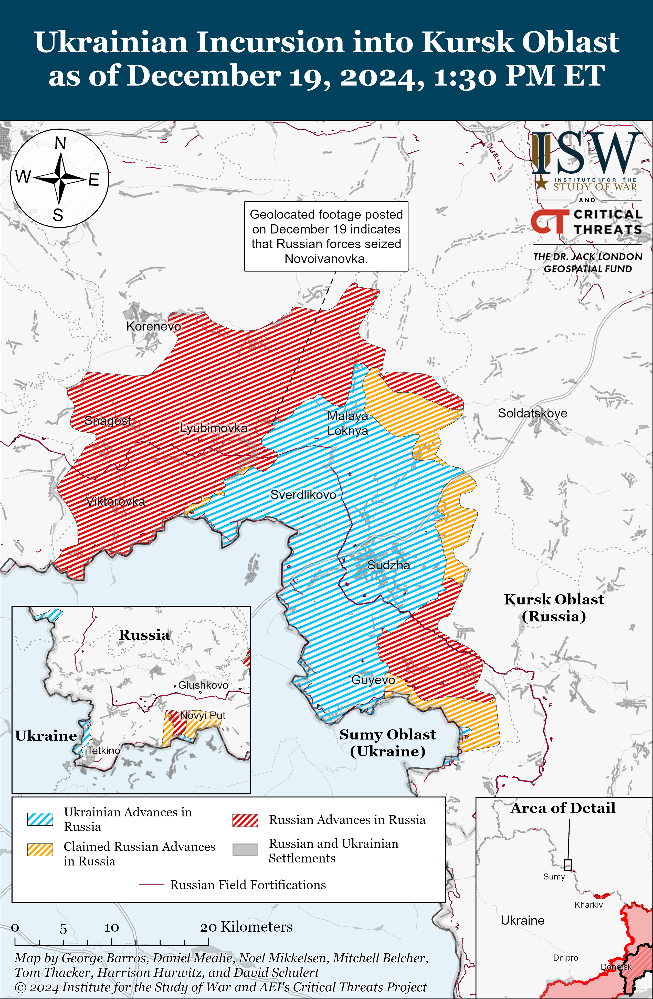](https://understandingwar.org/map/ukrainian-incursion-into-kursk-oblast-as-of-december-19-2024-130-pm-et/)

**Russian Main Effort – Eastern Ukraine**

**Russian Subordinate Main Effort #1 – Kharkiv Oblast (Russian objective: Push Ukrainian forces back from the international border with Belgorod Oblast and approach to within tube artillery range of Kharkiv City)**

Russian forces conducted offensive operations north of Kharkiv City near Lyptsi and northeast of Kharkiv City near Vovchansk on December 18 and 19 but did not make any confirmed advances.[57]

[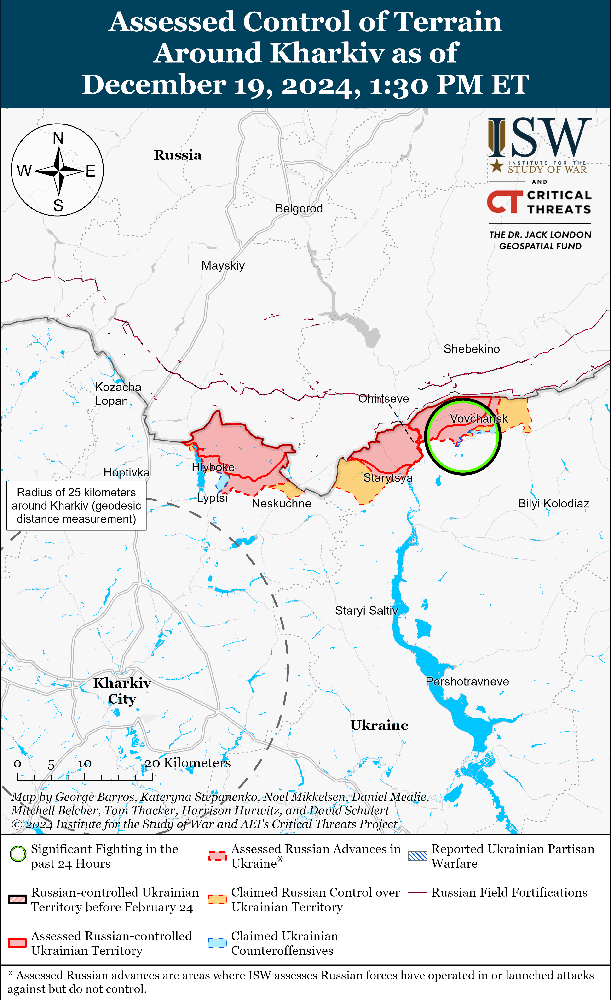](https://understandingwar.org/map/assessed-control-of-terrain-around-kharkiv-as-of-december-19-2024-130-pm-et/)

**Russian Subordinate Main Effort #2 – Luhansk Oblast (Russian objective: Capture the remainder of Luhansk Oblast and push westward into eastern Kharkiv Oblast and northern Donetsk Oblast)**

Russian forces likely recently advanced in the Kupyansk direction amid continued offensive operations along the Kupyansk-Svatove-Kreminna line on December 19. Ukrainian military observer Kostyantyn Mashovets stated that Ukrainian forces seem to have retreated westward to the P-79 highway in the direction of Dvorichna (north of Kupyansk).[58] Mashovets stated that elements of the Russian 2nd Motorized Rifle Division (1st Guards Tank Army [GTA], Moscow Military District [MMD]), likely its 1st Motorized Rifle Regiment and 1st Tank Regiment, advanced north and northeast in the direction of Kruhlyakivka and Zahryzove (both southeast of Kupyansk).[59] Russian milbloggers also claimed that Russian forces advanced to the P-79 highway and into Dvorichna, cleared most of the settlement’s southern outskirts, and seized tactical heights near the southern part of the settlement.[60] Russian milbloggers also claimed that Russian forces advanced near Lozova (southeast of Kupyansk) and cleared Ukrainian forces from positions in the Kreminna forest (southwest of Kreminna).[61] ISW has not observed confirmation of these claims, however. A Ukrainian drone battalion commander stated that Russian forces conducted a reinforced company-sized mechanized assault in two armored columns traveling in two different directions in the Kupyansk direction in an attempt to expand a Russian bridgehead near the Oskil River on December 18 and that Ukrainian forces damaged and destroyed 21 of the Russian vehicles used in the assaults.[62] The battalion commander also stated that Russian forces conducted another reinforced company-sized mechanized assault with 25 tanks and infantry fighting vehicles in the direction of Lozova and Zahryzove on December 18 and that Ukrainian forces destroyed 10 of the 25 vehicles used in the assaults. Russian forces continued attacking north of Kupyansk near Dvorichna; northeast of Kupyansk near Petropavlivka and Lyman Pershyi; southeast of Kupyansk near Lozova, Zahryzove, and Kolisnykivka; southwest of Svatove near Novoyehorivka and Hrekivka; west of Svatove near Nadiya and Zelenyi Hai; northwest of Kreminna near Terny and Yampolivka; and southwest of Kreminna in the Serebryanske forest area on December 18 and 19.[63] Mashovets stated that elements of the Russian 3rd Motorized Rifle Division (20th CAA, MMD) and 25th Motorized Rifle Brigade (6th CAA, Leningrad Military District [LMD]) are attacking south of Kupyansk from Lozova towards Borivska Andriivka, Nova Kruhlyakivka, Zelenyi Hai, and the Pershotravneve-Kopanky area.[64] Mashovets stated that elements of the Russian 69th Motorized Rifle Division and 9th Artillery Brigade (both of the 6th CAA, LMD) are concentrating forces near the Masyutivka-Zapane bridgehead (just south of Dvorichna and north of Kupyansk).

[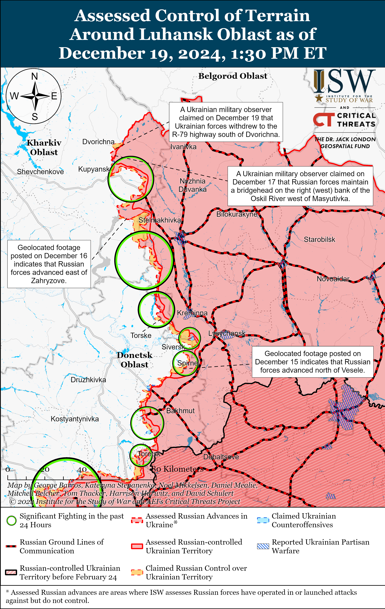](https://understandingwar.org/map/assessed-control-of-terrain-around-luhansk-oblast-as-of-december-19-2024-130-pm-et/)

**Russian Subordinate Main Effort #3 – Donetsk Oblast (Russian objective: Capture the entirety of Donetsk Oblast, the claimed territory of Russia’s proxies in Donbas)**

Russian forces conducted offensive operations northeast of Siversk near Bilohorivka and Hryhorivka and east of Siversk near Verkhnokamyanske on December 18 and 19 but did not make any confirmed advances.[65]

Ukrainian forces recently regained lost positions in Chasiv Yar amid continued Russian offensive operations in the area on December 19. Geolocated footage published on December 18 indicates that Ukrainian forces recently regained lost positions in the southern part of the Refractory Plant in central Chasiv Yar.[66] Russian forces conducted offensive operations in and near Chasiv Yar itself, north of Chasiv Yar near Hryhorivka, and south of Chasiv Yar near Bila Hora on December 18 and 19.[67] Elements of the Russian 98th Airborne (VDV) Division and drone operators of the Sever-V Brigade (Russian Volunteer Corps) are reportedly operating in and near Chasiv Yar respectively.[68]

[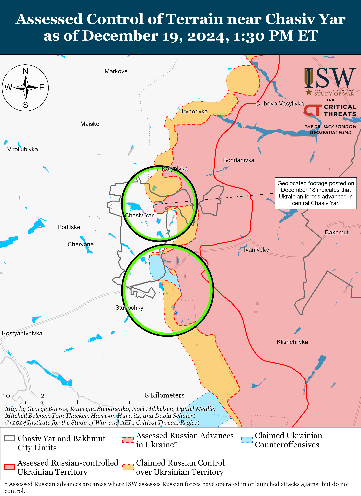](https://understandingwar.org/map/assessed-control-of-terrain-near-chasiv-yar-as-of-december-19-2024-130-pm-et/)

Russian forces recently marginally advanced in Toretsk amid continued offensive operations in the area on December 19. Geolocated footage published on December 16 indicates that Russian forces recently advanced along Shkilna and Vasnetsova streets in southern Toretsk.[69] The Ukrainian General Staff reported that Russian forces conducted offensive operations near Toretsk itself, west of Toretsk near Shcherbynivka, and north of Toretsk near Dyliivka on December 18 and 19.[70]

[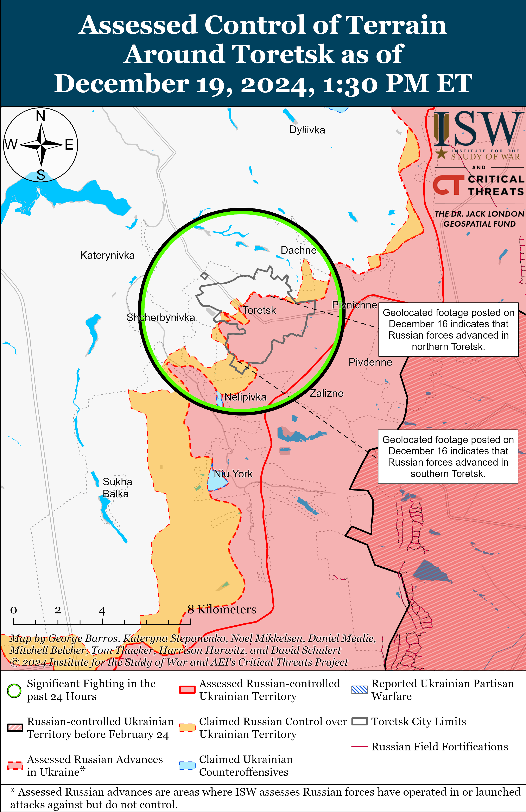](https://understandingwar.org/map/assessed-control-of-terrain-around-toretsk-as-of-december-19-2024-130-pm-et/)

Russian forces continued assaults in the Pokrovsk direction on December 19 but did not make confirmed advances. Russian milbloggers claimed that elements of the Russian 30th Motorized Rifle Brigade (2nd Combined Arms Army [CAA], Central Military District [CMD]) entered Novoolenivka (southwest of Pokrovsk) and advanced in an area up to 2.2 kilometers wide north of the settlement.[71] Russian milbloggers claimed that Russian forces advanced west of Shevchenko (southwest of Pokrovsk), up to 500 meters east of Shevchenko, up to 800 meters north of Shevchenko, to the outskirts of Pishchane (northwest of Shevchenko), and across the Solona River into Vovkove (west of Shevchenko and Pishchane).[72] Russian milbloggers also claimed that Russian forces advanced in an area up to 1.7 kilometers wide north of Novotroitske (southwest of Pokrovsk) and to the outskirts of Novovasylivka (northwest of Novotroitske).[73] Russian milbloggers claimed that Russian forces seized Novyi Trud (south of Pokrovsk) and advanced in northern Dachenske (south of Pokrovsk and east of Novyi Trud).[74] ISW has not observed confirmation of these claims, however. A Russian source claimed that Russian forces occupy roughly 50 percent of Dachenske, but ISW has not observed any geolocated evidence of Russian forces operating in the settlement.[75] Russian forces continued offensive operations east of Pokrovsk near Myrolyubivka and Promin; southeast of Pokrovsk near Lysivka; south of Pokrovsk near Dachenske, Zelene, Ukrainka, and Pushkine; and southwest of Pokrovsk near Solone, Novovasylivka, Novoolenivka, and Vovkove.[76] The spokesperson of a Ukrainian brigade operating in the Pokrovsk direction reported on December 19 that Russian forces are conducting assaults in groups of two to three soldiers and are refusing to conduct assaults in groups of 10 to 15.[77] The spokesperson stated that Russian forces are now actively deploying fiber optic drones in the area. The spokesperson stated that Russian forces are roughly six kilometers from Pokrovsk. ISW has observed evidence that Russian forces are operating within 2.4 kilometers of Pokrovsk. Ukrainian military observer Kostyantyn Mashovets stated that elements of the Russian 27th Motorized Rifle Division (2nd CAA, CMD) including likely its 433rd and 506th motorized rifle regiments, and the 15th Motorized Rifle Brigade (2nd CAA, CMD) marginally advanced near Novotroitske and Shevchenko.[78] Mashovets stated that elements of the Russian 90th Tank Division (41st CAA, CMD), including its 228th Motorized Rifle Regiment and 239th Tank Regiment, marginally advanced towards Novoolenivka and in the direction of Pushkine-Ukrainka.

[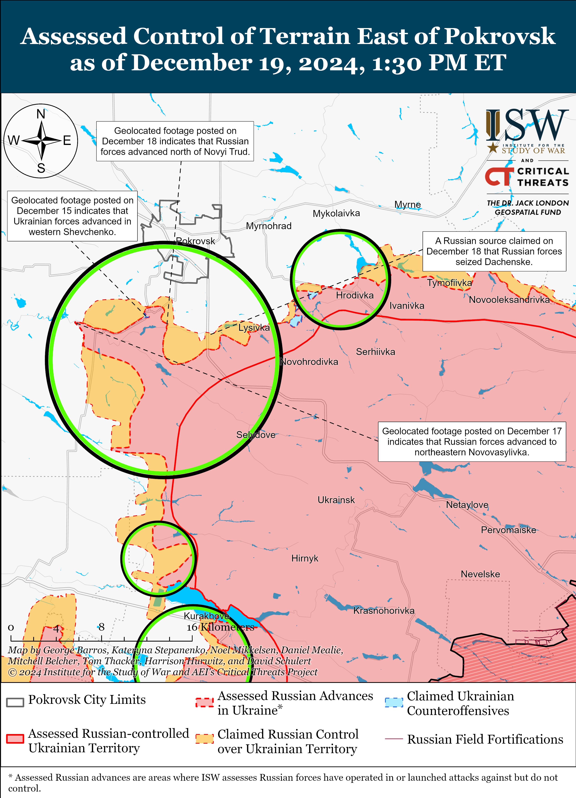](https://understandingwar.org/map/assessed-control-of-terrain-east-of-pokrovsk-as-of-december-19-2024-130-pm-et/)

Russian forces reportedly advanced within Kurakhove amid continued offensive operations in the area on December 19. Mashovets reported that elements of the Russian 110th Motorized Rifle Brigade (51st CAA, Southern Military District [SMD]) and the 103rd Motorized Rifle Regiment and 163rd Tank Regiment (both of the 150th Motorized Rifle Division, 8th CAA, SMD) have seized most of Kurakhove except for the thermal power plant, but ISW has not observed visual confirmation or Russian claims of Russian forces seizing most of Kurakhove.[79] Russian milbloggers claimed that Russian forces advanced further west within Kurakhove, and one milblogger claimed that Russian forces have seized the entirety of central Kurakhove.[80] Russian forces continued offensive operations near Kurakhove itself; northwest of Kurakhove near Stari Terny, Sontsivka, Slovyanka, and Petropavlivka; and west of Kurakhove near Dachne on December 18 and 19.[81] Mashovets stated that elements of the Russian 5th and 110th motorized rifle brigades (both of the 51st CAA, formerly 1st Donetsk People’s Republic Army Corps [DNR AC]) and the 428th Motorized Rifle Regiment and 6th Tank Regiment (both of the 90th Tank Division, 41st CAA, CMD) advanced to the Zorya-Stari Terny line (northwest of Kurakhove).[82]

Russian forces likely advanced near Vuhledar amid continued offensive operations in the Vuhledar direction on December 19. Mashovets stated that elements of the Russian 20th Motorized Rifle Division (8th CAA, SMD), 68th AC (EMD), and 114th and 36th motorized rifle brigades (both of the 51st CAA) recently advanced near Kostyantynopolske, Sukhi Yaly and Zelenivka (all northwest of Vuhledar) and that Russian forces are currently roughly two kilometers from the H-15 Kurakhove-Zaporizhzhia City highway near Ulakly (northwest of Vuhledar).[83] Russian milbloggers claimed that Russian forces advanced to the southern outskirts of Ulakly (northwest of Vuhledar) and that elements of the Russian 39th Motorized Rifle Brigade (68th AC, EMD) seized Kostyantynopolske (northwest of Vuhledar).[84] ISW has not observed confirmation of these claims, however. The Russian Ministry of Defense (MoD) claimed on December 19 that Russian forces seized Zelenivka (northwest of Vuhledar), but ISW assessed that Russian forces seized the settlement as of December 18.[85] Russian forces continued attacking northwest of Vuhledar near Kostyantynopolske, Sukhi Yaly, Zelenivka, Rozlyv, and Yantarne on December 18 and 19.[86]

[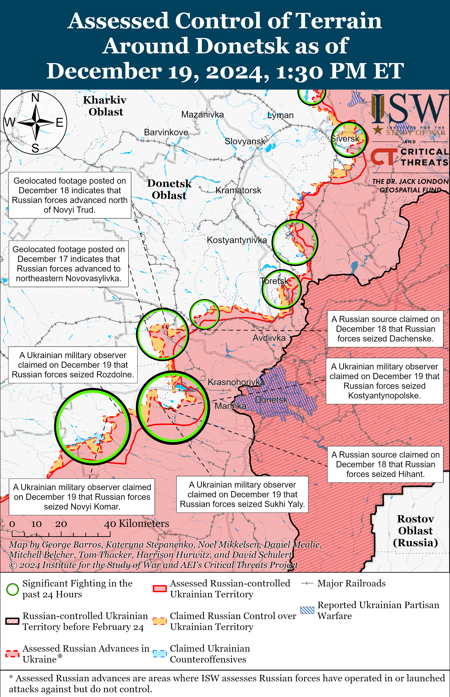](https://understandingwar.org/map/assessed-control-of-terrain-around-donetsk-as-of-december-19-2024-130-pm-et/)

Russian forces likely recently advanced in the Velyka Novosilka area amid continued offensive operations in the area on December 19. Mashovets stated that Russian forces recently seized Novyi Komar (north of Velyka Novosilka) and Rozdolne (northeast of Velyka Novosilka) and advanced northwestward along the right (east) bank of the Shaitanka River to the southeastern outskirts of Velyka Novosilka.[87] The Russian MoD claimed on December 19 that Russian forces seized Novyi Komar.[88] Russian milbloggers claimed that Russian forces advanced along the T-05-18 Velyka Novosilka-Bahatyr highway southeast of Novyi Komar, to the right (east) bank of the Mokri Yaly River to Novoocheretuvate (northwest of Novyi Komar), west of Neskuchne (south of Velyka Novosilka), and northeast of Rivnopil (southwest of Velyka Novosilka).[89] ISW has not observed confirmation of these claims, however. Russian forces conducted offensive operations near Velyka Novosilka itself; north of Velyka Novosilka near Novyi Komar; northeast of Velyka Novosilka near Rozdolne; southeast of Velyka Novosilka near Novodarivka; and south of Velyka Novosilka near Storozheve, Makarivka, Neskuchne, and Blahodatne on December 18 and 19.[90] A Russian milblogger claimed that Ukrainian forces counterattacked near Novyi Komar.[91] A Russian source claimed that Russian forces destroyed a river crossing near Novoocheretuvate.[92] Drone operators of the Russian 394th Motorized Rifle Regiment (127th Motorized Rifle Division, 5th CAA, EMD) are reportedly operating in the Velyka Novosilka direction.[93] Mashovets stated that elements of the Russian 127th Motorized Rifle Division and 60th Motorized Rifle Brigade (both of the 5th CAA, EMD) with support from the 5th Tank Brigade (36th CAA, EMD) recently bypassed Makarivka from the east and west and are attacking the settlement.[94] Mashovets stated that likely elements of the 14th Spetsnaz Brigade (Russian General Staff’s Main Directorate [GRU]) are supporting Russian assaults near Makarivka and that elements of the Russian 37th Motorized Rifle Brigade (36th CAA, EMD), 5th Tank Brigade (36th CAA, EMD), 40th Naval Infantry Brigade (Pacific Fleet, EMD), 336th Naval Infantry Brigade (Baltic Fleet, LMD), and 60th Motorized Rifle Brigade (5th CAA, EMD) are operating in the Velyka Novosilka direction.

[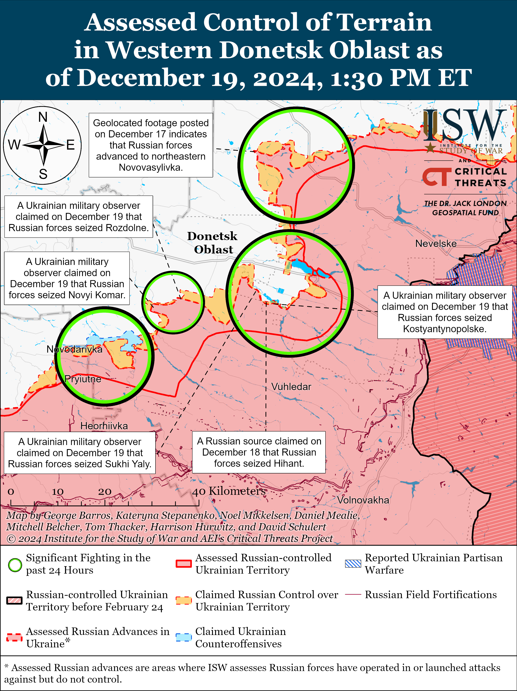](https://understandingwar.org/map/assessed-control-of-terrain-in-western-donetsk-oblast-as-of-december-19-2024-130-pm-et/)

**Russian Supporting Effort – Southern Axis (Russian objective: Maintain frontline positions and secure rear areas against Ukrainian strikes)**

Russian forces recently advanced in the Zaporizhia direction amid continued Russian offensive operations in the area on December 19. Geolocated footage published on December 18 indicates that Russian forces recently advanced to a windbreak northwest of Nesteryanka (northwest of Robotnye) during a clearing operation.[95] Fighting continued near Novoandriivka (northwest of Robotnye) on December 18 and 19.[96]

[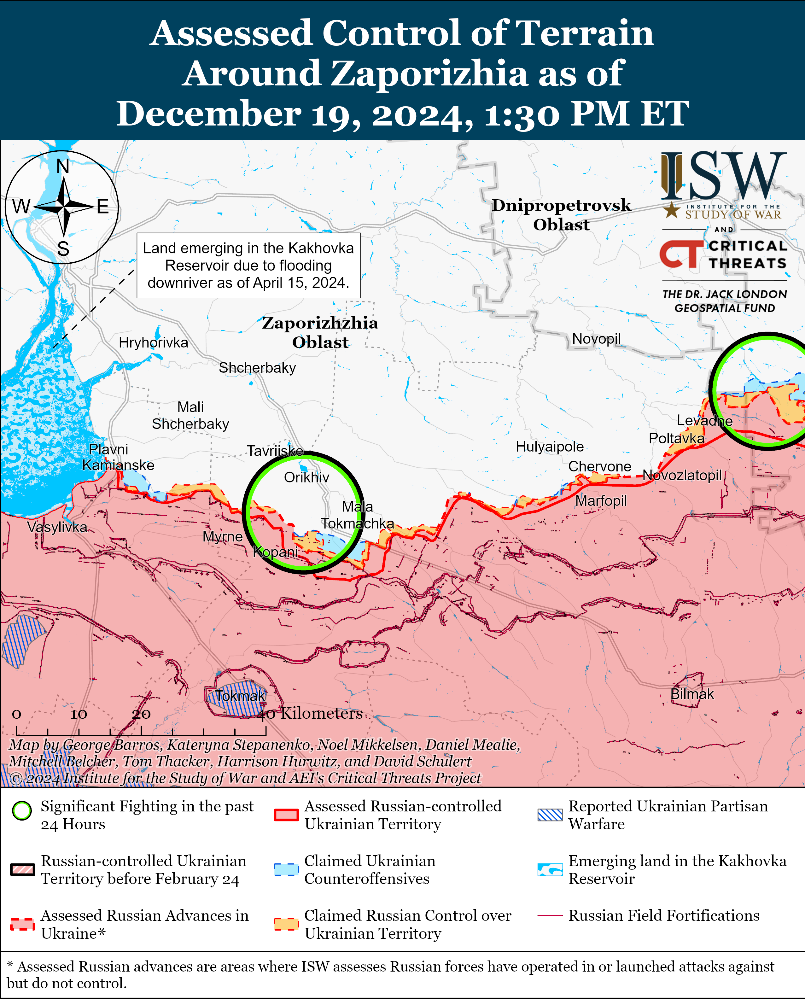](https://understandingwar.org/map/assessed-control-of-terrain-around-zaporizhia-as-of-december-19-2024-130-pm-et/)

Russian forces continued assaults in the Dnipro direction and on the islands of the Dnipro River Delta on December 18 and 19 but did not make any confirmed advances in the area.[97]

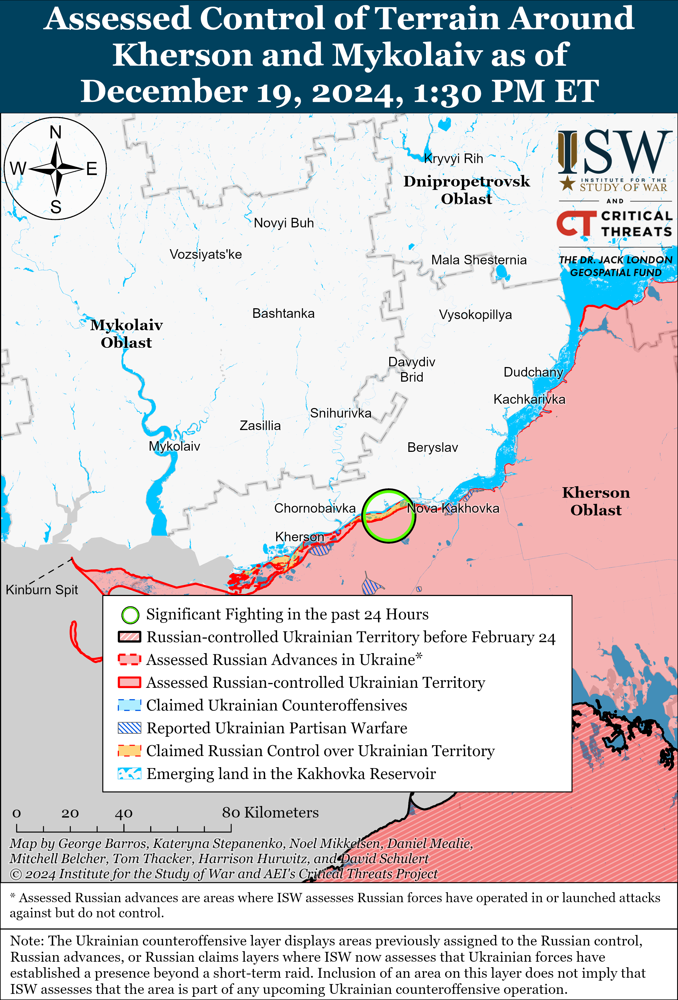

**Russian Air, Missile, and Drone Campaign (Russian Objective: Target Ukrainian military and civilian infrastructure in the rear and on the frontline)**

Russian forces conducted a series of drone and missile strikes against Ukraine overnight on December 18 to 19. The Ukrainian Air Force reported that Russian forces launched two Iskander-M ballistic missiles from occupied Crimea and Rostov Oblast; a Kh-59/69 cruise missile from airspace over Kursk Oblast; and 85 Shahed drones and other unspecified drones from Bryansk, Kursk, and Oryol oblasts and Millerovo, Rostov Oblast.[98] The Ukrainian Air Force reported that Ukrainian forces downed 45 drones in Poltava, Sumy, Kharkiv, Kyiv, Khmelnytskyi, Chernihiv, Cherkasy, Kirovohrad, Dnipropetrovsk, and Mykolaiv oblasts and that 40 drones were “lost”, likely due to Ukrainian electronic warfare (EW) interference. The Ukrainian Air Force reported that the Russian missile strikes damaged several municipal and private buildings in Sumy and Dnipropetrovsk oblasts. Kyiv Oblast Military Administration Head Ruslan Kravchenko reported that debris from falling Russian drones damaged railways tracks and a private residence in the oblast.[99] Ukrainian sources reported that Russian missile strikes damaged civilian and energy infrastructure in Kramatorsk, Donetsk Oblast and Kryvyi Rih, Dnipropetrovsk Oblast on December 19.[100]

**Russian Mobilization and Force Generation Efforts (Russian objective: Expand combat power without conducting general mobilization)**

Russian President Vladimir Putin continued efforts to evade blame for ongoing systemic payment issues impacting Russian servicemembers fighting in Kursk Oblast caused by his decision to downplay Ukraine’s incursion into the region as a “counterterrorism operation” by scapegoating the Russian MoD. Putin directly blamed the Russian MoD during his annual Direct Line televised press conference on December 19 when confronted with widening salary gaps between soldiers fighting in Kursk Oblast as part of the “counterterrorist operation” and receive 25,000 rubles ($241) monthly, and those fighting in Ukraine who receive 210,000 rubles ($2,029) monthly.[101] Putin responded to the confrontation by stating “it’s a pity that the [Russian] military department didn’t pay attention to this…[it] is primarily their responsibility.”[102] Putin added that it “never occurred” to him that the classification of Russian operations in Kursk Oblast as a counterterrorism operation resulted in MoD issuing lower salaries for soldiers fighting in the region and questioned why Russian servicemembers fighting in Kursk Oblast did not receive combat veteran status. Putin stated that he would remedy the classification and payment errors by ensuring that all Russian servicemembers, including former Wagner Private Military Company (PMC) forces, would receive promised benefits and recognition as combat veterans.[103] Putin notably once again feigned ignorance of the systemic issues plaguing the Russian military’s distribution of benefits and salaries despite previously fielding questions related to similar problems impacting the salaries and statuses of Russian irregular forces during the 2023 Direct Line broadcast.[104]

Putin also promised during the Direct Line that Russia will reopen military educational institutions across Russia in an effort to train more Russian military specialists. Putin stated that Russia is expanding the Russian military and security forces to 1.5 million personnel and promised to reopen previously closed military education institutions to accommodate the military’s expansion but noted that this effort will take time due to the expansion effort.[105] Putin explained that Russia previously shut down military educational institutions, including schools in North Ossetia-Alania Republic, after demand for Russian military specialists dropped.

Putin continued to advertise the “Time of Heroes” veteran support program during the Direct Line and will use it to militarize the Russian government and society at large. Putin asserted on December 19 that there “haven’t been any mistakes” in respect to the Kremlin’s ongoing effort to install Russian military veterans in positions of regional and federal power as part of the “Time of Heroes” program.[106] Putin depicted the program as highly selective and stated that it only selected 83 veterans out of a purported 43,000 applicants in the program’s first stage. Putin stated that the Russian government has already initiated the second stage of the “Time of Heroes” program, extended the application period, and gathered 15,000 applications from eligible veterans. Putin stated that “Time of Heroes” participants from the first stage have already received jobs in the Russian government and Russian industries. Putin implied that the “Time of Heroes” program was his initiative and that he came up with it after meeting with veterans and students in St. Petersburg.

Putin also likely attempted to cover up his blatant nepotism by claiming that he did not originally want to promote his “niece” (first cousin once removed) Anna Tsivileva as the Russian State Secretary – Deputy Defense Minister. Putin claimed during the Direct Line that Russian Defense Minister Andrei Belousov suggested Tsivileva’s appointment as his deputy and that Putin was apprehensive about promoting Tsivileva out of her previous position as the “Defenders of Fatherland” Fund head.[107]

The Ukrainian Main Military Intelligence Directorate (GUR) published on December 19 a summary of Russian personnel losses among mobilized servicemen (not all Russian casualties) from September 21, 2022 to October 31, 2024. The GUR disaggregated these losses by respective grouping of forces (GOFs), which amounted to a total assessed loss of 98,461 mobilized soldiers.[108] The GUR listed the following losses among mobilized troops: 2,972 for Sever (North) GOF; 21,710 for Center GOF; 16,770 for Vostok (East) GOF; 20,155 for Zapad (West); 16,465 for Yug (South) GOF; and 10,449 for Dnepr GOF. The GUR added that Russian personnel losses among mobilized servicemen in Zaporizhia Oblast amounted to 10,120 troops. ISW cannot independently verify the veracity of this reporting.

**Russian Technological Adaptations (Russian objective: Introduce technological innovations to optimize systems for use in Ukraine)**

Nothing significant to report.

**Activities in Russian-occupied areas (Russian objective: Consolidate administrative control of annexed areas; forcibly integrate Ukrainian citizens into Russian sociocultural, economic, military, and governance systems)**

Russian President Vladimir Putin called on Mariupol occupation officials to redistribute illegally confiscated Ukrainian apartments during his annual Direct Line televised press conference on December 19, signaling Russia’s continued efforts to forcibly repopulate occupied areas of Ukraine with Russians to fundamentally alter Ukraine’s demographics. Putin stated that there are 5,000 vacant apartments in occupied Mariupol and instructed the occupation authorities to distribute them among civilians.[109] Putin attempted to appease reportedly aggrieved Mariupol residents whose housing compensation is allegedly being withheld by urging them to reach out to relevant local and federal authorities. Putin further claimed that at least 300,000 people have returned to occupied Mariupol with numbers quickly rising to meet Mariupol’s pre-full-scale invasion population estimated at approximately 430,000 to 470,000.[110] Putin claimed that occupation authorities are in the process of implementing widespread infrastructure projects, including housing restoration, to account for the rising population.[111]

Putin reiterated during Direct Line on December 19 that the Kremlin is planning major infrastructure restoration projects in occupied eastern Ukraine and Donbas through 2030.[112] Putin noted that Russia has restored 21,000 unspecified infrastructure objects — including 11,000 objects using federal budget funds and 10,000 objects using Russian regional budget funds — and has plans to restore another 20,000. Putin also reiterated plans to build a 97-kilometer highway between occupied Donetsk City and Mariupol as part of a highway around the Sea of Azov in a broader three-year plan to implement a comprehensive road network connecting occupied Donbas and southern Ukraine.[113]

**Significant activity in Belarus (Russian efforts to increase its military presence in Belarus and further integrate Belarus into Russian-favorable frameworks)**

Belarusian President Alexander Lukashenko met on December 19 with United Arab Emirates (UAE) Investment Minister Mohamed Hassan Alsuwaidi to discuss the development of artificial intelligence (AI) and economic issues between Belarus and the UAE.[114]

**Note: ISW does not receive any classified material from any source, uses only publicly available information, and draws extensively on Russian, Ukrainian, and Western reporting and social media as well as commercially available satellite imagery and other geospatial data as the basis for these reports. References to all sources used are provided in the endnotes of each update.**

[1] http://kremlin dot ru/events/president/news/75909

[2] https://understandingwar.org/backgrounder/long-term-risks-premature-ceasefire-ukraine

[3] https://www.iswresearch.org/2020/02/russia-in-review-kremlins-fake-de.html ; https://www.atlanticcouncil.org/blogs/ukrainealert/russia-not-ukraine-is-serial-violator-of-ceasefire-agreement/

[4] https://understandingwar.org/backgrounder/long-term-risks-premature-ceasefire-ukraine

[5] http://kremlin dot ru/events/president/news/75909

[6] https://understandingwar.org/backgrounder/russian-offensive-campaign-assessment-june-14-2024

[7] https://understandingwar.org/backgrounder/russian-offensive-campaign-assessment-march-1-2024; https://www.nytimes.com/interactive/2024/06/15/world/europe/ukraine-russia-ceasefire-deal.html

[8] http://kremlin dot ru/events/president/news/67843

[9] https://www.nytimes.com/interactive/2024/06/15/world/europe/ukraine-russia-ceasefire-deal.html

[10] https://isw.pub/UkrWar102924

[11] http://kremlin dot ru/events/president/news/75909 ; https://tass dot ru/armiya-i-opk/22715949 ; https://tass dot ru/armiya-i-opk/22715967

[12] https://understandingwar.org/backgrounder/russian-offensive-campaign-assessment-june-7-2024

[13] https://tass dot ru/politika/22717503

[14] https://tass dot ru/politika/22717503

[15] https://isw.pub/UkrWar121624 ; https://isw.pub/UkrWar060724 ; https://isw.pub/UkrWar052824

[16] https://understandingwar.org/backgrounder/weakness-lethal-why-putin-invaded-ukraine-and-how-war-must-end

[17] https://t.me/tass\_agency/291940

[18] https://isw.pub/UkrWar111424 ; https://isw.pub/UkrWar102224

[19] http://kremlin dot ru/events/president/news/75909

[20] https://isw.pub/UkrWar120524

[21] http://kremlin dot ru/events/president/news/75909

[22] https://understandingwar.org/backgrounder/russian-offensive-campaign-assessment-december-9-2024; https://understandingwar.org/backgrounder/russian-offensive-campaign-assessment-december-14-2024

[23] https://understandingwar.org/backgrounder/russian-offensive-campaign-assessment-october-18-2024

[24] http://kremlin dot ru/events/president/news/75909; https://tass dot ru/armiya-i-opk/22715073; https://tass dot ru/politika/22715111; https://tass dot ru/armiya-i-opk/22715085; https://tass dot ru/armiya-i-opk/22715129; https://tass dot ru/armiya-i-opk/22715239 ; https://tass dot ru/politika/22715103

[25] https://understandingwar.org/backgrounder/russian-offensive-campaign-assessment-december-16-2024; https://isw.pub/UkrWar112924

[26] https://isw.pub/UkrWar112924; https://meduza dot io/en/feature/2024/12/05/introducing-the-oreshnik; https://understandingwar.org/backgrounder/russian-offensive-campaign-assessment-december-16-2024

[27] https://isw.pub/UkrWar120524

[28] https://understandingwar.org/backgrounder/russian-offensive-campaign-assessment-december-16-2024

[29] https://suspilne dot media/donbas/906183-150-tisac-vijskovih-rf-na-troh-napramkah-recnik-osuv-hortica-rozpoviv-aki-rosijski-brigadi-vouut-na-doneccini/; https://isw.pub/UkrWar100324

[30] https://tass dot ru/ekonomika/22714471

[31] https://www.economist.com/finance-and-economics/2024/12/18/ukraine-is-winning-the-economic-war-against-russia

[32] https://www.interfax dot com/newsroom/top-stories/108679/#:~:text=The%20Central%20Bank%20raised%20the,at%20only%200.5%25%2D1.5%25.

[33] https://tradingeconomics.com/russia/interest-rate#:~:text=Bank%20of%20Russia%20Lifts%20Rate%20to%20Record%20of%2021%25&text=upcoming%20December%20meeting.-,The%20decision%20lifted%20the%20key%20interest%20rate%20to%20its%20highest,invasion%20of%20Ukraine%20in%202022. ; https://tradingeconomics.com/ukraine/interest-rate#:~:text=in%20Two%20Years-,The%20National%20Bank%20of%20Ukraine%20lifted%20its%20key%20policy%20rate,increase%20following%20the%20Russian%20invasion. ; https://www.rbc dot ru/finances/16/12/2024/675c18359a794724e0f5bfb4

[34] https://t.me/tass\_agency/292117

[35] http://kremlin dot ru/events/president/news/75909

[36] https://tass dot ru/politika/22716999; https://tass dot ru/politika/22716967 ; https://tass dot ru/politika/22716975

[37] https://tass dot ru/obschestvo/22717087;  https://tass dot ru/ekonomika/22717081; https://tass dot ru/obschestvo/22719039

[38] https://tass dot ru/obschestvo/22717313

[39] https://isw.pub/UkrWar041824 ; https://isw.pub/UkrWar041024 ; https://isw.pub/UkrWar040924

[40] https://t.me/tass\_agency/291946

[41] https://t.me/tass\_agency/291990 ; https://t.me/tass\_agency/292001

[42] http://kremlin dot ru/events/president/news/75909; https://isw.pub/UkrWar120824

[43] https://www.theguardian.com/world/2024/dec/16/this-is-not-a-peaceful-country-russian-military-forms-fragile-truce-with-syrian-rebels-it-used-to-bomb; https://www.dw.com/en/russian-military-moving-from-syria-to-libya/a-71097602

[44] https://tass dot ru/politika/22717913;  https://tass dot ru/politika/22717903 ; https://tass dot ru/politika/22716631

[45] http://kremlin dot ru/events/president/news/75909; https://understandingwar.org/backgrounder/russian-offensive-campaign-assessment-december-17-2024

[46] https://understandingwar.org/backgrounder/russian-offensive-campaign-assessment-december-17-2024

[47] https://www.facebook.com/GeneralStaff.ua/posts/pfbid0wW8WNEDSRwMV31A6H2djkXwfev3dxi96qUGccbQGxkAKR9YvadssmEEfsZWM9t5vl

[48] https://t.me/supernova\_plus/34481; https://x.com/Grimm\_Intel/status/1869518855305064735; https://x.com/bayraktar\_1love/status/1869515760156213271; https://x.com/99Dominik\_/status/1869518658634195120; https://t.me/supernova\_plus/34479

[49] https://t.me/Yuri\_Slusar/1702; https://t.me/Yuri\_Slusar/1703; https://t.me/tass\_agency/291870

[50] https://understandingwar.org/backgrounder/russian-offensive-campaign-assessment-march-13-2024

[51] https://t.me/creamy\_caprice/7865 ; https://t.me/rustroyka1945/19382

[52] https://t.me/dva\_majors/60530 ; https://t.me/motopatriot/30673

[53] https://t.me/motopatriot/30673

[54] https://t.me/dva\_majors/60530

[55] https://t.me/boris\_rozhin/148274

[56] https://gur.gov dot ua/content/u-novosibirsku-spalyly-palyvozapravnyky-okupatsiinoi-armii-rf.html

[57]https://www.facebook.com/GeneralStaff.ua/posts/pfbid036Trno2pXRw9ddU7n9sJwd8qZru9Cava9ZmbkM1qBP2si6RDEm38db2Bbn8Gz29Nbl  ; https://www.facebook.com/GeneralStaff.ua/posts/pfbid02afVyxr2NtsGZBxnLqPAax144HGwXCjejbkf4r55pjULEPaqHzbp6JEyhiNb3QAwTl; https://t.me/otukharkiv/3112

[58] https://t.me/zvizdecmanhustu/2420

[59] https://t.me/zvizdecmanhustu/2420

[60] https://t.me/DnevnikDesantnika/21218; https://t.me/motopatriot/30678

[61] https://t.me/Sladkov\_plus/12068; https://t.me/DnevnikDesantnika/21188

[62] https://t.me/fedorenkoys/821 ; https://armyinform dot com.ua/2024/12/19/dvi-kolony-rosiyan-hotily-atakuvaty-z-dvoh-napryamkiv-ale-nashi-bijczi-rozgromyly-yih-pershymy-vidbyttya-masovanogo-shturmu/; https://suspilne dot media/kharkiv/906089-rosiani-vikoristali-25-odinic-bronovanoi-tehniki-dla-ataki-poblizu-lozovoi-ta-zagrizovogo/

[63] https://www.facebook.com/GeneralStaff.ua/posts/pfbid0Qbt8HmyqHBsbdDkz5QGuZ69rJFBV6fbgMuSMUSuP7kYsBom7Gsv2DmcA5YgvGaXKl; https://www.facebook.com/GeneralStaff.ua/posts/pfbid036Trno2pXRw9ddU7n9sJwd8qZru9Cava9ZmbkM1qBP2si6RDEm38db2Bbn8Gz29Nbl; https://www.facebook.com/GeneralStaff.ua/posts/pfbid02afVyxr2NtsGZBxnLqPAax144HGwXCjejbkf4r55pjULEPaqHzbp6JEyhiNb3QAwTl; https://t.me/DnevnikDesantnika/21218; https://t.me/Sladkov\_plus/12068; https://t.me/Khortytsky\_wind/3514;  https://www.facebook.com/GeneralStaff.ua/posts/pfbid0Qbt8HmyqHBsbdDkz5QGuZ69rJFBV6fbgMuSMUSuP7kYsBom7Gsv2DmcA5YgvGaXKl; https://www.facebook.com/GeneralStaff.ua/posts/pfbid036Trno2pXRw9ddU7n9sJwd8qZru9Cava9ZmbkM1qBP2si6RDEm38db2Bbn8Gz29Nbl;  https://www.facebook.com/GeneralStaff.ua/posts/pfbid02afVyxr2NtsGZBxnLqPAax144HGwXCjejbkf4r55pjULEPaqHzbp6JEyhiNb3QAwTl

[64] https://t.me/zvizdecmanhustu/2420

[65]https://www.facebook.com/GeneralStaff.ua/posts/pfbid0Qbt8HmyqHBsbdDkz5QGuZ69rJFBV6fbgMuSMUSuP7kYsBom7Gsv2DmcA5YgvGaXKl ; https://www.facebook.com/GeneralStaff.ua/posts/pfbid036Trno2pXRw9ddU7n9sJwd8qZru9Cava9ZmbkM1qBP2si6RDEm38db2Bbn8Gz29Nbl ; https://www.facebook.com/GeneralStaff.ua/posts/pfbid02afVyxr2NtsGZBxnLqPAax144HGwXCjejbkf4r55pjULEPaqHzbp6JEyhiNb3QAwTl

[66] https://t.me/rodnaya98vdd/81 ; https://t.me/creamy\_caprice/7862

[67]https://www.facebook.com/GeneralStaff.ua/posts/pfbid0Qbt8HmyqHBsbdDkz5QGuZ69rJFBV6fbgMuSMUSuP7kYsBom7Gsv2DmcA5YgvGaXKl ; https://www.facebook.com/GeneralStaff.ua/posts/pfbid036Trno2pXRw9ddU7n9sJwd8qZru9Cava9ZmbkM1qBP2si6RDEm38db2Bbn8Gz29Nbl   ; https://www.facebook.com/GeneralStaff.ua/posts/pfbid02afVyxr2NtsGZBxnLqPAax144HGwXCjejbkf4r55pjULEPaqHzbp6JEyhiNb3QAwTl ; https://t.me/wargonzo/23834

[68] https://t.me/rodnaya98vdd/81 ; https://t.me/tass\_agency/291939

[69] https://t.me/creamy\_caprice/7861; https://t.me/Khyzhak\_brigade/270

[70] https://www.facebook.com/GeneralStaff.ua/posts/pfbid0Qbt8HmyqHBsbdDkz5QGuZ69rJFBV6fbgMuSMUSuP7kYsBom7Gsv2DmcA5YgvGaXKl; https://www.facebook.com/GeneralStaff.ua/posts/pfbid036Trno2pXRw9ddU7n9sJwd8qZru9Cava9ZmbkM1qBP2si6RDEm38db2Bbn8Gz29Nbl;  https://www.facebook.com/GeneralStaff.ua/posts/pfbid02afVyxr2NtsGZBxnLqPAax144HGwXCjejbkf4r55pjULEPaqHzbp6JEyhiNb3QAwTl

[71] https://t.me/motopatriot/30680 ; https://t.me/RVvoenkor/82944

[72] https://t.me/RVvoenkor/82944  ; https://t.me/boris\_rozhin/148367 ;

[73] https://t.me/RVvoenkor/82944 ; https://t.me/voenkorKotenok/60830 ; https://t.me/voenkorKotenok/60838

[74] https://t.me/dva\_majors/60530 ; https://t.me/RVvoenkor/82944

[75] https://t.me/voenkorKotenok/60838

[76] https://t.me/Khortytsky\_wind/3514 ; https://www.facebook.com/GeneralStaff.ua/posts/pfbid02afVyxr2NtsGZBxnLqPAax144HGwXCjejbkf4r55pjULEPaqHzbp6JEyhiNb3QAwTl ; https://www.facebook.com/GeneralStaff.ua/posts/pfbid036Trno2pXRw9ddU7n9sJwd8qZru9Cava9ZmbkM1qBP2si6RDEm38db2Bbn8Gz29Nbl ; https://www.facebook.com/GeneralStaff.ua/posts/pfbid0Qbt8HmyqHBsbdDkz5QGuZ69rJFBV6fbgMuSMUSuP7kYsBom7Gsv2DmcA5YgvGaXKl ; https://t.me/voenkorKotenok/60838

[77] https://armyinform dot com.ua/2024/12/19/mchytsya-trojka-udalaya-ale-nedovgo-vorozhi-shturmovyky-vmyrayut-poblyzu-pokrovska-kompaniyamy-po-troye/ ; https://www.youtube.com/watch?v=j5TqaWCCdUg

[78] https://t.me/zvizdecmanhustu/2421

[79] https://t.me/zvizdecmanhustu/2422

[80] https://t.me/boris\_rozhin/148420; https://t.me/boris\_rozhin/148367; https://t.me/voenkorKotenok/60857;

[81] https://www.facebook.com/GeneralStaff.ua/posts/pfbid0Qbt8HmyqHBsbdDkz5QGuZ69rJFBV6fbgMuSMUSuP7kYsBom7Gsv2DmcA5YgvGaXKl; https://www.facebook.com/GeneralStaff.ua/posts/pfbid036Trno2pXRw9ddU7n9sJwd8qZru9Cava9ZmbkM1qBP2si6RDEm38db2Bbn8Gz29Nbl;  https://www.facebook.com/GeneralStaff.ua/posts/pfbid02afVyxr2NtsGZBxnLqPAax144HGwXCjejbkf4r55pjULEPaqHzbp6JEyhiNb3QAwTl;  https://t.me/voenkorKotenok/60830; https://t.me/voenkorKotenok/60838

[82] https://t.me/zvizdecmanhustu/2422

[83] https://t.me/zvizdecmanhustu/2422

[84] https://t.me/voenkorKotenok/60857; https://t.me/RVvoenkor/82977 ; https://t.me/z\_arhiv/30141

[85] https://t.me/mod\_russia/47061 ; https://understandingwar.org/backgrounder/russian-offensive-campaign-assessment-december-18-2024

[86] https://www.facebook.com/GeneralStaff.ua/posts/pfbid0Qbt8HmyqHBsbdDkz5QGuZ69rJFBV6fbgMuSMUSuP7kYsBom7Gsv2DmcA5YgvGaXKl ; https://www.facebook.com/GeneralStaff.ua/posts/pfbid036Trno2pXRw9ddU7n9sJwd8qZru9Cava9ZmbkM1qBP2si6RDEm38db2Bbn8Gz29Nbl ; https://www.facebook.com/GeneralStaff.ua/posts/pfbid02afVyxr2NtsGZBxnLqPAax144HGwXCjejbkf4r55pjULEPaqHzbp6JEyhiNb3QAwTl

[87] https://t.me/zvizdecmanhustu/2423

[88] https://t.me/mod\_russia/47061

[89] https://t.me/motopatriot/30671; https://t.me/DnevnikDesantnika/21202; https://t.me/boris\_rozhin/148367

[90] https://www.facebook.com/GeneralStaff.ua/posts/pfbid0Qbt8HmyqHBsbdDkz5QGuZ69rJFBV6fbgMuSMUSuP7kYsBom7Gsv2DmcA5YgvGaXKl; https://www.facebook.com/GeneralStaff.ua/posts/pfbid036Trno2pXRw9ddU7n9sJwd8qZru9Cava9ZmbkM1qBP2si6RDEm38db2Bbn8Gz29Nbl; https://www.facebook.com/GeneralStaff.ua/posts/pfbid02afVyxr2NtsGZBxnLqPAax144HGwXCjejbkf4r55pjULEPaqHzbp6JEyhiNb3QAwTl; https://t.me/dva\_majors/60530;  https://t.me/boris\_rozhin/148425

[91] https://t.me/tass\_agency/291936

[92] https://t.me/dva\_majors/60530

[93] https://t.me/voin\_dv/12358

[94] https://t.me/zvizdecmanhustu/2423

[95] https://t.me/creamy\_caprice/7857 ; https://t.me/dva\_majors/60517

[96] https://www.facebook.com/GeneralStaff.ua/posts/pfbid036Trno2pXRw9ddU7n9sJwd8qZru9Cava9ZmbkM1qBP2si6RDEm38db2Bbn8Gz29Nbl ; https://www.facebook.com/GeneralStaff.ua/posts/pfbid02afVyxr2NtsGZBxnLqPAax144HGwXCjejbkf4r55pjULEPaqHzbp6JEyhiNb3QAwTl

[97] https://t.me/SJTF\_Odes/11881 ; https://www.facebook.com/GeneralStaff.ua/posts/pfbid02afVyxr2NtsGZBxnLqPAax144HGwXCjejbkf4r55pjULEPaqHzbp6JEyhiNb3QAwTl ; https://www.facebook.com/GeneralStaff.ua/posts/pfbid036Trno2pXRw9ddU7n9sJwd8qZru9Cava9ZmbkM1qBP2si6RDEm38db2Bbn8Gz29Nbl

[98] https://t.me/kpszsu/25093

[99] https://www.facebook.com/RuslanKravchenkoKyiv/posts/pfbid092AjahYo2HuEwzMKZzwGRerWn4x8eEyAmHbN3M8TznDYcx3o52ajqHUvrE9ED5q6l?locale=uk\_UA  ; https://suspilne dot media/kyiv/905921-ataka-sahedivna-kiivsinu-ulamki-vpali-na-kolii-ta-privatnij-budinok/; https://armyinform dot com.ua/2024/12/19/nichnyj-udar-po-kyyivshhyni-ulamky-droniv-poshkodyly-budynok-i-zaliznyczyu/

[100] https://t.me/SJTF\_Odes/11881 ; https://suspilne dot media/dnipro/905897-so-vidbuvaetsa-na-misci-nicogo-udaru-po-krivomu-rogu/; https://armyinform dot com.ua/2024/12/19/raketnyj-udar-po-kryvomu-rogu-poshkodzheno-budynky-shkolu-ta-likarnyu/; https://t.me/dnipropetrovskaODA/18132 ; https://suspilne dot media/donbas/906457-rosijski-vijska-zavdali-udaru-po-kramatorsku/

[101] https://t.me/tass\_agency/292179; http://kremlin dot ru/events/president/news/75909

[102] https://kremlin dot ru/events/president/news/75909

[103] https://t.me/tass\_agency/292179 ; https://tass dot ru/politika/22720957

[104] https://understandingwar.org/backgrounder/russian-offensive-campaign-assessment-december-14-2023

[105] https://tass dot ru/obschestvo/22715119

[106] https://tass dot ru/politika/22718539

[107] https://tass dot ru/politika/22718813

[108] https://t.me/DIUkraine/5049

[109] https://tass dot ru/obschestvo/22715705

[110] https://tass dot ru/obschestvo/22715665

[111] https://tass dot ru/politika/22715639

[112] https://tass dot ru/obschestvo/22715509

[113] https://tass dot ru/ekonomika/22715469

[114] https://t.me/pul\_1/14885; https://t.me/pul\_1/14887; https://belta dot by/president/view/lukashenko-vstretilsja-s-ministrom-investitsij-oae-684006-2024/
