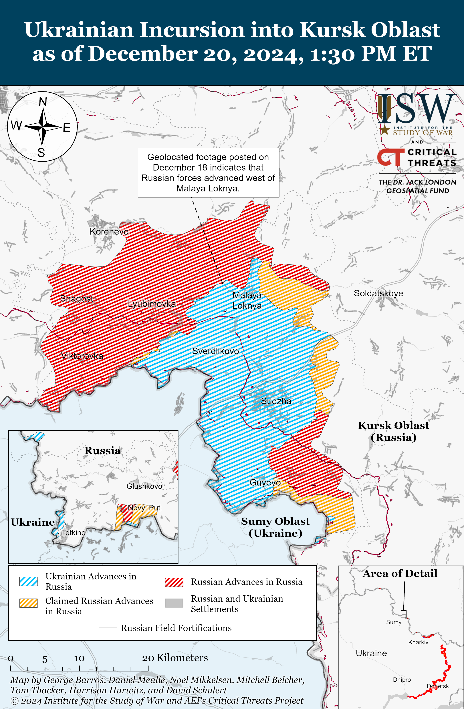
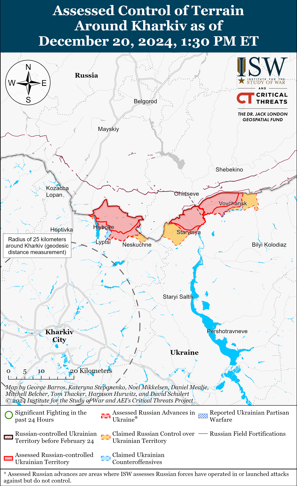
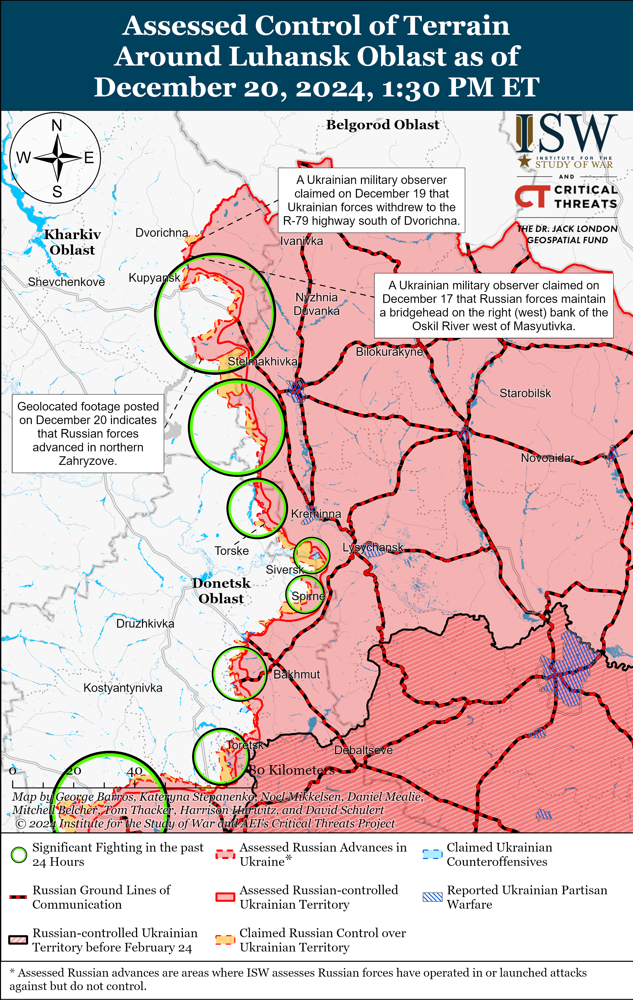
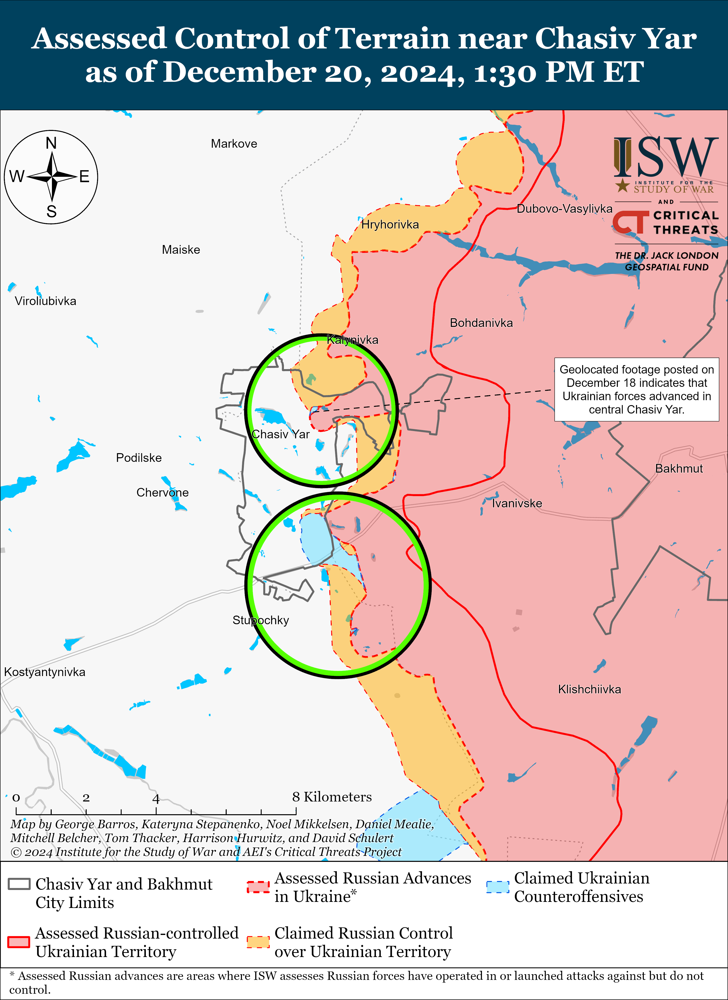
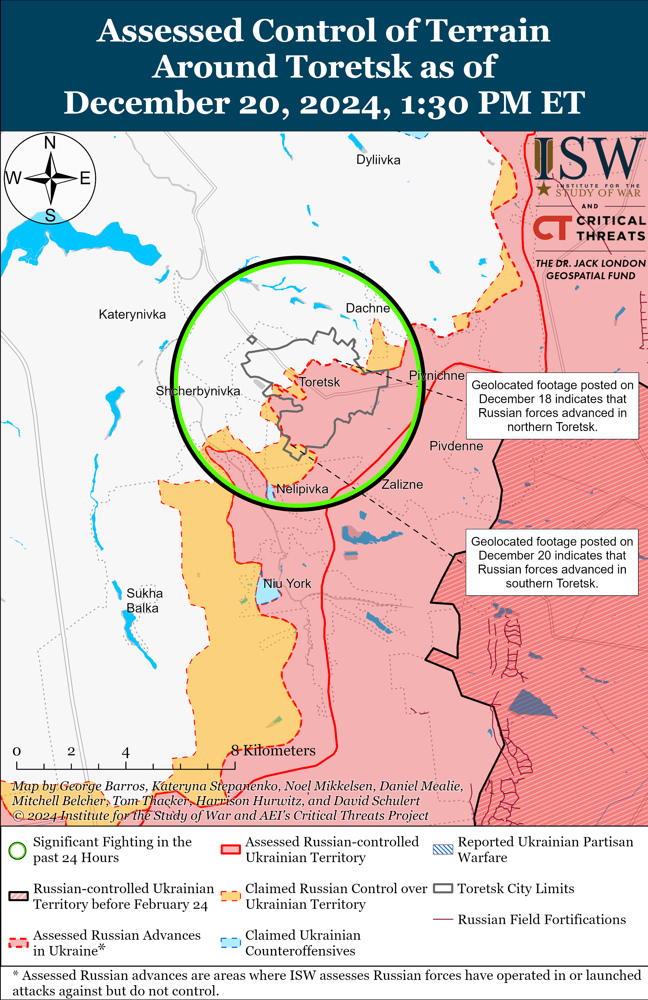
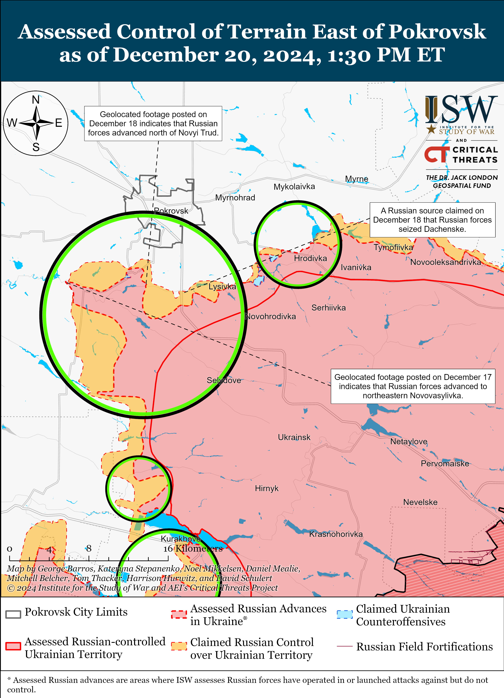
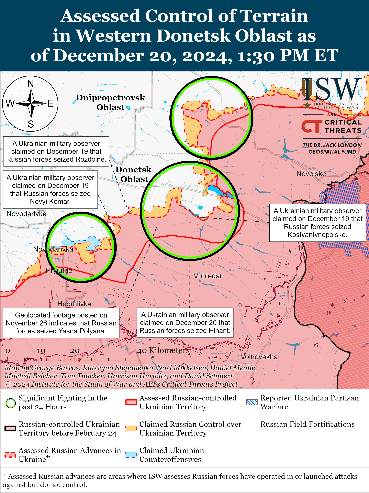
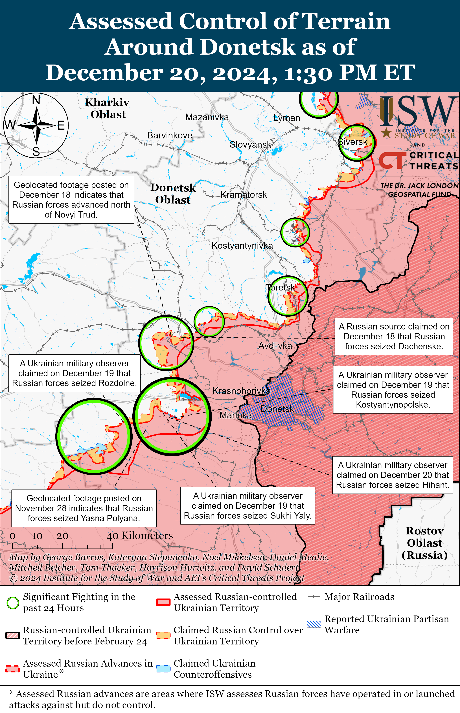
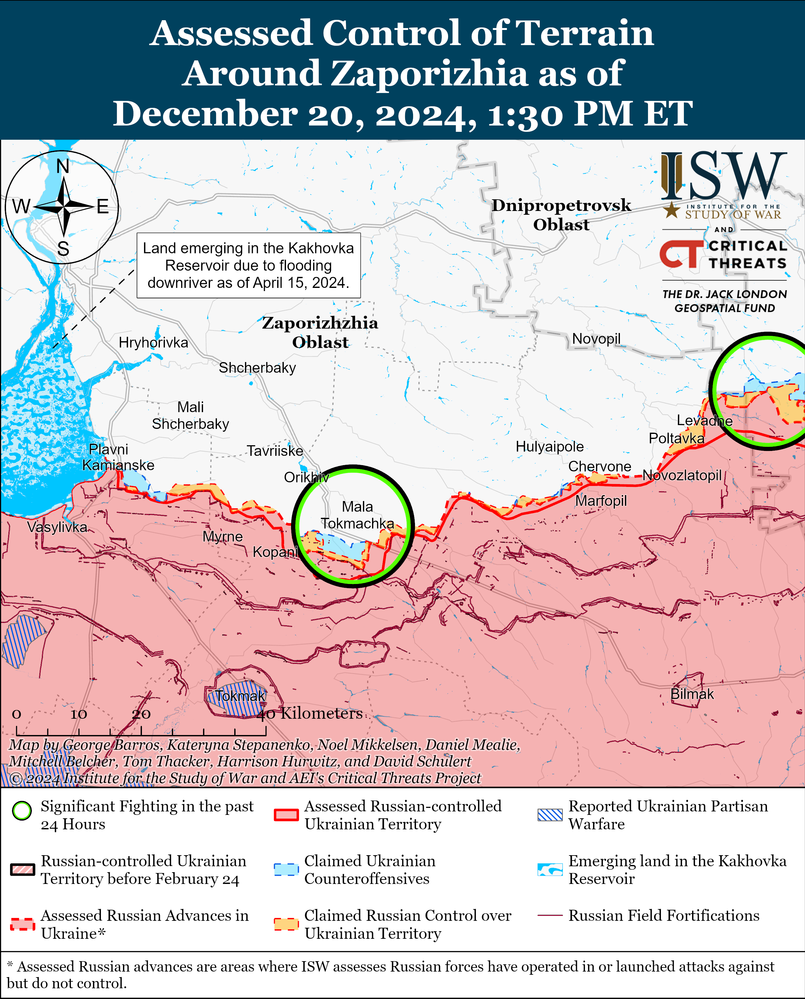
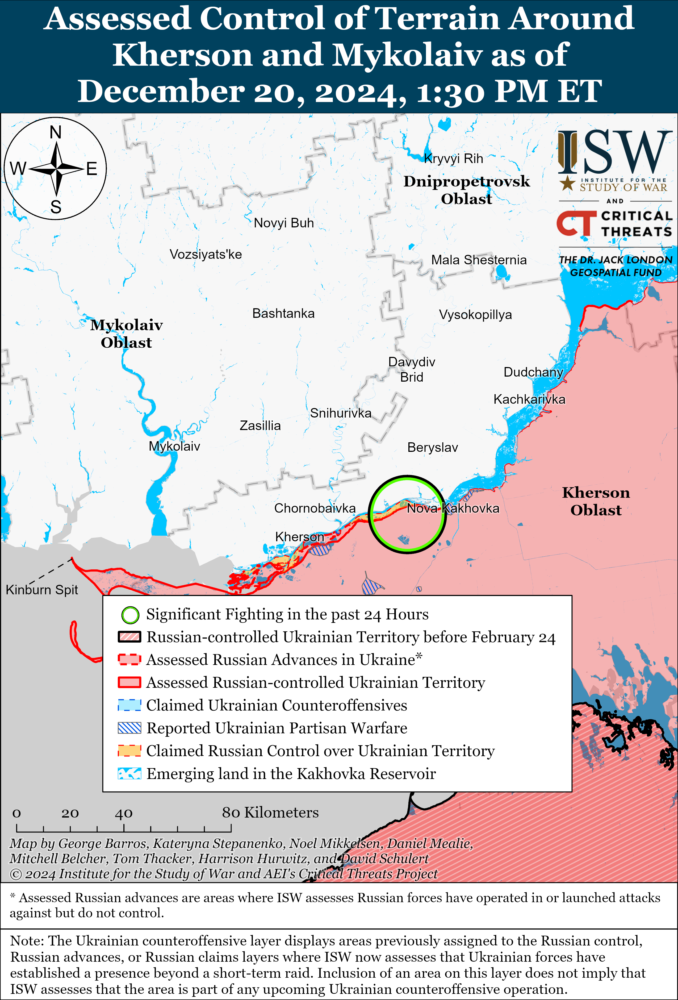

# Russian Offensive Campaign Assessment, December 20, 2024

**Grace Mappes, Angelica Evans, Karolina Hird, Olivia Gibson, Nicole Wolkov, and Frederick W. Kagan**

**December 20, 2024, 4:10pm ET**

**Click** [**here**](https://storymaps.arcgis.com/stories/36a7f6a6f5a9448496de641cf64bd375) **to see ISW’s interactive map of the Russian invasion of Ukraine. This map is updated daily alongside the static maps present in this report.**

**Click** [**here**](https://storymaps.arcgis.com/stories/83a2f24901c941d581c0c523ecd2619b) **to see ISW’s interactive map of Ukraine’s offensive in Kursk Oblast.**

**Click** [**here**](https://understandingwar.maps.arcgis.com/apps/instant/3dviewer/index.html?appid=1602762dbcde419bb957dea358449580) **to see ISW’s 3D control of terrain topographic map of Ukraine. Use of a computer (not a mobile device) is strongly recommended for using this data-heavy tool.**

**Click** [**here**](https://storymaps.arcgis.com/stories/733fe90805894bfc8562d90b106aa895) **to access ISW’s archive of interactive time-lapse maps of the Russian invasion of Ukraine. These maps complement the static control-of-terrain map that ISW produces daily by showing a dynamic frontline. ISW will update this time-lapse map archive monthly.**

**Note: The data cut-off for this product was 12:00 pm ET on December 20. ISW will cover subsequent reports in the December 21 Russian Offensive Campaign Assessment.**

**Russian ballistic missile strikes damaged several embassies in central Kyiv on the morning of December 20.** The Ukrainian Air Force reported that Russian forces launched five Iskander-M/North Korean KN-23 ballistic missiles at Kyiv City on the morning of December 20 and that Ukrainian forces downed all five, but that missile debris damaged infrastructure in Kyiv City and caused civilian casualties.[1] Ukrainian Ministry of Foreign Affairs (MFA) Spokesperson Heorhiy Tykhyi stated that the Russian missile strike damaged multiple embassies in a single building, including the embassies of Albania, Argentina, Montenegro, North Macedonia, Palestine, and Portugal.[2] Kyiv City officials reported that debris from Russian missiles damaged warehouses and infrastructure in Kyiv City.[3] The Ukrainian Air Force reported that Russian forces also launched an Iskander-M ballistic missile, a Kh-59/69 cruise missile, and 65 Shahed and other drones at Ukraine overnight on December 19 to 20, of which Ukrainian air defenses downed 40 drones and electronic warfare (EW) interference caused 20 drones to become lost.[4] The Ukrainian Air Force reported that the overnight drone and missile strikes damaged civilian infrastructure in Dnipropetrovsk, Kharkiv, Kyiv, and Sumy oblasts.

**Ukrainian forces reportedly conducted their first attack solely using unmanned ground vehicles (UGVs) and first-person view (FPV) drones, highlighting Ukraine’s ongoing efforts to leverage technological innovation into ground operations.** The spokesperson of a Ukrainian brigade operating in the Kharkiv direction reported on December 20 that Ukrainian forces conducted their first ground attack exclusively using robotic systems instead of infantry on an unspecified date near Lyptsi (north of Kharkiv City) and successfully destroyed unspecified Russian positions during the attack.[5] The spokesperson stated that Ukrainian forces conducted the attack with dozens of UGVs equipped with machine guns and also used the UGVs to lay and clear mines in unspecified positions in the area. Ukrainian officials have repeatedly highlighted Ukraine’s efforts to utilize technological innovations and asymmetric strike capabilities to offset Ukraine’s manpower limitations in contrast with Russia’s willingness to accept unsustainable casualty rates for marginal territorial gains.[6]

Ukraine also continues to innovate aerial drone production. The Ukrainian General Staff reported that Ukrainian officials completed tests of a drone attached to fiber optic cables that will be more resistant to electronic warfare (EW) interference.[7] Russian forces have recently fielded such drones in Kursk Oblast and Ukraine.[8] A Ukrainian drone company reported that it recently assembled a prototype of the first FPV drone made exclusively from components manufactured in Ukraine.[9]

**Russian President Vladimir Putin announced his intention to orient Russia’s political and ideological priorities for 2025 around Russian veterans.** Putin proposed on December 20 that Russia declare 2025 the “Year of the Defender of the Fatherland” to honor Russian veterans of the war in Ukraine and veterans of all other Russian wars.[10] Putin notably made this proposal while at a Russian State Council meeting discussing state support for families, which was the Kremlin’s defined priority for 2024—the “Year of the Family.”[11]

The Kremlin has lately taken several steps to cater to and empower Russian veterans of the war in Ukraine. The “Time of Heroes” program, for example, seeks to place veterans of the war in Ukraine into local and federal government positions for a two-fold effect—on one hand to appease a growing portion of the Russian population that has fought in Ukraine, and on the other to install militaristic ideals at all levels of governance.[12] Putin’s focus on 2025 as the “Year of the Defender of the Fatherland” is likely meant to further appease the veteran class and to proliferate organizations and programs such as the “Time of Heroes.” Putin likely understands that in order to sustain the manpower requirements of his war in Ukraine, he cannot disenfranchise the growing veteran class, and the Kremlin’s defined 2025 ideological priorities are likely intended to curry favor with and even coopt this population as the war continues.

**The Kremlin continues to scapegoat Kursk Oblast civil servants for its failure in responding to Ukraine’s Kursk Oblast incursion.** Kremlin newswire *TASS* reported on December 20, citing law enforcement sources, that Russian authorities detained the state-owned Kursk Oblast Development Corporation General Director Vladimir Lukin on December 20 under suspicion of abuse of power for embezzling 173.2 million rubles (about $1.6 million) for the construction of fortifications in the Kursk Oblast border area.[13] Russian authorities also detained Kursk Oblast Development Corporation former Deputy Director Igor Grabin on similar charges on December 9.[14] The Kremlin recently scapegoated former Kursk Oblast Governor Alexei Smirnov, likely to appear dedicated to solving social issues in Kursk Oblast and quelling local protests while distracting from Russia’s failure to repel the Ukrainian incursion.[15]

Roman Alekhin, a Russian milblogger and advisor to the Kursk Oblast Governor, commented on Lukin’s arrest and stated that the civil servants working for the Kursk Oblast Development Corporation should not bear responsibility for Russia’s failure to defend the Kursk Oblast border, but rather that blame should fall on the entities responsible for Russian border security in wartime including the Russian Ministry of Defense (MoD) and Federal Security Service’s (FSB) Border Guard Directorate.[16] The Kremlin continues to indicate that it has no intention of actually solving these issues in Kursk Oblast, however.

Russian President Vladimir Putin dedicated a portion of his annual Direct Line televised press conference on December 19 to discussing his plans to conduct major housing and infrastructure reconstruction projects in occupied Ukraine, attention that the Kremlin is not affording to its territory in Kursk Oblast.[17] New Kursk Oblast Governor Alexander Khinshtein, whom Putin appointed to replace Smirnov, stated on December 20 that the Russian state will not assume all costs of restoring Kursk Oblast facilities destroyed in the war due to the high degree of damage and the state’s other financial obligations, including social guarantees and continuing to fund the war in Ukraine.[18]

**Key Takeaways:**

- **Russian ballistic missile strikes damaged several embassies in central Kyiv on the morning of December 20.**
- **Ukrainian forces reportedly conducted their first attack solely using unmanned ground vehicles (UGVs) and first-person view (FPV) drones, highlighting Ukraine’s ongoing efforts to leverage technological innovation into ground operations.**
- **Russian President Vladimir Putin announced his intention to orient Russia’s political and ideological priorities for 2025 around Russian veterans.**
- **The Kremlin continues to scapegoat Kursk Oblast civil servants for its failure in responding to Ukraine’s Kursk Oblast incursion.**
- **Russian forces recently advanced in Kursk Oblast, near Kupyansk, within Toretsk, and in the Vuhledar direction.**
- **Russian opposition outlet *Mediazona* reported on December 20 that it has confirmed that at least 20,364 Russian soldiers have been killed in action (KIA) in Ukraine since January 1, 2024.**

***We do not report in detail on Russian war crimes because these activities are well-covered in Western media and do not directly affect the military operations we are assessing and forecasting. We will continue to evaluate and report on the effects of these criminal activities on the Ukrainian military and the Ukrainian population and specifically on combat in Ukrainian urban areas. We utterly condemn Russian violations of the laws of armed conflict and the Geneva Conventions and crimes against humanity even though we do not describe them in these reports.***

- Ukrainian Operations in the Russian Federation
- Russian Main Effort – Eastern Ukraine (comprised of three subordinate main efforts)
- Russian Subordinate Main Effort #1 – Push Ukrainian forces back from the international border with Belgorod Oblast and approach to within tube artillery range of Kharkiv City
- Russian Subordinate Main Effort #2 – Capture the remainder of Luhansk Oblast and push westward into eastern Kharkiv Oblast and encircle northern Donetsk Oblast
- Russian Subordinate Main Effort #3 – Capture the entirety of Donetsk Oblast
- Russian Supporting Effort – Southern Axis
- Russian Air, Missile, and Drone Campaign
- Russian Mobilization and Force Generation Efforts
- Russian Technological Adaptations
- Activities in Russian-occupied areas
- Significant Activity in Belarus

**Ukrainian Operations in the Russian Federation**

Russian forces recently advanced within the Ukrainian salient in Kursk Oblast amid continued offensive operations on December 20. Geolocated footage published on December 18 shows Ukrainian forces striking alleged North Korean positions under Russian command west of Malaya Loknya (north of Sudzha), indicating that Russian forces recently advanced west of Malaya Loknya.[19] A Russian milblogger claimed that Russian forces advanced southeast of Sudzha near Cherkasskaya Konopelka, but ISW has not observed confirmation of this claim.[20] A Russian milblogger claimed that Ukrainian forces counterattacked near Novoivanovka and Darino (both southeast of Korenevo).[21] Elements of the Russian 106th Airborne (VDV) Division reportedly continue operating in Kursk Oblast.[22] A Russian milblogger claimed on December 20 that a drone crew of the Russian 34th Motorized Rifle Brigade (49th Combined Arms Army [CAA], Southern Military District [SMD]) is operating near Malaya Loknya.[23] ISW observed reports as of December 12 that elements of the Russian 34th Motorized Rifle Brigade were operating near Velyka Novosilka and has observed reports throughout 2024 that elements of this brigade were operating in the Velyka Novosilka area.[24]

Pentagon Spokesperson Major General Patrick Ryder stated on December 19 that the US assesses that “several hundred” North Korean military personnel have been killed and wounded in Kursk Oblast.[25] Ukraine’s Main Military Intelligence Directorate (GUR) stated on December 19 that North Korean forces are operating south of Sudzha near Plekhovo, east of Sudzha near Russkaya Konopelka, and southeast of Sudzha near Ulanok and are facing rocket-propelled grenade (RPG) ammunition shortages.[26]

Russian milbloggers claimed that Ukrainian forces struck Rylsk, Kursk Oblast on December 20 with ATACMS missiles, although acting Kursk Oblast Governor Alexander Khinshtein claimed that Russian forces downed several HIMARS rockets near Rylsk.[27]

The GUR reported on December 20 that a December 12 explosion at Ostafyevo Airfield near Moscow City destroyed a Russian An-72 transport aircraft.[28]

**Russian Main Effort – Eastern Ukraine**

**Russian Subordinate Main Effort #1 – Kharkiv Oblast (Russian objective: Push Ukrainian forces back from the international border with Belgorod Oblast and approach to within tube artillery range of Kharkiv City)**

Neither Russian nor Ukrainian sources reported ground activity in northern Kharkiv Oblast on December 20. A Ukrainian unit commander operating in the Kharkiv direction stated that Russian forces continue to conduct infantry assaults and that weather conditions are preventing Russian forces from conducting mechanized assaults in the area.[29] The unit commander added that heavy rain is preventing Ukrainian and Russian forces from using reconnaissance drones.

**Russian Subordinate Main Effort #2 – Luhansk Oblast (Russian objective: Capture the remainder of Luhansk Oblast and push westward into eastern Kharkiv Oblast and northern Donetsk Oblast)**

Russian forces recently advanced southeast of Kupyansk amid continued fighting along the Kupyansk-Svatove-Kreminna line on December 20. Geolocated footage published on December 20 shows that Russian forces recently advanced into northern Zahryzove (southeast of Kupyansk).[30] Kharkiv Oblast Military Administration Head Oleh Synehubov reported that Russian forces are attempting to bypass Dvorichna (north of Kupyansk) from the north and that Russian forces may hold limited positions in forests on the west (right) bank of the Oskil River north of Dvorichna.[31] Synehubov reported that Russian forces will deploy groups of two personnel at a time to gain a foothold and attack after accumulating 10 to 20 personnel in one area.[32] Russian forces continued offensive operations north of Kupyansk near Dvorichna; northeast of Kupyansk near Synkivka and Lyman Pershyi; east of Kupyansk near Petropavlivka; southeast of Kupyansk near Zahryzove, Lozova, Kolisynkivka, and Hlushkivka; west of Svatove near Zeleny Hai and Kopanky; southwest of Svatove near Tverdokhlibove; northwest of Kreminna near Ivanivka, Terny, and Yampolivka; west of Kreminna near Torske, and southwest of Kreminna in the Serebryanske forest area on December 19 and 20.[33] Elements of the Russian 27th Motorized Rifle Brigade (1st Guards Tank Army [GTA], Moscow Military District [MMD]) reportedly continue to operate near Kupyansk.[34]

Russian forces continued offensive operations northeast of Siversk near Bilohorivka and Hryhorivka and east of Siversk near Verkhnokamyanske on December 19 and 20 but did not make any confirmed advances.[35]

Russian forces continued offensive operations within Chasiv Yar and its environs on December 19 and 20 but did not make any confirmed advances.[36] Russian milbloggers claimed on December 20 that Russian forces have begun pushing towards Novyi Microraion (eastern Chasiv Yar) from the north.[37] Another Russian milblogger claimed that fighting continued for the Refractory Plant in central Chasiv Yar.[38] Elements of the Russian 98th Airborne (VDV) Division reportedly continue operating near Novyi Microraion.[39]

Russian forces recently advanced in northern and southern Toretsk amid continued offensive operations in the area on December 19 and 20. Geolocated footage published on December 18 and 20 indicates that Russian forces marginally advanced to Ukrainska Street in northern Toretsk and to Haharina Street in southeastern Toretsk.[40] A Russian milblogger claimed that Russian forces advanced up to 500 meters in Zabalka Microraion (southeastern Toretsk), a claim that is generally consistent with the available geolocated footage of Russian gains along Haharina Street.[41] Another Russian milblogger claimed that Ukrainian forces are counterattacking north of the Tsentralna Mine waste heap in central Toretsk.[42] Fighting continued in Toretsk itself; west of Torestk near Shcherbynivka; and southwest of Toretsk near Leonidivka and Sukha Balka on December 19 and 20.[43]

Russian forces continued offensive operations in the Pokrovsk direction on December 20 but did not make any confirmed advances. Russian milbloggers claimed that Russian forces advanced southwest of Pokrovsk to eastern Solone, northern Novoolenivka, and eastern Ukrainka.[44] ISW has not observed visual confirmation of these claims, however. Fighting continued east of Pokrovsk near Myrolyubivka and Promin; southeast of Pokrovsk near Lysivka; south of Pokrovsk near Zelene, Dachenske, and Novyi Trud; and southwest of Pokrovsk near Solone, Novovasylivka, Novooleksiivka, Vovkove, Pishchane, and Ukrainka on December 19 and 20.[45] The Russian Ministry of Defense (MoD) credited elements of the Russian 15th Motorized Rifle Brigade (2nd Combined Arms Army [CAA], Central Military District [CMD]) with participating in the seizure of Novopustynka (southwest of Pokrovsk), which ISW assessed that Russian forces seized as of December 5.[46]

Russian forces continued offensive operations in the Kurakhove direction on December 20 but did not make any confirmed advances. Russian milbloggers claimed that Russian forces continued fighting for the high-rise building area in western Kurakhove, but noted that Ukrainian forces still maintain positions on the western outskirts of the town.[47] Russian milbloggers also claimed that Russian forces are conducting constant assaults from Stari Terny (just northwest of Kurakhove) towards Shevchenko (just west of Stari Terny), likely in order to attack Dachne (west of Kurakhove) and further interdict the H-15 Kurakhove-Pokrovske road.[48] A Ukrainian brigade spokesperson operating in the Kurakhove direction stated that Russian forces are attacking urban areas in squads of two to five personnel and using fiber-optic first-person view (FPV) drones and light vehicles to support ground assaults.[49] The Ukrainian General Staff reported that Russian forces conducted ground attacks near Kurakhove itself; northwest of Kurakhove near Sontsivka, Stary Terny, and in the direction of Andriivka; west of Kurakhove near Dachne; and south of Kurakhove near Dalne on December 19 and 20.[50] Elements of the Russian 5th Motorized Rifle Brigade (51st Combined Arms Army [CAA], formerly 1st Donetsk People’s Republic Army Corps [DNR AC]) are reportedly operating along Mechnikova Street in western Kurakhove; elements of the “Borz” and “Shtorm” battalions of the 110th Motorized Rifle Brigade (51st CAA) are operating within Kurakhove; and elements of the 33rd and 255th motorized rifle regiments (both 20th Motorized Rifle Division, 8th CAA, Southern Military District [SMD]) are operating in the Kurakhove direction.[51]

Russian forces likely made additional gains northwest of Vuhledar in recent weeks and continued offensive operations northwest and northeast of Vuhledar on December 20. Geolocated footage published on November 28 indicates that Russian forces likely seized Yasna Polyana (northwest of Vuhledar) in late November 2024.[52] Russian sources reiterated claims that Russian forces seized positions in the Uspenivka-Kostyantynopolske area (north of Vuhledar), consistent with ISW’s assessment of Russian control of terrain in the area.[53] Ukraine’s Khortytsia Group of Forces denied claims that Russian forces encircled Ukrainian forces in Uspenivka and reported that the Ukrainian command decided to fully withdraw Ukrainian troops from this area at a recent unspecified date.[54] Russian milbloggers claimed that Russian forces are advancing towards Hihant (just west of Kostyantynopolske) and Yantarne (northwest of Kostyantynopolske) and have reached the southern outskirts of Ulakly (northwest of Vuhledar but west of Kurakhove).[55] ISW has not observed confirmation of Russian forces operating within Ulakly, however. The Ukrainian General Staff reported that Russian forces conducted ground attacks northwest of Vuhledar in the direction of Bahatyr and Rozlyv and north of Vuhledar near Uspenivka and Kostyantynopolske on December 19 and 20.[56] Russian sources credited elements of the 255th Motorized Rifle Regiment (20th Motorized Rifle Division, 8th CAA, SMD) for participating in the seizure of Uspenivka and elements of the 39th Motorized Rifle Brigade (68th AC, Eastern Military District [EMD]) for participating in the seizure of Kostyantynopolske and Trudove (north of Vuhledar).[57] Elements of the Russian 14th Spetsnaz Brigade (Russian General Staff’s Main Directorate [GRU]) are reportedly operating in the south Donetsk direction (between Vuhledar and the Donetsk-Zaporizhia Oblast border).[58]

Russian forces continued offensive operations in the Donetsk-Zaporizhia Oblast border area on December 20 but did not make any confirmed advances. Russian sources claimed that Russian forces advanced towards Storozheve from positions in Blahodatne and Makarivka (all south of Velyka Novosilka) and near Rivnopil (southwest of Velyka Novosilka), Rozdolne (northeast of Velyka Novosilka) and within Novyi Komar (north of Velyka Novosilka).[59] The Ukrainian General Staff reported that Russian forces conducted ground attacks near Velyka Novosilka itself; south of Velyka Novosilka near Blahodatne, Neskuchne, and Makarivka; southwest of Velyka Novosilka near Novopil and Novodarivka; and west of Velyka Novosilka near Novosilka.[60] Elements of the Russian 2nd Battalion of its 37th Motorized Rifle Brigade (36th CAA, EMD) and the 40th Naval Infantry Brigade (Pacific Fleet, EMD) are operating near Rozdolne and Novyi Komar; and elements of the 5th CAA (EMD) are reportedly operating near Neskuchne.[61]

**Russian Supporting Effort – Southern Axis (Russian objective: Maintain frontline positions and secure rear areas against Ukrainian strikes)**

Russian milbloggers claimed that Ukrainian forces retook positions in western Zaporizhia Oblast amid continued Russian assaults in the area on December 20. Russian milbloggers claimed that Ukrainian forces counterattacked and are advancing from Kamyanske into Luhkove (northwest of Robotyne).[62] Russian forces continued assaults northeast of Robotyne near Mala Tokmachka and north of Robotyne near Novodanylivka on December 19 and 20.[63]

Russian forces continued assaults in the Dnipro direction, including near Kozatskyi Island (northeast of Kherson City), on December 19 and 20.[64] Ukraine’s Southern Operational Command Spokesperson Colonel Vladyslav Voloshyn stated that a Russian sabotage and reconnaissance group attempted to cross the Dnipro River near the Antonivsky Bridge, but Ukrainian forces repelled the attack.[65] Ukrainian Kherson Oblast Military Administration Head Oleksandr Prokudin stated that Russian forces have been attempting to cross the Dnipro River near Kherson City for the past week (December 13 to 20).[66]

**Russian Air, Missile, and Drone Campaign (Russian Objective: Target Ukrainian military and civilian infrastructure in the rear and on the frontline)**

See topline text.

**Russian Mobilization and Force Generation Efforts (Russian objective: Expand combat power without conducting general mobilization)**

Russian opposition outlet *Mediazona* reported on December 20 that it has confirmed that at least 20,364 Russian soldiers have been killed in action (KIA) in Ukraine since January 1, 2024.[67] *Mediazona* noted that Russian KIAs have increased every year of the war and that volunteer servicemembers represented the majority of Russian KIA in 2024. *Mediazona* reported that the republics of Bashkortostan and Tatarstan suffered the most losses of any Russian federal subject in 2024. *Mediazona*‘*s* confirmation of Russian KIA in 2024 is likely far below the total Russian KIA suffered this year, as reports from the Ukrainian General Staff indicate that Russian forces suffered over 120,000 casualties (KIA and wounded in action [WIA]) in September, October, and November 2024 alone.[68]

**Russian Technological Adaptations (Russian objective: Introduce technological innovations to optimize systems for use in Ukraine)**

Nothing significant to report.

**Activities in Russian-occupied areas (Russian objective: Consolidate administrative control of annexed areas; forcibly integrate Ukrainian citizens into Russian sociocultural, economic, military, and governance systems)**

*ISW is not publishing coverage of activities in Russian-occupied areas today.*

**Significant activity in Belarus (Russian efforts to increase its military presence in Belarus and further integrate Belarus into Russian-favorable frameworks)**

Nothing significant to report.

**Note: ISW does not receive any classified material from any source, uses only publicly available information, and draws extensively on Russian, Ukrainian, and Western reporting and social media as well as commercially available satellite imagery and other geospatial data as the basis for these reports. References to all sources used are provided in the endnotes of each update.**

[1] https://t.me/kpszsu/25153

[2] https://suspilne dot media/907175-raketnij-udar-po-kievu-cerez-obstril-postrazdali-posolstva-nizki-krain/

[3] https://t.me/VA\_Kyiv/10148; https://t.me/VA\_Kyiv/10150; https://t.me/dsns\_telegram/36169; https://t.me/VA\_Kyiv/10133; https://t.me/VA\_Kyiv/10144; https://t.me/VA\_Kyiv/10132; https://t.me/vitaliy\_klitschko/3892; https://t.me/VA\_Kyiv/10129; https://t.me/VA\_Kyiv/10128; https://t.me/vitaliy\_klitschko/3886; https://www.facebook.com/RuslanKravchenkoKyiv/posts/pfbid0B8p6n1316ePHLAqPGvbcMDpM7rZ58gF7haqgwBdgYgvZvhajUDX7jwSoBxpKNM4Hl?locale=uk\_UA; https://t.me/VA\_Kyiv/10117 ; https://armyinform.com dot ua/2024/12/20/protyvnyk-atakuvav-kyyiv-dronamy-ulamky-vpaly-v-odnomu-z-rajoniv-stolyczi/

[4] https://t.me/kpszsu/25153

[5] https://youtu.be/aDXWlQ2K0dM ; https://armyinform.com dot ua/2024/12/20/psyhichna-ataka-droyidiv-na-harkivshhyni-v-ataku-pishla-rota-ukrayinskyh-robotiv/

[6] https://isw.pub/UkrWar070724 ; https://isw.pub/UkrWar021424 ; https://isw.pub/UkrWar020124 ; https://isw.pub/UkrWar120524 ; https://understandingwar.org/backgrounder/russian-offensive-campaign-assessment-november-9-2024

[7] https://www.facebook.com/GeneralStaff.ua/posts/pfbid0AzBg6kmhvMobMvRUfQ57aSy5XsumFouF7ZtEr9dgKUJkB9wYJQTDjsDh1Qx3qhn6l?ref=embed\_post

[8] https://understandingwar.org/backgrounder/russian-offensive-campaign-assessment-december-19-2024 ; https://understandingwar.org/backgrounder/russian-offensive-campaign-assessment-december-2-2024 ; https://understandingwar.org/backgrounder/russian-offensive-campaign-assessment-december-9-2024

[9] https://mil.in dot ua/uk/news/v-ukrayini-sklaly-pershyj-povnistyu-ukrayinskyj-fpv-dron/

[10] http://kremlin dot ru/events/president/news/75918; https://t.me/tass\_agency/292379 ; https://t.me/tass\_agency/292383

[11] https://tass dot ru/politika/19352595

[12] https://understandingwar.org/backgrounder/russian-offensive-campaign-assessment-november-18-2024; https://understandingwar.org/backgrounder/russian-offensive-campaign-assessment-december-14-2024; https://isw.pub/UkrWar090924; https://isw.pub/UkrWar061524

[13] https://tass dot ru/proisshestviya/22726599?ysclid=m4wggsbptc186985771

[14] https://theins dot ru/news/277356; https://www.rbc dot ru/politics/09/12/2024/6756bdde9a7947beb6816d63

[15] https://isw.pub/UkrWar120624

[16] https://t.me/Alekhin\_Telega/12570

[17] https://understandingwar.org/backgrounder/russian-offensive-campaign-assessment-december-19-2024; https://tass dot ru/obschestvo/22715705; https://tass dot ru/obschestvo/22715665; https://tass dot ru/politika/22715639; https://tass dot ru/obschestvo/22715509; https://tass dot ru/ekonomika/22715469

[18] https://meduza dot io/news/2024/12/20/gosudarstvo-ne-vozmet-na-sebya-100-rashodov-u-nas-izvinite-kazhdyy-snaryad-stoit-deneg-hinshteyn-o-vosstanovlenii-kurskoy-oblasti; https://t.me/severrealii/28871

[19] https://t.me/WarArchive\_ua/23756; https://t.me/informnapalm/23653

[20] https://t.me/dva\_majors/60645

[21] https://t.me/dva\_majors/60645

[22] https://t.me/mod\_russia/47095

[23] https://t.me/dva\_majors/60692

[24] https://understandingwar.org/backgrounder/russian-offensive-campaign-assessment-december-12-2024 ; https://understandingwar.org/backgrounder/russian-offensive-campaign-assessment-june-5-2024 ; https://understandingwar.org/backgrounder/russian-offensive-campaign-assessment-march-19-2024 ; https://understandingwar.org/backgrounder/russian-offensive-campaign-assessment-january-27-2024

[25] https://www.defense.gov/News/Transcripts/Transcript/Article/4013765/pentagon-press-secretary-maj-gen-pat-ryder-holds-press-briefing/

[26] https://t.me/DIUkraine/5051

[27] https://t.me/rybar/66514 ; https://t.me/RVvoenkor/83052; https://t.me/DnevnikDesantnika/21277 ; https://t.me/DnevnikDesantnika/21278 ; https://t.me/wargonzo/23873 ; https://t.me/wargonzo/23871; https://t.me/motopatriot/30724 ; https://t.me/boris\_rozhin/148544 ; https://t.me/Hinshtein/8773 ; https://t.me/Hinshtein/8774 ; https://t.me/tass\_agency/292399 ; https://t.me/tass\_agency/292400

[28] https://t.me/DIUkraine/5060

[29] https://armyinform.com dot ua/2024/12/20/czaryczya-poliv-jde-v-mogyly-rotamy-na-harkivshhyni-okupanty-ne-zhaliyut-svoyu-pihotu/

[30] https://x.com/Bielitzling/status/1870148114314674677; https://x.com/Bielitzling/status/1870148432939155676; https://t.me/osirskiy/1002; https://t.me/tass\_agency/292276

[31] https://suspilne dot media/kharkiv/907153-pid-kontrolem-sil-oboroni-oleg-sinegubov-rozpoviv-pro-situaciu-u-dvoricnij-na-kupanskomu-napramku/

[32] https://suspilne dot media/kharkiv/907153-pid-kontrolem-sil-oboroni-oleg-sinegubov-rozpoviv-pro-situaciu-u-dvoricnij-na-kupanskomu-napramku/

[33] https://www.facebook.com/GeneralStaff.ua/posts/pfbid0wMHSMp5hEZJgqeg8qCQ54Sa4cVZBDrmDoeqn6mVMdfvSSi4mNoen9FcY2TWNdaFDl; https://www.facebook.com/GeneralStaff.ua/posts/pfbid02eAjvoFE4S166LQSmoGNcVFP66jwakivrBW4qjgXPYjKLMxbFY4h5NNt1DimjcECzl; https://www.facebook.com/GeneralStaff.ua/posts/pfbid032vKuE5gsvPkp7M4eUn1acpyUovJiqoH9bB7UR7tzdZu9ScTKVCnh37PZAdaB8Pkwl; https://t.me/DnevnikDesantnika/21241; https://t.me/Khortytsky\_wind/3555; https://t.me/dva\_majors/60645

[34] https://t.me/RVvoenkor/82988

[35] https://www.facebook.com/GeneralStaff.ua/posts/pfbid02eAjvoFE4S166LQSmoGNcVFP66jwakivrBW4qjgXPYjKLMxbFY4h5NNt1DimjcECzl ; https://www.facebook.com/GeneralStaff.ua/posts/pfbid032vKuE5gsvPkp7M4eUn1acpyUovJiqoH9bB7UR7tzdZu9ScTKVCnh37PZAdaB8Pkwl

[36] https://t.me/Khortytsky\_wind/3555 ; https://www.facebook.com/GeneralStaff.ua/posts/pfbid032vKuE5gsvPkp7M4eUn1acpyUovJiqoH9bB7UR7tzdZu9ScTKVCnh37PZAdaB8Pkwl ; https://www.facebook.com/GeneralStaff.ua/posts/pfbid02eAjvoFE4S166LQSmoGNcVFP66jwakivrBW4qjgXPYjKLMxbFY4h5NNt1DimjcECzl ; https://www.facebook.com/GeneralStaff.ua/posts/pfbid0wMHSMp5hEZJgqeg8qCQ54Sa4cVZBDrmDoeqn6mVMdfvSSi4mNoen9FcY2TWNdaFDl

[37] https://t.me/boris\_rozhin/148544 ; https://t.me/DnevnikDesantnika/21250

[38] https://t.me/DnevnikDesantnika/21250

[39] https://t.me/DnevnikDesantnika/21250

[40] https://t.me/creamy\_caprice/7877 ; https://www.instagram.com/reel/DDtlLsgoFVQ/ ; https://x.com/AudaxonX/status/1870006136390193641 ; https://x.com/AudaxonX/status/1870006294427402362 ; https://x.com/AudaxonX/status/1870006366708072917

[41] https://t.me/DnevnikDesantnika/21268

[42] https://t.me/dva\_majors/60645

[43] https://www.facebook.com/GeneralStaff.ua/posts/pfbid032vKuE5gsvPkp7M4eUn1acpyUovJiqoH9bB7UR7tzdZu9ScTKVCnh37PZAdaB8Pkwl ; https://www.facebook.com/GeneralStaff.ua/posts/pfbid02eAjvoFE4S166LQSmoGNcVFP66jwakivrBW4qjgXPYjKLMxbFY4h5NNt1DimjcECzl ; https://www.facebook.com/GeneralStaff.ua/posts/pfbid0wMHSMp5hEZJgqeg8qCQ54Sa4cVZBDrmDoeqn6mVMdfvSSi4mNoen9FcY2TWNdaFDl

[44] https://t.me/voenkorKotenok/60859 ; https://t.me/voenkorKotenok/60859 ; https://t.me/voenkorKotenok/60870 ; https://t.me/dva\_majors/60645 ; https://t.me/boris\_rozhin/148544 ; https://t.me/voenkorKotenok/60875

[45] https://www.facebook.com/GeneralStaff.ua/posts/pfbid032vKuE5gsvPkp7M4eUn1acpyUovJiqoH9bB7UR7tzdZu9ScTKVCnh37PZAdaB8Pkwl ; https://www.facebook.com/GeneralStaff.ua/posts/pfbid02eAjvoFE4S166LQSmoGNcVFP66jwakivrBW4qjgXPYjKLMxbFY4h5NNt1DimjcECzl ; https://www.facebook.com/GeneralStaff.ua/posts/pfbid0wMHSMp5hEZJgqeg8qCQ54Sa4cVZBDrmDoeqn6mVMdfvSSi4mNoen9FcY2TWNdaFDl

[46] https://t.me/mod\_russia/47101 ; https://understandingwar.org/backgrounder/russian-offensive-campaign-assessment-december-6-2024

[47] https://t.me/RVvoenkor/82984; https://t.me/wargonzo/23861; https://t.me/boris\_rozhin/148551; https://t.me/dva\_majors/60645

[48] https://t.me/rybar/66516; https://t.me/RVvoenkor/83034; https://t.me/voenkorKotenok/60870

[49] https://suspilne dot media/donbas/906833-vazki-boi-trivaut-na-okolicah-kurahovogo-ta-u-miskij-zabudovi-46-oaembr/

[50] https://www.facebook.com/GeneralStaff.ua/posts/pfbid0wMHSMp5hEZJgqeg8qCQ54Sa4cVZBDrmDoeqn6mVMdfvSSi4mNoen9FcY2TWNdaFDl; https://www.facebook.com/GeneralStaff.ua/posts/pfbid02eAjvoFE4S166LQSmoGNcVFP66jwakivrBW4qjgXPYjKLMxbFY4h5NNt1DimjcECzl; https://www.facebook.com/GeneralStaff.ua/posts/pfbid032vKuE5gsvPkp7M4eUn1acpyUovJiqoH9bB7UR7tzdZu9ScTKVCnh37PZAdaB8Pkwl

[51] https://t.me/Sladkov\_plus/12084; https://t.me/wargonzo/23857; https://t.me/dva\_majors/60660

[52] https://t.me/creamy\_caprice/7872; https://t.me/ChDambiev/33022

[53] https://t.me/rybar/66516; https://t.me/mod\_russia/47096; https://t.me/DnevnikDesantnika/21241; https://t.me/RVvoenkor/82984

[54] https://t.me/Khortytsky\_wind/3557

[55] https://t.me/rybar/66516; https://t.me/RVvoenkor/82984; https://t.me/voenkorKotenok/60870

[56] https://www.facebook.com/GeneralStaff.ua/posts/pfbid0wMHSMp5hEZJgqeg8qCQ54Sa4cVZBDrmDoeqn6mVMdfvSSi4mNoen9FcY2TWNdaFDl; https://www.facebook.com/GeneralStaff.ua/posts/pfbid02eAjvoFE4S166LQSmoGNcVFP66jwakivrBW4qjgXPYjKLMxbFY4h5NNt1DimjcECzl; https://www.facebook.com/GeneralStaff.ua/posts/pfbid032vKuE5gsvPkp7M4eUn1acpyUovJiqoH9bB7UR7tzdZu9ScTKVCnh37PZAdaB8Pkwl

[57] https://t.me/RVvoenkor/83038; https://t.me/voin\_dv/12374 ; https://t.me/voin\_dv/12375; https://t.me/dva\_majors/60645

[58] https://t.me/voin\_dv/12373; https://t.me/boris\_rozhin/148476

[59] https://t.me/DnevnikDesantnika/21265; https://t.me/wargonzo/23861; https://t.me/dva\_majors/60645; https://t.me/vrogov/18341

[60] https://www.facebook.com/GeneralStaff.ua/posts/pfbid0wMHSMp5hEZJgqeg8qCQ54Sa4cVZBDrmDoeqn6mVMdfvSSi4mNoen9FcY2TWNdaFDl; https://www.facebook.com/GeneralStaff.ua/posts/pfbid02eAjvoFE4S166LQSmoGNcVFP66jwakivrBW4qjgXPYjKLMxbFY4h5NNt1DimjcECzl https://www.facebook.com/GeneralStaff.ua/posts/pfbid032vKuE5gsvPkp7M4eUn1acpyUovJiqoH9bB7UR7tzdZu9ScTKVCnh37PZAdaB8Pkwl

[61] https://t.me/voin\_dv/12376; https://t.me/voin\_dv/12382 ; https://t.me/RVvoenkor/83068; https://t.me/voenkorKotenok/60861; https://t.me/voenkorKotenok/60871

[62] https://t.me/DnevnikDesantnika/21257 ; https://t.me/wargonzo/23861 ; https://t.me/motopatriot/30705 ; https://t.me/notes\_veterans/21103 ; ttps://t.me/notes\_veterans/21118

[63] https://www.facebook.com/GeneralStaff.ua/posts/pfbid0wMHSMp5hEZJgqeg8qCQ54Sa4cVZBDrmDoeqn6mVMdfvSSi4mNoen9FcY2TWNdaFDl ; https://www.facebook.com/GeneralStaff.ua/posts/pfbid02eAjvoFE4S166LQSmoGNcVFP66jwakivrBW4qjgXPYjKLMxbFY4h5NNt1DimjcECzl ; https://www.facebook.com/GeneralStaff.ua/posts/pfbid032vKuE5gsvPkp7M4eUn1acpyUovJiqoH9bB7UR7tzdZu9ScTKVCnh37PZAdaB8Pkwl ; https://t.me/DnevnikDesantnika/21241

[64] https://www.facebook.com/GeneralStaff.ua/posts/pfbid0wMHSMp5hEZJgqeg8qCQ54Sa4cVZBDrmDoeqn6mVMdfvSSi4mNoen9FcY2TWNdaFDl ; https://www.facebook.com/GeneralStaff.ua/posts/pfbid02eAjvoFE4S166LQSmoGNcVFP66jwakivrBW4qjgXPYjKLMxbFY4h5NNt1DimjcECzl ; https://www.facebook.com/GeneralStaff.ua/posts/pfbid032vKuE5gsvPkp7M4eUn1acpyUovJiqoH9bB7UR7tzdZu9ScTKVCnh37PZAdaB8Pkwl ; https://www.facebook.com/OperationalCommandSouth/posts/pfbid022yw1mE8hq3uLXmfEGr3jjYjLCsfpNN5AAtx7e4yd5yb2miNwCxb2X7WtDM51B12il

[65] https://suspilne dot media/kherson/906945-cergova-sproba-rosijskoi-drg-forsuvati-dnipro-v-rajoni-antonivskogo-mostu-bula-marnou-recnik-sil-oboroni-pivdna/

[66] https://t.me/olexandrprokudin/5244

[67] https://meduza dot io/news/2024/12/20/mediazona-v-2024-godu-na-voyne-v-ukraine-pogibli-bolee-20-tysyach-rossiyskih-voennyh; https://zona dot media/casualties

[68] https://isw.pub/UkrWar120524
