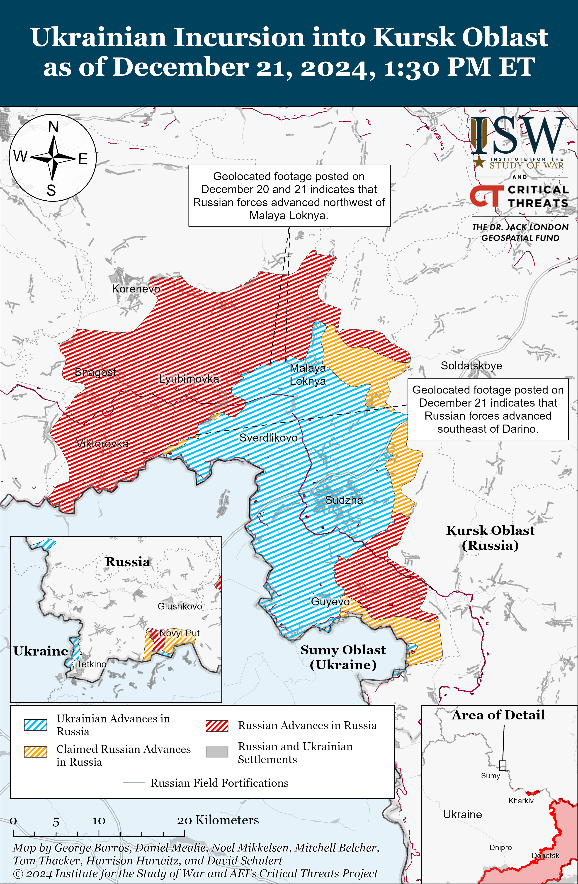
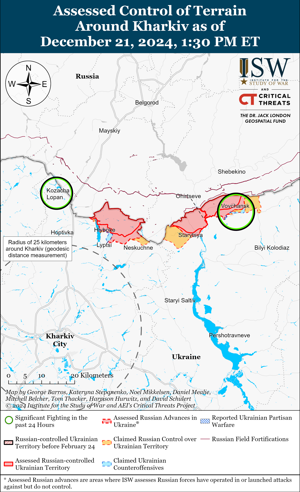
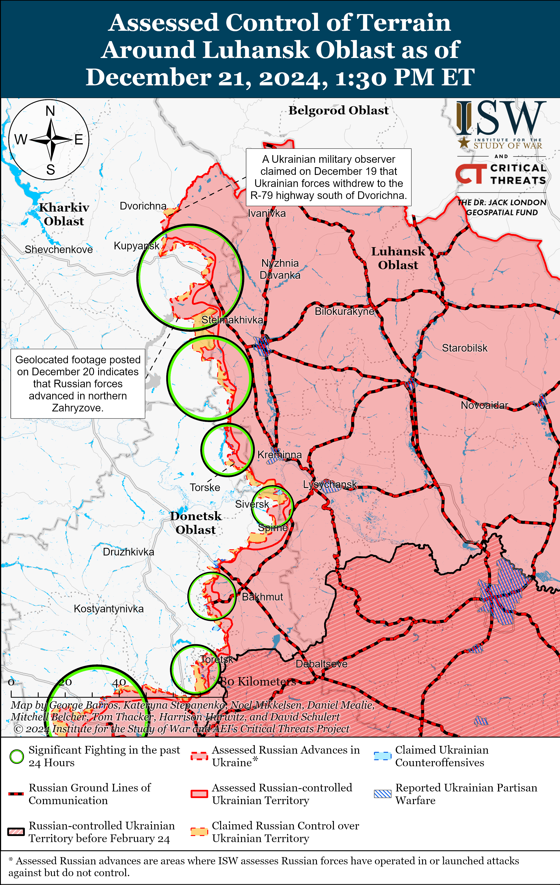
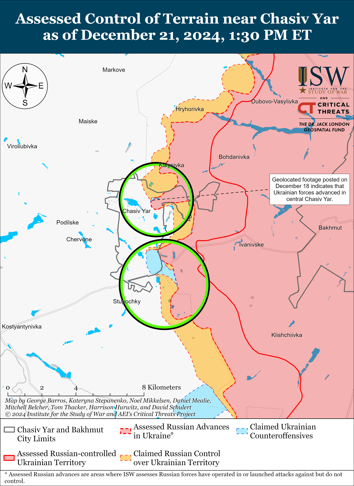
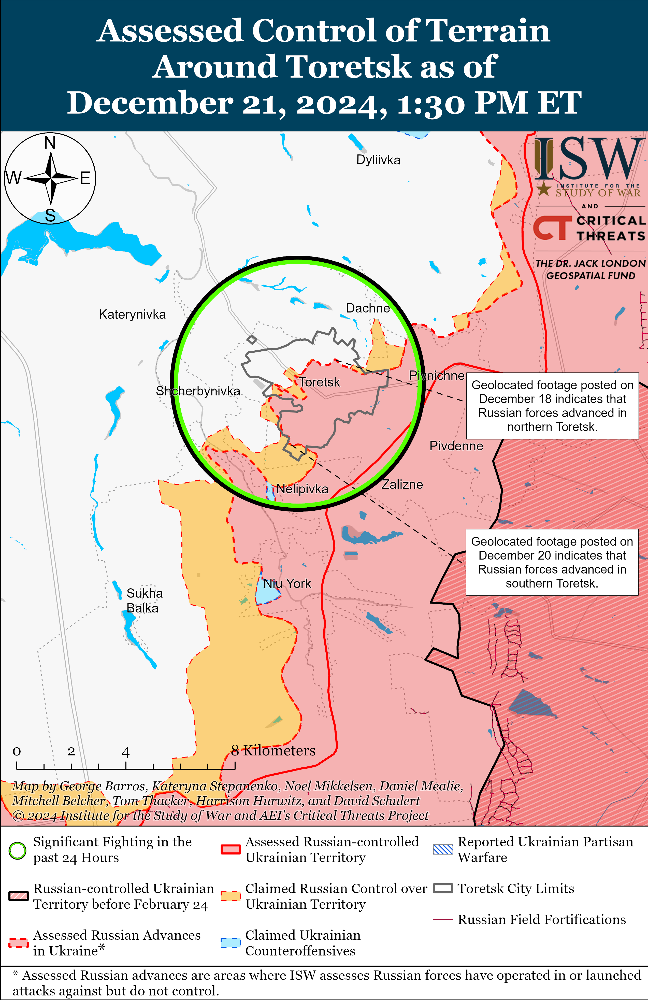
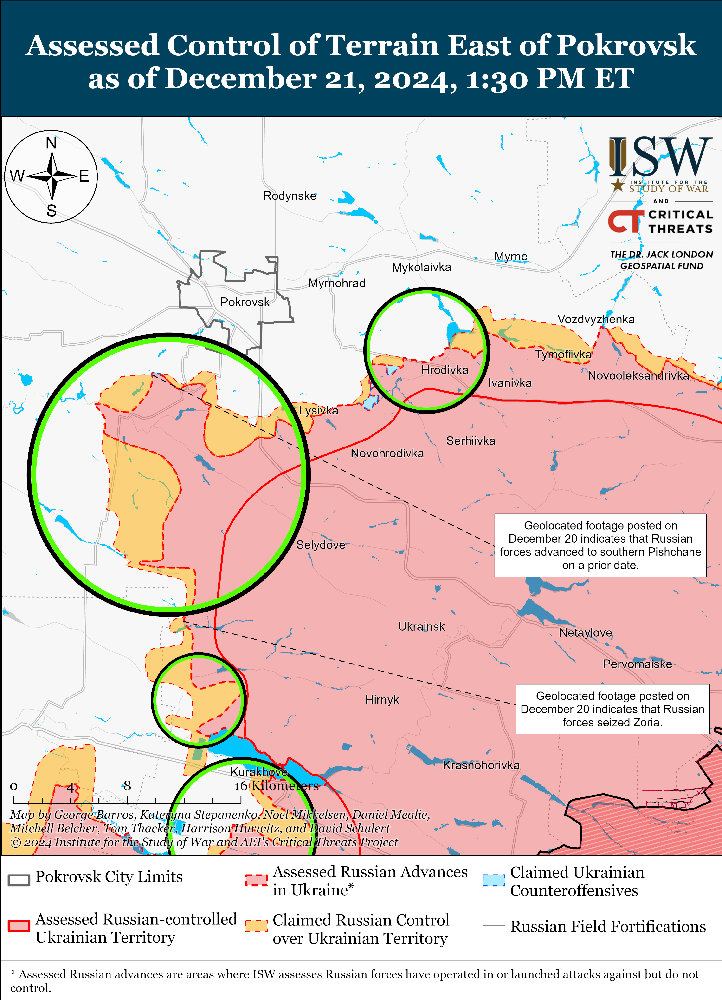
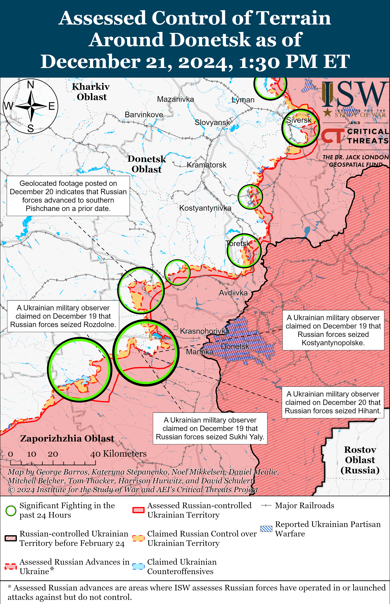
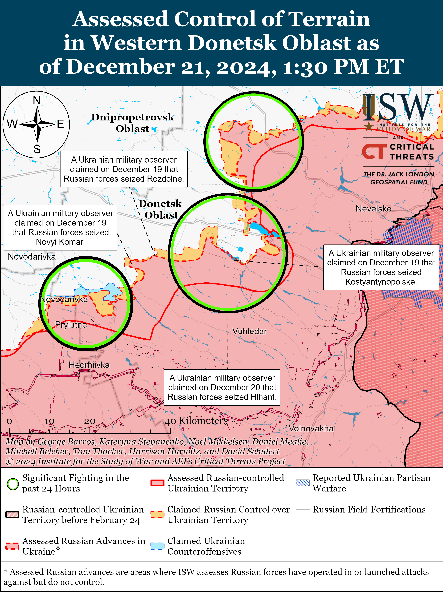
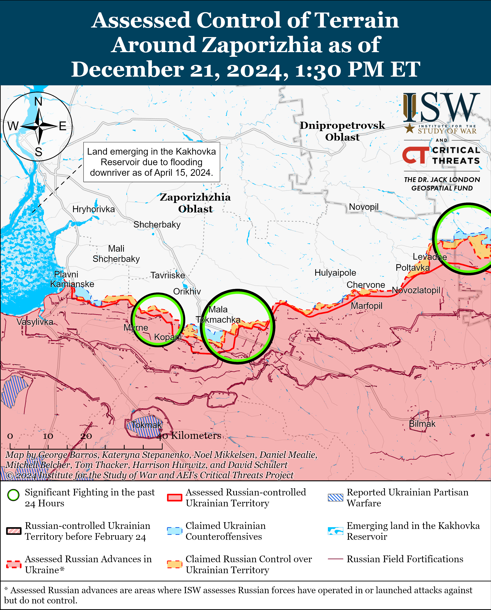
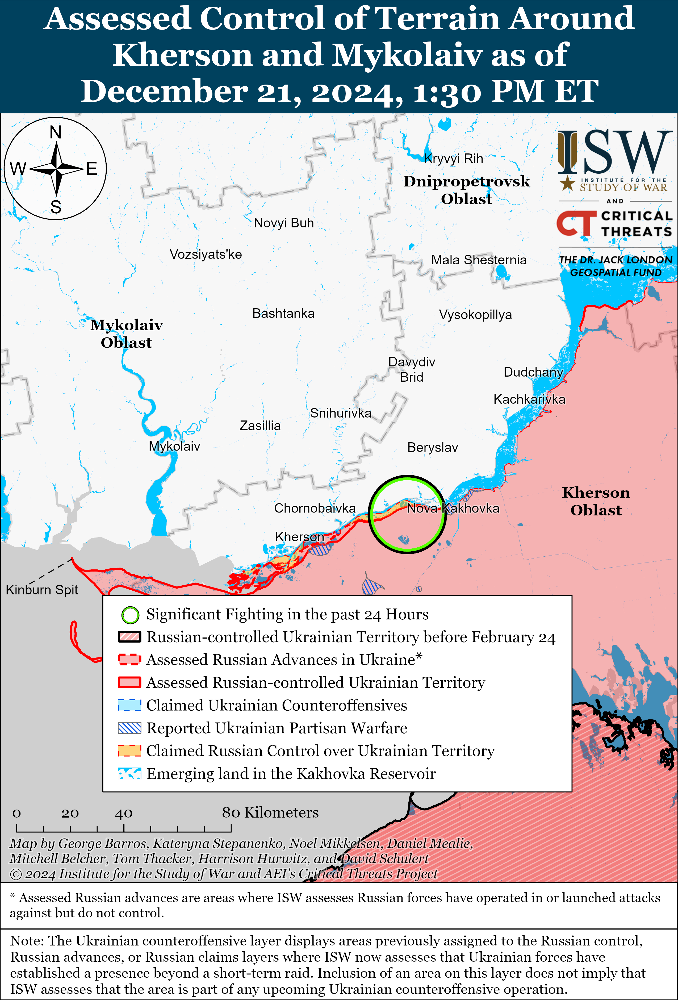

# Russian Offensive Campaign Assessment, December 21, 2024

**Angelica Evans, Grace Mappes, Nate Trotter, Olivia Gibson, and George Barros**

**December 21, 2024, 6:50pm ET**

**Click** [**here**](https://storymaps.arcgis.com/stories/36a7f6a6f5a9448496de641cf64bd375) **to see ISW’s interactive map of the Russian invasion of Ukraine. This map is updated daily alongside the static maps present in this report.**

**Click** [**here**](https://storymaps.arcgis.com/stories/83a2f24901c941d581c0c523ecd2619b)**to see ISW’s interactive map of Ukraine’s offensive in Kursk Oblast.**

**Click** [**here**](https://understandingwar.maps.arcgis.com/apps/instant/3dviewer/index.html?appid=1602762dbcde419bb957dea358449580) **to see ISW’s 3D control of terrain topographic map of Ukraine. Use of a computer (not a mobile device) is strongly recommended for using this data-heavy tool.**

**Click** [**here**](https://storymaps.arcgis.com/stories/733fe90805894bfc8562d90b106aa895) **to access ISW’s archive of interactive time-lapse maps of the Russian invasion of Ukraine. These maps complement the static control-of-terrain map that ISW produces daily by showing a dynamic frontline. ISW will update this time-lapse map archive monthly.**

**Note: The data cut-off for this product was 12:00 pm ET on December 21. ISW will cover subsequent reports in the December 22 Russian Offensive Campaign Assessment.**

**Russian President Vladimir Putin continues to expand Russia’s network of military-patriotic education programs for youth in Russia and occupied Ukraine ahead of the Kremlin’s upcoming “Year of the Defender of the Fatherland” in 2025.** Putin approved a list of four instructions for the Russian government on December 20, which include orders to: establish and develop a network of “military-sports camps” to promote enlisting in the military among young people; expand the Kremlin’s “Roads of Victory” program; create an online platform to organize military-patriotic education programing for Russian youth; and transfer one children’s “health camp” to year-round operations.[1] The Kremlin’s “Roads of Victory” program is aimed at “foster[ing] patriotic feelings in modern children and youth” and offers free excursions to Russian cultural and historical sites of “military glory” for Russian children and youth.[2] The Kremlin has previously leveraged “Avangard” military and sports training camps to militarize and indoctrinate Ukrainian youth into Russian cultural and historical narratives and appears to be expanding its network of these and similar camps throughout Russia as part of its long-term force generation efforts.[3] The Kremlin is also preparing to expand and elevate other youth military-patriotic organizations, such as Yunarmiya and Movement of the First, to militarize Russian youth. In addition, it is leveraging its “Time of Heroes” program to place veterans of the war in Ukraine into government positions and militarize Russian society writ large.[4] Putin announced on December 20 that the Kremlin will consider 2025 as the “Year of the Defender of the Fatherland,” indicating that he intends to orient Russia’s political and ideological priorities for 2025 around Russian veterans and further militarizing Russian society.[5] The Kremlin likely intends to leverage these military-political organizations to encourage and elevate the prestige of military service among Russian youth and society as the Kremlin continues to plan for its long-term war effort in Ukraine and possible future armed conflicts with Western countries.[6]

**Ukrainian forces conducted drone strikes against Kazan, Republic of Tatarstan on December 21.** Footage published on December 21 shows several Ukrainian drones striking large apartment buildings and other unspecified buildings in Kazan, reportedly after Russian electronic warfare (EW) disabled the drones.[7] Russian sources claimed that Russian forces destroyed six Ukrainian drones near Kazan and downed one drone over a nearby river and that one drone struck near an unspecified industrial enterprise in Kazan.[8] Russian President Vladimir Putin called Republic of Tatarstan Head Rustam Minnikhanov after Minnikhanov visited damaged residential areas of Kazan.[9] Russian opposition media suggested that Ukrainian forces were likely targeting a gunpowder production facility, an airfield, a military base, or a helicopter production facility near Kazan.[10]

**Key Takeaways:**

- **Russian President Vladimir Putin continues to expand Russia’s network of military-patriotic education programs for youth in Russia and occupied Ukraine ahead of the Kremlin’s upcoming “Year of the Defender of the Fatherland” in 2025.**
- **Ukrainian forces conducted drone strikes against Kazan, Republic of Tatarstan on December 21.**
- **Russian forces recently advanced in Kursk Oblast and near Pokrovsk and Kurakhove.**
- **Ukrainian forces regained lost territory near Pokrovsk.**
- **The Russian Ministry of Defense (MoD) continues to exalt its efforts to establish the Unmanned Systems Forces following Russian President Vladimir Putin’s official order to establish the new combat arms branch.**

***We do not report in detail on Russian war crimes because these activities are well-covered in Western media and do not directly affect the military operations we are assessing and forecasting. We will continue to evaluate and report on the effects of these criminal activities on the Ukrainian military and the Ukrainian population and specifically on combat in Ukrainian urban areas. We utterly condemn Russian violations of the laws of armed conflict and the Geneva Conventions and crimes against humanity even though we do not describe them in these reports.***

- Ukrainian Operations in the Russian Federation
- Russian Main Effort – Eastern Ukraine (comprised of three subordinate main efforts)
- Russian Subordinate Main Effort #1 – Push Ukrainian forces back from the international border with Belgorod Oblast and approach to within tube artillery range of Kharkiv City
- Russian Subordinate Main Effort #2 – Capture the remainder of Luhansk Oblast and push westward into eastern Kharkiv Oblast and encircle northern Donetsk Oblast
- Russian Subordinate Main Effort #3 – Capture the entirety of Donetsk Oblast
- Russian Supporting Effort – Southern Axis
- Russian Air, Missile, and Drone Campaign
- Russian Mobilization and Force Generation Efforts
- Russian Technological Adaptations
- Activities in Russian-occupied areas
- Significant Activity in Belarus

**Ukrainian Operations in the Russian Federation**

Russian forces recently advanced within the Ukrainian salient in Kursk Oblast amid continued offensive operations on December 21. Geolocated footage published on December 20 and 21 indicates that Russian forces advanced to the southeastern outskirts of Darino and the northern outskirts of Kruglenkoye (both southeast of Korenevo).[11] Additional geolocated footage published on December 20 indicates that elements of the Russian 76th Airborne (VDV) Division advanced in a field east of Novoivanovka (southeast of Korenevo) during a platoon-sized mechanized assault.[12] A Russian milblogger claimed that Russian forces are advancing southeast of Korenevo in an unspecified forest area in the direction of Viktorivka, Novoivanivka, and Leonidovo.[13] Ukrainian forces reportedly counterattacked in the direction of Pogrebki (northwest of Sudzha) and east of Darino.[14] Another Russian milblogger claimed that Russian forces advanced north of Kruglenkoye in an unspecified area 1.5 kilometers in depth on December 20 and claimed that Russian forces advanced in an unspecified area 5.5 kilometers wide and 3 kilometers deep near Kruglenkoye on December 16.[15] ISW has not observed visual confirmation of these claims, however. A Kremlin-affiliated Russian milblogger claimed on December 21 that Russian forces eliminated a pocket of Ukrainian forces northeast of Malaya Loknya (north of Sudzha) and that Ukrainian units retreated to the hills east of the settlement.[16] A Russian milblogger claimed that Ukrainian forces are counterattacking and conducting long-range strikes against military targets in Kursk Oblast.[17] Russian milbloggers claimed that Russian forces are attacking near Novoivanovka, Cherkasskoye Porechnoye (northeast of Sudzha), and Cherkasskaya Konopelka (southeast of Sudzha) and clearing Russkoye Porechnoye (northeast of Sudzha).[18]

Ukrainian officials continue to report on the involvement of North Korean forces in combat operations in Kursk Oblast. Ukrainian President Volodymyr Zelensky stated on December 20 that the Russian military command is attempting to conceal the deployment of North Korean soldiers deployed to Kursk Oblast by mischaracterizing North Korean citizens as members of various ethnic groups indigenous to Russia’s Siberian and Far Eastern regions.[19] A Ukrainian brigade operating in Kursk Oblast reported that the Russian military command is deploying freshly recruited “mercenaries” to assault units in an unspecified area of the front, presumably Kursk Oblast.[20] The brigade further noted that these “mercenaries” may be North Korean forces, but that the brigade has not confirmed North Korean forces’ participation and reported the discovery of passports listing the mercenaries’ place of origin as Russia’s Tuva Republic. A separate Ukrainian unit operating in Kursk Oblast published footage showing Ukrainian forces striking purported North Korean troops operating in the oblast.[21] ISW cannot confirm the veracity of these reports regarding North Korean soldiers, however.

**Russian Main Effort – Eastern Ukraine**

**Russian Subordinate Main Effort #1 – Kharkiv Oblast (Russian objective: Push Ukrainian forces back from the international border with Belgorod Oblast and approach to within tube artillery range of Kharkiv City)**

Russian forces attacked along the international border north of Kharkiv City near Kozacha Lopan and northeast of Kharkiv City near Vovchansk on December 20 and 21 but did not make any confirmed advances on December 21.[22] A Russian milblogger claimed on December 21 that Russian forces have significantly expanded their bridgehead in northern Kharkiv Oblast, but ISW has not observed significant Russian advances in northern Kharkiv Oblast since Russian forces initially advanced across the international border in the area in May 2024.[23] A representative of a Ukrainian brigade operating in the Kharkiv direction stated on December 16 that Ukrainian forces in the Kharkiv direction conducted their first fully robotic operation in early December 2024 and that the objective of this operation was to create conditions conducive for Ukrainian forces to advance by leveraging unmanned ground vehicles (UGVs), first-person view drones (FPVs), and reconnaissance drones to mitigate attrition of Ukrainian soldiers.[24] The representative reported that Russian forces are using infiltration tactics in the Kharkiv direction and are using small groups of attacking infantry to draw Ukrainian fire and expose Ukrainian positions in this direction.

**Russian Subordinate Main Effort #2 – Luhansk Oblast (Russian objective: Capture the remainder of Luhansk Oblast and push westward into eastern Kharkiv Oblast and northern Donetsk Oblast)**

Russian forces continued offensive operations along the Kupyansk-Svatove-Kreminna line on December 21 but did not make any confirmed advances. A Russian milblogger claimed that Russian forces advanced five kilometers near Zahryzove (southeast of Kupyansk) on the night of December 20 to 21, however, ISW has not observed visual confirmation of this claim or any other Russian claims to this effect.[25] Geolocated footage published on December 20 shows that Russian forces conducted a reinforced platoon-sized mechanized assault southwest of Synkivka (northeast of Kupyansk) but did not advance, and this assault may have occurred several weeks ago.[26] Ukraine’s Khortytsia Group of Forces stated that Ukrainian forces repelled other Russian mechanized assaults of unspecified sizes near Kucherivka (east of Kupyansk) and in the directions of Zelenyi Hai (west of Svatove) and Terny (northwest of Kreminna).[27] Russian forces also continued offensive operations northeast of Kupyansk near Synkivka; east of Kupyansk near Petropavlivka and Kucherivka; southeast of Kupyansk near Zahryzove and Lozova; southwest of Svatove near Hrekivka and Novoserhiivka; west of Svatove near Zeleny Hai; northwest of Kreminna near Ivanivka, Terny, and Yampolivka; west of Kreminna near Torske; and southwest of Kreminna near Hryhorivka and in the Serebryanske forest area on December 20 and 21.[28] Drone operators of the Russian 27th Motorized Rifle Brigade (1st Guards Tank Army [GTA], Moscow Military District [MMD]) reportedly continue to strike targets near Kupyansk.[29]

**Russian Subordinate Main Effort #3 – Donetsk Oblast (Russian objective: Capture the entirety of Donetsk Oblast, the claimed territory of Russia’s proxies in Donbas)**

Russian forces continued offensive operations northeast of Siversk near Bilohorivka and east of Siversk near Verkhnokamyanske on December 21 but did not make any confirmed advances.[30] Ukrainian Luhansk Group of Forces Spokesperson Major Anastasiya Bobovnikova reported that Ukrainian forces have “exhausted” Russian forces in the Siversk direction and assessed that Russian forces will likely become inactive in this direction for some time.[31] A Ukrainian platoon commander operating in the Siversk direction reported that Russian forces may be regrouping in this direction and have not conducted large infantry assaults in this direction since about December 19.[32]

Russian forces continued offensive operations near Chasiv Yar on December 21 but did not make any confirmed advances. Russian milbloggers claimed that elements of the Russian 98th Airborne (VDV) Division seized half of the Chasiv Yar Refractory Plant in central Chasiv Yar and the boiler house south of the plant and that elements of the Russian 200th Motorized Rifle Brigade (14th Army Corps [AC], Leningrad Military District [LMD]) are advancing in Pivnichnyi Microraion past the railroad tracks north of the Refractory Plant.[33] Russian milbloggers claimed that elements of the 4th Motorized Rifle Brigade (3rd Combined Arms Army [CAA], formerly 2nd Luhansk People’s Republic [LNR] AC, purportedly of the Southern Military District [SMD]) made tactical gains near a bridgehead across the Siverskyi Donets Donbas Canal south of Chasiv Yar and are less than 1.5 kilometers away from Stupochky (south of Chasiv Yar).[34] ISW has not observed confirmation of these claims, however, and has only observed geolocated evidence to suggest that Russian forces have advanced within 2.4 kilometers of Stupochky. Russian forces conducted offensive operations in and near Chasiv Yar and in the direction of Stupochky on December 20 and 21.[35] Bobovnikova reported that the Russian military command is moving tactical reserves consisting of contract personnel to the Chasiv Yar and Toretsk directions and intensifying assaults under fog and rain because Ukrainian drones are less active in poor weather.[36] Drone operators of the Russian 6th Motorized Rifle Division (3rd AC) are reportedly striking targets near Bila Hora (south of Chasiv Yar).[37]

Russian forces continued offensive operations near Toretsk on December 21 but did not make any confirmed advances. A Russian milblogger claimed that Russian forces seized part of Krymske (immediately northeast of Toretsk) and advanced towards the Toretska Mine in northern Toretsk.[38] ISW has not observed confirmation of these claims, however. A Russian milblogger claimed that Russian forces continue to attack in the southern part of Zabalka Microraion (southernmost Toretsk), along Svitla Street in central Toretsk, and towards the Toretska Mine.[39] Russian forces conducted offensive operations in Toretsk itself, east of Toretsk near Druzhba, and southwest of Toretsk near Sukha Balka and Leonidivka on December 20 and 21.[40]

Russian and Ukrainian forces recently advanced southwest of Pokrovsk amid continued offensive operations in the area on December 20 and 21. Geolocated footage published on December 20 indicates that Ukrainian forces recently recaptured positions in southern Pishchane (southwest of Pokrovsk), indicating that Russian forces likely recently advanced into Pishchane from the south.[41] A Russian milblogger claimed that Russian forces advanced towards the T-0515 Yasnove-Kostyantynopil road south of Pokrovsk.[42] Russian forces conducted offensive operations east of Pokrovsk near Myrolyubivka, Novooleksandriivka, and Promin; southeast of Pokrovsk near Lysivka; south of Pokrovsk near Zelene, Dachenske, Shevchenko, Novooleksiivka, and Novyi Trud; and southwest of Pokrovsk near Novoyeliyzavetivka, Novoolenivka, Novovasylivka, Vovkove, Pishchane, Solone, and Ukrainka on December 20 and 21.[43] A Russian milblogger claimed that Ukrainian forces are counterattacking in the Pokrovsk direction.[44]

Russian forces recently conducted a motorized assault using civilian vehicles in the Pokrovsk direction, likely due to Russian armored vehicle shortages. Geolocated footage published on December 21 shows an unsuccessful Russian reduced company-sized motorized assault using eight civilian vehicles east of Ukrainka, indicating that Russian forces are likely facing shortages of armored vehicles and tanks in this direction.[45] The Russian military command has consistently demonstrated its willingness to accept costly armored vehicle losses in exchange for slow, grinding gains in Ukraine, and this assault indicates that Russian forces’ sustained attrition is degrading the Russian forces’ ability to continue fielding mechanized equipment.[46]

Russian forces recently marginally advanced northwest of Kurakhove amid continued offensive operations in the Kurakhove direction on December 21. Geolocated footage published on December 20 indicates that Russian forces advanced in central Zorya (northwest of Kurakhove) and likely seized the settlement.[47] Russian milbloggers claimed that Russian forces are advancing west of Stari Terny (northwest of Kurakhove) toward Shevchenko to the west and Dachne to the south of the settlement.[48] ISW has not observed visual confirmation of these claims, however. Russian sources claimed that Russian forces have seized most of Kurakhove and are clearing small units of Ukrainian forces from the high-rise buildings in the western part of the town and fighting in the town’s industrial area.[49] Russian forces continued assaults northwest of Kurakhove near Sontsivka, Slovyanka, Petropavlivka, and Stari Terny and in the direction of Shevchenko and Andriivka; in Kurakhove itself; west of Kurakhove towards Dachne; and south of Kurakhove near Dalne on December 20 and 21.[50] Elements of the Russian 68th Tank Regiment (150th Motorized Rifle Division, 8th CAA, Southern Military District [SMD]), 33rd Motorized Rifle Regiment (20th Motorized Rifle Division, 8th CAA, SMD), and 255th Motorized Rifle Regiment (20th Motorized Rifle Division) are reportedly operating near Kurakhove.[51][52]

Russian forces continued offensive operations in the Vuhledar direction on December 21 but did not make confirmed advances in the area. Russian milbloggers claimed that Russian forces advanced two kilometers near Kostyantynopolske (northwest of Vuhledar) and are advancing near Hihant (southwest of Kostyantynopolske) and Yantarne (northwest of Kostyatynopolske).[53] The Russian MoD claimed that Russian forces seized Kostyatynopolske on December 21, but ISW assessed that Russian forces likely seized the settlement as of December 6.[54] Russian forces continued assaults northwest of Vuhledar near Uspenivka, Kostyatynopolske, and Yantarne and in the direction of Konstantynopil, Bahatyr, Rozlyv, and Odradne on December 20 and 21.[55] Ukrainian forces are reportedly counterattacking northwest of Vuhledar from Ulakly, Kostyantynopil, Bahatyr, and Odradne.[56] Russian milbloggers published footage on December 20 and 21 showing Russian forces striking a bridge over the Vovcha River between Kostyantynopil and Andriivka, likely in an effort to complicate Ukraine’s ability to supply and withdraw units from positions south of Kurakhove in the future.[57]

Russian forces continued offensive operations in the Donetsk-Zaporizhia Oblast border area on December 21 but did not make confirmed advances in the area. Russian milbloggers claimed that Russian forces are clearing Novyi Komar (north of Velyka Novosilka) and seized Ukrainian positions near Rivnopil (southwest of Velyka Novosilka).[58] The spokesperson of a Ukrainian brigade operating in the Velyka Novosilka direction stated that Russian forces are using drones attached to fiber optic cables to strike Ukrainian forces and overcome Ukrainian electronic warfare (EW) systems in the area.[59] The spokesperson of another Ukrainian brigade operating in the area noted that Russian forces are attempting to cut off Ukrainian ground lines of communication (GLOCs) in the Velyka Novosilka area.[60] The second spokesperson stated that Russian forces are transferring additional reserves and sending small squads of infantry to attack Ukrainian defenses, conducting mechanized assaults, and launching artillery, air, and drone strikes against Ukrainian positions in the area. Russian forces continued assaults northeast of Velyka Novosilka near Rozdolne; near Velyka Novosilka itself; south of Velyka Novosilka near Makarivka and Blahodatne; and southwest of Velyka Novosilka near Novosilka, Novopil, and Novodarivka on December 20 and 21.[61] Aircraft of the 11th Air Force and Air Defense Army (Russian Aerospace Forces [VKS] and Eastern Military District [EMD] are reportedly operating near Velyka Novosilka.[62]

**Russian Supporting Effort – Southern Axis (Russian objective: Maintain frontline positions and secure rear areas against Ukrainian strikes)**

Russian and Ukrainian sources did not report ongoing fighting in eastern Zaporizhia Oblast near Hulyaipole on December 21. Ukrainian military observer Kostyantyn Mashovets reported that the Russian force grouping in the Hulyaipole direction is mainly comprised of elements of the 35th Combined Arms Army (CAA) (Eastern Military District [EMD]), including most of its 38th and 64th motorized rifle brigades and 69th Covering Brigade, but that up to a regiment of troops may be deployed to the Kursk direction.[63] Mashovets stated that the Russian force grouping in the Hulyaipole direction consists of up to 22,000-25,000 personnel, 100-110 tanks, 285-290 armored fighting vehicles (AFVs), 210 artillery and large-caliber mortar systems, and likely 80-95 but up to 120-125 multiple rocket launch systems (MLRS).

Fighting continued in western Zaporizhia Oblast on December 21, but neither Russian nor Ukrainian forces made confirmed advances. Russian forces continued ground attacks near Mala Tokmachka (northeast of Robotyne), Novoandriivka, and Pyatykhatky (both northwest of Robotyne) on December 20 and 21.[64] Russian milbloggers continued to claim that Ukrainian forces conducted assaults near Kamyanske and Luhove (both northwest of Robotyne and south of Zaporizhzhia City).[65] Mashovets reported that the Russian force grouping in the Orikhiv (western Zaporizhia Oblast) direction consists of the 58th CAA (Southern Military District [SMD]), including its “expanded” 19th and 42nd motorized rifle divisions, 136th Motorized Rifle Brigade, recently-formed 49th Airborne Brigade, 291st Artillery Brigade, 67th Anti-Aircraft Missile Brigade, 12th Separate Missile Brigade, 100th Separate Reconnaissance Brigade, a tactical group of the 4th Military Base, likely the 74th Special Purpose Radiotechnical Regiment, and likely the 40th Radiation, Chemical, and Biological Protection Regiment.[66] Mashovets reported that the Russian force grouping in the Orikhiv direction totals up to 50,000-52,000 personnel including attached Rosgvardia units, up to 355-360 tanks, up to 890-895 AFVs, 780-785 artillery systems, 110-116 MLRS launchers, and up to 10 operational-tactical missile launchers.[67] Mashovets responded to recent reports that Russian forces may be preparing for renewed offensive operations in western Zaporizhia Oblast by expressing doubt that Russian forces would be able to conduct such operations at the scale, scope, and speed necessary to make operationally-significant advances.[68]

Russian forces continued offensive operations in the Dnipro direction including near Kozatskyi and Velykiy Potemkin islands (east and south of Kherson City, respectively) on December 20 and 21 but did not make confirmed advances.[69] Some Russian milbloggers claimed that a Russian sabotage and reconnaissance group approached the edge of the left bank of the Dnipro River and consolidated positions in the dacha area behind the Antonivka roadway bridge (immediately east of Kherson City) following extensive artillery preparation.[70]

The Russian MoD claimed that Russian forces intercepted three Ukrainian drones over occupied Crimea on December 21.[71]

**Russian Air, Missile, and Drone Campaign (Russian Objective: Target Ukrainian military and civilian infrastructure in the rear and on the frontline)**

Russian forces conducted a series of drone and missile strikes against Ukraine overnight on December 20 to 21. The Ukrainian Air Force reported that Russian forces launched one S-400 guided anti-air missile from occupied Donetsk Oblast towards Poltava Oblast and 113 Shahed drones and other unspecified drones from the directions Bryansk, Oryol, and Kursk oblasts; Millerovo, Rostov Oblast; Primorsko- Akhtarsk, Krasnodar Krai; and occupied Berdyansk, Zaporizhia Oblast.[72] The Ukrainian Air Force reported that Ukrainian forces downed 57 Shahed drones and other unspecified drones over Poltava, Sumy, Kharkiv, Kyiv, Chernihiv, Cherkasy, Zhytomyr, Khmelnytskyi, Donetsk, Dnipropetrovsk, and Zaporizhia oblasts and that 56 drones were “lost” due to Ukrainian electronic warfare (EW) interference. Ukrainian officials reported that the Russian drones damaged residential areas in Kharkiv and Zaporizhzhia cities.[73] The Ukrainian Southern Operational Command reported that Russian forces launched two Kh-31P anti-radar missiles from the Black Sea towards Odesa Oblast on December 20 but that the missiles did not strike their targets.[74] Ukrainian officials reported that two Russian guided glide bombs significantly damaged an oncology clinic in Kherson City overnight on December 20 to 21.[75]

Ukrainian President Volodymyr Zelensky stated that Russian forces used over 550 glide bombs, nearly 550 strike drones, and over 20 missiles against Ukraine over the past week (since about November 14).[76]

**Russian Mobilization and Force Generation Efforts (Russian objective: Expand combat power without conducting general mobilization)**

The Russian MoD continues to exalt its efforts to establish the Unmanned Systems Forces following Russian President Vladimir Putin’s official order to establish the new combat arms branch. Russian Defense Minister Andrei Belousov attended a meeting between the MoD’s Technical Council and People’s Front and claimed that the MoD’s Technical Council had enabled small, independent drone manufacturers and civilian drone manufacturers in Russia to create more than 65 new drone variants and systems, including: three reconnaissance drones, eight unmanned ground vehicles (UGVs), two electronic intelligence systems, 20 electronic warfare (EW) systems, and four types of unmanned boats.[77] Belousov claimed that these manufacturers produce up to 40,000 drone products and 5,000 EW products per month. The Russian MoD reported that Russian developers demonstrated a new type of drone that can carry up to 100 kilograms and operate in difficult weather conditions. The MoD described the Unmanned Systems Forces as a separate branch (отдельный род; *otdelnyi rod*), which is consistent with Putin’s prior description and indicates that the Unmanned Systems Forces will likely centralize control over Russian drone operators under the MoD rather than Russian ground commanders.[78] ISW continues to assess that this reorganization may impact the Russian tactical reconnaissance strike complex (the integration of EW and unmanned systems with ground-based fires and attack drones) and reduce the cohesion between assault, drone, and artillery elements.[79]

**Russian Technological Adaptations (Russian objective: Introduce technological innovations to optimize systems for use in Ukraine)**

Nothing significant to report.

**Activities in Russian-occupied areas (Russian objective: Consolidate administrative control of annexed areas; forcibly integrate Ukrainian citizens into Russian sociocultural, economic, military, and governance systems)**

*ISW is not publishing coverage of activities in Russian-occupied areas today.*

**Significant activity in Belarus (Russian efforts to increase its military presence in Belarus and further integrate Belarus into Russian-favorable frameworks)**

Belarusian Chief of the General Staff and First Deputy Defense Minister Major General Pavel Muraveiko met with Kazakh Chief of the General Staff Lieutenant General Sultan Kamaletdinov in Belarus to discuss the deepening of bilateral military cooperation on December 21.[80]

**Note: ISW does not receive any classified material from any source, uses only publicly available information, and draws extensively on Russian, Ukrainian, and Western reporting and social media as well as commercially available satellite imagery and other geospatial data as the basis for these reports. References to all sources used are provided in the endnotes of each update.**

[1] https://t.me/tass\_agency/292440 ; https://t.me/tass\_agency/292441 ; http://kremlin dot ru/acts/assignments/orders/75922 ; https://tass dot ru/obschestvo/22736117 ; https://t.me/sotaproject/91600

[2] https://anoarvt dot ru/

[3] https://understandingwar.org/backgrounder/russian-offensive-campaign-assessment-june-4-2024 ; https://understandingwar.org/backgrounder/russian-offensive-campaign-assessment-march-17-2024 ; https://understandingwar.org/backgrounder/russian-offensive-campaign-assessment-april-12-2024 ; https://understandingwar.org/backgrounder/russian-offensive-campaign-assessment-may-28-2024

[4] https://isw.pub/UkrWar122024 ; https://isw.pub/UkrWar121424 ; https://understandingwar.org/backgrounder/russian-offensive-campaign-assessment-december-17-2024 ; https://understandingwar.org/backgrounder/russian-offensive-campaign-assessment-december-13-2024 ; https://understandingwar.org/backgrounder/russian-offensive-campaign-assessment-november-18-2024 ; https://understandingwar.org/backgrounder/russian-offensive-campaign-assessment-december-14-2024

[5] https://understandingwar.org/backgrounder/russian-offensive-campaign-assessment-december-20-2024 ; http://kremlin dot ru/events/president/news/75918; https://t.me/tass\_agency/292379 ; https://t.me/tass\_agency/292383

[6] https://understandingwar.org/backgrounder/russian-offensive-campaign-assessment-june-2-2024

[7] https://t.me/bazabazon/33813 ; https://t.me/astrapress/70744 ; https://t.me/bazabazon/33816 ; https://t.me/bloodysx/41219 ; https://t.me/ostorozhno\_novosti/32366 ; https://t.me/sotaproject/91585 ; https://t.me/astrapress/70743 ; https://t.me/astrapress/70750 ; ; https://t.me/bazabazon/33827 ; https://t.me/rybar/66533 ; https://t.me/RVvoenkor/83094 ; https://t.me/RVvoenkor/83097

[8] https://t.me/tass\_agency/292607 ; https://t.me/tass\_agency/292530 ; https://t.me/tass\_agency/292517 ; https://t.me/mod\_russia/47133 ; https://t.me/mod\_russia/47135 ; https://t.me/rybar/66533 ; https://t.me/RVvoenkor/83094 ; https://t.me/RVvoenkor/83097

[9] https://t.me/idelrealii/39164 ; https://t.me/tass\_agency/292503 ; https://t.me/tass\_agency/292506 ; https://t.me/tass\_agency/292525 https://t.me/tass\_agency/292525 ; https://t.me/tass\_agency/292602

[10] https://t.me/astrapress/70799 ; https://t.me/sotaproject/91597

[11] https://t.me/WarArchive\_ua/23815 ; https://t.me/creamy\_caprice/7886 ; https://t.me/informnapalm/23677 ; https://x.com/front\_ukrainian/status/1870145192877273151

[12] https://t.me/EnotHersonVDV/5325 ; ; https://t.me/creamy\_caprice/7883 ; https://t.me/EnotHersonVDV/5325 ; https://t.me/z\_arhiv/30165

[13] https://t.me/dva\_majors/60748

[14] https://t.me/dva\_majors/60748

[15] https://t.me/RVvoenkor/83116

[16] https://t.me/rybar/66545

[17] https://t.me/wargonzo/23884

[18] https://t.me/RVvoenkor/83116 ; https://t.me/DnevnikDesantnika/21327

[19] https://www.president dot gov.ua/news/povsyakdennij-teror-zaslugovuye-na-shoraz-bilshij-tisk-na-te-95145

[20] https://armyinform dot com.ua/2024/12/21/zagon-samogubcziv-novoprybuli-najmanczi-rosiyi-sherengamy-jdut-na-shturmy-j-ne-boyatsya-droniv-poky-ti-ne-zroblyat-pershyj-skyd/; https://t.me/brigade95/1593

[21] https://t.me/ukr\_sof/1314 ; https://mil.in dot ua/uk/news/rejndzhery-zachystyly-pozytsiyi-vijskovyh-kndr-na-kurshhyni/

[22] https://www.facebook.com/GeneralStaff.ua/posts/pfbid031Qjw61fq3mutCzFXY54SCXWTVpGmJV6CrVLqsMm1eKvWKw1aVseQ3Ho71acz3Ninl ; https://www.facebook.com/GeneralStaff.ua/posts/pfbid02eRhjgFGHTTUv4A9ARL5ptZkVSJuUndGK9oj8V7uKVHYzeouM9v6sxF2QHG1JLuoMl ; https://www.facebook.com/GeneralStaff.ua/posts/pfbid02Z6dzLhN6AsUzjyiMbFqtWuKTmFJXyZ2xeNZRQStG7jmztQE9u6WMHMCF9hY6ers5l ; https://t.me/otukharkiv/3165

[23] https://t.me/Sladkov\_plus/12090

[24] https://www.youtube.com/watch?v=aDXWlQ2K0dM ; https://suspilne dot media/kharkiv/903773-na-harkivsini-vijskovi-proveli-persu-robotizovanu-operaciu-aka-ii-meta/

[25] https://t.me/Sladkov\_plus/12090

[26] https://x.com/klinger66/status/1870260385926000944; https://x.com/giK1893/status/1870435795242209312; https://suspilne dot media/kharkiv/907973-sili-oboroni-vidbili-sturm-rosian-nepodalik-kupanska-i-znisili-pat-odinic-bronetehniki-video/; https://armyinform.com dot ua/2024/12/21/chotyry-z-pyaty-znyshhyly-shhe-odnu-poshkodyly-rezultaty-nevdalogo-shturmu-rosijskoyi-bronetehniky/

[27] https://t.me/Khortytsky\_wind/3587;

[28] https://www.facebook.com/GeneralStaff.ua/posts/pfbid031Qjw61fq3mutCzFXY54SCXWTVpGmJV6CrVLqsMm1eKvWKw1aVseQ3Ho71acz3Ninl; https://www.facebook.com/GeneralStaff.ua/posts/pfbid02eRhjgFGHTTUv4A9ARL5ptZkVSJuUndGK9oj8V7uKVHYzeouM9v6sxF2QHG1JLuoMl; https://www.facebook.com/GeneralStaff.ua/posts/pfbid02Z6dzLhN6AsUzjyiMbFqtWuKTmFJXyZ2xeNZRQStG7jmztQE9u6WMHMCF9hY6ers5l; https://www.facebook.com/GeneralStaff.ua/posts/pfbid031Qjw61fq3mutCzFXY54SCXWTVpGmJV6CrVLqsMm1eKvWKw1aVseQ3Ho71acz3Ninl; https://www.facebook.com/GeneralStaff.ua/posts/pfbid02eRhjgFGHTTUv4A9ARL5ptZkVSJuUndGK9oj8V7uKVHYzeouM9v6sxF2QHG1JLuoMl; https://www.facebook.com/GeneralStaff.ua/posts/pfbid02Z6dzLhN6AsUzjyiMbFqtWuKTmFJXyZ2xeNZRQStG7jmztQE9u6WMHMCF9hY6ers5l

[29] https://t.me/RVvoenkor/83083

[30] https://www.facebook.com/GeneralStaff.ua/posts/pfbid031Qjw61fq3mutCzFXY54SCXWTVpGmJV6CrVLqsMm1eKvWKw1aVseQ3Ho71acz3Ninl

[31] https://www.youtube.com/watch?v=o4XONrDJWsc ; https://suspilne dot media/donbas/907717-armia-rf-gotuetsa-do-sturmiv-na-kilkoh-napramkah-situacia-v-zoni-vidpovidalnosti-otu-lugansk/

[32] https://armyinform dot com.ua/2024/12/21/vorog-vtratyv-tut-bagato-pihotyncziv-u-zsu-nazvaly-kilkist-rosijskyh-vtrat-na-siverskomu-napryamku/; https://www.youtube.com/watch?v=aDXWlQ2K0dM ; https://suspilne dot media/donbas/892235-dinamika-boiv-na-lugansini-front-bila-pokrovska-boi-za-sevcenko-ta-u-kurahovomu-front-na-donbasi-21-grudna/?anchor=live\_1734781719&utm\_source=copylink&utm\_medium=ps

[33] https://t.me/rusich\_army/19508 ; https://t.me/boris\_rozhin/148672; https://t.me/DnevnikDesantnika/21297; https://t.me/DnevnikDesantnika/21313; https://t.me/voenkorKotenok/60904

[34] https://t.me/rusich\_army/19508 ; https://t.me/boris\_rozhin/148672

[35] https://www.facebook.com/GeneralStaff.ua/posts/pfbid031Qjw61fq3mutCzFXY54SCXWTVpGmJV6CrVLqsMm1eKvWKw1aVseQ3Ho71acz3Ninl; https://www.facebook.com/GeneralStaff.ua/posts/pfbid02eRhjgFGHTTUv4A9ARL5ptZkVSJuUndGK9oj8V7uKVHYzeouM9v6sxF2QHG1JLuoMl; https://www.facebook.com/GeneralStaff.ua/posts/pfbid02Z6dzLhN6AsUzjyiMbFqtWuKTmFJXyZ2xeNZRQStG7jmztQE9u6WMHMCF9hY6ers5l; https://t.me/Khortytsky\_wind/3587; https://t.me/wargonzo/23884

[36] https://www.youtube.com/watch?v=o4XONrDJWsc ; https://suspilne dot media/donbas/907717-armia-rf-gotuetsa-do-sturmiv-na-kilkoh-napramkah-situacia-v-zoni-vidpovidalnosti-otu-lugansk/

[37] https://t.me/boris\_rozhin/148641

[38] https://t.me/voenkorKotenok/60905

[39] https://t.me/dva\_majors/60748

[40] https://www.facebook.com/GeneralStaff.ua/posts/pfbid031Qjw61fq3mutCzFXY54SCXWTVpGmJV6CrVLqsMm1eKvWKw1aVseQ3Ho71acz3Ninl; https://www.facebook.com/GeneralStaff.ua/posts/pfbid02eRhjgFGHTTUv4A9ARL5ptZkVSJuUndGK9oj8V7uKVHYzeouM9v6sxF2QHG1JLuoMl; https://www.facebook.com/GeneralStaff.ua/posts/pfbid02Z6dzLhN6AsUzjyiMbFqtWuKTmFJXyZ2xeNZRQStG7jmztQE9u6WMHMCF9hY6ers5l; https://t.me/Khortytsky\_wind/3587; https://t.me/voenkorKotenok/60901

[41] https://t.me/WarArchive\_ua/23806; https://t.me/skalabatalion/477; https://t.me/creamy\_caprice/7881

[42] https://t.me/dva\_majors/60748

[43] https://www.facebook.com/GeneralStaff.ua/posts/pfbid031Qjw61fq3mutCzFXY54SCXWTVpGmJV6CrVLqsMm1eKvWKw1aVseQ3Ho71acz3Ninl; https://www.facebook.com/GeneralStaff.ua/posts/pfbid02eRhjgFGHTTUv4A9ARL5ptZkVSJuUndGK9oj8V7uKVHYzeouM9v6sxF2QHG1JLuoMl; https://www.facebook.com/GeneralStaff.ua/posts/pfbid02Z6dzLhN6AsUzjyiMbFqtWuKTmFJXyZ2xeNZRQStG7jmztQE9u6WMHMCF9hY6ers5l; https://t.me/voenkorKotenok/60901; https://t.me/dva\_majors/60748

[44] https://t.me/voenkorKotenok/60901

[45] https://x.com/moklasen/status/1870448317257359558; https://x.com/bayraktar\_1love/status/1870446503904641310; https://t.me/officer\_alex33/4508

[46] https://understandingwar.org/backgrounder/russian-offensive-campaign-assessment-october-6-2024

[47] https://t.me/hydra\_subdivision137/72; https://t.me/creamy\_caprice/7882

[48] https://t.me/DnevnikDesantnika/21318 ; https://t.me/voenkorKotenok/60907 ; https://t.me/sashakots/50841

[49] https://t.me/tass\_agency/292540 ; https://t.me/DnevnikDesantnika/21297 ; https://t.me/DnevnikDesantnika/21318 ; https://t.me/voenkorKotenok/60903 ; https://t.me/voenkorKotenok/60907 ; https://t.me/wargonzo/23884

[50] https://t.me/voenkorKotenok/60903 ; https://www.facebook.com/GeneralStaff.ua/posts/pfbid031Qjw61fq3mutCzFXY54SCXWTVpGmJV6CrVLqsMm1eKvWKw1aVseQ3Ho71acz3Ninl ; https://www.facebook.com/GeneralStaff.ua/posts/pfbid02eRhjgFGHTTUv4A9ARL5ptZkVSJuUndGK9oj8V7uKVHYzeouM9v6sxF2QHG1JLuoMl ; https://www.facebook.com/GeneralStaff.ua/posts/pfbid02Z6dzLhN6AsUzjyiMbFqtWuKTmFJXyZ2xeNZRQStG7jmztQE9u6WMHMCF9hY6ers5l

[52] https://t.me/RVvoenkor/83075 ; https://t.me/dva\_majors/60754

[53] https://t.me/DnevnikDesantnika/21318 ; https://t.me/voenkorKotenok/60907 ; https://t.me/voenkorKotenok/60887

[54] https://t.me/mod\_russia/47137 https://understandingwar.org/backgrounder/russian-offensive-campaign-assessment-december-6-2024

[55] https://t.me/voenkorKotenok/60903 ; https://t.me/tass\_agency/292580 ; https://www.facebook.com/GeneralStaff.ua/posts/pfbid031Qjw61fq3mutCzFXY54SCXWTVpGmJV6CrVLqsMm1eKvWKw1aVseQ3Ho71acz3Ninl ; https://www.facebook.com/GeneralStaff.ua/posts/pfbid02eRhjgFGHTTUv4A9ARL5ptZkVSJuUndGK9oj8V7uKVHYzeouM9v6sxF2QHG1JLuoMl ; https://www.facebook.com/GeneralStaff.ua/posts/pfbid02Z6dzLhN6AsUzjyiMbFqtWuKTmFJXyZ2xeNZRQStG7jmztQE9u6WMHMCF9hY6ers5l

[56] https://t.me/voenkorKotenok/60907

[57] https://t.me/voenkorKotenok/60903 ; https://t.me/RVvoenkor/83085 ; https://t.me/voin\_dv/12391

[58] https://t.me/dva\_majors/60748 ; https://t.me/wargonzo/23884 ; https://t.me/DnevnikDesantnika/21297

[59] https://armyinform dot com.ua/2024/12/20/vylitayut-i-chekayut-protyvnyk-rozrobyv-speczialnu-taktyku-dlya-svoyih-droniv-na-optovolokni/

[60] https://www.youtube.com/watch?v=o4XONrDJWsc ; https://suspilne dot media/donbas/907817-aki-cili-pereslidue-rosijske-vijsko-na-vremivskomu-napramku/

[61] https://t.me/voenkorKotenok/60903 ; https://t.me/Khortytsky\_wind/3587 ; https://t.me/SJTF\_Odes/11887 ; https://www.facebook.com/GeneralStaff.ua/posts/pfbid031Qjw61fq3mutCzFXY54SCXWTVpGmJV6CrVLqsMm1eKvWKw1aVseQ3Ho71acz3Ninl ; https://www.facebook.com/GeneralStaff.ua/posts/pfbid02eRhjgFGHTTUv4A9ARL5ptZkVSJuUndGK9oj8V7uKVHYzeouM9v6sxF2QHG1JLuoMl ; https://www.facebook.com/GeneralStaff.ua/posts/pfbid02Z6dzLhN6AsUzjyiMbFqtWuKTmFJXyZ2xeNZRQStG7jmztQE9u6WMHMCF9hY6ers5l ; https://t.me/DnevnikDesantnika/21324

[62] https://t.me/voin\_dv/12390

[63] https://t.me/zvizdecmanhustu/2430

[64] https://www.facebook.com/GeneralStaff.ua/posts/pfbid031Qjw61fq3mutCzFXY54SCXWTVpGmJV6CrVLqsMm1eKvWKw1aVseQ3Ho71acz3Ninl; https://www.facebook.com/GeneralStaff.ua/posts/pfbid02eRhjgFGHTTUv4A9ARL5ptZkVSJuUndGK9oj8V7uKVHYzeouM9v6sxF2QHG1JLuoMl; https://www.facebook.com/GeneralStaff.ua/posts/pfbid02Z6dzLhN6AsUzjyiMbFqtWuKTmFJXyZ2xeNZRQStG7jmztQE9u6WMHMCF9hY6ers5l

[65] https://t.me/DnevnikDesantnika/21297; https://t.me/voenkorKotenok/60886; https://t.me/wargonzo/23884

[66] https://t.me/zvizdecmanhustu/2428

[67] https://t.me/zvizdecmanhustu/2429

[68] https://t.me/zvizdecmanhustu/2431

[69] https://www.facebook.com/GeneralStaff.ua/posts/pfbid02eRhjgFGHTTUv4A9ARL5ptZkVSJuUndGK9oj8V7uKVHYzeouM9v6sxF2QHG1JLuoMl; https://www.facebook.com/GeneralStaff.ua/posts/pfbid02Z6dzLhN6AsUzjyiMbFqtWuKTmFJXyZ2xeNZRQStG7jmztQE9u6WMHMCF9hY6ers5l; https://t.me/SJTF\_Odes/11887

[70] https://t.me/milinfolive/138190; https://t.me/voenkorKotenok/60908; https://t.me/RVvoenkor/83139

[71] https://t.me/RVvoenkor/83139; https://t.me/boris\_rozhin/148667

[72] https://t.me/kpszsu/25288

[73] https://t.me/kpszsu/25288; https://t.me/V\_Zelenskiy\_official/12794; https://armyinform dot com.ua/2024/12/21/naslidky-nichnyh-udariv-po-harkovu-zrujnovano-devyatypoverhivku-sered-postrazhdalyh-ye-dytyna/ ; https://suspilne dot media/kharkiv/907633-rosijskij-sahed-pociliv-u-zitlovij-budinok-harkova/; https://t.me/synegubov/12521; https://t.me/synegubov/12522; https://t.me/synegubov/12524 ; https://t.me/synegubov/12525 ; https://t.me/synegubov/12526 ; https://t.me/synegubov/12528 ; https://t.me/ihor\_terekhov/2018; https://t.me/ihor\_terekhov/2019; https://t.me/ihor\_terekhov/2020; https://t.me/ihor\_terekhov/2022; https://t.me/ihor\_terekhov/2023; https://t.me/ivan\_fedorov\_zp/14439; https://t.me/ivan\_fedorov\_zp/14441; https://t.me/ivan\_fedorov\_zp/14442; https://t.me/ivan\_fedorov\_zp/14447; https://t.me/ivan\_fedorov\_zp/14449; https://t.me/ivan\_fedorov\_zp/14453; https://t.me/zoda\_gov\_ua/36737

[74] https://www.facebook.com/PvKPivden/posts/pfbid02mHLXuPtoVPHuGKLPfZfgnrAdBvqrJvdMqxTj6QrY3BbFQTidQfRAWtxWoiYM6RYBl

[75] https://t.me/V\_Zelenskiy\_official/12794; https://suspilne dot media/kherson/907743-rosijski-vijska-vdarili-kerovanimi-aviabombami-po-onkodispanseru-u-hersoni/; https://t.me/olexandrprokudin/5257

[76] https://t.me/V\_Zelenskiy\_official/12794

[77] https://t.me/mod\_russia/47143

[78] https://understandingwar.org/backgrounder/russian-offensive-campaign-assessment-december-16-2024; https://t.me/mod\_russia/46901; https://ria dot ru/20241216/belousov-1989450138.html; https://www.rbc dot ru/politics/16/12/2024/67600bb59a79476fd59b2a16; http://kremlin dot ru/events/president/news/75689; https://understandingwar.org/backgrounder/russian-efforts-centralize-drone-units-may-degrade-russian-drone-operations

[79] https://understandingwar.org/backgrounder/russian-efforts-centralize-drone-units-may-degrade-russian-drone-operations; https://understandingwar.org/backgrounder/ukraine-and-problem-restoring-maneuver-contemporary-war; https://understandingwar.org/backgrounder/russian-offensive-campaign-assessment-december-16-2024

[80] https://t.me/modmilby/44017
