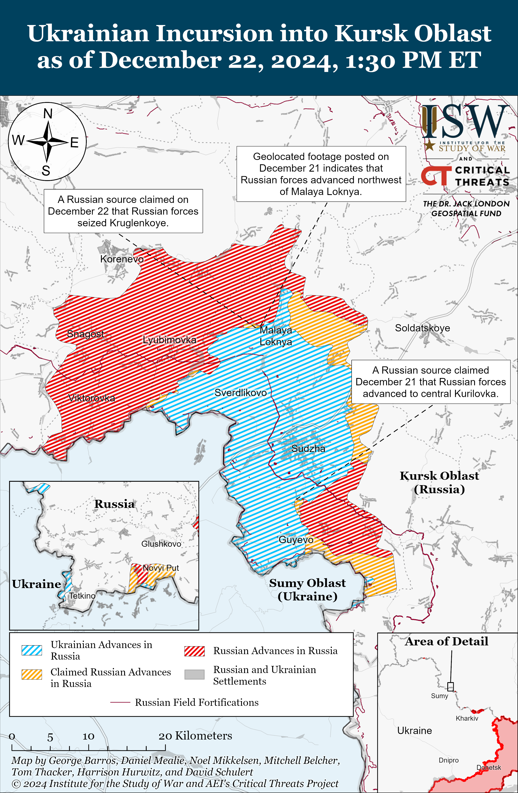
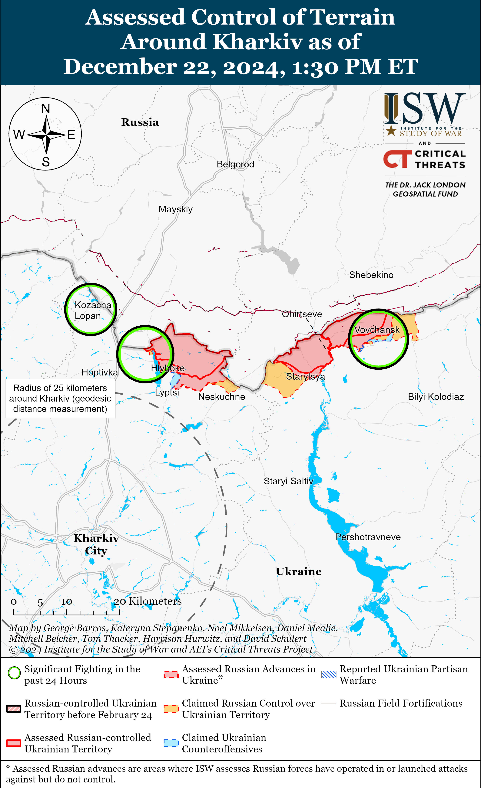
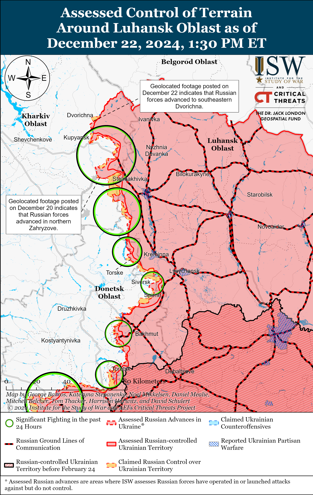
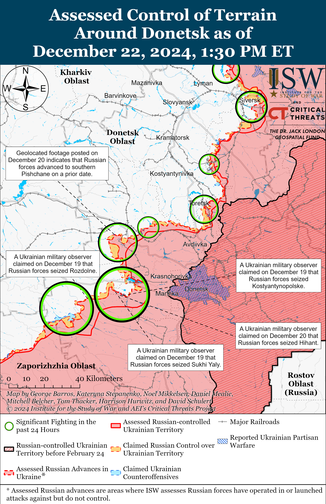
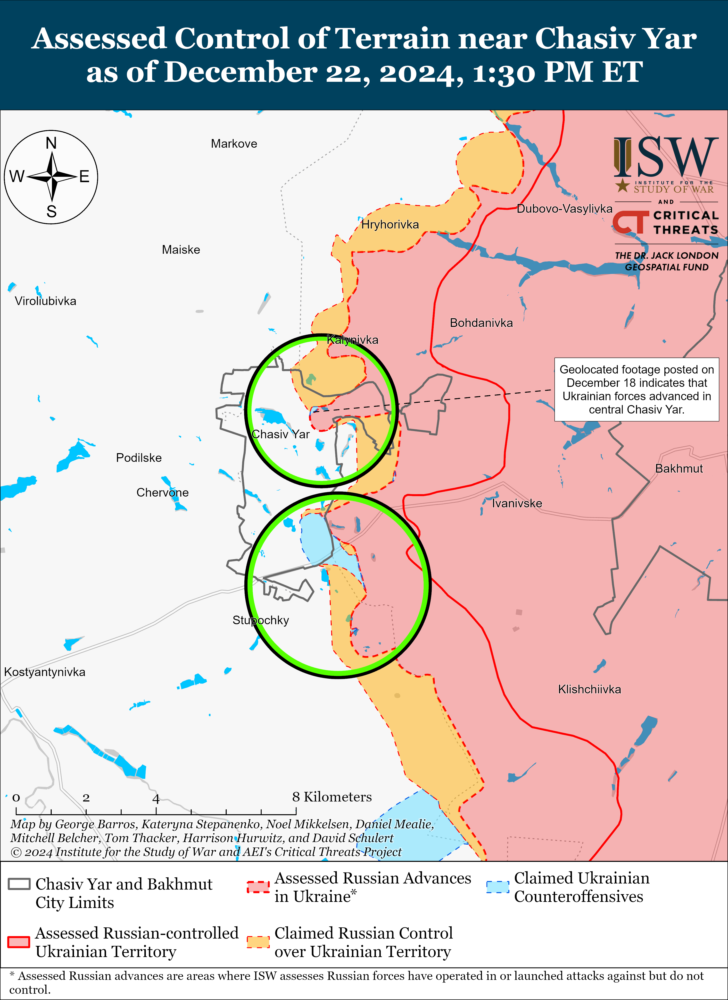
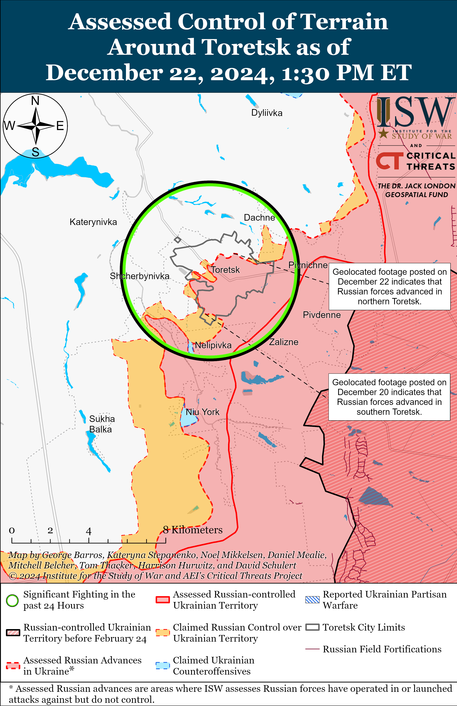
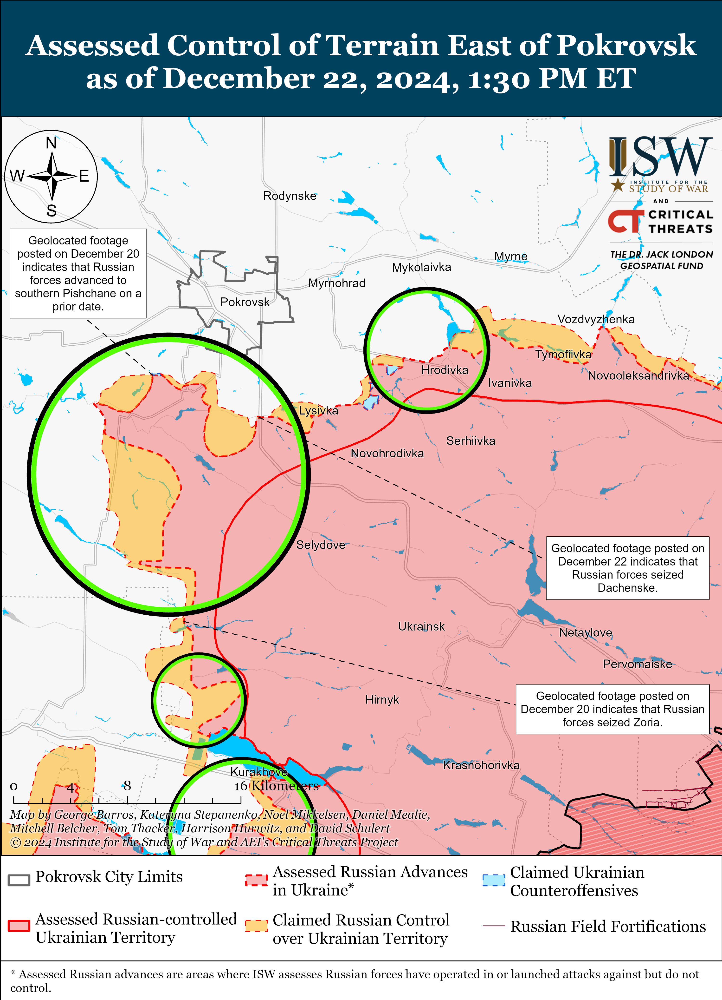
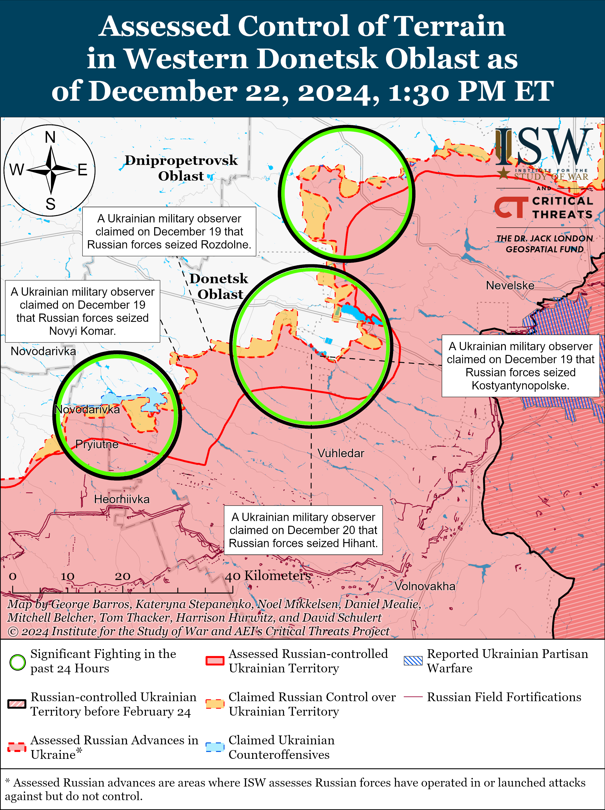
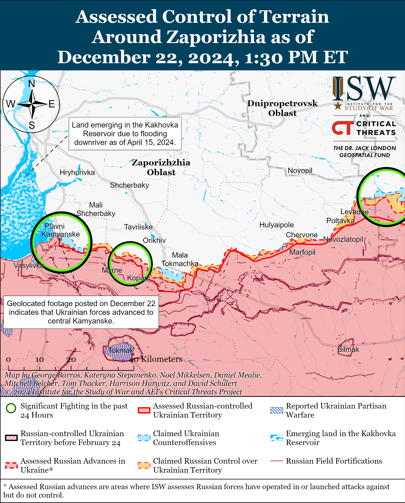
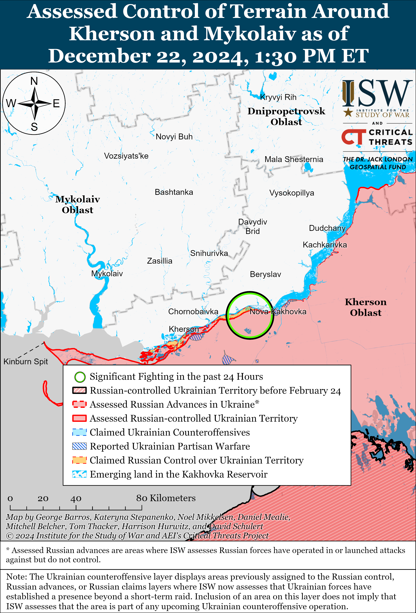

# Russian Offensive Campaign Assessment, December 22, 2024

**Christina Harward, Nicole Wolkov, Grace Mappes, William Runkel, and George Barros**

**December 22, 2024, 3:30 pm ET**

**Click**[**here**](https://storymaps.arcgis.com/stories/36a7f6a6f5a9448496de641cf64bd375)**to see ISW’s interactive map of the Russian invasion of Ukraine. This map is updated daily alongside the static maps present in this report.**

**Click**[**here**](https://storymaps.arcgis.com/stories/83a2f24901c941d581c0c523ecd2619b)**to see ISW’s interactive map of Ukraine’s offensive in Kursk Oblast.**

**Click**[**here**](https://understandingwar.maps.arcgis.com/apps/instant/3dviewer/index.html?appid=1602762dbcde419bb957dea358449580)**to see ISW’s 3D control of terrain topographic map of Ukraine. Use of a computer (not a mobile device) is strongly recommended for using this data-heavy tool.**

**Click**[**here**](https://storymaps.arcgis.com/stories/733fe90805894bfc8562d90b106aa895)**to access ISW’s archive of interactive time-lapse maps of the Russian invasion of Ukraine. These maps complement the static control-of-terrain map that ISW produces daily by showing a dynamic frontline. ISW will update this time-lapse map archive monthly.**

**Note: The data cut-off for this product was 12pm ET on December 22. ISW will cover subsequent reports in the December 23 Russian Offensive Campaign Assessment.**

**Russian President Vladimir Putin repeated his latest assertion that he should have violated the ceasefire he had imposed on Ukraine in 2014 and 2015 by launching a full-scale invasion even earlier than February 2022.**Putin reiterated during an interview with Kremlin journalist Pavel Zarubin on December 22 that Russia should have started its full-scale invasion of Ukraine earlier than February 2022 but added that it is impossible to say exactly when that should have been.[1] Putin blamed Ukraine and the West for “misleading” Russia and not implementing the Minsk II Accords, which Putin claimed gave the West time to prepare Ukraine for future “military actions” against Russia. Putin claimed that Russia should have “prepared for this” and “chosen the right moment” to begin its full-scale invasion of Ukraine and not “waited for the moment when it was no longer possible to do nothing.” Putin failed to mention that Ukraine worked to strengthen its military as a defensive response to Russia’s 2014 annexation of Ukrainian territory and the launch of a war in the country’s east. Putin made similar remarks during his December 19 Direct Line televised press conference wherein he claimed that he would have made the decision to launch his full-scale invasion earlier if he could do it over again.[2] Putin also claimed on December 19 that Ukraine did not abide by the Minsk II Accords and that Russia “spontaneously” invaded Ukraine in 2022. The Minsk II Accords were notably extremely favorable to Russia, placing no obligations on Moscow – which was party to the negotiations as an alleged neutral mediator.[3] The Accords established a “ceasefire” that Russian proxies continually violated with Russian support.[4]

**Ukrainian forces reportedly struck an oil depot in Oryol Oblast with drones on the night of December 21 to 22.** Oryol Oblast Governor Andrei Klychkov claimed on December 22 that Russian air defenses and electronic warfare (EW) downed 20 Ukrainian drones over Oryol Oblast and that drone strikes caused a fire at a fuel facility.[5] Footage published on December 22 purportedly shows a drone strike at the Stalnoy Kon (Steel Horse) oil depot on the northeastern outskirts of Oryol City.[6] Ukrainian forces previously struck the Stalnoy Kon oil depot on the night of December 13 to 14.[7] Ukraine’s Foreign Intelligence Service (SZRU) reported on December 22 that international sanctions preventing Russia from accessing Western equipment and components, Ukrainian drone strikes, reduced Russian oil exports, and high Russian loan rates have caused Russian oil refineries to increase their downtime in 2024.[8] The SZRU reported that Russian oil refineries experienced a total downtime that prevented the facilities from refining 41.1 million tons of oil in 2024 after having only experienced a total downtime worth 35.9 million tons of oil in 2023. Ukrainian drone strikes have also targeted Russian air bases and the Russian military appears to be building shelters for aircraft at several Russian air bases. Satellite imagery collected throughout October 2024 indicates that the Russian military has been constructing shelters for aircraft at several air bases, including in Primorsko-Akhtarsk, Krasnodar Krai; Kursk City; and occupied Belbek, Crimea.[9]

**Russian forces recently executed more Ukrainian prisoners of war (POWs) on the battlefield.**Geolocated footage published on December 22 shows Russian forces executing five Ukrainian POWs in the Donetsk-Zaporizhia Oblast border area in Blahodatne (south of Velyka Novosilka).[10] ISW has routinely assessed that Russian commanders are either complacent or enabling their subordinates to engage in POW executions in clear violation of international law.[11]

**Key Takeaways:**

- **Russian President Vladimir Putin repeated his latest assertion that he should have violated the ceasefire he had imposed on Ukraine in 2014 and 2015 by launching a full-scale invasion even earlier than February 2022.**
- **Ukrainian forces reportedly struck an oil depot in Oryol Oblast with drones on the night of December 21 to 22.**
- **Russian forces recently executed more Ukrainian prisoners of war (POWs) on the battlefield.**
- **Ukrainian forces recently regained lost positions in western Zaporizhia Oblast, and Russian forces recently advanced near Kupyansk, Toretsk, and Pokrovsk and in Kursk Oblast.**
- **North Korea may have transferred at least four additional ballistic missiles to Russia.**

***We do not report in detail on Russian war crimes because these activities are well-covered in Western media and do not directly affect the military operations we are assessing and forecasting. We will continue to evaluate and report on the effects of these criminal activities on the Ukrainian military and the Ukrainian population and specifically on combat in Ukrainian urban areas. We utterly condemn Russian violations of the laws of armed conflict and the Geneva Conventions and crimes against humanity even though we do not describe them in these reports.***

- Ukrainian Operations in the Russian Federation
- Russian Main Effort – Eastern Ukraine (comprised of three subordinate main efforts)
- Russian Subordinate Main Effort #1 – Push Ukrainian forces back from the international border with Belgorod Oblast and approach to within tube artillery range of Kharkiv City
- Russian Subordinate Main Effort #2 – Capture the remainder of Luhansk Oblast and push westward into eastern Kharkiv Oblast and encircle northern Donetsk Oblast
- Russian Subordinate Main Effort #3 – Capture the entirety of Donetsk Oblast
- Russian Supporting Effort – Southern Axis
- Russian Air, Missile, and Drone Campaign
- Russian Mobilization and Force Generation Efforts
- Russian Technological Adaptations
- Activities in Russian-occupied areas
- Significant Activity in Belarus

**Ukrainian Operations in the Russian Federation**

Russian forces recently advanced in the Ukrainian salient in Kursk Oblast amid continued fighting in the area on December 22. Geolocated footage published on December 21 shows that Russian forces recently advanced east of Kruglenkoye (southeast of Korenevo).[12] Russian milbloggers claimed that Russian forces entered and seized Kruglenkoye and advanced 900 meters into central Kurilovka (south of Sudzha), but ISW has not observed confirmation of these claims.[13] Russian forces continued assault operations southeast of Korenevo near Novoivanovka and Kruglenkoye, north of Sudzha near Malaya Loknya, Cherkasskoye Porechnoye, and Pogrebki; and northeast of Sudzha near Martynovka.[14] Drone operators of the Russian 34th Motorized Rifle Brigade (49th Combined Arms Army [CAA], Southern Military District [SMD]) are reportedly striking Ukrainian targets near Malaya Loknya, and snipers of the 34th Motorized Rifle Brigade are reportedly operating near Pogrebki.[15] The commander of a Ukrainian battalion operating in Kursk Oblast stated that Russian forces have begun recently fielding armored vehicles in assaults in Kursk Oblast after exclusively conducting infantry assaults in previous weeks.[16] Elements of the Russian 83rd Airborne (VDV) Brigade and BARS-22 (Russian Combat Army Reserve) detachment are reportedly operating in Kursk Oblast.[17]

**Russian Main Effort – Eastern Ukraine**

**Russian Subordinate Main Effort #1 – Kharkiv Oblast (Russian objective: Push Ukrainian forces back from the international border with Belgorod Oblast and approach to within tube artillery range of Kharkiv City)**

Russian forces continued ground attacks in the Kharkiv direction on December 22 but did not make any confirmed advances. The Ukrainian General Staff reported that Russian forces conducted offensive operations north of Kharkiv City near Kozacha Lopan, Hoptivka, Hlyboke, and Vysoka Yaruha, and northeast of Kharkiv City near Starytsya and Vovchansk on December 21 and 22.[18] Drone operators of the Chechen “Zapad-Akhmat” battalion are reportedly operating near Vovchansky-Khutory (east of Vovchansk).[19]

**Russian Subordinate Main Effort #2 – Luhansk Oblast (Russian objective: Capture the remainder of Luhansk Oblast and push westward into eastern Kharkiv Oblast and northern Donetsk Oblast)**

Russian forces recently marginally advanced in the Kupyansk direction amid continued offensive operations along the Kupyansk-Svatove-Kreminna line on December 22. Geolocated footage published on December 22 indicates Russian forces recently marginally advanced in southeastern Dvorichna (northeast of Kupyansk).[20] Additional geolocated footage published on December 22 shows Ukrainian forces repelling a Russian reinforced platoon-sized mechanized assault near Synkivka (northeast of Kupyansk).[21] The Russian Ministry of Defense (MoD) claimed that Russian forces seized Lozova (southeast of Kupyansk).[22] Russian milblogger claimed that Russian forces advanced east of Zahryzove and near Kruhlyakivka (both southeast of Kupyansk).[23] ISW has not observed confirmation of these claims. however. Russian forces continued attacking east of Kupyansk near Petropavlivka and Kucherivka; southeast of Kupyansk near Zahryzove, Kruhlyakivka, Stepova Novoselivka, and Bohuslavka; southwest of Svatove near Hrekivka, Novoyehorivka, and Novoserhiivka; west of Svatove near Zeleny Hai and Nadiya; northwest of Kreminna near Ivanivka, Terny, and Druzhelyubivka; west of Kreminna near Torske; and southwest of Kreminna near Dibrova on December 21 and 22.[24]

**Russian Subordinate Main Effort #3 – Donetsk Oblast (Russian objective: Capture the entirety of Donetsk Oblast, the claimed territory of Russia’s proxies in Donbas)**

Russian forces conducted offensive operations northeast of Siversk near Serebryanka and Bilohorivka, east of Siversk near Verkhnokamyanske, and southeast of Siversk near Vyimka on December 21 and 22 but did not advance.[25]

Russian forces continued offensive operations in the Chasiv Yar direction on December 22 but did not make any confirmed advances. Russian forces conducted offensive operations near Chasiv Yar itself and south of Chasiv Yar near Stupochky on December 21 and 22.[26] Russian milbloggers claimed that elements of the Russian 200th Motorized Rifle Brigade (14th Army Corps [AC], Leningrad Military District [LMD]) advanced in Pivnichnyi Microraion (northern Chasiv Yar), but ISW has not observed confirmation of this claim.[27]

Russian forces recently advanced in the Toretsk direction amid continued offensive operations in the area on December 22. Geolocated footage published on December 22 indicates that Russian forces recently advanced in northern Toretsk.[28] Russian forces conducted offensive operations near Toretsk itself, east of Toretsk near Druzhba, and southwest of Toretsk near Sukha Balka on December 21 and 22.[29] Drone operators of the Russian 80th “Sparta” Separate Reconnaissance Battalion (51st Combined Arms Army [CAA], formerly 1st Donetsk People’s Republic Army Corps [DNR] AC) are reportedly operating near Toretsk, and elements of the 9th Motorized Rifle Brigade (51st CAA) are reportedly operating near Niu York.[30]

Russian forces recently advanced in the Pokrovsk direction amid continued offensive operations in the area on December 22. Geolocated footage published on December 22 indicates that Russian forces recently advanced in western Dachenske (south of Pokrovsk) and seized the settlement.[31] Russian forces conducted offensive operations near Pokrovsk itself; east of Pokrovsk near Promin, and Myrolyubivka; southeast of Pokrovsk near Lysivka; south of Pokrovsk near Zelene, Dachenske, Novyi Trud, and Novoukrainka; and southwest of Pokrovsk near Novovasylivka, Novoyelyzavetivka, and Novoolenivka on December 21 and 22.[32]

Ukrainian military observer Kostyantyn Mashovets stated that elements of the Russian 27th Motorized Rifle Division (2nd CAA, Central Military District [CMD]) and 90th Tank Division (41st CAA, CMD) are operating in the Pokrovsk and Kurakhove directions.[33]

Russian forces continued offensive operations in the Kurakhove direction on December 22 but did not make any confirmed advances. Russian forces conducted offensive operations near Kurakhove itself; northwest of Kurakhove near Sontsivka, Shevchenko, and Stari Terny; and west of Kurakhove near Dachne on December 21 and 22.[34] The Russian Ministry of Defense (MoD) claimed on December 22 that the Russian Central Grouping of Forces seized Sontsivka, but ISW has not observed confirmation of this claim.[35] Some Russian milbloggers claimed that Russian forces have almost entirely seized Kurakhove after having pushed most Ukrainian forces out of the residential area in the town, but another Russian milblogger claimed that it is too soon to say that Russian forces have practically seized Kurakhove.[36] A Russian source claimed that Russian forces are approaching the thermal power plant west of Kurakhove.[37] Elements of the Russian 33rd Motorized Rifle Regiment (20th Motorized Rifle Division, 8th CAA, Southern Military District [SMD]) are reportedly operating in the Kurakhove direction.[38]

Russian forces continued offensive operations in the Vuhledar direction on December 22 but did not make any confirmed advances. Russian forces conducted offensive operations north of Vuhledar near Uspenivka and northwest of Vuhledar towards Kostyantynopil and near Kostyantynopolske, Yantarne, and Rozlyv on December 21 and 22.[39] A Russian milblogger claimed that Russian forces advanced to Yantarne and up to 2.5 kilometers wide and up to 1.2 kilometers deep south of Zelenivka (northwest of Vuhledar), but ISW has not observed confirmation of these claims.[40] Elements of the Russian 2nd Battalion of the 39th Motorized Rifle Brigade (68th AC, EMD) are reportedly operating near Kostyantynopolske.[41]

Russian forces continued offensive operations near Velyka Novosilka on December 22 but did not make any confirmed advances. Russian forces conducted offensive operations northeast of Velyka Novosilka near Rozdolne and towards Odradne; south of Velyka Novosilka near Makarivka, Blahodatne, Neskuchne, Storozheve, and Vremivka; and west of Velyka Novosilka towards Novosilka on December 21 and 22.[42] A Russian source claimed that Russian forces are conducting clearing operations in the Ukrainian pocket southwest of Storozheve.[43] A Russian milblogger claimed that Ukrainian forces are counterattacking near Rozdolne and that rainy weather is preventing Russian forces from using drones.[44] Drone operators of the Russian 143rd Motorized Rifle Regiment (127th Motorized Rifle Brigade, 5th CAA, EMD) are reportedly operating in the Vremivka direction.[45]

**Russian Supporting Effort – Southern Axis (Russian objective: Maintain frontline positions and secure rear areas against Ukrainian strikes)**

Russian and Ukrainian sources did not report fighting in the Hulayipole (far eastern Zaporizhia Oblast) direction on December 22. Elements of the Russian 38th Motorized Rifle Brigade (35th Combined Arms Army [CAA], Eastern Military District [EMD]) reportedly continue to operate in the Polohy (Hulyaipole) direction.[46]

Ukrainian forces recently regained lost positions in western Zaporizhia Oblast following reports of localized Ukrainian offensive operations in the area. Geolocated footage published on December 22 indicates that Ukrainian forces recently regained lost positions in central Kamyanske (northwest of Robotyne and south of Zaporizhzhia City), and a Russian milblogger claimed that Ukrainian forces likely pushed Russian forces from northern Kamyanske on the eastern bank of the Kakhovka Reservoir.[47] A Russian milblogger claimed that Russian forces have successfully stopped the Ukrainian advance and cut off the attacking unit from supplies and reinforcements.[48] Russian milbloggers reported localized Ukrainian ground assaults in the Kamyanske area on December 20 and 21.[49] Russian forces also conducted ground attacks near Pyatykhatky (southeast of Kamyanske) and Novoandriivka (northwest of Robotyne) on December 21 and 22.[50] A Russian milblogger claimed that Russian forces seized several Ukrainian positions in an unspecified area of the Orikhiv (western Zaporizhia Oblast) direction, but ISW has not observed confirmation of this claim.[51] Drone elements of the Chechen “Vostok-Akhmat” Battalion are reportedly conducting reconnaissance in northwestern Robotyne.[52]

A Ukrainian official confirmed that Russian sabotage and reconnaissance groups recently attempted a limited crossing of the Dnipro River in Kherson Oblast. Ukrainian Southern Defense Forces Spokesperson Colonel Vladyslav Voloshyn stated on December 21 that Russian forces conducted heavy artillery and rocket strikes against west (right) bank Kherson Oblast on December 20, during which a Russian sabotage and reconnaissance group unsuccessfully attempted to cross the Dnipro River near the Antonivsky roadway bridge (east of Kherson City) – consistent with recent Russian milblogger claims on December 21.[53] Voloshyn stated that Russian forces did not make it halfway across the river before Ukrainian forces destroyed the sabotage and reconnaissance group and noted that Russian forces used weather conditions and smokescreens to conceal their attempted advance. Voloshyn reported that Russian forces are attempting to land sabotage and reconnaissance groups in other areas of the Dnipro River and that Russian forces are focusing on Kozatskyi Island (east of Kherson City) and Velikiy Potemkin Island (south of Kherson City). Russian forces also continued offensive operations in the Dnipro direction on December 22.[54] Ukraine’s Southern Defense Forces reported on December 22 that Ukrainian forces destroyed a Russian Starlink terminal in an unspecified location in southern Ukraine.[55]

**Russian Air, Missile, and Drone Campaign (Russian Objective: Target Ukrainian military and civilian infrastructure in the rear and on the frontline)**

Russian forces conducted a series of drone and missile strikes against Ukraine overnight on December 21 to 22. The Ukrainian Air Force reported that Russian forces launched one Iskander-M ballistic missile from occupied Crimea towards Kherson Oblast and 103 Shahed drones and other unspecified drones from Bryansk, Oryol, and Kursk oblasts; Millerovo, Rostov Oblast; and occupied Berdyansk, Zaporizhia Oblast.[56] The Ukrainian Air Force reported that Ukrainian forces downed 52 drones over Poltava, Sumy, Kharkiv, Kyiv, Chernihiv, Cherkasy, Kirovohrad, Zhytomyr, Dnipropetrovsk, Kherson, Mykolaiv and Zaporizhia oblasts; that 44 decoy drones were ”lost” due to Ukrainian countermeasures (likely referring to electronic warfare [EW] interference); and that one drone flew towards Belarusian airspace. The Ukrainian Air Force reported that Russian drones damaged residential areas and civilian enterprises in Kherson, Mykolaiv, Chernihiv, Sumy, Zhytomyr, and Kyiv oblasts.

Ukrainian Air Force Spokesperson Colonel Yuriy Ihnat reported on December 21 that Ukrainian forces intercept roughly 95 percent of Russian drones, which includes drones that Ukrainian forces have destroyed with air defenses and EW and those that have fallen on their own.[57] Ihnat noted that the Ukrainian interception rate for Russian missiles is lower because Russian forces are increasing their use of ballistic missiles, which Ukrainian air defenders have more difficulty in intercepting.

**Russian Mobilization and Force Generation Efforts (Russian objective: Expand combat power without conducting general mobilization)**

North Korea may have transferred at least four additional ballistic missiles to Russia. Footage published on December 21 purportedly shows trains, reportedly in Tyumen Oblast, transporting 10 M-1939 Koksan artillery systems and four Pukguksong-2 (KN-15) medium- or intermediate-range ballistic missiles or Hwasongpho-11Na (KN-24) short-range ballistic missiles.[58] Ukrainian and Russian sources noted, however, that the low quality of the footage makes it difficult to confirm the cargo on the train, particularly the alleged missiles.[59] ISW has previously observed reports of North Korea transferring Koksan artillery systems to Russia, and Russian forces have often included North Korean KN-23 short-range ballistic missiles in their strike packages targeting Ukraine.[60] ISW cannot independently verify the location or cargo of the Russian train.

**Russian Technological Adaptations (Russian objective: Introduce technological innovations to optimize systems for use in Ukraine)**

Nothing significant to report.

**Activities in Russian-occupied areas (Russian objective: Consolidate administrative control of annexed areas; forcibly integrate Ukrainian citizens into Russian sociocultural, economic, military, and governance systems)**

*ISW is not publishing coverage of activities in Russian-occupied areas today.*

**Significant activity in Belarus (Russian efforts to increase its military presence in Belarus and further integrate Belarus into Russian-favorable frameworks)**

Belarusian President Alexander Lukashenko met with United Arab Emirates (UAE) President Mohammed bin Zayed al-Nahyan on December 22 and discussed expanding bilateral cooperation and development.[61]

**Note: ISW does not receive any classified material from any source, uses only publicly available information, and draws extensively on Russian, Ukrainian, and Western reporting and social media as well as commercially available satellite imagery and other geospatial data as the basis for these reports. References to all sources used are provided in the endnotes of each update.**

[1] https://tass dot ru/politika/22743307; https://www.gazeta dot ru/politics/2024/12/22/20282474.shtml

[2] https://isw.pub/UkrWar121924

[3] https://isw.pub/UkrWar121924

[4] https://isw.pub/UkrWar121924

[5] https://t.me/Klychkov\_Andrey/4137

[6] https://x.com/666\_mancer/status/1870738746184015963 ; https://t.me/shot\_shot/75549 ; https://t.me/milinfolive/138221 ; https://t.me/bazabazon/33846  ; https://t.me/vchkogpu/53490; https://t.me/vchkogpu/53489 ; https://t.me/vchkogpu/53487; https://t.me/vchkogpu/53484; https://t.me/vchkogpu/53483

[7] https://understandingwar.org/backgrounder/russian-offensive-campaign-assessment-december-14-2024

[8] https://armyinform.com dot ua/2024/12/22/systemni-prostoyi-rosijskyh-npz-naslidok-kryzy-rosijskoyi-ekonomiky-ta-dij-ukrayiny/ ; https://szru.gov dot ua/news-media/news/systemni-prostoi-rosiiskykh-npz–naslidok-kryzy-rosiiskoi-ekonomiky-ta-dii-ukrainy

[9] https://x.com/bradyafr/status/1870493042589028593 ; https://x.com/Tatarigami\_UA/status/1858621388803739811 ; https://www.twz.com/air/russias-belbek-air-base-in-crimea-is-getting-hardened-aircraft-shelters

[10] \*\*\*GRAPHIC\*\*\* https://t.me/dmytro\_lubinetzs/7536; https://t.me/bbcrussian/74505; https://armyinform dot com.ua/2024/12/22/okupanty-vkotre-rozstrilyaly-ukrayinskyh-polonenyh-u-zsu-povidomyly-pro-chergovyj-zlochyn-rashystiv/; https://t.me/rubpak/241; https://x.com/rollowastaken/status/1870833988492759467 ; https://x.com/666\_mancer/status/1870790792283037839

[11] https://understandingwar.org/backgrounder/russian-offensive-campaign-assessment-july-10-2024; https://isw.pub/UkrWar032724; https://isw.pub/UkrWar090624; https://understandingwar.org/backgrounder/russian-offensive-campaign-assessment-february-20-2024; https://isw.pub/UkrWar022524; https://understandingwar.org/backgrounder/russian-offensive-campaign-assessment-september-17-2024

[12] https://t.me/kryvyirih17otbr/4031; https://t.me/WarArchive\_ua/23849; https://t.me/creamy\_caprice/7893

[13] https://t.me/boris\_rozhin/148770; https://t.me/boris\_rozhin/148794; https://t.me/creamy\_caprice/7889

[14] https://t.me/DnevnikDesantnika/21343; https://t.me/dva\_majors/60810; https://t.me/RVvoenkor/83184

[15] https://t.me/dva\_majors/60805; https://t.me/dva\_majors/60825

[16] https://armyinform dot com.ua/2024/12/21/pihota-zakinchuyetsya-vorog-pochav-kydaty-v-bij-na-kurshhyni-bagato-bronetehniky/

[17] https://t.me/DnevnikDesantnika/21348; https://t.me/epoddubny/21970

[18]https://www.facebook.com/GeneralStaff.ua/posts/pfbid0ajsV3t2pyitAxhaBXNdTnGYNFP3AhkZoE9tUySQQc81itz4Jb9aGwT4eGCXqTsGsl ; https://www.facebook.com/GeneralStaff.ua/posts/pfbid074bJe6pgiYgTYg2Vytu7sKFHozwoLj4qx7ha2ev8fK6rK1KgxZ5aq3RszPKmmNpTl  ; https://www.facebook.com/GeneralStaff.ua/posts/pfbid0eGRSUiHof3WegXHHAfQ74ruWsPwVwdnYVAofJzjVZFrn2KgCoVpJPDR7iZToUyAQl

[19] https://t.me/RKadyrov\_95/5363

[20] https://t.me/WarArchive\_ua/23873; https://t.me/ogshb8/580; https://t.me/creamy\_caprice/7890; https://x.com/Bielitzling/status/1870632788547739699

[21] https://t.me/WarArchive\_ua/23876; https://t.me/mb2omb30/74

[22] https://t.me/mod\_russia/47153

[23] https://t.me/z\_arhiv/30173 ; https://t.me/RVvoenkor/83142

[24] https://www.facebook.com/GeneralStaff.ua/posts/pfbid0ajsV3t2pyitAxhaBXNdTnGYNFP3AhkZoE9tUySQQc81itz4Jb9aGwT4eGCXqTsGsl ; https://www.facebook.com/GeneralStaff.ua/posts/pfbid074bJe6pgiYgTYg2Vytu7sKFHozwoLj4qx7ha2ev8fK6rK1KgxZ5aq3RszPKmmNpTl ; https://www.facebook.com/GeneralStaff.ua/posts/pfbid0eGRSUiHof3WegXHHAfQ74ruWsPwVwdnYVAofJzjVZFrn2KgCoVpJPDR7iZToUyAQl ; https://t.me/Khortytsky\_wind/3620

[25] https://www.facebook.com/GeneralStaff.ua/posts/pfbid0ajsV3t2pyitAxhaBXNdTnGYNFP3AhkZoE9tUySQQc81itz4Jb9aGwT4eGCXqTsGsl; https://www.facebook.com/GeneralStaff.ua/posts/pfbid074bJe6pgiYgTYg2Vytu7sKFHozwoLj4qx7ha2ev8fK6rK1KgxZ5aq3RszPKmmNpTl; https://www.facebook.com/GeneralStaff.ua/posts/pfbid0eGRSUiHof3WegXHHAfQ74ruWsPwVwdnYVAofJzjVZFrn2KgCoVpJPDR7iZToUyAQl; https://t.me/s/Khortytsky\_wind

[26] https://www.facebook.com/GeneralStaff.ua/posts/pfbid0ajsV3t2pyitAxhaBXNdTnGYNFP3AhkZoE9tUySQQc81itz4Jb9aGwT4eGCXqTsGsl; https://www.facebook.com/GeneralStaff.ua/posts/pfbid074bJe6pgiYgTYg2Vytu7sKFHozwoLj4qx7ha2ev8fK6rK1KgxZ5aq3RszPKmmNpTl ; https://www.facebook.com/GeneralStaff.ua/posts/pfbid0eGRSUiHof3WegXHHAfQ74ruWsPwVwdnYVAofJzjVZFrn2KgCoVpJPDR7iZToUyAQl; https://t.me/Khortytsky\_wind/3620

[27] https://t.me/wargonzo/23900; https://t.me/boris\_rozhin/148770

[28] https://x.com/AudaxonX/status/1870836899088335201; https://t.me/Khyzhak\_brigade/299

[29] https://www.facebook.com/GeneralStaff.ua/posts/pfbid0ajsV3t2pyitAxhaBXNdTnGYNFP3AhkZoE9tUySQQc81itz4Jb9aGwT4eGCXqTsGsl   ; https://www.facebook.com/GeneralStaff.ua/posts/pfbid074bJe6pgiYgTYg2Vytu7sKFHozwoLj4qx7ha2ev8fK6rK1KgxZ5aq3RszPKmmNpTl; https://www.facebook.com/GeneralStaff.ua/posts/pfbid0eGRSUiHof3WegXHHAfQ74ruWsPwVwdnYVAofJzjVZFrn2KgCoVpJPDR7iZToUyAQl; https://t.me/Khortytsky\_wind/3620

[30] https://t.me/RVvoenkor/83176

[31] https://x.com/Bielitzling/status/1870846354655744169; https://t.me/jagers68/546

[32] https://www.facebook.com/GeneralStaff.ua/posts/pfbid0eGRSUiHof3WegXHHAfQ74ruWsPwVwdnYVAofJzjVZFrn2KgCoVpJPDR7iZToUyAQl; https://www.facebook.com/GeneralStaff.ua/posts/pfbid074bJe6pgiYgTYg2Vytu7sKFHozwoLj4qx7ha2ev8fK6rK1KgxZ5aq3RszPKmmNpTl ; https://www.facebook.com/GeneralStaff.ua/posts/pfbid0ajsV3t2pyitAxhaBXNdTnGYNFP3AhkZoE9tUySQQc81itz4Jb9aGwT4eGCXqTsGsl; https://t.me/Khortytsky\_wind/3620

[33] https://t.me/zvizdecmanhustu/2434

[34] https://www.facebook.com/GeneralStaff.ua/posts/pfbid0ajsV3t2pyitAxhaBXNdTnGYNFP3AhkZoE9tUySQQc81itz4Jb9aGwT4eGCXqTsGsl; https://www.facebook.com/GeneralStaff.ua/posts/pfbid074bJe6pgiYgTYg2Vytu7sKFHozwoLj4qx7ha2ev8fK6rK1KgxZ5aq3RszPKmmNpTl; https://www.facebook.com/GeneralStaff.ua/posts/pfbid0eGRSUiHof3WegXHHAfQ74ruWsPwVwdnYVAofJzjVZFrn2KgCoVpJPDR7iZToUyAQl; https://t.me/Khortytsky\_wind/3620

[35] https://t.me/mod\_russia/47153

[36] https://t.me/RVvoenkor/83146; https://t.me/RVvoenkor/83156; https://t.me/dva\_majors/60810; https://t.me/dva\_majors/60863 ; https://t.me/wargonzo/23900

[37] https://t.me/RVvoenkor/83146; https://t.me/RVvoenkor/83156

[38] https://t.me/milinfolive/138240

[39] https://www.facebook.com/GeneralStaff.ua/posts/pfbid0ajsV3t2pyitAxhaBXNdTnGYNFP3AhkZoE9tUySQQc81itz4Jb9aGwT4eGCXqTsGsl; https://www.facebook.com/GeneralStaff.ua/posts/pfbid074bJe6pgiYgTYg2Vytu7sKFHozwoLj4qx7ha2ev8fK6rK1KgxZ5aq3RszPKmmNpTl ; https://www.facebook.com/GeneralStaff.ua/posts/pfbid0eGRSUiHof3WegXHHAfQ74ruWsPwVwdnYVAofJzjVZFrn2KgCoVpJPDR7iZToUyAQl; https://t.me/Khortytsky\_wind/3620

[40] https://t.me/RVvoenkor/83146

[41] https://t.me/voin\_dv/12408

[42] https://www.facebook.com/GeneralStaff.ua/posts/pfbid0ajsV3t2pyitAxhaBXNdTnGYNFP3AhkZoE9tUySQQc81itz4Jb9aGwT4eGCXqTsGsl; https://www.facebook.com/GeneralStaff.ua/posts/pfbid074bJe6pgiYgTYg2Vytu7sKFHozwoLj4qx7ha2ev8fK6rK1KgxZ5aq3RszPKmmNpTl ; https://www.facebook.com/GeneralStaff.ua/posts/pfbid0eGRSUiHof3WegXHHAfQ74ruWsPwVwdnYVAofJzjVZFrn2KgCoVpJPDR7iZToUyAQl; https://t.me/voenkorKotenok/60912; https://t.me/Khortytsky\_wind/3620

[43] https://t.me/DnevnikDesantnika/21343

[44] https://t.me/voenkorKotenok/60919;

[45] https://t.me/voin\_dv/12410

[46] https://t.me/boris\_rozhin/148775; https://t.me/voin\_dv/12401

[47] https://x.com/AndrewPerpetua/status/1870746811482112326; https://x.com/Map\_Hargoo/status/1870742486559396112; https://x.com/AndrewPerpetua/status/1870747123152732502; https://t.me/motopatriot/30745

[48] https://t.me/notes\_veterans/21160; https://t.me/romanov\_92/45753

[49] https://understandingwar.org/backgrounder/russian-offensive-campaign-assessment-december-21-2024; https://understandingwar.org/backgrounder/russian-offensive-campaign-assessment-december-20-2024

[50] https://www.facebook.com/GeneralStaff.ua/posts/pfbid0ajsV3t2pyitAxhaBXNdTnGYNFP3AhkZoE9tUySQQc81itz4Jb9aGwT4eGCXqTsGsl; https://www.facebook.com/GeneralStaff.ua/posts/pfbid074bJe6pgiYgTYg2Vytu7sKFHozwoLj4qx7ha2ev8fK6rK1KgxZ5aq3RszPKmmNpTl; https://www.facebook.com/GeneralStaff.ua/posts/pfbid0eGRSUiHof3WegXHHAfQ74ruWsPwVwdnYVAofJzjVZFrn2KgCoVpJPDR7iZToUyAQl

[51] https://t.me/dva\_majors/60810

[52] https://t.me/RKadyrov\_95/5362

[53] https://hromadske dot ua/viyna/236645-rosiiany-bilia-khersona-shchodnia-namahaiutsia-forsuvaty-dnipro-dlia-zakhoplennia-novoho-platsdarmu-syly-oborony; https://understandingwar.org/backgrounder/russian-offensive-campaign-assessment-december-21-2024; https://t.me/milinfolive/138190; https://t.me/voenkorKotenok/60908; https://t.me/RVvoenkor/83139

[54] https://www.facebook.com/GeneralStaff.ua/posts/pfbid0ajsV3t2pyitAxhaBXNdTnGYNFP3AhkZoE9tUySQQc81itz4Jb9aGwT4eGCXqTsGsl; https://www.facebook.com/GeneralStaff.ua/posts/pfbid074bJe6pgiYgTYg2Vytu7sKFHozwoLj4qx7ha2ev8fK6rK1KgxZ5aq3RszPKmmNpTl; https://www.facebook.com/GeneralStaff.ua/posts/pfbid0eGRSUiHof3WegXHHAfQ74ruWsPwVwdnYVAofJzjVZFrn2KgCoVpJPDR7iZToUyAQl

[55] https://t.me/SJTF\_Odes/11890

[56] https://t.me/kpszsu/25356

[57]https://www.facebook.com/yuriy.ignat/posts/pfbid0ofGeRMPDcbLM6k97jXqK46KnXpf45dkKWTahNFXXhrXEGRsGCSdaiWRJbgTKyQPCl ; https://armyinform dot com.ua/2024/12/21/operatoriv-zahidnyh-zrk-ne-vidpravlyayut-u-pihotu-povitryani-syly/

[58] https://x.com/kpaweapons/status/1870531069038198822 ; https://x.com/KPAWeapons/status/1870573736757539131

[59] https://mil dot in.ua/uk/news/kndr-jmovirno-peredala-rosiyi-raketniy-kompleksy-kn-15/; https://t.me/milinfolive/138209

[60] https://understandingwar.org/backgrounder/russian-offensive-campaign-assessment-november-29-2024; https://understandingwar.org/backgrounder/russian-offensive-campaign-assessment-november-14-2024; https://understandingwar.org/backgrounder/russian-offensive-campaign-assessment-november-17-2024; https://understandingwar.org/backgrounder/russian-offensive-campaign-assessment-december-20-2024 ; https://understandingwar.org/backgrounder/russian-offensive-campaign-assessment-december-13-2024; https://understandingwar.org/wp-content/uploads/2024/12/2024-12-20-PDF-Russian20Offensive20Campaign20Assessment.pdf; https://understandingwar.org/backgrounder/russian-offensive-campaign-assessment-november-25-2024

[61] https://www.wam dot ae/en/article/b6tji5r-uae-belarus-presidents-discuss-bilateral ; https://t.me/pul\_1/14896 ; https://t.me/belta\_telegramm/285576
