# Russian Offensive Campaign Assessment, December 23, 2024

**Angelica Evans, Nicole Wolkov, Kateryna Stepanenko, Nate Trotter, Kelly Campa, and Fredrick W. Kagan**

**December 23, 2024, 9:15pm ET**

**Click** [**here**](https://storymaps.arcgis.com/stories/36a7f6a6f5a9448496de641cf64bd375) **to see ISW’s interactive map of the Russian invasion of Ukraine. This map is updated daily alongside the static maps present in this report.**

**Click** [**here**](https://storymaps.arcgis.com/stories/83a2f24901c941d581c0c523ecd2619b)**to see ISW’s interactive map of Ukraine’s offensive in Kursk Oblast.**

**Click** [**here**](https://understandingwar.maps.arcgis.com/apps/instant/3dviewer/index.html?appid=1602762dbcde419bb957dea358449580) **to see ISW’s 3D control of terrain topographic map of Ukraine. Use of a computer (not a mobile device) is strongly recommended for using this data-heavy tool.**

**Click** [**here**](https://storymaps.arcgis.com/stories/733fe90805894bfc8562d90b106aa895) **to access ISW’s archive of interactive time-lapse maps of the Russian invasion of Ukraine. These maps complement the static control-of-terrain map that ISW produces daily by showing a dynamic frontline. ISW will update this time-lapse map archive monthly.**

**Note: The data cut-off for this product was 1:45pm ET on December 23. ISW will cover subsequent reports in the December 24 Russian Offensive Campaign Assessment.**

**Russian forces are gradually advancing south and southwest of Pokrovsk, but it remains unclear if Russian forces will be able to exploit these gains to envelop the town or if they intend to advance to the administrative boundary of Donetsk Oblast.** Geolocated footage published on December 23 indicates that Russian forces recently advanced south of and within eastern Novovasylivka (southwest of Pokrovsk), and a Russian milblogger claimed that Russian forces advanced north of Novovasylivka towards Solone and Vovkove and are attacking towards Kotlyne.[1] A Kremlin-affiliated Russian milblogger claimed that Russian forces are focusing their attacks on Novotroitske (east of Novovasylivka) and Dachenske (south of Pokrovsk) and forced Ukrainian forces to withdraw to the Lysivka-Pishchane line (southeast to south of Pokrovsk).[2] The milblogger claimed that Russian forces are also advancing from Pustynka and Pushkine (both further south of Pokrovsk) towards Ukrainka (southwest of Pushkine). ISW previously assessed that the Russian military command intends to envelop Pokrovsk via a turning maneuver from the south, but Russian advances southwest of Pokrovsk could be aimed at widening the Russian salient in preparation for the envelopment of Pokrovsk from the south or alternatively for advancing westward to the Donetsk-Dnipropetrovsk Oblast administrative border as part of the Kremlin’s political and informational objective of seizing the entirety of Donetsk Oblast.[3]

[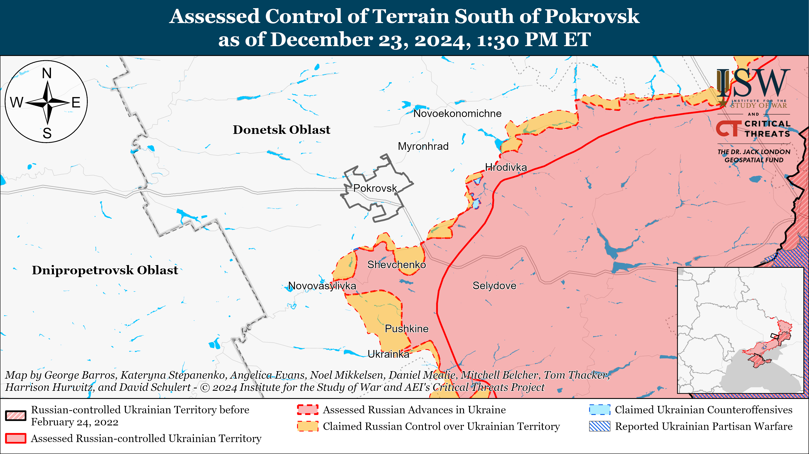](https://understandingwar.org/map/assessed-control-of-terrain-south-of-pokrovsk-as-of-december-23-2024-130-pm-et/)

**It remains unclear which effort the Russian military command will prioritize, as Russian President Vladimir Putin may have tasked the Russian military with securing territorial gains rather than seizing significant settlements.** Putin stated during his annual Direct Line televised press conference on December 19 that Russian forces are advancing not in “100, 200, 300 meters” but in square kilometers throughout the frontline, and Putin appears to be increasingly characterizing Russian advances in terms of square kilometers instead of highlighting the seizure of particular settlements as he had previously done.[4] Putin may have instructed the Russian military command to delay the seizure of Pokrovsk in favor of making further gains through open fields and small settlements, particularly as Russian forces advance closer to the Donetsk-Dnipropetrovsk Oblast administrative boundary. ISW has observed geolocated evidence sufficient to assess that Russian forces are within 10 kilometers of the Donetsk-Dnipropetrovsk Oblast administrative boundary, and Putin may be pressuring the Russian military command to advance to the boundary rather than to envelop Pokrovsk at this time. Seizing the remainder of Donetsk Oblast is one of Putin’s long-standing objectives in Ukraine, and Putin would likely highlight Russian advances up to the boundary to make outsized claims about Russian successes in Ukraine for both foreign and domestic audiences.[5] An organized offensive operation against well-defended towns could slow the rate of Russian advance during a critical moment in the Kremlin’s efforts to project the inevitability of Russian military victory on the global stage.

**The Russian military command appears to have split responsibility for the Pokrovsk direction between the Central Military District’s 2nd and 41st combined arms armies (CAAs), and ISW has yet to observe significant Russian activity in the 41st CAA’s area of responsibility (AoR).** Ukrainian military observer Kostyantyn Mashovets stated that the Russian military command has mainly concentrated elements of the 2nd CAA south and southeast of Pokrovsk and elements of the 41st CAA east and northeast of Pokrovsk in the directions of Myrnohrad and Novoekonomichne with the exception of the 90th Tank Division, which is mainly attacking south of Pokrovsk near Novotroitske towards Novoolenivka and Ukrainka (south of Novotroitske).[6] Mashovets noted that the 2nd CAA has a wider AoR extending from Novotroitske to Lysivka (east to southeast of Pokrovsk) and that the Russian military command may be preparing to activate the 41st CAA east and northeast of Pokrovsk in the near future. Mashovets stated that elements of the Russian 433rd Motorized Rifle Regiment (27th Motorized Rifle Division, 2nd CAA), 228th Motorized Rifle Regiment (90th Tank Division, 41st CAA, CMD), and likely the 15th Motorized Rifle Brigade (2nd CAA) have recently struggled to advance further along the Novotroitske-Shevchenko-Novyi Trud-Dachenske line due to successful Ukrainian counterattacks.[7] Russian forces have remained relatively inactive in the 41st CAA’s reported AoR since late October 2024 and will have to make significant advances in the direction of Novoekonomichne and Rodynske (both northeast of Pokrovsk) or towards and into Myrnohrad (east of Pokrovsk) in the near future if Russian forces intend to envelop Pokrovsk from both the northeast and southwest.[8] The relatively lower level of activity east and northeast of Pokrovsk indicates that the Russian military command may currently be prioritizing advances to the Donetsk-Dnipropetrovsk Oblast administrative boundary over the envelopment of Pokrovsk.

**Decreased combat effectiveness among Russian forces may be slowing the rate of Russian advance in the Pokrovsk direction.** Mashovets suggested that elements of the Russian 90th Tank Division have suffered significant personnel losses and are struggling to make further advances south of Pokrovsk and north of Kurakhove due to decreased combat capabilities.[9] Elements of the 90th Tank Division reportedly participated in the seizure of Avdiivka in February 2024 and have remained committed to various sectors of the Toretsk, Pokrovsk, and Kurakhove directions since then.[10] A Ukrainian brigade officer recently estimated that Russian forces lost nearly 3,000 personnel in the Pokrovsk direction in two weeks in mid-December 2024, and the 90th Tank Division has likely suffered significant personnel losses in the Pokrovsk direction and other directions where it was previously committed.[11] It is unlikely that the Russian military command has granted the division’s various units extended periods of leave to rest and reconstitute over the last year as the Russian military command largely viewed the 90th Tank Division as its primary exploitation formation in 2024.[12] ISW recently observed geolocated footage showing Russian forces conducting a motorized assault with civilian vehicles east of Ukrainka — within the 90th Tank Division’s AoR — suggesting that the division may also be struggling to replace armored vehicle losses while engaged in frontline combat.[13]

**Increased Russian armored vehicle losses over the last year, particularly among Russian units and formations that have been engaged in frontline combat for most of 2024, may be impacting Russia’s rate of advance in certain sectors of the frontline.** A social media source tracking Russian military depots via satellite imagery shared an updated assessment of Russian tank and armored vehicle storage facilities on December 22 and assessed that Russian forces have 47 percent of their pre-war tank reserves, 52 percent of pre-war infantry fighting vehicle reserves, and 45 percent of pre-war armored personnel carrier reserves remaining in storage as of a recent unspecified date.[14] The social media source’s data suggests that Russian forces have used all of their pre-war T-90 tanks and most of their T-80 tanks thus far but still have most of their older T-72, T-64/62, and T-54/55 tanks in storage. The social media source noted that Russian forces will not be able to field these older tanks as the tanks have likely been degraded by weather and time. ISW is unable to independently verify the social media source’s characterizations of the quality of various Russian tanks and armored vehicles based on satellite imagery as Russian forces may also be cannibalizing older tanks to repair newer tanks operating in Ukraine, which would be difficult to determine based on satellite imagery alone. Russian forces may also have additional armored vehicles and tanks in covered storage that are not visible in satellite imagery.

Armored vehicle limitations among Russian forces likely differ among sectors of the frontline, as Russian forces conducted battalion-sized mechanized assaults in the Siversk direction on November 2 and December 15 and a reinforced company-sized mechanized assault in the Kupyansk direction on October 19.[15] Russian forces operating in the Siversk and Kupyansk directions — frontline areas with a relatively lower tempo of Russian offensive operations over the last few months — may currently have more armored vehicles because they have not been conducting armored assaults and taking armored vehicles losses at the same intensity as Russian forces in the Pokrovsk and Kurakhove directions. The Russian military may, however, be struggling to reequip Russian frontline units and formations because the Russian military command does not want to withdraw Russian units for rest and reconstitution and risk further slowing Russian advances in high-priority frontline sectors.

**North Korea is reportedly planning to deploy more troops and weapons to Russia amid reports that over 3,000 North Korean troops have been killed and wounded in Kursk Oblast.** Ukrainian President Volodymyr Zelensky stated on December 23 that over 3,000 North Korean troops have been killed and wounded in Kursk Oblast — roughly a fourth of the total 12,000 North Korean troops deployed to Russia.[16] The South Korean Joint Chiefs of Staff reported on December 23 that at least 1,100 North Korean troops have been wounded and killed in Kursk Oblast and that North Korea appears to be preparing to deploy an unspecified number of additional troops and military equipment to Russia, possibly including loitering munitions.[17] The South Korean Joint Chiefs of Staff added that it is unclear if North Korea is rotating troops out of Russia or increasing the deployment of troops to Russia. Russian authorities continue attempts to conceal the presence of North Korean soldiers operating in Kursk Oblast. Ukraine’s Special Operations Forces (SSO) reported that the Russian military is issuing North Korean troops fake identification documents with Russian names and the Republic of Tuva as their birthplace.[18] A Ukrainian brigade posted footage on December 23 describing Russian-North Korean troop interaction in Kursk Oblast as minimal with no joint training or cooperation between Russian and North Korean units.[19] ISW previously observed reports that poor communication and coordination due to language barriers between Russian and North Korean forces are hindering Russian combat operations in Kursk Oblast.[20] The language barrier reportedly continues to create difficulties in communication and coordination, and North Korean forces are reportedly conducting the initial assaults against Ukrainian positions – after which Russian forces advance and secure positions.[21]

**North Korea continues to provide Russia with weapons and troops in exchange for Russian oil, cash, and military technology that violate international sanctions.** The *New York Times* (NYT) reported on December 23, citing unspecified US officials, that US intelligence agencies assessed that North Korea originally proposed the idea of deploying North Korean troops to Russia — not the Kremlin.[22] Ukrainian Center for Countering Disinformation Head Lieutenant Andriy Kovalenko told the *Wall Street Journal* (WSJ) in an article published on December 23 that 60 percent of the artillery and mortar shells that Russian forces use in Ukraine come from North Korea.[23] Unspecified Ukrainian officials also told the *WSJ* that Russian forces conducted almost one third of their ballistic missile strikes against Ukraine in 2024 with North Korean-provided missiles. TheWSJ reported that North Korea originally provided Russia with “decades-old” ammunition, likely in Fall 2023, but is now supplying Russia with “newer” munitions such as 240mm multiple launch rocket systems (MLRS) with “new guidance and control systems.” The WSJ reported that unspecified South Korean officials stated that Russia is transferring fuel and equipment to support the North Korean defense industrial base (DIB) and that 200 North Korean munitions factories are currently operating at full capacity. The WSJ added, citing satellite imagery, that North Korea is expanding a missile manufacturing facility that produces KN-23 and KN-24 ballistic missiles. The WSJ reported, citing unspecified South Korean officials, that Russia is providing air defense systems and sending technicians to aid North Korea’s spy satellite operations, and that North Korea likely seeks intercontinental ballistic missile technology from Russia. The WSJ reported that the London-based Open Source Centre assessed that Russia has provided North Korea with over one million barrels of oil since March 2024 — double the annual cap imposed under United Nations sanctions.[24] The WSJ also reported that Olena Guseinova, a researcher at the Hankuk University of Foreign Studies in Seoul, assessed that Russia could have paid up to $5.5 billion in arms deals since Russia’s full-scale invasion of Ukraine in February 2022 and that Russia may be paying up to up to $572 million yearly for the North Korean troop deployment to Russia.

**Russian President Vladimir Putin used his meeting with Slovak Prime Minister Robert Fico to advance Russia’s campaign to undermine Western unity in supporting Ukraine.** Putin and Fico met in Moscow on December 22 for the first time since 2016, marking the third visit by a European Union (EU) official to Russia since Russia launched the full-scale invasion of Ukraine in February 2022.[25] Putin and Fico reportedly discussed Ukraine’s decision to not transit Russian gas starting January 1, 2025, and exchanged views about Russia’s war in Ukraine.[26] Kremlin Spokesperson Dmitry Peskov announced that Fico and Putin would not host a joint press conference or offer joint statements following the meeting.[27] ISW continues to assess that the Kremlin cultivates relationships with individual Western and NATO members to leverage these relationships to exacerbate fissures within the West and undermine support for Ukraine.[28]

**The Kremlin may be setting information conditions for a false flag in the pro-Russian breakaway region of Transnistria likely in a continued attempt to destabilize Moldova and hinder its integration into European Union (EU).** The Russian Foreign Intelligence Service (SVR) claimed on December 23 that Moldovan President Maia Sandu is preparing a plan for a military operation in Transnistria and speculated that this military operation may lead to a war.[29] The SVR added that Sandu called on the government to develop a plan to establish control over Transnistria and eliminate the Russian presence in the region during a meeting with Moldova’s energy security leadership.[30] A milblogger affiliated with the Russian Airborne Forces (VDV) insinuated that Sandu is planning to attack Transnistria in retaliation for Russia stopping its gas transit via Ukraine.[31] The milblogger identified the possible place for the false flag attack as the Cuciurgan Power Station in Transnistria. Sandu’s Chief of Staff Andrian Balutel responded to the SVR claims, stating that Moldova is not preparing military operations in Transnistria and that these claims are “are serious and dangerous disinformation, designed to sow panic and distrust.”[32] Moldovan Prime Minister Dorin Recean also stated that SVR claims are part of the Kremlin’s “hybrid war,” and the Moldovan Reintegration Policy Bureau reiterated that the Kremlin is trying to destabilize Moldova.[33] The Kremlin had historically used gas and energy blackmail in attempts to destabilize internal Moldovan affairs and may be using Ukraine’s refusal to extend the gas transit deal to spread panic and distrust in Moldovan society towards the pro-Western Sandu government.[34] The Kremlin may also be setting information conditions for a false flag operation in Transnistria, however.

**Russian forces have reportedly withdrawn completely from most of their positions in Syria, including their base at Qamishli in northern Syria.** ***(NOTE: A version of this text also appears in ISW-CTP’s December 23 Iran Update.)*** Ukraine’s Main Military Intelligence Directorate (GUR) stated on December 23 that Russian elements completed their withdrawal from all positions in Syria’s interior and are now only present at Hmeimim Air Base and the Port of Tartus.[35] CTP-ISW cannot independently confirm the GUR report, though it is consistent with the pace of Russian military evacuations from Syria since the fall of Assad. CTP-ISW last observed Russian forces present at the Qamishli base, Hasakah Province, on December 18, suggesting that Russian elements fully evacuated the base in the days since.[36] Russia still maintains a presence in coastal Syria at Hmeimim Air Base and the port of Tartus, but visual evidence and Syrian reporting continue to indicate that Russian forces are preparing to either significantly draw down or withdraw fully from coastal Syria.[37] The GUR stated on December 23 that a Russian cargo ship that broke down in the Mediterranean Sea was traveling to Syria to evacuate Russian equipment and weapons from Tartus.[38] The GUR stated on December 23 that Russia and the “new [Syrian] authorities,” likely referring to the Hayat Tahrir al Sham (HTS)-led interim government, have continued negotiations and have discussed alleged Syrian demands that Russia withdraw from Hmeimim and Tartus no later than February 20, 2025.[39] Russian Presidential Aide Yuri Ushakov stated on December 23 that Russia is in contact with the new authorities in Syria through both diplomatic and military channels.[40]

**Germany announced additional military assistance for Ukraine on December 23.** The German government announced that Germany will deliver two Patriot launcher systems; 15 Leopard 1 A5 tanks and ammunition for Leopard 1 and Leopard 2 tanks; two Gepard self-propelled anti-aircraft guns and 65,000 ammunition rounds for Gepard guns; 30 Mine-Resistant Ambush Protected (MRAP) vehicles; one Panzerhaubitzen 2000 self-propelled howitzer; 12 armored vehicles with kinetic defense systems; seven Caracal amphibious vehicles; one IRIS-T SLM anti-aircraft missile system with missiles; one IRIS-T SLS anti-aircraft missile system; two TRML 4-D aerial radar systems; one AIM-9L/I-1 Sidewinder guided missile; 68 reconnaissance drones of Vector, RQ-Heidrun, and Hornet XR type; explosive ordnance disposal (EOD) materiel, tank and artillery munitions; logistics and special purpose vehicles; and small arms ammunition.[41] Ukraine’s Defense Procurement Agency announced on December 20 that German arms manufacturer Rheinmetall will supply Ukraine with 155mm artillery rounds, with the first deliveries scheduled for the first half of 2025.[42]

**Key Takeaways:**

- **Russian forces are gradually advancing south and southwest of Pokrovsk, but it remains unclear if Russian forces will be able to exploit these gains to envelop the town or if they intend to advance to the administrative boundary of Donetsk Oblast.**
- **It remains unclear which effort the Russian military command will prioritize, as Russian President Vladimir Putin may have tasked the Russian military with securing territorial gains rather than seizing significant settlements.**
- **The Russian military command appears to have split responsibility for the Pokrovsk direction between the Central Military District’s 2nd and 41st combined arms armies (CAAs), and ISW has yet to observe significant Russian activity in the 41st CAA’s area of responsibility (AoR).**
- **Decreased combat effectiveness among Russian forces may be slowing the rate of Russian advance in the Pokrovsk direction.**
- **Increased Russian armored vehicle losses over the last year, particularly among Russian units and formations that have been engaged in frontline combat for most of 2024, may be impacting Russia’s rate of advance in certain sectors of the frontline.**
- **North Korea is reportedly planning to deploy more troops and weapons to Russia amid reports that over 3,000 North Korean troops have been killed and wounded in Kursk Oblast.**
- **Russian President Vladimir Putin used his meeting with Slovak Prime Minister Robert Fico to advance Russia’s campaign to undermine Western unity in supporting Ukraine.**
- **The Kremlin may be setting information conditions for a false flag in the pro-Russian breakaway region of Transnistria likely in a continued attempt to destabilize Moldova and hinder its integration into European Union (EU).**
- **Russian forces have reportedly withdrawn completely from most of their positions in Syria, including their base at Qamishli in northern Syria.** ***(****NOTE: A version of this text also appears in ISW-CTP’s December 23 Iran Update.)***
- **Russian forces recently advanced near Kupyansk, Toretsk, Vuhledar, Velyka Novosilka, and in Kursk Oblast.**
- **The Kremlin’s “Time of Heroes” program, which aims to appoint Russian veterans into government positions, is already causing conflict between veterans and corrupt regional officials.**

***We do not report in detail on Russian war crimes because these activities are well-covered in Western media and do not directly affect the military operations we are assessing and forecasting. We will continue to evaluate and report on the effects of these criminal activities on the Ukrainian military and the Ukrainian population and specifically on combat in Ukrainian urban areas. We utterly condemn Russian violations of the laws of armed conflict and the Geneva Conventions and crimes against humanity even though we do not describe them in these reports.***

- Ukrainian Operations in the Russian Federation
- Russian Main Effort — Eastern Ukraine (comprised of three subordinate main efforts)
- Russian Subordinate Main Effort #1 — Push Ukrainian forces back from the international border with Belgorod Oblast and approach to within tube artillery range of Kharkiv City
- Russian Subordinate Main Effort #2 — Capture the remainder of Luhansk Oblast and push westward into eastern Kharkiv Oblast and encircle northern Donetsk Oblast
- Russian Subordinate Main Effort #3 — Capture the entirety of Donetsk Oblast
- Russian Supporting Effort — Southern Axis
- Russian Air, Missile, and Drone Campaign
- Russian Mobilization and Force Generation Efforts
- Russian Technological Adaptations
- Activities in Russian-occupied areas
- Significant Activity in Belarus

**Ukrainian Operations in the Russian Federation**

Russian forces recently advanced within the Ukrainian salient in Kursk Oblast amid continued offensive operations on December 23. Geolocated footage published on December 23 shows Ukrainian forces repelling a Russian reinforced platoon-sized mechanized assault south of Kruglenkoye (southeast of Korenevo), indicating that Russian forces recently advanced along the Novoivanovka-Malaya Loknya road south of the settlement.[43] Russian milbloggers claimed that Russian forces are advancing southeast of Korenevo near Darino and Leonidovo and northeast of Suzdha near Russkoye Porechnoye and that Russian forces seized an unspecified settlement in Korenevsky Raion.[44] ISW has not observed confirmation of these claims, however. Russian forces continued assault operations southeast of Korenevo near Kruglenkoye, north of Sudzha near Pogrebki, and northeast of Sudzha near Martynovka.[45] Russian milbloggers claimed that Ukrainian forces counterattacked near Leonidovo, Kruglenkoye, and in the Sudzhansky Raion.[46] Elements of the Russian 106th Airborne (VDV) Division are reportedly operating in Kursk Oblast, and the Russian military command is reportedly misusing artillery specialists of the Russian 22nd Motorized Rifle Regiment (72nd Motorized Rifle Division, 44th Army Corps (AC), Leningrad Military District [LMD]) as assault forces in the Kursk direction.[47]

[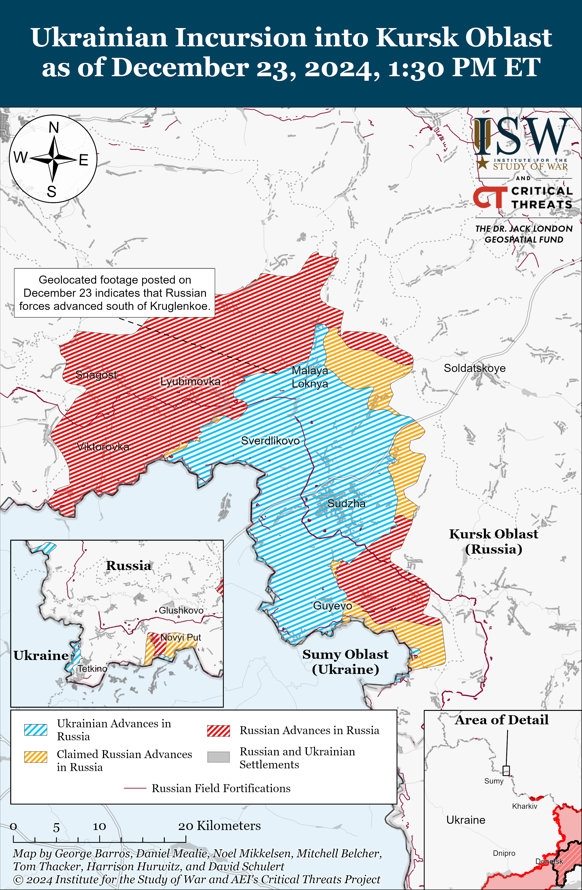](https://understandingwar.org/map/ukrainian-incursion-into-kursk-oblast-as-of-december-23-2024-130-pm-et/)

Ukraine’s Main Military Intelligence Directorate (GUR) reported on December 23 that a Russian military warehouse containing parts for Shahed-136 drones caught fire in the Alabuga Special Economic Zone (SEZ) in the Republic of Tatarstan.[48] The GUR noted that the fire destroyed 16 million dollars’ worth of fuselages, engines, navigation systems, and thermal imaging video cameras for the production of 400 Shaheds.[49] The GUR did not claim responsibility for the fire but noted that the “mysterious” fire marks another attack on the Russian defense industrial base (DIB).

Russian opposition outlet *Astra,* citing unnamed sources, reported on December 23 that four Ukrainian drones struck the Kadamovsky Training Ground in Persianovsky Novocherkassk, Rostov Oblast on the morning of December 22.[50] *Astra* noted that the Kadamovsky Training Ground is the largest training ground in Russia and that the strike caused a fire and detonations at an ammunition depot located at the training ground. *Astra* noted that the Russian 150th Motorized Rifle Division (8th Combined Arms Army [CAA], Southern Military District [SMD]) is based near the Kadamovsky Training Ground. *Astra’s* sources in Rostov Oblast’s emergency services reported that Russian forces shot down a Ukrainian missile on December 22 over a military airfield in Millerovo, Rostov Oblast, that reportedly did not result in any damage. *Astra* added that Russian forces also reportedly shot down all Ukrainian drones targeting the Novocherkasskaya Thermal Power Plant (TPP) in Rostov Oblast, and that debris damaged power lines.

**Russian Main Effort — Eastern Ukraine**

**Russian Subordinate Main Effort #1 — Kharkiv Oblast (Russian objective: Push Ukrainian forces back from the international border with Belgorod Oblast and approach to within tube artillery range of Kharkiv City)**

Russian forces continued ground attacks in the Kharkiv direction on December 23 but did not make any confirmed advances. Russian forces conducted offensive operations north of Kharkiv City near Hoptivka, Hlyboke, and Vysoka Yaruha; northeast of Kharkiv City near Starytsya and Vovchansk; and southwest of Vovchansk near Buhruvatka on December 22 and 23.[51] Ukrainian Kharkiv Group of Forces Spokesperson Lieutenant Colonel Yevheniy Romanov stated on December 23 that Russian forces are only attacking at night or under the cover of rain, snow, or fog and are only using mechanized equipment to bring assault elements up to the frontline in the Kharkiv direction, likely due to the Russian command’s concerns over armored vehicle shortages.[52] Roman Alekhin, a Russian milblogger and advisor to the Kursk Oblast Governor, accused Ukrainian forces of lying about conducting an attack solely using unmanned ground vehicles (UGVs) and first-person view (FPV) drones near Lyptsi (north of Kharkiv City) on December 22.[53] Alekhin claimed that Russian drone operators destroyed the Ukrainian UGVs but denied that the Ukrainian UGV-led assaults were successful.

[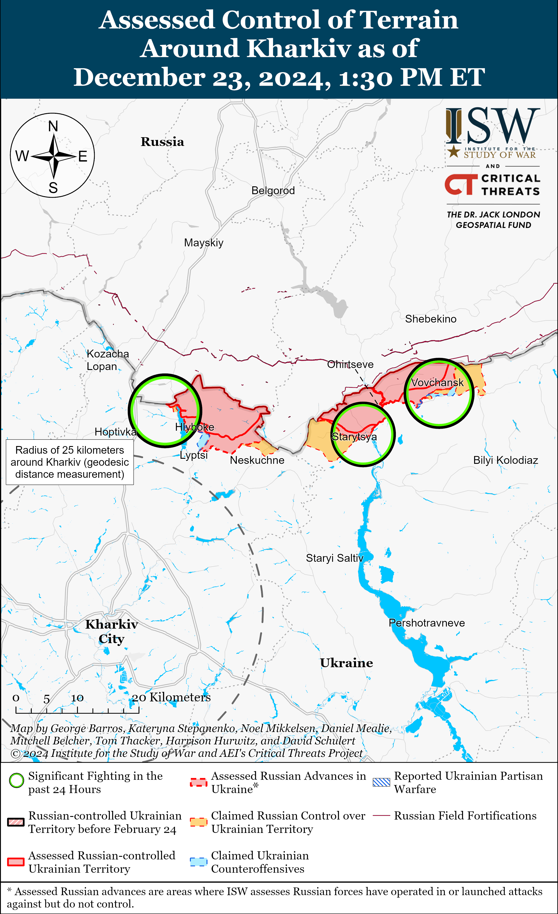](https://understandingwar.org/map/assessed-control-of-terrain-around-kharkiv-as-of-december-23-2024-130-pm-et/)

**Russian Subordinate Main Effort #2 — Luhansk Oblast (Russian objective: Capture the remainder of Luhansk Oblast and push westward into eastern Kharkiv Oblast and northern Donetsk Oblast)**

Russian forces recently advanced in the Kupyansk direction amid continued offensive operations along the Kupyansk-Svatove-Kreminna line on December 23. Geolocated footage published on December 23 indicates that Russian forces recently advanced during a reinforced platoon-sized mechanized assault along the R-79 highway in southern Zahryzove (west of Svatove).[54] A Kremlin-affiliated Russian milblogger also said that Russian forces are conducting armored assaults near Zahryzove and advancing in southern Dvorichna (northeast of Kupyansk).[55] Russian milbloggers claimed on December 22 that there are unconfirmed reports that Russian forces have entered the suburbs of Kupyansk.[56] Russian milbloggers also claimed that Russian forces are also advancing near Lozova (southeast of Kupyansk) and Zelenyi Hai (west of Svatove) towards Borova (both west of Svatove), and from Pershotravneve (west of Svatove) toward Chernyshchyna (southwest of Svatove).[57] ISW has not observed confirmation of these claims, however. Russian forces continued attacking north of Kupyansk near Kindrashivka; northeast of Kupyansk near Dvorichna; east of Kupyansk near Petropavlivka and Kucherivka; southeast of Kupyansk near Zahryzove, Kolisnykivka, Lozova, Stepova Novoselivka, and Bohuslavka; southwest of Svatove near Hrekivka, Novoyehorivka, Makiivka, Tverdokhlibove, and Novoserhiivka; west of Svatove near Nova Kruhlyakivka, Zelenyi Hai, and Nadiya; northwest of Kreminna near Ivanivka, Terny, and Druzhelyubivka; and southwest of Kreminna near Dibrova and Hryhorivka on December 22 and 23.[58] A Russian milblogger claimed on December 23 that Ukrainian forces counterattacked in northern Hlushkivka (southeast of Kupyansk).[59] A Ukrainian servicemember stated that Russian forces are using glide bombs to completely destroy Terny making it challenging for Ukrainian forces to maintain positions in the settlement and that Russian infantry are trying to gain a foothold wherever possible in the settlement.[60] Elements of the Russian 20th Combined Arms Army ([CAA], Moscow Military District [MMD]) are reportedly operating near Terny.[61]

[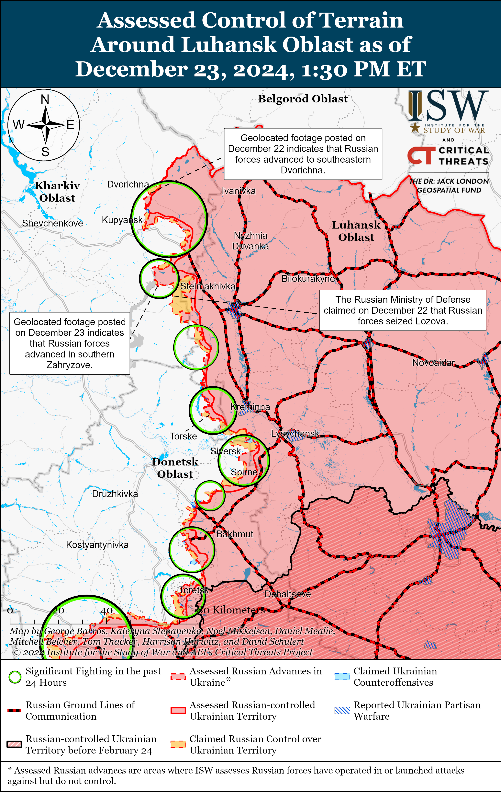](https://understandingwar.org/map/assessed-control-of-terrain-around-luhansk-oblast-as-of-december-23-2024-130-pm-et/)

**Russian Subordinate Main Effort #3 — Donetsk Oblast (Russian objective: Capture the entirety of Donetsk Oblast, the claimed territory of Russia’s proxies in Donbas)**

Russian forces conducted offensive operations northeast of Siversk near Serebryanka and Bilohorivka; east of Siversk near Verkhnokamyanske; southeast of Siversk near Vyimka and Ivano-Darivka; and southwest of Siversk near Vasyukivka on December 22 and 23 but did not advance.[62] A Ukrainian brigade operating in the Siversk direction posted footage on December 23 showing the brigade repelling a Russian platoon-sized mechanized assault in the Siversk direction.[63]

[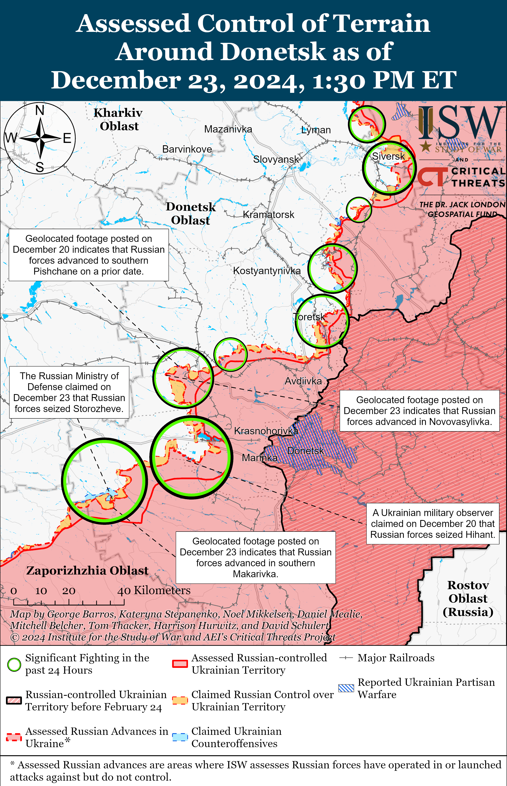](https://understandingwar.org/map/assessed-control-of-terrain-around-donetsk-as-of-december-23-2024-130-pm-et/)

Russian forces continued offensive operations in the Chasiv Yar direction on December 23 but did not make any confirmed advances. Donetsk People’s Republic (DNR) Head Denis Pushilin claimed that Russian forces seized the Pivnichnyi Microraion in northern Chasiv Yar, and Russian milbloggers claimed that Russian forces advanced to Shevchenka Street in northern Chasiv Yar, in the fields north of Chasiv Yar, and in a forested area near the Novyi Microraion in southern Chasiv Yar.[64] ISW has not observed confirmation of these claims, however. Russian forces conducted offensive operations near Chasiv Yar itself and south of Chasiv Yar near Stupochky, Bila Hora, and Predtechyne on December 22 and 23.[65] Elements of the Russian 98th Airborne (VDV) Division reportedly continue operating near the Novyi Microraion.[66]

[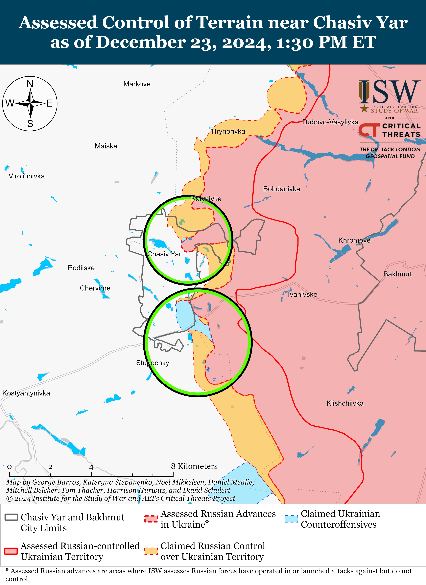](https://understandingwar.org/map/assessed-control-of-terrain-near-chasiv-yar-as-of-december-23-2024-130-pm-et/)

Russian forces recently marginally advanced in the Toretsk direction amid continued offensive operations in the area on December 23. Geolocated footage published on December 23 indicates that Russian forces recently advanced to Hrushevskoho Street in northern Toretsk.[67] Russian forces continued offensive operations near Toretsk itself; northeast of Toretsk near Dachne and Dyliivka; east of Toretsk near Druzhba; and west of Toretsk near Shcherbynivka on December 22 and 23.[68] A Russian milblogger claimed that Russian Central Military District (CMD) commander Colonel General Andrei Mordvichev recently visited Russian positions near Toretsk to listen to Russian soldier‘s complaints and promised that the Russian military command would issue previously-delayed payments to soldiers.[69] Drone operators of the Russian 346th Spetsnaz Brigade (Russian General Staff’s Main Directorate [GRU]) are reportedly identifying targets for elements of the Russian 7th Military Base (49th Combined Arms Army [CAA], Southern Military District [SMD]) near Dyliivka.[70]

[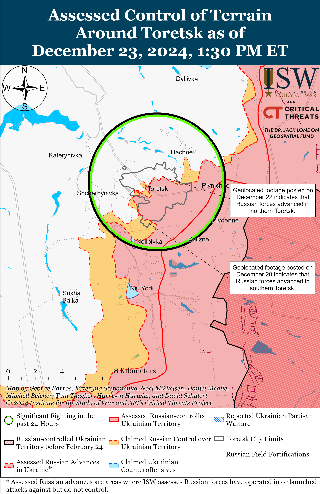](https://understandingwar.org/map/assessed-control-of-terrain-around-toretsk-as-of-december-23-2024-130-pm-et/)

*See topline text for reports of Russian advances in the Pokrovsk direction.*

Ukraine’s Khortytsia Group of Forces reported that Russian forces are conducting armored assaults in the Pokrovsk direction.[71] The commander of a Ukrainian detachment operating in the Pokrovsk direction stated that Russian forces are conducting motorized assaults in stolen civilian vehicles near Selydove, however.[72] The commander stated that Russian forces often conduct infantry assaults over the course of three days and will commit more infantry on the third day of the assault if they have not previously advanced. Russian forces continued assaults near Pokrovsk itself; east of Pokrovsk near Myrolyubivka and Promin; southeast of Pokrovsk near Lysivka; south of Pokrovsk near Dachenske, Novyi Trud, Novotroitske, Zelene, Novopustynka, and Novoukrainka; and southwest of Pokrovsk near Shevchenko, Uspenivka, Novovasylivka, Novoolenivka, and Novoyelizavetivka on December 22 and 23.[73]

Russian forces continued assaults in the Kurakhove direction on December 23 but did not make confirmed advances. Ukraine’s Khortytsia Group of Forces Spokesperson Colonel Nazar Voloshyn stated that Russian forces are no longer conducting frontal assaults in the Kurakhove direction and instead are attempting to cut off Ukrainian ground lines of communication (GLOCs) in the Toretsk, Chasiv Yar, and Kurakhove directions.[74] Donetsk People’s Republic (DNR) Head Denis Pushilin claimed on December 23 that Russian forces have pushed Ukrainian forces from central Kurakhove.[75] Ukrainian military observer Kostyantyn Mashovets stated that elements of the Russian 90th Tank Division (41st CAA, Central Military District [CMD]), including its 428th Motorized Rifle Regiment and 6th and 80th tank regiments and likely the 87th Separate Rifle Regiment (1st “Slavic” Motorized Rifle Brigade, 51st CAA) are unsuccessfully attacking in the Sontsivka-Shevchenko and Zorya-Slovyanka directions (both northwest of Kurakhove).[76] Mashovets stated that elements of the 90th Tank Division and the 5th Motorized Rifle Brigade (51st CAA) are attempting to advance from Stari Terny (northwest of Kurakhove) in the direction of Shevchenko and that elements of the 110th Motorized Rifle Brigade (51st CAA) and 150th Motorized Rifle Brigade (8th CAA, Southern Military District [SMD]) are unsuccessfully attacking the Kurakhivska Thermal Power Plant (TTP). Russian forces continued assaults near Kurakhove itself; northwest of Kurakhove near Petropavlivka, Sontsivka, Yasenove, and Stari Terny; and west of Kurakhove in the direction of Dachne and Andriivka on December 22 and 23.[77] Elements of the Russian 68th Tank Regiment (150th Motorized Rifle Division) are reportedly operating near Kurakhove.[78]

[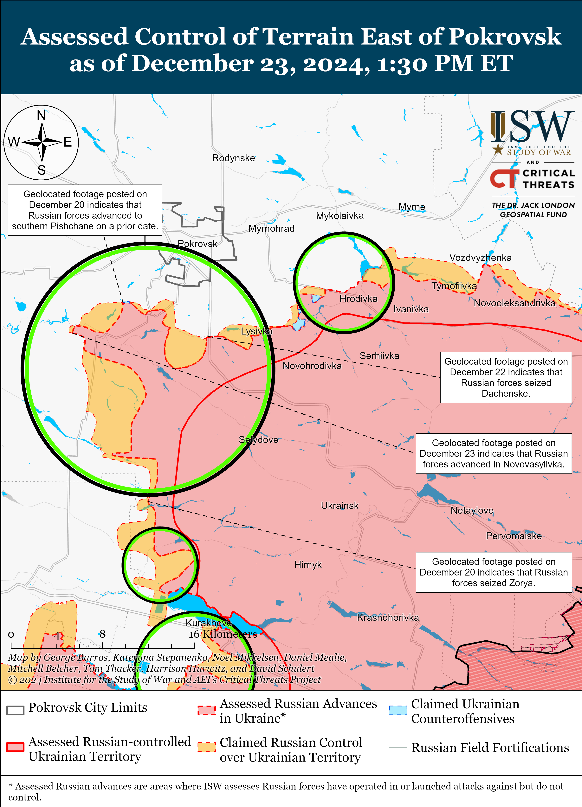](https://understandingwar.org/map/assessed-control-of-terrain-east-of-pokrovsk-as-of-december-23-2024-130-pm-et/)

Russian forces recently marginally advanced in the Vuhledar direction amid continued offensive operations in the area on December 23. Mashovets stated that Ukrainian forces nearly completely withdrew from the left (south) bank of the Sukhi Yaly River between Kostyantynopolske and Zelenivka (both northwest of Vuhledar) indicating that Russian forces likely advanced in the area.[79] Russian forces continued attacking north of Vuhledar near Uspenivka and northwest of Vuhledar near Kostyantynopil, Kostyantynopolske, Yantarne, Bahatyr, and Rozlyv on December 22 and 23.[80] Mashovets stated that elements of the Russian 255th, 33rd, and 242nd motorized rifle regiments (20th Motorized Rifle Division, 8th CAA, SMD) and 39th Motorized Rifle Brigade (68th AC, Eastern Military District [EMD]) are operating along the Sukhi Yaly River.[81]

Russian forces recently advanced in the Velyka Novosilka area amid continued offensive operations in the area on December 23. Geolocated footage published on December 23 indicates that Russian forces recently advanced in southern Makarivka (south of Velyka Novosilka).[82] The Russian Ministry of Defense (MoD) and other Russian sources claimed on December 23 that Russian forces seized Storozheve (south of Velyka Novosilka).[83] Russian milbloggers claimed that elements of the Russian 60th Motorized Rifle Brigade (5th CAA, EMD) participated in the seizure of Makarivka and Storozheve (both south of Velyka Novosilka).[84] A Russian milblogger claimed that Russian forces are fewer than 500 meters from the O-0510 Velyka Novosilka-Hulyaipole highway west of Neskuchne (south of Velyka Novosilka).[85] ISW has not observed visual confirmation of these claims, however. Ukraine’s Khortytsia Group of Forces denied media reports that Russian forces encircled Ukrainian forces in Makarivka and stated that Ukrainian forces are continuing to defend in the area.[86] Russian forces continued attacking near Velyka Novosilka itself; north of Velyka Novosilka near Novyi Komar; northeast of Velyka Novosilka near Rozdolne; south of Velyka Novosilka near Blahodatne, Storozheve, and Makarivka; and southwest of Velyka Novosilka near Novodarivka on December 22 and 23.[87]

[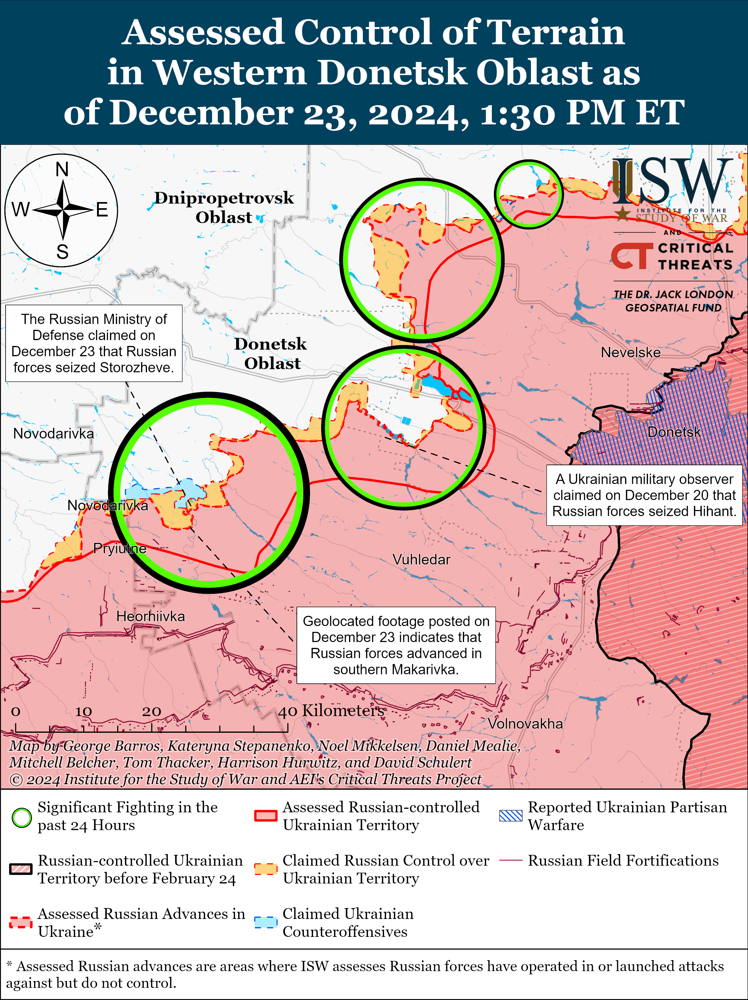](https://understandingwar.org/map/assessed-control-of-terrain-in-western-donetsk-oblast-as-of-december-23-2024-130-pm-et/)

**Russian Supporting Effort — Southern Axis (Russian objective: Maintain frontline positions and secure rear areas against Ukrainian strikes)**

Russian forces continued offensive operations in western Zaporizhia on December 23 but did not make any confirmed advances. Russian milbloggers claimed that Russian forces pushed Ukrainian forces to the southern part of Kamyanske (northwest of Robotyne and south of Zaporizhzhia City) and advanced near Nesteryanka (northwest of Robotyne), although ISW has not observed confirmation of this claim.[88] Russian forces continued attacking northwest of Robotyne near Novoandriivka (northwest of Robotyne) and Nesteryanka on December 22 and 23.[89] Russian sources claimed that Ukrainian forces counterattacked near Kamyanske.[90] A Russian milblogger claimed that fighting is ongoing on the outskirts of Luhove (northwest of Robotyne).[91]

[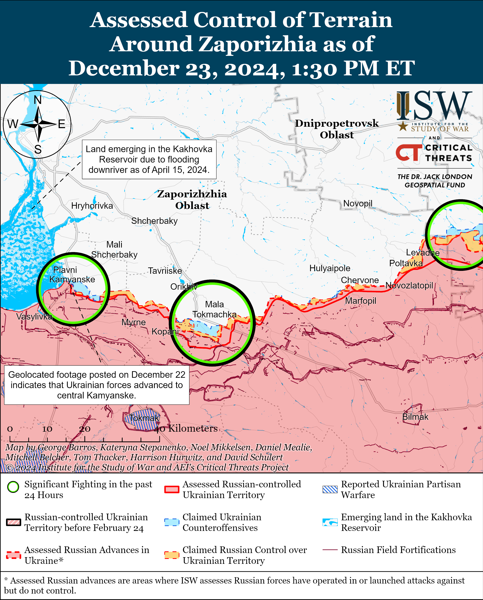](https://understandingwar.org/map/assessed-control-of-terrain-around-zaporizhia-as-of-december-23-2024-130-pm-et/)

Russian forces continued offensive operations in the Dnipro direction and on the islands in the Dnipro River Delta on December 22 and 23 but did not make any confirmed advances.[92] Ukrainian Southern Group of Forces Spokesperson Colonel Vladyslav Voloshyn stated on December 23 that Russian forces continue attempts to land on the islands in the Dnipro River Delta and on the west (right) bank of the Dnipro River in squads of up to 10 personnel.[93] Voloshyn added that the Ukrainian military has not observed any indications that Russian forces are concentrating the forces and materiel needed to conduct an assault on the west bank of the Dnipro River.[94] Ukrainian outlet *RBC-Ukraine* reported on December 23 that an unspecified source assessed that the Russian military is more prepared to attack west bank Kherson Oblast than to activate in the Zaporizhia direction and that Russian Airborne Forces and “Dnepr” Grouping of Forces Commander Colonel General Mikhail Teplinsky is planning to attack west bank Kherson Oblast with up to 4,000 troops, including elements of the 61st Naval Infantry Brigade (Leningrad Military District [LMD], formerly Northern Fleet) and 7th VDV Division, in the near future.[95] ISW cannot independently confirm any of these statements, however. Elements of the Russian 81st Self-Propelled Artillery Regiment (70th Motorized Rifle Division, 18th Combined Arms Army [CAA], Southern Military District [SMD]) are reportedly operating in the Kherson direction.[96]

[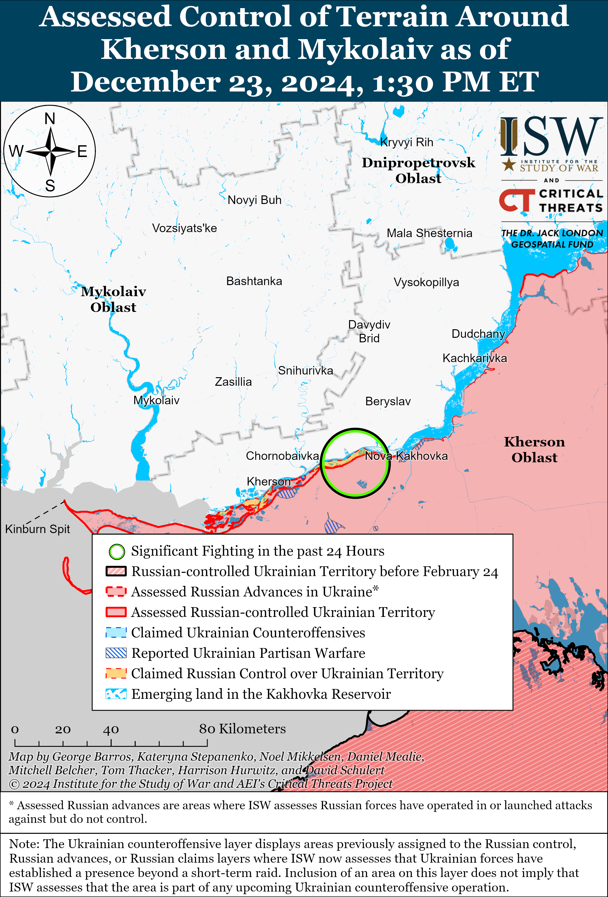](https://understandingwar.org/map/assessed-control-of-terrain-around-kherson-and-mykolaiv-as-of-december-23-2024-130-pm-et/)

The Russian Ministry of Defense (MoD) claimed that Russian forces downed three Ukrainian drones over occupied Crimea during the day on December 23.[97]

**Russian Air, Missile, and Drone Campaign (Russian Objective: Target Ukrainian military and civilian infrastructure in the rear and on the frontline)**

Russian forces launched a series of drones strikes against Ukraine throughout December 22 and overnight on December 23. The Ukrainian Air Force reported that Russian forces launched 72 Shahed and other unspecified drones from Bryansk and Oryol oblasts directions between 1000 local time on December 22 and 0900 local time on December 23.[98] The Ukrainian Air Force reported that Ukrainian forces shot down 47 Shaheds and other drones over Poltava, Sumy, Kharkiv, Kyiv, Chernihiv, Cherkasy, Zhytomir, Khmelnytskyi, and Odesa oblasts as of 0900 local time on December 23, and that Russian drone strikes damaged private enterprises and residential infrastructure in Kyiv and Khmelnytskyi oblasts. The Ukrainian Air Force added that 25 drones that imitate Shaheds were “locally lost” and did not cause any damage. The Ukrainian Southern Operational Command reported that Ukrainian forces shot down three Shahed-136 drones over southern Ukraine.[99]

**Russian Mobilization and Force Generation Efforts (Russian objective: Expand combat power without conducting general mobilization)**

The Kremlin’s “Time of Heroes” program, which aims to appoint Russian veterans into government positions, is already causing conflict between veterans and corrupt regional officials. Russian opposition outlet *Astra* reported that Kirov Oblast officials are trying to transfer Sontsovka Mayor Nikita Gorelov to the frontlines following his appointment as mayor in October 2024 via the “Time of Heroes” program.[100] Gorelov stated in an appeal to Kirov Oblast Governor Aleksandr Sokolov that he received an order to return to the frontlines after he commented on corruption in the Sontsovka city administration.[101] Gorelov called on Sontsovka residents to protest on December 24, and residents started a petition in his support.[102] A Kremlin-affiliated milblogger commented on the situation, noting that the scandal is discrediting the “Time of Heroes” program in Kirov Oblast and the opportunities available for veterans’ social mobility.[103] The milblogger criticized Kirov Oblast officials for fooling themselves by appointing a veteran only to appease the Kremlin, while simultaneously denouncing Gorelov as a junior sergeant without any political experience and awareness of frictions within political factions.

Relatives of the Russian 11th Tank Regiment (18th Motorized Rifle Division, 11th Army Corps, Leningrad Military District [LMD]) recorded a joint appeal for Russian President Vladimir Putin and Defense Minister Andrey Belousov, asking them to stop committing Russian servicemen to endless assaults in the Kharkiv direction.[104] The relatives described Russian assaults near Vovchansk and Hlyboke (northeast and north of Kharkiv City, respectively) as a “conveyer belt of death” given that the Russian military command continues to commit untrained new recruits into small group assaults with small arms. The relatives also complained that the Russian military command is refusing to evacuate wounded personnel.

Russian defense officials announced plans to expand Russian higher military education during the plenary meeting of the Public Council of the Russian Ministry of Defense (MoD) on December 23.[105] Deputy Head of the Russian MoD’s Main Personnel Directorate Major General Igor Muravlyannikov stated that the Russian MoD will try to expand the MoD’s network of military-educational facilities and class sizes at the facilities to accommodate for the expansion of the Russian military. The announcement follows shortly after Putin highlighted Russia’s shortage of military-educational facilities during his Direct Line televised press conference on December 19.[106]

The Russian Investigative Committee (Sledkom) opened a case on December 23 against Head of the Russian MoD’s Central Housing and Utilities Department Olga Burlakova on suspicion of corruption in the amount of 27 million rubles ($266,738).[107]

**Russian Technological Adaptations (Russian objective: Introduce technological innovations to optimize systems for use in Ukraine)**

General Director of the Russian joint-stock arms manufacturing company Kalashnikov Concern, Alan Lushnikov, announced on December 22 that the company developed the new “Kub-10Ye” strike drone with a range and combat power that reportedly “significantly exceeds” previous models.[108] Lushnikov claimed that the “Kub-10Ye” is designed to destroy unarmored military equipment and armored personnel carriers, command posts, air defense and missile defense systems, electronic reconnaissance and electronic warfare (EW) systems, and rear support facilities. Lushnikov added that Russian forces can launch the “Kub-10Ye” drones from a catapult and that the drone has a cruising speed of up to 100 kilometers per hour and an altitude of 100 meters to 2,500 meters.

**Activities in Russian-occupied areas (Russian objective: Consolidate administrative control of annexed areas; forcibly integrate Ukrainian citizens into Russian sociocultural, economic, military, and governance systems)**

*ISW is not publishing coverage of activities in Russian-occupied areas today.*

**Significant activity in Belarus (Russian efforts to increase its military presence in Belarus and further integrate Belarus into Russian-favorable frameworks)**

Belarusian President Alexander Lukashenko met with Moscow Mayor Sergei Sobyanin in Minsk to discuss the construction of high-speed highways between Minsk and Brest and joint vehicle manufacturing.[109] Lukashenko later held a meeting on vehicle manufacturing in Belarus during which he noted that Belarus and Russia agreed to synchronize their machine building efforts and noted that he will meet with Russian President Vladimir Putin on an unspecified future date.[110] Belarusian Minister of Industry Alexander Efimov suggested that the next meeting between Putin and Lukashenko will address import substitution.[111]

The Belarusian Central Election Commission (CEC) announced on December 23 that Lukashenko registered as a candidate for the 2025 Belarusian presidential elections.[112]

**Note: ISW does not receive any classified material from any source, uses only publicly available information, and draws extensively on Russian, Ukrainian, and Western reporting and social media as well as commercially available satellite imagery and other geospatial data as the basis for these reports. References to all sources used are provided in the endnotes of each update.**

[1] https://t.me/creamy\_caprice/7898; https://t.me/assaultbattalion33/125 ; https://t.me/voenkorKotenok/60948

[2] https://t.me/rybar/66573

[3] https://understandingwar.org/backgrounder/ukrainian-defense-pokrovsk-has-compelled-russia-change-its-approach-eastern-ukraine

[4] https://understandingwar.org/backgrounder/russian-offensive-campaign-assessment-december-19-2024

[5] https://understandingwar.org/backgrounder/russia-ukraine-warning-update-russia-likely-pursue-phased-invasion-unoccupied-ukrainian ; https://isw.pub/UkrWar033023

[6] https://t.me/zvizdecmanhustu/2440 ; https://t.me/zvizdecmanhustu/2439

[7] https://t.me/zvizdecmanhustu/2439

[8] https://understandingwar.org/backgrounder/russian-offensive-campaign-assessment-october-19-2024 ; https://understandingwar.org/backgrounder/russian-offensive-campaign-assessment-october-27-2024 ; https://understandingwar.org/backgrounder/russian-offensive-campaign-assessment-october-30-2024 ; https://understandingwar.org/backgrounder/ukrainian-defense-pokrovsk-has-compelled-russia-change-its-approach-eastern-ukraine

[9] https://t.me/zvizdecmanhustu/2441

[10] https://isw.pub/UkrWar031324 ; https://understandingwar.org/backgrounder/russian-offensive-campaign-assessment-march-31-2024 ; https://understandingwar.org/backgrounder/russian-offensive-campaign-assessment-august-1-2024 ; https://isw.pub/UkrWar072624

[11] https://isw.pub/UkrWar121124

[12] https://understandingwar.org/backgrounder/ukrainian-defense-pokrovsk-has-compelled-russia-change-its-approach-eastern-ukraine

[13] https://understandingwar.org/backgrounder/russian-offensive-campaign-assessment-december-21-2024

[14] https://docs.google.com/spreadsheets/d/1FnfGcdqah5Et\_6wElhiFfoDxEzxczh7AP2ovjEFV010/edit?gid=0#gid=0 ; https://x.com/Jonpy99/status/1870922407625802232

[15] https://understandingwar.org/backgrounder/russian-offensive-campaign-assessment-november-3-2024 ; https://understandingwar.org/backgrounder/russian-offensive-campaign-assessment-december-15-2024 ; https://understandingwar.org/backgrounder/russian-offensive-campaign-assessment-october-19-2024

[16] https://t.me/V\_Zelenskiy\_official/12804 ; https://isw.pub/UkrWar102424

[17] https://en.yna.co dot kr/view/AEN20241223002700315 ; https://www.cbsnews.com/news/over-1000-north-korean-casualties-in-russia-ukraine-war-seoul-says/

[18] https://armyinform dot com.ua/2024/12/22/imperiya-brehni-rosiyany-zapysuyut-u-dokumenty-pivnichnokorejcziv-yak-tuvyncziv/; https://t.me/ukr\_sof/1315 ; https://suspilne dot media/908629-rosia-vidae-soldatam-kndr-pidrobleni-dokumenti-sso/

[19] https://armyinform.dot com.ua/2024/12/23/dno-internaczional-poloneni-na-kurshhyni-alimentshhyk-ta-nelegal-rozpovily-yak-voyuyetsya-razom-z-pivnichnokorejczyamy/; https://t.me/brigade80/760

[20] https://isw.pub/UkrWar121524

[21] https://armyinform.dot com.ua/2024/12/23/dno-internaczional-poloneni-na-kurshhyni-alimentshhyk-ta-nelegal-rozpovily-yak-voyuyetsya-razom-z-pivnichnokorejczyamy/; https://t.me/brigade80/760

[22] https://www.nytimes.com/2024/12/23/us/politics/russia-ukraine-north-korea.html

[23] https://www.wsj.com/world/russia-north-korea-weapons-shipment-676d7f52

[24] https://main.un.org/securitycouncil/en/sanctions/1718/supply-sale-or-transfer-of-all-refined-petroleum

[25] https://www.reuters.com/markets/commodities/russian-president-meets-slovak-pm-ukraine-gas-transit-contract-nears-expiry-2024-12-22/

[26] https://t.me/tass\_agency/292748; https://t.me/tass\_agency/292764; https://t.me/tass\_agency/292847 ; https://t.me/tass\_agency/292848 ; https://t.me/tass\_agency/292851; https://www.reuters.com/markets/commodities/russian-president-meets-slovak-pm-ukraine-gas-transit-contract-nears-expiry-2024-12-22/

[27] https://t.me/tass\_agency/292764

[28] https://understandingwar.org/wp-content/uploads/2024/12/Putin27s20Offset20The20Kremlin27s20Geopolitical20Adaptations20Since202014.pdf

[29] https://tass dot ru/politika/22747621

[30] https://russian dot rt.com/world/news/1413213-es-ne-znaet-kak-uspokoit-sandu

[31] https://t.me/rusich\_army/19549

[32] https://agerpres dot ro/politic-extern/2024/12/23/republica-moldova-neaga-acuzatiile-rusiei-ca-ar-pregati-o-operatiune-militara-in-transnistria–1407414

[33] https://agerpres dot ro/politic-extern/2024/12/23/republica-moldova-neaga-acuzatiile-rusiei-ca-ar-pregati-o-operatiune-militara-in-transnistria–1407414

[34] https://understandingwar.org/backgrounder/russia-poses-long-term-threats-moldova%E2%80%99s-european-integration-beyond-october-elections; https://understandingwar.org/backgrounder/nord-stream-2-poses-long-term-national-security-challenge-us-and-its-allies

[35] https://t.me/DIUkraine/5075 ; https://gur.gov dot ua/content/ne-doplyvly-sudno-dlia-vyvezennia-rosiiskykh-viisk-z-syrii-zlamalos-u-vidkrytomu-mori.html

[36] https://understandingwar.org/backgrounder/iran-update-december-18-2024

[37] https://t.me/damascusv011/26832; https://x.com/AlArabiya\_SY/status/1869370349407609098

[38] https://t.me/DIUkraine/5075 ; https://gur.gov dot ua/content/ne-doplyvly-sudno-dlia-vyvezennia-rosiiskykh-viisk-z-syrii-zlamalos-u-vidkrytomu-mori.html

[39] https://t.me/DIUkraine/5075 ; https://gur.gov dot ua/content/ne-doplyvly-sudno-dlia-vyvezennia-rosiiskykh-viisk-z-syrii-zlamalos-u-vidkrytomu-mori.html

[40] https://t.me/tass\_agency/292910

[41] https://armyinform dot com.ua/2024/12/23/po-2-patriot-ta-iris-t-15-leopard-i-shhe-bagato-vsogo-chergovyj-paket-nimeczkoyi-dopomogy-ukrayini/; https://www.bundesregierung dot de/breg-de/aktuelles/lieferungen-ukraine-2054514; https://suspilne dot media/909125-iris-t-patriot-leopard-gepard-nimeccina-peredala-ukraini-novij-paket-dopomogi/

[42] https://www.linkedin.com/posts/dpa-mod-ukraine\_the-defense-procurement-agency-of-ukraines-activity-7275792040590729217-SYVX/ ; https://www.facebook.com/story.php?story\_fbid=122152017140326602&id=61559798071828&mibextid=wwXIfr&rdid=djcPUVoGwDxQ8Mxv

[43] https://x.com/blinzka/status/1871158190844346481; https://x.com/bayraktar\_1love/status/1871133201176945143; https://t.me/ua\_dshv/4541; https://t.me/creamy\_caprice/7899; https://armyinform dot com.ua/2024/12/23/nyshhat-na-hodu-nashi-desantnyky-na-kurshhyni-vidbyly-chergovyj-shtrum/

[44] https://t.me/dva\_majors/60882; https://t.me/wargonzo/23911; https://t.me/RVvoenkor/83233

[45] https://t.me/rusich\_army/19541

[46] https://t.me/dva\_majors/60882; https://t.me/rusich\_army/19541

[47] https://t.me/DnevnikDesantnika/21372; https://armyinform dot com.ua/2024/12/23/s-takym-komand%d1%8bvanyem-luchshe-sest-vczilili-vorogy-blagayut-rejndzheriv-vzyaty-yih-v-polon/; https://t.me/ukr\_sof/1323

[48] https://armyinform dot com.ua/2024/12/23/v-krayini-agresori-zgorila-zona-z-shahedamy-gur/; https://gur.gov dot ua/content/na-rosii-znyshcheno-sklad-iz-detaliamy-do-shakhediv-na-16-milioniv.html ; https://t.me/DIUkraine/5074

[49] https://armyinform dot com.ua/2024/12/23/v-krayini-agresori-zgorila-zona-z-shahedamy-gur/; https://gur.gov dot ua/content/na-rosii-znyshcheno-sklad-iz-detaliamy-do-shakhediv-na-16-milioniv.html ; https://t.me/DIUkraine/5074

[50] https://t.me/astrapress/70901

[51] https://www.facebook.com/GeneralStaff.ua/posts/pfbid02uadNEFvtLM1HFHuvNBDEQjP5AtWrqP6fscMLBLTjRp691CXg9cKzcP4XPVkDKxCil; https://www.facebook.com/GeneralStaff.ua/posts/pfbid0qJHTmNvSpD7Wu2LghoWJnLXgCU4Yw1NgdkVY37z1mrdeq94aD5rxAzWJZKBaCaD1l; https://www.facebook.com/GeneralStaff.ua/posts/pfbid022TFBVyyLUUv5hiCtrwZ6Yjpo6MK2ZpQLNgQgaboUBZvBwPK9PnfgGkhGkQm553L2l; https://t.me/Khortytsky\_wind/3667; https://t.me/otukharkiv/3206

[52] https://armyinform dot com.ua/2024/12/23/kolonamy-davno-ne-sunut-na-harkivskomu-napryamku-mehanizovani-ataky-rosiyan-ridkist/; https://www.youtube.com/watch?v=j5TqaWCCdUg; https://understandingwar.org/backgrounder/russian-offensive-campaign-assessment-october-6-2024

[53] https://t.me/dva\_majors/60874; https://t.me/Alekhin\_Telega/12600; https://t.me/dva\_majors/60933 ; https://t.me/Alekhin\_Telega/12606; https://understandingwar.org/backgrounder/russian-offensive-campaign-assessment-december-20-2024

[54] https://t.me/oaembr77/672; https://t.me/creamy\_caprice/7900

[55] https://t.me/rybar/66577

[56] https://t.me/dva\_majors/60872

[57] https://t.me/voenkorKotenok/60922

[58] https://www.facebook.com/GeneralStaff.ua/posts/pfbid02uadNEFvtLM1HFHuvNBDEQjP5AtWrqP6fscMLBLTjRp691CXg9cKzcP4XPVkDKxCil; https://www.facebook.com/GeneralStaff.ua/posts/pfbid0qJHTmNvSpD7Wu2LghoWJnLXgCU4Yw1NgdkVY37z1mrdeq94aD5rxAzWJZKBaCaD1l; https://www.facebook.com/GeneralStaff.ua/posts/pfbid022TFBVyyLUUv5hiCtrwZ6Yjpo6MK2ZpQLNgQgaboUBZvBwPK9PnfgGkhGkQm553L2l; https://t.me/Khortytsky\_wind/3667; https://t.me/motopatriot/30752; https://t.me/dva\_majors/60882; https://t.me/voenkorKotenok/60922; https://t.me/Sladkov\_plus/12099; https://www.facebook.com/GeneralStaff.ua/posts/pfbid02uadNEFvtLM1HFHuvNBDEQjP5AtWrqP6fscMLBLTjRp691CXg9cKzcP4XPVkDKxCil; https://www.facebook.com/GeneralStaff.ua/posts/pfbid0qJHTmNvSpD7Wu2LghoWJnLXgCU4Yw1NgdkVY37z1mrdeq94aD5rxAzWJZKBaCaD1l; https://www.facebook.com/GeneralStaff.ua/posts/pfbid022TFBVyyLUUv5hiCtrwZ6Yjpo6MK2ZpQLNgQgaboUBZvBwPK9PnfgGkhGkQm553L2l; https://t.me/Khortytsky\_wind/3667

[59] https://t.me/boris\_rozhin/148885

[60] https://t.me/officer\_alex33/4520 ; https://t.me/RVvoenkor/83238

[61] https://t.me/vysokygovorit/18359

[62] https://www.facebook.com/GeneralStaff.ua/posts/pfbid02uadNEFvtLM1HFHuvNBDEQjP5AtWrqP6fscMLBLTjRp691CXg9cKzcP4XPVkDKxCil; https://www.facebook.com/GeneralStaff.ua/posts/pfbid0qJHTmNvSpD7Wu2LghoWJnLXgCU4Yw1NgdkVY37z1mrdeq94aD5rxAzWJZKBaCaD1l; https://www.facebook.com/GeneralStaff.ua/posts/pfbid022TFBVyyLUUv5hiCtrwZ6Yjpo6MK2ZpQLNgQgaboUBZvBwPK9PnfgGkhGkQm553L2l; https://t.me/Khortytsky\_wind/3667

[63] https://armyinform dot com.ua/2024/12/23/hotily-do-srsr-potrapyly-u-peklo-teroboronczi-zupynyly-shturm-popadancziv/; https://t.me/ssternenko/37834

[64] https://t.me/tass\_agency/292825 ; https://t.me/RVvoenkor/83210; https://t.me/motopatriot/30771 ; https://t.me/DnevnikDesantnika/21372

[65] https://www.facebook.com/GeneralStaff.ua/posts/pfbid02uadNEFvtLM1HFHuvNBDEQjP5AtWrqP6fscMLBLTjRp691CXg9cKzcP4XPVkDKxCil; https://www.facebook.com/GeneralStaff.ua/posts/pfbid0qJHTmNvSpD7Wu2LghoWJnLXgCU4Yw1NgdkVY37z1mrdeq94aD5rxAzWJZKBaCaD1l; https://www.facebook.com/GeneralStaff.ua/posts/pfbid022TFBVyyLUUv5hiCtrwZ6Yjpo6MK2ZpQLNgQgaboUBZvBwPK9PnfgGkhGkQm553L2l; https://t.me/Khortytsky\_wind/3667; https://t.me/wargonzo/23911

[66] https://t.me/motopatriot/30751; https://t.me/motopatriot/30771 ; https://t.me/DnevnikDesantnika/21372

[67] https://x.com/AudaxonX/status/1871136601457496246; https://x.com/AudaxonX/status/1871136481525571612; https://www.instagram.com/stories/asp.kr/3529027563569661466/; https://www.instagram.com/stories/asp.kr/3529029951001070117/; https://www.instagram.com/stories/asp.kr/3529030512677162963/

[68] https://www.facebook.com/GeneralStaff.ua/posts/pfbid02uadNEFvtLM1HFHuvNBDEQjP5AtWrqP6fscMLBLTjRp691CXg9cKzcP4XPVkDKxCil; https://www.facebook.com/GeneralStaff.ua/posts/pfbid0qJHTmNvSpD7Wu2LghoWJnLXgCU4Yw1NgdkVY37z1mrdeq94aD5rxAzWJZKBaCaD1l; https://www.facebook.com/GeneralStaff.ua/posts/pfbid022TFBVyyLUUv5hiCtrwZ6Yjpo6MK2ZpQLNgQgaboUBZvBwPK9PnfgGkhGkQm553L2l; https://t.me/Khortytsky\_wind/3667

[69] https://t.me/dva\_majors/60911

[70] https://t.me/nm\_dnr/13146

[71] https://t.me/Khortytsky\_wind/3667

[72] https://armyinform dot com.ua/2024/12/23/myasom-i-na-kradenyh-zhygulyah-rozvidnyk-kpd-rozpoviv-yak-atakuye-vorog-pid-pokrovskom/

[73] https://www.facebook.com/GeneralStaff.ua/posts/pfbid02uadNEFvtLM1HFHuvNBDEQjP5AtWrqP6fscMLBLTjRp691CXg9cKzcP4XPVkDKxCil ; https://www.facebook.com/GeneralStaff.ua/posts/pfbid0qJHTmNvSpD7Wu2LghoWJnLXgCU4Yw1NgdkVY37z1mrdeq94aD5rxAzWJZKBaCaD1l ; https://www.facebook.com/GeneralStaff.ua/posts/pfbid022TFBVyyLUUv5hiCtrwZ6Yjpo6MK2ZpQLNgQgaboUBZvBwPK9PnfgGkhGkQm553L2l

[74] https://armyinform dot com.ua/2024/12/23/shturmy-zhyvymy-minamy-okupanty-polyubyly-taktyku-dzhyhadystiv/; https://www.youtube.com/watch?v=j5TqaWCCdUg

[75] https://t.me/tass\_agency/292751

[76] https://t.me/zvizdecmanhustu/2441

[77] https://www.facebook.com/GeneralStaff.ua/posts/pfbid02uadNEFvtLM1HFHuvNBDEQjP5AtWrqP6fscMLBLTjRp691CXg9cKzcP4XPVkDKxCil ; https://www.facebook.com/GeneralStaff.ua/posts/pfbid0qJHTmNvSpD7Wu2LghoWJnLXgCU4Yw1NgdkVY37z1mrdeq94aD5rxAzWJZKBaCaD1l ; https://www.facebook.com/GeneralStaff.ua/posts/pfbid022TFBVyyLUUv5hiCtrwZ6Yjpo6MK2ZpQLNgQgaboUBZvBwPK9PnfgGkhGkQm553L2l ; https://t.me/Khortytsky\_wind/3667

[78] https://t.me/RVvoenkor/83194

[79] https://t.me/zvizdecmanhustu/2442

[80] https://t.me/Khortytsky\_wind/3667 ; https://www.facebook.com/GeneralStaff.ua/posts/pfbid02uadNEFvtLM1HFHuvNBDEQjP5AtWrqP6fscMLBLTjRp691CXg9cKzcP4XPVkDKxCil ; https://www.facebook.com/GeneralStaff.ua/posts/pfbid0qJHTmNvSpD7Wu2LghoWJnLXgCU4Yw1NgdkVY37z1mrdeq94aD5rxAzWJZKBaCaD1l ; https://www.facebook.com/GeneralStaff.ua/posts/pfbid022TFBVyyLUUv5hiCtrwZ6Yjpo6MK2ZpQLNgQgaboUBZvBwPK9PnfgGkhGkQm553L2l

[81] https://t.me/zvizdecmanhustu/2441

[82] https://t.me/voin\_dv/12429; https://t.me/creamy\_caprice/7902

[83] https://t.me/mod\_russia/47181 ; https://t.me/DnevnikDesantnika/21403; https://t.me/motopatriot/30756; https://t.me/tass\_agency/292800

[84] https://t.me/voin\_dv/12418 ; https://t.me/voin\_dv/12429 ; https://t.me/dva\_majors/60878 ; https://t.me/dva\_majors/60882 ; https://t.me/voenkorKotenok/60926 ; https://t.me/voenkorKotenok/60927

[85] https://t.me/voenkorKotenok/60927

[86] https://t.me/Khortytsky\_wind/3686

[87] https://t.me/Khortytsky\_wind/3667 ; https://www.facebook.com/GeneralStaff.ua/posts/pfbid02uadNEFvtLM1HFHuvNBDEQjP5AtWrqP6fscMLBLTjRp691CXg9cKzcP4XPVkDKxCil ; https://www.facebook.com/GeneralStaff.ua/posts/pfbid0qJHTmNvSpD7Wu2LghoWJnLXgCU4Yw1NgdkVY37z1mrdeq94aD5rxAzWJZKBaCaD1l ; https://www.facebook.com/GeneralStaff.ua/posts/pfbid022TFBVyyLUUv5hiCtrwZ6Yjpo6MK2ZpQLNgQgaboUBZvBwPK9PnfgGkhGkQm553L2l

[88] ttps://t.me/dva\_majors/60882 ; https://t.me/rybar/66572

[89] https://www.facebook.com/GeneralStaff.ua/posts/pfbid0qJHTmNvSpD7Wu2LghoWJnLXgCU4Yw1NgdkVY37z1mrdeq94aD5rxAzWJZKBaCaD1l ; https://www.facebook.com/GeneralStaff.ua/posts/pfbid022TFBVyyLUUv5hiCtrwZ6Yjpo6MK2ZpQLNgQgaboUBZvBwPK9PnfgGkhGkQm553L2l ; https://t.me/dva\_majors/60882

[90] https://t.me/tass\_agency/292806 ; https://t.me/rybar/66572

[91] https://t.me/DnevnikDesantnika/21406

[92] https://t.me/SJTF\_Odes/11891 ; https://www.facebook.com/GeneralStaff.ua/posts/pfbid0qJHTmNvSpD7Wu2LghoWJnLXgCU4Yw1NgdkVY37z1mrdeq94aD5rxAzWJZKBaCaD1l ; https://www.facebook.com/GeneralStaff.ua/posts/pfbid022TFBVyyLUUv5hiCtrwZ6Yjpo6MK2ZpQLNgQgaboUBZvBwPK9PnfgGkhGkQm553L2l

[93] https://armyinform dot com.ua/2024/12/23/shturmy-v-pidtrymku-rakiv-bilya-dniprovskyh-ostroviv-chlenystonogi-gotovi-benketuvaty-rosiyanamy/; https://www.youtube.com/watch?v=aDXWlQ2K0dM

[94] https://suspilne dot media/kherson/908893-prihovati-taki-sili-nemozlivo-volosin-pro-situaciu-na-pridniprovskomu-napramku/

[95] https://www.rbc dot ua/ukr/news/nastup-herson-ta-zaporizkiy-oblasti-shcho-1734937748.html

[96] https://t.me/dva\_majors/60867

[97] https://t.me/mod\_russia/47195

[98] https://t.me/kpszsu/25384

[99] https://t.me/SJTF\_Odes/11892

[100] https://t.me/astrapress/70865

[101] https://t.me/astrapress/70865

[102] https://t.me/horizontal\_russia/42687; https://www.change.org/p/%D0%B2-%D0%B7%D0%B0%D1%89%D0%B8%D1%82%D1%83-%D1%83%D1%87%D0%B0%D1%81%D1%82%D0%BD%D0%B8%D0%BA%D0%B0-%D1%81%D0%B2%D0%BE-%D0%BD%D1%8B%D0%BD%D0%B5-%D0%B3%D0%BB%D0%B0%D0%B2%D1%8B-%D0%B3-%D1%81%D0%BE%D1%81%D0%BD%D0%BE%D0%B2%D0%BA%D0%B0?source\_location=petitions\_browse

[103] https://t.me/rybar/66574

[104] https://t.me/mobilizationnews/21464

[105] https://t.me/mod\_russia/47198

[106] https://understandingwar.org/backgrounder/russian-offensive-campaign-assessment-december-19-2024

[107] https://t.me/tass\_agency/292898

[108] https://tass dot ru/armiya-i-opk/22746319

[109] https://president dot gov.by/ru/events/vstreca-s-merom-moskvy-sergeem-sobaninym

[110] https://t.me/belta\_telegramm/285709; http://belta dot by/president/view/nuzhno-videt-rynki-lukashenko-o-planah-po-proizvodstvu-legkovyh-avtomobilej-684766-2024/; https://belta dot by/president/view/lukashenko-anonsiroval-skoruju-vstrechu-s-putinym-i-vizit-v-kitaj-684758-2024/; https://t.me/belta\_telegramm/285706

[111] https://belta dot by/society/view/realizatsija-novogo-etapa-v-importozameschenii-mozhet-stat-odnoj-iz-tem-vstrechi-lukashenko-i-putina-684791-2024/; https://t.me/belta\_telegramm/285720

[112] https://t.me/tass\_agency/292845 ; https://t.me/pul\_1/14908; https://t.me/belta\_telegramm/285694
