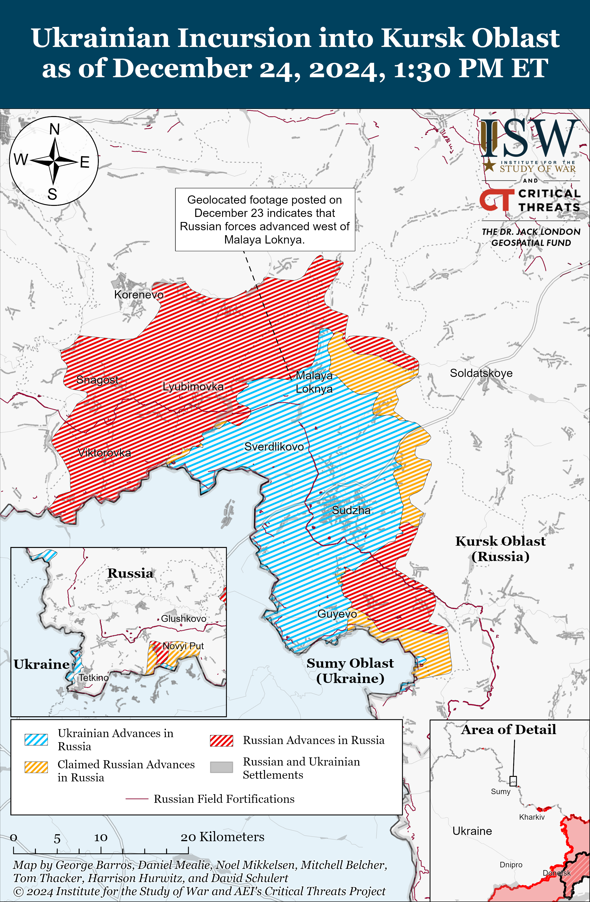
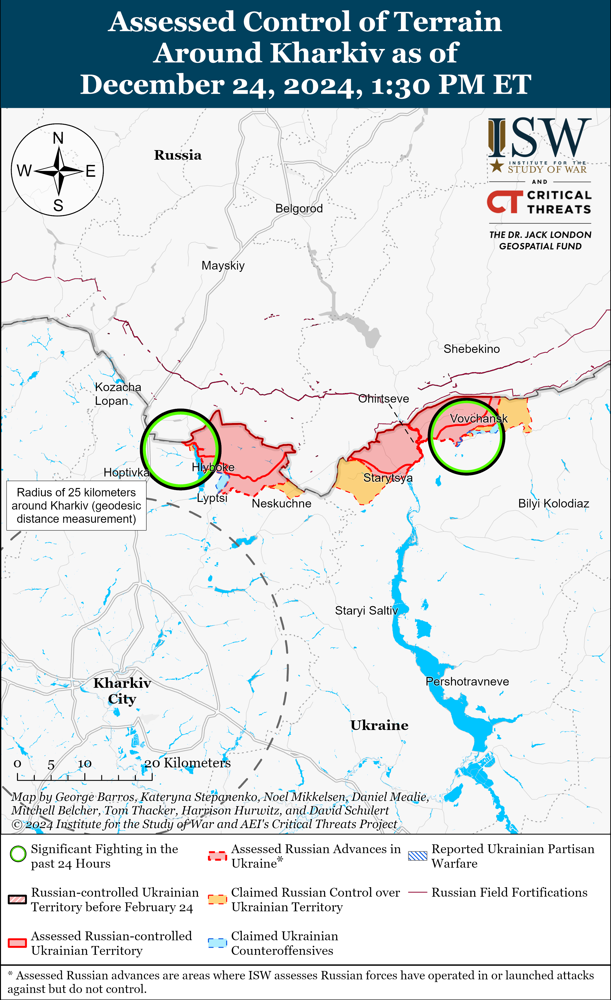
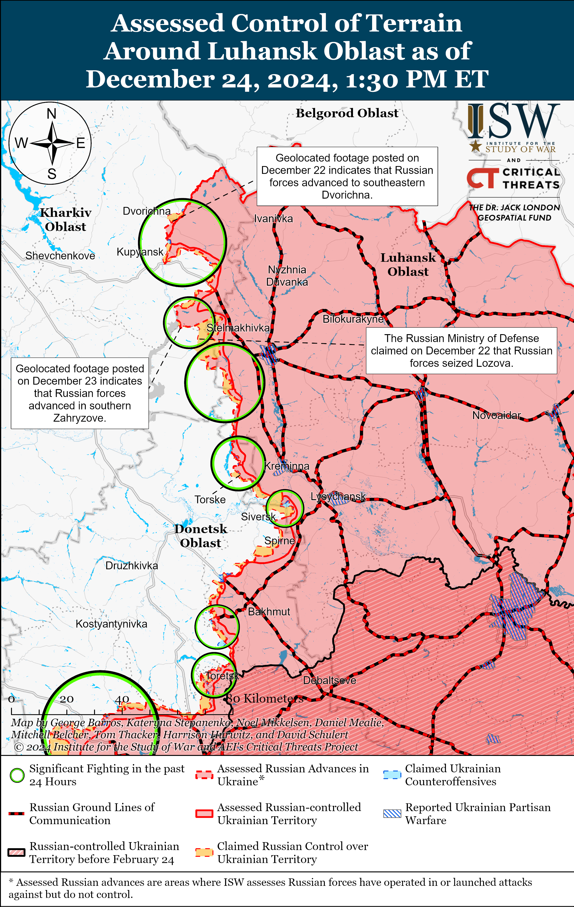
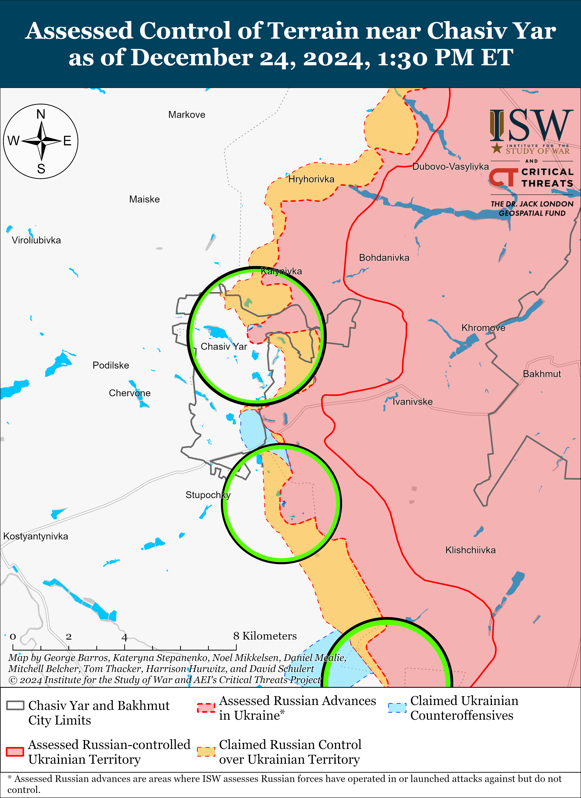
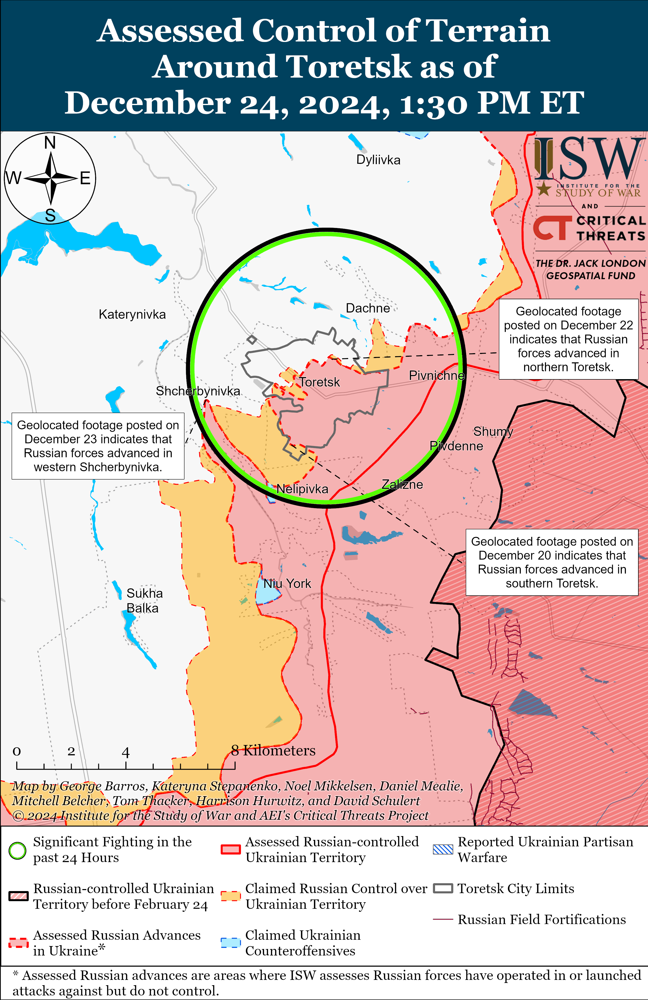
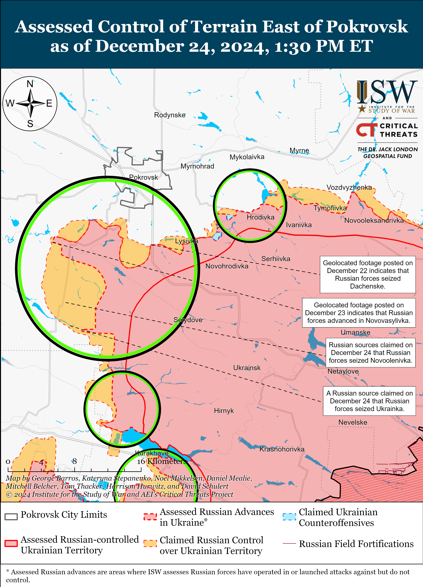
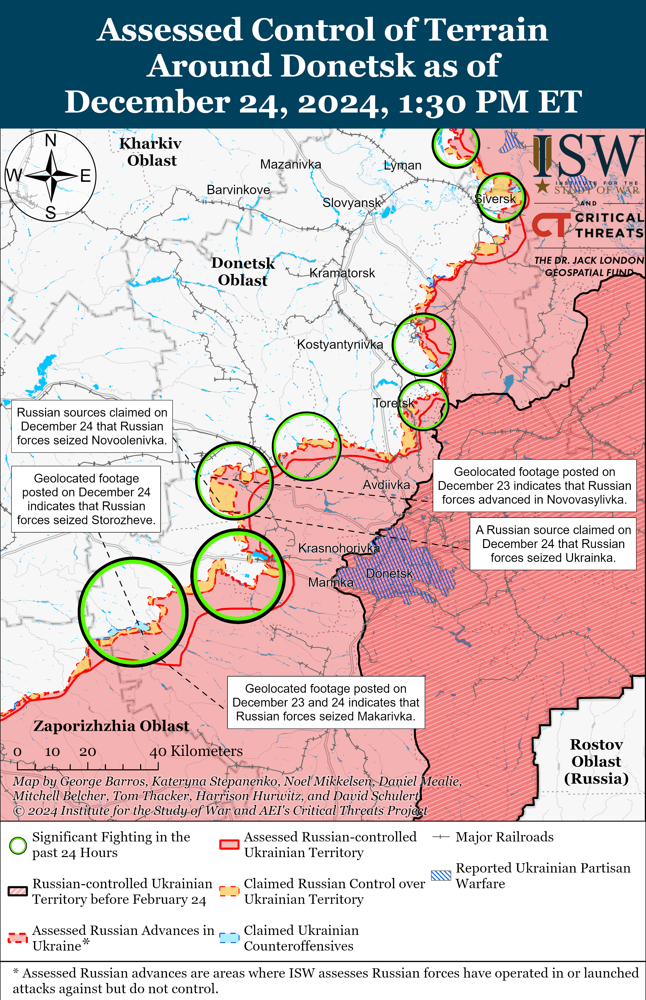
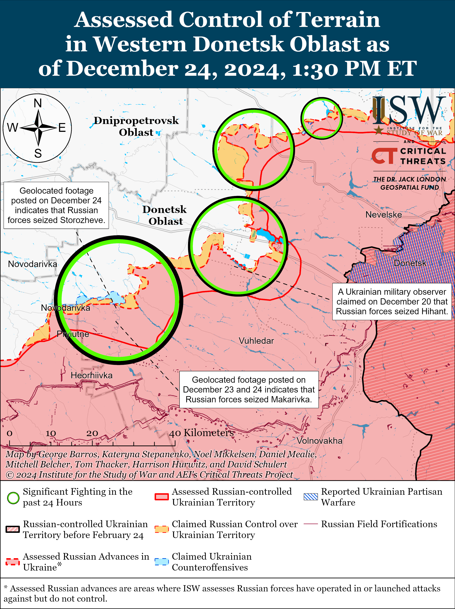
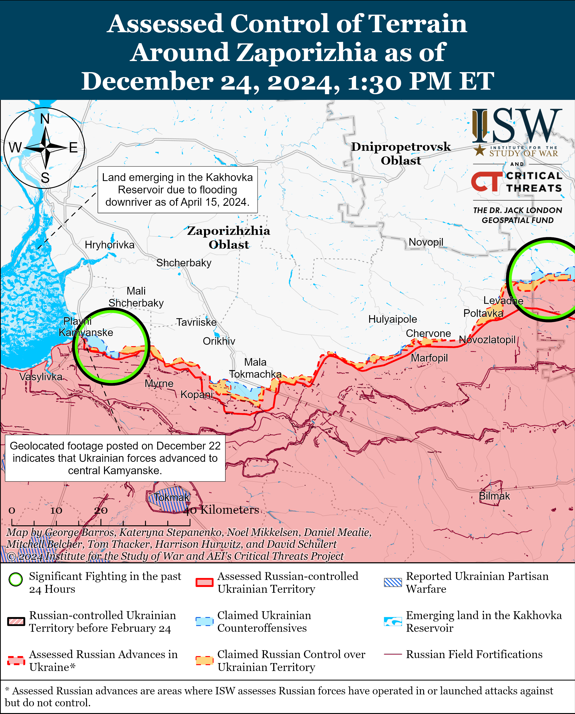
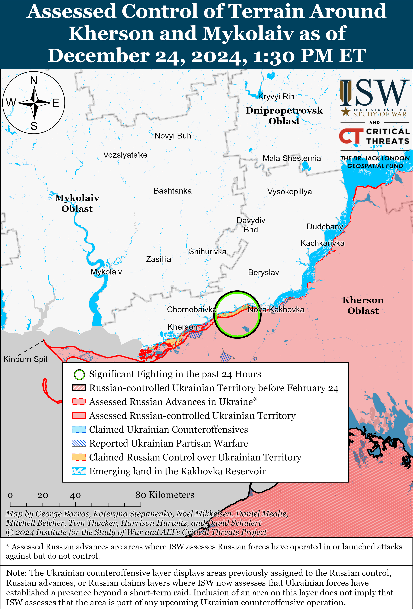

# Russian Offensive Campaign Assessment, December 24, 2024

**Russian Offensive Campaign Assessment, December 24, 2024**

**Nicole Wolkov, Christina Harward, Nate Trotter, Kateryna Stepanenko, William Runkel, and Fredrick W. Kagan**

**December 24, 2024, 6:15pm ET**

**Click** [**here**](https://storymaps.arcgis.com/stories/36a7f6a6f5a9448496de641cf64bd375) **to see ISW’s interactive map of the Russian invasion of Ukraine. This map is updated daily alongside the static maps present in this report.**

**Click** [**here**](https://storymaps.arcgis.com/stories/83a2f24901c941d581c0c523ecd2619b)**to see ISW’s interactive map of Ukraine’s offensive in Kursk Oblast.**

**Click** [**here**](https://understandingwar.maps.arcgis.com/apps/instant/3dviewer/index.html?appid=1602762dbcde419bb957dea358449580) **to see ISW’s 3D control of terrain topographic map of Ukraine. Use of a computer (not a mobile device) is strongly recommended for using this data-heavy tool.**

**Click** [**here**](https://storymaps.arcgis.com/stories/733fe90805894bfc8562d90b106aa895) **to access ISW’s archive of interactive time-lapse maps of the Russian invasion of Ukraine. These maps complement the static control-of-terrain map that ISW produces daily by showing a dynamic frontline. ISW will update this time-lapse map archive monthly.**

**Note: The data cut-off for this product was 12:45pm ET on December 24. ISW will cover subsequent reports in the December 26 Russian Offensive Campaign Assessment. ISW and CTP will not publish a campaign assessment (or maps) tomorrow, December 25, in observance of the Christmas holiday. Coverage will resume on December 26.**

**A senior Russian official reiterated Russian President Vladimir Putin’s insistence that negotiations with Ukraine must be based on the same uncompromising demands he made before the full-scale invasion and at the moment of Russia’s greatest territorial gains, despite the fact that Ukraine has liberated a significant amount of territory since then.** Russian Federation Council Speaker Valentina Matviyenko stated on December 24 that Russia is open to compromise in negotiations with Ukraine, but that Russia will strictly adhere to the conditions that it laid out during negotiations in Istanbul in March 2022, when Russian troops were advancing on Kyiv and throughout eastern and southern Ukraine.[1] Matviyenko added that Russia would not deviate from these conditions by “one iota.”[2] The partial agreement that emerged during the Ukraine-Russia negotiations in Istanbul in March 2022 stated that Ukraine would be a permanently neutral state that could not join NATO, and imposed limitations on the Ukrainian military similar to those imposed by the Treaty of Versailles on Germany after World War I, restricting Ukraine’s Armed Forces to 85,000 soldiers.[3] Russia’s demands at Istanbul were mainly more detailed versions of the demands that Putin made in the months before he launched the full-scale invasion in February 2022, including Ukraine’s “demilitarization” and neutrality.[4] Matviyenko is reiterating Putin’s demand from his annual Direct Line televised press conference on December 19, and more senior Russian officials are likely to make similar claims to domestic and foreign audiences in coming weeks.[5] ISW continues to assess that senior Russian officials’ references to conditions Putin attempted to impose on Ukraine when he believed his full-scale invasion could succeed in a few days in 2022 reflects his projected confidence that he can completely defeat Ukraine militarily despite the tremendous setbacks Ukraine has inflicted on Russian forces since then.

**The Kremlin’s economic limitations will likely hinder its efforts to impose policies combatting long-term demographic decline in Russia.** Nizhny Novgorod Oblast Governor Gleb Nikitin stated on December 23 that Nizhny Novgorod Oblast would provide a maternity capital payment of one million rubles (about $10,000) for the birth of each child starting at an unspecified date in 2025.[6] Nikitin stated that Nizhny Novogorod Oblast authorities would provide one million rubles for the first and second children with federal and regional funds and will provide one million rubles for the third and fourth children solely from the regional budget. Russian regional authorities will likely continue to expand maternity capital payments as part of a Kremlin directive to address long-term demographic issues.[7] The Russian government may struggle to provide large maternity capital payments over time as the Russian economy is continually strained by its war in Ukraine, international sanctions, and rising labor shortages, however. Russian state newswire *RIA Novosti* reported on December 24 that it saw a letter that the Russian Central Bank sent in response to a request from Russian State Duma Deputy Denis Parfenov wherein the Central Bank stated that the lowering of the key interest rate in order to stimulate demand, when “demand already exceeds supply,” is “dangerous.”[8] The Central Bank stated that Russia’s current labor, equipment, and transport shortages mean that cheap loans will not immediately give producers additional resources and will only intensify competition for resources and increase prices. The Russian Central Bank raised the key interest rate to 21 percent in October 2024, and the bank’s head, Elvira Nabiullina, has recently stated that the bank may raise it further.[9] Russian President Vladimir Putin attempted during his Direct Line televised press conference on December 19 to portray the Russian economy as “stable and reliable,” while also blaming the Russian Central Bank and Nabiullina for mishandling rising interest rates.[10]

**A Russian cargo ship sank in the Mediterranean Sea on December 23, possibly while traveling from St. Petersburg to Vladivostok via Syria and Libya.** Spanish media reported on December 24 that the Russian *Ursa Major* cargo ship sank in the Mediterranean Sea between Spain and Algeria, and the Russian Ministry of Foreign Affairs (MFA) confirmed that the dry cargo ship sank after an explosion in the engine room.[11] The Russian Ministry of Defense’s (MoD) Oboronlogistika logistics company, which owns the *Ursa Major*, claimed in a press release from December 20 that the vessel was traveling to Vladivostok with two cranes necessary to expand the city’s port terminal and 45-ton hatch covers for new icebreakers.[12] Oboronlogistika claimed that the vessel was going to develop port infrastructure and the Northern Sea Route. Ship tracking services showed that the vessel left St. Petersburg on December 11.[13] Russian media reported that the captain of the *Ursa Major* stated that the ship was carrying empty containers on board.[14] *The Maritime Executive* reported that automatic identification system (AIS) data showed that the Russian cargo ship *Sparta* came to the aid of the *Ursa Major* following the explosion.[15] Ukraine’s Main Military Intelligence Directorate (GUR) recently stated that the *Sparta* and the *Sparta II* cargo ships wereen route from Russia to the Port of Tartus to evacuate Russian military assets from Syria.[16] The presence of the hatch covers for new icebreakers on the *Ursa Major* is consistent with Oboronlogistika’s statement that the ship was travelling to Vladivostok. Russia may have diverted the ship to the Port of Tartus to evacuate Russian military assets from Syria. Russia has reportedly started moving military assets from Syria to Libya, and the *Ursa Major* may have planned to relocate military assets from Syria to Libya before continuing on to Vladivostok.[17] The sinking of the *Ursa Major* may complicate and slow Russian efforts to evacuate military assets from the Port of Tartus.

**The United States provided Ukraine on December 24 with the first tranche of loans generated solely from profits from frozen Russian assets.** Ukrainian Prime Minister Denys Shmyhal stated that the United States gave Ukraine a one billion dollar loan generated solely from profits from frozen Russian assets.[18] This is the first loan out of atotal $20 billion generated from profits from frozen Russian assets that the United States allocated to Ukraine on December 10.[19] The United States transfer of revenues from Russian frozen assets is part of the larger G7 Extraordinary Revenue Acceleration (ERA) Loans initiative to send $50 billion worth of profits from frozen Russian assets to support Ukraine’s budgetary, military, and reconstruction assistance throughout 2025.

**Key Takeaways:**

- **A senior Russian official reiterated Russian President Vladimir Putin’s insistence that negotiations with Ukraine must be based on the same uncompromising demands he made before the full-scale invasion and at the moment of Russia’s greatest territorial gains, despite the fact that Ukraine has liberated significant amount of territory since then.**
- **The Kremlin’s economic limitations will likely hinder its efforts to impose policies combatting long-term demographic decline in Russia.**
- **A Russian cargo ship sank in the Mediterranean Sea on December 23, possibly while traveling from St. Petersburg to Vladivostok via Syria and Libya.**
- **The United States provided Ukraine on December 24 with the first tranche of loans generated solely from profits from frozen Russian assets.**
- **Russian forces recently advanced near Pokrovsk, Toretsk, Vuhledar, Velyka Novosilka, and in Kursk Oblast.**
- **Russian Security Council Deputy Chairperson Dmitry Medvedev claimed on December 24 that 440,000 recruits signed military service contracts with the Russian Ministry of Defense (MoD) in 2024.**

[](https://understandingwar.org/map/assessed-control-of-terrain-in-ukraine-and-main-russian-maneuver-axes-as-of-december-24-2024-130-pm-et/)

***We do not report in detail on Russian war crimes because these activities are well-covered in Western media and do not directly affect the military operations we are assessing and forecasting. We will continue to evaluate and report on the effects of these criminal activities on the Ukrainian military and the Ukrainian population and specifically on combat in Ukrainian urban areas. We utterly condemn Russian violations of the laws of armed conflict and the Geneva Conventions and crimes against humanity even though we do not describe them in these reports.***

- Ukrainian Operations in the Russian Federation
- Russian Main Effort – Eastern Ukraine (comprised of three subordinate main efforts)
- Russian Subordinate Main Effort #1 – Push Ukrainian forces back from the international border with Belgorod Oblast and approach to within tube artillery range of Kharkiv City
- Russian Subordinate Main Effort #2 – Capture the remainder of Luhansk Oblast and push westward into eastern Kharkiv Oblast and encircle northern Donetsk Oblast
- Russian Subordinate Main Effort #3 – Capture the entirety of Donetsk Oblast
- Russian Supporting Effort – Southern Axis
- Russian Air, Missile, and Drone Campaign
- Russian Mobilization and Force Generation Efforts
- Russian Technological Adaptations
- Activities in Russian-occupied areas
- Significant Activity in Belarus

**Ukrainian Operations in the Russian Federation**

Russian forces recently advanced within the Ukrainian salient in Kursk Oblast amid continued offensive operations on December 24. Geolocated footage published on December 23 shows Russian forces conducting a roughly platoon-sized mechanized assault west of Malaya Loknya (north of Sudzha) indicating that Russian forces recently advanced along the 38H-449 highway west of the settlement.[20] A Kremlin-affiliated Russian milblogger claimed that Russian armored assault groups advanced along a road southeast of Korenevo near Novoivanovka towards Viktorovka and Malaya Loknya, seized an unspecified area near a forest in the vicinity of Kruglenkoye (southeast of Korenevo), and entered Cherkasskaya Konopelka (southeast of Sudzha) after advancing three kilometers.[21] Russian milbloggers claimed that Russian forces advanced up to 1.2 kilometers southeast of Korenevo near Nikolayevo-Darino and Leonidovo, northeast of Sudzha near Russkoye Porechnoye, and south of Sudzha near Kurilovka. ISW has not observed confirmation of these claims, however. Russian milbloggers claimed that Ukrainian forces conducted mechanized counterattacks in Sudzhansky Raion.[22] A servicemember of a Ukrainian battalion operating in Kursk Oblast reported that the Russian command is committing several divisions-worth of elite units and is using all available weapons to maintain a high pace of assaults in the area.[23] Ukrainian sources reported that North Korean soldiers continue to suffer casualties in Kursk Oblast and that Russian forces are moving dead North Korean bodies to the rear in order to conceal the participation of North Korean soldiers in Kursk Oblast operations.[24] Elements of the Russian 11th Airborne (VDV) Brigade are reportedly operating near Cherkasskaya Konopelka; and elements of the Russian 40th Naval Infantry Brigade (Pacific Fleet, Eastern Military District [EMD]) and ”Pyatnashka” International Volunteer Brigade and Chechen ”Akhmat” tank elements are reportedly operating near Sudzha.[25] Elements of the Russian 83rd Airborne (VDV) Brigade and electronic warfare (EW) operators of the Russian 106th Airborne (VDV) Division are reportedly operating in Kursk Oblast.[26]

[](https://understandingwar.org/map/ukrainian-incursion-into-kursk-oblast-as-of-december-24-2024-130-pm-et/)

Ukrainian forces conducted a series of drone strikes against Russian military objects within Russia on December 23 to 24. Geolocated footage published on December 24 shows Ukrainian drones striking the Russian Millerovo Air Base near Millerovo, Rostov Oblast, and the Russian Ministery of Defense (MoD) claimed on December 23 that Russian air defense systems shot down nine Ukrainian drones over Rostov Oblast.[27]

**Russian Main Effort – Eastern Ukraine**

**Russian Subordinate Main Effort #1 – Kharkiv Oblast (Russian objective: Push Ukrainian forces back from the international border with Belgorod Oblast and approach to within tube artillery range of Kharkiv City)**

Russian forces continued ground attacks in the Kharkiv direction on December 24 but did not make any confirmed advances. A Russian milblogger claimed that Russian forces advanced 100 meters in the residential area near Tykhe (northeast of Kharkiv City) after Ukrainian forces conducted two counterattacks in the area from the direction of Tykhe.[28] The milblogger added that Russian forces control the eastern and western parts of Starytsya (northeast of Kharkiv City), while the southern part of the settlement remains a contested ”gray zone.” ISW has not observed confirmation of these claims, however. Russian forces conducted offensive operations north of Kharkiv City near Vysoka Yaruha and northeast of Kharkiv City near Vovchansk on December 23 and 24.[29] Elements of the Russian 44th Army Corps ([AC], Leningrad Military District [LMD]) are reportedly operating in Starytsya.[30]

[](https://understandingwar.org/map/assessed-control-of-terrain-around-kharkiv-as-of-december-24-2024-130-pm-et/)

**Russian Subordinate Main Effort #2 – Luhansk Oblast (Russian objective: Capture the remainder of Luhansk Oblast and push westward into eastern Kharkiv Oblast and northern Donetsk Oblast)**

Russian forces recently conducted a reinforced company-sized mechanized assault in the Kupyansk direction, but did not make any confirmed advances along the Kupyansk-Svatove-Kreminna line on December 24. Ukraine’s Khortytsia Group of Forces reported on December 24 that Ukrainian forces repelled a Russian reinforced company-sized mechanized assault on the east (left) bank of the Oskil River in the Kupyansk direction on December 23.[31] Ukraine’s Khortytsia Group of Forces reported that Russian forces conducted the assault in two waves and that Ukrainian forces destroyed two tanks and one infantry fighting vehicle and damaged one tank and eight infantry fighting vehicles. Russian forces continued attacking north of Kupyansk near Kindrashivka; northeast of Kupyansk near Dvorichna; east of Kupyansk near Petropavlivka; southeast of Kupyansk near Kolisnikivka, Bohuslavka, Zahryzove, and Lozova; southwest of Svatove near Hrekivka, Novoyehorivka, Makiivka, Tverdokhlibove, and Novoserhiivka; west of Svatove near Nova Kruhlyakivka, Zelenyi Hai, Shyikivka, and Nadiya; northwest of Kreminna near Serhiivka, Ivanivka, Terny, and Druzhelyubivka; west of Kreminna near Torske; and southwest of Kreminna near Hryhorivka on December 23 and 24.[32] A Ukrainian battalion commander operating in the Kupyansk direction stated on December 24 that his battalion repelled three mechanized assaults within the past week (since roughly December 17) and that Ukrainian forces destroyed roughly 37 armored vehicles – about 85 percent of the armored vehicles Russian forces used in those assaults.[33] Elements of the Russian 27th Motorized Rifle Brigade (1st Guards Tank Army [GTA], Moscow Military District [MMD]) reportedly continue operating near Lozova, and elements of the 144th Motorized Rifle Division (29th Combined Arms Army [CAA], MMD) reportedly continue operating in the Kreminna area.[34]

[](https://understandingwar.org/map/assessed-control-of-terrain-around-luhansk-oblast-as-of-december-24-2024-130-pm-et/)

**Russian Subordinate Main Effort #3 – Donetsk Oblast (Russian objective: Capture the entirety of Donetsk Oblast, the claimed territory of Russia’s proxies in Donbas)**

Russian forces continued offensive operations northeast of Siversk near Bilohorivka on December 23 and 24 but did not advance.[35] Ukraine’s Luhansk Oblast Border Guard reported on December 24 that Russian forces in the Siversk direction are taking advantage of cloudy weather to attack in small groups using motorcycles.[36]

Russian forces continued offensive operations in the Chasiv Yar direction on December 24 but did not make any confirmed advances. Russian milbloggers claimed that Russian forces advanced in fields west of Hryhorivka (north of Chasiv Yar) and to Heroichna Street and Lermontova Street in northern Chasiv Yar.[37] ISW has not observed confirmation of these claims, however. A Russian milblogger claimed on December 24 that Ukrainian forces occupied the entirety of the Refractory Plant in central Chasiv Yar and forced elements of the Russian 98th Airborne (VDV) Division to withdraw from the plant.[38] The milblogger also claimed that Russian forces withdrew from areas west of Klishchiivka (southeast of Chasiv Yar), including the quarry.[39] The Ukrainian General Staff reported that Russian forces conducted offensive operations near Chasiv Yar itself; south of Chasiv Yar near Stupochky and Predtechyne; and southeast of Chasiv Yar near Bila Hora on December 23 and 24.[40] Elements of the Russian 200th Motorized Rifle Brigade (14th Army Corps [AC], Leningrad Military District [LMD]) are reportedly operating in Chasiv Yar.[41]

[](https://understandingwar.org/map/assessed-control-of-terrain-near-chasiv-yar-as-of-december-24-2024-130-pm-et/)

Russian forces recently advanced in the Toretsk direction amid continued offensive operations in the area on December 24. Geolocated footage published on December 23 indicates that Russian forces recently advanced along Tsentralna Street in western Shcherbynivka (east of Toretsk).[42] Russian milbloggers claimed that Russian forces advanced to Vesniana Street in central Shcherbynivka, east of Shcherbynivka, to Saltykova-Shchedrina Street in northern Toretsk, and in western Toretsk.[43] ISW has not observed confirmation of these claims, however. Russian milbloggers claimed that Russian forces advanced in Shcherbynivka during a platoon-sized mechanized assault consisting of three armored vehicles along Tsentralna Street, but one milblogger claimed that it is too early to claim that Russian forces occupy half of the settlement.[44] A Russian milblogger also claimed that Russian forces have not established a foothold in the central market in Toretsk.[45] Russian forces continued offensive operations in and near Toretsk; northeast of Toretsk near Dachne and Dyliivka; east of Toretsk near Druzhba; and west of Toretsk near Shcherbynivka on December 23 and 24.[46]

[](https://understandingwar.org/map/assessed-control-of-terrain-around-toretsk-as-of-december-24-2024-130-pm-et/)

Russian forces reportedly advanced in the Pokrovsk direction amid continued offensive operations in the area on December 24. Russian milbloggers claimed that Russian forces seized Novoolenivka and Ukrainka and advanced southeast of Pishchane, south of Novovasylivka, to northeastern Novoyelyzavetivka (all southwest of Pokrovsk), along the Donetska rail line east of Sukhyi Yar (southeast of Pokrovsk), in southern Myrolyubivka, and north of Novooleksandrivka (both east of Pokrovsk), but ISW has not observed confirmation of these claims.[47] Russian forces conducted offensive operations east of Pokrovsk near Vozdvyzhenka, Myrolyubikva, and Promin; southeast of Pokrovsk near Sukhyi Yar and Lysivka; south of Pokrovsk near Novyi Trud, Dachenske, Zelene, and Shevchenko; and southwest of Pokrovsk near Pishchane, Novopustynka, Novotroitske, Vovkove, Novovasylivka, Novoyelyzavetivka, and Novoolenivka on December 23 and 24.[48] An officer in a Ukrainian brigade operating in the Pokrovsk direction stated that Russian forces are using heavy armored vehicles, motorcycles, buggies, and cars during assaults.[49] Ukrainian servicemembers operating in the Pokrovsk direction stated that Russian forces periodically use up to 15 drones of different types at the same time and are using drones with fiber optic cables that are resistant to Ukrainian electronic warfare (EW) interference.[50] The spokesperson of a Ukrainian brigade in the Pokrovsk direction stated that Russian forces are using North Korean-made remote mining systems with cluster munitions.[51] Drone operators of the “Maxim Krivonos” volunteer detachment, allegedly formed by former members of the Ukrainian Armed Forces who defected to fight for Russia; elements of the 74th Motorized Rifle Brigade (41st Combined Arms Army [CAA], Central Military District [CMD]); and elements of the “Vega” Spetsnaz Detachment (24th Spetsnaz Brigade, Main Intelligence Directorate of the Russian General Staff [GRU]) are reportedly operating in the Pokrovsk direction.[52]

[](https://understandingwar.org/map/assessed-control-of-terrain-east-of-pokrovsk-as-of-december-24-2024-130-pm-et/)

Russian forces recently advanced near Kurakhove amid continued offensive operations in the area on December 24. Geolocated footage published on December 24 indicates that Russian forces recently advanced east of Shevchenko (northwest of Kurakhove) and in the fields northwest of Dalne (south of Kurakhove).[53] Russian milbloggers claimed that Russian forces advanced further into the fields northwest of Dalne and northwest of Zorya (northwest of Kurakhove), but ISW has not observed confirmation of these claims.[54] Russian forces conducted offensive operations near Kurakhove itself; northwest of Kurakhove near Petropavlivka, Shevchenko, Sontsivka, and Stari Terny; and west of Kurakhove near Andriivka and Dachne on December 23 and 24.[55] Elements of the Russian 110th Motorized Rifle Brigade (51st CAA, formerly 1st Donetsk People’s Republic [DNR] AC) are reportedly operating in the Kurakhove direction.[56]

Russian forces reportedly advanced in the Vuhledar direction amid continued offensive operations in the area on December 24. A Russian milblogger claimed that Russian forces advanced northwest of Uspenivka (north of Vuhledar), but ISW has not observed confirmation of this claim.[57] Russian forces conducted offensive operations north of Vuhledar near Uspenivka and northwest of Vuhledar near Kostyantynopil, Yantarne, Kostyantynopolske, and Rozlyv on December 23 and 24.[58]

[](https://understandingwar.org/map/assessed-control-of-terrain-around-donetsk-as-of-december-24-2024-130-pm-et/)

Russian forces recently advanced near Velyka Novosilka amid continued offensive operations in the area on December 24. Geolocated footage published on December 23 and 24 shows Russian forces raising a flag in northern Storozheve (south of Velyka Novosilka) and conducting a platoon-sized mechanized assault in central Storozheve, indicating that Russian forces recently seized that settlement and Makarivka (south of Storozheve).[59] Russian milbloggers claimed that Russian forces advanced northeast of Rozdolne (northeast of Velyka Novosilka) and northeast of Rivnopil (southwest of Velyka Novosilka), but ISW has not observed confirmation of these claims.[60] Russian forces conducted offensive operations near Velyka Novosilka itself; northeast of Velyka Novosilka near Rozdolne; north of Velyka Novosilka near Novyi Komar; west of Velyka Novosilka near Novosilka; southwest of Velyka Novosilka near Novodarivka; and south of Velyka Novosilka near Storozheve on December 23 and 24.[61] Ukraine’s Khortytsia Group of Forces stated that Ukrainian forces repelled a Russian platoon-sized mechanized assault near Novyi Komar.[62] Ukraine’s Khortytsia Group of Forces Spokesperson Colonel Nazar Voloshyn stated that information about the alleged Russian encirclement of Ukrainian forces near Makarivka is unverified and that Russian forces did not surround Ukrainian forces in the area.[63] Elements of the Russian 60th Motorized Rifle Brigade and 127th Motorized Rifle Division (both of the 5th CAA, Eastern Military District [EMD]) are reportedly operating in and near Storozheve, and drone operators of the 14th Spetsnaz Brigade (GRU) are reportedly operating near Velyka Novosilka.[64]

[](https://understandingwar.org/map/assessed-control-of-terrain-in-western-donetsk-oblast-as-of-december-24-2024-130-pm-et/)

**Russian Supporting Effort – Southern Axis (Russian objective: Maintain frontline positions and secure rear areas against Ukrainian strikes)**

Russian forces continued offensive operations in western Zaporizhia on December 24 but did not make any confirmed advances. Russian forces Russian forces continued attacking northwest of Robotyne near Pyatykhatky, Lobkove, and Novoandriivka; north of Robotyne near Novodanylivka; and northeast of Robotyne near Bilohirya on December 23 and 24.[65] Ukraine’s Southern Operational Command reported on December 24 that Russian forces are conducting reconnaissance operations in the Orikhiv (north of Robotyne) and Hulyaipole (northeast of Robotyne) directions, training new assault groups, conducting tactical rotations, and replenishing ammunition reserves.[66]

[](https://understandingwar.org/map/assessed-control-of-terrain-around-zaporizhia-as-of-december-24-2024-130-pm-et/)

Russian forces continued offensive operations in the Dnipro direction and on the islands in the Dnipro River Delta on December 23 and 24 but did not make any confirmed advances.[67] Ukraine’s Southern Operational Command reported on December 24 that Russian forces have been unsuccessfully trying to seize Kozatskyi Island (northeast of Kherson City near Nova Kakhovka) for several weeks.[68] Elements of the Russian 127th Reconnaissance Brigade (22nd Army Corps [AC], Black Sea Fleet [BSF]) and the 81st Self-Propelled Artillery Regiment (70th Motorized Rifle Division, 18th Combined Arms Army [CAA], Southern Military District [SMD]) are reportedly operating in the Kherson direction.[69]

[](https://understandingwar.org/map/assessed-control-of-terrain-around-kherson-and-mykolaiv-as-of-december-24-2024-130-pm-et/)

**Russian Air, Missile, and Drone Campaign (Russian Objective: Target Ukrainian military and civilian infrastructure in the rear and on the frontline)**

Russian forces launched a series of missile and drone strikes against Ukraine throughout December 23 and overnight on December 24. The Ukrainian Air Force reported that Russian forces launched 60 Shahed and other unspecified drones from Bryansk Oblast; Millerovo, Rostov Oblast; and Primorsko-Akhtarsk, Krasnodar Krai between 1000 local time on December 23 and 0900 local time on December 24.[70] The Ukrainian Air Force reported that Ukrainian forces shot down 36 Shaheds and other drones over Poltava, Sumy, Kharkiv, Kyiv, Chernihiv, Zaporizhia, Dnipropetrovsk, and Khmelnytskyi oblasts as of 1000 local time on December 24, and that 23 drones imitating Shaheds were “locally lost” and did not cause any damage. Ukrainian officials reported on December 24 that a Russian ballistic missile struck a residential building in Kryvyi Rih, Dnipropetrovsk Oblast, and killed one civilian and injured 13.[71] Ukrainian officials reported that Ukrainian forces shot down three drones over Cherkasy Oblast and that the debris from a destroyed drone damaged residential infrastructure in Kyiv Oblast.[72] Sumy Oblast officials reported that three Russian drones, including a Shahed, struck a farm in the Krolevets Hromada, Sumy Oblast.[73]

**Russian Mobilization and Force Generation Efforts (Russian objective: Expand combat power without conducting general mobilization)**

Russian Security Council Deputy Chairperson Dmitry Medvedev claimed on December 24 that 440,000 recruits signed military service contracts with the Russian Ministry of Defense (MoD) in 2024.[74] Russian Defense Minister Andrey Belousov similarly claimed in mid-December 2024 that 427,000 recruits signed military service contracts with the Russian MoD.[75] ISW is unable to independently verify these claims. Russian officials are likely including Russians and Ukrainians in occupied Ukrainian areas who were coerced into signing military contracts with the Russian MoD, and this number of recruits unlikely represents recruitment based on solely voluntary basis.[76]

The Kremlin appointed a Russian “Time of Heroes” participant and veteran who was involved in the Russian annihilation of Mariupol in 2022 to a leadership position within the Russian Yunarmiya state military-patriotic movement as part of its ongoing effort to militarize Russian youth. Chairperson of the Russian Children’s Movement Board and “Movement of the First” youth movement, Artur Orlov, announced on December 24 that Captain Vladislav Golovin became the Yunarmiya Chief of the General Staff after Golovin completed the “Time of Heroes” program, which prepares selected veterans to assume local, regional, and federal government positions.[77] Russian opposition outlet *Vazhnye Istorii* (*iStories*) reported that Golovin commanded a platoon of the Russian 382nd Battalion of the 810th Naval Infantry Brigade (Black Sea Fleet) in Mariupol and later assumed command of the battalion following significant Russian losses.[78] A Kremlin-affiliated milblogger claimed that Golovin will need to institute significant reforms within Yunarmiya such as reintroducing military uniforms for children and establishing Yunarmiya as an all-Russian movement.[79] Russian President Vladimir Putin notably previously appointed Orlov, a veteran of the war in Ukraine and participant of the Kremlin’s “Time of Heroes” program, as the Movement of the First’s Chairperson in mid-September 2022.[80] The appointments of Orlov and Golovin to youth organizations indicate that the Kremlin is increasingly using “Time of Heroes” program to recruit veterans to institute military-patriotic education in Russia and occupied Ukraine.

Kherson Oblast occupation deputy governor Igor Chagayev announced on December 24 the registration of five Cossack societies in occupied Kherson Oblast as part of the state-controlled All-Russian Cossack Society.[81] Chagayev added that the Cossack societies in occupied Kherson Oblast have approximately 110 people and will perform Cossack patrols jointly with Russian law enforcement agencies. Russian occupation officials are likely rushing to form Cossack patrol units to enforce the Russian occupation regime in occupied eastern and southern Ukraine.

**Russian Technological Adaptations (Russian objective: Introduce technological innovations to optimize systems for use in Ukraine)**

Kazan National Research Technical University announced that it is opening a new unmanned systems research and production complex named “Bars” sponsored by 2.5 billion rubles (about $25 million) from federal and regional funds.[82] The “Bars” center will include an aviation training center, a laboratory research complex, a flight test center and production facilities, and a situational center that will track drone flight paths in the Republic of Tatarstan.

**Activities in Russian-occupied areas (Russian objective: Consolidate administrative control of annexed areas; forcibly integrate Ukrainian citizens into Russian sociocultural, economic, military, and governance systems)**

Unknown actors reportedly detonated the car of Berdyansk City’s occupation council head Vasily Nechet in occupied Berdyansk on December 24.[83] Ukrainian and Russian sources cited preliminary information that Nechet was wounded in the attack and was hospitalized.[84]

Ukrainian and Russian sources reported on the fates of several Ukrainian children whom Russian forces forcefully relocated and deported from the then-occupied west (right) bank Kherson Oblast in 2022 to occupied Crimea and Russia. Ukrainian President Volodymyr Zelensky stated that Russian forces kidnapped 48 Ukrainian children while withdrawing from Kherson City in November 2022 and forcibly relocated these children deeper into occupied Crimea and Russia.[85] Zelensky noted that all of these children were three years old and younger. Russian opposition outlet *Vazhnye Istorii* (*iStories*) and investigative human rights initiative the *Reckoning Project* reported on December 24 that a Ukrainian teenager Alexander Yakushchenko committed suicide at age 18 after he was deported to Krasnodar Krai from then-occupied right-bank Kherson Oblast and placed into a Russian foster family.[86] *Vazhnye Istorii* (*iStories*) and the *Reckoning Project* located seven other Ukrainian children who are now living in Krasnodar Krai and occupied Crimea.[87]

Russian President Vladimir Putin signed a decree on December 24 banning the state registration of legal entities located in occupied Donetsk, Luhansk, Kherson, and Zaporizhia oblasts that are associated with foreigners from “unfriendly” to Russian-friendly countries until 2026.[88]

**Significant activity in Belarus (Russian efforts to increase its military presence in Belarus and further integrate Belarus into Russian-favorable frameworks)**

Belarusian officials emphasized increases in Belarusian trade with Russia in 2024. The Belarusian Universal Commodity Exchange’s (BUCE) Foreign Economic Activity Department Deputy Head, German Puzyrny, stated on December 24 that Belarusian enterprises’ exports to Russia via the BUCE increased by 9.5 times between January and November 2024.[89] Minsk City Executive Committee First Deputy Chairperson, Nadezhda Lazarevich, stated on December 24 that Belarusian exports to Moscow Oblast increased by 15 percent in 2024 as compared to 2023 and that industrial products, such as vehicles, freight railway cars, trams, railway cars, and electronic integrated circuits, and automotive parts, accounted for most of the Belarusian exports to Moscow Oblast.[90]

**Note: ISW does not receive any classified material from any source, uses only publicly available information, and draws extensively on Russian, Ukrainian, and Western reporting and social media as well as commercially available satellite imagery and other geospatial data as the basis for these reports. References to all sources used are provided in the endnotes of each update.**

[1] https://t.me/tass\_agency/293040 ; https://www.interfax dot ru/russia/1000390

[2] https://www.interfax dot ru/russia/1000390

[3] https://understandingwar.org/backgrounder/russian-offensive-campaign-assessment-march-1-2024; https://www.nytimes.com/interactive/2024/06/15/world/europe/ukraine-russia-ceasefire-deal.html

[4] http://kremlin dot ru/events/president/news/67843

[5] https://understandingwar.org/backgrounder/russian-offensive-campaign-assessment-december-19-2024

[6] https://www.kp dot ru/online/news/6153532/

[7] https://understandingwar.org/backgrounder/russian-offensive-campaign-assessment-december-19-2024

[8] https://ria dot ru/20241224/tsb-1990927903.html

[9] https://isw.pub/UkrWar120424

[10] https://isw.pub/UkrWar121924

[11] https://dskc dot mid.ru/events/v-sredizemnom-more-zatonul-sukhogruz-ursa-mayor-rossiya; https://www.elespanol dot com/espana/20241224/explosion-mercante-ruso-ursa-major-tripulantes-trasladados-cartagena/911158882\_0.html; https://www.laverdad dot es/murcia/amplio-despliegue-rescatar-pesquero-ruso-naufrago-aguas-20241223213044-nt.html

[12] https://obl dot ru/pressa/news/podnyat-600-tonn-legko/

[13] https://www.rbc dot ru/society/24/12/2024/676a4c8e9a794766deac59a5; https://www.marinetraffic.com/en/ais/details/ships/shipid:366234/mmsi:273396130/imo:9538892/vessel:URSA\_MAJOR

[14] https://t.me/sotaproject/91719; https://t.me/port\_media/3150 ; https://www.rbc dot ru/society/24/12/2024/676a4c8e9a794766deac59a5

[15] https://www.maritime-executive.com/article/russian-military-sealift-ship-sinks-after-engine-room-explosion

[16] https://t.me/DIUkraine/5075 ; https://isw.pub/UkrWar121224

[17] https://isw.pub/UkrWar121624; https://www.criticalthreats.org/analysis/africa-file-december-19-2024-russia-reinforces-libya-amid-syria-withdrawal-drc-rwanda-talks-collapse-ethiopias-counter-fano-campaign-issp-strangles-roadways-in-niger-ankara-declaration

[18] https://t.me/Denys\_Smyhal/9230 ; https://t.me/astrapress/70978;

[19] https://home.treasury.gov/news/press-releases/jy2744 ; https://www.whitehouse.gov/briefing-room/statements-releases/2024/10/25/g7-leaders-statement-on-extraordinary-revenue-acceleration-era-loans/

[20] https://t.me/WarArchive\_ua/23942; https://t.me/ua\_dshv/4541

[21] https://t.me/rybar/66591; https://t.me/DnevnikDesantnika/21410; https://t.me/wargonzo/23926; https://t.me/dva\_majors/60969; https://t.me/DnevnikDesantnika/21422;

[22] https://t.me/dva\_majors/60969; https://t.me/DnevnikDesantnika/21422;

[23] https://armyinform dot com.ua/2024/12/23/ne-chmobiki-i-ne-zeky-vorog-kynuv-na-kurshhynu-elitni-pidrozdily/

[24] https://armyinform dot com.ua/2024/12/24/pered-smertyu-pryvitav-tovarysha-z-dnem-narodzhennya-speczpryznachenczi-znajshly-u-vbytogo-pivnichnokorejczya-zapysnyk/; https://t.me/ukr\_sof/1325; https://armyinform dot com.ua/2024/12/24/chuchhe-parad-na-konczert-kobzona-pivnichnokorejczi-prodovzhuyut-skladaty-svoyih-zagyblyh-shtabelyamy/; https://t.me/kryvyirih17otbr/4040

[25] https://t.me/DnevnikDesantnika/21418; https://t.me/motopatriot/30799; https://t.me/TOF\_VMF/4047; https://t.me/wargonzo/23940

[26] https://t.me/epoddubny/21991; https://t.me/DnevnikDesantnika/21418

[27] https://t.me/DniproOfficial/5488; https://mil.in dot ua/uk/news/ukrayina-urazyla-rosijskyj-aerodrom-myllerovo/; https://t.me/mod\_russia/47205

[28] https://t.me/DnevnikDesantnika/21435

[29] https://www.facebook.com/GeneralStaff.ua/posts/pfbid0uB3GSwSq5W1xAoxEj69WUgpaRHzWnbhsNTq2fYV37oEJutoLYFzsfoYjkmh7FkrHl; https://www.facebook.com/GeneralStaff.ua/posts/pfbid0R6iXPvi3FBpR91GJ9AZ3qa4KmX9NXD9eVy4B7SDcsHTXi39aeVrRXkZ7zZt76fL3l; https://www.facebook.com/GeneralStaff.ua/posts/pfbid023U7LGTQxhsFRgCDcPQz3giYwU36g69JJo97vgur9zKFVrNpWkCHds5fpsHhznWYBl; https://t.me/otukharkiv/3214

[30] https://t.me/DnevnikDesantnika/21424

[31] https://t.me/Khortytsky\_wind/3718 ; https://t.me/fedorenkoys/837

[32] https://www.facebook.com/GeneralStaff.ua/posts/pfbid0uB3GSwSq5W1xAoxEj69WUgpaRHzWnbhsNTq2fYV37oEJutoLYFzsfoYjkmh7FkrHl ; https://www.facebook.com/GeneralStaff.ua/posts/pfbid0R6iXPvi3FBpR91GJ9AZ3qa4KmX9NXD9eVy4B7SDcsHTXi39aeVrRXkZ7zZt76fL3l ; https://www.facebook.com/GeneralStaff.ua/posts/pfbid023U7LGTQxhsFRgCDcPQz3giYwU36g69JJo97vgur9zKFVrNpWkCHds5fpsHhznWYBl ; https://t.me/Khortytsky\_wind/3713 ; https://t.me/dva\_majors/60969 ; https://t.me/motopatriot/30790

[33] https://armyinform.com dot ua/2024/12/24/hto-ty-voyin-na-harkivshhyni-ahilles-zdav-v-utyl-desyatky-odynycz-vorozhoyi-tehniky/

[34] https://t.me/RVvoenkor/83289 ; https://t.me/vysokygovorit/18373

[35] https://www.facebook.com/GeneralStaff.ua/posts/pfbid0uB3GSwSq5W1xAoxEj69WUgpaRHzWnbhsNTq2fYV37oEJutoLYFzsfoYjkmh7FkrHl ; https://www.facebook.com/GeneralStaff.ua/posts/pfbid0R6iXPvi3FBpR91GJ9AZ3qa4KmX9NXD9eVy4B7SDcsHTXi39aeVrRXkZ7zZt76fL3l ; https://www.facebook.com/GeneralStaff.ua/posts/pfbid023U7LGTQxhsFRgCDcPQz3giYwU36g69JJo97vgur9zKFVrNpWkCHds5fpsHhznWYBl ; https://t.me/Khortytsky\_wind/3713

[36] https://t.me/luhanskdpsu/462

[37] https://t.me/z\_arhiv/30188 ; https://t.me/motopatriot/30811 ; https://t.me/z\_arhiv/30191

[38] https://t.me/motopatriot/30792 ; https://t.me/motopatriot/30811

[39] https://t.me/motopatriot/30811

[40]https://www.facebook.com/GeneralStaff.ua/posts/pfbid0uB3GSwSq5W1xAoxEj69WUgpaRHzWnbhsNTq2fYV37oEJutoLYFzsfoYjkmh7FkrHl ; https://www.facebook.com/GeneralStaff.ua/posts/pfbid0R6iXPvi3FBpR91GJ9AZ3qa4KmX9NXD9eVy4B7SDcsHTXi39aeVrRXkZ7zZt76fL3l ; https://www.facebook.com/GeneralStaff.ua/posts/pfbid023U7LGTQxhsFRgCDcPQz3giYwU36g69JJo97vgur9zKFVrNpWkCHds5fpsHhznWYBl

[41] https://t.me/DnevnikDesantnika/21418 ; https://t.me/motopatriot/30811

[42] https://t.me/creamy\_caprice/7905 ; https://t.me/WarArchive\_ua/23976 ; https://t.me/Khyzhak\_brigade/306

[43] https://t.me/RVvoenkor/83247 ; https://t.me/z\_arhiv/30194

[44] https://t.me/DnevnikDesantnika/21462 ; https://t.me/motopatriot/30794

[45] https://t.me/motopatriot/30810

[46]https://www.facebook.com/GeneralStaff.ua/posts/pfbid0uB3GSwSq5W1xAoxEj69WUgpaRHzWnbhsNTq2fYV37oEJutoLYFzsfoYjkmh7FkrHl ; https://www.facebook.com/GeneralStaff.ua/posts/pfbid0R6iXPvi3FBpR91GJ9AZ3qa4KmX9NXD9eVy4B7SDcsHTXi39aeVrRXkZ7zZt76fL3l ; https://www.facebook.com/GeneralStaff.ua/posts/pfbid023U7LGTQxhsFRgCDcPQz3giYwU36g69JJo97vgur9zKFVrNpWkCHds5fpsHhznWYBl ; https://t.me/Khortytsky\_wind/3713 ; https://t.me/dva\_majors/60969

[47] https://t.me/boris\_rozhin/148980 ; https://t.me/z\_arhiv/30203; https://t.me/z\_arhiv/30200

[48] https://www.facebook.com/GeneralStaff.ua/posts/pfbid0uB3GSwSq5W1xAoxEj69WUgpaRHzWnbhsNTq2fYV37oEJutoLYFzsfoYjkmh7FkrHl; https://www.facebook.com/GeneralStaff.ua/posts/pfbid0R6iXPvi3FBpR91GJ9AZ3qa4KmX9NXD9eVy4B7SDcsHTXi39aeVrRXkZ7zZt76fL3l ; https://www.facebook.com/GeneralStaff.ua/posts/pfbid023U7LGTQxhsFRgCDcPQz3giYwU36g69JJo97vgur9zKFVrNpWkCHds5fpsHhznWYBl ; https://t.me/Khortytsky\_wind/3713; https://t.me/dva\_majors/60969; https://t.me/voenkorKotenok/60962; https://t.me/voenkorKotenok/60963

[49] https://suspilne dot media/donbas/909731-de-vijskovi-rf-provodat-najbils-aktivni-sturmi-na-pokrovskomu-napramku/

[50] https://armyinform dot com.ua/2024/12/24/snajperka-na-gusenyczyah-yak-brytanska-sau-as-90-rozryvaye-voroga-na-pokrovskomu-napryamku/

[51] https://armyinform dot com.ua/2024/12/24/snajperka-na-gusenyczyah-yak-brytanska-sau-as-90-rozryvaye-voroga-na-pokrovskomu-napryamku/

[52] https://t.me/RVvoenkor/83259; https://t.me/boris\_rozhin/148989 ; https://t.me/rusich\_army/19572

[53] https://x.com/sternenko/status/1871574726088224899;https://x.com/99Dominik\_/status/1871579659177169002; https://x.com/99Dominik\_/status/1871582198312337599 ; https://t.me/creamy\_caprice/7912; https://t.me/mechanized33/656;

[54] https://t.me/z\_arhiv/30212 ; https://t.me/RVvoenkor/83281

[55] https://www.facebook.com/GeneralStaff.ua/posts/pfbid0uB3GSwSq5W1xAoxEj69WUgpaRHzWnbhsNTq2fYV37oEJutoLYFzsfoYjkmh7FkrHl; https://www.facebook.com/GeneralStaff.ua/posts/pfbid0R6iXPvi3FBpR91GJ9AZ3qa4KmX9NXD9eVy4B7SDcsHTXi39aeVrRXkZ7zZt76fL3l; https://www.facebook.com/GeneralStaff.ua/posts/pfbid023U7LGTQxhsFRgCDcPQz3giYwU36g69JJo97vgur9zKFVrNpWkCHds5fpsHhznWYBl; https://t.me/Khortytsky\_wind/3713

[56] https://t.me/nm\_dnr/13152 ; https://t.me/RVvoenkor/83286

[57] https://t.me/z\_arhiv/30212

[58] https://www.facebook.com/GeneralStaff.ua/posts/pfbid0uB3GSwSq5W1xAoxEj69WUgpaRHzWnbhsNTq2fYV37oEJutoLYFzsfoYjkmh7FkrHl; https://www.facebook.com/GeneralStaff.ua/posts/pfbid0R6iXPvi3FBpR91GJ9AZ3qa4KmX9NXD9eVy4B7SDcsHTXi39aeVrRXkZ7zZt76fL3l; https://www.facebook.com/GeneralStaff.ua/posts/pfbid023U7LGTQxhsFRgCDcPQz3giYwU36g69JJo97vgur9zKFVrNpWkCHds5fpsHhznWYBl

[59] https://t.me/creamy\_caprice/7904; https://t.me/prolibertate110/972; https://x.com/blinzka/status/1871580678804193339; https://x.com/blinzka/status/1871581661529571421 https://t.me/WarArchive\_ua/23981; https://t.me/creamy\_caprice/7913; https://t.me/voin\_dv/12444

[60] https://t.me/z\_arhiv/30212; https://t.me/motopatriot/30805

[61] https://www.facebook.com/GeneralStaff.ua/posts/pfbid0uB3GSwSq5W1xAoxEj69WUgpaRHzWnbhsNTq2fYV37oEJutoLYFzsfoYjkmh7FkrHl; https://www.facebook.com/GeneralStaff.ua/posts/pfbid0R6iXPvi3FBpR91GJ9AZ3qa4KmX9NXD9eVy4B7SDcsHTXi39aeVrRXkZ7zZt76fL3l; https://www.facebook.com/GeneralStaff.ua/posts/pfbid023U7LGTQxhsFRgCDcPQz3giYwU36g69JJo97vgur9zKFVrNpWkCHds5fpsHhznWYBl

[62] https://t.me/Khortytsky\_wind/3714

[63] https://armyinform dot com.ua/2024/12/24/klyn-zrizaly-otochennya-ne-bulo-na-vremivskomu-napryamku-dobyvayut-zalyshky-rosijskyh-shturmovykiv/

[64] https://t.me/creamy\_caprice/7913; https://t.me/voin\_dv/12444; https://t.me/z\_arhiv/30183 ; https://t.me/RVvoenkor/83287 ; https://t.me/z\_arhiv/30215; https://t.me/voenkorKotenok/60975; https://t.me/voin\_dv/12444 ; https://t.me/boris\_rozhin/148993 ; https://t.me/voin\_dv/12437; https://t.me/motopatriot/30805

[65]https://www.facebook.com/GeneralStaff.ua/posts/pfbid0R6iXPvi3FBpR91GJ9AZ3qa4KmX9NXD9eVy4B7SDcsHTXi39aeVrRXkZ7zZt76fL3l ; https://www.facebook.com/GeneralStaff.ua/posts/pfbid023U7LGTQxhsFRgCDcPQz3giYwU36g69JJo97vgur9zKFVrNpWkCHds5fpsHhznWYBl ; https://t.me/SJTF\_Odes/11894

[66] https://t.me/SJTF\_Odes/11894

[67]https://www.facebook.com/GeneralStaff.ua/posts/pfbid0uB3GSwSq5W1xAoxEj69WUgpaRHzWnbhsNTq2fYV37oEJutoLYFzsfoYjkmh7FkrHl ; https://www.facebook.com/GeneralStaff.ua/posts/pfbid0R6iXPvi3FBpR91GJ9AZ3qa4KmX9NXD9eVy4B7SDcsHTXi39aeVrRXkZ7zZt76fL3l ; https://www.facebook.com/GeneralStaff.ua/posts/pfbid023U7LGTQxhsFRgCDcPQz3giYwU36g69JJo97vgur9zKFVrNpWkCHds5fpsHhznWYBl

[68] https://t.me/SJTF\_Odes/11894

[69] https://t.me/dva\_majors/61015; https://t.me/dva\_majors/61020

[70] https://t.me/kpszsu/25462

[71] https://t.me/dnipropetrovskaODA/18275 ; https://t.me/dnipropetrovskaODA/18278 ; https://armyinform dot com.ua/2024/12/24/u-svyatvechir-rosiyany-vdaryly-raketoyu-po-kryvomu-rogu-ye-poraneni/ ; https://t.me/astrapress/70973; https://t.me/pgo\_gov\_ua/28033; https://t.me/dnipropetrovskaODA/18289

[72] https://t.me/cherkaskaODA/11664; https://t.me/kyivoda/23793; https://armyinform dot com.ua/2024/12/24/vorozha-ataka-na-kyyivshhynu-ulamky-bpla-poshkodyly-budynky/

[73] https://t.me/dsns\_sumy/19590; https://suspilne dot media/sumy/910079-armia-rf-obstrilala-fermu-u-kroleveckij-gromadi/

[74] https://www.rbc dot ru/politics/24/12/2024/676aaa959a7947b6cb8b1254

[75] https://www.rbc dot ru/politics/16/12/2024/67600b839a7947cb378a2b9b?ysclid=m4qyg8jurj774271039

[76] https://t.me/mobilizationnews/21475

[77] https://iz dot ru/1813179/2024-12-24/glavoi-iunarmii-stal-geroi-rossii-vladislav-golovin

[78] https://t.me/istories\_media/8621

[79] https://t.me/Sladkov\_plus/12118

[80] https://understandingwar.org/backgrounder/russian-offensive-campaign-assessment-september-15-2024

[81] https://t.me/VGA\_Kherson/27033

[82] https://www.idelreal.org/a/v-kazani-v-2025-godu-postroyat-nauchno-proizvodstvennyy-tsentr-bpla-/33251367.html

[83] https://suspilne dot media/zaporizhzhia/909777-u-timcasovo-okupovanomu-berdansku-pidirvali-avtomobil-golovi-okupacijnoi-radi-mista-vasila-neceta-so-vidomo/; https://t.me/andriyshTime/31136 ; https://meduza dot io/news/2024/12/24/v-berdyanske-vzorvali-avtomobil-glavy-naznachennoy-rf-administratsii-goroda ; https://suspilne dot media/zaporizhzhia/909879-tak-zvanij-golova-okupacijnoi-radi-berdanska-so-vidomo-pro-vasila-neceta/; https://t.me/RVvoenkor/83272; https://t.me/vrogov/18417

[84] https://suspilne dot media/zaporizhzhia/909777-u-timcasovo-okupovanomu-berdansku-pidirvali-avtomobil-golovi-okupacijnoi-radi-mista-vasila-neceta-so-vidomo/; https://t.me/andriyshTime/31136 ; https://meduza dot io/news/2024/12/24/v-berdyanske-vzorvali-avtomobil-glavy-naznachennoy-rf-administratsii-goroda ; https://suspilne dot media/zaporizhzhia/909879-tak-zvanij-golova-okupacijnoi-radi-berdanska-so-vidomo-pro-vasila-neceta/; https://t.me/RVvoenkor/83272; https://t.me/vrogov/18417

[85] https://armyinform dot com.ua/2024/12/24/okupanty-vykraly-blyzko-pivsotni-ditej-z-dytyachogo-budynku-pid-chas-vidstupu-z-hersona/; https://www.facebook.com/share/v/12D9n1mW9Ek/; https://t.me/khersonskaODA/29003; https://t.me/zoda\_gov\_ua/36823

[86] https://istories dot media/stories/2024/12/24/ego-zakopali-za-odin-den-kak-sobachonku/

[87] https://t.me/istories\_media/8608

[88] https://t.me/tass\_agency/293059

[89] https://belta dot by/economics/view/belarus-uvelichila-birzhevoj-eksport-v-rossiju-pochti-v-desjat-raz-684975-2024/

[90] https://belta dot by/society/view/lazarevich-za-god-eksport-belorusskih-tovarov-v-moskvu-vyros-na-15-685046-2024/
