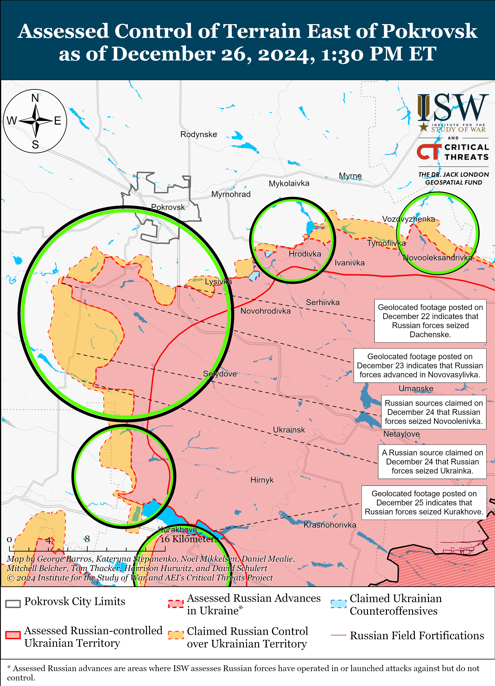
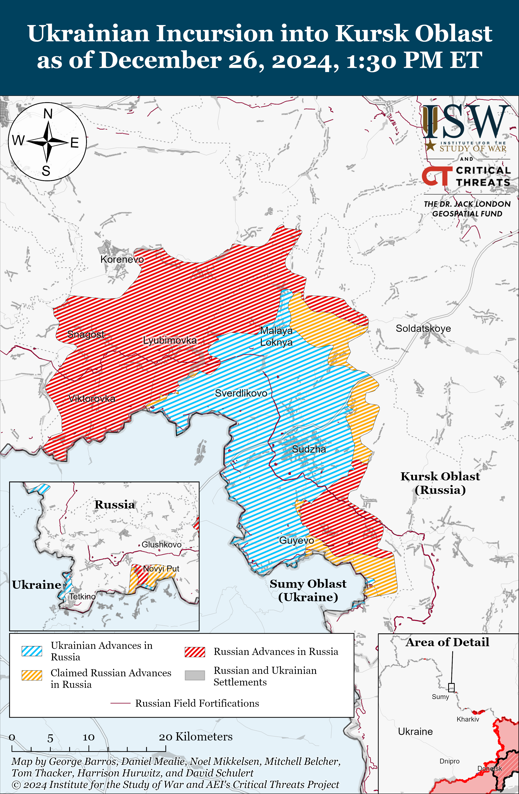
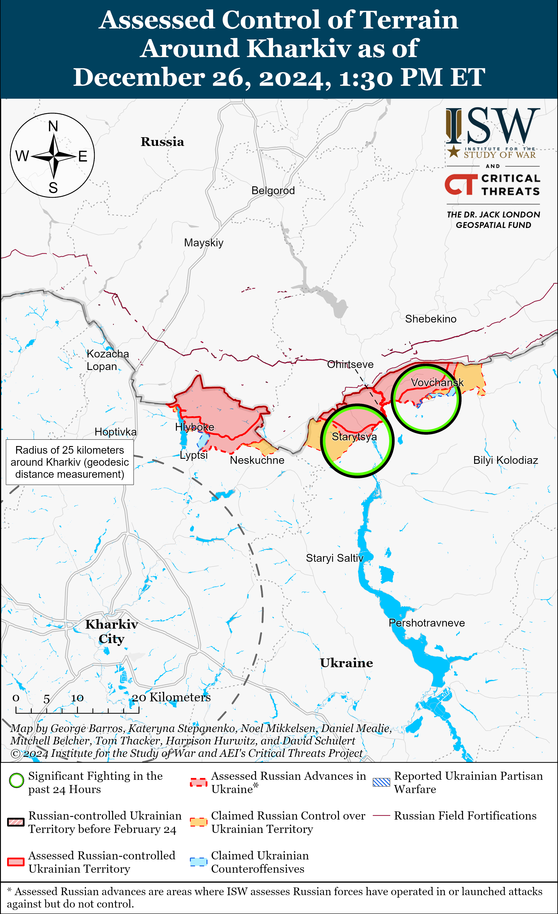
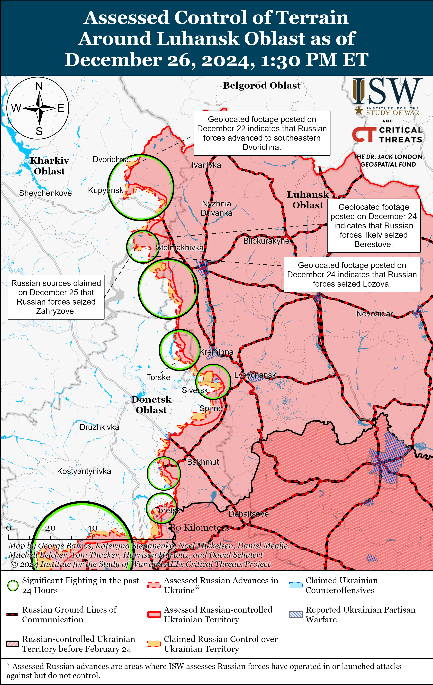
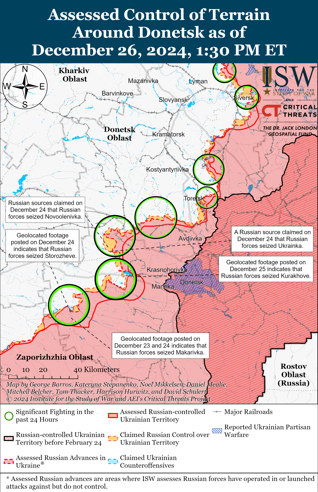
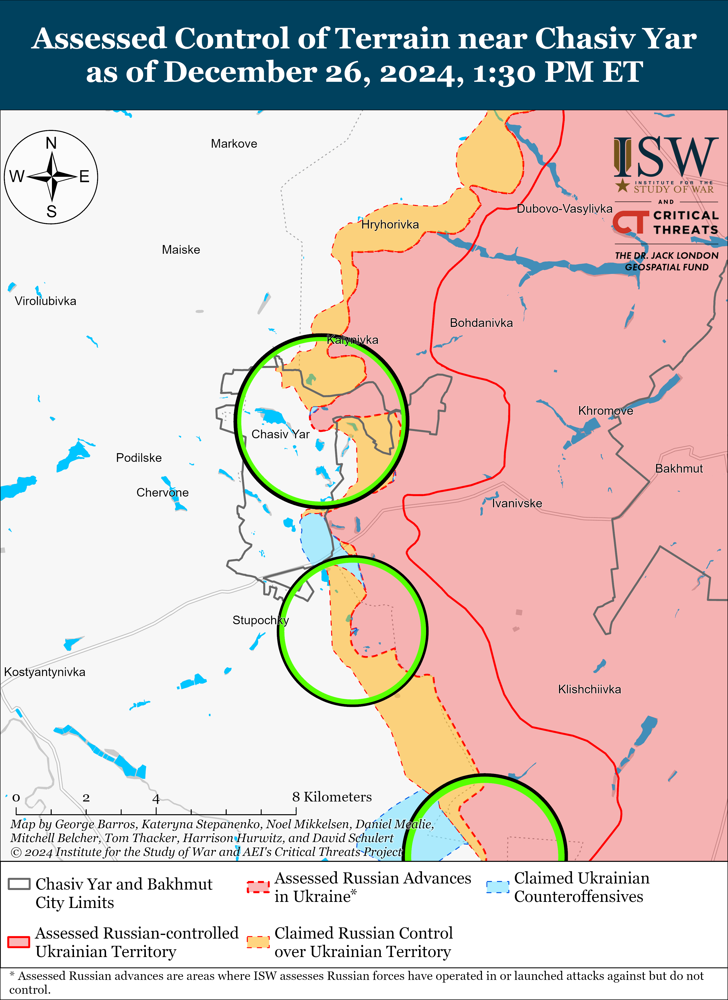
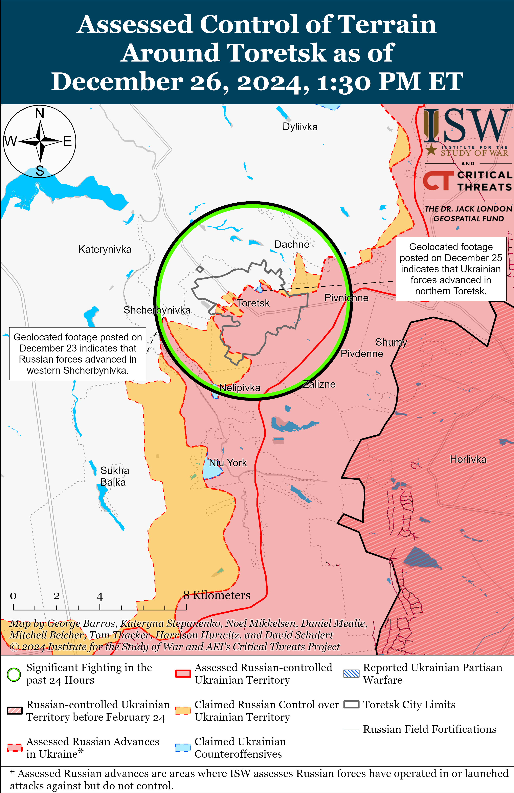
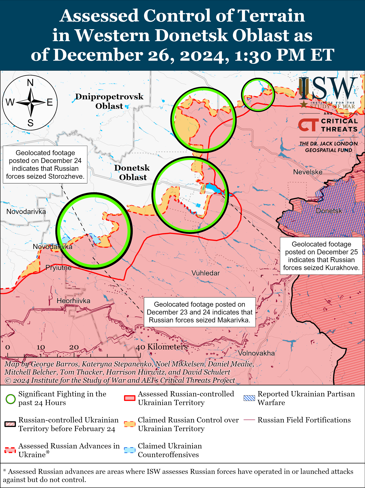
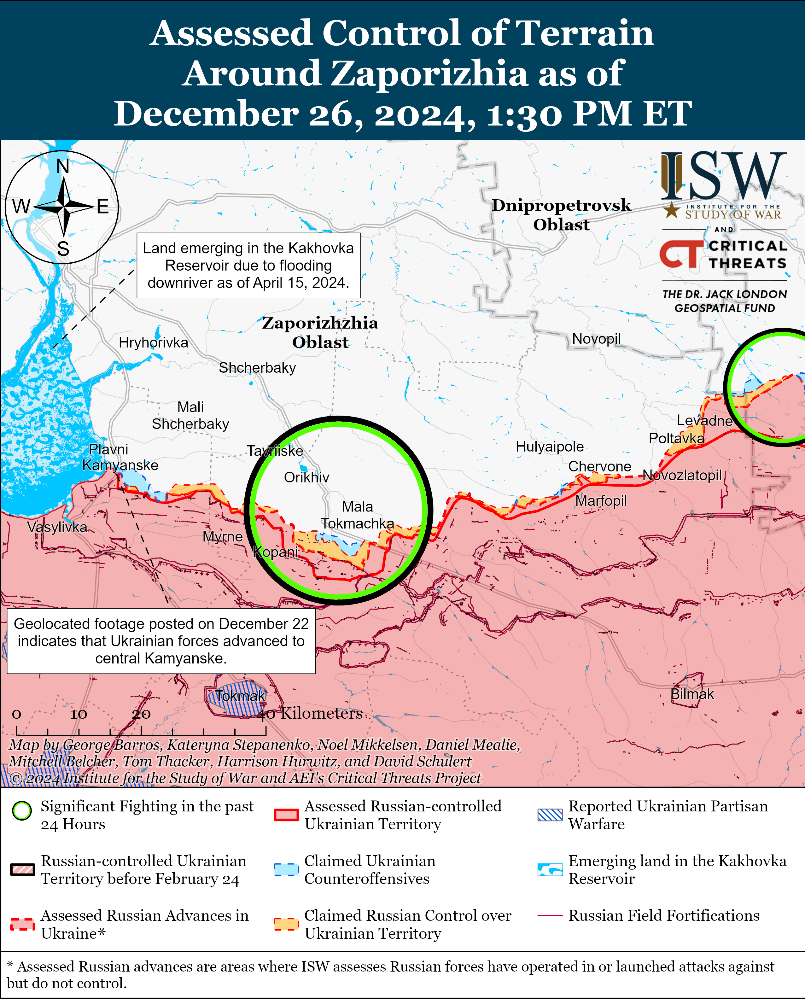
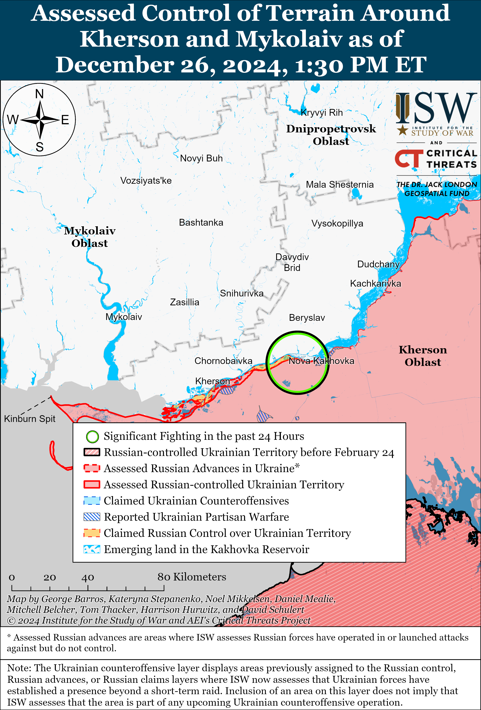

# Russian Offensive Campaign Assessment, December 26, 2024

**Kateryna Stepanenko, Angelica Evans, Christina Harward, Nicole Wolkov, Davit Gasparyan, Olivia Gibson, and Fredrick W. Kagan**

**December 26, 2024, 9:05pm ET**

**Click** [**here**](https://storymaps.arcgis.com/stories/36a7f6a6f5a9448496de641cf64bd375) **to see ISW’s interactive map of the Russian invasion of Ukraine. This map is updated daily alongside the static maps present in this report.**

**Click** [**here**](https://storymaps.arcgis.com/stories/83a2f24901c941d581c0c523ecd2619b)**to see ISW’s interactive map of Ukraine’s offensive in Kursk Oblast.**

**Click** [**here**](https://understandingwar.maps.arcgis.com/apps/instant/3dviewer/index.html?appid=1602762dbcde419bb957dea358449580) **to see ISW’s 3D control of terrain topographic map of Ukraine. Use of a computer (not a mobile device) is strongly recommended for using this data-heavy tool.**

**Click** [**here**](https://storymaps.arcgis.com/stories/733fe90805894bfc8562d90b106aa895) **to access ISW’s archive of interactive time-lapse maps of the Russian invasion of Ukraine. These maps complement the static control-of-terrain map that ISW produces daily by showing a dynamic frontline. ISW will update this time-lapse map archive monthly.**

**Note: The data cut-off for this product was 2pm ET on December 26. ISW will cover subsequent reports in the December 27 Russian Offensive Campaign Assessment.**

**Russian President Vladimir Putin explicitly rejected a suggestion reportedly considered by US President-elect Donald Trump’s team in early November 2024 that would delay Ukraine’s membership in NATO for at least a decade as a condition for ending the war in Ukraine.** Putin responded on December 26 to a journalist’s request to comment on the Trump team’s reported early November suggestion to delay Ukraine’s membership in NATO for 10 to 20 years.[1] Putin stated that it does not matter if Ukraine joins NATO “today, tomorrow, or in 10 years.” Putin’s December 26 statement is part of a series of comments he has made recently reiterating his refusal to consider compromises on his late 2021 and early 2022 demands.[2] These demands include forcing Ukraine to become a permanently neutral state that will never join NATO, imposing severe limitations on the size of the Ukrainian military, and removing the Ukrainian government.[3]

**Russian Foreign Minister Sergei Lavrov reiterated Putin’s false claims that the current Ukrainian government is illegitimate and cannot be a legitimate negotiating partner for Russia.** Lavrov claimed on December 26 during an interview with Russian and foreign media that Ukrainian President Volodymyr Zelensky is not legitimate according to Ukraine’s constitution and that Ukraine needs to hold presidential elections.[4] Kremlin officials have been deliberately misinterpreting the Ukrainian Constitution and Ukrainian law to delegitimatize Ukraine’s government and sovereignty in recent months.[5] The Kremlin’s allegations that Zelensky and the Ukrainian government are not legitimate demonstrate that the Kremlin is unwilling in engage in negotiations with Ukraine or are effectively demanding regime change in Kyiv as a precondition for negotiations. Putin and other Kremlin officials have repeatedly reiterated this false narrative about Zelensky’s alleged illegitimacy in order to blame Ukraine — and not Russia — for delaying negotiations.[6] This false narrative also promotes Putin’s demand for the removal of the legitimate, democratically elected Ukrainian government – one of the Kremlin’s ongoing maximalist demands in the war.

**Russian forces have likely seized Kurakhove following two months of intensified offensive operations aimed at seizing the settlement and eliminating the Ukrainian salient north and south of the settlement.** Geolocated footage published on December 24 and 25 indicates that Russian forces recently advanced in western Kurakhove and up to a windbreak southwest of the settlement.[7] ISW assesses that Russian forces have likely advanced to the administrative boundaries of Kurakhove and seized the settlement and the fields south of settlement and north of Dalne. Russian milbloggers claimed that elements of the Russian 5th Motorized Rifle Brigade (51st Combined Arms Army [CAA], formerly the 1st Donetsk People’s Republic Army Corps [DNR AC]) raised a flag over western Kurakhove and that elements of the 51st CAA’s 110th and 114th motorized rifle brigades and the 20th and 150th motorized rifle divisions (both of the 8th CAA, Southern Military District [SMD]) are attacking along Kurakhove’s northern and southern flanks.[8] Russian sources issued contradictory claims about the extent of Russian advances in Kurakhove: some milbloggers claimed that Russian forces advanced beyond Kurakhove towards Dachne (west of Kurakhove), while others claimed that Russian forces are unsuccessfully attacking the Kurakhivska Thermal Power Plant (TPP) just west of Kurakhove — which ISW assesses to be outside of Kurakhove’s administrative boundaries.[9] Ukraine’s Khortytsia Group of Forces acknowledged that Ukrainian forces recently lost unspecified positions in the Kurakhove direction.[10]

Russian forces spent just over two months seizing a settlement 7.3 square kilometers in size. Russian forces intensified offensive operations to seize Kurakhove in mid-October 2024, and ISW observed geolocated footage indicating that Russian forces advanced into the settlement for the first time in late October 2024.[11] The Russian military has reportedly concentrated roughly 35,000 to 36,000 troops in the Kurakhove direction in recent months to both seize the settlement and eliminate the Ukrainian pockets north and south of the settlement, and Russian forces have likely sustained significant casualties during this period of intensified offensive operations.[12] Russian forces have also conducted a large number of armored assaults within and near Kurakhove over the last two months and have likely sustained significant armored vehicle losses during their effort to seize the settlement.[13]

**Russian forces may struggle to advance rapidly further west of Kurakhove along the H-15 Kurakhove-Pokrovske highway should Ukrainian forces choose to defend in the Kurakhivska TPP and Russian forces fail to outflank Ukrainian positions in the TPP near Dachne or Ulakly.** Russian milbloggers claimed that Ukrainian forces maintain a presence in the Kurakhivska TPP west of the settlement along the H-15 highway.[14] Russian forces may struggle to advance farther westward along the H-15 highway from Kurakhove if Russian forces choose to conduct a frontal assault through the Kurakhivska TPP area and if Ukrainian forces decide to allocate sufficient manpower and materiel to defend in the area. Russian forces may attempt to bypass the TPP by advancing farther south of the highway in fields west and northwest of Dalne (south of Kurakhove) towards Ulakly (west of Kurakhove). Russian forces may also attempt to advance south from Stari Terny (northwest of Kurakhove and on the northwestern bank of the Kurakhivske Reservoir) towards Dachne (west of Kurakhove) in order to outflank Ukrainian positions at the TPP. Russian forces may try to advance north from Zelenivka (southwest of Kurakhove) towards Ulakly to threaten Ukraine’s ability to supply positions at the TPP and complicate possible future Ukrainian withdrawals from the TPP and positions in the fields south of Dachne.

**Elements of the 51st CAA have been the main forces participating in the seizure of Kurakhove amid ongoing efforts to centralize and formalize elements of the 51st CAA within the Russian military.** Elements of the 51st CAA’s 5th and 110th motorized rifle brigades have notably participated in most of the tactically significant advances in Kurakhove since mid-October 2024 and have been involved in offensive operations west of Donetsk City since Russia intensified activity in this area in at least Summer 2024.[15] Elements of the 150th Motorized Rifle Division are reportedly also operating in Kurakhove and may be overseeing the brigades’ operations in the settlement and future advances west of the settlement.[16] Russian authorities have recently intensified their efforts to formalize former DNR units under the Russian military and will likely credit and praise these forces for their role in seizing Kurakhove in the coming days.[17]

**Russian forces conducted a large series of missile and drone strikes targeting Ukrainian energy infrastructure on the night of December 24 to 25, seriously damaging thermal power plants (TPPs).** The Ukrainian Air Force reported that Russian forces launched two North Korean KN-23 ballistic missiles from Voronezh Oblast; 10 S-300/400 missiles from Belgorod Oblast; 12 Kalibr cruise missiles from the Black Sea; 50 Kh-101/55 cruise missiles from the airspace over Volgograd Oblast and the Caspian Sea; four Kh-59/69 cruise missiles from Belgorod Oblast; and 106 Shahed and decoy drones from Millerovo, Rostov Oblast; Primorsko-Akhtarsk, Krasnodar Krai; Bryansk Oblast; and Oryol Oblast.[18] The Ukrainian Air Force stated that Ukrainian forces downed 55 Kh-101/55 and Kalibr cruise missiles, four Kh-59/69 cruise missiles, and 54 Shahed and decoy drones and that 52 drones were “lost,” likely due to Ukrainian electronic warfare (EW) interference. The Ukrainian Air Force reported that Russian forces targeted Ukrainian fuel and energy facilities in Kharkiv, Kyiv, Dnipropetrovsk, Poltava, Zhytomyr, Ivano-Frankivsk, and Zaporizhia oblasts. Ukrainian President Volodymyr Zelensky stated on December 25 that Russian forces aim to cause a full blackout in Ukraine.[19] Ukrainian officials stated on December 25 that Russian forces struck and damaged energy infrastructure in Vinnytsia Oblast and Kremenchutskyi Raion, Poltava Oblast, and conducted strikes against energy facilities in Dnipropetrovsk Oblast.[20] Ukrainian energy operator DTEK reported that Russian strikes seriously damaged TPP equipment and that Russian forces have struck DTEK’s TPPs over 200 times since the start of Russia’s full-scale invasion in February 2022.[21] DTEK added that the December 24 to 25 strike series was the 13th massive strike on Ukrainian energy infrastructure and the 10th massive strike on DTEK’s energy enterprises since the start of Russia’s full-scale invasion.

**Ukrainian forces conducted a successful strike on December 25 against the command post of a Russian unit operating in Kursk Oblast.** The Ukrainian Armed Forces Center for Strategic Communications (StratCom) stated on December 26 that Ukrainian forces struck the command post of the Russian 810th Naval Infantry Brigade (Black Sea Fleet [BSF]) in Lgov, Kursk Oblast on December 25, killing the brigade’s deputy commander and staff officers.[22] Russian and Ukrainian sources stated that Ukrainian forces used HIMARS to conduct the strike.[23] Elements of the 810th Naval Infantry Brigade have been conducting assaults in Kursk Oblast and have reportedly trained North Korean personnel in Kursk Oblast.[24] Elements of the 810th Naval Infantry Brigade also notably acknowledged in December 2023 that its personnel were deliberately using chemical weapons in Ukraine and then attempted to hide this evidence of an apparent violation of the Chemical Weapons Convention.[25]

**Ukrainian forces struck a Russian ammunition depot in Rostov Oblast and Russian defense industrial base (DIB) facilities in Rostov and Tambov oblasts on December 25 and 26.** Ukrainian outlet *Suspilne* reported that a source in Ukraine’s Security Service (SBU) stated that the SBU conducted a drone strike that destroyed an ammunition depot at the Kadamovsky military training ground near Novocherkassk, Rostov Oblast.[26] The source stated that Russian forces used the ammunition depot to supply Russian forces in the Kramatorsk (Chasiv Yar) direction. Ukrainian Armed Forces Center for Strategic Communications (StratCom) stated on December 26 that the Ukrainian Air Force conducted a high-precision strike on a defense industrial facility in Kamyansk-Shakhtinsky, Rostov Oblast, which produces solid rocket fuel for ballistic missiles.[27] Russian opposition media outlet *Astra* published footage and reported on December 26 that its sources stated that debris from downed Ukrainian drones caused a fire near the boiler room of a Transnefteprodukt facility in Novonikolskoye, Tambov Oblast.[28] Locals also told *Astra* that Ukrainian drones damaged the “Progres” Plant in Michurinsk, Tambov Oblast, which reportedly produces technical equipment for aircraft control systems, rocket technology, civilian electronic equipment, and equipment for oil and gas pipelines.

**A Russian air defense system reportedly shot an Azerbaijan Airlines Embraer 190 passenger aircraft over the Republic of Chechnya on December 25, after which the plane crashed in Aktau, Kazakhstan.** The aircraft was flying from Baku, Azerbaijan to Grozny, Chechnya, and there were 62 passengers and five crew members aboard theplane, of whom 32 reportedly survived the crash.[29] Four Azerbaijani sources familiar with Azerbaijan’s official investigation into the crash told *Reuters* that preliminary investigation results suggest that a Russian Pantsir-S air defense system struck the plane after electronic warfare (EW) jamming caused the plane’s communications to malfunction as the plane approached Grozny.[30] A US official told *Reuters* that there were early indications that a Russian anti-aircraft system may have struck the plane, and *Wall Street Journal* (WSJ) reported that aviation experts think that videos of the wreckage suggestthat a Russian air defense system hit the plane.[31] Kazakh officials neither confirmed nor denied these preliminary investigation reports, and Kremlin Spokesperson Dmitry Peskov similarly refused to comment on the plane crash before the results of the final investigation emerged.[32] Russian Federal Air Transport Agency (Rosaviation) Spokesperson Artyom Korenyako claimed that the plane crashed at 0930 Moscow time after the pilot chose to land atthe Aktau airport after the plane ”collided with birds.”[33] Russian sources also originally made contradicting claims that the plane was rerouted to Mineralnye Vody Airport, Stavropol Krai (approximately 270 kilometers northwest of Grozny) and Makhachkala Airport (about 180 kilometers southeast of Grozny) due to the threat of drone strikes or foggy weather in Grozny.[34]

**A Russian insider source, who is reportedly affiliated with Russian law enforcement, claimed that an air defense missile likely struck the plane at an altitude of 2,400 meters approximately 18 kilometers northwest of the Grozny airport over Naursky Raion.**[35] The insider source noted that there are several Russian military bases in Naursky Raion that have air defense systems and that the Russian Ministry of Defense (MoD) recently placed several Pantsir systems in Chechnya following Ukrainian drone strikes against the region.[36]

The insider source later published an alleged full transcript of the communication between the plane’s crew and a dispatcher in Grozny.[37] ISW is unable to authenticate the transcript. The alleged transcript suggests that the pilot attempted to land the plane three times in Grozny between 0736 and 0811 Moscow time and that the crew informed the dispatcher several times of the complete failure of the GPS and communication systems as soon as the plane began to descend. The dispatcher also apparently lost radar contact with the plane on numerous occasions. The alleged transcript suggests that the pilot decided to turn the plane around towards Baku at around 0811 before contacting the dispatcher at 0816 with an alarming report that the plane’s controls had failed and that a flock of birds had struck the plane. The insider source noted that the crew may have mistaken an explosion for a collision with a flock of birds. The alleged transcript suggests that the pilot informed the dispatcher that the crew needed help, that the plane was losing control, and that the plane’s hydraulics had stopped working. The alleged transcript suggests that the pilot began to search for an alternative airport in Russia for an emergency landing, notably asking the dispatcher about the weather in the Mineralnye Vody Airport and then requesting information about the Makhachkala Airport. The alleged transcript indicated that the pilot also contacted dispatchers at the Rostov-on-Don Airport (about 744 km northwest of Grozny). *Euronews*reported that sources in Azerbaijan’s government stated that Russian authorities did not allow the aircraft to land at any Russian airports and ordered the plane to fly across the Caspian Sea towards Aktau despite the pilot’s requests for an emergency landing.[38] *Reuters* reported that the Makhachkala Airport was closed on the morning of December 25 and that Russian officials did not explain why the plane crossed the Caspian Sea.[39]

**Japan will provide Ukraine with $3 billion in non-lethal assistance generated solely from the proceeds of frozen Russian assets.[40]** Ukrainian President Volodymyr Zelensky thanked Japanese Prime Minister Shigeru Ishiba on December 25 for the new aid package and for additional assistance for energy equipment and the construction of shelters in Ukraine. Japan’s transfer of revenues from frozen Russian assets is likely part of the larger G7 Extraordinary Revenue Acceleration (ERA) Loans initiative to send $50 billion worth of profits from frozen Russian assets to support Ukraine’s budgetary, military, and reconstruction assistance throughout 2025.[41]

**Key Takeaways:**

- **Russian President Vladimir Putin explicitly rejected a suggestion reportedly considered by US President-elect Donald Trump’s team in early November 2024 that would delay Ukraine’s membership in NATO for at least a decade as a condition for ending the war in Ukraine.**
- **Russian Foreign Minister Sergei Lavrov reiterated Putin’s false claims that the current Ukrainian government is illegitimate and cannot be a legitimate negotiating partner for Russia.**
- **Russian forces have likely seized Kurakhove following two months of intensified offensive operations aimed at seizing the settlement and eliminating the Ukrainian salient north and south of the settlement.**
- **Russian forces may struggle to advance rapidly further west of Kurakhove along the H-15 Kurakhove-Pokrovske highway should Ukrainian forces choose to defend in the Kurakhivska TPP and Russian forces fail to outflank Ukrainian positions in the TPP near Dachne or Ulakly.**
- **Elements of the 51st CAA have been the main forces participating in the seizure of Kurakhove amid ongoing efforts to centralize and formalize elements of the 51st CAA within the Russian military.**
- **Russian forces conducted a large series of missile and drone strikes targeting Ukrainian energy infrastructure on the night of December 24 to 25, seriously damaging thermal power plants (TPPs).**
- **Ukrainian forces conducted a successful strike on December 25 against the command post of a Russian unit operating in Kursk Oblast.**
- **Ukrainian forces struck a Russian ammunition depot in Rostov Oblast and Russian defense industrial base (DIB) facilities in Rostov and Tambov oblasts on December 25 and 26.**
- **A Russian air defense system reportedly shot an Azerbaijan Airlines Embraer 190 passenger aircraft over the Republic of Chechnya on December 25, after which the plane crashed in Aktau, Kazakhstan.**
- **A Russian insider source, who is reportedly affiliated with Russian law enforcement, claimed that an air defense missile likely struck the plane at an altitude of 2,400 meters approximately 18 kilometers northwest of the Grozny airport over Naursky Raion.**
- **Japan will provide Ukraine with $3 billion in non-lethal assistance generated solely from the proceeds of frozen Russian assets.**
- **Ukrainian forces recently advanced near Toretsk, and Russian forces recently advanced near Kupyansk, Toretsk, Pokrovsk, and Velyka Novosilka.**
- **Russian milbloggers acknowledged that the Russian Ministry of Defense (MoD) is attempting to monopolize crowdfunding efforts for the Russian military amid ongoing fallout from the deaths of two Russian drone operators in September 2024.**

***We do not report in detail on Russian war crimes because these activities are well-covered in Western media and do not directly affect the military operations we are assessing and forecasting. We will continue to evaluate and report on the effects of these criminal activities on the Ukrainian military and the Ukrainian population and specifically on combat in Ukrainian urban areas. We utterly condemn Russian violations of the laws of armed conflict and the Geneva Conventions and crimes against humanity even though we do not describe them in these reports.***

- Ukrainian Operations in the Russian Federation
- Russian Main Effort – Eastern Ukraine (comprised of three subordinate main efforts)
- Russian Subordinate Main Effort #1 – Push Ukrainian forces back from the international border with Belgorod Oblast and approach to within tube artillery range of Kharkiv City
- Russian Subordinate Main Effort #2 – Capture the remainder of Luhansk Oblast and push westward into eastern Kharkiv Oblast and encircle northern Donetsk Oblast
- Russian Subordinate Main Effort #3 – Capture the entirety of Donetsk Oblast
- Russian Supporting Effort – Southern Axis
- Russian Air, Missile, and Drone Campaign
- Russian Mobilization and Force Generation Efforts
- Russian Technological Adaptations
- Activities in Russian-occupied areas
- Significant Activity in Belarus

**Ukrainian Operations in the Russian Federation**

Fighting continued within the main Ukrainian salient in Kursk Oblast on December 25 and 26 but there were no confirmed advances. Fighting continued southeast of Korenevo near Leonidovo; southeast of Sudzha near Cherkasskaya Konopelka; south of Sudzha near Guyevo and Kurilovka; and in the forests in Sudzhansky Raion.[42] Russian milbloggers claimed that Ukrainian forces counterattacked in Sudhzansky Raion, including near Guyevo, and Leonidovo.[43] A Russian milblogger claimed on December 25 that Ukrainian counterattacks are slowing the pace of Russian advances in Kursk Oblast.[44] A Ukrainian officer operating in Kursk Oblast stated on December 25 that the Russian military command is deploying better trained Russian forces who are better provisioned.[45] The deputy commander of a Ukrainian battalion operating in Kursk Oblast reported on December 25 that Russian forces have improved their efforts by increasing the number of personnel and improving ammunition supplies.[46] Elements of the Russian 98th Airborne (VDV) Division are reportedly operating near Kruglenkoye (southeast of Korenevo); and elements of the 106th VDV Division, including its 51st VDV Regiment; the 83rd VDV Brigade, the 810th Naval Infantry Brigade (Black Sea Fleet [BSF], Southern Military District [SMD]), the ”Pyatnashka” International Volunteer Brigade, and the Chechen ”Akhmat” Spetsnaz are reportedly operating in Kursk Oblast.[47]

Ukraine’s Main Military Intelligence Directorate (GUR) reported on December 26 that North Korean forces continue to suffer losses in combat operations in Kursk Oblast, including near Novoivanovka (southeast of Korenevo).[48] The GUR stated that North Korean forces in Kursk Oblast do not have sufficient drinking water due to issues with logistics. The GUR noted that recent Ukrainian strikes likely hit a key communication node for North Korean forces.

**Russian Main Effort – Eastern Ukraine**

**Russian Subordinate Main Effort #1 – Kharkiv Oblast (Russian objective: Push Ukrainian forces back from the international border with Belgorod Oblast and approach to within tube artillery range of Kharkiv City)**

Russian forces continued ground attacks in the Kharkiv direction on December 25 and 26 but did not make any confirmed advances. Russian sources claimed on December 25 that Russian forces advanced near Starytsya (northeast of Kharkiv City) along the Siverskyi Donets River and toward Derhachi (north of Kharkiv City) and Zolochiv (northwest of Kharkiv City), but ISW has not observed confirmation of these claims.[49] Russian forces conducted offensive operations north of Kharkiv City near Vysoka Yaruha and Lyptsi and northeast of Kharkiv City near Starytsya and Vovchansk on December 24 to 26.[50] A Russian milblogger claimed that Russian forces are continuing assaults near Kozacha Lopan (north of Kharkiv City) but that Ukrainian forces continue to hold positions on nearby tactical heights.[51] Another Russian milblogger claimed that Ukrainian forces counterattacked north of Kharkiv City from Lyptsi toward Hlyboke.[52]

**Russian Subordinate Main Effort #2 – Luhansk Oblast (Russian objective: Capture the remainder of Luhansk Oblast and push westward into eastern Kharkiv Oblast and northern Donetsk Oblast)**

Russian forces recently advanced southeast and southwest of Kupyansk amid continued offensive operations along the Kupyansk-Svatove-Kreminna line on December 25 and 26. Geolocated footage published on December 24, 25, and 26 indicates that Russian forces recently seized Lozova (southeast of Kupyansk) and Berestove (northeast of Lozova) and advanced along Stepova Street in southern Zahryzove (southeast of Kupyansk) and in eastern Novoyehorivka (southwest of Svatove).[53] Russian milbloggers claimed that Russian forces seized Zahryzove (southeast of Kupyansk) and advanced along the R-79 highway between Dvorichna and Zapadne (both north of Kupyansk); to eastern Ivanivka after crossing the Zherebets River; west of Makiivka; and north of Nevske (all northwest of Kreminna).[54] ISW has not observed confirmation of these claims, however. Russian forces continued offensive operations north of Kupyansk near Kindrashivka; northeast of Kupyansk near Dvorichna; northwest of Kupyansk near Vilshana; east of Kupyansk near Petropavlivka; southeast of Kupyansk near Kolisnykivka, Zahryzove, Stelmakhivka, and Lozova; southwest of Svatove near Cherneshchyna, Hrekivka, Novoyehorivka, Makiivka, Tverdokhlibove, Serhiivka, and Novoserhiivka; west of Svatove near Kopanky, Nova Kruhlyakivka, and Zelenyi Hai; northwest of Kreminna near Yampolivka, Terny, and Druzhelyubivka; west of Kreminna near Torske; and southwest of Kreminna near Serebryanske forest area and Hryhorivka from December 24 to 26.[55] Elements of the Russian 27th Motorized Rifle Brigade (1st Guards Tank Army [GTA], Moscow Military District [MMD]) are reportedly operating near Kupyansk and Lozova; elements of the 3rd Motorized Rifle Division (20th Combined Arms Army [CAA], MMD) are reportedly operating near Lozova; elements of the 423rd Motorized Rifle Regiment and the 12th Tank Regiment (both of the 4th Tank Division, 1st GTA, MMD) are reportedly operating near Zeleny Hai; and elements of the 375th Separate Anti-Tank Artillery Battalion (47th Tank Division, 1st GTA, MMD) are operating in the Kupyansk direction.[56]

**Russian Subordinate Main Effort #3 – Donetsk Oblast (Russian objective: Capture the entirety of Donetsk Oblast, the claimed territory of Russia’s proxies in Donbas)**

Russian forces continued offensive operations northeast of Siversk near Bilohorivka on December 24 to 26 but did not make any confirmed advances.[57] Ukrainian National Guard Commander Brigadier General Oleksandr Pivnenko published footage on December 25 showing Ukrainian drone operators repelling a Russian infantry assault in the Siversk direction.[58] A Russian source claimed that Russian forces have recently intensified assaults near Bilohorivka.[59] Russian milbloggers claimed that Russian forces advanced up to one kilometer toward Siversk from the south and near Vyimka (southeast of Siversk).[60] ISW has not observed confirmation of these claims, however.

Russian forces continued offensive operations in the Chasiv Yar direction on December 25 and 26 but did not make any confirmed advances. Russian forces conducted offensive operations near Chasiv Yar itself and south of Chasiv Yar near Stupochky, Bila Hora, and Predtechyne on December 24 to 26.[61] Ukrainian Khortytsia Group of Forces Spokesperson Viktor Trehubov stated on December 26 that Russian forces are accumulating reserves near Chasiv Yar in preparation for future assaults and remain focused on seizing the Refractory Plant in central Chasiv Yar.[62] Trehubov further noted that Russian forces are prioritizing the seizure of Chasiv Yar due to the town’s location on a tactical height that provides enhanced visibility of the surrounding area. A Russian milblogger claimed that Russian forces are advancing in Pivnichnyi Microraion in northern Chasiv Yar and that Russian forces recently retreated from the Refractory Plant.[63] Elements of the Russian 98th Airborne (VDV) Division and the 7th Military Base (49th Combined Arms Army [CAA], Southern Military District [SMD]) and reconnaissance elements of the 88th “Hispaniola” Volunteer Brigade (Russian Volunteer Corps) are reportedly operating in the Chasiv Yar direction.[64]

Ukrainian forces recently regained lost positions in the Toretsk direction amid continued Russian offensive operations in the area on December 25 and 26. Geolocated footage published on December 25 indicates that Ukrainian forces regained lost positions along Papanina Street in northern Toretsk.[65] Russian milbloggers claimed that Russian forces advanced to the Toretsk Mine in northern Toretsk and up to the central market along Mayakovskoho Street in central Toretsk on December 25 and 26.[66] Russian forces conducted offensive operations in Toretsk itself, northeast of Toretsk near Dachne and Dyliivka, east of Toretsk near Druzhba, and west of Toretsk near Shcherbynivka on December 24 to 26.[67]

Russian forces recently advanced in the Pokrovsk direction amid continued offensive operations in the area on December 25 and 26. Geolocated footage published on December 24 and 25 indicates that Russian forces recently advanced west of Pushkine and in central Novyi Trud (both south of Pokrovsk).[68] Additional geolocated footage published on December 18 indicates that Russian forces advanced east of Ukrainka (southwest of Pushkine).[69] Russian milbloggers claimed that Russian forces have almost seized Novovasylivka (southeast of Pokrovsk) and advanced south of Novovasylivka, to Uspenivka (west of Novovasylivka), up to six kilometers wide and 1.8 kilometers deep between Novovasylivka and Novoyelyzavetivka (south of Novovasylivka), up to 5.6 kilometers wide and 1.5 kilometers deep south of Vovkove (southwest of Pokrovsk), west of Pishchane (southwest of Pokrovsk and east of Vovkove), along the Donetska railway northeast of Shevchenko (south of Pokrovsk) and east of Sukhi Yar (southeast of Pokrovsk), and north and northwest of Hrodivka (east of Pokrovsk).[70] The Russian Ministry of Defense (MoD) claimed on December 25 that Russian forces seized Novyi Trud (south of Pokrovsk).[71] A Russian source claimed that Russian forces crossed the Kazennyi Torets River east of Myrolyubivka (east of Pokrovsk).[72] ISW has not observed confirmation of these claims, however. A Russian milblogger claimed that Russian forces are less than 2.5 kilometers from the T-0406 highway southwest of Pokrovsk, but ISW has only observed confirmation that Russian forces are roughly 3.5 kilometers from the road.[73] Russian forces conductedoffensive operations near Pokrovsk itself; east of Pokrovsk near Zelene Pole, Vozdvyzhenka, Myrolyubivka, and Promin; southeast of Pokrovsk near Lysivka; south of Pokrovsk near Dachenske, Novyi Trud, Zelene, and Shevchenko; and southwest of Pokrovsk near Novotroitske, Vovkove, Novovasylivka, Pishchane, Novoyelyzavetivka, and Novoolenivka on December 24 to 26.[74] Russian milbloggers claimed that Ukrainian forces counterattacked near Pishchane, Novovasylivka, and Novotroitske and regained lost positions on the northeastern outskirts of Vovkove.[75] A servicemember in a Ukrainian brigade operating in the Pokrovsk direction stated on December 26 that Russian forces are advancing west of Pokrovsk as part of efforts to reach the M-30 Pokrovsk-Pavlohrad highway.[76] The servicemember stated that Russian forces have only been attacking in small infantry groups consisting of two to five people for the past two weeks and have not been using heavy equipment. Elements of the Russian 15th and 30th motorized rifle brigade (both of the 2nd CAA, Central Military District [CMD]) are reportedly operating near Novoolenivka, Vovkove, Pishchane, and Solone (southwest of Pokrovsk); and drone operators of the 38th Motorized Rifle Brigade (35th CAA, Eastern Military District [EMD]) and elements of the “Vega” Spetsnaz Detachment (24th Spetsnaz Brigade, Main Intelligence Directorate of the Russian General Staff [GRU]) are reportedly operating in the Pokrovsk direction.[77]

*See topline text for reports of Russian advances in and west of Kurakhove.*

Russian milbloggers claimed that Russian forces operating northwest of Kurakhove advanced along the Stari Terny-Sontsivka-Zorya line westward towards Slovyanka, Petropavlivka, and Shevchenko and recently seized Sontsivka.[78] ISW has not observed confirmation of these claims, however. Ukraine’s Khortytsia Group of Forces Spokesperson Viktor Trehubov stated that Russian forces are using cloaks that disrupt Ukrainian thermal imaging to infiltrate Ukrainian positions in the Kurakhove direction.[79] Russian forces continued assaults near Kurakhove itself; northwest of Kurakhove near Yasenove, Petropavlivka, Slovyanka, and Shevchenko and toward Andriivka; west of Kurakhove towards Dachne; and south of Kurakhove near Dalne on December 24 to 26.[80] Elements of the Russian 242nd Motorized Rifle Regiment (20th Motorized Rifle Division, 8th CAA, SMD) are reportedly operating in the Kurakhove direction.[81]

Russian forces continued offensive operations north and northwest of Vuhledar on December 24 to 26 but did not make any confirmed advances. The Russian MoD claimed on December 26 that Russian forces seized Hihant (northwest of Vuhledar), but ISW assesses that Russian forces seized the settlement as of December 20.[82] Russian milbloggers claimed that Russian forces are less than five kilometers away from the C051122 Yantarne-Dachne road (northwest of Vuhledar) and that Ukrainian forces maintain positions on the right (north) bank of the Sukhi Yaly River.[83] A Kremlin-affiliated milblogger claimed that Russian forces seized Sukhi Yaly (northwest of Vuhledar) and advanced west of Zelenivka (northwest of Sukhi Yaly), and Ukrainian military observer Kostyantyn Mashovets previously reported that Russian forces seized both settlements around December 19.[84] Russian forces continued offensive operations north of Vuhledar near Uspenivka and northwest of Vuhledar near Kostyantynopolske, Yantarne, Kostyantynopil, and Rozlyv on December 24 to 26.[85] Elements of the Russian 2nd Motorized Rifle Battalion of the 37th Motorized Rifle Brigade (36th CAA, EMD) are reportedly operating near the T-05-18 Bahatyr-Velyka Novosilka road.[86]

Russian forces recently advanced in the Velyka Novosilka direction amid continued offensive operations in the area on December 25 and 26. Geolocated footage published on December 25 indicates that Russian forces recently advanced west of Neskuchne (southwest of Velyka Novosilka).[87] A Russian milblogger claimed that Russian forces advanced north and northeast of Rivnopil (southwest of Velyka Novosilka), but ISW has not observed confirmation of this claim.[88] Russian forces continued attacking near Velyka Novosilka itself; northeast of Velyka Novosilka near Rozdolne; north of Velyka Novosilka near Novyi Komar; west of Velyka Novosilka near Novosilka; southwest of Velyka Novosilka near Neskuchne; and south of Velyka Novosilka near Storozheve and Blahodatne on December 24 to 26.[89] Elements of the Russian 1461st Motorized Rifle Regiment (reportedly assigned to the 35th CAA, EMD), 14th Spetsnaz Brigade (GRU), 60th Motorized Rifle Brigade, and 127th Motorized Rifle Division (both of the 5th CAA, EMD) are reportedly operating near Velyka Novosilka.[90]

**Russian Supporting Effort – Southern Axis (Russian objective: Maintain frontline positions and secure rear areas against Ukrainian strikes)**

Russian forces continued offensive operations in western Zaporizhia Oblast on December 25 and 26 but did not make any confirmed advances. Russian milbloggers claimed on December 25 that Russian forces advanced south and southwest of Novodanylivka (north of Robotnye) and near Kamyanske (northwest of Robotnye and south of Zaporizhia City).[91] ISW has not observed confirmation of these claims, however. Russian forces conducted offensive operations northwest of Robotyne near Novoandriivka and north of Robotyne near Novodanylivka on December 24 to 26.[92] A Russian milblogger claimed that Ukrainian forces counterattacked in the Kamyanske direction.[93] Other Russian milbloggers claimed that Ukrainian forces are not conducting offensive actions near Kamyanske, however.[94] Sniper elements of the Russian 14th Guards Spetsnaz Brigade (Russian General Staff’s Main Directorate [GRU]) and elements of the 247th Airborne (VDV) Regiment (7th VDV Division) are reportedly operating in the Zaporizhia direction.[95]

Russian forces continued offensive operations in the Dnipro direction and on the islands in the Dnipro River Delta on December 24 to 26 but did not make any confirmed advances.[96] Ukrainian Southern Group of Forces Spokesperson Colonel Vladyslav Voloshyn stated on December 25 that Russian forces are attempting to conduct reconnaissance-in-force operations in the Dnipro direction and that Russian forces are deploying two to three boats with squads of five to seven soldiers in attempts to land on the west (right) bank and in the island zone, namely on Kozatskyi Island (northeast of Kherson City).[97] Ukrainian Kherson Oblast Military Administration Head Oleksandr Prokudin reported on December 26 that Ukrainian officials have noticed increased Russian activity in the Kherson direction and that Ukrainian forces know where Russian forces are unsuccessfully trying to gain a foothold on the islands and on the right bank.[98]

**Russian Air, Missile, and Drone Campaign (Russian Objective: Target Ukrainian military and civilian infrastructure in the rear and on the frontline)**

*See topline text for updates on Russian strikes against Ukraine overnight on December 24 to 25.*

Russian forces conducted a limited series of drone strikes against Ukraine on the night of December 25 to 26. The Ukrainian Air Force reported that Russian forces launched 31 Shahed and other strike drones from Oryol Oblast and Millerovo, Rostov Oblast.[99] The Ukrainian Air Forces stated that Ukrainian forces downed 20 drones over Kharkiv, Kyiv, Chernihiv, and Dnipropetrovsk oblasts and that 11 Russian decoy drones were “lost,” likely due to Ukrainian electronic warfare (EW) interference, but did not cause any damage. Kharkiv City Mayor Ihor Terekhov reported that Russian forces struck an apartment building with a “Molniya” drone.[100]

**Russian Mobilization and Force Generation Efforts (Russian objective: Expand combat power without conducting general mobilization)**

Russian milbloggers acknowledged that the Russian Ministry of Defense (MoD) is attempting to monopolize crowdfunding efforts for the Russian military amid ongoing fallout from the deaths of two Russian drone operators in September 2024. A Russian milblogger praised the MoD’s efforts to formalize crowdfunding efforts but noted that the MoD still needs to address pervasive issues of Russian commanders misusing crowdfunded equipment.[101] The milblogger noted that the deaths of two prominent drone operators in the 87th Separate Rifle Regiment (1st “Slavic” Motorized Rifle Brigade, 51st Combined Arms Army [CAA], formerly 1st Donetsk People’s Republic Army Corps [DNR AC]) — Junior Sergeant Dmitry Lysakovsky (alias Goodwin) and Lieutenant Colonel Sergey Gritsai (alias Ernest) — in early September 2024 and the possible theft of their equipment following their deaths are indicative of these ongoing issues. ISW previously assessed that the Russian MoD intended to impose further restrictions on volunteer crowdfunding efforts as part of its long-term force and procurement restructuring efforts.[102]

Former Roscosmos (Russian space agency) head and Zaporizhia Oblast occupation senator Dmitry Rogozin claimed on December 25 that the Russian BARS-Sarmat Detachment (Russian Combat Army Reserve) recently became part of the Russian Airborne (VDV) Forces and that their first crew of drone operators deployed to the frontline alongside VDV forces on December 21.[103]

A Russian insider source claimed on December 26 that Russian authorities are appointing veterans of the war in Ukraine to leadership positions within Russian military-political youth organizations in order to further the Kremlin’s efforts to militarize and indoctrinate youth in Russia and occupied Ukraine into Russian historical and cultural narratives.[104] The insider source claimed that Russian authorities are also using leadership positions within youth military-political organizations to “test” the competencies of Russian veterans before promoting them to leadership positions in more significant areas of the Russian government. The insider source noted that the Kremlin is forming a new elite class comprised of veterans of the war in Ukraine within Russian society.

**Russian Technological Adaptations (Russian objective: Introduce technological innovations to optimize systems for use in Ukraine)**

Alexei Rogozin, son of the Dmitry Rogozin, claimed on December 26 that he assesses that drone swarm systems will be the main technological development in Ukraine in 2025.[105] Rogozin questioned which side will be the first to introduce the new technology, and a Russian milblogger responded that there is “no chance” that Russia will be able to keep up with such innovations.[106]

**Activities in Russian-occupied areas (Russian objective: Consolidate administrative control of annexed areas; forcibly integrate Ukrainian citizens into Russian sociocultural, economic, military, and governance systems)**

Permanent Representative to Ukrainian President for Crimea Olha Kuryshko reported that Russia relocated approximately one million Russian nationals and residents of other occupied Ukrainian territories to occupied Crimea over the past 10 years.[107] Kuryshko noted that Russian occupation officials have changed 35 percent of the make-up of the Crimean population since 2014.

**Significant activity in Belarus (Russian efforts to increase its military presence in Belarus and further integrate Belarus into Russian-favorable frameworks)**

Belarusian President Alexander Lukashenko announced during the meeting of the Supreme Eurasian Economic Council in St. Petersburg on December 26 that Russia will deploy roughly 10 Oreshnik ballistic missile systems to Belarus.[108] Lukashenko added that Belarus would welcome further deployments of Oreshnik missile systems if Russia wants to do so. Lukashenko appealed to Russian President Vladimir Putin on December 6 for Russia to deploy Oreshniks to Belarus under the condition that the Belarusian military-political leadership would determine the Oreshnik’s targets should the missile ever launch from Belarusian territory.[109] Lukashenko made his December 6 appeal after Russia and Belarus signed of a new Union State treaty on security guarantees, which supports the Kremlin’s strategic effort to de facto annex Belarus and further expand the Russian military’s presence in Belarus through the Union State framework. ISW assessed that Lukashenko was likely trying to preserve Belarusian sovereignty by advocating that Belarus control Russian weapons deployed in Belarus – an endeavor Lukashenko has historically failed at.

Iranian Islamic Revolutionary Guard Corps (IRGC)-affiliated *Fars News Agency* reported on December 25 that a Belarusian military delegation visited the Iranian Artesh Marine Training Center in Manjil, Gilan Province to observe specialized training programs.[110]

**Note: ISW does not receive any classified material from any source, uses only publicly available information, and draws extensively on Russian, Ukrainian, and Western reporting and social media as well as commercially available satellite imagery and other geospatial data as the basis for these reports. References to all sources used are provided in the endnotes of each update.**

[1] http://kremlin dot ru/events/president/news/75974 ; https://www.wsj.com/world/trump-presidency-ukraine-russia-war-plans-008655c0

[2] https://understandingwar.org/backgrounder/russian-offensive-campaign-assessment-december-19-2024

[3] https://understandingwar.org/backgrounder/russian-offensive-campaign-assessment-december-19-2024

[4] https://mid dot ru/ru/foreign\_policy/news/1989213/

[5] https://isw.pub/UkrWar121624 ; https://isw.pub/UkrWar060724 ; https://isw.pub/UkrWar052824; https://understandingwar.org/backgrounder/russian-offensive-campaign-assessment-december-19-2024

[6] https://isw.pub/UkrWar121624 ; https://isw.pub/UkrWar060724 ; https://isw.pub/UkrWar052824; https://understandingwar.org/backgrounder/russian-offensive-campaign-assessment-december-19-2024

[7] https://t.me/creamy\_caprice/7929?single; https://t.me/Sladkov\_plus/12129; https://x.com/Map\_Hargoo/status/1871952191503929701 ; https://t.me/creamy\_caprice/7926; https://t.me/MOLOT\_4\_46/21

[8] https://t.me/Sladkov\_plus/12129 ; https://t.me/motopatriot/30858 ; https://t.me/RVvoenkor/83359 ; https://t.me/rybar/66650

[9] https://t.me/voenkorKotenok/61011 ; https://t.me/nm\_dnr/13156 ; https://t.me/Sladkov\_plus/12129 ; https://t.me/voenkorKotenok/61030 ; https://t.me/wargonzo/23961 ; https://t.me/boris\_rozhin/149159 ;

[10] https://t.me/Khortytsky\_wind/3735 ; https://armyinform dot com.ua/2024/12/25/aktyvna-mogylizacziya-infiltrativ-u-kurahovomu-rosijski-shturmovyky-otrymuyut-garantovani-dva-kvadratni-metry-terytoriyi/; https://www.youtube.com/watch?v=j5TqaWCCdUg ; https://t.me/Khortytsky\_wind/3773

[11] https://understandingwar.org/backgrounder/russian-offensive-campaign-assessment-october-29-2024 ; https://understandingwar.org/backgrounder/russian-offensive-campaign-assessment-october-18-2024 ; https://understandingwar.org/backgrounder/russian-offensive-campaign-assessment-november-12-2024

[12] https://suspilne dot media/donbas/906183-150-tisac-vijskovih-rf-na-troh-napramkah-recnik-osuv-hortica-rozpoviv-aki-rosijski-brigadi-vouut-na-doneccini/ ; https://isw.pub/UkrWar120524

[13]

https://understandingwar.org/backgrounder/russian-offensive-campaign-assessment-october-14-2024 ; https://understandingwar.org/backgrounder/russian-offensive-campaign-assessment-october-18-2024 ; https://understandingwar.org/backgrounder/russian-offensive-campaign-assessment-october-22-2024 ; https://understandingwar.org/backgrounder/russian-offensive-campaign-assessment-november-12-2024 ; https://understandingwar.org/backgrounder/russian-offensive-campaign-assessment-november-14-2024

[14] https://t.me/rybar/66650; https://t.me/RVvoenkor/83359; https://t.me/NgP\_raZVedka/20110; https://t.me/voenkorKotenok/61042 ; https://t.me/boris\_rozhin/149176

[15] https://understandingwar.org/backgrounder/russian-offensive-campaign-assessment-june-28-2024 ; https://understandingwar.org/backgrounder/russian-offensive-campaign-assessment-october-14-2024 ; https://understandingwar.org/backgrounder/russian-offensive-campaign-assessment-august-5-2024 ; https://understandingwar.org/backgrounder/russian-offensive-campaign-assessment-november-25-2024

[16] https://understandingwar.org/backgrounder/russian-offensive-campaign-assessment-december-23-2024 ; https://understandingwar.org/backgrounder/russian-offensive-campaign-assessment-december-19-2024 ;

[17] https://isw.pub/UkrWar121024

[18] https://t.me/kpszsu/25647

[19] https://t.me/V\_Zelenskiy\_official/12814 ; https://t.me/kpszsu/25647

[20] https://t.me/VinnytsiaODA/51041 ; https://t.me/poltavskaOVA/20049 ; https://t.me/dnipropetrovskaODA/18300 ; https://t.me/dnipropetrovskaODA/18310 ; https://t.me/VinnytsiaODA/51041

[21] https://t.me/dtek\_ua/2193

[22]https://t.me/AFUStratCom/27440

[23] https://t.me/ButusovPlus/16097; https://t.me/voenkorKotenok/61002 ; https://t.me/voenkorKotenok/61005 ; https://t.me/tass\_agency/293265

[24] https://isw.pub/UkrWar121424; https://understandingwar.org/backgrounder/russian-offensive-campaign-assessment-november-26-2024 ; https://understandingwar.org/backgrounder/russian-offensive-campaign-assessment-december-16-2024; https://understandingwar.org/backgrounder/russian-offensive-campaign-assessment-december-11-2024 ;

[25] https://understandingwar.org/backgrounder/russian-offensive-campaign-assessment-december-24-2023

[26] https://suspilne dot media/910791-sbu-znisila-sklad-boepripasiv-na-poligoni-kadamovskij-u-rostovskij-oblasti-rf/

[27] https://t.me/AFUStratCom/27437; https://armyinform dot com.ua/2024/12/26/povitryani-syly-urazyly-obyekt-vpk-u-rostovskij-oblasti/ ; https://suspilne dot media/911345-ukrainska-aviacia-vrazila-zavod-u-rostovskij-oblasti-rf-so-viroblav-tverde-palivo-dla-raket/

[28] https://t.me/astrapress/71081

[29] https://www.reuters.com/world/asia-pacific/azerbaijan-airlines-flight-was-downed-by-russian-air-defence-system-four-sources-2024-12-26/; https://suspilne dot media/910467-u-kazahstani-rozbivsa-litak-na-bortu-bulo-ponad-65-pasaziriv/; https://tengrinews dot kz/kazakhstan\_news/krushenie-samoleta-azerbaijan-airlines-bliz-aktau-online-557947/; https://www.zakon dot kz/proisshestviia/6461298-vse-shestero-kazakhstantsev-nakhodivshikhsya-na-bortu-Embraer-190-pogibli.html

[30] https://www.reuters.com/world/asia-pacific/azerbaijan-airlines-flight-was-downed-by-russian-air-defence-system-four-sources-2024-12-26/

[31] https://www.wsj.com/world/dozens-feared-dead-in-crash-after-passenger-flight-diverts-from-russia-fb2cdf2c

[32] https://t.me/tass\_agency/293445; https://suspilne dot media/910467-u-kazahstani-rozbivsa-litak-na-bortu-bulo-ponad-65-pasaziriv/; https://tengrinews dot kz/kazakhstan\_news/krushenie-samoleta-azerbaijan-airlines-bliz-aktau-online-557947/; https://www.zakon dot kz/proisshestviia/6461298-vse-shestero-kazakhstantsev-nakhodivshikhsya-na-bortu-Embraer-190-pogibli.html

[33] https://t.me/korenyako/642

[34] https://t.me/vrogov/18426; https://t.me/vchkogpu/53563; https://t.me/rybar/66622; https://t.me/rybar/66638; https://t.me/RVvoenkor/83320; https://t.me/tass\_agency/293163; https://t.me/tass\_agency/293164 ; https://t.me/tass\_agency/293165; https://t.me/tass\_agency/293167; https://t.me/tass\_agency/293169; https://t.me/bazabazon/33945; https://t.me/arrowsmap/6999; https://t.me/vchkogpu/53563

[35] https://t.me/vchkogpu/53592

[36] https://t.me/vchkogpu/53592

[37] https://t.me/vchkogpu/53595; https://t.me/vchkogpu/53591

[38] https://www.euronews.com/2024/12/26/exclusive-preliminary-investigation-confirms-russian-missile-over-grozny-caused-aktau-cras

[39] https://www.reuters.com/world/asia-pacific/azerbaijan-airlines-flight-was-downed-by-russian-air-defence-system-four-sources-2024-12-26/

[40] https://armyinform dot com.ua/2024/12/25/yaponiya-peredast-ukrayini-zamorozheni-rosijski-aktyvy-na-sumu-3-mlrd/; https://www.pravda dot com.ua/eng/news/2024/12/26/7490826/; https://www.president dot gov.ua/en/news/volodimir-zelenskij-obgovoriv-prodovzhennya-pidtrimki-ukrayi-95233

[41] https://www.mof.go dot jp/policy/international\_policy/convention/g7/g7\_20241028.pdf

[42] https://t.me/dva\_majors/61054

[43] https://t.me/DnevnikDesantnika/21526; https://t.me/dva\_majors/61136

[44] https://t.me/wargonzo/23945

[45] https://armyinform dot com.ua/2024/12/25/haosytiv-zminyuyut-profi-na-kurshhyni-pochaly-atakuvaty-dobre-pidgotovleni-shturmovyky/

[46] https://armyinform dot com.ua/2024/12/25/desantnyky-na-kurshhyni-znyshhyly-blyzko-dvoh-motostrileczkyh-rot-rosiyi-za-dva-tyzhni/; https://www.youtube.com/watch?v=WY8sDvZdWEA

[47] https://t.me/wargonzo/23950; https://t.me/z\_arhiv/30165; https://armyinform dot com.ua/2024/12/25/zsu-urazyly-punkt-upravlinnya-rosijskoyi-brygady-morskoyi-pihoty-na-kurshhyni/; https://t.me/AFUStratCom/27425 ; https://t.me/istories\_media/8629; https://t.me/motopatriot/30880; https://t.me/DnevnikDesantnika/21524

[48] https://gur dot gov.ua/content/vbyti-i-poraneni-viiska-kndr-na-kurshchyni-prodovzhuiut-zaznavaty-vtrat.html; https://armyinform dot com.ua/2024/12/26/z-nestacheyu-vody-shturmuyut-i-gynut-u-gur-nazvaly-vtraty-pivnichnokorejcziv-na-odnij-iz-dilyanok-kurshhyny/ ; https://t.me/DIUkraine/5104

[49] https://t.me/tass\_agency/293380 ; https://t.me/Sladkov\_plus/12127

[50] https://www.facebook.com/GeneralStaff.ua/posts/pfbid0Wivp9129oeiKt9PoistvdCjh1Fbut7eWVPAtMgbnR7J4Ewd7sJxpuUJDyaiAPKDBl ; https://www.facebook.com/GeneralStaff.ua/posts/pfbid02vUWBNEM8pwcHohMndAWJVJFzUCz6yLDZLAkS1YZnbK3XtcZd4ZCQ6dpPUK96QvTAl ; https://www.facebook.com/GeneralStaff.ua/posts/pfbid0DDbtCoFSkgNExQVcpNT7Ptmo12eaRg8LyeBxdH3QLQ2o1tW8eVxnH9FCr6dfPPTUl ; https://www.facebook.com/GeneralStaff.ua/posts/pfbid0ZW85A91W5WLrSMxow1spKgvhayQdCYMpNH76cpFsvDkJSTPhxpVxFYUUCgfNSbDkl ; https://www.facebook.com/GeneralStaff.ua/posts/pfbid02PH7MdCG1m8QisbzAfi1ajKRDkReUnQwcSYB3CMtnjGkYGLcM1pHVhFwE1YJneBuPl ; https://www.facebook.com/GeneralStaff.ua/posts/pfbid0uruGc9ZfmnZBeay7bn8tWEsVNC9aMdVFS3vwT11sa3jEkkQFRpvi9yxY1EjE7bxpl ; https://t.me/Khortytsky\_wind/3735 ; https://t.me/otukharkiv/3220 ; https://t.me/Sladkov\_plus/12127

[51] https://t.me/DnevnikDesantnika/21564

[52] https://t.me/DnevnikDesantnika/21500

[53] https://t.me/creamy\_caprice/7937; https://t.me/osirskiy/1007; https://t.me/creamy\_caprice/7919; https://t.me/angels\_27\_z/419; https://t.me/WarArchive\_ua/24002; https://t.me/landforcesofukraine/21793

[54] https://t.me/z\_arhiv/30252; https://t.me/voenkorKotenok/61021; https://t.me/DnevnikDesantnika/21498; https://t.me/z\_arhiv/30235 ; https://t.me/RVvoenkor/83363

[55] https://www.facebook.com/GeneralStaff.ua/posts/pfbid0ZW85A91W5WLrSMxow1spKgvhayQFdCYMpNH76cpFsvDkJSTPhxpVxFYUUCgfNSbDkl; https://www.facebook.com/GeneralStaff.ua/posts/pfbid0uruGc9ZfmnZBeay7bn8tWEsVNC9aMdVFS3vwT11sa3jEkkQFRpvi9yxY1EjE7bxpl; https://www.facebook.com/GeneralStaff.ua/posts/pfbid02PH7MdCG1m8QisbzAfi1ajKRDkReUnQwcSYB3CMtnjGkYGLcM1pHVhFwE1YJneBuPl

[56] https://t.me/belarusian\_silovik/46908; https://t.me/dva\_majors/61156; https://t.me/NeoficialniyBeZsonoV/42546; https://t.me/z\_arhiv/30238; https://t.me/motopatriot/30821; https://t.me/boris\_rozhin/149120; https://t.me/RVvoenkor/83369

[57] https://www.facebook.com/GeneralStaff.ua/posts/pfbid0ZW85A91W5WLrSMxow1spKgvhayQdCYMpNH76cpFsvDkJSTPhxpVxFYUUCgfNSbDkl ; https://www.facebook.com/GeneralStaff.ua/posts/pfbid0uruGc9ZfmnZBeay7bn8tWEsVNC9aMdVFS3vwT11sa3jEkkQFRpvi9yxY1EjE7bxpl ; https://www.facebook.com/GeneralStaff.ua/posts/pfbid02PH7MdCG1m8QisbzAfi1ajKRDkReUnQwcSYB3CMtnjGkYGLcM1pHVhFwE1YJneBuPl ; https://www.facebook.com/GeneralStaff.ua/posts/pfbid0Wivp9129oeiKt9PoistvdCjh1Fbut7eWVPAtMgbnR7J4Ewd7sJxpuUJDyaiAPKDBl ; https://www.facebook.com/GeneralStaff.ua/posts/pfbid02vUWBNEM8pwcHohMndAWJVJFzUCz6yLDZLAkS1YZnbK3XtcZd4ZCQ6dpPUK96QvTAl ; https://www.facebook.com/GeneralStaff.ua/posts/pfbid0DDbtCoFSkgNExQVcpNT7Ptmo12eaRg8LyeBxdH3QLQ2o1tW8eVxnH9FCr6dfPPTUl

[58] https://armyinform dot com.ua/2024/12/25/blyzhnij-bij-na-vidstani-kilkoh-desyatkiv-metriv-yak-gvardijczi-rozgromyly-shturmovu-grupu-okupantiv/

[59] https://t.me/tass\_agency/293131

[60] https://t.me/DnevnikDesantnika/21540 ; https://t.me/tass\_agency/293131

[61] https://www.facebook.com/GeneralStaff.ua/posts/pfbid0ZW85A91W5WLrSMxow1spKgvhayQdCYMpNH76cpFsvDkJSTPhxpVxFYUUCgfNSbDkl ; https://www.facebook.com/GeneralStaff.ua/posts/pfbid0uruGc9ZfmnZBeay7bn8tWEsVNC9aMdVFS3vwT11sa3jEkkQFRpvi9yxY1EjE7bxpl ; https://www.facebook.com/GeneralStaff.ua/posts/pfbid02PH7MdCG1m8QisbzAfi1ajKRDkReUnQwcSYB3CMtnjGkYGLcM1pHVhFwE1YJneBuPl ; https://www.facebook.com/GeneralStaff.ua/posts/pfbid0Wivp9129oeiKt9PoistvdCjh1Fbut7eWVPAtMgbnR7J4Ewd7sJxpuUJDyaiAPKDBl ; https://www.facebook.com/GeneralStaff.ua/posts/pfbid02vUWBNEM8pwcHohMndAWJVJFzUCz6yLDZLAkS1YZnbK3XtcZd4ZCQ6dpPUK96QvTAl

[62] https://www.youtube.com/watch?v=j5TqaWCCdUg ; https://suspilne dot media/donbas/911643-okupanti-u-kurahovomu-vnoci-ci-v-tuman-u-protiteplovizijnih-plasah-namagautsa-obhoditi-pozicii-zsu/

[63] https://t.me/DnevnikDesantnika/21467 ; https://t.me/DnevnikDesantnika/21534

[64] https://t.me/wargonzo/23954 ; https://t.me/wargonzo/23959 ; https://t.me/DnevnikDesantnika/21467 ; https://t.me/DnevnikDesantnika/21477 ; https://t.me/nm\_dnr/13174 ; https://t.me/DnevnikDesantnika/21524

[65] https://t.me/ZParaBellumMD/14112 ; https://x.com/AudaxonX/status/1871881683034915168 ; https://x.com/AudaxonX/status/1871881866791526414

[66] https://t.me/voenkorKotenok/61040 ; https://t.me/DnevnikDesantnika/21520

[67] https://www.facebook.com/GeneralStaff.ua/posts/pfbid0DDbtCoFSkgNExQVcpNT7Ptmo12eaRg8LyeBxdH3QLQ2o1tW8eVxnH9FCr6dfPPTUl ; https://www.facebook.com/GeneralStaff.ua/posts/pfbid0Wivp9129oeiKt9PoistvdCjh1Fbut7eWVPAtMgbnR7J4Ewd7sJxpuUJDyaiAPKDBl ; https://www.facebook.com/GeneralStaff.ua/posts/pfbid02vUWBNEM8pwcHohMndAWJVJFzUCz6yLDZLAkS1YZnbK3XtcZd4ZCQ6dpPUK9 ; https://www.facebook.com/GeneralStaff.ua/posts/pfbid0ZW85A91W5WLrSMxow1spKgvhayQdCYMpNH76cpFsvDkJSTPhxpVxFYUUCgfNSbDkl ; https://www.facebook.com/GeneralStaff.ua/posts/pfbid0uruGc9ZfmnZBeay7bn8tWEsVNC9aMdVFS3vwT11sa3jEkkQFRpvi9yxY1EjE7bxpl ; https://www.facebook.com/GeneralStaff.ua/posts/pfbid02PH7MdCG1m8QisbzAfi1ajKRDkReUnQwcSYB3CMtnjGkYGLcM1pHVhFwE1YJneBuPl ; https://t.me/dva\_majors/61136 ; https://t.me/Khortytsky\_wind/3735

[68] https://t.me/creamy\_caprice/7918; https://t.me/robert\_magyar/997; https://t.me/creamy\_caprice/7932; https://t.me/shershni68/392

[69] https://t.me/officer\_alex33/4485; https://t.me/lost\_warinua/100816; https://x.com/GermanObserver1/status/1871754640993419767; https://x.com/GermanObserver1/status/1871755132972732650; https://x.com/GermanObserver1/status/1871754646274126166

[70] https://t.me/motopatriot/30856; https://t.me/RVvoenkor/83301; https://t.me/voenkorKotenok/61045; https://t.me/z\_arhiv/30262; https://t.me/z\_arhiv/30259

[71] https://t.me/mod\_russia/47266

[72] https://t.me/voenkorKotenok/61043

[73] https://t.me/voenkorKotenok/61017

[74] https://www.facebook.com/GeneralStaff.ua/posts/pfbid0ZW85A91W5WLrSMxow1spKgvhayQdCYMpNH76cpFsvDkJSTPhxpVxFYUUCgfNSbDkl; https://www.facebook.com/GeneralStaff.ua/posts/pfbid0uruGc9ZfmnZBeay7bn8tWEsVNC9aMdVFS3vwT11sa3jEkkQFRpvi9yxY1EjE7bxpl ; https://www.facebook.com/GeneralStaff.ua/posts/pfbid02PH7MdCG1m8QisbzAfi1ajKRDkReUnQwcSYB3CMtnjGkYGLcM1pHVhFwE1YJneBuPl; https://www.facebook.com/GeneralStaff.ua/posts/pfbid0DDbtCoFSkgNExQVcpNT7Ptmo12eaRg8LyeBxdH3QLQ2o1tW8eVxnH9FCr6dfPPTUl ; https://www.facebook.com/GeneralStaff.ua/posts/pfbid0Wivp9129oeiKt9PoistvdCjh1Fbut7eWVPAtMgbnR7J4Ewd7sJxpuUJDyaiAPKDBl ; https://www.facebook.com/GeneralStaff.ua/posts/pfbid02vUWBNEM8pwcHohMndAWJVJFzUCz6yLDZLAkS1YZnbK3XtcZd4ZCQ6dpPUK96QvTAl; https://t.me/Khortytsky\_wind/3773 ; https://t.me/Khortytsky\_wind/3735; https://t.me/rybar/66648; https://t.me/RVvoenkor/83301; https://t.me/dva\_majors/61054; https://t.me/DnevnikDesantnika/21492; https://t.me/voenkorKotenok/61009; https://t.me/voenkorKotenok/61017; https://t.me/dva\_majors/61136; https://t.me/voenkorKotenok/61045

[75] https://t.me/DnevnikDesantnika/21492; https://t.me/voenkorKotenok/61009; https://t.me/motopatriot/30833

[76] https://suspilne dot media/donbas/911819-napramu-do-pokrovska-rf-vijti-ne-moze-armia-rf-namagaetsa-obijti-misto-z-zahodu/

[77] https://t.me/motopatriot/30833; https://t.me/motopatriot/30862; https://t.me/voin\_dv/12465; https://t.me/RVvoenkor/83371

[78] https://t.me/voenkorKotenok/61042 ; https://t.me/motopatriot/30894 ; https://t.me/z\_arhiv/30265 ; https://t.me/rybar/66639 ; https://t.me/DnevnikDesantnika/21510 ; https://t.me/voenkorKotenok/61009

[79] https://www.youtube.com/watch?v=j5TqaWCCdUg ; https://suspilne dot media/donbas/911643-okupanti-u-kurahovomu-vnoci-ci-v-tuman-u-protiteplovizijnih-plasah-namagautsa-obhoditi-pozicii-zsu/

[80] https://www.facebook.com/GeneralStaff.ua/posts/pfbid0DDbtCoFSkgNExQVcpNT7Ptmo12eaRg8LyeBxdH3QLQ2o1tW8eVxnH9FCr6dfPPTUl ; https://www.facebook.com/GeneralStaff.ua/posts/pfbid0Wivp9129oeiKt9PoistvdCjh1Fbut7eWVPAtMgbnR7J4Ewd7sJxpuUJDyaiAPKDBl ; https://www.facebook.com/GeneralStaff.ua/posts/pfbid02vUWBNEM8pwcHohMndAWJVJFzUCz6yLDZLAkS1YZnbK3XtcZd4ZCQ6dpPUK96QvTAl ; https://armyinform dot com.ua/2024/12/25/aktyvna-mogylizacziya-infiltrativ-u-kurahovomu-rosijski-shturmovyky-otrymuyut-garantovani-dva-kvadratni-metry-terytoriyi/; https://www.youtube.com/watch?v=j5TqaWCCdUg

[81] https://t.me/NeoficialniyBeZsonoV/42568

[82] https://t.me/mod\_russia/47308 ; https://t.me/NgP\_raZVedka/20121 ; https://t.me/sashakots/50925; https://t.me/myro\_shnykov/6706; https://t.me/boris\_rozhin/149176

[83] https://t.me/voenkorKotenok/61042; https://t.me/boris\_rozhin/149176

[84] https://t.me/zvizdecmanhustu/2422; https://t.me/rybar/66619

[85] https://www.facebook.com/GeneralStaff.ua/posts/pfbid0ZW85A91W5WLrSMxow1spKgvhayQdCYMpNH76cpFsvDkJSTPhxpVxFYUUCgfNSbDkl; https://www.facebook.com/GeneralStaff.ua/posts/pfbid0uruGc9ZfmnZBeay7bn8tWEsVNC9aMdVFS3vwT11sa3jEkkQFRpvi9yxY1EjE7bxpl; https://www.facebook.com/GeneralStaff.ua/posts/pfbid02PH7MdCG1m8QisbzAfi1ajKRDkReUnQwcSYB3CMtnjGkYGLcM1pHVhFwE1YJneBuPl; https://www.facebook.com/GeneralStaff.ua/posts/pfbid0DDbtCoFSkgNExQVcpNT7Ptmo12eaRg8LyeBxdH3QLQ2o1tW8eVxnH9FCr6dfPPTUl; https://www.facebook.com/GeneralStaff.ua/posts/pfbid0Wivp9129oeiKt9PoistvdCjh1Fbut7eWVPAtMgbnR7J4Ewd7sJxpuUJDyaiAPKDBl; https://www.facebook.com/GeneralStaff.ua/posts/pfbid02vUWBNEM8pwcHohMndAWJVJFzUCz6yLDZLAkS1YZnbK3XtcZd4ZCQ6dpPUK96QvTAl

[86] https://t.me/voin\_dv/12456

[87] https://t.me/creamy\_caprice/7931; https://www.facebook.com/61563483351711/videos/1315928453092598/

[88] https://t.me/motopatriot/30863

[89] https://www.facebook.com/GeneralStaff.ua/posts/pfbid0ZW85A91W5WLrSMxow1spKgvhayQdCYMpNH76cpFsvDkJSTPhxpVxFYUUCgfNSbDkl ; https://www.facebook.com/GeneralStaff.ua/posts/pfbid0uruGc9ZfmnZBeay7bn8tWEsVNC9aMdVFS3vwT11sa3jEkkQFRpvi9yxY1EjE7bxpl ; https://www.facebook.com/GeneralStaff.ua/posts/pfbid02PH7MdCG1m8QisbzAfi1ajKRDkReUnQwcSYB3CMtnjGkYGLcM1pHVhFwE1YJneBuPl ; https://t.me/DnevnikDesantnika/21515 ; https://t.me/tass\_agency/293115 ; https://t.me/notes\_veterans/21186 ; https://www.facebook.com/GeneralStaff.ua/posts/pfbid0DDbtCoFSkgNExQVcpNT7Ptmo12eaRg8LyeBxdH3QLQ2o1tW8eVxnH9FCr6dfPPTUl ; https://www.facebook.com/GeneralStaff.ua/posts/pfbid0Wivp9129oeiKt9PoistvdCjh1Fbut7eWVPAtMgbnR7J4Ewd7sJxpuUJDyaiAPKDBl; https://www.facebook.com/GeneralStaff.ua/posts/pfbid02vUWBNEM8pwcHohMndAWJVJFzUCz6yLDZLAkS1YZnbK3XtcZd4ZCQ6dpPUK96QvTAl ; https://t.me/Khortytsky\_wind/3773 ; https://t.me/z\_arhiv/30271

[90] https://t.me/motopatriot/30889 ; https://t.me/wargonzo/23969 ; https://t.me/rezhim\_b/4552 ; https://t.me/voin\_dv/12458 ; https://t.me/motopatriot/30863

[91] https://t.me/z\_arhiv/30255 ; https://t.me/wargonzo/23945

[92] https://www.facebook.com/GeneralStaff.ua/posts/pfbid0ZW85A91W5WLrSMxow1spKgvhayQdCYMpNH76cpFsvDkJSTPhxpVxFYUUCgfNSbDkl ; https://www.facebook.com/GeneralStaff.ua/posts/pfbid02PH7MdCG1m8QisbzAfi1ajKRDkReUnQwcSYB3CMtnjGkYGLcM1pHVhFwE1YJneBuPl ; https://www.facebook.com/GeneralStaff.ua/posts/pfbid0Wivp9129oeiKt9PoistvdCjh1Fbut7eWVPAtMgbnR7J4Ewd7sJxpuUJDyaiAPKDBl ; https://www.facebook.com/GeneralStaff.ua/posts/pfbid02vUWBNEM8pwcHohMndAWJVJFzUCz6yLDZLAkS1YZnbK3XtcZd4ZCQ6dpPUK96QvTAl ; https://www.facebook.com/GeneralStaff.ua/posts/pfbid0DDbtCoFSkgNExQVcpNT7Ptmo12eaRg8LyeBxdH3QLQ2o1tW8eVxnH9FCr6dfPPTUl

[93] https://t.me/dva\_majors/61054

[94] https://t.me/motopatriot/30831 ; https://t.me/wargonzo/23961 ; https://t.me/DnevnikDesantnika/21513

[95] https://t.me/mod\_russia/47292 ; https://t.me/voin\_dv/12471

[96] https://www.facebook.com/GeneralStaff.ua/posts/pfbid0Wivp9129oeiKt9PoistvdCjh1Fbut7eWVPAtMgbnR7J4Ewd7sJxpuUJDyaiAPKDBl ; https://www.facebook.com/GeneralStaff.ua/posts/pfbid02vUWBNEM8pwcHohMndAWJVJFzUCz6yLDZLAkS1YZnbK3XtcZd4ZCQ6dpPUK96QvTAl ; https://www.facebook.com/GeneralStaff.ua/posts/pfbid0DDbtCoFSkgNExQVcpNT7Ptmo12eaRg8LyeBxdH3QLQ2o1tW8eVxnH9FCr6dfPPTUl ; https://www.facebook.com/GeneralStaff.ua/posts/pfbid0uruGc9ZfmnZBeay7bn8tWEsVNC9aMdVFS3vwT11sa3jEkkQFRpvi9yxY1EjE7bxpl ; https://www.facebook.com/GeneralStaff.ua/posts/pfbid02PH7MdCG1m8QisbzAfi1ajKRDkReUnQwcSYB3CMtnjGkYGLcM1pHVhFwE1YJneBuPl ; https://www.facebook.com/OperationalCommandSouth/posts/pfbid0SRiB9H5MRhjh5LkWq2s8XtqQ3NfQXDAox4Q1XXyYKi3qPAiH4u1U9EucbXHK4UA8l ; https://t.me/SJTF\_Odes/11898

[97] https://armyinform dot com.ua/2024/12/25/imitacziyi-piratskyh-nabigiv-okupanty-peretynayut-dnipro-aby-otrymaty-po-zubam-i-vtekty/; https://www.youtube.com/watch?v=aDXWlQ2K0dM

[98] https://suspilne dot media/kherson/911557-mi-sposterigaemo-pidvisenna-aktivnosti-protivnika-prokudin-pro-situaciu-na-hersonsini/

[99] https://t.me/kpszsu/25670

[100] https://t.me/ihor\_terekhov/2038

[101] https://t.me/philologist\_zov/1817

[102] https://understandingwar.org/backgrounder/russian-efforts-centralize-drone-units-may-degrade-russian-drone-operations

[103] https://t.me/rogozin\_do/6571

[104] https://t.me/kremlin\_sekret/16680; https://t.me/kremlin\_sekret/16607

[105] https://t.me/rogozin\_alexey/2245

[106] https://t.me/zhivoff/18569

[107] https://suspilne dot media/crimea/910497-za-roki-okupacii-rosia-zamistila-ponad-tretinu-naselenna-krimu-kurisko/; https://tyzhden dot ua/olha-kuryshko-protiahom-stolit-rosiia-stavylasia-do-krymu-ta-joho-zhyteliv-iak-do-kolonialnoho-prydatka/

[108] https://president dot gov.by/ru/events/zasedanie-vyssego-evrazijskogo-ekonomiceskogo-soveta

[109] https://understandingwar.org/backgrounder/russian-offensive-campaign-assessment-december-6-2024

[110] https://farsnews dot ir/M\_r7726/1735139897571068282
