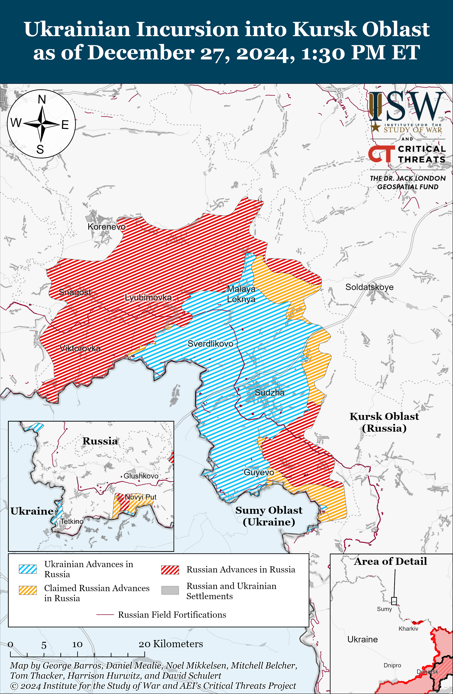
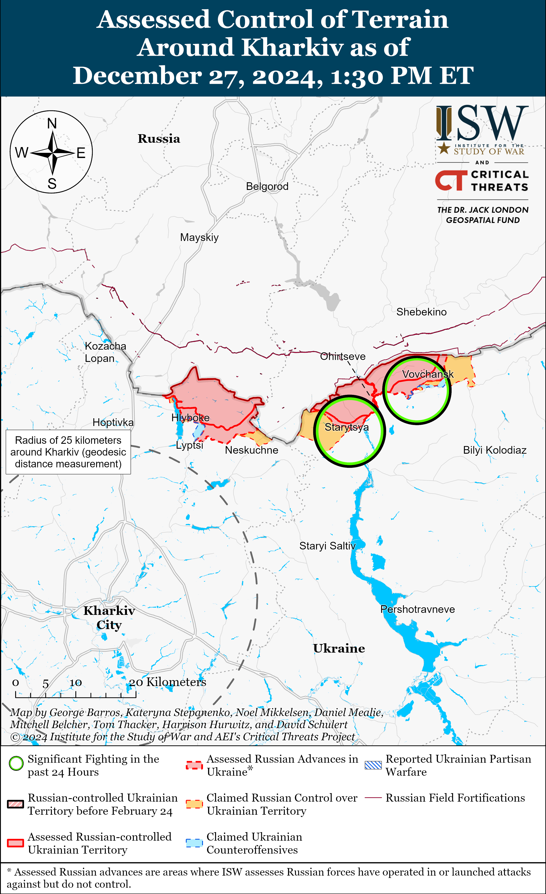
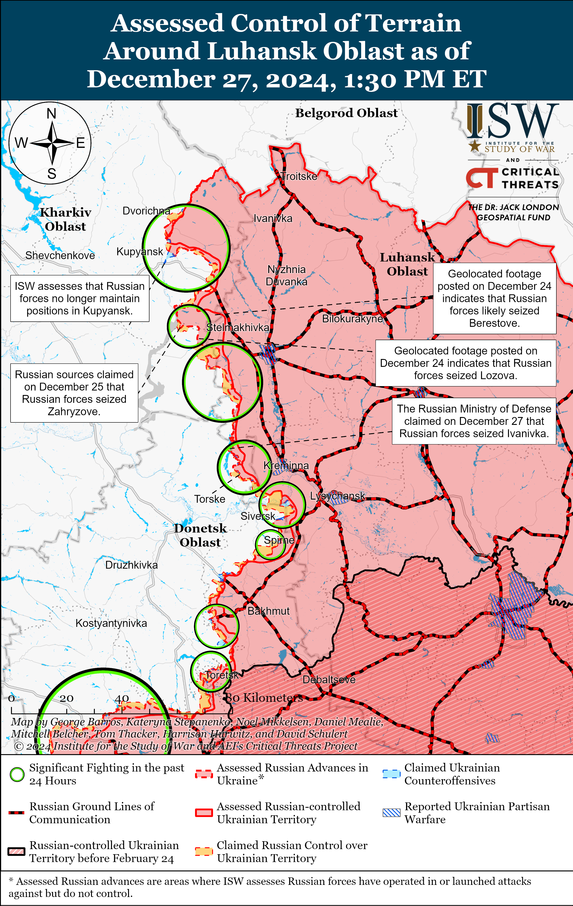
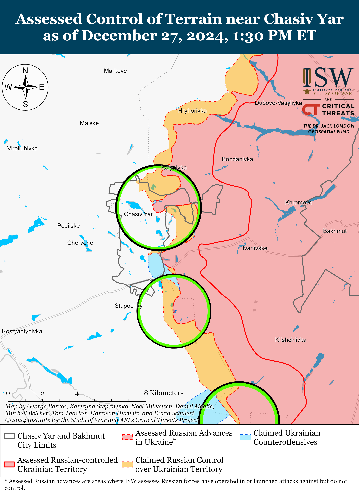
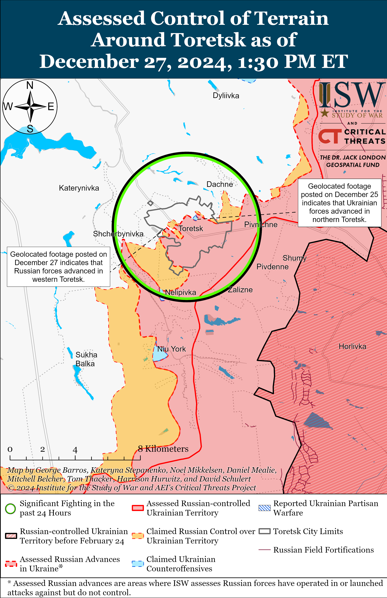
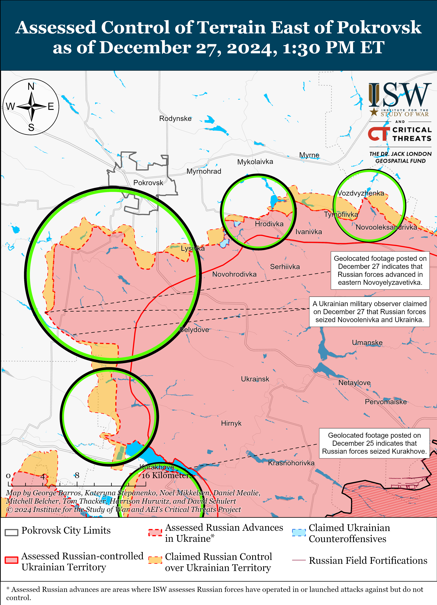
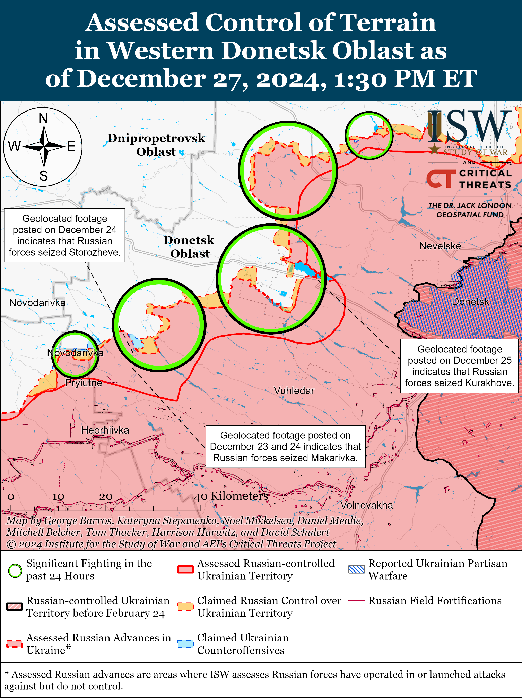
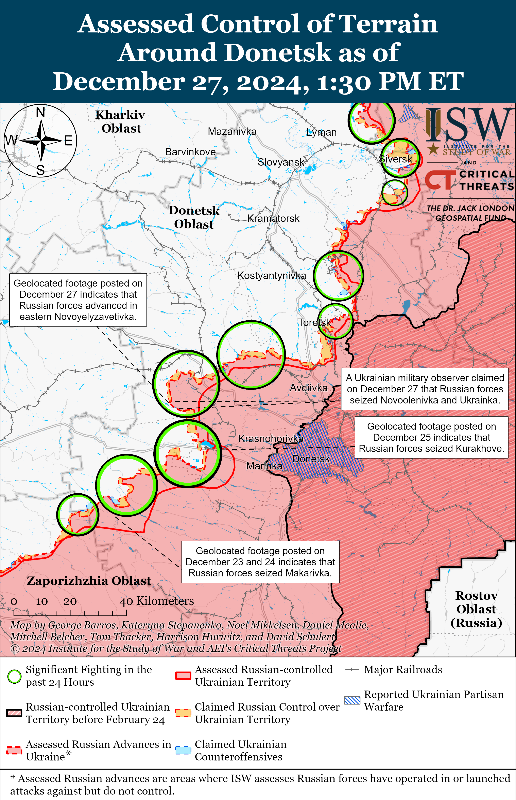
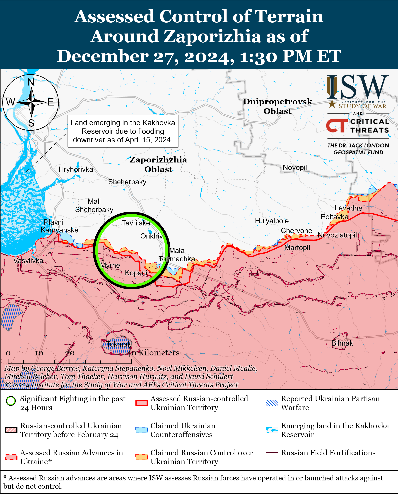

# Russian Offensive Campaign Assessment, December 27, 2024

**Kateryna Stepanenko, Olivia Gibson, Nate Trotter, Angelica Evans, and George Barros**

**December 27, 2024, 9:20 pm ET**

**Click** [**here**](https://storymaps.arcgis.com/stories/36a7f6a6f5a9448496de641cf64bd375) **to see ISW’s interactive map of the Russian invasion of Ukraine. This map is updated daily alongside the static maps present in this report.**

**Click** [**here**](https://storymaps.arcgis.com/stories/83a2f24901c941d581c0c523ecd2619b)**to see ISW’s interactive map of Ukraine’s offensive in Kursk Oblast.**

**Click** [**here**](https://understandingwar.maps.arcgis.com/apps/instant/3dviewer/index.html?appid=1602762dbcde419bb957dea358449580) **to see ISW’s 3D control of terrain topographic map of Ukraine. Use of a computer (not a mobile device) is strongly recommended for using this data-heavy tool.**

**Click** [**here**](https://storymaps.arcgis.com/stories/733fe90805894bfc8562d90b106aa895) **to access ISW’s archive of interactive time-lapse maps of the Russian invasion of Ukraine. These maps complement the static control-of-terrain map that ISW produces daily by showing a dynamic frontline. ISW will update this time-lapse map archive monthly.**

**Note: The data cut-off for this product was 2pm ET on December 27. ISW will cover subsequent reports in the December 28 Russian Offensive Campaign Assessment.**

**Russia has continued to expand its domestic production capabilities of Iranian-designed Shahed drones ahead of its Winter 2024-2025 strike campaign against Ukraine.** CNN, citing Ukrainian defense intelligence sources, estimated on December 27 that Russia’s Shahed drone production facility in the Alabuga Special Economic Zone (SEZ) in the Republic of Tatarstan produced 5,760 drones between January and September 2024 — more than twice the number of drones that the facility produced in 2023.[1] CNNreported that satellite imagery shows that Russian authorities have constructed two new buildings and appear to have installed anti-drone mesh cages over several buildings at the facility in the Alabuga SEZ. CNN, citing leaked documents from the facility, reported that the Alabuga facility is Russia’s main Shahed production facility and has already fulfilled an agreement to produce 6,000 drones for the Russian military by September 2025. Sources in Ukraine’s defense intelligence told CNN that the Alabuga facility began producing low-tech “decoy” drones that resemble Shahed drones and that Russian forces use these decoys to overwhelm Ukrainian air defense systems in Summer 2024. The sources told CNNthat Russia intends to produce 10,000 decoy drones by the end of 2024 — almost double the number of Shahed strike drones that Russia produced in the first nine months of 2024 — since decoy drones are 10 times cheaper to produce than armed Shahed strike drones. CNN noted that Russia has also constructed a train station near the Alabuga SEZ with a direct rail connection between Russia and the People’s Republic of China (PRC), which a Ukrainian intelligence officer stated could be used to transfer components required for drone production between the PRC and the Alabuga SEZ.

**Russia has yet to address limitations in its ability to produce and field Shahed drones, however, and will likely continue to struggle with these limitations in 2025.** ISW has previously observed indications that Western sanctions are complicating Russia’s ability to source quality components for Shahed drones and that Russia is increasingly relying on low quality motors from the PRC to power Shahed drones.[2] Ukrainian electronic warfare (EW) innovations also appear to be enabling Ukrainian forces to disrupt Shahed-heavy strikes more effectively.[3] Russian forces will likely continue to adjust their strike packages during Winter 2024-2025 and beyond in order to inflict significant damage on Ukraine’s energy grid and critical infrastructure, and Russia likely intends to further increase its production and use of Shahed drones following the anticipated signing of the Russian-Iranian Comprehensive Strategic Partnership Agreement in January 2025.[4]

**North Korean forces are continuing to experience high casualty rates amid recent confirmation of the first captured North Korean soldier in Kursk Oblast.** White House National Security Communications Advisor John Kirby stated on December 27 that North Korean forces suffered around 1,000 casualties over the past week in Kursk Oblast (roughly December 20 to 27) and that the Russian command is using — and North Korean authorities are permitting Russia to use — lower and higher-ranking North Korean soldiers in infantry-led assaults without armored vehicle support.[5] Ukrainian President Volodymyr Zelensky stated on December 23 that over 3,000 North Korean personnel have been killed or wounded in Kursk Oblast, roughly a fourth of the 12,000 total reported North Korean personnel in Kursk Oblast.[6] South Korea’s National Intelligence Service (NIS) confirmed on December 26, following consultations with Ukrainian intelligence, that Ukrainian Special Operations Forces (SSO) captured a wounded North Korean soldier in Kursk Oblast and Ukrainian sources posted images allegedly showing the captured North Korean soldier.[7] ISW is unable to verify the images, however.

**Ukrainian forces recently conducted a HIMARS strike against a Russian staff meeting in occupied Zaporizhia Oblast, reportedly killing three Russian officers, following Ukrainian warnings about the possibility of renewed Russian offensive operations in western Zaporizhia Oblast.[8]** Ukraine’s Main Military Intelligence Directorate (GUR) reported on December 27 that the GUR, the Ukrainian Security Service (SBU), Ukrainian Unmanned Systems Forces, and the Ukrainian Tavriisk Group of Forces conducted a HIMARS and subsequent drone strikes against a leadership meeting of the Russian 4th Military Base (58th Combined Arms Army [CAA], Southern Military District [SMD]) in occupied Zaporizhia Oblast. The strike reportedly killed the commander of the Russian 1st Battalion of the 135th Motorized Rifle Regiment (19th Motorized Rifle Division, 58th CAA, SMD) Captain Dmitriy Nagorny, Deputy Head of Intelligence Staff of the 135th Motorized Rifle Regiment Captain Grigoriy Krokhmalyov, and commander of an anti-aircraft battery of the 4th Military Base Captain Yuriy Fomin.[9] Russian milbloggers claimed that Ukrainian forces lured the Russian officers under the guise of humanitarian aid deliveries in the rear of occupied Zaporizhia Oblast and then conducted a combined drone and HIMARS strike against the officers.[10] A Russian milblogger claimed that Ukrainian forces knew the officers’ personal information including who they communicated with, their friends, and who had previously delivered humanitarian aid to them and that Ukrainian forces conducted a similar operation against another unspecified Russian unit on December 27.[11]

**Russian Federal Air Transport Agency (Rosaviatsiya) attempted to blame weather conditions and the pilot’s response to the Russian emergency airspace closure over the Republic of Chechnya for the Azerbaijan Airlines Embraer 190 passenger aircraft crash in Aktau, Kazakhstan on December 25.** Rosaviatsiya Head Dmitry Yadrov stated on December 27 that the Azerbaijani aircraft – which was flying from Baku to Grozny, Chechnya – attempted to land two times at the Grozny airport amidst a declared emergency closure of Russian airspace due to a Ukrainian drone threat.[12] Yadrov also attempted to explain the plane’s failure to land in Grozny several times, claiming that heavy fog over Grozny may have impacted the visibility to up to 500 meters. Yadov claimed that the pilot personally decided to land in Aktau despite the fact that Russian air traffic controllers proposed for the aircraft to land at other Russian airports. Yadrov did not comment on the Azerbaijani, Western, and Russian preliminary reports that a Russian Pantsir-S air defense system struck the aircraft after electronic warfare (EW) jamming caused the plane’s communications and GPS systems to malfunction as the plane approached Grozny.[13] *BBC Russian Service* reported that the Russian state TV channels similarly blamed the plane crash on fog and the plane’s supposed collision with a flock of birds in their coverage immediately following the incident but later began exploring other theories and largely refrained from showing the footage that suggested that Russian air defense systems may have struck the plane.[14]

**A Russian insider source – who is reportedly affiliated with Russian law enforcement and released an alleged transcript of the communications between the crew and a Russian air traffic control in Grozny – accused Yadrov of attempting to conceal the misuse of Russian air defense systems.[15]** ISW is unable to authenticate the transcript. The insider source claimed that the purported transcript suggests that the dispatcher did not warn the crew about foggy weather or alert them to the announcement of the emergency airspace closure. The purported transcript instead suggests that the crew informed the dispatcher of the complete failure of the GPS and communication systems as they attempted to land in Grozny three times. The insider source, citing official sources at the Grozny Airport, claimed that Russian officials only announced the emergency airspace closure after the aircraft rerouted back to Baku. The insider source also pointed out that the purported transcript suggests that the pilot originally decided to fly back to Baku after failing to land in Grozny but that the aircraft sustained damaged from what the crew assessed was a flock of birds. The insider source added that the purported transcript also shows that the dispatcher did not willingly propose any alternative airports in Russia for emergency landing after the plane sustained damage and only provided a list of alternative airports in responds to the crew’s questions.

**Finnish authorities seized the Russian-owned *Eagle S* crude oil tanker on suspicion that the vessel was recently involved in damaging undersea electricity and telecommunication cables in the Baltic Sea but noted that it is too soon to conclude that Russia is behind the cable disruptions.** Finnish authorities seized the Russian-owned *Eagle S* crude oil tanker traveling from St. Petersburg to Egypt in the Gulf of Finland on December 26 on suspicion of the vessel’s potential involvement in damaging the Estlink 2 electricity cable, which transports electricity between Estonia and Finland, and several other telecommunication cables between Finland, Estonia, and Germany on December 25.[16] Finnish Prime Minister Petteri Orpo announced on December 25 that Finland had opened an investigation into the source of the damage, which significantly reduced the cable’s capacity.[17] Orpo stated on December 26 that it is too early in the investigation to conclude that Russia is behind the cable disruptions.[18] Estonian Prime Minister Kristen Michal stated during a news conference on December 26 that cable repairs will take months to complete.[19] Estonian Defense Minister Hanno Pevkur announced on December 27 that Estonia deployed naval patrols to protect the Estlink 1 undersea cable and that Estonia will consult with NATO military officials.[20] NATO Secretary General Mark Rutte spoke with Finnish President Alex Stubb on December 27 about the ongoing investigation into potential sabotage of the cables and announced that NATO will consequently enhance its military presence in the Baltic Sea.[21] Kremlin Spokesperson Dmitry Peskov declined to comment on December 27 on Finland’s detention of the tanker.[22] A source reportedly familiar with the tanker and who provided commercial maritime services to the tanker as recently as seven months ago told shipping news outlet *Lloyd’s List* on December 27 that the tanker is equipped with transmitting and receiving devices that enabled the tanker to monitor and record the radio frequencies of NATO ships and aircraft operating in the area.[23] The source further claimed that Russian authorities offloaded the devices for analysis upon reaching Russia and that the Kremlin is deploying Russian-linked merchant ships to the Baltic Sea for spying and sabotage activities.

**Russian President Vladimir Putin appointed Russian Security Council Secretary Sergei Shoigu to head the newly established Scientific Expert Council of the Russian Security Council.** Putin issued a decree on December 27 establishing the Scientific Expert Council of the Russian Security Council and specified that Shoigu will chair the council.[24] Putin’s decree states that the new advisory council will enhance the scientific, methodological, and expert-analytical support for the Security Council and its working bodies. Russian media reported that the decree also reportedly abolished the previous Scientific Council directly subordinated to the Security Council.[25] ISW has not observed evidence to suggest that Shoigu will be removed from his current position as Secretary of the Russian Security Council as part of this new appointment.

**Key Takeaways:**

- **Russia has continued to expand its domestic production capabilities of Iranian-designed Shahed drones ahead of its Winter 2024–2025 strike campaign against Ukraine.**
- **Russia has yet to address limitations in its ability to produce and field Shahed drones, however, and will likely continue to struggle with these limitations in 2025.**
- **North Korean forces are continuing to experience high casualty rates amid recent confirmation of the first captured North Korean soldier in Kursk Oblast.**
- **Ukrainian forces recently conducted a HIMARS strike against a Russian staff meeting in occupied Zaporizhia Oblast, reportedly killing three Russian officers, following Ukrainian warnings about the possibility of renewed Russian offensive operations in western Zaporizhia Oblast**
- **Russian Federal Air Transport Agency (Rosaviatsiya) attempted to blame weather conditions and the pilot’s response to the Russian emergency airspace closure over the Republic of Chechnya for the Azerbaijan Airlines Embraer 190 passenger aircraft crash in Aktau, Kazakhstan on December 25.**
- **A Russian insider source — who is reportedly affiliated with Russian law enforcement and released an alleged transcript of the communications between the crew and a Russian air traffic control in Grozny — accused Rosaviatsiya of attempting to conceal the misuse of Russian air defense systems.**
- **Finnish authorities seized the Russian-owned *Eagle S* crude oil tanker on suspicion that the vessel was recently involved in damaging undersea electricity and telecommunication cables in the Baltic Sea but noted that it is too soon to conclude that Russia is behind the cable disruptions.**
- **Russian President Vladimir Putin appointed Russian Security Council Secretary Sergei Shoigu to head the newly established Scientific Expert Council of the Russian Security Council.**
- **Ukrainian forces recently regained positions near Siversk and Russian forces recently advanced near Toretsk, Velyka Novosilka, and in the Pokrovsk and Kurakhove directions.**
- **Russian federal subjects (regions) are continuing to increase the value of enlistment bonuses to incentivize military recruitment.**

***We do not report in detail on Russian war crimes because these activities are well-covered in Western media and do not directly affect the military operations we are assessing and forecasting. We will continue to evaluate and report on the effects of these criminal activities on the Ukrainian military and the Ukrainian population and specifically on combat in Ukrainian urban areas. We utterly condemn Russian violations of the laws of armed conflict and the Geneva Conventions and crimes against humanity even though we do not describe them in these reports.***

- Ukrainian Operations in the Russian Federation
- Russian Main Effort – Eastern Ukraine (comprised of three subordinate main efforts)
- Russian Subordinate Main Effort #1 – Push Ukrainian forces back from the international border with Belgorod Oblast and approach to within tube artillery range of Kharkiv City
- Russian Subordinate Main Effort #2 – Capture the remainder of Luhansk Oblast and push westward into eastern Kharkiv Oblast and encircle northern Donetsk Oblast
- Russian Subordinate Main Effort #3 – Capture the entirety of Donetsk Oblast
- Russian Supporting Effort – Southern Axis
- Russian Air, Missile, and Drone Campaign
- Russian Mobilization and Force Generation Efforts
- Russian Technological Adaptations
- Activities in Russian-occupied areas
- Significant Activity in Belarus

**Ukrainian Operations in the Russian Federation**

Fighting continued within the main Ukrainian salient in Kursk Oblast on December 27 but there were no confirmed advances. A Ukrainian battalion operating in Kursk Oblast reported that Ukrainian forces seized an unspecified position in the area.[26] A Russian milblogger claimed that Russian forces are advancing north of Russkoye Porechnoye and from Nechayev (both north of Sudzha), but ISW has not observed confirmation of this claim.[27] Russian forces conducted offensive operations south of Kruglenkoye (southeast of Korenevo), north of Martynovka (northeast of Sudzha), and in the forest areas near Sudzha.[28] Geolocated footage published on December 26 shows that Ukrainian forces repelled a roughly platoon-sized Russian mechanized assault west of Malaya Loknya (north of Sudzha).[29] Russian milbloggers claimed on December 26 and 27 that Ukrainian forces counterattacked throughout their salient from southeast Korenevo to the south of Sudzha along the Leonidovo-Guyevo line and in the forested areas of Sudzha Raion.[30] Drone operators of the Russian 76th Airborne (VDV) Division, elements of the 34th Motorized Rifle Brigade (49th Combined Arms Army [CAA], Southern Military District [SMD]), and elements of the Russian 80th Arctic Motorized Rifle Brigade (14th Army Corps [AC], Leningrad Military District [LMD]) are reportedly operating in Kursk Oblast.[31]

**Russian Main Effort – Eastern Ukraine**

**Russian Subordinate Main Effort #1 – Kharkiv Oblast** **(Russian objective: Push Ukrainian forces back from the international border with Belgorod Oblast and approach to within tube artillery range of Kharkiv City)**

Russian forces continued ground attacks in the Kharkiv direction on December 27 but did not make any confirmed advances. Russian sources claimed on December 26 and 27 that Russian forces advanced northeast of Kharkiv City in Starytsya, crossed the Vovcha River, advanced 80 meters in Vovchansk, and are trying to prepare a bridgehead for further operations in the area.[32] ISW has not observed confirmation of these claims, however. Russian forces conducted offensive operations north of Kharkiv City near Lyptsi and northeast of Kharkiv City near Starytsya and Vovchansk on December 26 and 27.[33] A Russian milblogger claimed on December 27 that Ukrainian forces conducted two platoon-sized infantry counterattacks near Vovchansk.[34]

**Russian Subordinate Main Effort #2 – Luhansk Oblast** **(Russian objective: Capture the remainder of Luhansk Oblast and push westward into eastern Kharkiv Oblast and northern Donetsk Oblast)**

Russian sources claimed that Russian forces advanced southeast of Kupyansk and northwest of Kreminna, but ISW has not observed visual confirmation of some these claims. The Russian Ministry of Defense (MoD) claimed on December 27 that elements of the Russian 27th Motorized Rifle Brigade (1st Guards Tank Army [GTA], Moscow Military District [MMD]) seized Lozova (southeast of Kupyansk) and that Russian forces also seized Zahryzove (southeast of Kupyansk) and Ivanivka (northwest of Kreminna) over the past week (between December 21 and 27).[35] ISW assesses that Russian forces seized Lozova around December 24, but has not observe visual evidence of Russian forces operating in Ivanivka or in the southwestern part of Zahryzove.[36] Russian sources notably claimed on December 27 that Russian forces only advanced in half of Zahryzove and that Ukrainian forces are still counterattacking in southern past of the settlement.[37] A Kremlin-affiliated milblogger claimed that Russian forces withdrew from northeastern outskirts of Kupyansk to fortified positions near Petropavlivka (east of Kupyansk) a while ago due to Ukrainian drones disrupting Russian ground lines of communication (GLOCs) but did not specify the date of the withdrawal.[38] A Russian milblogger also claimed that Russian forces crossed the Vovcha River near Ivanivka, but did not provide visual evidence of this claim.[39] An officer in a Ukrainian brigade operating in the Kupyansk direction reported that Russian forces are trying to reach Dvorichna (northeast of Kupyansk) and cross the Oskil River under the cover of night or poor weather conditions.[40] Ukrainian military observer Kostyantyn Mashovets noted that elements of the Russian 69th Motorized Rifle Division (6th Combined Army [CAA], Leningrad Military District [LMD]) have not been successful in significantly expanding their bridgehead near Dvorichna.[41] Russian forces continued assaults northeast of Kupyansk near Zapadne; southeast of Kupyansk near Lozova, Kruhlyakivka, Bohuslavaka, Pishchane, and Nova Krukhlyakivka; west of Svatove near Pershotravneve, Kopanky, Novoyehorivka, Zeleny Hai, and Nadiya; southwest of Svatove near Kovalivka, Cherneshchyna, Novoserhiivka, and Druzhelyubivka; northwest of Kreminna near Makiivka and Terny; west of Kreminna near Torske and Zarichne; and southwest of Kreminna near Dibrova, Platonivka, and Serebraynske forest.[42] Elements of the Russian 25th “Storm” assault detachment are reportedly operating near Dvorichna and the Russian mobilized “Kontora” group of the 375th Separate Anti-Tank Artillery Battalion (47th Tank Division, 1st GTA) is reportedly operating in the Kupyansk direction.[43] Mashovets reported that elements of the Russian 1st Motorized Tank Regiment, 1st Motorized Rifle Regiment, and separate detachments of the 15th Motorized Riffle Regiment (all part of the 2nd Motorized Rifle Division, 1st GTA) are reportedly operating in the direction of Krukhlyakivka-Zahryzove.[44] Mashovets stated that the Russian military command had likely deployed additional detachments of the 237th Tank Regiment and 252nd Motorized Rifle Regiment (3rd Motorized Rifle Division, 20th CAA, MMD) and units of the 25th Separate Motorized Rifle Brigade (6th CAA, LMD) and the 27th Motorized Brigade to conduct assaults in the Borova direction.[45]

**Russian Subordinate Main Effort #3 – Donetsk Oblast** **(Russian objective: Capture the entirety of Donetsk Oblast, the claimed territory of Russia’s proxies in Donbas)**

Ukrainian forces recently regained lost positions amid continued Russian offensive operations in the Siversk direction on December 27. Geolocated footage published on December 26 indicates that Ukrainian forces recently advanced to a windbreak north of Verkhnokamyanske (east of Siversk).[46] A Russian milblogger claimed that Russian forces advanced up to a kilometer toward Siversk and toward Vyimka (southeast of Siversk) from the south.[47] ISW has not observed confirmation of this claim, however. Russian forces continued attacks northeast of Siversk near Bilohorivka and in the direction of Vyimka on December 26 and 27.[48] Drone operators of the Russian 7th Motorized Rifle Brigade (3rd Combined Arms Army [CAA], formerly 2nd Luhansk People’s Republic [LNR] Army Corps [AC]) are reportedly operating near Bilohorivka.[49]

Russian forces continued offensive operations in the Chasiv Yar direction but did not make any confirmed advances on December 27. A Russian milblogger claimed that Russian forces have cleared Ukrainian forces from an area near the lake in Pivichnyi Microraion (northern Chasiv Yar) and are advancing into the central part of the microraion.[50] ISW has not observed confirmation of this claim, however. Russian forces continued attacking in Chasiv Yar itself; north of Chasiv Yar near Hryhorivka; east of Chasiv Yar near Ivanivske; southeast of Chasiv Yar near Kurdyumivka and Klishchiivka; and south of Chasiv Yar near Stupochky, Oleksandro-Shultyne, and Bila Hora.[51] A Ukrainian brigade operating in the area published footage on December 27 showing Ukrainian forces striking Russian armored vehicles near Kurdyumivka and reported that Ukrainian forces repelled a reduced company-sized mechanized assault near the settlement.[52] Another Ukrainian brigade operating in the Chasiv Yar direction posted footage on December 27 showing Ukrainian forces repelling a platoon-sized mechanized assault near Ivanivske and Klishchiivka.[53] Russian milbloggers claimed that fighting continues for the Refractory Plant in central Chasiv Yar.[54] Elements of the Russian 98th Airborne (VDV) Division are reportedly operating in Chasiv Yar and drone elements of the 112th Rifle Regiment (114th Motorized Rifle Brigade, 51st CAA, formerly the 1st Donetsk People’s Republic Army Corps [DNR AC]) are reportedly operating near Ivanivske.[55]

Russian forces recently advanced in the Toretsk direction amid continued offensive operations on December 27. Geolocated footage published between December 25 and 27 indicates that Russian forces marginally advanced up to Saratovska Street in northern Toretsk, up to the central market and Hirnychoryatuvalna Street in central Toretsk, and along Khyzhnyaka Street in western Toretsk.[56] A Russian milblogger claimed that Russian forces advanced 300 meters toward the Toretsk mine and 2.2 kilometers in Shcherbynivka (west of Toretsk), and another Russian milblogger claimed that Russian forces continue to advance near the Tsentralna mine in central Toretsk.[57] ISW has not observed confirmation of these claims, however. Russian forces continued attacking in Toretsk itself, northeast of Toretsk near Dyliivka, and west of Toretsk near Shcherbynivka on December 26 and 27.[58] Drone elements of the Russian 80th “Sparta” Separate Reconnaissance Battalion (51st CAA, DNR AC) and elements of the 132nd Motorized Rifle Brigade (51st CAA) reportedly continue to operate in the Toretsk direction.[59]

Russian forces recently advanced south of Pokrovsk amid ongoing offensive operations in the Pokrovsk direction on December 27. Geolocated footage published on December 27 indicates that Russian forces recently advanced into eastern Novoyelyzavetivka (south of Pokrovsk).[60] Ukrainian military observer Kostyantyn Mashovets stated that elements of the Russian 90th Tank Division’s (41st CAA, Central Military District [CMD]) 238th and 80th tank regiments and 428th Motorized Rifle Regiment recently advanced to Novoyelyzavetivka and seized Ukrainka and Novoolenivka (east of Novoyelyvzvetivka and south of Pokrovsk).[61] Russian milbloggers also claimed that Russian forces seized Ukrainka and Novoolenivka and advanced near Lysivka (southeast of Pokrovsk) and one kilometer near Dachenske (just southwest of Lysivka).[62] A Russian milblogger claimed that elements of the Russian 30th Motorized Rifle Brigade (2nd CAA, CMD) also participated in the seizure of Novoolenivka.[63] Mashovets stated that elements of the 239th Tank Regiment and the 433rd Motorized Rifle Regiment (27th Motorized Rife Division, 2nd CAA, CMD) likely with support from elements of the recently-formed 74th Motorized Rifle Brigade (41st CAA) recently advanced near Pishchane and up to Novovasylivka (both north of Novoyelizavetivka and southwest of Pokrovsk).[64] A Ukrainian battalion posted footage claiming to show Russian forces conducting a motorized assault with one armored vehicle and seven civilian vehicles purportedly in an unspecified area of the Pokrovsk direction.[65] Russian forces continued offensive operations near Pokrovsk itself; northeast of Pokrovsk near Vozdvyzhenka and Myrolyubivka; east of Pokrovsk near Promin; southeast of Pokrovsk near Lysivka; south of Pokrovsk near Zelene, Dachenske, Novyi Trud, Shevchenko, and Pishchane; and southwest of Pokrovsk near Vovkove, Novoolenivka, Novotroitske, Novovasylivka, and Novoyelyzavetivka on December 26 and 27.[66] A Russian milblogger claimed that Ukrainian forces counterattacked near Shevchenko.[67]

Russian forces continued offensive operations in the Kurakhove direction on December 27. Mashovets stated that elements of the Russian 20th Motorized Rifle Division (8th CAA, Southern Military District [SMD]) recently marginally advanced south of Kurakhove and that elements of the 90th Tank Division’s 80th and 6th tank regiments and 228th Motorized Rifle Regiment reinforced with elements of the 67th Separate Rifle Regiment (possibly a reformed Soviet-era unit) and the 87th Separate Rifle Regiment (1st “Slavic” Motorized Rifle Brigade, 51st CAA) are struggling to advance along the Zorya-Sontsivka line (northwest of Kurakhove).[68] The spokesperson of a Ukrainian brigade operating in the Kurakhove direction reported that Russian forces are suffering significant manpower losses in the Kurakhove direction and that Russian units are growing less combat capable in this direction.[69] The spokesperson stated that Russian forces are operating armored vehicles far from the frontline in this area and are typically using armored vehicles to deliver infantry to frontline positions, a stark departure from Russian forces’ regular mechanized assaults in the Kurakhove direction between June and October 2024.[70] Russian forces continued offensive operations near Kurakhove itself; northwest of Kurakhove near Slovyanka and Petropavlivka and in the direction of Andriivka; west of Kurakhove near Dachne; and south of Kurakhove near Dalne on December 26 and 27.[71]

Russian forces recently advanced northwest of Vuhledar amid ongoing offensive operations in the Vuhledar direction on December 27. Geolocated footage published on December 26 indicates that Russian forces recently advanced in the fields southeast of Rozlyv (northwest of Vuhledar).[72] Mashovets stated that elements of the Russian 36th Motorized Rifle Brigade (29th CAA, Eastern Military District [EMD]), 39th Motorized Rifle Brigade (68th AC, EMD), 114th Motorized Rifle Brigade (51st CAA), 57th Motorized Rifle Brigade (5th CAA, EMD), and 18th Machine Gun-Artillery Division (68th AC, EMD) are unsuccessfully attempting to cross the Sukhyi Yaly River in the Vuhledar direction.[73] Russian forces continued assaults northwest of Vuhledar near Kostyantynopolske, Uspenivka, Yantarne, Sukhyi Yaly, Zelenivka, Kostyantynopil, and Rozlyv on December 26 and 27.[74] Elements of the Russian 14th Spetsnaz Brigade (Russian General Staff’s Main Directorate [GRU]) are reportedly operating along the Sukhyi Yaly River, and drone operators of the 242nd Motorized Rifle Regiment (20th Motorized Rifle Division) are reportedly operating in the Kurakhove direction.[75]

Russian forces recently advanced southwest of Velyka Novosilka amid ongoing offensive operations in the Donetsk-Zaporizhia Oblast border area on December 27. Geolocated footage published on December 26 indicates that Russian forces recently advanced west of Vremivka (southwest of Velyka Novosilka) and cut the O-0510 Velyka Novosilka-Hulyaipole road.[76] A Russian milblogger claimed that elements of the Russian 60th Motorized Rifle Brigade (5th CAA, EMD) broke through to the road.[77] Mashovets stated that elements of the Russian 40th Naval Infantry Brigade (Pacific Fleet, EMD) and 336th Naval Infantry Brigade (Baltic Fleet, Leningrad Military District [LMD]) are working to cut Ukraine’s ground lines of communication (GLOCs) near Novyi Komar (north of Velyka Novosilka) and Rozdolne (northeast of Velyka Novosilka).[78] Mashovets added that elements of the Russian 37th Motorized Rifle Brigade (36th CAA, EMD) and 5th Tank Brigade (36th CAA) have entered unspecified areas of Velyka Novosilka from the east and southeast and that elements of the Russian 127th Motorized Rifle Division (5th CAA, EMD) and 60th Motorized Rifle Brigade are participating in assaults to cut the O-0510 highway. Additional geolocated footage published on December 24 indicates that Ukrainian forces recently repelled a platoon-sized Russian mechanized assault east of Novyi Komar (north of Velyka Novosilka).[79] A Russian milblogger claimed that Russian forces also advanced southwest of Velyka Novosilka near Ukrainian positions north of Marfopil and south of Malynivka, but ISW has not observed confirmation of these claims.[80] Russian forces continued assaults northeast of Velyka Novosilka near Rozdolne; north of Velyka Novosilka near Novyi Komar; and southwest of Velyka Novosilka near Vremivka and Novodarivka on December 26 and 27.[81] Elements of the Russian 57th Motorized Rifle Brigade (5th CAA, EMD) are reportedly operating in the Vremivka (Velyka Novosilka) direction.[82] Russian milbloggers posted footage on December 26 claiming to show Russian forces conducting a glide bomb strikes against a bridge in Velyka Novosilka.[83]

**Russian Supporting Effort – Southern Axis** **(Russian objective: Maintain frontline positions and secure rear areas against Ukrainian strikes)**

Russian forces continued offensive operations in western Zaporizhia on December 27 but did not make any confirmed advances. Russian forces continued attacking northwest of Robotyne near Novoandriivka and Kamyanske (northwest of Robotyne and south of Zaporizhia City) on December 26 and 27.[84] Ukrainian Tavriisk Group of Forces Spokesperson Colonel Vladyslav Voloshyn stated on December 27 that Russian forces are deploying drones attached to fiber optic cables in the Zaporizhia direction that are highly resilient to Ukrainian electronic warfare (EW) interference.[85]

Russian forces continued assaults in the Dnipro direction and on the islands in the Dnipro River Delta on December 26 and 27 in an effort to seize the Kozatskyi Island (north of Kherson City) and also attacked the Velykyi Potemkin Island (south of Kherson City) but did not make any confirmed advances.[86]

**Russian Air, Missile, and Drone Campaign** **(Russian Objective: Target Ukrainian military and civilian infrastructure in the rear and on the frontline)**

Russian forces conducted a limited series of missile and drone strikes against Ukraine on the night of December 26 to 27. The Ukrainian Air Force reported that Russian forces launched two Iskander-M ballistic missiles and 24 Shahed and other strike drones from Oryol and Bryansk oblasts and Millerovo, Rostov Oblast.[87] The Ukrainian Air Force stated that Ukrainian forces downed 13 drones over Poltava, Sumy, Kharkiv, Kyiv, Kirovohrad, Dnipropetrovsk, and Donetsk oblasts and that 11 Russian decoy drones were ”locally lost,” likely due to Ukrainian electronic warfare (EW) interference, and did not cause any damage. Zaporizhia Oblast Military Administration Head Ivan Fedorov stated on December 27 that Russian forces struck the industrial area in Zaporizhzhia City, possibly with an unspecified missile.[88]

**Russian Mobilization and Force Generation Efforts** **(Russian objective: Expand combat power without conducting general mobilization)**

Russian federal subjects (regions) are continuing to increase the value of enlistment bonuses to incentivize military recruitment. Samara Oblast Governor Vyacheslav Fedorishchev announced December 26 that the region is offering a 3.6 million ruble ($34,000) enlistment bonus for each recruit interested in signing a Russian military service contract between January 1, 2025 and February 1, 2025.[89] Samara Oblast recently increased one-time enlistment bonus from 1.2 million rubles ($11,357) to two million rubles ($18,912) in October 2024, and these frequent financial increases likely indicate that Samara Oblast is facing challenges to recruit personnel.[90]

Russian occupation officials are continuing to form new BARS (Russian Combat Army Reserve) units in an effort to build out long-term territorial defenses in occupied territories. Crimean occupation head Sergei Aksyonov reported on December 27 that Crimean-based BARS-Krym unit participated in the large-scale territorial defense exercises practicing anti-sabotage operations in occupied Chornomorsky Raion, Crimea.[91]

Russian opposition outlet *Mediazona* reported that Russian courts opened 10,308 criminal cases against individuals who refused to serve in the Russian Armed Forces in 2024 – a number of cases in 2024 is nearly two times higher than in 2023.[92] *Mediazona* reported that Russian authorities opened 5,517 criminal cases in 2023 and 16,120 criminal cases since the start of Russia’s full-scale invasion of Ukraine. *Mediazona* reported that Moscow Oblast had the highest number of criminal cases against individuals refusing to fight in Ukraine with 1,041 criminal cases, and that the record high number of opened cases against military service refusals in one month occurred July 2024.

Ukrainian outlet *Informatsiynyi Soprotyv* (Informational Resistance) reported on December 27 that Russian forces have been using 122mm – ZOF56IM1-1 artillery ammunition since 2023 that resemble 122mm high-explosive fragmentation ammunition for Chinese-made Type 96 howitzers.[93] *Informatsiynyi Soprotyv* noted that the Russian ammunition is similar the shape, color, and shell boxes of Chinese-made ammunition. US Deputy Secretary of State Kurt Campbell told reporters on September 10 that Beijing was supplying Moscow with unspecified components that unambiguously support Russia’s military in exchange for access to advanced Russian military technology.[94]

**Russian Technological Adaptations** **(Russian objective: Introduce technological innovations to optimize systems for use in Ukraine)**

Alexei Rogozin, son of former Russian space agency Roscosmos head and Zaporizhia Oblast occupation senator Dmitry Rogozin, stated that Russian forces have not yet developed or integrated the use of drone swarms on the battlefield. Rogozhin stated that Russia is unable to ensure the stable interaction between multiple drones because such swarms require developed algorithms that are resistant to any failures or interference. Rogozhin stated that Russia will eventually develop this capability out of necessity in 2025.[95] A former Russian Storm Z instructor and milblogger responded to Rogozhin claiming that Ukraine’s drone advantage will continue to impact the frontline and that Ukrainian forces have been using groups of 3-10 drones against Russian infantry and armored vehicles since May 2024.[96]

[97]

Director of the Russian startup company “Starolink” Nichoas Oksman announced on December 23 that Russia began prototype production for pseudo-satellite aircraft-type drones that are expected to be able to fly into the stratosphere with an altitude of 18 to 25 kilometers.[98] Oksman added that these drones will have a wingspan of 40 meters, a cruising speed of 120 to 140 kilometers per hour, weigh 315 kilograms, and carry up to a 40 kilogram payload.[99]

The “Center for the Development and Implementation of Innovative Solutions” (Tsentr RiVir) told Kremlin newswire *TASS* on December 23 that it had tested the compact 1.5 kilogram Adeliks-10 vertical take-off and landing (VTOL) drone which can be ready for flight in less than five minutes, can fly for 45 minutes with a range up to 40 kilometers, and can cruise at a speed of 65 kilometers per hour and fly at speeds up to 120 kilometers per hour.[100]

**Activities in Russian-occupied areas** **(Russian objective: Consolidate administrative control of annexed areas; forcibly integrate Ukrainian citizens into Russian sociocultural, economic, military, and governance systems)**

*ISW is not publishing coverage of activities in Russian-occupied areas today.*

**Significant activity in Belarus** **(Russian efforts to increase its military presence in Belarus and further integrate Belarus into Russian-favorable frameworks)**

Nothing significant to report.

**Note: ISW does not receive any classified material from any source, uses only publicly available information, and draws extensively on Russian, Ukrainian, and Western reporting and social media as well as commercially available satellite imagery and other geospatial data as the basis for these reports. References to all sources used are provided in the endnotes of each update.**

[1] https://www.cnn.com/2024/12/27/europe/russia-ukraine-war-drones-alabuga-factory-intl-invs/index.html

[2] https://isw.pub/UkrWar120624

[3] https://isw.pub/UkrWar120224

[4] https://iz dot ru/1814303/semen-boikov/v-otvet-na-soglashenie-prezident-irana-mozhet-priekhat-v-rossiyu-17-yanvarya

[5] https://www.reuters.com/world/north-korean-troops-experience-mass-casualties-ukraine-front-lines-white-house-2024-12-27/

[6] https://understandingwar.org/backgrounder/russian-offensive-campaign-assessment-october-24-2024; https://understandingwar.org/backgrounder/russian-offensive-campaign-assessment-december-23-2024

[7] https://en.yna.co dot kr/view/AEN20241227002651315?section=nk/nk; https://x.com/GirkinGirkin/status/1872386303490429216 ; https://t.me/volodymyrzolkin/17035 ; https://x.com/666\_mancer/status/1872383042263875655; https://mil.in dot ua/uk/news/syly-oborony-jmovirno-zahopyly-v-polon-pershogo-bijtsya-armiyi-kndr

[8] https://isw.pub/UkrWar112524

[9] https://t.me/DIUkraine/5106 ; https://suspilne dot media/zaporizhzhia/912147-likvidovano-troh-komandiriv-armii-rf-aki-brali-ucast-u-bojovih-dij-na-zaporizzi-gur/; https://armyinform dot com.ua/2024/12/27/try-kapitany-odyn-kinecz-himars-vidpravyv-rosijskyh-oficzeriv-do-spysku-dvohsotyh/

[10] https://t.me/RSaponkov/10081; https://t.me/RSaponkov/10082; https://t.me/MishaDonbass/1380

[11] https://t.me/MishaDonbass/1380

[12] https://t.me/korenyako/653

[13] https://understandingwar.org/backgrounder/russian-offensive-campaign-assessment-december-26-2024; https://x.com/byjepstein/status/1872671609473155554 ; https://www.washingtonpost.com/world/2024/12/27/azerbaijan-airlines-plane-crash-russia/

[14] https://t.me/bbcrussian/74682

[15] https://t.me/vchkogpu/53610; https://t.me/vchkogpu/53620

[16] https://www.helsinkitimes dot fi/finland/finland-news/domestic/25906-finland-and-estonia-look-into-failure-in-transmission-link-sabotage-not-yet-ruled-out.html ; https://www.ft.com/content/0c208ac1-f416-41b2-a373-ec7f90b84ca8 ; https://traficom dot fi/fi/ajankohtaista/traficom-mukana-selvittamassa-suomenlahden-kaapelivaurioita ; https://www.nytimes.com/2024/12/26/world/europe/finland-estonia-cables-russia.html ; https://www.politico.eu/article/estonia-finland-russia-ship naval-ports-sanction-germany-baltic-sea/

[17] https://www.reuters.com/world/europe/finland-investigates-outage-undersea-power-link-estonia-finnish-pm-says-2024-12-25/

[18] https://yle dot fi/a/74-20133545

[19] https://www.washingtonpost.com/world/2024/12/26/finland-russia-ship-undersea-cable-sabotage/

[20] https://news.err dot ee/1609561090/estonia-dispatches-navy-patrol-boat-to-guard-estlink-1-cable ; https://www.bbc.com/news/articles/c1elq7lx9qdo

[21] https://x.com/SecGenNATO/status/1872579725102891421

[22] https://www.bbc.com/news/articles/c1elq7lx9qdo

[23] https://www.lloydslist.com/LL1151955/Russia-linked-cable-cutting-tanker-seized-by-Finland-was-loaded-with-spying-equipment

[24] https://www.interfax dot ru/russia/1001011 ; http://kremlin dot ru/events/security-council/75989

[25] https://sputniknews dot in/20241227/vladimir-putin-signs-decree-establishing-scientific-and-expert-council-8610463.html ; https://www.interfax dot ru/russia/1001011

[26] https://armyinform dot com.ua/2024/12/27/zagnaly-dronamy-u-blindazh-dobyly-avtomatamy-nashi-bijczi-zahopyly-rosijski-pozycziyi/; https://t.me/OSHB\_225/4833

[27] https://t.me/DnevnikDesantnika/21596

[28] https://t.me/DnevnikDesantnika/21596

[29] https://t.me/WarArchive\_ua/24036; https://t.me/brygada47/1124

[30] https://t.me/DnevnikDesantnika/21566; https://t.me/dva\_majors/61226

[31] https://t.me/DnevnikDesantnika/21570; https://t.me/RVvoenkor/83471; https://t.me/NeoficialniyBeZsonoV/42573

[32] https://t.me/DnevnikDesantnika/21566; https://t.me/tass\_agency/293595; https://t.me/DnevnikDesantnika/21588

[33] https://www.facebook.com/GeneralStaff.ua/posts/pfbid02HAiyJ1RYsyj8wewPnE6EzgktaQzLzPJEipYKhmkyJQsk7M7C6qUpiUFH97fWDH5Wl; https://www.facebook.com/GeneralStaff.ua/posts/pfbid02FNyX4i4kmT6dcbUAS3UF19MbkSG8FkJ24Z5rzczYpjUyfTyRrHNBHFyhp5oMwgbMl; https://www.facebook.com/GeneralStaff.ua/posts/pfbid0XVVDCAEQG6FGHAHyzRtUpu9AEfde3vvYjruesf79UMHXFigr9PbE8rpkwh46ibrYl; https://t.me/Khortytsky\_wind/3812; https://t.me/Sladkov\_plus/12144; https://t.me/otukharkiv/3256

[34] https://t.me/DnevnikDesantnika/21588

[35] https://t.me/mod\_russia/47343; https://t.me/mod\_russia/47354

[36] https://understandingwar.org/backgrounder/russian-offensive-campaign-assessment-december-26-2024

[37] https://t.me/tass\_agency/293593; https://t.me/notes\_veterans/21216; https://t.me/boris\_rozhin/149288; https://t.me/DnevnikDesantnika/21566; https://t.me/dva\_majors/61226; https://t.me/voenkorKotenok/61066; https://t.me/rybar/66712

[38] https://t.me/rybar/66712

[39] https://t.me/dva\_majors/61226

[40] https://suspilne dot media/kharkiv/911843-dvoricna-pid-postijnim-obstrilom-bo-ce-dla-rosian-placdarm-aka-situacia-na-kupanskomu-napramku-frontu/

[41] https://t.me/zvizdecmanhustu/2448

[42] https://www.facebook.com/GeneralStaff.ua/posts/pfbid02HAiyJ1RYsyj8wewPnE6EzgktaQzLzPJEipYKhmkyJQsk7M7C6qUpiUFH97fWDH5Wl; https://www.facebook.com/GeneralStaff.ua/posts/pfbid02FNyX4i4kmT6dcbUAS3UF19MbkSG8FkJ24Z5rzczYpjUyfTyRrHNBHFyhp5oMwgbMl; https://www.facebook.com/GeneralStaff.ua/posts/pfbid0XVVDCAEQG6FGHAHyzRtUpu9AEfde3vvYjruesf79UMHXFigr9PbE8rpkwh46ibrYl; https://t.me/Khortytsky\_wind/3812

[43] https://t.me/motopatriot/30907; https://t.me/boris\_rozhin/149263

[44] https://t.me/zvizdecmanhustu/2448

[45] https://t.me/zvizdecmanhustu/2448

[46] https://t.me/strelkoviu\_bat/32 ; https://x.com/giK1893/status/1872671793808294315 ; https://x.com/giK1893/status/1872671797566751090

[47] https://t.me/DnevnikDesantnika/21566

[48] https://www.facebook.com/GeneralStaff.ua/posts/pfbid02HAiyJ1RYsyj8wewPnE6EzgktaQzLzPJEipYKhmkyJQsk7M7C6qUpiUFH97fWDH5Wl ; https://www.facebook.com/GeneralStaff.ua/posts/pfbid02FNyX4i4kmT6dcbUAS3UF19MbkSG8FkJ24Z5rzczYpjUyfTyRrHNBHFyhp5oMwgbMl ; https://www.facebook.com/GeneralStaff.ua/posts/pfbid0XVVDCAEQG6FGHAHyzRtUpu9AEfde3vvYjruesf79UMHXFigr9PbE8rpkwh46ibrYl ; https://t.me/Khortytsky\_wind/3812

[49] https://t.me/strelkoviu\_bat/32 ; https://x.com/giK1893/status/1872671793808294315 ; https://x.com/giK1893/status/1872671797566751090

[50] https://t.me/DnevnikDesantnika/21566

[51] https://armyinform dot com.ua/2024/12/27/stugna-i-fpv-drony-krashhe-anizh-prosto-drony-vidbyttya-vorozhogo-shturmu-na-kramatorskomu-napryamku/ ; https://armyinform dot com.ua/2024/12/27/feniks-v-diyi-ukrayinski-bezpilotnyky-znyshhyly-sim-odynycz-tehniky-voroga/ ; . https://t.me/Khortytsky\_wind/3812 ; https://www.facebook.com/GeneralStaff.ua/posts/pfbid0XVVDCAEQG6FGHAHyzRtUpu9AEfde3vvYjruesf79UMHXFigr9PbE8rpkwh46ibrYl ; https://www.facebook.com/GeneralStaff.ua/posts/pfbid02FNyX4i4kmT6dcbUAS3UF19MbkSG8FkJ24Z5rzczYpjUyfTyRrHNBHFyhp5oMwgbMl ; https://www.facebook.com/GeneralStaff.ua/posts/pfbid02HAiyJ1RYsyj8wewPnE6EzgktaQzLzPJEipYKhmkyJQsk7M7C6qUpiUFH97fWDH5Wl

[52] https://armyinform dot com.ua/2024/12/27/feniks-v-diyi-ukrayinski-bezpilotnyky-znyshhyly-sim-odynycz-tehniky-voroga/

[53] https://armyinform.com dot ua/2024/12/27/stugna-i-fpv-drony-krashhe-anizh-prosto-drony-vidbyttya-vorozhogo-shturmu-na-kramatorskomu-napryamku/

[54] https://t.me/dva\_majors/61226 ; https://t.me/DnevnikDesantnika/21581

[55] https://t.me/nm\_dnr/13179 ; https://t.me/DnevnikDesantnika/21570

[56] https://x.com/AudaxonX/status/1872443630457348477 ; https://x.com/AudaxonX/status/1872443718143537549 ; https://www.youtube.com/watch?v=WHdwoy3HQ8M ; https://x.com/AudaxonX/status/1872626853443457132 ; https://x.com/AudaxonX/status/1872627050571567273 ; https://t.me/blackhawkteam5/11 ; https://x.com/AudaxonX/status/1872643243919524149 ; https://x.com/AudaxonX/status/1872643624191811888 ; https://x.com/AudaxonX/status/1872655597809868971; https://x.com/AudaxonX/status/1872657350634754331 ; https://t.me/voron1OO/106 ; https://x.com/AudaxonX/status/1872366891052011576 ; https://x.com/AudaxonX/status/1872367104579748282 ; https://www.instagram.com/stories/asp.kr/3530460609001507612/

[57] https://t.me/dva\_majors/61226 ; https://t.me/DnevnikDesantnika/21566

[58] https://t.me/Khortytsky\_wind/3812 ; https://www.facebook.com/GeneralStaff.ua/posts/pfbid0XVVDCAEQG6FGHAHyzRtUpu9AEfde3vvYjruesf79UMHXFigr9PbE8rpkwh46ibrYl ; https://www.facebook.com/GeneralStaff.ua/posts/pfbid02FNyX4i4kmT6dcbUAS3UF19MbkSG8FkJ24Z5rzczYpjUyfTyRrHNBHFyhp5oMwgbMl ; https://www.facebook.com/GeneralStaff.ua/posts/pfbid02HAiyJ1RYsyj8wewPnE6EzgktaQzLzPJEipYKhmkyJQsk7M7C6qUpiUFH97fWDH5Wl

[59] https://t.me/boris\_rozhin/149306 ; https://t.me/nm\_dnr/13178 ; https://t.me/boris\_rozhin/149313 ; https://t.me/nm\_dnr/13180

[60] https://t.me/creamy\_caprice/7941; https://t.me/osirskiy/1009; https://x.com/SibirPrizrak/status/1872660891424182500

[61] https://t.me/zvizdecmanhustu/2450

[62] https://t.me/voenkorKotenok/61063 ; https://t.me/z\_arhiv/30287 ; https://t.me/voenkorKotenok/61053 ; https://t.me/boris\_rozhin/149259 ; https://t.me/motopatriot/30923 ; https://t.me/DnevnikDesantnika/21587 ; https://t.me/motopatriot/30926

[63] https://t.me/motopatriot/30898

[64] https://t.me/zvizdecmanhustu/2450

[65] https://t.me/hydra\_subdivision137/74; https://x.com/moklasen/status/1872388959789261104; https://x.com/moklasen/status/1872389207165124712; https://x.com/moklasen/status/1872392385709343084

[66] https://www.facebook.com/GeneralStaff.ua/posts/pfbid0XVVDCAEQG6FGHAHyzRtUpu9AEfde3vvYjruesf79UMHXFigr9PbE8rpkwh46ibrYl ; https://www.facebook.com/GeneralStaff.ua/posts/pfbid02FNyX4i4kmT6dcbUAS3UF19MbkSG8FkJ24Z5rzczYpjUyfTyRrHNBHFyhp5oMwgbMl ; https://www.facebook.com/GeneralStaff.ua/posts/pfbid02HAiyJ1RYsyj8wewPnE6EzgktaQzLzPJEipYKhmkyJQsk7M7C6qUpiUFH97fWDH5Wl ; https://t.me/Khortytsky\_wind/3812

[67] https://t.me/dva\_majors/61226

[68] https://t.me/zvizdecmanhustu/2449

[69] https://armyinform dot com.ua/2024/12/27/generaly-kochegary-palyat-rosijski-elitni-brygady-na-kurahivskomu-napryamku-v-boyah-za-sela-zgorayut-tysyachi/; https://www.youtube.com/watch?v=aDXWlQ2K0dM

[70] https://understandingwar.org/backgrounder/ukrainian-defense-pokrovsk-has-compelled-russia-change-its-approach-eastern-ukraine

[71] https://www.facebook.com/GeneralStaff.ua/posts/pfbid02HAiyJ1RYsyj8wewPnE6EzgktaQzLzPJEipYKhmkyJQsk7M7C6qUpiUFH97fWDH5Wl ; https://www.facebook.com/GeneralStaff.ua/posts/pfbid02FNyX4i4kmT6dcbUAS3UF19MbkSG8FkJ24Z5rzczYpjUyfTyRrHNBHFyhp5oMwgbMl

 ; https://www.facebook.com/GeneralStaff.ua/posts/pfbid0XVVDCAEQG6FGHAHyzRtUpu9AEfde3vvYjruesf79UMHXFigr9PbE8rpkwh46ibrYl ; https://t.me/Khortytsky\_wind/3812

[72] https://t.me/WarArchive\_ua/24035; https://t.me/osirskiy/1007

[73] https://t.me/zvizdecmanhustu/2449

[74] https://t.me/zvizdecmanhustu/2449 ; https://www.facebook.com/GeneralStaff.ua/posts/pfbid02HAiyJ1RYsyj8wewPnE6EzgktaQzLzPJEipYKhmkyJQsk7M7C6qUpiUFH97fWDH5Wl ; https://www.facebook.com/GeneralStaff.ua/posts/pfbid02FNyX4i4kmT6dcbUAS3UF19MbkSG8FkJ24Z5rzczYpjUyfTyRrHNBHFyhp5oMwgbMl ; https://www.facebook.com/GeneralStaff.ua/posts/pfbid0XVVDCAEQG6FGHAHyzRtUpu9AEfde3vvYjruesf79UMHXFigr9PbE8rpkwh46ibrYl ; https://t.me/Khortytsky\_wind/3812

[75] https://t.me/voin\_dv/12482 ; https://t.me/boris\_rozhin/149281

[76] https://t.me/WarArchive\_ua/24035; https://t.me/osirskiy/1007

[77] https://t.me/voenkorKotenok/61062

[78] https://t.me/zvizdecmanhustu/2448

[79] https://t.me/rubpak/242; https://x.com/RALee85/status/1872400753593110599; https://x.com/klinger66/status/1872422845701075401

[80] https://t.me/voenkorKotenok/61051

[81] https://www.facebook.com/GeneralStaff.ua/posts/pfbid0XVVDCAEQG6FGHAHyzRtUpu9AEfde3vvYjruesf79UMHXFigr9PbE8rpkwh46ibrYl ; https://www.facebook.com/GeneralStaff.ua/posts/pfbid02FNyX4i4kmT6dcbUAS3UF19MbkSG8FkJ24Z5rzczYpjUyfTyRrHNBHFyhp5oMwgbMl ; https://t.me/DnevnikDesantnika/21566

[82] https://t.me/voin\_dv/12488

[83] https://t.me/boris\_rozhin/149244 ; https://t.me/ChDambiev/33444 ; https://t.me/voin\_dv/12484

[84] https://www.facebook.com/GeneralStaff.ua/posts/pfbid02FNyX4i4kmT6dcbUAS3UF19MbkSG8FkJ24Z5rzczYpjUyfTyRrHNBHFyhp5oMwgbMl ; https://www.facebook.com/GeneralStaff.ua/posts/pfbid0XVVDCAEQG6FGHAHyzRtUpu9AEfde3vvYjruesf79UMHXFigr9PbE8rpkwh46ibrYl ; https://t.me/dva\_majors/61226

[85] https://suspilne dot media/zaporizhzhia/912513-na-zaporizkomu-napramku-armia-rf-vikoristovue-droni-na-aki-ne-diut-zasobi-radioelektronnoi-borotbi-volosin/

[86] https://t.me/SJTF\_Odes/11911 ; https://www.facebook.com/GeneralStaff.ua/posts/pfbid0XVVDCAEQG6FGHAHyzRtUpu9AEfde3vvYjruesf79UMHXFigr9PbE8rpkwh46ibrYl ; https://www.facebook.com/GeneralStaff.ua/posts/pfbid02FNyX4i4kmT6dcbUAS3UF19MbkSG8FkJ24Z5rzczYpjUyfTyRrHNBHFyhp5oMwgbMl

[87] https://t.me/kpszsu/25706

[88] https://t.me/ivan\_fedorov\_zp/14639 ; https://t.me/kpszsu/25696 ; https://suspilne dot media/zaporizhzhia/912007-armia-rf-zavdala-udar-po-promislovij-infrastrukturi-zaporizza-fedorov/; https://t.me/zoda\_gov\_ua/36896; https://t.me/ivan\_fedorov\_zp/14640

[89] https://zasekin dot ru/news/23690-v-samarskuyu-oblast-zazivayut-kontraktnikov-iz-drugih-regionov; . https://t.me/idelrealii/39253 ; https://t.me/astrapress/71212

[90] https://zasekin dot ru/news/23690-v-samarskuyu-oblast-zazivayut-kontraktnikov-iz-drugih-regionov; . https://t.me/idelrealii/39253 ; https://t.me/astrapress/71212

[91] https://t.me/Aksenov82/6514

[92] https://zona dot media/news/2024/12/27/500-itog

[93] https://www.ukrinform dot ua/rubric-ato/3942455-ak-rosia-spromoglasa-viroblati-ponad-2-miljoni-snaradiv-na-rik-ta-do-cogo-tut-kitajci.html; https://sprotyv dot info/analitica/yak-rosiya-spromoglasya-viroblyati-ponad-2-miljoni-snaryadiv-na-rik-ta-do-chogo-tut-kitajczi-kovalenko-foto/

[94] https://www.politico.eu/article/united-states-accuse-china-help-russia-war-kurt-campbell/

[95] https://t.me/rogozin\_alexey/2249 ; https://t.me/philologist\_zov/1825

[96] https://t.me/philologist\_zov/1824

[97] https://t.me/philologist\_zov/1824

[98] https://iz dot ru/1812142/2024-12-23/v-rf-obespechat-udalennye-poseleniia-internetom-s-pomoshchiu-stratosfernykh-bpla

[99] https://t.me/basurin\_e/16216

[100] https://tass dot ru/armiya-i-opk/22748209; https://t.me/basurin\_e/16220
