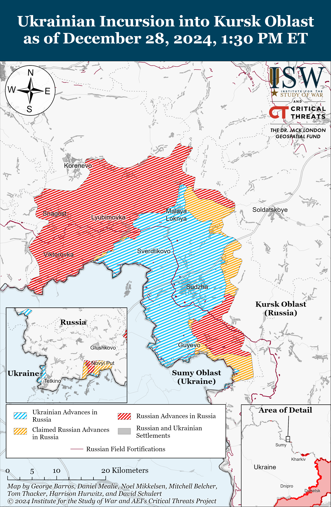
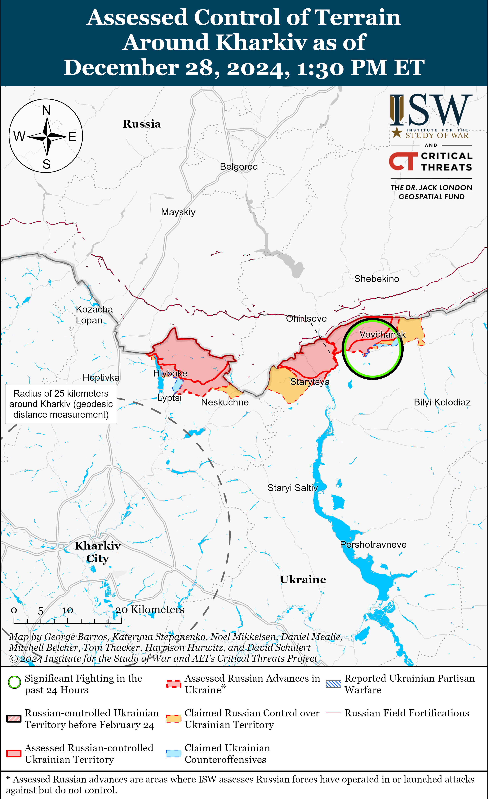
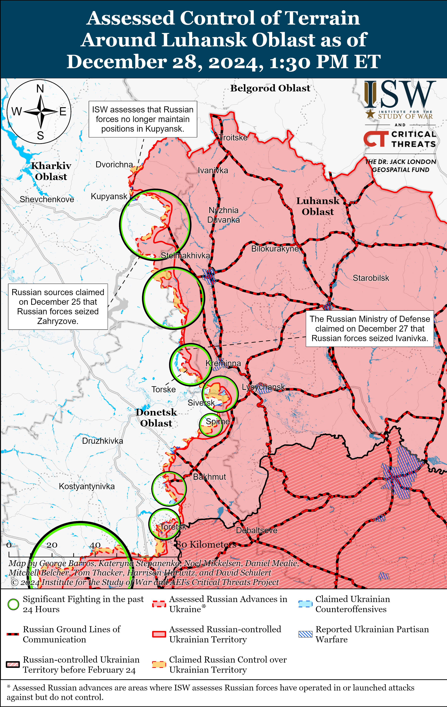
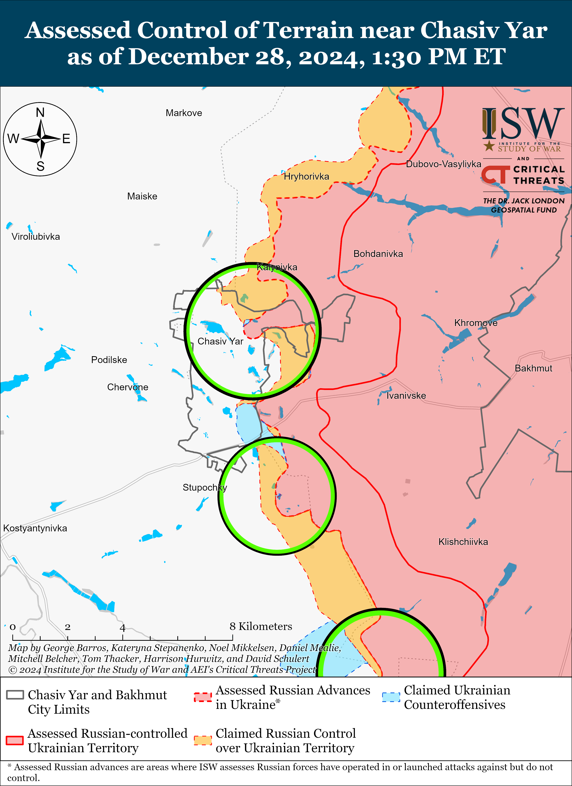
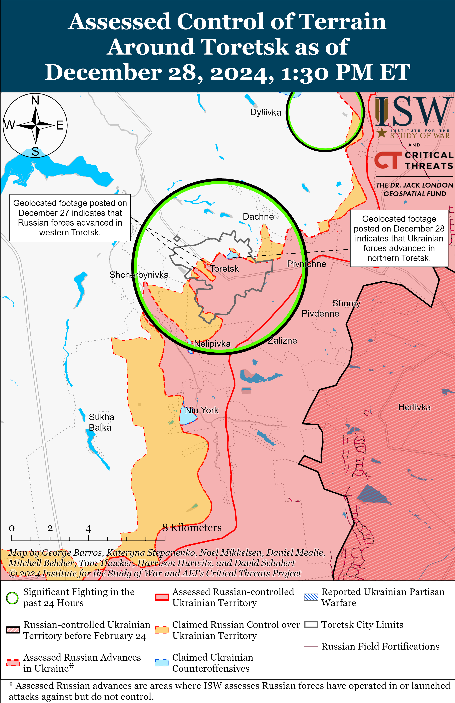
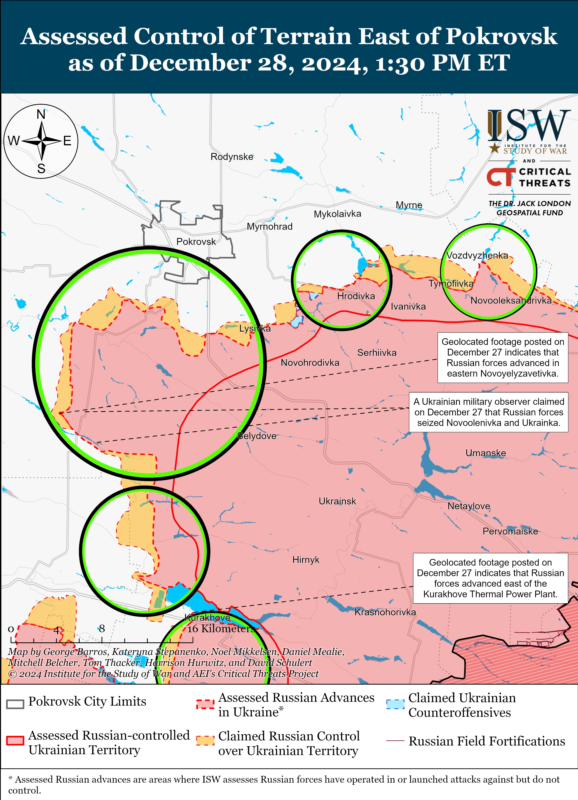
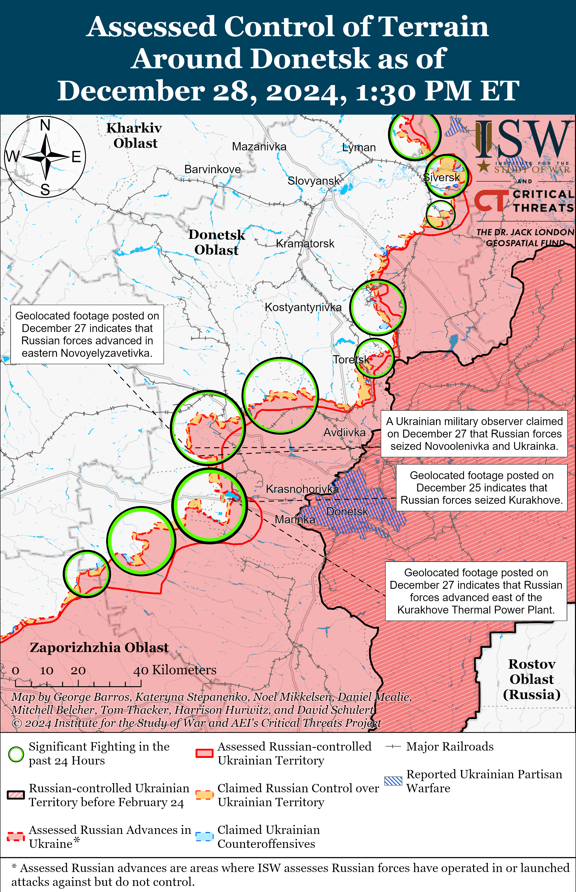
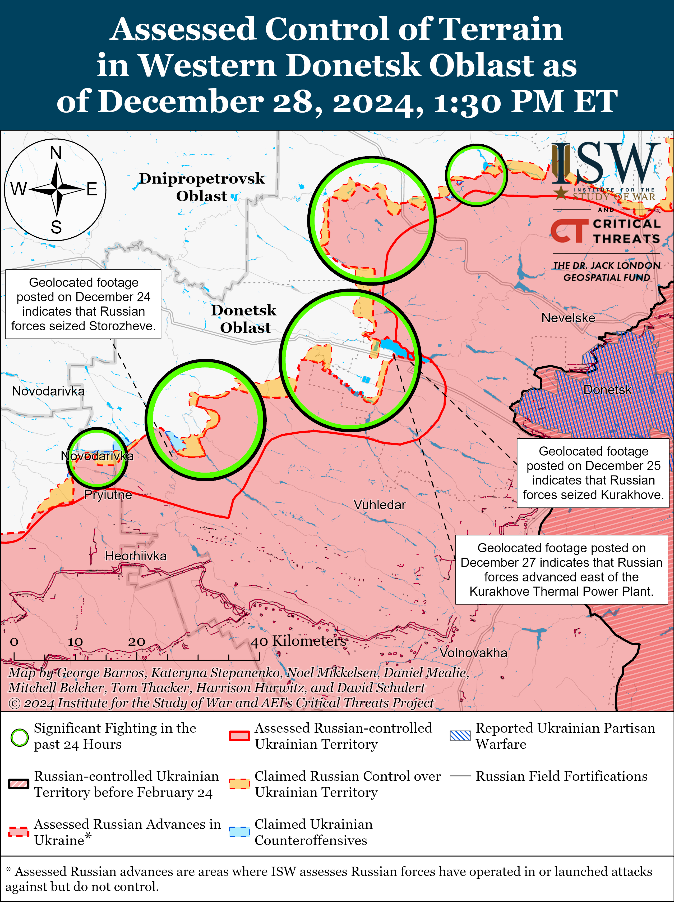
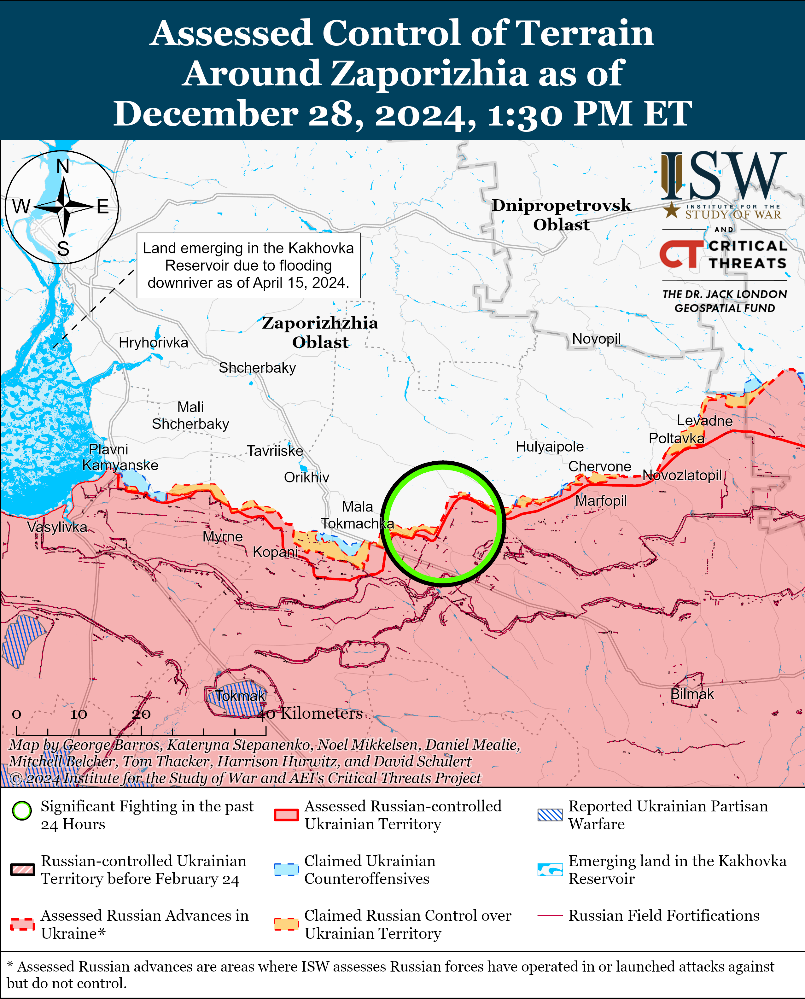
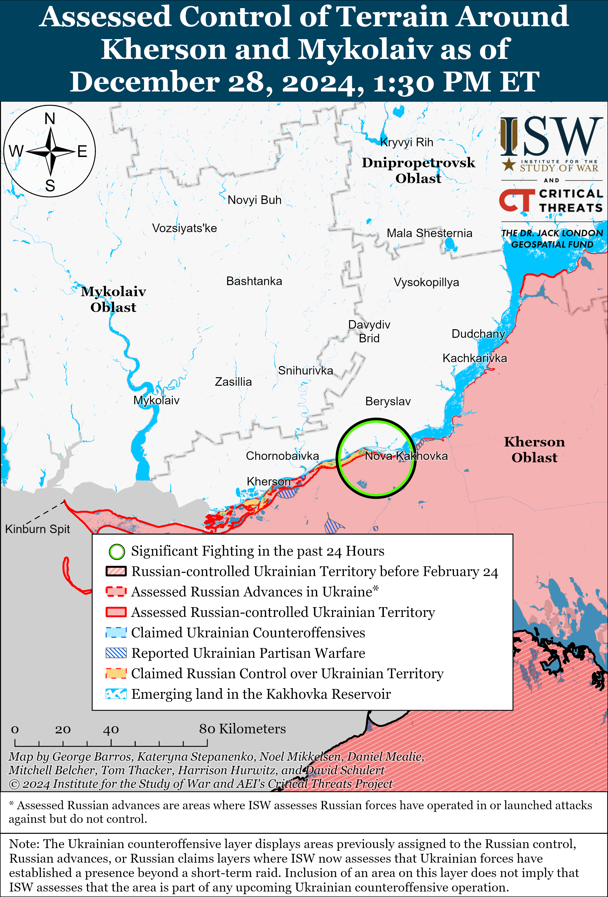

# Russian Offensive Campaign Assessment, December 28, 2024

**Christina Harward, Davit Gasparyan, Angelica Evans, Nate Trotter, and Frederick W. Kagan**

**December 28, 2024, 3:45 pm ET**

**Click** [**here**](https://storymaps.arcgis.com/stories/36a7f6a6f5a9448496de641cf64bd375) **to see ISW’s interactive map of the Russian invasion of Ukraine. This map is updated daily alongside the static maps present in this report.**

**Click** [**here**](https://storymaps.arcgis.com/stories/83a2f24901c941d581c0c523ecd2619b)**to see ISW’s interactive map of Ukraine’s offensive in Kursk Oblast.**

**Click** [**here**](https://understandingwar.maps.arcgis.com/apps/instant/3dviewer/index.html?appid=1602762dbcde419bb957dea358449580) **to see ISW’s 3D control of terrain topographic map of Ukraine. Use of a computer (not a mobile device) is strongly recommended for using this data-heavy tool.**

**Click** [**here**](https://storymaps.arcgis.com/stories/733fe90805894bfc8562d90b106aa895) **to access ISW’s archive of interactive time-lapse maps of the Russian invasion of Ukraine. These maps complement the static control-of-terrain map that ISW produces daily by showing a dynamic frontline. ISW will update this time-lapse map archive monthly.**

**Note: The data cut-off for this product was 12pm ET on December 28. ISW will cover subsequent reports in the December 29 Russian Offensive Campaign Assessment.**

**Russian President Vladimir Putin appears to be trying to smooth over possible tensions in the Russian-Azerbaijani and Russian-Kazakh relationships after Russian air defense likely shot an Azerbaijan Airlines passenger plane on December 25, causing it to crash in Kazakhstan.** Putin called Azerbaijani President Ilham Aliyev about the December 25 crash on December 28.[1] The Kremlin readout of the conversation stated that Putin and Aliyev discussed “in detail” the December 25 plane crash in Aktau, Kazakhstan, and that Putin apologized that the “tragic incident” occurred in Russian airspace. The Kremlin readout noted that the plane repeatedly tried to land at the Grozny airport in the Republic of Chechnya as Russian air defense systems were repelling Ukrainian drone strikes against Grozny as well as Mozkok and Vladikavkaz in the North Ossetia-Alania Republic. The Kremlin readout stated that the Russian Investigative Committee has opened a criminal case for violating traffic safety rules, but notably did not specify that the “tragic incident” that occurred over Russian airspace was Russian air defense shooting the passenger plane. The readout from Aliyev’s press service, however, stated that Putin apologized for the fact that the plane “was subjected to physical and technical impact from outside [of the plane] in Russian airspace, which resulted in the tragic incident.”[2] Azerbaijan’s readout stated that Aliyev noted that there were holes in the plane’s fuselage and that survivors’ testimonies talked about how “foreign particles” pierced the cabin while the plane was flying. Azerbaijan’s readout, although more explicit than the Russian one, also does not specify that Russian air defense struck the plane. The differences between the Russian and Azerbaijani readouts suggest that Azerbaijan is unhappy with the extent to which the Kremlin is refusing to directly acknowledge the role Russian air defense systems played in bringing down the plane.

Putin also called Kazakh President Kassym-Jomart Tokayev on December 28, likely to discuss how the official investigation of the crash site in Kazakhstan will present Russia’s role in the crash.[3] The Russian and Kazakh readouts of the call both stated that Putin and Tokayev exchanged condolences over the deaths of Russian and Kazakh citizens in the crash. Putin and Tokayev discussed the Kazakh government commission investigating the crash, which includes specialists from Russia, Azerbaijan, and Brazil. The Russian readout stated that the specialists will decode the flight recorders from the plane. Russian Foreign Minister Sergei Lavrov also spoke by phone with Azerbaijani Foreign Minister Jeyhun Bayramov on December 28 and discussed the need to establish “all causes” of the plane crash and to take “urgent measures” to prevent a similar situation in the future.[4] Russian authorities reportedly did not allow the plane to land at Russian airports, even though an alleged transcript of communications between the plane’s crew and a dispatcher in Grozny claimed that the pilot requested emergency landing locations in Russia.[5]

*MSNBC* and *NBC News* reported on December 27 that two US military officials, citing US intelligence, indicated that Russian forces targeted the plane with air defense systems after they likely misidentified the Azerbaijani airliner as a Ukrainian drone, in part due to the plane’s irregular flight pattern.[6] A Russian insider source, who reportedly has ties to Russian law enforcement and published an alleged transcript of communications between the plane’s crew and a dispatcher in Grozny, claimed on December 28 that Russia transported air defense systems, including S-300 air defense systems, from Syria to Chechnya after the fall of the Bashar al Assad regime and recently installed these air defense systems around Grozny.[7] ISW and the Critical Threats Project’s (CTP) Africa File recently observed Russian flights from Syria to Makhachkala Airport (about 180 kilometers southeast of Grozny) but cannot confirm what cargo the plane was carrying.[8]

**Ukrainian forces recently struck a Russian Shahed drone storage, maintenance, and repair facility in Oryol City, Oryol Oblast.** The Ukrainian General Staff reported on December 28 that Ukrainian forces struck the facility on December 26 and that the strike significantly reduced Russia’s ability to conduct Shahed strikes against Ukraine.[9] Russian opposition outlet *Astra*, citing unspecified sources, reported that Ukraine struck the facility with at least three Storm Shadow missiles on the afternoon of December 26 and that the strike wounded and killed nine Russian servicemembers.[10] Satellite imagery indicates that Russian forces began constructing the facility in August 2024 and may have completed construction in November or early December 2024.[11]

**Russian authorities continue to establish a legal basis to remove the Taliban and Hayat Tahrir al Sham (HTS) from the Russian government’s official list of banned terrorist organizations.** Russian President Vladimir Putin signed a law on December 28 allowing the Russian government to remove organizations from Russia’s list of terrorist organizations.[12] Russian milbloggers noted that the decree will facilitate Russia’s rapprochement with the Taliban, and one milblogger claimed that the Taliban has demonstrated their intentions to bring peace to Afghanistan, which will open new trade routes for Russia.[13] ISW previously observed that Russian authorities are preparing legal mechanisms to remove the Taliban from the list, and Putin’s decree is likely one of the final steps in this process.[14] Putin’s decree also establishes a legal basis for the Russian government to remove other organizations, including HTS, from its list of banned terrorist organizations as part of Russia’s efforts to develop positive relations with the HTS-led interim government in Syria and secure guarantees for the continued operations of Russia’s military bases in Syria.

**Key Takeaways:**

- **Russian President Vladimir Putin appears to be trying to smooth over possible tensions in the Russian-Azerbaijani and Russian-Kazakh relationships after Russian air defense likely shot an Azerbaijan Airlines passenger plane on December 25, causing it to crash in Kazakhstan.**
- **Ukrainian forces recently struck a Russian Shahed drone storage, maintenance, and repair facility in Oryol City, Oryol Oblast.**
- **Russian authorities continue to establish a legal basis to remove the Taliban and Hayat Tahrir al Sham (HTS) from the Russian government’s official list of banned terrorist organizations.**
- **Russian forces recently advanced near Kreminna, Siversk, Toretsk, and Kurakhove.**
- **The Russian Ministry of Defense (MoD) announced on December 28 that the Russian military completed its Fall 2024 conscription cycle.**

***We do not report in detail on Russian war crimes because these activities are well-covered in Western media and do not directly affect the military operations we are assessing and forecasting. We will continue to evaluate and report on the effects of these criminal activities on the Ukrainian military and the Ukrainian population and specifically on combat in Ukrainian urban areas. We utterly condemn Russian violations of the laws of armed conflict and the Geneva Conventions and crimes against humanity even though we do not describe them in these reports.***

- Ukrainian Operations in the Russian Federation
- Russian Main Effort – Eastern Ukraine (comprised of three subordinate main efforts)
- Russian Subordinate Main Effort #1 – Push Ukrainian forces back from the international border with Belgorod Oblast and approach to within tube artillery range of Kharkiv City
- Russian Subordinate Main Effort #2 – Capture the remainder of Luhansk Oblast and push westward into eastern Kharkiv Oblast and encircle northern Donetsk Oblast
- Russian Subordinate Main Effort #3 – Capture the entirety of Donetsk Oblast
- Russian Supporting Effort – Southern Axis
- Russian Air, Missile, and Drone Campaign
- Russian Mobilization and Force Generation Efforts
- Russian Technological Adaptations
- Activities in Russian-occupied areas
- Significant Activity in Belarus

**Ukrainian Operations in the Russian Federation**

Russian forces continued assaults along the Ukrainian salient in Kursk Oblast on December 27 and 28 but did not make confirmed advances.[15] A Russian milblogger claimed that Russian forces advanced near Nikolayevo-Darino (southeast of Korenevo) and Maryevka (east of Korenevo) and in the forests in Sudzhansky Raion, but ISW has not observed confirmation of this claim.[16] Russian milblogger claimed that Ukrainian forces are counterattacking in unspecified areas of Kursk Oblast.[17] Elements of the Russian 56th Airborne (VDV) Regiment (7th VDV Division) reportedly continue to operate in Kursk Oblast.[18]

**Russian Main Effort – Eastern Ukraine**

**Russian Subordinate Main Effort #1 – Kharkiv Oblast (Russian objective: Push Ukrainian forces back from the international border with Belgorod Oblast and approach to within tube artillery range of Kharkiv City)**

Russian forces continued ground attacks northeast of Kharkiv City near Vovchansk on December 27 and 28 but did not advance.[19]

**Russian Subordinate Main Effort #2 – Luhansk Oblast (Russian objective: Capture the remainder of Luhansk Oblast and push westward into eastern Kharkiv Oblast and northern Donetsk Oblast)**

Russian forces recently advanced northwest of Kreminna amid continued offensive operations along the Kupyansk-Svatove-Kreminna line on December 28. Geolocated footage published on December 28 indicates that Russian forces recently advanced to the eastern outskirts of Terny (northwest of Kreminna) during a reduced platoon-sized mechanized assault.[20] Russian forces continued offensive operations east of Kupyansk near Petropavlivka; southeast of Kupyansk near Lozova and Hlushkivka; south of Kupyansk in the direction of Novoplatonivka; west of Svatove near Pershotravneve, Kopanky, Novoyehorivka, and Nadiya; northwest of Kreminna near Makiivka, Hrekivka, and Terny; west of Kreminna near Torske and Zarichne; and southwest of Kreminna near Dibrova, Platonivka, and the Serebraynske forest area on December 27 and 28.[21] A spokesperson of a Ukrainian brigade operating in the Lyman direction stated on December 28 that Russian forces recently conducted a mechanized assault in this direction for the first time in about a month (since late November 2024) and that Russian forces are conducting daily infantry assaults with well-trained and equipped personnel in this direction as well.[22] A Russian source claimed on December 28 that Russian forces repelled 25 Ukrainian counterattacks in occupied Luhansk Oblast over the last week.[23] Elements of the Russian 16th Spetsnaz Brigade (Russian General Staff’s Main Directorate [GRU]) are reportedly operating near Olhivka (northwest of Kreminna).[24]

**Russian Subordinate Main Effort #3 – Donetsk Oblast (Russian objective: Capture the entirety of Donetsk Oblast, the claimed territory of Russia’s proxies in Donbas)**

Russian forces marginally advanced southeast of Siversk in recent weeks amid ongoing offensive operations in the Siversk direction on December 28. Geolocated footage published on December 28 indicates that Russian forces marginally advanced south of Vyimka (southeast of Siversk) during a reduced platoon-sized mechanized assault, which likely occurred in early to mid-December 2024.[25] A Russian milblogger claimed that Russian forces advanced over two kilometers in the Siversk direction, but ISW has not observed confirmation of this claim.[26] Russian forces continued assaults northeast of Siversk near Bilohorivka and southeast of Siversk in the direction of Vyimka on December 27 and 28.[27]

Russian forces continued offensive operations in the Chasiv Yar direction on December 28 but did not make confirmed advances. Ukrainian forces operating near Chasiv Yar published footage on December 27 and 28 showing Ukrainian forces repelling a reinforced company-sized mechanized assault near Klishchiivka and Kurdyumivka (southeast of Chasiv Yar), and this is likely additional footage of the two mechanized assaults that ISW initially observed footage of on December 27.[28] Russian milbloggers claimed that Russian forces are advancing in Chasiv Yar’s northern Pivnichnyi Microraion, but ISW has not observed confirmation of these claims.[29] Russian forces continued assaults near Chasiv Yar itself and south of Chasiv Yar near Bila Hora, Predtechnye, Stupochky, and Dyliivka on December 27 and 28.[30] Elements of the Russian 98th Airborne (VDV) Division reportedly continue to operate in Chasiv Yar.[31]

Ukrainian and Russian forces recently advanced in Toretsk amid ongoing fighting in the town on December 27. Geolocated footage published on December 27 indicates that Ukrainian forces recently retook positions in central and northern Toretsk.[32] Additional geolocated footage published on December 27 indicates that Russian forces recently advanced along Rudnichna Street in western Toretsk.[33] Russian forces continued assaults in central Toretsk near the Tsentralna Mine and Central Market and in northern Toretsk near the Avangard Stadium and west of Toretsk near Shcherbynivka on December 27 and 28.[34] Elements of the Russian 51st Combined Arms Army’s (CAA) (formerly the 1st Donetsk People’s Republic Army Corps [DNR AC]) 9th Motorized Rifle Brigade and 80th “Sparta” Separate Reconnaissance Battalion are reportedly operating in the Toretsk direction.[35]

Russian forces continued offensive operations in the Pokrovsk direction on December 28 but did not make any confirmed advances. Russian milbloggers claimed that Russian forces advanced to central Novoyelyzavetivka (southwest of Pokrovsk) and near Myrolyubivka (east of Pokrovsk), but ISW has not observed confirmation of this claim.[36] Russian forces conducted offensive operations near Pokrovsk itself; east of Pokrovsk near Vozdvyzhenka, Myrolyubivka, Promin, and Zelene Pole; south of Pokrovsk near Dachenske, Zelene, Novyi Trud, and Ukrainka; and southwest of Pokrovsk near Pishchane, Pershe Travnya, Shevchenko, Novooleksandrivka, Novoyelyzavetivka, Novovasylivka, Solone, and Vovkove on December 27 and 28.[37] A Russian milblogger claimed that Russian sabotage and reconnaissance groups entered Pokrovsk.[38] The commander of a Ukrainian company operating in the Pokrovsk direction stated that the Russian military command is accumulating a large number of forces in the area and that Russian forces are increasingly trying to attack in poor weather conditions after suffering significant equipment losses to Ukrainian drone strikes.[39] A Russian milblogger claimed that Russian forces are trying to advance from Hrodivka (east of Pokrovsk) to Myrolyubivka (northwest of Hrodivka) in order envelop Pokrovsk from the northeast.[40] Elements of the Russian “Vega” Spetsnaz Detachment (24th Spetsnaz Brigade, Main Intelligence Directorate of the Russian General Staff [GRU]) are reportedly operating in the Pokrovsk direction.[41]

Russian forces recently advanced in the Kurakhove direction amid continued offensive operations in the area on December 28. Geolocated footage published on December 28 indicates that Russian forces advanced to the eastern outskirts of the Kurakhivske Thermal Power Plant (TPP) (west of Kurakhove).[42] Russian milbloggers also claimed that Russian forces began advancing near the TPP.[43] ISW recently assessed that Russian forces may struggle to advance westward from Kurakhove if they choose to conduct a frontal assault through the TPP area and if Ukrainian forces decide to allocate sufficient manpower and materiel to defend in the area.[44] Russian forces conducted offensive operations near Kurakhove itself, northwest of Kurakhove near Petropavlivka and Slovyanka, and west of Kurakhove near Dachne on December 27 and 28.[45] Elements of the Russian 5th Motorized Rifle Brigade (51st CAA) are reportedly operating near the Kurakhivske TPP, and elements of the 68th Tank Regiment (150th Motorized Rifle Division, 8th CAA, Southern Military District [SMD]) are reportedly operating near Kurakhove.[46]

Russian forces continued offensive operations in the Vuhledar direction on December 28 but did not make any confirmed advances. A Russian milblogger claimed that Ukrainian forces regained lost positions north of Vuhledar near Uspenivka and that Russian forces marginally advanced northwest of Vuhledar along the Rozdolne-Kostyantynopil-Ulakly line, but ISW has not observed confirmation of these claims.[47] Russian forces conducted assaults northwest of Vuhledar near Kostyantynopolske, Yantarne, Ulakly, Kostyantynopil, and Rozlyv on December 27 and 28.[48] Drone operators of the Russian 14th Spetsnaz Brigade (GRU) are reportedly operating near the Sukhi Yaly River (northwest of Vuhledar).[49]

Russian forces continued offensive operations in the Velyka Novosilka direction on December 28 but did not make any confirmed advances. Russian forces continued assaults near Velyka Novosilka itself; northeast of Velyka Novosilka near Rozdolne; north of Velyka Novosilka near Novyi Komar; west of Velyka Novosilka near Novosilka; southwest of Velyka Novosilka near Vremivka and Novodarivka; and south of Velyka Novosilka near Neskuchne on December 27 and 28.[50] A Russian milblogger claimed that Ukrainian forces are counterattacking north of the O-0510 Velyka Novosilka-Hulyaipole highway.[51] Drone operators of the Russian 57th Motorized Rifle Brigade (5th CAA, Eastern Military District [EMD]) are reportedly operating in the Vremivka direction, and elements of the 60th Motorized Rifle Brigade (5th CAA, EMD) are reportedly operating north of the Velyka Novosilka-Hulyaipole highway.[52]

**Russian Supporting Effort – Southern Axis (Russian objective: Maintain frontline positions and secure rear areas against Ukrainian strikes)**

Russian forces conducted offensive operations northeast of Robotyne near Bilohirya on December 28 but did not make any confirmed advances.[53] A Russian milblogger claimed that Ukrainian forces are counterattacking in the Kamyanske direction (northeast of Robotyne).[54]

Russian forces continued assaults in the Dnipro direction on December 27 and 28 but did not make any confirmed advances.[55] Elements of the Russian 127th Reconnaissance Brigade (22nd Army Corps [AC], Black Sea Fleet [BSF]) and the 81st Self-Propelled Artillery Regiment (70th Motorized Rifle Division, 18th Combined Arms Army [CAA], Southern Military District [SMD]) are reportedly operating in the Kherson direction.[56]

**Russian Air, Missile, and Drone Campaign (Russian Objective: Target Ukrainian military and civilian infrastructure in the rear and on the frontline)**

Russian forces conducted a limited series of drone strikes against Ukraine on the night of December 27 to 28. The Ukrainian Air Force reported that Russian forces launched 16 Shahed and other strike drones from Primorsko-Akhtarsk, Krasnodar Krai.[57] The Ukrainian Air Force stated that Ukrainian forces downed 15 drones over Mykolaiv Oblast and that one decoy drone was ”locally lost,” likely due to Ukrainian electronic warfare (EW) interference.

**Russian Mobilization and Force Generation Efforts (Russian objective: Expand combat power without conducting general mobilization)**

The Russian Ministry of Defense (MoD) announced on December 28 that the Russian military completed its Fall 2024 conscription cycle.[58] The Russian MoD claimed that the Russian military has called up 133,000 conscripts since October 1. The Russian military reportedly sent a majority of the conscripts to training units and military units and sent 578 conscripts to scientific and scientific-production units. The Russian MoD also claimed that the Russian military did not send conscripts to Russian deployment points in occupied Ukraine and that they did not participate in military tasks in Ukraine. ISW has previously reported on how the MoD coerces conscripts into signing military service contracts to fight in Ukraine in order to maintain the current tempo of Russian offensive operations in Ukraine.[59]

Russian authorities appointed a “Time of Heroes” program graduate to be the deputy governor of Kaluga Oblast as the Kremlin continues efforts to set long-term conditions for the militarization of Russian government bodies and society.[60] The “Time of Heroes” graduate, Alexander Shlyapnikov, claimed that he previously participated in patriotic education programs and trained municipal heads in territorial defense issues during his internship with Kaluga Oblast Governor Vladislav Shapsha and that he will be responsible for public safety issues and interaction between the oblast’s security agencies as deputy governor.

**Russian Technological Adaptations (Russian objective: Introduce technological innovations to optimize systems for use in Ukraine)**

Nothing significant to report.

**Activities in Russian-occupied areas (Russian objective: Consolidate administrative control of annexed areas; forcibly integrate Ukrainian citizens into Russian sociocultural, economic, military, and governance systems)**

*ISW is not publishing coverage of activities in Russian-occupied areas today.*

**Significant activity in Belarus (Russian efforts to increase its military presence in Belarus and further integrate Belarus into Russian-favorable frameworks)**

Nothing significant to report.

**Note: ISW does not receive any classified material from any source, uses only publicly available information, and draws extensively on Russian, Ukrainian, and Western reporting and social media as well as commercially available satellite imagery and other geospatial data as the basis for these reports. References to all sources used are provided in the endnotes of each update.**

[1] http://kremlin dot ru/events/president/news/76003

[2] https://president dot az/ru/articles/view/67787

[3] https://www.akorda dot kz/ru/glava-gosudarstva-provel-telefonnyy-razgovor-s-prezidentom-rossii-vladimirom-putinym-2811469; http://kremlin dot ru/events/president/news/76015

[4] https://mid dot ru/ru/foreign\_policy/news/1989664/

[5] https://understandingwar.org/backgrounder/russian-offensive-campaign-assessment-december-26-2024

[6] https://www.msnbc.com/chris-jansing-reports/watch/u-s-intelligence-believes-russia-misidentified-and-shot-down-azerbaijani-airliner-228023365947 ; https://www.nbcnews.com/news/world/azerbaijan-airlines-crash-external-interference-kazakh-russia-ukraine-rcna185518

[7] https://t.me/vchkogpu/53637

[8] https://understandingwar.org/backgrounder/russian-offensive-campaign-assessment-december-16-2024 ; https://www.criticalthreats.org/analysis/africa-file-december-19-2024-russia-reinforces-libya-amid-syria-withdrawal-drc-rwanda-talks-collapse-ethiopias-counter-fano-campaign-issp-strangles-roadways-in-niger-ankara-declaration#\_edn9925c30192bb5c7935c9b11be557245d4

[9] https://www.facebook.com/GeneralStaff.ua/posts/pfbid0aky3o2LUpTmGJ7KYYUnWKbCjgB2zVyaHdVpRLTHt3uGrikhTd2VgPH1ow3PxRCvol?locale=uk\_UA

[10] .https://t.me/astrapress/71313

[11] https://x.com/DefMon3/status/1872934982865609019 ; https://x.com/kromark/status/1872964206661898735

[12] http://publication dot pravo.gov.ru/document/0001202412280015?index=1; https://meduza dot io/news/2024/12/28/putin-podpisal-zakon-pozvolyayuschiy-isklyuchit-taliban-iz-spiska-terroristicheskih-organizatsiy ; https://t.me/bbcrussian/74723

[13] https://t.me/rybar/66732; https://t.me/dva\_majors/61331

[14] https://understandingwar.org/backgrounder/russian-offensive-campaign-assessment-november-26-2024

[15] https://www.facebook.com/GeneralStaff.ua/posts/pfbid022J5HPc3yNMfBARWe9mRNTNhzWibs2EFNKsUcfmkUZJFB4SmTwqVDF5wDkm2R71pYl ; https://www.facebook.com/GeneralStaff.ua/posts/pfbid02CG88aKs5EDUj83SpDtC7kxQeGdKcnkQGNgwc8SbjZ6ACqhWZYLDBYtpQRiqzHCW9l ; https://www.facebook.com/GeneralStaff.ua/posts/pfbid02t9xY4FS6bVMwZSbkAh3NUnhAA35g96DD7z7xp17KnXURfkwjYVircWK6KzKUYGBCl

[16] https://t.me/dva\_majors/61308

[17] https://t.me/dva\_majors/61308 ; https://t.me/wargonzo/23990

[18] https://t.me/DnevnikDesantnika/21629; https://t.me/mod\_russia/47373

[19] https://www.facebook.com/GeneralStaff.ua/posts/pfbid022J5HPc3yNMfBARWe9mRNTNhzWibs2EFNKsUcfmkUZJFB4SmTwqVDF5wDkm2R71pYl; https://www.facebook.com/GeneralStaff.ua/posts/pfbid02CG88aKs5EDUj83SpDtC7kxQeGdKcnkQGNgwc8SbjZ6ACqhWZYLDBYtpQRiqzHCW9l; https://www.facebook.com/GeneralStaff.ua/posts/pfbid02t9xY4FS6bVMwZSbkAh3NUnhAA35g96DD7z7xp17KnXURfkwjYVircWK6KzKUYGBCl; https://t.me/Khortytsky\_wind/3848; https://t.me/otukharkiv/3269

[20] https://t.me/OMIBr\_60/748; https://t.me/creamy\_caprice/7949

[21] https://www.facebook.com/GeneralStaff.ua/posts/pfbid022J5HPc3yNMfBARWe9mRNTNhzWibs2EFNKsUcfmkUZJFB4SmTwqVDF5wDkm2R71pYl; https://www.facebook.com/GeneralStaff.ua/posts/pfbid02CG88aKs5EDUj83SpDtC7kxQeGdKcnkQGNgwc8SbjZ6ACqhWZYLDBYtpQRiqzHCW9l; https://www.facebook.com/GeneralStaff.ua/posts/pfbid02t9xY4FS6bVMwZSbkAh3NUnhAA35g96DD7z7xp17KnXURfkwjYVircWK6KzKUYGBCl; https://t.me/Khortytsky\_wind/3835; https://t.me/Khortytsky\_wind/3848

[22] https://armyinform dot com.ua/2024/12/28/na-lymanskomu-napryamku-rosiyany-vpershe-za-dovgyj-chas-pishly-na-mehanizovanyj-shturm/

[23] https://t.me/tass\_agency/293804

[24] https://t.me/voin\_dv/12504; https://t.me/Secrets\_of\_Vinakos/4679

[25] https://t.me/creamy\_caprice/7950; https://t.me/OGSHB\_109/829; https://x.com/99Dominik\_/status/1873009803632758984; https://x.com/99Dominik\_/status/1873009713891393790

[26] https://t.me/DnevnikDesantnika/21659

[27] https://www.facebook.com/GeneralStaff.ua/posts/pfbid02CG88aKs5EDUj83SpDtC7kxQeGdKcnkQGNgwc8SbjZ6ACqhWZYLDBYtpQRiqzHCW9l ; https://www.facebook.com/GeneralStaff.ua/posts/pfbid02t9xY4FS6bVMwZSbkAh3NUnhAA35g96DD7z7xp17KnXURfkwjYVircWK6KzKUYGBCl

[28] https://www.facebook.com/93OMBr/videos/8352760761490390?st=5AAXN46iapr&locale=uk\_UA; https://suspilne dot media/donbas/912877-pid-casovim-arom-zupinili-odin-z-najbilsih-mehanizovanih-sturmiv-spaleno-tanki-ta-bmp/ ; https://t.me/HolodniyYar\_93ombr/807 ; https://www.facebook.com/watch/?v=517462980608890&t=5; https://armyinform.com dot ua/2024/12/28/rozbombyly-tanky-na-kramatorskomu-napryamku-vidbyly-potuzhnyj-shturm/ ; https://understandingwar.org/backgrounder/russian-offensive-campaign-assessment-december-27-2024

[29] https://t.me/wargonzo/23990 ; https://t.me/motopatriot/30945

[30] https://www.facebook.com/GeneralStaff.ua/posts/pfbid02CG88aKs5EDUj83SpDtC7kxQeGdKcnkQGNgwc8SbjZ6ACqhWZYLDBYtpQRiqzHCW9l ; https://www.facebook.com/GeneralStaff.ua/posts/pfbid02t9xY4FS6bVMwZSbkAh3NUnhAA35g96DD7z7xp17KnXURfkwjYVircWK6KzKUYGBCl ; https://www.facebook.com/GeneralStaff.ua/posts/pfbid022J5HPc3yNMfBARWe9mRNTNhzWibs2EFNKsUcfmkUZJFB4SmTwqVDF5wDkm2R71pYl ; https://t.me/Khortytsky\_wind/3835

[31] https://t.me/DnevnikDesantnika/21629; https://t.me/boris\_rozhin/149408

[32] https://x.com/AudaxonX/status/1872809296582590938; https://t.me/GHOSTFPV/49

[33] https://x.com/99Dominik\_/status/1872714245990957361; https://x.com/GirkinGirkin/status/1872625042636591313; https://x.com/99Dominik\_/status/1872719905268850886; https://t.me/creamy\_caprice/7945; https://t.me/Khyzhak\_brigade/319

[34] https://www.facebook.com/GeneralStaff.ua/posts/pfbid02CG88aKs5EDUj83SpDtC7kxQeGdKcnkQGNgwc8SbjZ6ACqhWZYLDBYtpQRiqzHCW9l ; https://www.facebook.com/GeneralStaff.ua/posts/pfbid02t9xY4FS6bVMwZSbkAh3NUnhAA35g96DD7z7xp17KnXURfkwjYVircWK6KzKUYGBCl ; https://t.me/rybar/66737 ; https://t.me/dva\_majors/61308

[35] https://t.me/DnevnikDesantnika/21633 ; https://t.me/wargonzo/23999

[36] https://t.me/motopatriot/30948; https://t.me/voenkorKotenok/61077

[37] https://www.facebook.com/GeneralStaff.ua/posts/pfbid022J5HPc3yNMfBARWe9mRNTNhzWibs2EFNKsUcfmkUZJFB4SmTwqVDF5wDkm2R71pYl; https://www.facebook.com/GeneralStaff.ua/posts/pfbid02CG88aKs5EDUj83SpDtC7kxQeGdKcnkQGNgwc8SbjZ6ACqhWZYLDBYtpQRiqzHCW9l ; https://www.facebook.com/GeneralStaff.ua/posts/pfbid02t9xY4FS6bVMwZSbkAh3NUnhAA35g96DD7z7xp17KnXURfkwjYVircWK6KzKUYGBCl ; https://t.me/Khortytsky\_wind/3835; https://t.me/voenkorKotenok/61077; https://t.me/rybar/66746

[38] https://t.me/voenkorKotenok/61077

[39] https://armyinform dot com.ua/2024/12/28/vorog-vtrachaye-bezlich-tehniky-na-pokrovskomu-napryamku-i-namagayetsya-atakuvaty-v-poganu-pogodu/

[40] https://t.me/voenkorKotenok/61074

[41] https://t.me/boris\_rozhin/149422

[42] https://t.me/creamy\_caprice/7945; https://t.me/oaembr46/1238

[43] https://t.me/motopatriot/30943; https://t.me/boris\_rozhin/149423; https://t.me/rybar/66738; https://t.me/RVvoenkor/83513

[44] https://isw.pub/UkrWar122624

[45] https://www.facebook.com/GeneralStaff.ua/posts/pfbid022J5HPc3yNMfBARWe9mRNTNhzWibs2EFNKsUcfmkUZJFB4SmTwqVDF5wDkm2R71pYl; https://www.facebook.com/GeneralStaff.ua/posts/pfbid02CG88aKs5EDUj83SpDtC7kxQeGdKcnkQGNgwc8SbjZ6ACqhWZYLDBYtpQRiqzHCW9l; https://www.facebook.com/GeneralStaff.ua/posts/pfbid02t9xY4FS6bVMwZSbkAh3NUnhAA35g96DD7z7xp17KnXURfkwjYVircWK6KzKUYGBCl

[46] https://t.me/motopatriot/30943; https://t.me/RVvoenkor/83477

[47] https://t.me/voenkorKotenok/61069; https://t.me/voenkorKotenok/61078

[48] https://www.facebook.com/GeneralStaff.ua/posts/pfbid022J5HPc3yNMfBARWe9mRNTNhzWibs2EFNKsUcfmkUZJFB4SmTwqVDF5wDkm2R71pYl; https://www.facebook.com/GeneralStaff.ua/posts/pfbid02CG88aKs5EDUj83SpDtC7kxQeGdKcnkQGNgwc8SbjZ6ACqhWZYLDBYtpQRiqzHCW9l; https://www.facebook.com/GeneralStaff.ua/posts/pfbid02t9xY4FS6bVMwZSbkAh3NUnhAA35g96DD7z7xp17KnXURfkwjYVircWK6KzKUYGBCl; https://t.me/voenkorKotenok/61069; https://t.me/voenkorKotenok/61078; https://t.me/Khortytsky\_wind/3835;  https://t.me/Khortytsky\_wind/3848

[49] https://t.me/boris\_rozhin/149376

[50] https://www.facebook.com/GeneralStaff.ua/posts/pfbid022J5HPc3yNMfBARWe9mRNTNhzWibs2EFNKsUcfmkUZJFB4SmTwqVDF5wDkm2R71pYl; https://www.facebook.com/GeneralStaff.ua/posts/pfbid02CG88aKs5EDUj83SpDtC7kxQeGdKcnkQGNgwc8SbjZ6ACqhWZYLDBYtpQRiqzHCW9l; https://www.facebook.com/GeneralStaff.ua/posts/pfbid02t9xY4FS6bVMwZSbkAh3NUnhAA35g96DD7z7xp17KnXURfkwjYVircWK6KzKUYGBCl; https://t.me/Khortytsky\_wind/3835; https://t.me/Khortytsky\_wind/3848; https://t.me/voenkorKotenok/61080

[51] https://t.me/voenkorKotenok/61080

[52] https://t.me/voin\_dv/12502; https://t.me/voenkorKotenok/61080

[53] https://www.facebook.com/GeneralStaff.ua/posts/pfbid02CG88aKs5EDUj83SpDtC7kxQeGdKcnkQGNgwc8SbjZ6ACqhWZYLDBYtpQRiqzHCW9l

[54] https://t.me/dva\_majors/61317

[55] https://www.facebook.com/GeneralStaff.ua/posts/pfbid02CG88aKs5EDUj83SpDtC7kxQeGdKcnkQGNgwc8SbjZ6ACqhWZYLDBYtpQRiqzHCW9l; https://www.facebook.com/GeneralStaff.ua/posts/pfbid02t9xY4FS6bVMwZSbkAh3NUnhAA35g96DD7z7xp17KnXURfkwjYVircWK6KzKUYGBCl

[56] https://t.me/dva\_majors/61334

[57] https://t.me/kpszsu/25732

[58] https://t.me/mod\_russia/47371

[59] https://understandingwar.org/backgrounder/russian-offensive-campaign-assessment-june-16-2024 ; https://understandingwar.org/backgrounder/russian-offensive-campaign-assessment-august-22-2024; https://understandingwar.org/backgrounder/russian-offensive-campaign-assessment-december-18-2024

[60] https://t.me/vremyageroev2024/733;  https://времягероев dot рф/news/tpost/pp0xgnbct1-uchastnik-programmi-vremya-geroev-aleksa
