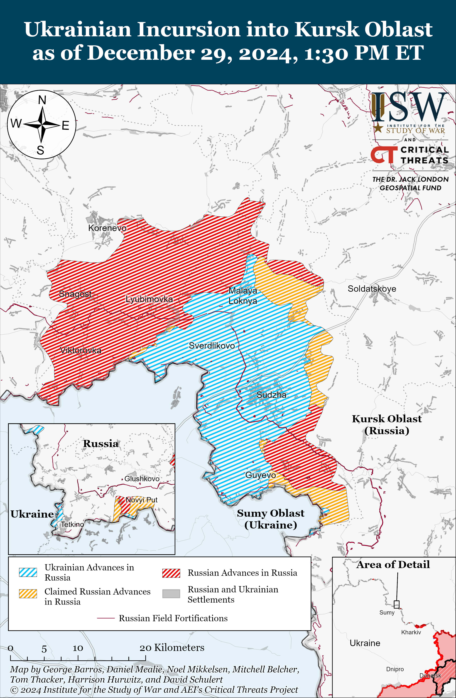
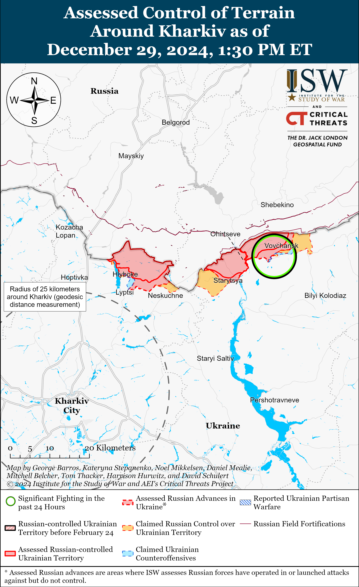
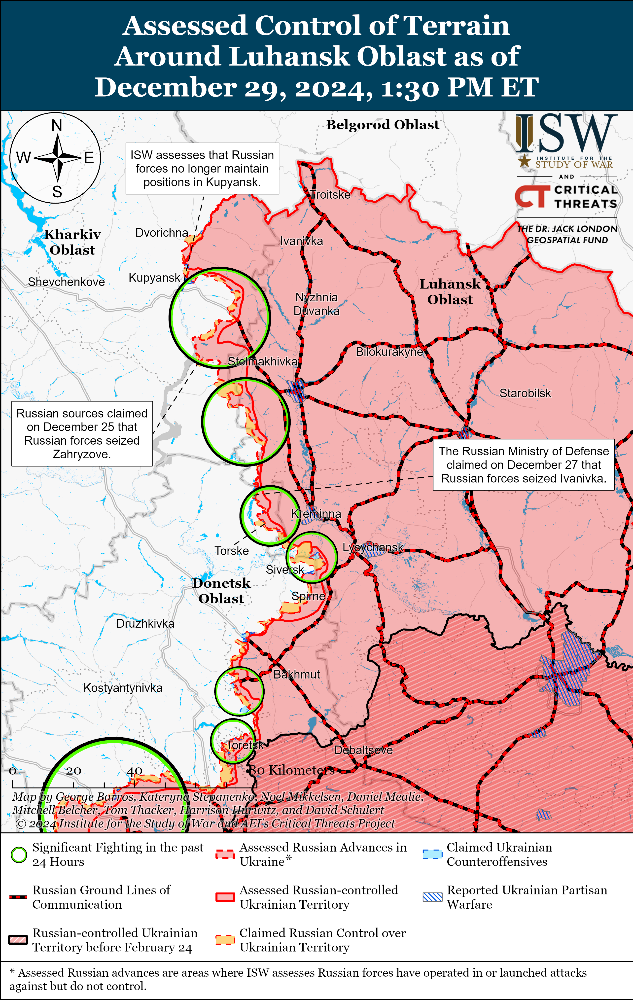
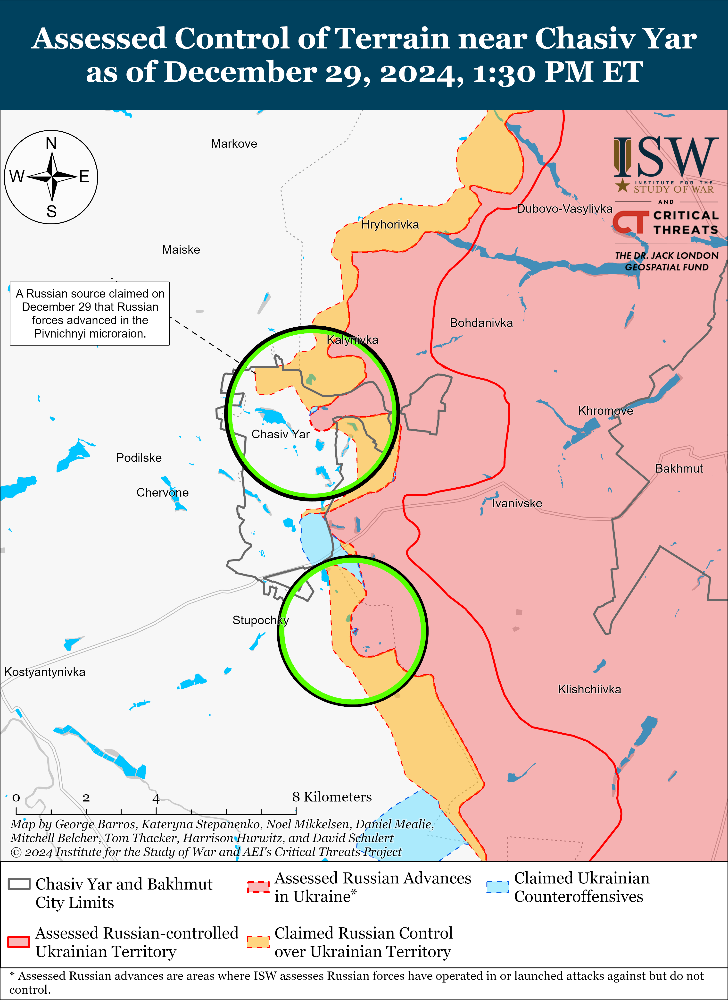
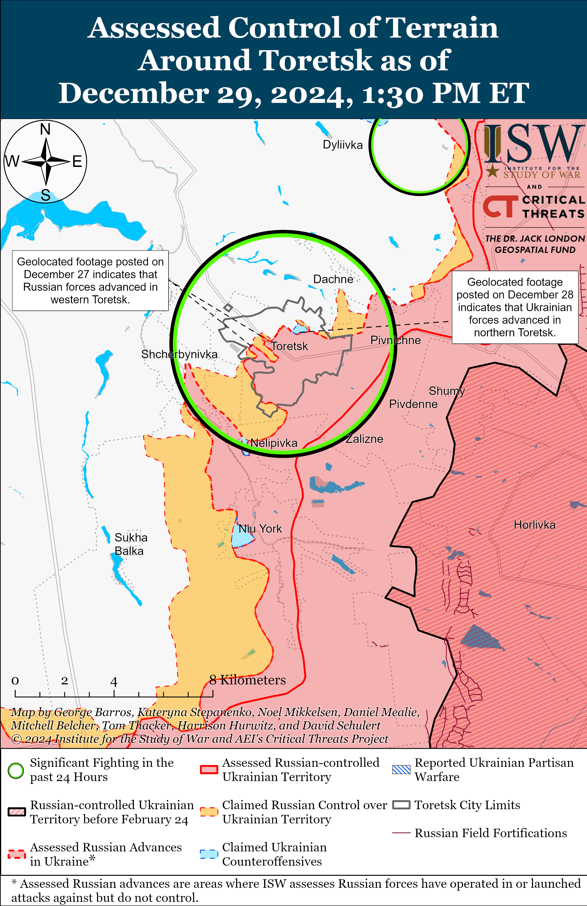
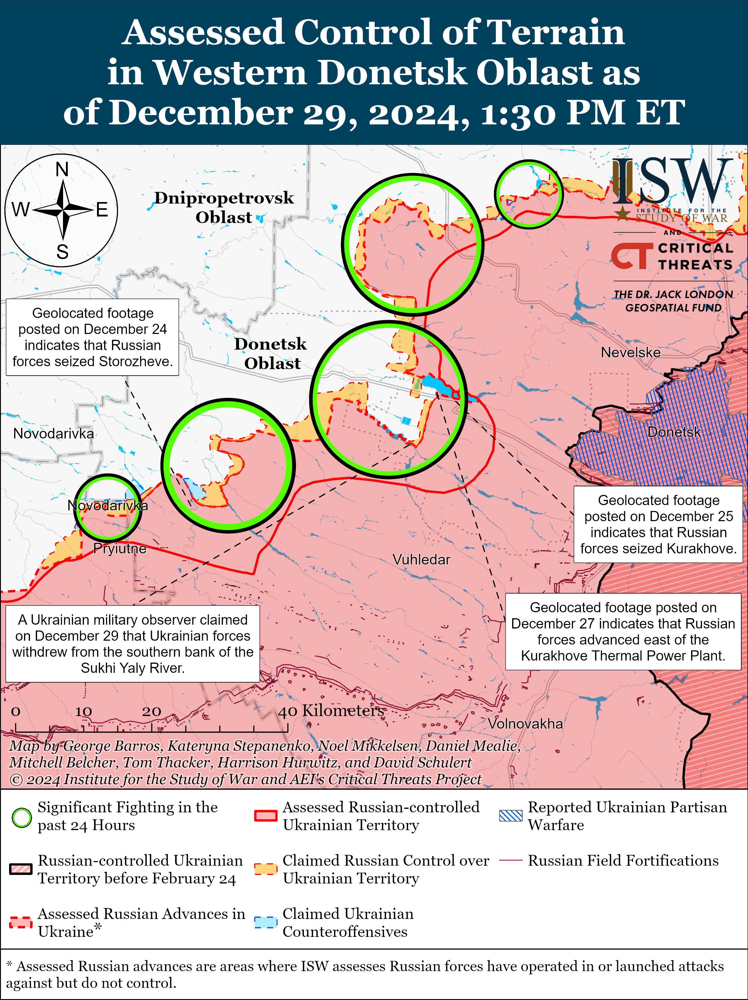
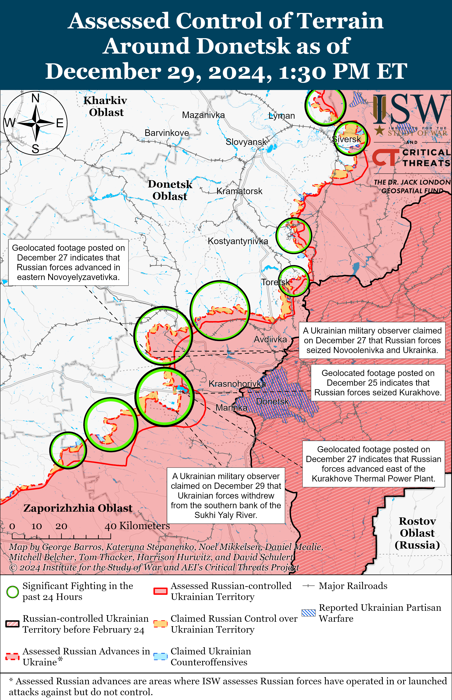
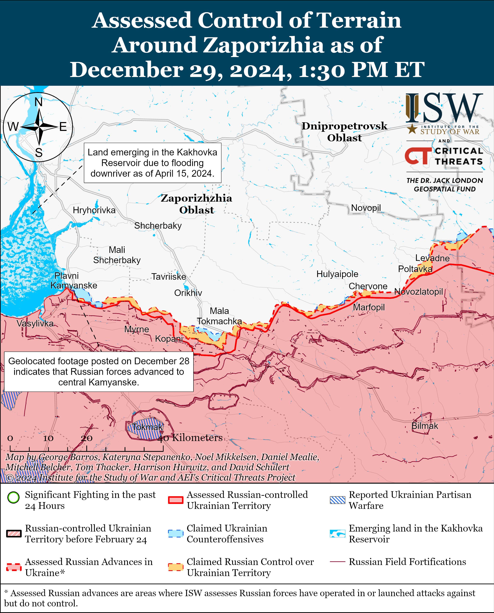
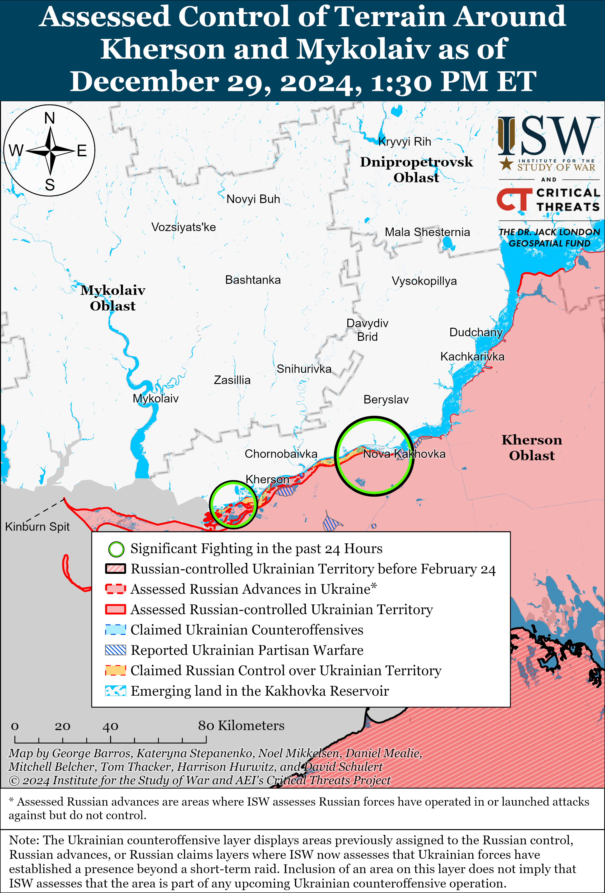

# Russian Offensive Campaign Assessment, December 29, 2024

**Nicole Wolkov, Kateryna Stepanenko, Christina Harward, Olivia Gibson, William Runkel, and George Barros**

**December 29, 2024, 6:00 pm ET**

**Click** [**here**](https://storymaps.arcgis.com/stories/36a7f6a6f5a9448496de641cf64bd375) **to see ISW’s interactive map of the Russian invasion of Ukraine. This map is updated daily alongside the static maps present in this report.**

**Click** [**here**](https://storymaps.arcgis.com/stories/83a2f24901c941d581c0c523ecd2619b)**to see ISW’s interactive map of Ukraine’s offensive in Kursk Oblast.**

**Click** [**here**](https://understandingwar.maps.arcgis.com/apps/instant/3dviewer/index.html?appid=1602762dbcde419bb957dea358449580) **to see ISW’s 3D control of terrain topographic map of Ukraine. Use of a computer (not a mobile device) is strongly recommended for using this data-heavy tool.**

**Click** [**here**](https://storymaps.arcgis.com/stories/733fe90805894bfc8562d90b106aa895) **to access ISW’s archive of interactive time-lapse maps of the Russian invasion of Ukraine. These maps complement the static control-of-terrain map that ISW produces daily by showing a dynamic frontline. ISW will update this time-lapse map archive monthly.**

**Note: The data cut-off for this product was 12:15 pm ET on December 29. ISW will cover subsequent reports in the December 29 Russian Offensive Campaign Assessment.**

**Russian Foreign Minister Sergei Lavrov explicitly rejected two suggestions reportedly considered by US President-elect Donald Trump’s team in early November 2024 as conditions for ending the war in Ukraine – the delay of Ukraine’s membership in NATO for 20 years and the deployment of European peacekeepers in Ukraine.** Lavrov stated in an interview with Kremlin newswire *TASS* published on December 29 that Russia is “not satisfied” with the Trump team’s reported early November 2024 proposals to delay Ukraine’s membership in NATO for 20 years and to station a European peacekeeping contingent in Ukraine.[1] Lavrov is amplifying Russian President Vladimir Putin’s December 26 explicit rejection of the Trump team’s reported suggestion to delay Ukraine’s membership in NATO for 20 years.[2] Lavrov stated that any agreements to end the war in Ukraine “must eliminate the root causes” of Russia’s invasion of Ukraine and “must establish a mechanism to make it impossible to violate them.”[3] Lavrov claimed in an interview on December 26 that the two main “root causes” of the war are NATO’s alleged violation of obligations to not advance eastward and “aggressive absorption” of areas near Russia’s borders and the Ukrainian government’s alleged discrimination against ethnic Russians and Russian language, media, and culture in Ukraine.[4] Lavrov’s statements are part of ongoing senior Russian officials’ statements that the Kremlin refuses to consider any compromises on Putin’s late 2021 and early 2022 demands.[5] These demands include forcing Ukraine to become a permanently neutral state that will never join NATO, imposing severe limitations on the size of the Ukrainian military, and removing the Ukrainian government.[6]

**Russian President Vladimir Putin enshrined his alleged policy of Ukrainian “denazification” in a new state strategy document about countering extremism, demonstrating how Putin continues to make the same demands for the removal of the Ukrainian government that he made in 2022 when launching the full-scale invasion of Ukraine.** Putin signed on December 28 a new Strategy for Countering Extremism in Russia.[7] Putin signed Russia’s last iteration of such strategy in 2020. The 2024 strategy includes mentions of “Russophobia” for the first time, which the document defines as the “unfriendly, biased, and hostile” attitudes and “discriminatory actions” towards Russian citizens, language, and culture by states that are unfriendly to Russia. The 2024 document, unlike the 2020 version, also lists Ukraine as a main source of extremism and accuses Ukraine of disseminating neo-Nazi ideas. The documents states that Russia needs to “eliminate” the source of extremist threats that come from Ukraine. Putin claimed in February 2022 when he launched the full-scale invasion of Ukraine that Russia was pursuing the “denazification” of Ukraine – an attempt to justify the removal of the legitimate, democratically elected government of Ukraine.[8] Putin has made similar statements recently reiterating his refusal to consider compromises on his late 2021 and early 2022 demands.[9] The document’s mentions of “Russophobia” and “discrimination” against Russian citizens, language, and culture also align with Russian Foreign Minister Sergei Lavrov’s recent talking point that such alleged discrimination by the current Ukrainian authorities is a “root cause” of Russia’s war against Ukraine that any future negotiations must address.[10] The Kremlin will likely exploit this new strategy document to justify its calls for the removal of the Ukrainian government as “anti-extremist” measures.

The strategy document also included points that will resonate with the Russian pro-war ultranationalist community, likely as part of Kremlin efforts to placate and garner favor with this key constituency. The document claims that migrants in Russia are conducting illegal activities that are contributing to the spread of extremism in unspecified federal subjects in Russia.[11] The document calls for Russia to tighten its migration policy, including by combatting “propaganda events” that take place in migrant residences. The document also calls for Russia to adjust educational programs in the South Caucasus and Central Asia to prevent the spread of Russophobia. The Russian ultranationalist milblogger community has repeatedly called for Russia to enact more stringent migration policies and has complained about “Russophobia” in former Soviet states such as Kazakhstan.[12] ISW continues to assess that Putin must cater to his xenophobic and ultranationalist constituency – some of the staunchest supporters of Russia’s war in Ukraine – while also balancing Russia’s need for migrant labor for its economy and military.[13]

**Azerbaijani President Ilham Aliyev accused Russia of shooting the Azerbaijan Airlines Embraer 190 passenger flight over the Republic of Chechnya on December 25 and of attempting to cover up Russia’s responsibility for the plane’s crash in Kazakhstan — effectively rejecting Russian President Vladimir Putin’s lackluster apology.** Aliyev gave an interview to Azerbaijani TV published on December 29 in which he rejected Russian officials’ theories that a bird strike and a gas cylinder explosion caused the crash.[14] Aliyev noted that preliminary information clearly indicated that the aircraft sustained damage from ground-based fire near Grozny, Chechnya and that Russian electronic warfare (EW) systems made the plane uncontrollable.[15] Aliyev also stated that Russia introduced an emergency airspace closure in Grozny only after striking the aircraft, and Aliyev suggested that this was part of Russian local authorities’ attempts to conceal Russia’s responsibility for the crash. Aliyev noted that Russia also pushed for the Interstate Aviation Committee, which he alleged is composed of mostly Russian officials and citizens, to conduct the investigation into the crash in order to further cover up Russia’s involvement in the crash. Aliyev noted that Azerbaijan refused investigative assistance from this committee due its lack of objectivity. Aliyev’s interview follows Putin’s vague apology to Aliyev on December 28, in which Putin did not directly admit Russia’s culpability in the crash and simply stated that a “tragic accident” occurred in Russian air space.[16] Aliyev publicly reiterated the demands he reportedly made to Putin on December 27: the Kremlin must apologize to Azerbaijan, admit its culpability, punish the guilty parties, and pay compensation to Azerbaijani passengers and crew. Putin reportedly once again called Aliyev on December 29 to discuss the crash, but neither party offered a complete read out of the interaction.[17] The timing of the publication of Aliyev’s interview and official statements about Putin’s call to Aliyev suggests that Putin may have called Aliyev following the interview’s publication and that the call likely concerned Aliyev’s public accusations and demands.

**Ukrainian forces are successfully innovating to combat Russian guided glide bomb strikes against Kharkiv Oblast.** Kharkiv Oblast Military Administration Head Oleh Synehubov stated on December 29 that Russian forces started experimenting with and conducting D-30 universal joint glide munition (UMPB) guided glide bomb strikes against Kharkiv Oblast in March 2024 and have since modified them to have a range of up to 80 kilometers.[18] Synehubov stated that Russian forces started launching guided glide bombs from within Russian airspace roughly 40 kilometers away from the international Russian-Ukrainian border, allowing the bombs to strike targets up to 40 kilometers inside Ukraine. Kharkiv Oblast Police Force’s Explosive Department Head Volodymyr Bezruk stated that D-30 guided glide bombs can deviate from a target by up to 50 meters and that the damages from D-30 UMPB and unguided FAB-250/500 glide bombs are similar because both bombs use the same type of warhead.[19] Bezruk stated that Ukrainian forces are using machine guns and electronic warfare (EW) interference to down and divert guided glide bombs since glide bombs’ lack of a thermal energy signature prevents portable air defense systems from targeting the bombs. Ukrainian Kharkiv Group of Forces Spokesperson Lieutenant Colonel Yevheniy Romanov stated that Russian forces launched the most guided glide bombs against Kharkiv City in May and September 2024 but that Russian forces have not conducted any guided glide bomb strikes on Kharkiv City since November 2024 and have been using aviation assets less frequently in the northern Kharkiv Oblast border area. Romanov noted that Ukrainian forces recently struck several large ammunition depots within Russia that stored guided glide bombs, limiting the Russian military’s guided glide bomb stockpiles. The spokesperson of a Ukrainian brigade operating in the Lyman direction stated that Russian forces conducted roughly three to four guided glide bombs strikes per day in the Lyman direction in November 2024 but are now conducting strikes with Shahed drones instead.[20]

**The US delivered its first liquified natural gas (LNG) shipment to Ukraine on December 27.** Ukraine’s largest private energy company DTEK announced on December 27 that the LNG delivery consists of approximately 100 million cubic meters of gas and represents Kyiv’s first direct LNG purchase from the US.[21] The US LNG shipment is part of a broader agreement between DTEK and US company Venture Global to supply Ukraine with US LNG that extends through 2026 and an additional 20-year LNG purchase agreement.[22] Ukraine stopped purchasing Russian gas in November 2015, though Ukraine continues to transport Russian gas to other European customers through Ukrainian gas pipelines – an important source of revenue for Ukraine.[23] Russia’s and Ukraine’s current gas transportation contract will expire at the end of December 31, 2024, and it remains unclear whether or when Russia and Ukraine may renew the contract. This US LNG delivery marks Ukraine’s latest effort to offset Russia’s weaponization of energy exports and solidify Ukraine’s energy independence from Moscow.

**Salome Zurabishvili announced her departure from the Georgian presidential palace on December 29 but stated that she considers herself to be Georgia’s “legitimate” president.** The Georgian government inaugurated Georgian Dream’s presidential candidate Mikheil Kavelashvili as Georgian president on December 29.[24] Georgians protested against Kavelashvili’s inauguration in Tbilisi, and police began arresting protestors.[25]

**Key Takeaways:**

- **Russian Foreign Minister Sergei Lavrov explicitly rejected two suggestions reportedly considered by US President-elect Donald Trump’s team in early November 2024 as conditions for ending the war in Ukraine – the delay of Ukraine’s membership in NATO for 20 years and the deployment of European peacekeepers in Ukraine.**
- **Russian President Vladimir Putin enshrined his alleged policy of Ukrainian “denazification” in a new state strategy document about countering extremism, demonstrating how Putin continues to make the same demands for the removal of the Ukrainian government that he made in 2022 when launching the full-scale invasion of Ukraine.**
- **Azerbaijani President Ilham Aliyev accused Russia of shooting the Azerbaijan Airlines Embraer 190 passenger flight over the Republic of Chechnya on December 25 and of attempting to cover up Russia’s responsibility for the plane’s crash in Kazakhstan — effectively rejecting Russian President Vladimir Putin’s lackluster apology.**
- **Ukrainian forces are successfully innovating to combat Russian guided glide bomb strikes against Kharkiv Oblast.**
- **The US delivered its first liquified natural gas (LNG) shipment to Ukraine on December 27.**
- **Salome Zurabishvili announced her departure from the Georgian presidential palace on December 29 but stated that she considers herself to be Georgia’s “legitimate” president.**
- **Russian forces recently advanced near Pokrovsk and Vuhledar and in western Zaporizhia Oblast.**
- **Russia reportedly continues to face labor shortages that Russian military recruitment and persistent demographic problems are likely exacerbating.**

***We do not report in detail on Russian war crimes because these activities are well-covered in Western media and do not directly affect the military operations we are assessing and forecasting. We will continue to evaluate and report on the effects of these criminal activities on the Ukrainian military and the Ukrainian population and specifically on combat in Ukrainian urban areas. We utterly condemn Russian violations of the laws of armed conflict and the Geneva Conventions and crimes against humanity even though we do not describe them in these reports.***

- Ukrainian Operations in the Russian Federation
- Russian Main Effort – Eastern Ukraine (comprised of three subordinate main efforts)
- Russian Subordinate Main Effort #1 – Push Ukrainian forces back from the international border with Belgorod Oblast and approach to within tube artillery range of Kharkiv City
- Russian Subordinate Main Effort #2 – Capture the remainder of Luhansk Oblast and push westward into eastern Kharkiv Oblast and encircle northern Donetsk Oblast
- Russian Subordinate Main Effort #3 – Capture the entirety of Donetsk Oblast
- Russian Supporting Effort – Southern Axis
- Russian Air, Missile, and Drone Campaign
- Russian Mobilization and Force Generation Efforts
- Russian Technological Adaptations
- Activities in Russian-occupied areas
- Significant Activity in Belarus

**Ukrainian Operations in the Russian Federation**

Russian forces continued assaults in the Ukrainian salient in Kursk Oblast on December 28 and 29 but did not make any confirmed advances.[26] A Russian milblogger claimed on December 29 that Russian forces repelled a Ukrainian attack near Kruglenkoye (southeast of Korenevo).[27] Ukrainian military observer Yuriy Butusov reported that Russian forces are deploying fewer armored vehicles in Kursk Oblast but have significantly increased their sabotage and reconnaissance operations.[28] Elements of the Russian 11th Airborne (VDV) Brigade are reportedly operating in Cherkasskaya Konopelka (southeast of Sudzha).[29]

The Ukrainian Air Force reported on December 29 that Russian forces launched six S-300/S-400 missiles from Belgorod Oblast targeting Kursk and Sumy oblasts on the night of December 28 to 29.[30]

A Russian insider source claimed on December 29 that several Chechen personnel in the “Zapad-Akhmat” Battalion attacked a Russian military police checkpoint in Golovchino (southwest of Belgorod City) after an argument about vehicle documentation, demonstrating the continued tension between Chechen and regular Russian forces.[31]

**Russian Main Effort – Eastern Ukraine**

**Russian Subordinate Main Effort #1 – Kharkiv Oblast** **(Russian objective: Push Ukrainian forces back from the international border with Belgorod Oblast and approach to within tube artillery range of Kharkiv City)**

Russian forces continued ground attacks northeast of Kharkiv City near Hatyshche and Vovchansk on December 28 and 29 but did make any confirmed advances.[32] A Russian milblogger claimed on December 29 that Russian forces have been engaged in positional fighting near Vovchansk for “many months” without accomplishing Russian President Vladimir Putin’s goal of pushing Ukrainian lines away from the international border with Belgorod Oblast and that Russian forces will likely continue doing so in 2025.[33]

**Russian Subordinate Main Effort #2 – Luhansk Oblast** **(Russian objective: Capture the remainder of Luhansk Oblast and push westward into eastern Kharkiv Oblast and northern Donetsk Oblast)**

Russian forces continued offensive operations along the Kupyansk-Svatove-Kreminna line on December 29 but did not make any confirmed advances. A Russian milblogger claimed on December 29 that Russian forces, including elements of the 144th Motorized Rifle Division (20th Combined Arms Army [CAA], Moscow Military District [MMD]), advanced in southern Terny (west of Kreminna), but ISW has not observed confirmation of this claim.[34] Russian forces continued attacking east of Kupyansk near Petropavlivka and Kucherivka; southeast of Kupyansk near Lozova and Hlushkivka; south of Kupyansk in the direction of Novoplatonivka; west of Svatove near Zelenyi Hai, Pershotravneve, Kopanky, Novoyehorivka, and Nadiya; northwest of Kreminna near Tverdokhibove, Ivanivka, Makiivka, Hrekivka, and Terny; west of Kreminna near Torske, Yampolivka, and Zarichne; and southwest of Kreminna near Dibrova, Platonivka, and the Serebraynske forest area on December 28 and 29.[35]

**Russian Subordinate Main Effort #3 – Donetsk Oblast** **(Russian objective: Capture the entirety of Donetsk Oblast, the claimed territory of Russia’s proxies in Donbas)**

Russian forces continued offensive operations in the Siversk direction on December 29 but did not make any confirmed advances.[36] Elements of the Russian 2nd Artillery Brigade (3rd Combined Arms Army [CAA], formerly 2nd Luhansk People’s Republic Army Corps [LNR AC]) are reportedly operating near Verkhnokamyanske (east of Siversk).[37]

Russian forces continued offensive operations in the Chasiv Yar direction on December 29 but did not make any confirmed advances. Russian milbloggers claimed that Russian forces advanced to Chernyshevskoho Street and to the railway station in western Chasiv Yar.[38] ISW has not observed confirmation of these claims, however. Russian forces continued attacking within Chasiv Yar and south of Chasiv Yar near Stupochky on December 28 and 29.[39] Russian milbloggers claimed that fighting continued near the Refractory Plant in central Chasiv Yar and that Ukrainian forces counterattacked near the Siverskyi Donets Donbas Canal south of Novyi Microraion in southern Chasiv Yar.[40] Elements of the Russian “Sever-V” Brigade (Russian Volunteer Corps), 98th Airborne (VDV) Division, 4th Motorized Rifle Brigade (3rd CAA), 200th Motorized Rifle Brigade (14th AC, Leningrad Military District [LMD]), “Pitbulya” Motorized Assault Battalion of the “Hispaniola” Volunteer Brigade (Russian Volunteer Corps), “Shustry” detachment of Chechen “Akhmat” Spetsnaz, and 1194th Motorized Rifle Regiment (reportedly of the 7th Military Base, 49th CAA, Southern Military District [SMD]) are all reportedly operating in the Chasiv Yar direction.[41]

Russian forces continued offensive operations in the Toretsk direction on December 29 but did not make any confirmed advances. A Russian milblogger claimed that Russian forces advanced in an unspecified area within Toretsk, but ISW has not observed confirmation of this claim.[42] Russian forces continued attacking within Toretsk itself and west of Toretsk near Shcherbynivka on December 28 and 29.[43] Drone elements of the Russian 80th “Sparta” Separate Reconnaissance Battalion (51st CAA, formerly the 1st Donetsk People’s Republic [DNR] AC) are reportedly operating in Toretsk.[44]

Russian forces continued offensive operations in the Kurakhove direction on December 29 but did not make any confirmed advances. Russian milbloggers claimed that Russian forces seized Shevchenko (northwest of Kurakhove) and advanced to the outskirts of Petropavlivka (north of Shevchenko).[54] Russian forces conducted offensive operations near Kurakhove itself, including at and near the Kurakhivske Thermal Power Plant (TPP) west of Kurakhove; northwest of Kurakhove near Ukrainka, Slovyanka, and Petropavlivka; and west of Kurakhove near Dachne on December 28 and 29.[55] Mashovets stated that elements of the Russian 110th and 5th motorized rifle brigades (both of the 51st CAA) are attacking in the Stari Terny-Shevchenko direction (northwest of Kurakhove) and have advanced to the Solona River between Stari Terny and Shevchenko; that elements of the 6th Tank Regiment, 428th Motorized Rifle Regiment (both of the 90th Tank Division, 41st CAA, CMD), 67th Separate Rifle Regiment (possibly a reformed Soviet-era unit), and 87th Separate Rifle Regiment (1st “Slavic” Motorized Rifle Brigade, 51st CAA) resumed attacks in the Zorya-Slovyanka and Sontsivka-Petropavlivka directions (both northwest of Kurakhove); and that elements of the 150th and 20th motorized rifle divisions (both of the 8th CAA, SMD) and 5th Motorized Rifle Brigade (51st CAA) are attacking in Kurakhove and in the Dalne direction (south of Kurakhove).[56] Elements of the Russian “Vega” Spetsnaz Detachment (24th Spetsnaz Brigade, Main Intelligence Directorate of the Russian General Staff [GRU]) and drone operators of the 255th Motorized Rifle Regiment (20th Motorized Rifle Division, 8th CAA, Southern Military District [SMD]) are reportedly operating in the Kurakhove direction.[57]

Russian forces continued offensive operations in the Vuhledar direction on December 29. Mashovets stated that Ukrainian forces have likely completely withdrawn from the southern bank of the Sukhi Yaly River.[58] Russian milbloggers claimed that Russian forces advanced near Zelenivka (northwest of Vuhledar) and to Rozlyv (west of Zelenivka).[59] Russian forces conducted offensive operations north of Vuhledar near Uspenivka and northwest of Vuhledar near Kostyantynopolske, Yantarne, and Kostyantynopil on December 28 and 29.[60] A Russian source claimed that Ukrainian forces counterattacked near Uspenivka and Rozlyv.[61] Mashovets stated that elements of the Russian 114th Motorized Rifle Brigade (51st CAA) and 57th Motorized Rifle Brigade (5th CAA, EMD) are attacking along the Zelenivka-Uspenivka line.[62]

Russian forces continued offensive operations near Velyka Novosilka on December 29 but did not make any confirmed advances. Russian forces conducted offensive operations near Velyka Novosilka itself, south of Velyka Novosilka near Neskychne, southwest of Velyka Novosilka near Vremivka, and west of Velyka Novosilka near Pryvilne on December 28 and 29.[63] A Russian source claimed that Russian forces advanced eastward along the O0510 Velyka Novosilka-Hulyaipole highway towards Vremika and that Russian forces are roughly one kilometer from Vremivka.[64] ISW has not observed confirmation of this claim and has only observed confirmation that Russian forces west of Vremivka are roughly three kilometers from the settlement. Mashovets stated that elements of the Russian 37th Motorized Rifle Brigade and 5th Tank Brigade (both of the 36th CAA, EMD), and 60th Motorized Rifle Brigade (5th CAA, EMD) are attacking from Blahodatne (south of Velyka Novosilka), Zolota Nyva (southeast of Velyka Novosilka), and Shakhtarske (east of Velyka Novosilka) towards Velyka Novosilka and that elements of the 127th Motorized Rifle Division (5th CAA, EMD) are attacking near the O0510 highway west of Velyka Novosilka.[65]

**Russian Supporting Effort – Southern Axis** **(Russian objective: Maintain frontline positions and secure rear areas against Ukrainian strikes)**

Russian forces recently advanced in western Zaporizhia Oblast amid continued offensive operations in the area on December 29. Geolocated footage published on December 28 indicates that Russian forces recently marginally advanced to central Kamyanske (northwest of Robotyne and south of Zaporizhzhia City), and a Russian milblogger similarly claimed that Russian forces advanced in central Kamyanske.[66] Zaporizhia Oblast occupation official Vladimir Rogov claimed on December 29 that Russian forces repelled Ukrainian counterattacks near Kamyanske and are continuing to advance near the settlement.[67] The Ukrainian General Staff reported that Russian forces did not conduct offensive operations in the Orikhiv (north of Robotyne) or Hulyaipole (northeast of Robotyne) directions on December 28 and 29.[68] A Russian milblogger claimed on December 29 that Russian forces operating in the Kamyanske direction do not have enough drones.[69] Elements of the Russian 1429th Repair Battalion are reportedly operating in the Zaporizhia direction.[70]

Russian forces continued assaults in the Dnipro direction and on the islands in the Dnipro River Delta on December 28 and 29 but did not make any confirmed advances.[71] Ukraine’s Southern Operational Command reported on December 29 that Russian forces assaulted Ukrainian positions on the Velikiy Potemkin Island (south of Kherson City).[72]

The Crimea-based Ukrainian “Atesh” partisan organization reported on December 29 that Russian forces are using the Black Sea Fleet’s (BSF) 91st Naval Repair Plant in occupied Sevastopol solely to repair and restore Russian ships because the plant is unable to produce new ships.[73] Elements of the Russian 68th Coastal Defense Ship Brigade (BSF) are reportedly stationed near the repair facility in Striletska Bay.

Russian forces are reportedly installing air defense systems in the Kerch Strait to protect Russian ports and naval infrastructure from Ukrainian missile and drone strikes. A Ukrainian partisan source reported on December 28 that Russian forces recently installed a Pantsir-S1 air defense system near Ilich, Krasnodar Krai on the Chushka Spit, likely in an attempt to bolster air defenses near the Russian port of Kavkaz, Krasnodar Krai.[74] The source stated that Russian forces and officials use the port of Kavkaz to ship stolen grain from occupied southern Ukraine and Russian military equipment from the Kuban region to occupied Crimea using civilian ferries. The source added that the new air defenses might also protect the Kerch Strait Bridge.

**Russian Air, Missile, and Drone Campaign** **(Russian Objective: Target Ukrainian military and civilian infrastructure in the rear and on the frontline)**

Russian forces conducted a series of drone strikes against Ukraine on the night of December 28 to 29. The Ukrainian Air Force reported that Russian forces launched 10 Shaheds and other strike drones from occupied Crimea.[75] The Ukrainian Air Force reported that Ukrainian forces downed nine drones over Mykolaiv Oblast.

Ukrainian President Volodymyr Zelensky reported on December 29 that Russian forces launched 370 strike drones, 280 guided glide bombs, and 80 missiles of various models against Ukraine during the previous week (from December 22 to 28).[76]

Director of the Kharkiv Oblast Emergency Medical Center Viktor Zabashta reported on December 29 that Russian forces systematically utilized “double tap” strike methods, whereby a second strike targets the location of a previous strike in an attempt to target first responders and prevent them from helping the wounded, in 2024 but started using this method in 2022.[77]

Ukrainian Ambassador to the European Union (EU) Vsevolod Chentsov stated in a December 27 *Politico* article that Russian forces are using artificial intelligence (AI) in Shahed drones to increase their resilience against Ukrainian electronic warfare (EW) and to enable the drones to recognize and strike targets when disconnected from networks.[78] A Russian milblogger claimed on December 28 that Russian forces have modernized the Shahed-136 drone, including by adding new lenses and filming capabilities, making the drones notably more expensive to manufacture.[79]

**Russian Mobilization and Force Generation Efforts** **(Russian objective: Expand combat power without conducting general mobilization)**

Russia reportedly continues to face labor shortages that Russian military recruitment and persistent demographic problems are likely exacerbating. Ukraine’s Foreign Intelligence Service (SZRU) reported on December 27 that Russian labor shortage amounts to about 1.5 million people with an unemployment rate of 2.3 percent.[80] The SZRU noted that the Russian labor force decreased by one million people between 2022 and 2024 and is currently about 76.3 million people. The SZRU reported that Russia is experiencing the most acute labor shortages among people aged 19 to 40 and in the IT and retail sectors. The SZRU added that there is a labor shortage of 400,000 people in the construction sector and assessed that Russian labor shortages will increase to four million people by 2030 due to the ongoing Russian war effort in Ukraine and restrictive migration policies.

Ukrainian Deputy Tamila Tasheva reported on December 29 that Crimean occupation officials have conscripted 50,000 Crimeans since either 2014 or 2015 and have mobilized several thousand Crimeans since 2022.[81]

**Russian Technological Adaptations** **(Russian objective: Introduce technological innovations to optimize systems for use in Ukraine)**

Ukrainian military outlet *Militarnyi* reported that Russian media recently published video purportedly showing Russian forces using a new, unknown wheeled self-propelled artillery system, which may be a modification of the 152mm “Malva” self-propelled howitzer.[82] The video shows that the new artillery system has the base of the BAZ-6010-027 armored chassis produced at the Bryansk Automobile Plant with a wheel arrangement that is a modification of the BAZ-6910 truck. The new artillery system, including its guidance system, is reportedly analogous to the “Malva” self-propelled howitzer but has a different long-range gun from the 2A36 “Hyacinth-B.” The different gun reportedly increased the maximum firing range of the artillery system with conventional high-explosive munitions from 24.7 kilometers to 30.5 kilometers and with active-reactive shells from 29 kilometers to 33.1 kilometers. The video indicated that the new artillery system also has anti-drone screens made of fabric and an electronic warfare (EW) system.

A Ural Civil Aviation Plant (UZGA) representative announced on December 28 that UZGA delivered the first two UTS-800 training aircraft to the Russian Ministry of Defense (MoD).[83] The representative stated that Russia will use the two UTS-800 aircraft for flight training in MoD’s higher military educational institutions.

**Activities in Russian-occupied areas** **(Russian objective: Consolidate administrative control of annexed areas; forcibly integrate Ukrainian citizens into Russian sociocultural, economic, military, and governance systems)**

Russian occupation officials are continuing to use the “Movement of the First” youth movement to militarize and illegally transport Ukrainian children to Russia. Zaporizhia Oblast occupation governor Yevgeny Balitsky stated on December 29 that children from occupied Zaporizhia Oblast visited Moscow as part of a “Movement of the First” program.[84] Luhansk People’s Republic (LNR) Head Leonid Pasechnik claimed on December 24 that 60,000 children from occupied Luhansk Oblast joined the “Movement of the First” in 2024 and that 50,000 children participated in the movement’s events.[85]

**Significant activity in Belarus** **(Russian efforts to increase its military presence in Belarus and further integrate Belarus into Russian-favorable frameworks)**

Ukrainian State Border Guard Service Spokesperson Andriy Demchenko reported on December 29 that there are no unusual situations in Belarus north of the international border with Ukraine.[86] Demchenko added that Russian forces do not have sufficient forces deployed in Belarus to conduct a renewed invasion of Ukrainian territory or escalate the situation along the Ukrainian-Belarusian border.

**Note: ISW does not receive any classified material from any source, uses only publicly available information, and draws extensively on Russian, Ukrainian, and Western reporting and social media as well as commercially available satellite imagery and other geospatial data as the basis for these reports. References to all sources used are provided in the endnotes of each update.**

[1] https://tass dot ru/politika/22800005

[2] https://www.wsj.com/world/trump-presidency-ukraine-russia-war-plans-008655c0 ; https://understandingwar.org/backgrounder/russian-offensive-campaign-assessment-december-26-2024

[3] https://tass dot ru/politika/22800189

[4] https://mid dot ru/ru/foreign\_policy/news/1989213/

[5] https://understandingwar.org/backgrounder/russian-offensive-campaign-assessment-december-19-2024 ; https://isw.pub/UkrWar122424

[6] https://understandingwar.org/backgrounder/russian-offensive-campaign-assessment-december-19-2024

[7] https://meduza dot io/news/2024/12/28/putin-utverdil-novuyu-strategiyu-protivodeystviya-ekstremizmu-tam-poyavilsya-termin-rusofobiya-i-govoritsya-ob-ekstremistskih-ugrozah-iz-ukrainy ; http://publication.pravo.gov dot ru/document/0001202412280115?index=1 ; https://www.rbc dot ru/politics/28/12/2024/677022ae9a79470ca6343532?from=short\_news

[8] http://kremlin dot ru/events/president/news/67843

[9] https://isw.pub/UkrWar122624

[10] https://mid dot ru/ru/foreign\_policy/news/1989213/; https://tass dot ru/politika/22800189

[11] https://meduza dot io/news/2024/12/28/putin-utverdil-novuyu-strategiyu-protivodeystviya-ekstremizmu-tam-poyavilsya-termin-rusofobiya-i-govoritsya-ob-ekstremistskih-ugrozah-iz-ukrainy ; http://publication.pravo.gov dot ru/document/0001202412280115?index=1 ; https://t.me/istories\_media/8666

[12] https://understandingwar.org/backgrounder/russian-offensive-campaign-assessment-january-17-2024 ; https://understandingwar.org/backgrounder/russian-offensive-campaign-assessment-january-16-2024 ; https://understandingwar.org/backgrounder/russian-offensive-campaign-assessment-december-18-2024

[13] https://isw.pub/UkrWar071924 ; https://isw.pub/UkrWar071524 ; https://isw.pub/UkrWar062824 ; https://isw.pub/UkrWar06272024 ; https://isw.pub/UkrWar041024; https://understandingwar.org/backgrounder/russian-offensive-campaign-assessment-october-25-2024; https://understandingwar.org/backgrounder/russian-offensive-campaign-assessment-october-27-2024

[14] https://aztv dot az/az/news/32629/prezident-ilham-eliyev-azerbaycan-televiziyasina-musahibe-verib

[15] https://aztv dot az/az/news/32629/prezident-ilham-eliyev-azerbaycan-televiziyasina-musahibe-verib

[16] https://understandingwar.org/backgrounder/russian-offensive-campaign-assessment-december-28-2024

[17] https://www.interfax dot ru/russia/1001234 ; https://meduza dot io/news/2024/12/29/putin-snova-pozvonil-alievu-iz-za-katastrofy-samoleta-azerbaijan-airlines ; https://president dot az/ru/articles/view/67814

[18] https://suspilne dot media/kharkiv/913085-ak-zminilasa-bezpekova-situacia-v-harkovi-v-2024-roci-cerez-udari-kerovanimi-aviabombami/

[19] https://suspilne dot media/kharkiv/913085-ak-zminilasa-bezpekova-situacia-v-harkovi-v-2024-roci-cerez-udari-kerovanimi-aviabombami/

[20] https://armyinform dot com.ua/2024/12/28/kabiv-menshe-shahediv-bilshe-na-lymanskomu-napryamku-vorog-zminyv-taktyku-udariv/

[21] https://www.ft.com/content/a769f6a0-00af-4e20-8b6d-16177ee72c96?sharetype=blocked ; https://euromaidanpress dot com/2024/12/28/ukraine-receives-first-lng-shipment-from-us-amid-shift-from-russian-gas/ ; https://dtek dot com/en/media-center/news/ukraine-dtek-first-lng-shipment-us/

[22] https://www.prnewswire.com/news-releases/venture-global-announces-landmark-energy-security-agreement-with-dtek-of-ukraine-302171860.html

[23] https://www.radiosvoboda dot org/a/ukrajina-rosija-hazova-vijna/30262980.html ; https://www.bbc.co.uk/news/world-europe-34920207 ; https://epravda dot com.ua/rus/projects/gazpravda/2021/11/29/680209/

[24] https://www.radiotavisupleba dot ge/a/%E1%83%9B%E1%83%98%E1%83%AE%E1%83%94%E1%83%98%E1%83%9A-%E1%83%A7%E1%83%90%E1%83%95%E1%83%94%E1%83%9A%E1%83%90%E1%83%A8%E1%83%95%E1%83%98%E1%83%9A%E1%83%98%E1%83%A1-%E1%83%98%E1%83%9C%E1%83%90%E1%83%A3%E1%83%92%E1%83%A3%E1%83%A0%E1%83%90%E1%83%AA%E1%83%98%E1%83%98%E1%83%A1-%E1%83%A1%E1%83%98%E1%83%A2%E1%83%A7%E1%83%95%E1%83%90/33256770.html

[25] https://www.ekhokavkaza dot com/a/33256876.html; https://suspilne dot media/913629-u-gruzii-opozicia-prinesla-kavelasvili-cervoni-kartki-pocalisa-zatrimanna/

[26] https://www.facebook.com/GeneralStaff.ua/posts/pfbid02RgFEVZzPheN8Dcgr14gnSejWWCGgEZLaCfBZBjVfSKr4szvue1URgw8vJDwsYK1fl ; https://www.facebook.com/GeneralStaff.ua/posts/pfbid02wtJcGCqqNZoRktBmHXcC3F7U2psiP1i7szJT38NKnMrZ7u6Rsv63oDpWZSSxPxRdl ; https://www.facebook.com/GeneralStaff.ua/posts/pfbid0PWmK7vhWSJCNH9nj3dGScR1ZtyKJsrnvVibbc4VtdiW83YBdre92DDbZTSfmAWeKl ; https://t.me/wargonzo/24010

[27] https://t.me/motopatriot/30982

[28] https://t.me/ButusovPlus/16210

[29] https://t.me/boris\_rozhin/149525 ; https://t.me/RVvoenkor/83559

[30] https://t.me/kpszsu/25747

[31] https://t.me/vchkogpu/53654

[32]https://www.facebook.com/GeneralStaff.ua/posts/pfbid02RgFEVZzPheN8Dcgr14gnSejWWCGgEZLaCfBZBjVfSKr4szvue1URgw8vJDwsYK1fl ; https://www.facebook.com/GeneralStaff.ua/posts/pfbid02wtJcGCqqNZoRktBmHXcC3F7U2psiP1i7szJT38NKnMrZ7u6Rsv63oDpWZSSxPxRdl ; https://www.facebook.com/GeneralStaff.ua/posts/pfbid0PWmK7vhWSJCNH9nj3dGScR1ZtyKJsrnvVibbc4VtdiW83YBdre92DDbZTSfmAWeKl ; https://t.me/Khortytsky\_wind/3853 ; https://t.me/Khortytsky\_wind/3852

[33] https://t.me/dva\_majors/61369

[34] https://t.me/motopatriot/30976; https://t.me/motopatriot/30959

[35] https://www.facebook.com/GeneralStaff.ua/posts/pfbid02RgFEVZzPheN8Dcgr14gnSejWWCGgEZLaCfBZBjVfSKr4szvue1URgw8vJDwsYK1fl ; https://www.facebook.com/GeneralStaff.ua/posts/pfbid02wtJcGCqqNZoRktBmHXcC3F7U2psiP1i7szJT38NKnMrZ7u6Rsv63oDpWZSSxPxRdl ; https://www.facebook.com/GeneralStaff.ua/posts/pfbid0PWmK7vhWSJCNH9nj3dGScR1ZtyKJsrnvVibbc4VtdiW83YBdre92DDbZTSfmAWeKl

[36] https://www.facebook.com/GeneralStaff.ua/posts/pfbid02RgFEVZzPheN8Dcgr14gnSejWWCGgEZLaCfBZBjVfSKr4szvue1URgw8vJDwsYK1fl ; https://www.facebook.com/GeneralStaff.ua/posts/pfbid02wtJcGCqqNZoRktBmHXcC3F7U2psiP1i7szJT38NKnMrZ7u6Rsv63oDpWZSSxPxRdl

[37] https://t.me/boris\_rozhin/149505

[38] https://t.me/motopatriot/30962 ; https://t.me/DnevnikDesantnika/21670

[39] https://www.facebook.com/GeneralStaff.ua/posts/pfbid02wtJcGCqqNZoRktBmHXcC3F7U2psiP1i7szJT38NKnMrZ7u6Rsv63oDpWZSSxPxRdl ; https://www.facebook.com/GeneralStaff.ua/posts/pfbid02RgFEVZzPheN8Dcgr14gnSejWWCGgEZLaCfBZBjVfSKr4szvue1URgw8vJDwsYK1fl ; https://www.facebook.com/GeneralStaff.ua/posts/pfbid02RgFEVZzPheN8Dcgr14gnSejWWCGgEZLaCfBZBjVfSKr4szvue1URgw8vJDwsYK1fl ; https://t.me/Khortytsky\_wind/3853 ; https://t.me/Khortytsky\_wind/3852 ; https://t.me/Khortytsky\_wind/3850 ; https://t.me/tass\_agency/294028

[40] https://t.me/boris\_rozhin/149514 ; https://t.me/DnevnikDesantnika/21670

[41] https://t.me/RVvoenkor/83521 ; https://t.me/DnevnikDesantnika/21681 ; https://t.me/nm\_dnr/13188 ; https://t.me/motopatriot/30962 ; https://t.me/spainrus/1827 ; https://t.me/RKadyrov\_95/5381 ; https://t.me/boris\_rozhin/149459

[42] https://t.me/tass\_agency/294027

[43] https://www.facebook.com/GeneralStaff.ua/posts/pfbid02RgFEVZzPheN8Dcgr14gnSejWWCGgEZLaCfBZBjVfSKr4szvue1URgw8vJDwsYK1fl ; https://www.facebook.com/GeneralStaff.ua/posts/pfbid02wtJcGCqqNZoRktBmHXcC3F7U2psiP1i7szJT38NKnMrZ7u6Rsv63oDpWZSSxPxRdl ; https://www.facebook.com/GeneralStaff.ua/posts/pfbid0PWmK7vhWSJCNH9nj3dGScR1ZtyKJsrnvVibbc4VtdiW83YBdre92DDbZTSfmAWeKl ; https://t.me/Khortytsky\_wind/3853 ; https://t.me/Khortytsky\_wind/3852

[44] https://t.me/RVvoenkor/83526

[45] https://t.me/creamy\_caprice/7952; https://t,me/skalabatalion/490; https://www.facebook.com/151OMBr/videos/3945219105747263/; https://t.me/creamy\_caprice/7955;

[46] https://t.me/z\_arhiv/30302; https://t.me/motopatriot/30973 ; https://t.me/z\_arhiv/30299; https://t.me/voenkorKotenok/61090; https://t.me/voenkorKotenok/61103; https://t.me/voenkorKotenok/61105

[47] https://t.me/mod\_russia/47394; https://understandingwar.org/backgrounder/russian-offensive-campaign-assessment-december-12-2024

[48] https://www.facebook.com/GeneralStaff.ua/posts/pfbid02RgFEVZzPheN8Dcgr14gnSejWWCGgEZLaCfBZBjVfSKr4szvue1URgw8vJDwsYK1fl; https://www.facebook.com/GeneralStaff.ua/posts/pfbid02wtJcGCqqNZoRktBmHXcC3F7U2psiP1i7szJT38NKnMrZ7u6Rsv63oDpWZSSxPxRdl ; https://www.facebook.com/GeneralStaff.ua/posts/pfbid0PWmK7vhWSJCNH9nj3dGScR1ZtyKJsrnvVibbc4VtdiW83YBdre92DDbZTSfmAWeKl; https://t.me/Khortytsky\_wind/3853; https://t.me/Khortytsky\_wind/3852; https://t.me/voenkorKotenok/61090; https://t.me/voenkorKotenok/61104

[49] https://t.me/voenkorKotenok/61098; https://t.me/voenkorKotenok/61090; https://t.me/voenkorKotenok/61104

[50] https://t.me/voenkorKotenok/61095

[51] https://armyinform.com dot ua/2024/12/28/nevazhlyvo-skilky-zagyne-htos-ta-dijde-rosijska-taktyka-na-pokrovskomu-napryamku-ignoruye-vtraty/; https://youtu.be/GA7I14at8W0

[52] https://t.me/zvizdecmanhustu/2452

[53] https://t.me/motopatriot/30971; https://t.me/RVvoenkor/83545

[54] https://t.me/z\_arhiv/30296; https://t.me/voenkorKotenok/61085

[55] https://www.facebook.com/GeneralStaff.ua/posts/pfbid02RgFEVZzPheN8Dcgr14gnSejWWCGgEZLaCfBZBjVfSKr4szvue1URgw8vJDwsYK1fl; https://www.facebook.com/GeneralStaff.ua/posts/pfbid02wtJcGCqqNZoRktBmHXcC3F7U2psiP1i7szJT38NKnMrZ7u6Rsv63oDpWZSSxPxRdl ; https://www.facebook.com/GeneralStaff.ua/posts/pfbid0PWmK7vhWSJCNH9nj3dGScR1ZtyKJsrnvVibbc4VtdiW83YBdre92DDbZTSfmAWeKl; https://t.me/Khortytsky\_wind/3853; https://t.me/Khortytsky\_wind/3852; https://t.me/DnevnikDesantnika/21684; https://t.me/boris\_rozhin/149438; https://t.me/voenkorKotenok/61085; https://t.me/voenkorKotenok/61085; https://t.me/milinfolive/138683; https://t.me/tass\_agency/294023

[56] https://t.me/zvizdecmanhustu/2453

[57] https://t.me/RVvoenkor/83558; https://t.me/DnevnikDesantnika/21671

[58] https://t.me/zvizdecmanhustu/2453

[59] https://t.me/RVvoenkor/83518 ; https://t.me/voenkorKotenok/61085; https://t.me/voenkorKotenok/61095

[60] https://www.facebook.com/GeneralStaff.ua/posts/pfbid02RgFEVZzPheN8Dcgr14gnSejWWCGgEZLaCfBZBjVfSKr4szvue1URgw8vJDwsYK1fl ; https://www.facebook.com/GeneralStaff.ua/posts/pfbid02wtJcGCqqNZoRktBmHXcC3F7U2psiP1i7szJT38NKnMrZ7u6Rsv63oDpWZSSxPxRdl; https://www.facebook.com/GeneralStaff.ua/posts/pfbid0PWmK7vhWSJCNH9nj3dGScR1ZtyKJsrnvVibbc4VtdiW83YBdre92DDbZTSfmAWeKl; https://t.me/voenkorKotenok/61096

[61] https://t.me/voenkorKotenok/61085; https://t.me/voenkorKotenok/61096

[62] https://t.me/zvizdecmanhustu/2453

[63] https://www.facebook.com/GeneralStaff.ua/posts/pfbid02RgFEVZzPheN8Dcgr14gnSejWWCGgEZLaCfBZBjVfSKr4szvue1URgw8vJDwsYK1fl; https://www.facebook.com/GeneralStaff.ua/posts/pfbid02wtJcGCqqNZoRktBmHXcC3F7U2psiP1i7szJT38NKnMrZ7u6Rsv63oDpWZSSxPxRdl ; https://www.facebook.com/GeneralStaff.ua/posts/pfbid0PWmK7vhWSJCNH9nj3dGScR1ZtyKJsrnvVibbc4VtdiW83YBdre92DDbZTSfmAWeKl; https://t.me/Khortytsky\_wind/3852 ; https://t.me/voenkorKotenok/61087

[64] https://t.me/voenkorKotenok/61087

[65] https://t.me/zvizdecmanhustu/2454

[66]https://x.com/Bielitzling/status/1873219507663372619 ; https://t.me/boris\_rozhin/149506 ; https://t.me/boris\_rozhin/149506

[67] https://t.me/vrogov/18474 ; https://ria dot ru/20241229/spetsoperatsiya-1991946279.html?utm\_source=yxnews&amp;utm\_medium=mobile&amp;utm\_referrer=https%3A%2F%2Fdzen.ru%2Fnews%2Fsearch

[68]https://www.facebook.com/GeneralStaff.ua/posts/pfbid02RgFEVZzPheN8Dcgr14gnSejWWCGgEZLaCfBZBjVfSKr4szvue1URgw8vJDwsYK1fl ; https://www.facebook.com/GeneralStaff.ua/posts/pfbid02wtJcGCqqNZoRktBmHXcC3F7U2psiP1i7szJT38NKnMrZ7u6Rsv63oDpWZSSxPxRdl ;

[69] https://t.me/dva\_majors/61368

[70] https://t.me/milinfolive/138700

[71]https://www.facebook.com/GeneralStaff.ua/posts/pfbid02wtJcGCqqNZoRktBmHXcC3F7U2psiP1i7szJT38NKnMrZ7u6Rsv63oDpWZSSxPxRdl ; https://www.facebook.com/GeneralStaff.ua/posts/pfbid0PWmK7vhWSJCNH9nj3dGScR1ZtyKJsrnvVibbc4VtdiW83YBdre92DDbZTSfmAWeKl

[72] https://t.me/SJTF\_Odes/11916

[73] https://t.me/atesh\_ua/6059 ; https://suspilne dot media/913401-zaavi-fico-pro-pripinenna-postacanna-ukraini-energii-grecia-peredae-raketi-1040-den-vijni-onlajn/?anchor=live\_1735465530&utm\_source=copylink&utm\_medium=ps

[74] https://t.me/andriyshTime/31318 ; https://t.me/brdnews/15749%20

[75] https://t.me/kpszsu/25747

[76] https://suspilne dot media/913561-zelenskij-rozpoviv-skilki-droniv-i-raket-rf-vipustila-po-ukraini-cogo-tizna/ ; https://www.facebook.com/watch/?v=917098853946474

[77] https://suspilne dot media/kharkiv/909951-ak-taktika-podvijnih-udariv-rf-zminila-robotu-ekstrenih-sluzb-u-harkovi-u-2024-roci/

[78] https://www.politico.eu/newsletter/brussels-playbook/ukraines-2025-wish-list/

[79] https://t.me/rybar/66749

[80] https://szru.gov dot ua/news-media/news/u-rosii-fiksuietsya-zrostannya-defitsytu-kadriv

[81] https://suspilne dot media/crimea/911579-nam-ne-potribna-teritoria-krimu-ak-vipalena-zemla-potribni-ludi-intervu-z-narodnou-deputatkou-tamilou-tasevou/

[82] https://mil dot in.ua/uk/news/rf-pochala-vykorystovuvaty-novu-nevidomu-sau/; https://t.me/btvt2019/17054

[83] https://lenta dot ru/news/2024/12/28/minoborony-rossii-peredali-pervye-samolety-uts-800/

[84] https://t.me/BalitskyEV/4550; https://t.me/vrogov/18480

[85] https://t.me/glava\_lnr\_info/3270

[86] https://suspilne dot media/913401-zaavi-fico-pro-pripinenna-postacanna-ukraini-energii-grecia-peredae-raketi-1040-den-vijni-onlajn/?anchor=live\_1735470678&utm\_source=copylink&utm\_medium=ps
