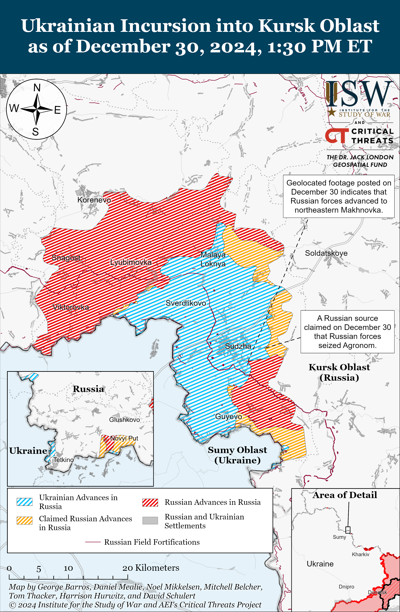
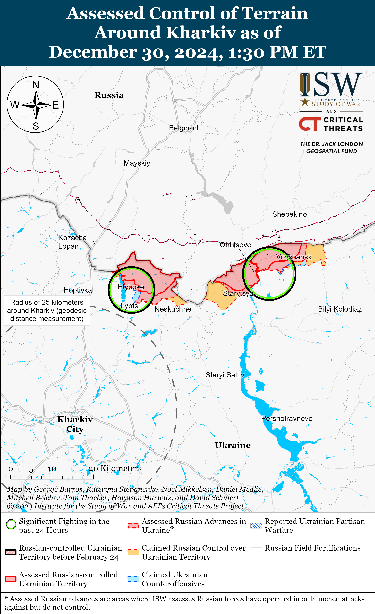
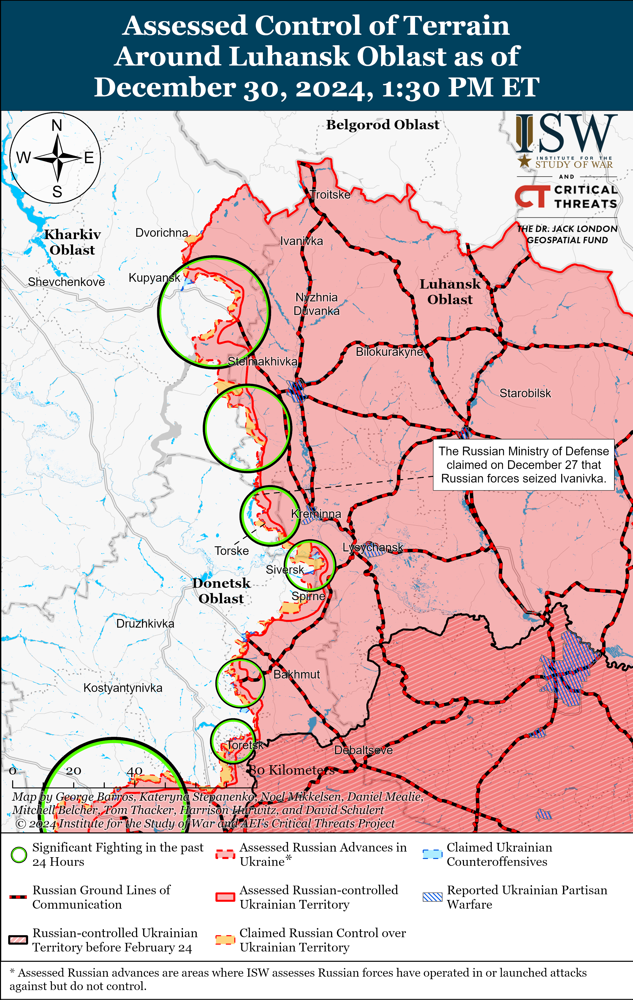
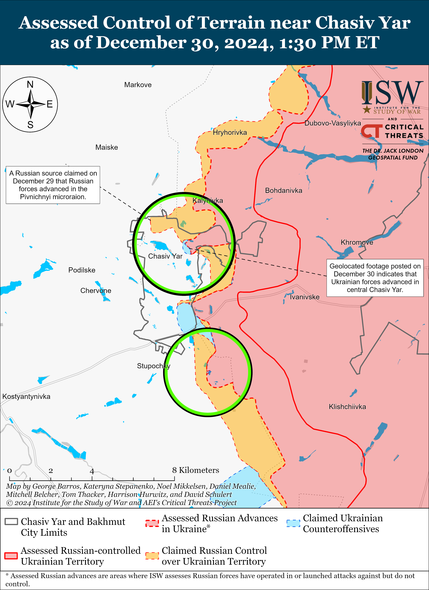
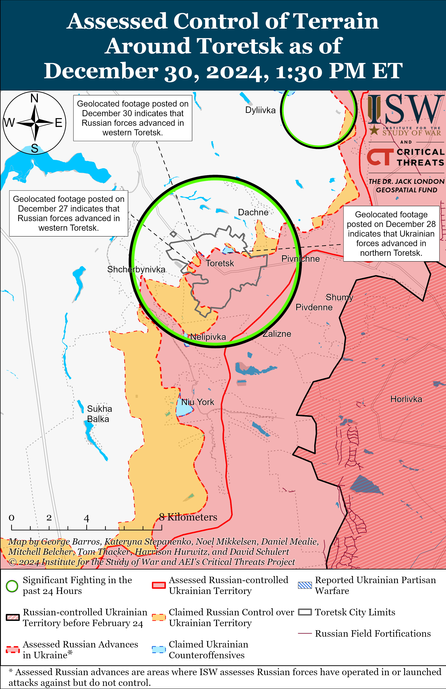
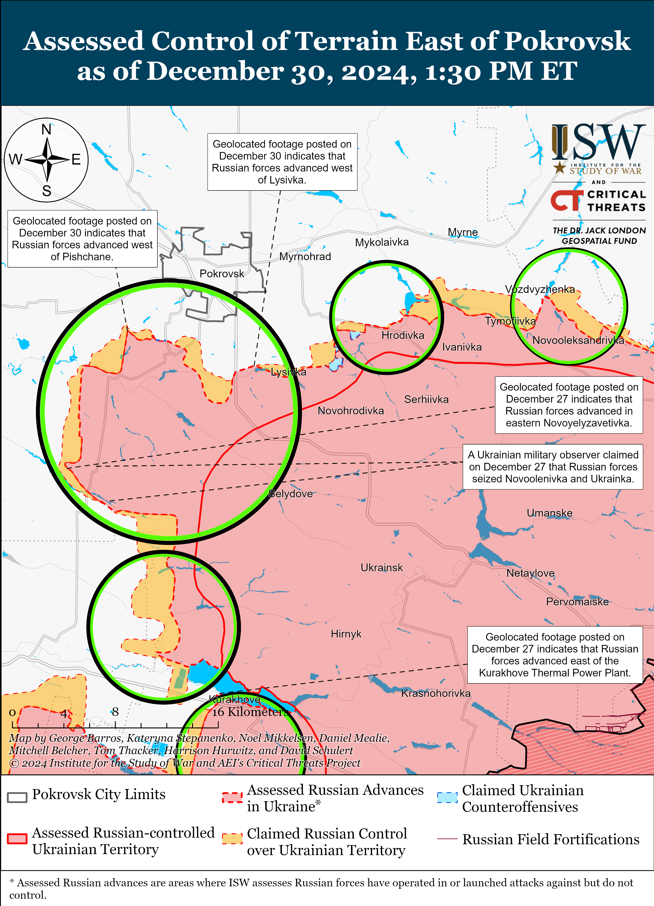
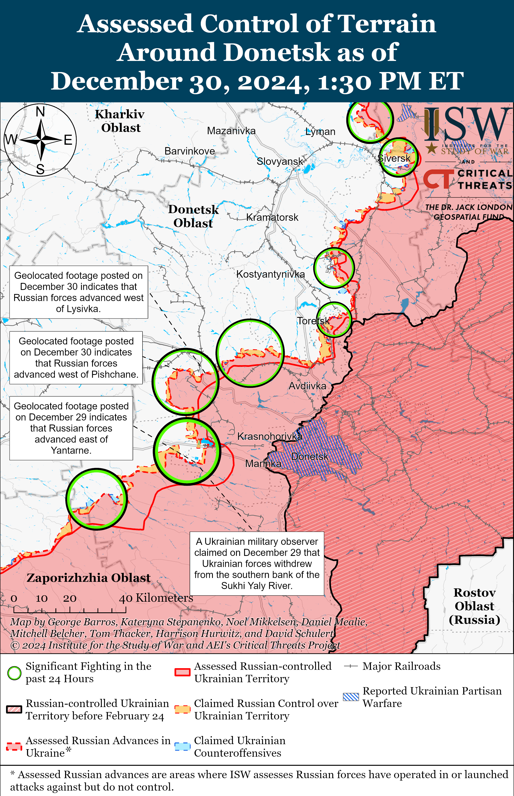
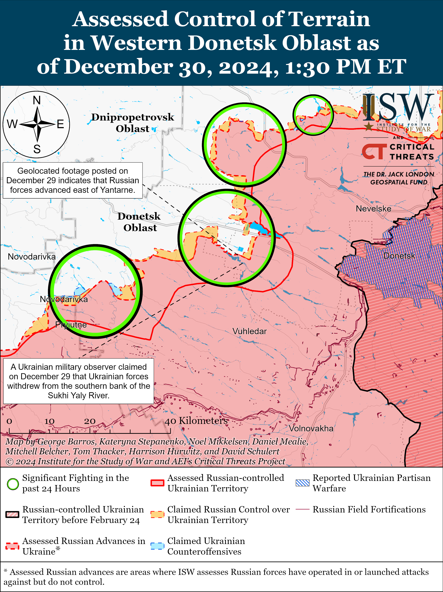
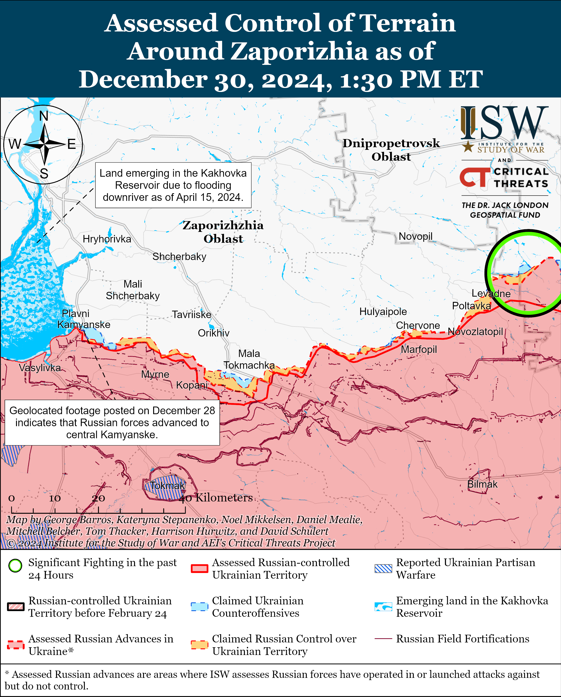
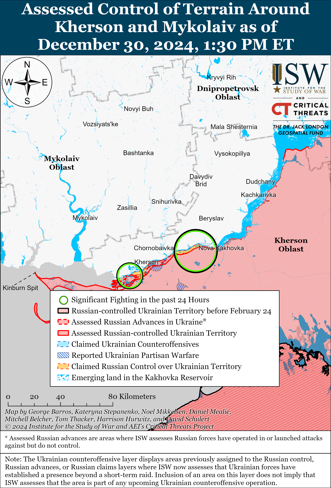

# Russian Offensive Campaign Assessment, December 30, 2024

**Nicole Wolkov, Angelica Evans, Kateryna Stepanenko, Olivia Gibson, William Runkel, and George Barros**

**December 30, 2024, 6:50pm ET**

**Click** [**here**](https://storymaps.arcgis.com/stories/36a7f6a6f5a9448496de641cf64bd375) **to see ISW’s interactive map of the Russian invasion of Ukraine. This map is updated daily alongside the static maps present in this report.**

**Click** [**here**](https://storymaps.arcgis.com/stories/83a2f24901c941d581c0c523ecd2619b)**to see ISW’s interactive map of Ukraine’s offensive in Kursk Oblast.**

**Click** [**here**](https://understandingwar.maps.arcgis.com/apps/instant/3dviewer/index.html?appid=1602762dbcde419bb957dea358449580) **to see ISW’s 3D control of terrain topographic map of Ukraine. Use of a computer (not a mobile device) is strongly recommended for using this data-heavy tool.**

**Click** [**here**](https://storymaps.arcgis.com/stories/733fe90805894bfc8562d90b106aa895) **to access ISW’s archive of interactive time-lapse maps of the Russian invasion of Ukraine. These maps complement the static control-of-terrain map that ISW produces daily by showing a dynamic frontline. ISW will update this time-lapse map archive monthly.**

**Note: The data cut-off for this product was 12:20pm ET on December 30. ISW will cover subsequent reports in the December 31 Russian Offensive Campaign Assessment.**

**Russian Foreign Minister Sergei Lavrov reiterated Russia’s demand that Ukraine renounce its right to sovereignty and territorial integrity as a precondition to start peace talks, indicating that Russia is not interested in good faith negotiations.** Lavrov stated in an interview with Kremlin newswire *TASS* published on December 30 that Russia will not participate in any negotiations to end its war in Ukraine unless Ukraine renounces its right and objective of liberating its territory up to its internationally recognized 1991 borders.[1] Lavrov added that Russia considers Ukraine’s objective of liberating its territory to its internationally recognized 1991 borders an “ultimatum.” The Kremlin is likely attempting to impose unrealistic demands on Ukraine that violate international law to stymie legitimate good faith negotiations. Russia is also likely attempting to force the West into coercing Ukraine into acknowledging and accepting territorial concessions that will benefit Russia in the long term. Lavrov and other Russian officials have previously dismissed Ukraine’s right to sovereignty and territorial integrity as a legitimate negotiating position.[2] ISW continues to assess that Russia is not interested in good faith negotiations with Ukraine and will continue to pursue Ukraine’s total capitulation.[3]

**The Kremlin appears to be prioritizing Russia’s force generation requirements and domestic political stability over efforts to mitigate economic pressure and labor shortages going into 2025.** Russian President Vladimir Putin signed a decree on December 30 stating that migrants who entered Russia illegally must apply for legal status or leave Russia by April 30, 2025.[4] Migrants can obtain legal status by submitting to a series of health screenings; a Russian language, history, and legal exam; and by paying off all debts, or by signing a military service contract with the Russian Ministry of Defense (MoD). Russia is reportedly suffering a labor shortage of 1.5 million people, and Putin’s decree will likely further exacerbate Russia’s ongoing labor shortages if a significant number of migrants who work in food service, transportation, and other low-skilled industries either leave Russia or forcibly join the Russian military.[5] It remains unclear if Russian authorities will enforce this decree, although their decision whether to enforce this decree will likely indicate how Russian authorities are prioritizing responding to political, force generation, and economic labor market challenges. A decision to enforce this decree and begin deporting migrants would indicate that Russian authorities are prioritizing placating complaints among Russian pro-war ultra-nationalists and addressing possible regime security issues associated with ongoing reports of migrants committing crimes and terrorist acts in Russia than addressing Russia’s economic issues. A decision not to enforce the decree would indicate that Russian authorities are more concerned with utilizing migrant labor to overcome Russia’s economic issues and labor shortages than messaging to the Kremlin’s ultranationalist constituency.

**US President Joe Biden announced an additional military aid package for Ukraine worth $2.5 billion on December 30.[6]** The package is funded by a combined $1.25 billion from the Presidential Drawdown Authority (PDA) and $1.22 billion from the Ukraine Security Assistance Initiative (USAI) and will include thousands of artillery rounds, thousands of rockets, and hundreds of armored vehicles. The US Department of Defense (DoD) reported that the package also includes: munitions for National Advanced Surface-to-Air Missile Systems (NASAMS); HAWK air defense munitions; Stinger missiles; counter-Unmanned Aerial Systems (c-UAS) munitions; ammunition for High Mobility Artillery Rocket Systems (HIMARS); High-speed Anti-radiation missiles (HARMs); Javelin and AT-4 anti-armor systems; Tube-launched, Optically-guided, Wire-tracked (TOW) missiles; and other materiel.[7]

**Russia and Ukraine conducted one of the largest prisoners of war (POW) exchanges in 2024 on December 30, resulting in the return of 189 Ukrainian POWs — some of whom spent over two years in Russian captivity since early 2022.** Ukrainian President Volodymyr Zelensky announced on December 30 that Ukraine returned 189 Ukrainians, some of whom defended Ukrainian positions at the Azovstal Steel Plant, Chornobyl Nuclear Power Plant (NPP), and Snake Island in early 2022.[8] Zelensky added that Ukraine also returned two civilians whom Russian forces captured during the siege of Mariupol. Ukraine’s Coordination Headquarters for the Treatment of POWs reported that this POW exchange was one of the largest POWs exchanges since the January 3, 2024, and that Ukraine returned 173 privates and sergeants and 14 officers: 87 servicemen of the Ukrainian Armed Forces, 43 of Ukraine’s National Guard, 33 of Ukraine’s Border Guards Service, and 24 of the Ukrainian Navy.[9] The Coordination Headquarters for the Treatment of POWs added that some of the servicemen also participated in combat operations in Kursk, Luhansk, Donetsk, Kharkiv, Zaporizhia, and Kherson oblasts. The Coordination Headquarters for the Treatment of POWs noted that in total 3,956 Ukrainian POWs returned to Ukraine, of which 1,358 returned in 2024. The Russian MoD announced on December 30 that Russia exchanged 150 Ukrainian POWs for 150 Russian POWs.[10]

**Russian border guards withdrew from the Agarak border checkpoint on the Armenia-Iran border on December 30 after controlling the checkpoint for over 30 years.** Armenian Prime Minister Nikol Pashinyan announced that Armenian border troops began solely patrolling the Agarak checkpoint without Russian forces on December 30, indicating that Russian border guards likely withdrew from the area in accordance with the October 2024 agreement that Armenian border guards will regain control of the checkpoint starting January 1, 2025.[11] Pashinyan added that Russian border guards have been operating at the Agarak checkpoint since 1991. Russia’s withdrawal from Agarak checkpoint comes five months after Russian border guards completed withdrew from Yerevan’s Zvartnots International Airport and further showcases Armenia’s commitment to reducing bilateral security relations with Russia.[12]

**Key Takeaways:**

- **Russian Foreign Minister Sergei Lavrov reiterated Russia’s demand that Ukraine renounce its right to sovereignty and territorial integrity as a precondition to start peace talks, indicating that Russia is not interested in good faith negotiations.**
- **The Kremlin appears to be prioritizing Russia’s force generation requirements and domestic political stability over efforts to mitigate economic pressure and labor shortages going into 2025.**
- **US President Joe Biden announced an additional military aid package for Ukraine worth $2.5 billion on December 30.**
- **Russia and Ukraine conducted one of the largest prisoners of war (POW) exchanges in 2024 on December 30, resulting in the return of 189 Ukrainian POWs – some of whom spent over two years in Russian captivity since early 2022.**
- **Russian border guards withdrew from the Agarak border checkpoint on the Armenia-Iran border on December 30 after controlling the checkpoint for over 30 years.**
- **Ukrainian forces recently regained lost positions near Chasiv Yar, Toretsk, and Pokrovsk. Russian forces recently advanced in Kursk Oblast and near Toretsk, Pokrovsk, Kurakhove, Vuhledar, and Velyka Novosilka.**
- **A Russian milblogger who focuses on Russian veteran issues claimed that Russian forces have significantly strengthened the Russian international border with Ukraine since 2022 and no longer overwhelmingly rely on conscripts and alleged deserters as border security.**

***We do not report in detail on Russian war crimes because these activities are well-covered in Western media and do not directly affect the military operations we are assessing and forecasting. We will continue to evaluate and report on the effects of these criminal activities on the Ukrainian military and the Ukrainian population and specifically on combat in Ukrainian urban areas. We utterly condemn Russian violations of the laws of armed conflict and the Geneva Conventions and crimes against humanity even though we do not describe them in these reports.***

- Ukrainian Operations in the Russian Federation
- Russian Main Effort – Eastern Ukraine (comprised of three subordinate main efforts)
- Russian Subordinate Main Effort #1 – Push Ukrainian forces back from the international border with Belgorod Oblast and approach to within tube artillery range of Kharkiv City
- Russian Subordinate Main Effort #2 – Capture the remainder of Luhansk Oblast and push westward into eastern Kharkiv Oblast and encircle northern Donetsk Oblast
- Russian Subordinate Main Effort #3 – Capture the entirety of Donetsk Oblast
- Russian Supporting Effort – Southern Axis
- Russian Air, Missile, and Drone Campaign
- Russian Mobilization and Force Generation Efforts
- Russian Technological Adaptations
- Activities in Russian-occupied areas
- Significant Activity in Belarus

**Ukrainian Operations in the Russian Federation**

Russian forces recently advanced in the Ukrainian salient in Kursk Oblast amid continued fighting in the area on December 30. Geolocated footage published on December 30 indicates that Russian forces recently advanced in northeastern Makhnovka (southeast of Sudzha) and seized Cherkasskaya Konopelka (southeast of Sudzha), although likely not within the past day.[13] Russian milbloggers claimed that Russian forces, including elements of the Russian 11th Airborne (VDV) Brigade, seized Agronom (east of Sudzha), but ISW has not observed visual evidence of this claim.[14] Russian sources claimed that Ukrainian forces attacked in unspecified areas in Kursk Oblast.[15] Chechen Akhmat Spetsnaz forces are reportedly operating near Sudzha, and elements of the Russian 83rd VDV Brigade are reportedly operating in Korenevsky Raion.[16]

Kursk Oblast Operational Headquarters claimed on December 30 that Russian air defenses shot down three Ukrainian missiles over Kursk Oblast.[17]

**Russian Main Effort – Eastern Ukraine**

**Russian Subordinate Main Effort #1 – Kharkiv Oblast (Russian objective: Push Ukrainian forces back from the international border with Belgorod Oblast and approach to within tube artillery range of Kharkiv City)**

Russian forces continued ground attacks north of Kharkiv City near Lyptsi and northeast of Kharkiv City near Hatyshche and Vovchansk on December 29 and 30 but did make any confirmed advances.[18]

**Russian Subordinate Main Effort #2 – Luhansk Oblast (Russian objective: Capture the remainder of Luhansk Oblast and push westward into eastern Kharkiv Oblast and northern Donetsk Oblast)**

Russian forces continued offensive operations along the Kupyansk-Svatove-Kreminna line on December 30 but did not make any confirmed advances. Russian sources continued to claim that Russian forces seized Ivanivka and almost seized Terny (both northwest of Kreminna), but one Russian milblogger claimed that Russian forces are still fighting for Ivanivka and described claims of Russia’s seizure of Terny as premature.[19] ISW has not observed confirmation of Russian forces seizing Terny or Ivanivka. Ukrainian Khortytsya Group of Forces reported on December 30 that Russian forces attacked Terny with armored vehicles on December 29.[20] The Ukrainian Border Guards Service’s department responsible for the defense of Ukraine’s northern border reported on December 29 that Ukrainian forces repelled a Russian mechanized assault of an unspecified echelon in the Kupyansk direction during which over 30 Russian servicemen attacked Ukrainian positions in waves at dusk.[21] Ukrainian Luhansk Oblast Military Administration Head Artem Lysohor published footage on December 30 showing Ukrainian forces repelling a Russian reinforced platoon-sized mechanized assault in the Kupyansk direction.[22] A Ukrainian Border Guards Service unit published footage on December 30 showing Ukrainian forces damaging and destroying 15 Russian armored vehicles near Kreminna and in Serebryanske forest area over past last week (since December 23).[23] Russian forces attacked north of Kupyansk near Holubivka; east of Kupyansk near Petropavlivka and Kucherivka; southeast of Kupyansk near Zahryzove, Lozova, Stepova Novoselivka, and Kruhlyakivka; southwest of Svatove near Hrekivka; west of Svatove near Zeleny Hai, Kopanky, Pershotravneve, and Nadiya; northwest of Kreminna near Makiivka, Ivanivka, and Terny; west of Kreminna near Yampolivka; and southwest of Kreminna near Plantonivka on December 29 and 30.[24]

**Russian Subordinate Main Effort #3 – Donetsk Oblast (Russian objective: Capture the entirety of Donetsk Oblast, the claimed territory of Russia’s proxies in Donbas)**

Russian forces continued offensive operations in the Siversk direction on December 30 but did not make any confirmed advances. Russian forces attacked northeast of Siversk near Bilohorivka and east of Siversk near Zolotarivka on December 29 and 30.[25] Elements of the Russian 2nd Artillery Brigade (3rd Combined Arms Army [CAA], formerly 2nd Luhansk People’s Republic Army Corps [LNR AC]) are reportedly continuing to operate in the Siversk direction.[26]

Ukrainian forces recently regained lost positions in central Chasiv Yar amid Russian forces continued offensive operations in the surrounding area on December 30. Geolocated footage published on December 30 shows elements of the Russian 98th Airborne (VDV) Division targeting Ukrainian forces in central Chasiv Yar, indicating that Ukrainian forces recently advanced to Heorhiia Dubrovskoho Street in central Chasiv Yar.[27] Russian milbloggers claimed that Russian forces advanced in the Desyata Microraion in northern Chasiv Yar and seized the railway station in northwestern Chasiv Yar on December 30.[28] ISW has not observed confirmation of these claims, however. Russian forces attacked within Chasiv Yar and south of Chasiv Yar near Stupochky on December 29 and 30.[29] Ukrainian Khortytsia Group of Forces Spokesperson Viktor Trehubov reported on December 30 that Russian forces are attacking Chasiv Yar’s urban areas, crossing the Siverskyi Donets Donbas (SDD) Canal, and then attempting to attack the Refractory Plant in central Chasiv Yar – a key Ukrainian defensive position in the settlement.[30] Trehubov noted that Ukrainian forces continue to control the tactically significant Refractory Plant and that the intensity of Russian attacks on the facility have slightly decreased. A Russian milblogger claimed that Russian forces are trying to establish positions along Chernyshevskoho Street in Pivnichnyi Microraion (northern Chasiv Yar) and that Ukrainian forces conducted two counterattacks.[31]

Ukrainian and Russian forces recently advanced in the Toretsk direction on December 30. Geolocated footage published on December 30 indicates that Ukrainian forces recently regained lost positions along Hryhoriia Skovorody street in northwestern Toretsk.[32] Geolocated footage published on December 26, 29, and 30 indicates that Russian forces advanced in northwestern Toretsk along 1 Hirskyi Street and in western Toretsk along 2 Travnevyi, Istorychna, Koksova, and Zhytomyrskyi streets.[33] A Russian milblogger claimed that Russian forces advanced 900 meters toward the waste heaps in western Toretsk on December 30, and another Russian milblogger claimed that Russian forces are advancing in Zabalka Microraion (southeastern Toretsk).[34] ISW has not observed confirmation of these claims, however. Russian forces reportedly attacked within Toretsk and west of Toretsk near Shcherbynivka on December 29 and 30.[35] A Russian milblogger claimed fighting is ongoing near waste heaps No.1 and No.10 near the Toretsk mine in northern Toretsk.[36] Trehubov stated on December 29 that street fighting continues within Toretsk and that lightly armored Russian forces pick up anti-tank mines and then throw the anti-tank mines at buildings in the Toretsk direction.[37] Elements of the Russian 132nd Motorized Rifle Brigade (51st CAA), including drone operators, reportedly continue to operate in Toretsk.[38]

Ukrainian and Russian forces recently advanced in the Pokrovsk direction amid ongoing Russian offensive operations in the area on December 30. Geolocated footage published on December 29 indicates that Ukrainian forces recently retook positions east of Pishchane (south of Pokrovsk).[39] Additional geolocated footage published on December 30 indicates that Russian forces recently advanced northwest of Dachenske (south of Pokrovsk) and west of Pishchane.[40] Russian milbloggers claimed that Russian forces advanced northwest of Pokrovsk towards Baranivka, are advancing west of Vovkove and attacking toward Kotlyne (both southwest of Pokrovsk) and seized most of Novoyelyzavetivka (south of Vovkove).[41] ISW has not observed confirmation of these claims, however. The Russian MoD claimed that Russian forces seized Novolenivka (just northeast of Novoyelyzavetivka), although ISW assessed that Russian forces seized the settlement as of December 27.[42] Russian forces continued assaults northeast of Pokrovsk near Vozdvyzhenka, Myrolyubivka, and Promin; southeast of Porkovsk near Zelene and Lysivka; south of Pokrovsk near Dachenske, Novyi Trud, Zelene, and Shevchenko; southwest of Pokrovsk near Vovkove, Kotlyne, Solone, Novovasylivka, Novolenivka, Novoyelyzavetivka, and Ukrainka on December 29 and 30.[43]

Russian forces recently marginally advanced northwest of Kurakhove amid continued offensive operations in this direction on December 30. Geolocated footage published on December 29 indicates that Russian forces recently marginally advanced in western Sontsivka (northwest of Kurakhove).[44] Russian milblogger claimed that Russian forces advanced near Shevchenko and Petropavlivka (both northwest of Kurakhove) and seized a covered parking lot west of Kurakhove.[45] A Ukrainian brigade operating in the Kurakhove posted footage on December 29 showing Ukrainian drone operators striking two Russian armored vehicles in the Kurakhove direction.[46] Russian forces continued assaults northwest of Kurakhove near Petropavlivka, Sloyvanka, and Shevchenko; within Kurakhove itself; and west of Kurakhove near the Kurakhivska Thermal Power Plant (TPP) and in the direction of Dachne on December 29 and 30.[47]

Russian forces recently advanced in the Vuhledar direction amid continued offensive operations in the area on December 30. Geolocated footage published on December 29 indicates that Russian forces recently advanced east of Yantarne (northwest of Vuhledar) during a roughly platoon-sized mechanized assault.[48] A Russian milblogger claimed that Russian forces also advanced further in the fields northwest of Uspenivka, but ISW has not observed confirmation of this claim.[49] Russian forces continued attacking north of Vuhledar near Uspenivka and northwest of Vuhledar near Kostyantynopolske, Yantarne, and Kostyantynopil on December 29 and 30.[50] A Russian milblogger claimed that elements of the Russian 255th Motorized Rifle Regiment (20th Motorized Rifle Division, 8th CAA, Southern Military District [SMD]) repelled a Ukrainian attack north of Kostyantynopolske.[51] Elements of the Russian 102nd Motorized Rifle Regiment (150th Motorized Rifle Division, 8th CAA, SMD) are reportedly operating near Uspenivka.[52]

Russian forces recently advanced near Velyka Novosilka amid continued offensive operations in the area on December 30. Geolocated footage published on December 30 indicates that Russian forces recently advanced west of Velyka Novosilka.[53] Russian forces continued attacking west of Velyka Novosilka near Vremivka and Novosilka; northwest of Velyka Novosilka toward Pryvilne; and southwest of Velyka Novosilka near Novodarivka and Neskuchne on December 29 and 30.[54] A representative of a Ukrainian brigade operating near Velyka Novosilka stated that Russian forces are attempting to bypass and seize Velyka Novosilka and reach the junction of Donetsk, Zaporizhia, and Dnipropetrovsk oblasts.[55]

**Russian Supporting Effort – Southern Axis (Russian objective: Maintain frontline positions and secure rear areas against Ukrainian strikes)**

Neither Russian nor Ukrainian sources reported fighting in western Zaporizhia Oblast on December 30. A Russian milblogger claimed on December 30 that Russian forces recently repelled a Ukrainian attack near Russian positions in Kamyanske (northwest of Robotyne and south of Zaporizhzhia City).[56]

Official Ukrainian sources reported on December 30 that Ukrainian forces successfully struck a Russian headquarters with a missile in occupied Zaporizhia Oblast.[57] Ukraine’s Main Military Intelligence Directorate (GUR) reported that Ukrainian aerial reconnaissance discovered the location of the Russian headquarters and that the Ukrainian strike killed six Russian personnel and wounded three.[58] Ukraine’s Unmanned Systems Forces reported on December 30 that Ukrainian forces destroyed the self-propelled firing installation of a Russian Buk-M1-2 air defense system in occupied Zaporizhia Oblast.[59]

Russian forces continued assaults in the Dnipro direction and on the islands in the Dnipro River Delta on December 29 and 30 but did not make any confirmed advances.[60]

Ukrainian Navy Spokesperson Captain Third Rank Dmytro Pletenchuk reported on December 30 that many of the Russian barriers, including sunken barges, protecting the Kerch Strait Bridge from Ukrainian naval drones are likely not functional due to bad weather conditions.[61] Pletenchuk added that the remaining two-to-three months of the storm season might further damage or destroy the barriers.

**Russian Air, Missile, and Drone Campaign (Russian Objective: Target Ukrainian military and civilian infrastructure in the rear and on the frontline)**

Russian forces conducted a series of drone strikes against Ukraine on the night of December 29 to 30. The Ukrainian Air Force reported that Russian forces launched 43 Shaheds and other strike drones from Primorsko-Akhtarsk, Krasnodar Krai.[62] The Ukrainian Air Force reported that Ukrainian forces downed 21 Shahed and other decoy drone types over Kharkiv, Poltava, Chernihiv, Odesa, Donetsk, and Dnipropetrovsk oblasts; that 22 decoy drones were “lost,” likely due to Ukrainian electronic warfare (EW) interference; and that falling drone debris damaged residential homes in Kharkiv and Odesa oblasts. Ukrainian officials reported on December 29 and 30 that falling debris from downed Russian drones fell in a forested area near Lyubotyn, Kharkiv Oblast and damaged residential homes in Odesa City.[63]

**Russian Mobilization and Force Generation Efforts (Russian objective: Expand combat power without conducting general mobilization)**

A Russian milblogger who focuses on Russian veteran issues claimed that Russian forces have significantly strengthened the Russian international border with Ukraine since 2022 and no longer overwhelmingly rely on conscripts and alleged deserters as border security.[64] The milblogger claimed that Russian forces deployed “serious” forces to defend the border and have formed a separate grouping for border security. ISW cannot independently verify these claims. A Kremlin-affiliated milblogger claimed that the Russian volunteer recruitment increased since the start of Ukraine’s incursion into Kursk Oblast and noted that there are many convicts, including former Wagner Group fighters, are fighting near Sudzha, Kursk Oblast.[65] The milblogger added that Russian prisoners are fighting on the frontlines as part of the Russian “K” Project but did not specify the details of this project.

A Russian milblogger affiliated with the Russian Airborne Forces (VDV) claimed on December 30 that Russian forces reformed the Russian 214th “Opfor” Separate Special Battalion into a separate assault battalion.[66] The milblogger noted that the 214th “Opfor” Separate Special Battalion had been fighting in Ukraine since 2022 and underwent several force reconstitutions, especially after fighting in Bakhmut direction in 2023. The milblogger noted that the battalion performed largely informational role throughout 2024 by filming videos of its combat operations.

Russian field commanders are reportedly continuing to brutally punish Russians who refuse to fight in Ukraine. Russian opposition outlet *Astra* reported that a Russian assault detachment commander deliberately mined fields near Stelmakhivka (southeast of Kupyansk) to prevent elements of the Russian 423rd Motorized Rifle Regiment (4th Guards Tank Division, 1st Guards Tank Army [GTA]) from withdrawing from forward positions in September 2024.[67] *Astra* reported that the commander ordered a Russian serviceman to shoot Russian personnel who that withdrew from their positions.

**Russian Technological Adaptations (Russian objective: Introduce technological innovations to optimize systems for use in Ukraine)**

Nothing significant to report.

**Activities in Russian-occupied areas (Russian objective: Consolidate administrative control of annexed areas; forcibly integrate Ukrainian citizens into Russian sociocultural, economic, military, and governance systems)**

*ISW is not publishing coverage of activities in Russian-occupied areas today.*

**Significant activity in Belarus (Russian efforts to increase its military presence in Belarus and further integrate Belarus into Russian-favorable frameworks)**

The Belarusian Ministry of Defense (MoD) reported on December 30 that Belarus plans to expand drone pilot training capabilities by creating specialized classrooms at 16 educational institutions across Belarus by September 1, 2025 and will begin training students in mid-September 2025.[68]

**Note: ISW does not receive any classified material from any source, uses only publicly available information, and draws extensively on Russian, Ukrainian, and Western reporting and social media as well as commercially available satellite imagery and other geospatial data as the basis for these reports. References to all sources used are provided in the endnotes of each update.**

[1] https://tass dot ru/interviews/22799503

[2] https://understandingwar.org/backgrounder/russian-offensive-campaign-assessment-december-28-2023

[3] https://understandingwar.org/backgrounder/russian-offensive-campaign-assessment-march-14-2024 ; https://isw.pub/UkrWar020824 ; https://understandingwar.org/backgrounder/russian-offensive-campaign-assessment-july-10-2024

[4] http://publication.pravo.gov dot ru/document/0001202412300002 ; https://tass dot ru/obschestvo/22804289 ; https://www.rbc dot ru/society/30/12/2024/6772b1b19a7947bb09655667

[5] https://understandingwar.org/backgrounder/russian-offensive-campaign-assessment-december-29-2024

[6] https://www.whitehouse.gov/briefing-room/statements-releases/2024/12/30/statement-from-president-joe-biden-on-u-s-support-for-ukraines-defense/

[7] https://www.defense.gov/News/Releases/Release/Article/4017714/biden-administration-announces-additional-security-assistance-for-ukraine/

[8] https://www.facebook.com/zelenskyy.official/posts/pfbid02AkeXFhEu8BdwZwH1KcW8t368bckFPwrUPUt49X6LSyBXm77BKC36v7oJPeCwUaewl

[9] https://t.me/DIUkraine/5117; https://t.me/Koord\_shtab/9982 ; https://t.me/andriyshTime/31394

[10] https://t.me/mod\_russia/47429 ; https://t.me/vrogov/18491 ; https://t.me/basurin\_e/16279

[11] https://www.azatutyun dot am/a/33258197.html ; https://www.azatutyun dot am/a/33258387.html ; https://www.azatutyun dot am/a/rus-sahmanapahnery-hunvari-1-its-kheranan-hayastan-iran-sahmani-hskich-ketits/33151186.html

[12] https://understandingwar.org/backgrounder/russian-offensive-campaign-assessment-september-1-2024 ; https://www.azatutyun dot am/a/33058188.html

[13] https://t.me/creamy\_caprice/7971; https://t.me/assaultregiment33/195

[14] https://t.me/voin\_dv/12531

[15] https://t.me/dva\_majors/61420 ; https://t.me/wargonzo/24023

[16] https://t.me/wargonzo/24030 ; https://t.me/mod\_russia/47426

[17] https://t.me/tass\_agency/294123

[18]https://www.facebook.com/GeneralStaff.ua/posts/pfbid0e5HbnPhoMhAScfqTdfGtAizszZZYMSWJSj2HEeQ8JvsZkVBHzQXEqtxWa8w8vxZal ; https://www.facebook.com/GeneralStaff.ua/posts/pfbid02akkPs6r53teT4YhVVNgk5GakNggCFwhyUSd7c45j1T9LvG9re6EsDumVe9B7ymMLl ; https://www.facebook.com/GeneralStaff.ua/posts/pfbid02hmZDNobTPKvP2rhgVkrANo6652KgtVAVyhT8Mb6bydW5upkWJtgPdbaSCjky4LgFl ; https://t.me/otukharkiv/3307 ; https://t.me/Khortytsky\_wind/3876

[19] https://t.me/DnevnikDesantnika/21710 ; https://t.me/DnevnikDesantnika/21752 ; https://t.me/voenkorKotenok/61112

[20] https://t.me/Khortytsky\_wind/3876

[21] https://www.facebook.com/story.php?story\_fbid=1141366134661437&id=100063641830042&mibextid=wwXIfr&rdid=dlJg6YWcjMnxuY8W# ; https://suspilne dot media/chernihiv/913705-cotiri-bijci-cernigivskogo-prikordonnogo-zagonu-vidbili-nastup-30-rosian-na-kupanskomu-napramku/

[22] https://t.me/luhanskaVTSA/23724

[23] https://www.facebook.com/watch/?v=1593754821244227

[24] https://www.facebook.com/GeneralStaff.ua/posts/pfbid0e5HbnPhoMhAScfqTdfGtAizszZZYMSWJSj2HEeQ8JvsZkVBHzQXEqtxWa8w8vxZal ; https://www.facebook.com/GeneralStaff.ua/posts/pfbid02akkPs6r53teT4YhVVNgk5GakNggCFwhyUSd7c45j1T9LvG9re6EsDumVe9B7ymMLl ; https://www.facebook.com/GeneralStaff.ua/posts/pfbid02hmZDNobTPKvP2rhgVkrANo6652KgtVAVyhT8Mb6bydW5upkWJtgPdbaSCjky4LgFl ; https://t.me/Khortytsky\_wind/3876 ; https://www.facebook.com/GeneralStaff.ua/posts/pfbid0e5HbnPhoMhAScfqTdfGtAizszZZYMSWJSj2HEeQ8JvsZkVBHzQXEqtxWa8w8vxZal

[25] https://www.facebook.com/GeneralStaff.ua/posts/pfbid0e5HbnPhoMhAScfqTdfGtAizszZZYMSWJSj2HEeQ8JvsZkVBHzQXEqtxWa8w8vxZal ; https://www.facebook.com/GeneralStaff.ua/posts/pfbid02akkPs6r53teT4YhVVNgk5GakNggCFwhyUSd7c45j1T9LvG9re6EsDumVe9B7ymMLl ; https://www.facebook.com/GeneralStaff.ua/posts/pfbid02hmZDNobTPKvP2rhgVkrANo6652KgtVAVyhT8Mb6bydW5upkWJtgPdbaSCjky4LgFl

[26] https://t.me/DnevnikDesantnika/21720

[27] https://t.me/rodnaya98vdd/218 ; https://x.com/Bielitzling/status/1873754729379233968

[28] https://t.me/wargonzo/24023 ; https://t.me/boris\_rozhin/149595

[29] https://www.facebook.com/GeneralStaff.ua/posts/pfbid0e5HbnPhoMhAScfqTdfGtAizszZZYMSWJSj2HEeQ8JvsZkVBHzQXEqtxWa8w8vxZal ; https://www.facebook.com/GeneralStaff.ua/posts/pfbid02akkPs6r53teT4YhVVNgk5GakNggCFwhyUSd7c45j1T9LvG9re6EsDumVe9B7ymMLl ; https://www.facebook.com/GeneralStaff.ua/posts/pfbid02hmZDNobTPKvP2rhgVkrANo6652KgtVAVyhT8Mb6bydW5upkWJtgPdbaSCjky4LgFl; https://t.me/Khortytsky\_wind/3876 ;

[30] https://suspilne dot media/donbas/913987-ukrainski-vijskovi-kontroluut-vognetrivkij-zavod-u-casovomu-aru-recnik-osuv-hortica/ ; https://youtu.be/WY8sDvZdWEA ; https://suspilne dot media/donbas/913817-dinamicna-situacia-u-kurahovomu-j-nezvicna-taktika-u-torecku-recnik-osuv-hortica-rozpoviv-pro-situaciu-na-fronti/

[31] https://t.me/DnevnikDesantnika/21750

[32] https://x.com/AudaxonX/status/1873382551181816204 ; https://t.me/voron1OO/106

[33] https://x.com/AudaxonX/status/1873671701189542135 ; https://t.me/Khyzhak\_brigade/329 ; https://t.me/creamy\_caprice/7969 ; https://t.me/WarArchive\_ua/24132 ; https://t.me/Khyzhak\_brigade/315 ; https://x.com/AudaxonX/status/1873382551181816204 ; https://t.me/voron1OO/106

[34] https://t.me/DnevnikDesantnika/21735 ; https://t.me/dva\_majors/61420

[35] https://www.facebook.com/GeneralStaff.ua/posts/pfbid02akkPs6r53teT4YhVVNgk5GakNggCFwhyUSd7c45j1T9LvG9re6EsDumVe9B7ymMLl ; https://www.facebook.com/GeneralStaff.ua/posts/pfbid02hmZDNobTPKvP2rhgVkrANo6652KgtVAVyhT8Mb6bydW5upkWJtgPdbaSCjky4LgFl ; https://t.me/Khortytsky\_wind/3876

[36] https://t.me/dva\_majors/61420

[37] https://youtu.be/WY8sDvZdWEA ; https://suspilne dot media/donbas/913817-dinamicna-situacia-u-kurahovomu-j-nezvicna-taktika-u-torecku-recnik-osuv-hortica-rozpoviv-pro-situaciu-na-fronti/

[38] https://t.me/nm\_dnr/13194 ; https://x.com/AudaxonX/status/1873748561399304531 ; https://t.me/nm\_dnr/13192

[39] https://youtu.be/JyyoJdSQP4o?si=zg6oz1Syjn8DgOeR; https://x.com/Playfra0/status/1873453010963312821

[40] https://t.me/creamy\_caprice/7968; https://t.me/egeriaznauri/30 ; https://t.me/creamy\_caprice/7970; https://www.youtube.com/watch?v=rDeCGg901lY&ab\_channel=%D0%91%D1%83%D1%82%D1%83%D1%81%D0%BE%D0%B2%D0%9F%D0%BB%D1%8E%D1%81

[41] https://t.me/voenkorKotenok/61115 ; https://t.me/voenkorKotenok/61106 ; https://t.me/boris\_rozhin/149544 ; https://t.me/dva\_majors/61422

[42] https://t.me/mod\_russia/47421 ; https://understandingwar.org/backgrounder/russian-offensive-campaign-assessment-december-27-2024

[43] https://t.me/Khortytsky\_wind/3876 ; https://www.facebook.com/GeneralStaff.ua/posts/pfbid0e5HbnPhoMhAScfqTdfGtAizszZZYMSWJSj2HEeQ8JvsZkVBHzQXEqtxWa8w8vxZal ; https://www.facebook.com/GeneralStaff.ua/posts/pfbid02akkPs6r53teT4YhVVNgk5GakNggCFwhyUSd7c45j1T9LvG9re6EsDumVe9B7ymMLl ; https://www.facebook.com/GeneralStaff.ua/posts/pfbid02hmZDNobTPKvP2rhgVkrANo6652KgtVAVyhT8Mb6bydW5upkWJtgPdbaSCjky4LgFl ; https://youtu.be/WY8sDvZdWEA ; https://suspilne dot media/donbas/913817-dinamicna-situacia-u-kurahovomu-j-nezvicna-taktika-u-torecku-recnik-osuv-hortica-rozpoviv-pro-situaciu-na-fronti/

[44] https://t.me/creamy\_caprice/7965; https://t.me/yokaiUA/209

[45] https://t.me/voenkorKotenok/61111 ; https://t.me/boris\_rozhin/149590 ; https://t.me/wargonzo/24023 ; https://t.me/dva\_majors/61420 ; https://t.me/dva\_majors/61434 ; https://t.me/DnevnikDesantnika/21742

[46] https://www.facebook.com/watch/?v=1499510734314071 ; https://mil.in dot ua/uk/news/dronari-37-yi-brygady-vidbyly-chergovyj-shturm-na-kurahivskomu-napryamku/

[47] https://www.facebook.com/GeneralStaff.ua/posts/pfbid0e5HbnPhoMhAScfqTdfGtAizszZZYMSWJSj2HEeQ8JvsZkVBHzQXEqtxWa8w8vxZal ; https://www.facebook.com/GeneralStaff.ua/posts/pfbid02akkPs6r53teT4YhVVNgk5GakNggCFwhyUSd7c45j1T9LvG9re6EsDumVe9B7ymMLl ; https://www.facebook.com/GeneralStaff.ua/posts/pfbid02hmZDNobTPKvP2rhgVkrANo6652KgtVAVyhT8Mb6bydW5upkWJtgPdbaSCjky4LgFl ; https://t.me/voenkorKotenok/61111 ; https://youtu.be/WY8sDvZdWEA ; https://suspilne dot media/donbas/913817-dinamicna-situacia-u-kurahovomu-j-nezvicna-taktika-u-torecku-recnik-osuv-hortica-rozpoviv-pro-situaciu-na-fronti/ ; https://t.me/Khortytsky\_wind/3876

[48] https://t.me/creamy\_caprice/7964; https://www.facebook.com/watch/?v=1499510734314071

[49] https://t.me/z\_arhiv/30311

[50] https://www.facebook.com/GeneralStaff.ua/posts/pfbid0e5HbnPhoMhAScfqTdfGtAizszZZYMSWJSj2HEeQ8JvsZkVBHzQXEqtxWa8w8vxZal ; https://www.facebook.com/GeneralStaff.ua/posts/pfbid02akkPs6r53teT4YhVVNgk5GakNggCFwhyUSd7c45j1T9LvG9re6EsDumVe9B7ymMLl ; https://www.facebook.com/GeneralStaff.ua/posts/pfbid02hmZDNobTPKvP2rhgVkrANo6652KgtVAVyhT8Mb6bydW5upkWJtgPdbaSCjky4LgFl ; https://t.me/voenkorKotenok/61111

[51] https://t.me/RVvoenkor/83564

[52] https://t.me/nm\_dnr/13193

[53] https://x.com/giK1893/status/1873702559908769940; https://t.me/rubpak/245

[54] https://www.facebook.com/GeneralStaff.ua/posts/pfbid0e5HbnPhoMhAScfqTdfGtAizszZZYMSWJSj2HEeQ8JvsZkVBHzQXEqtxWa8w8vxZal ; https://www.facebook.com/GeneralStaff.ua/posts/pfbid02akkPs6r53teT4YhVVNgk5GakNggCFwhyUSd7c45j1T9LvG9re6EsDumVe9B7ymMLl ; https://www.facebook.com/GeneralStaff.ua/posts/pfbid02hmZDNobTPKvP2rhgVkrANo6652KgtVAVyhT8Mb6bydW5upkWJtgPdbaSCjky4LgFl ; https://t.me/SJTF\_Odes/11918 ; https://t.me/voin\_dv/12527 ; https://t.me/vrogov/18487

[55] https://armyinform.com dot ua/2024/12/29/kolonamy-bronetehniky-ta-natovpamy-pihoty-okupanty-namagayutsya-prorvatysya-do-kordoniv-dniprovshhyny/

[56] https://t.me/voenkorKotenok/61114

[57] https://t.me/SJTF\_Odes/11919 ; https://t.me/DIUkraine/5115

[58] https://t.me/DIUkraine/5115

[59] https://suspilne dot media/zaporizhzhia/914359-sili-bezpilotnih-sistem-znisili-vognevu-ustanovku-zrk-buk-armii-rf-na-zaporizkomu-napramku/ ; https://t.me/usf\_army/319

[60]https://www.facebook.com/GeneralStaff.ua/posts/pfbid02akkPs6r53teT4YhVVNgk5GakNggCFwhyUSd7c45j1T9LvG9re6EsDumVe9B7ymMLl ; https://www.facebook.com/GeneralStaff.ua/posts/pfbid02hmZDNobTPKvP2rhgVkrANo6652KgtVAVyhT8Mb6bydW5upkWJtgPdbaSCjky4LgFl ; https://t.me/SJTF\_Odes/11918 ;

[61] https://armyinform dot com.ua/2024/12/29/shtorm-v-dopomogu-vms-prokomentuvaly-informacziyu-pro-rujnuvannya-zahysnyh-zagorodzhen-krymskogo-mostu/

[62] https://t.me/kpszsu/25773

[63] https://t.me/synegubov/12605 ; https://t.me/odeskaODA/8062 ; https://suspilne dot media/odesa/913929-unoci-rf-atakuvala-odesinu-udarnimi-bpla-e-poskodzenna-zitlovih-budinkiv/

[64] https://t.me/notes\_veterans/21244

[65] https://t.me/wargonzo/24028; https://t.me/wargonzo/24026

[66] https://t.me/rusich\_army/19721

[67] https://t.me/astrapress/71417

[68] https://t.me/modmilby/44261 ; https://t.me/modmilby/44260
