# Russian Offensive Campaign Assessment, December 31, 2024

**Angelica Evans, Nicole Wolkov, Kateryna Stepanenko, Nate Trotter, William Runkel, and Fredrick W. Kagan**

**December 31, 2024, 7:15 pm ET**

**Click**[**here**](https://storymaps.arcgis.com/stories/36a7f6a6f5a9448496de641cf64bd375)**to see ISW’s interactive map of the Russian invasion of Ukraine. This map is updated daily alongside the static maps present in this report.**

**Click**[**here**](https://storymaps.arcgis.com/stories/83a2f24901c941d581c0c523ecd2619b)**to see ISW’s interactive map of Ukraine’s offensive in Kursk Oblast.**

**Click**[**here**](https://understandingwar.maps.arcgis.com/apps/instant/3dviewer/index.html?appid=1602762dbcde419bb957dea358449580)**to see ISW’s 3D control of terrain topographic map of Ukraine. Use of a computer (not a mobile device) is strongly recommended for using this data-heavy tool.**

**Click**[**here**](https://storymaps.arcgis.com/stories/733fe90805894bfc8562d90b106aa895)**to access ISW’s archive of interactive time-lapse maps of the Russian invasion of Ukraine. These maps complement the static control-of-terrain map that ISW produces daily by showing a dynamic frontline. ISW will update this time-lapse map archive monthly.**

**Note: The data cut-off for this product was 12pm ET on December 31. ISW will cover subsequent reports in the January 2 Russian Offensive Campaign Assessment. ISW and CTP will not publish a campaign assessment (or maps) tomorrow, January 1, in observance of the New Year holiday. Coverage will resume on January 2.**

**Russian forces gained 4,168 square kilometers, largely comprised of fields and small settlements in Ukraine and Kursk Oblast, at a reported cost of over 420,000 casualties in 2024.**Ukrainian Commander-in-Chief Colonel General Oleksandr Syrskyi stated on December 30 that Russian forces suffered 427,000 casualties in 2024.[1] ISW has observed geolocated evidence to assess that Russian forces advanced 4,168 square kilometers in 2024, indicating that Russian forces have suffered approximately 102 casualties per square kilometer of Ukrainian territory seized. ISW previously observed that Russian forces gained 2,356 square kilometers in exchange for an estimated 125,800 casualties during a period of intensified Russian offensive operations in September, October, and November 2024.[2] Russian forces made 56.5 percent of their 2024 territorial gains during the September through November 2024 period. Russian Security Council Deputy Chairperson Dmitry Medvedev claimed on December 24 that 440,000 recruits signed military service contracts with the Russian Ministry of Defense (MoD) in 2024, suggesting that Russia is likely recruiting just enough military personnel to replace its recently high casualty rates one for one.[3]

**Russian advances have slowed in December 2024, however.** ISW has observed geolocated evidence to assess that Russian forces gained 593 square kilometers or 18.1 square kilometers per day in December 2024, while the number of daily Russian casualties in December 2024 remained similar to the estimated daily casualty rate in November 2024. The Ukrainian General Staff reported a daily Russian personnel casualty average of 1,585 in December 2024, marking a fourth all-time high of Russia’s daily casualty rate following reports that Russia’s average daily Russian personnel casualty reached a new all-time high of 1,523 casualties per day in November 2024.[4] Russian forces were advancing at the notably higher rate of 27.96 square kilometers per day in November 2024.[5] Syrskyi stated on December 30 that Russian forces have suffered 1,700 casualties per day over the past week (since December 23), indicating the Russian forces may have suffered an even higher casualty rate in the last few weeks of 2024 even as Russian advances slowed.[6] The Russian military command likely tolerated record levels of personnel casualties from September through November 2024 to facilitate larger territorial gains, but it remains unclear if the Russian military command will be willing to sustain such casualties if Russian forces’ rate of advance continues to decline as Russian forces continue to advance on more heavily defended settlements such as Pokrovsk.

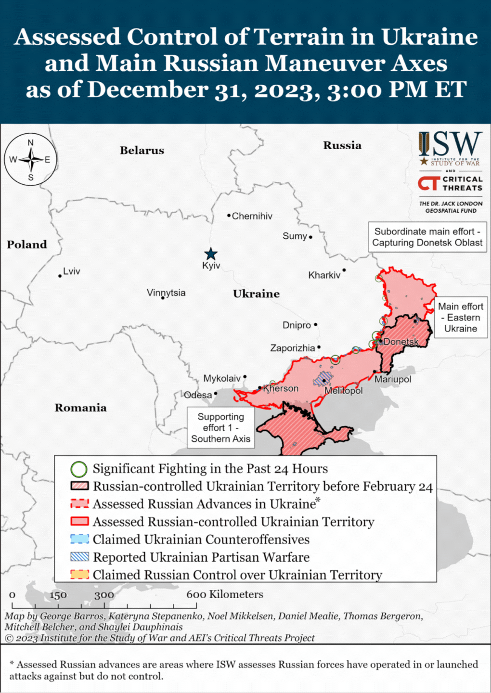

**The Russian military command largely prioritized efforts to seize the remainder of Donetsk Oblast and establish a buffer zone in northern Kharkiv Oblast in 2024 but failed to accomplish these goals.**Intensified Russian offensive operations in early 2024 resulted in the seizure of Avdiivka in mid-February 2024 and subsequent Russian advances west of Avdiivka in the directions of Pokrovsk and Selydove throughout spring, summer, and fall 2024.[7] Russian forces also launched a largely unsuccessful offensive operation in northern Kharkiv Oblast aimed at creating an unspecified “buffer zone” to defend Belgorod City from Ukrainian shelling in May 2024 and renewed offensive operations near Toretsk and west and southwest of Donetsk City in June and July 2024.[8] Western and Ukrainian sources assessed in 2023 and 2024 that Russia intended to seize the entirety of Donetsk and Luhansk by the end of 2024, but Russia’s slow advances in early and mid-2024 likely prompted the Russian military command to reassess and identify the seizure of Pokrovsk as Russian forces’ primary offensive effort for the remainder of 2024.[9]

Russian forces thus turned back to the Pokrovsk direction in late Summer and early Fall 2024 amid a surprise Ukrainian incursion into Kursk Oblast and successfully exploited the seizure of Selydove and Vuhledar to make further advances around Pokrovsk, Kurakhove, and later Velyka Novosilka. Russian forces recently seized Kurakhove and are attempting to envelop Velyka Novosilka from the north and south.[10] Russian forces heavily relied on platoon-, company-, and battalion-sized mechanized assaults to advance in the open fields in the Kurakhove, Vuhledar, and Velyka Novosilka directions in recent months but consistently incurred significant armored vehicles losses during these assaults.[11] Russian forces are currently attempting to envelop Pokrovsk from the south and northeast but have thus far failed to make significant recent progress in this effort.[12] Russian forces may also at least temporarily be shifting their focus from the envelopment of Pokrovsk to making opportunistic advances due west towards the Donetsk-Dnipropetrovsk Oblast border during a critical moment of Russia’s ongoing efforts to undermine Western support for Ukraine.[13]

**Russian forces have seized four mid-sized settlements – Avdiivka, Selydove, Vuhledar, and Kurakhove – in all of 2024, the largest of which had a pre-war population of just over 31,000 people.**Russian forces’ rate of advance largely stalled around the few more urban settlements that Russian forces sought to take in 2024. Russian forces expended roughly four months in seizing Avdiivka in late 2023 and early 2024 and two months each on efforts to seize and envelop Selydove and Kurakhove in 2024. Russian forces also incurred significant personnel losses during efforts to take these settlements, and Ukrainian officials have recently estimated that Russian forces lost nearly 3,000 personnel in the Pokrovsk direction in two weeks in mid-December 2024.[14] ISW has not assessed that any of the settlements that Russian forces seized in 2024 are operationally significant, as seizing these settlements has not allowed Russian forces to threaten any notable Ukrainian defensive nodes, and Russian forces have failed to conduct the kind of rapid, mechanized maneuver necessary to convert these tactical gains into deep penetrations of Ukraine’s rear. ISW currently assesses that Russian forces must capture approximately 8,559 square kilometers, which include significant Ukrainian defensive positions and large cities along Ukraine’s fortress belt, to seize the remainder of Donetsk Oblast. **Russian forces would require just over two years to seize the remainder of Donetsk Oblast at their 2024 rates of advance, assuming that all their advances were confined to Donetsk, that they can seize large urban areas as easily as small villages and fields, and that the Ukrainians do not conduct any significant counterattacks in Donetsk.**

**Ukrainian forces have yet to stop Russian forces from advancing in their priority sectors, however, and Western aid remains critical to Ukraine’s ability to stabilize the frontline in 2025.**Ukrainian defenders have largely stalled Russian advances near Chasiv Yar and Toretsk, but Russian forces continue to make gradual, grinding advances in the Pokrovsk, Kurakhove, and Velyka Novosilka directions. Ongoing Ukrainian manpower constraints and morale issues are also creating vulnerabilities in Ukraine’s defensive lines, and Ukrainian officials must address these issues and steel defenders against Russian infantry assaults in eastern and southern Ukraine.[15] Russian forces, and Russian President Vladimir Putin, are currently operating under a theory of victory that assumes that Russian forces can indefinitely advance in Ukraine but fails to account for the possibility that Ukrainian forces could inflict losses sufficient to stall or stop future Russian offensive operations.[16] Ukrainian forces, with support from Ukraine’s Western allies, must therefore work to integrate Ukrainian drone operations, sufficiently resourced artillery and long-range strike capabilities, and committed Ukrainian infantry units to defend against Russian advances and undermine Putin’s theory of victory in 2025.

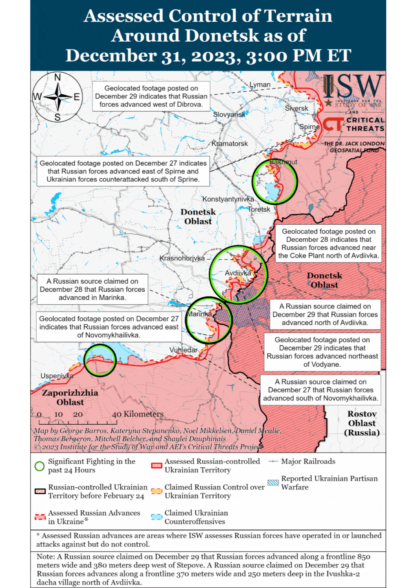

**Russian President Vladimir Putin officially declared 2025 the “Year of the Defender of the Fatherland” during his New Year’s address on December 31 – signaling the Kremlin’s continued efforts to militarize Russian society and maintain regime stability by appeasing the growing Russian veteran community.[17]**Putin claimed that the “Year of the Defender of the Fatherland” will honor current Russian servicemen, the 80th Anniversary of the Second World War, and other veterans who fought for Russia. Putin approved a list of instructions for the Russian government on December 20 that aims to expand Russia’s network of military-patriotic educational programs as part of his “Year of the Defender of the Fatherland” policies.[18] Putin will likely also continue to expand and institutionalize additional support programs for veterans as part of the “Year of the Defender of the Fatherland,” many of which the Kremlin began in 2023 and 2024 likely out of a concern that an ever-growing number of dissatisfied Russian veterans could threaten the stability of Putin’s regime. Putin notably created and significantly expanded the functions of Russia’s Defenders of Fatherland State Fund in 2023 and 2024, which pledges to support Russian veterans who fought in Ukraine.[19] Putin also introduced the “Time of Heroes” state-wide initiative in Spring 2024, which aims to install Kremlin-selected Russian veterans into positions of power within the Russian government and business sector, and Russian authorities have already appointed two participants of this program to lead two major Russian military-patriotic institutions.[20] Putin also passed numerous decrees offering veterans subsidies and benefits throughout 2024 and will likely continue to do so in 2025 – despite the increasing costs of such policies – to ensure that the veteran community does not harbor grievances against the Kremlin and its war effort in Ukraine.[21] Putin’s commitment to initiatives such as the “Year of the Defender of the Fatherland” and other support efforts for veterans are increasingly committing Russia to long-term financial obligations.

**Ukrainian naval drones reportedly downed a Russian Mi-8 helicopter near occupied Cape Tarkhankut, Crimea, reportedly marking the first time that a naval drone has shot down an air target.**Ukraine’s Main Military Intelligence Directorate (GUR) reported on December 31 that it destroyed a Russian Mi-8 helicopter using the R-73 “Sea Dragon” missiles launched from a Magura V5 naval strike drone in the Black Sea.[22] The GUR noted that Ukrainian naval drones damaged another Russian Mi-8 helicopter but that the damaged helicopter eventually landed at an airfield. The GUR stated that the naval drone strike against Russian Mi-8 helicopters marked the historic first destruction of an aerial target with a naval drone. Sevastopol occupation governor Mikhail Razvozhayev claimed that Russian forces repelled four Ukrainian aerial drones and two naval drones over and in the Black Sea overnight on December 31, but did not acknowledge the downing of the Mi-8 helicopter.[23] Russian milbloggers expressed concerns that Ukraine’s ability to incorporate Ukrainian naval drones as part of Ukraine’s air defense capabilities will complicate Russia’s efforts to destroy Ukrainian naval drones, as Russia relies on helicopters and Su-30SM fighter jets to target naval drones that are far from Crimea’s shore.[24] Ukraine’s Southern Operational Command reported that Ukrainian forces also destroyed a Russian Tor air defense system in southern Ukraine, and a local Crimean source claimed that Ukrainian forces may have struck a Tor air defense system near occupied Kozacha Bay (southwest of Sevastopol).[25]

**Ukrainian forces struck the Yarsevskaya oil depot in Smolensk Oblast and a building used by the Russian military in Lgov, Kursk Oblast on December 30 and 31.** The Ukrainian General Staff reported on December 31 that Ukrainian Special Operations Forces (SSO) and Unmanned Systems Forces (USF) launched drone strikes against the Yarsevskaya oil depot, resulting in a series of intense explosions, heavy smoke, and oil tanks catching on fire near the depot.[26] The Ukrainian General Staff added that the nearby oil refinery supplied the Russian war effort. Russian authorities confirmed that Ukrainian drones struck the oil refinery in Yarsevsky Raion, resulting in an oil spill and fire at the refinery.[27] Yartsevsky Raion Head Roman Zakharov confirmed the Ukrainian drone strike on social media but later deleted the post and amplified Smolensk Oblast Governor Vasily Anokhin’s claim that the debris from downed Ukrainian drones resulted in a fire at the oil refinery.[28] Russian opposition outlet *Astra*, citing unnamed sources, reported that Ukrainian forces launched at least six Storm Shadow missile against a building used by Russian forces in Lgov on December 30.[29] *Astra* reported that the strike killed eight Russian service members, wounded several Russian service members, and wounded one civilian. Kursk Oblast Acting Governor Alexander Khinshtein claimed that Ukrainian forces struck an apartment building in Lgov.[30]

**Key Takeaways:**

- **Russian forces gained 4,168 square kilometers, largely comprised of fields and small settlements in Ukraine and Kursk Oblast, at a reported cost of over 420,000 casualties in 2024.**
- **The Russian military command largely prioritized efforts to seize the remainder of Donetsk Oblast and establish a buffer zone in northern Kharkiv Oblast in 2024 but failed to accomplish these goals.**
- **Russian forces have seized four mid-sized settlements – Avdiivka, Selydove, Vuhledar, and Kurakhove – in all of 2024, the largest of which had a pre-war population of just over 31,000 people.**
- **Russian forces would require just over two years to seize the remainder of Donetsk Oblast at their 2024 rates of advance, assuming that all their advances were confined to Donetsk, that they can seize large urban areas as easily as small villages and fields, and that the Ukrainians do not conduct any significant counterattacks in Donetsk.**
- **Ukrainian forces have yet to stop Russian forces from advancing in their priority sectors, however, and Western aid remains critical to Ukraine’s ability to stabilize the frontline in 2025.**
- **Russian President Vladimir Putin officially declared 2025 the “Year of the Defender of the Fatherland” during his New Years’ address on December 31 – signaling the Kremlin’s continued efforts to militarize Russian society and maintain regime stability by appeasing the growing Russian veteran community.**
- **Ukrainian naval drones reportedly downed a Russian Mi-8 helicopter near occupied Cape Tarkhankut, Crimea, reportedly marking the first time that a naval drone has shot down an air target.**
- **Ukrainian forces struck the Yarsevskaya oil depot in Smolensk Oblast and a building used by the Russian military in Lgov, Kursk Oblast on December 30 and 31.**
- **Ukrainian forces recently advanced near Kreminna and in Kursk Oblast, and Russian forces recently advanced near Kreminna, Siversk, Chasiv Yar, Pokrovsk, and Kurakhove.**
- **The Russian government will deprive prisoners who volunteer to fight in Ukraine of the one-time enlistment bonus starting January 1, 2025, marking another instance of Russia trying to cut the mounting short- and long-term costs of war.**

***We do not report in detail on Russian war crimes because these activities are well-covered in Western media and do not directly affect the military operations we are assessing and forecasting. We will continue to evaluate and report on the effects of these criminal activities on the Ukrainian military and the Ukrainian population and specifically on combat in Ukrainian urban areas. We utterly condemn Russian violations of the laws of armed conflict and the Geneva Conventions and crimes against humanity even though we do not describe them in these reports.***

- Ukrainian Operations in the Russian Federation
- Russian Main Effort – Eastern Ukraine (comprised of three subordinate main efforts)
- Russian Subordinate Main Effort #1 – Push Ukrainian forces back from the international border with Belgorod Oblast and approach to within tube artillery range of Kharkiv City
- Russian Subordinate Main Effort #2 – Capture the remainder of Luhansk Oblast and push westward into eastern Kharkiv Oblast and encircle northern Donetsk Oblast
- Russian Subordinate Main Effort #3 – Capture the entirety of Donetsk Oblast
- Russian Supporting Effort – Southern Axis
- Russian Air, Missile, and Drone Campaign
- Russian Mobilization and Force Generation Efforts
- Russian Technological Adaptations
- Activities in Russian-occupied areas
- Significant Activity in Belarus

**Ukrainian Operations in the Russian Federation**

Ukrainian forces recently advanced in Kursk Oblast amid continued fighting in Ukraine’s salient on December 31. Ukraine’s Special Operations Forces (SSO) published later geolocated footage on December 31 that indicates that Ukrainian forces seized Kruglenkoye (southeast of Korenevo) and reported that Ukrainian forces established positions in a settlement previously held by North Korean and Russian forces in Kursk Oblast, likely referring to Kruglenkoye.[31] Geolocated footage published on December 30 shows that Ukrainian forces also advanced east of Pogrebki (northwest of Sudzha) along the 38K-024 highway.[32] Russian milbloggers claimed that Russian forces advanced from Russkaya Konopelka to Agronom (both east of Sudzha), where Russian forces are currently attacking, and to the outskirts of Makhnovka (southeast of Sudzha).[33] A Russian milblogger claimed that Russian forces are 2.5 kilometers away from Sudzha.[34]  Elements of the Russian 56th Airborne (VDV) Regiment (7th VDV Division) and the Russian 810th Naval Infantry Brigade (Black Sea Fleet [BSF], Southern Military District [SMD]) are reportedly operating in Kursk Oblast.[35] Elements of the Russian 83rd Airborne (VDV) Brigade are reportedly operating in Korenevsky Raion.[36]

[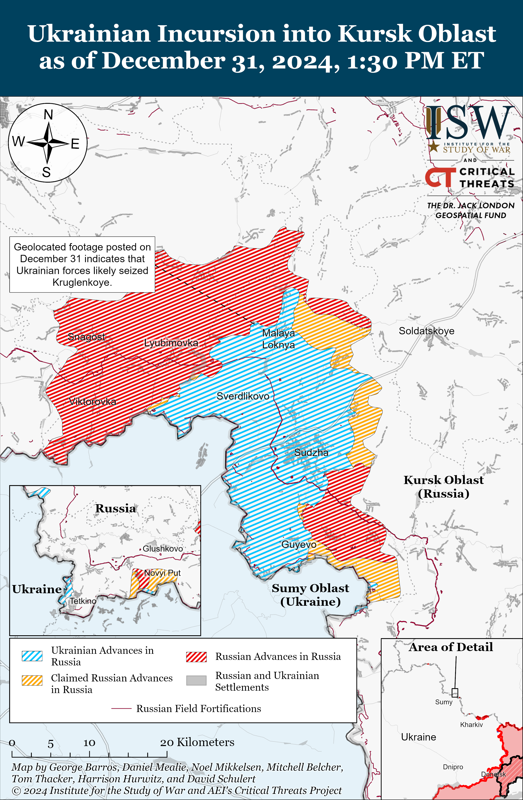](https://understandingwar.org/map/ukrainian-incursion-into-kursk-oblast-as-of-december-31-2024-130-pm-et/)

**Russian Main Effort – Eastern Ukraine**

**Russian Subordinate Main Effort #1 – Kharkiv Oblast (Russian objective: Push Ukrainian forces back from the international border with Belgorod Oblast and approach to within tube artillery range of Kharkiv City)**

Russian forces continued ground attacks along the international border north of Kharkiv City toward Kozacha Lopan, north of Kharkiv City near Lyptsi, and northeast of Kharkiv City near Vovchansk on December 30 and 31 but did make any confirmed advances.[37]

[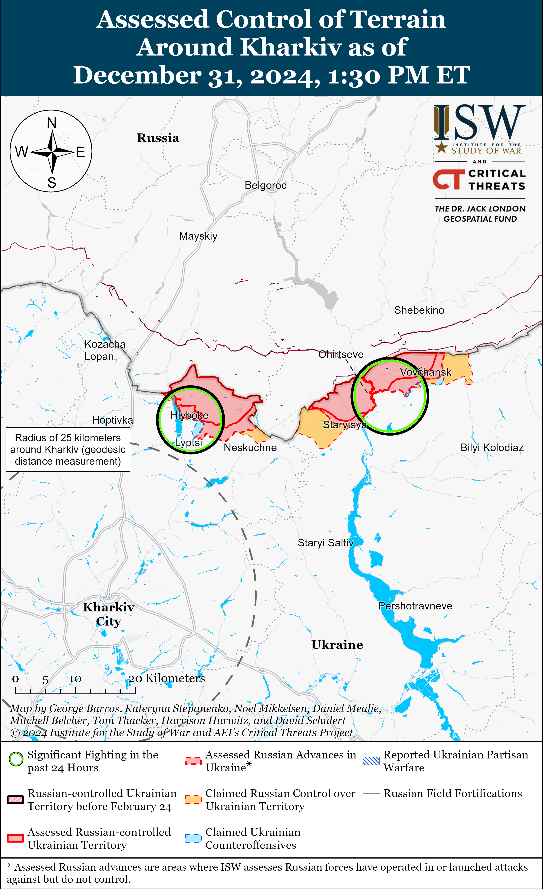](https://understandingwar.org/map/assessed-control-of-terrain-around-kharkiv-as-of-december-31-2024-130-pm-et/)

**Russian Subordinate Main Effort #2 – Luhansk Oblast (Russian objective: Capture the remainder of Luhansk Oblast and push westward into eastern Kharkiv Oblast and northern Donetsk Oblast)**

Ukrainian and Russian forces recently advanced northwest of Kreminna amid continued Russian offensive operations along the Kupyansk-Svatove-Kreminna line on December 31. Geolocated footage published on December 30 indicates that Ukrainian forces recently advanced in northern Terny (northwest of Kreminna).[38] Additional geolocated footage published on December 30 indicates that Russian forces recently advanced in southern Terny.[39] A Kremlin-affiliated milblogger claimed that Russian forces currently control 90 percent of Terny.[40] The Ukrainian Khortytsya Group of Forces reported on December 31 that Russian forces conducted a roughly reinforced platoon-sized mechanized assault near Nova Kruhlyakivka (west of Svatove).[41] Russian milbloggers claimed that poor weather conditions, including rain and fog, are complicating Russian operations along both banks of the Oskil River in the Kupyansk direction.[42] Russian forces attacked north of Kupyansk near Holubivka; southeast of Kupyansk near Zahryzove, Lozova, Stepova Novoselivka, and Kruhlyakivka; west of Svatove near Zeleny Hai, Kopanky, Pershotravneve, Novoyehorivka, and Nadiya; northwest of Kreminna near Makiivka, Ivanivka, Druzhelyubivka, Cherneshchyna, Novoserhiivka, and Terny; southwest of Kreminna near Dibrova and Hryhorivka; and west of Kreminna near Yampolivka on December 30 and 31.[43] Drone operators of the Russian 16th Spetsnaz Brigade (Russian General Staff’s Main Directorate [GRU]) are reportedly operating near Hrekivka (northwest of Kreminna).[44]

[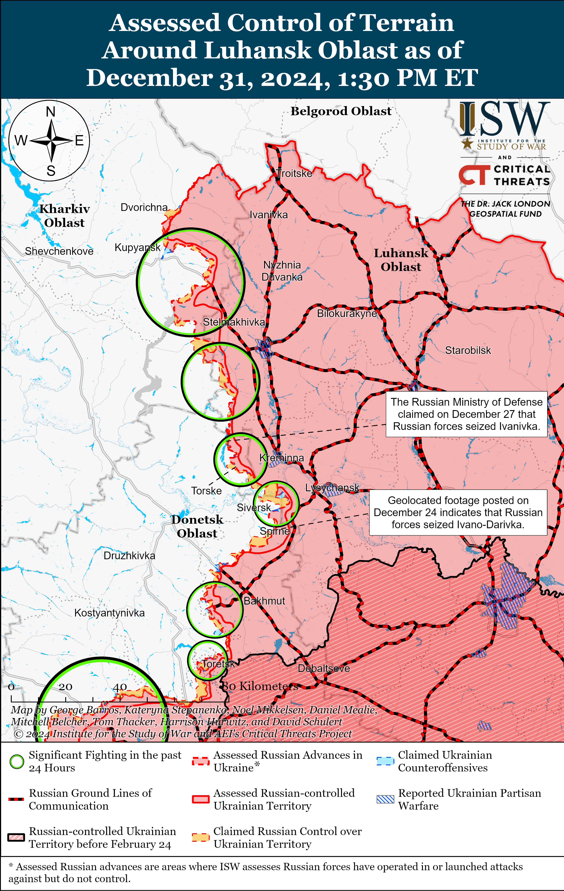](https://understandingwar.org/map/assessed-control-of-terrain-around-luhansk-oblast-as-of-december-31-2024-130-pm-et/)

**Russian Subordinate Main Effort #3 – Donetsk Oblast (Russian objective: Capture the entirety of Donetsk Oblast, the claimed territory of Russia’s proxies in Donbas)**

Russian forces recently advanced near Siversk amid continued offensive operations in the area on December 31. Geolocated footage published on December 24 indicates that Russian forces likely seized Ivano-Darivka (southeast of Siversk), and a Russian milblogger claimed that Russian forces seized the settlement.[45] A Russian milblogger claimed on December 31 that Russian forces are advancing towards a water reservoir just east of Siversk and that Russian forces advanced 900 meters along a railway south of Vyimka (southeast of Siversk).[46] ISW has not observed confirmation of these claims, however. The Ukrainian General Staff reported that Russian forces attacked northeast of Siversk near Bilohorivka on December 30 and 31.[47]

[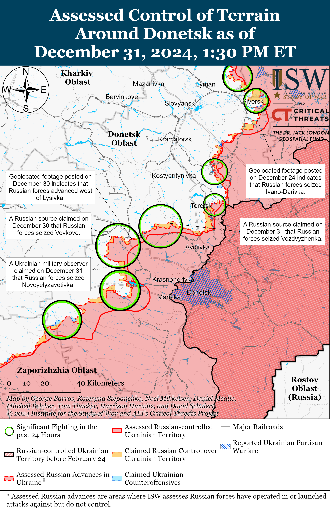](https://understandingwar.org/map/assessed-control-of-terrain-around-donetsk-as-of-december-31-2024-130-pm-et/)

Russian forces recently advanced in Chasiv Yar amid continued offensive operations in the area on December 31. Geolocated footage published on December 27 indicates that Russian forces advanced to Lermontova Street in northern Chasiv Yar.[48] Russian forces attacked within Chasiv Yar and south of Chasiv Yar near Stupochky, Predtechyne, and Bila Hora on December 30 and 31.[49] Drone operators of the Russian 98th Airborne (VDV) Division are reportedly operating in Chasiv Yar.[50]

[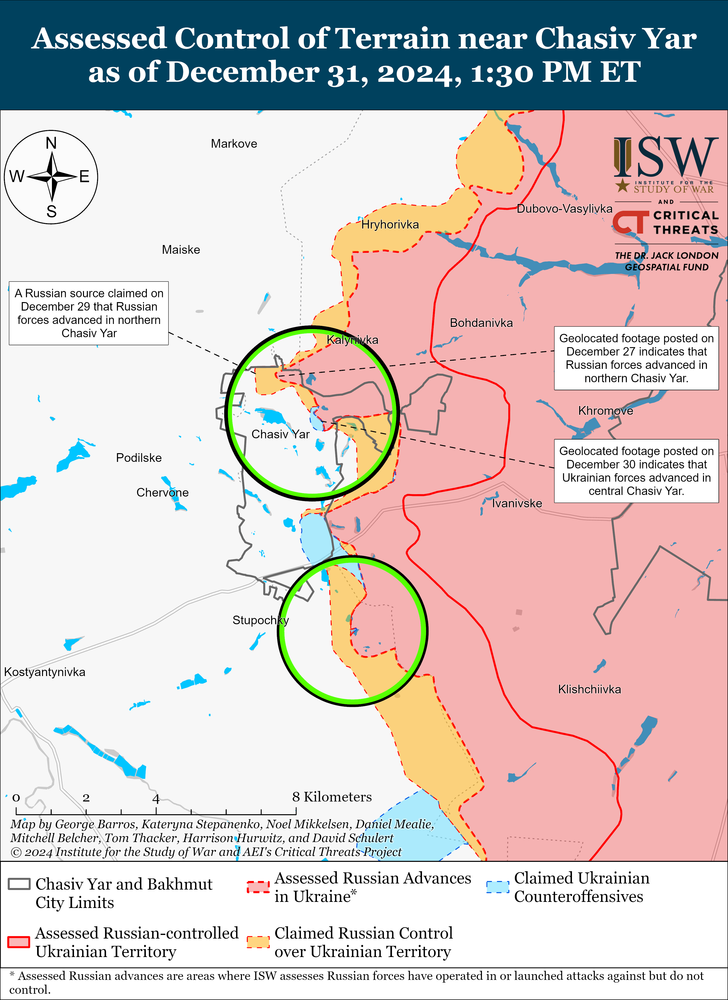](https://understandingwar.org/map/assessed-control-of-terrain-near-chasiv-yar-as-of-december-31-2024-130-pm-et/)

Russian forces continued offensive operations in the Toretsk direction on December 31 but did not make any confirmed advances. Russian forces attacked within Toretsk and west of Toretsk near Shcherbynivka on December 30 and 31.[51] The Ukrainian Khortytsia Group of Forces reported on December 31 that Russian forces conducted a roughly company-sized mechanized assault in the direction of Leonidivka (southwest of Toretsk).[52] Drone operators of the Russian 132nd Motorized Rifle Brigade (51st Combined Arms Army [CAA], formerly the 1st Donetsk People’s Republic [DNR] Army Corps [AC], Southern Military District [SMD]) are reportedly operating in Toretsk.[53]

[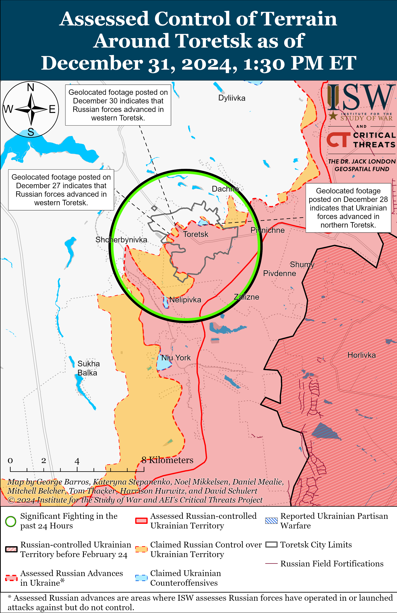](https://understandingwar.org/map/assessed-control-of-terrain-around-toretsk-as-of-december-31-2024-130-pm-et/)

Russian forces recently advanced in the Pokrovsk direction amid continued offensive operations in the area on December 31. Ukrainian military observer Kostyantyn Mashovets stated on December 31 that Russian forces seized Novoyelyzavetivka (southwest of Pokrovsk), and a Russian milblogger also claimed that Russian forces seized the settlement.[54] The Russian milblogger also claimed that Russian forces seized Vozdvyzhenka (northeast of Pokrovsk) and Vovkove (southwest of Pokrovsk) and advanced along the railway line toward Chunyshyne (south of Pokrovsk), but ISW has not observed confirmation of these claims.[55] Russian forces continued assaults northeast of Pokrovsk near Vozdvyzhenka, Myrolyubivka, Zelene Pole, and Promin; east of Pokrovsk near Myrnohrad; southeast of Pokrovsk near Zelene and Lysivka; south of Pokrovsk near Dachenske, Novyi Trud, Zelene, and Shevchenko; and southwest of Pokrovsk near Vovkove, Kotlyne, Solone, Pishchane, Novovasylivka, Novoolenivka, Novoyelyzavetivka, Novovasylivka, and Ukrainka on December 30 and 31.[56] Mashovets stated that elements of the Russian 329th and 80th tank regiments, 228th Motorized Rifle Regiment (all 90th Tank Division, 41st CAA, Central Military District [CMD]), 433rd Motorized Rifle Regiment (27th Motorized Rifle Division, 2nd CAA, CMD), and 74th and 55th motorized rifle brigades (41st CAA, CMD) are operating in the Pishchane-Kotlyne area and Novoolenivka-Novoyelyzavetivka area.[57]

Russian forces recently advanced into the western outskirts of the Kurakhivska Thermal Power Plant (TPP) just west of Kurakhove but it is unlikely that Russian forces have seized the entire TPP. Geolocated footage published on December 31 indicates that Russian forces recently advanced into the western outskirts of the TPP.[58] ISW assesses that Russian forces likely advanced into the western outskirts of the TPP from positions in Stari Terny (northwest of Kurakhove and the TPP), as it is unlikely that Ukrainian forces held significantly fortified positions along the western shore of the Kurakhivske Reservoir. A Russian source claimed on December 31 that Russian forces have encircled the Ukrainian grouping in the TPP and nearby industrial zone and another Russian milblogger claimed that Russian forces are advancing along the western shore of the reservoir, further indicating that Russian forces likely advanced along the western shore of the reservoir and hold positions in both the eastern and western outskirts of the TPP.[59] A Russian milblogger claimed that elements of the Russian 5th Motorized Rifle Brigade (51st CAA) participated in the advance into the TPP and insinuated that Russian forces advanced to the western outskirts of the TPP from the outskirts of Kurakhove and have seized most of the TPP.[60] Ukrainian forces may maintain positions in the central areas of the TPP, however, as the industrial area may provide sufficient defensible positions for Ukraine to maintain a limited defense in the area. ISW previously assessed that Russian forces may attempt to outflank Ukrainian positions at the TPP by advancing south from Stari Terny, and such an advance may complicate Ukraine’s ability to supply positions at the TPP and complicate future Ukrainian withdrawals from the TPP.[61]

[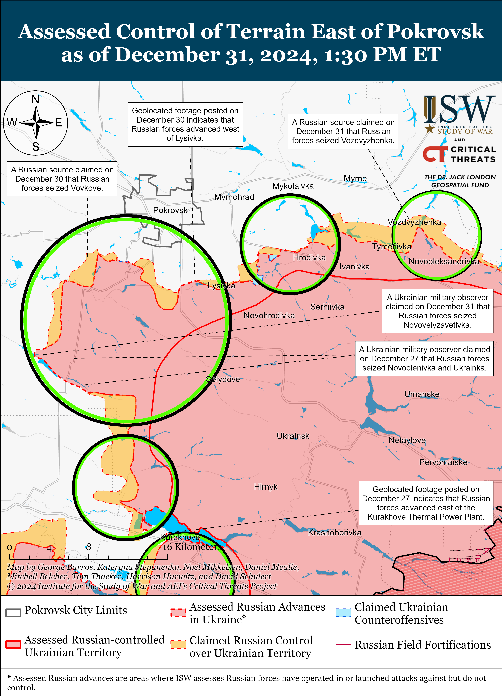](https://understandingwar.org/map/assessed-control-of-terrain-east-of-pokrovsk-as-of-december-31-2024-130-pm-et/)

Russian forces continued offensive operations in other areas of the Kurakhove direction on December 31. Mashovets stated that elements of the Russian 110th and 5th motorized rifle brigades (both of the 51st CAA) recently advanced from Stari Terny towards Shevchenko (both northwest of Kurakhove) and either partially or completely seized Shevchenko.[62] Russian milbloggers claimed that Russian forces are continuing to push Ukrainian forces from remaining positions in Kurakhove and have seized most of Shevchenko.[63] A Ukrainian servicemember operating in the Kurakhove direction reported that Russian forces have been using civilian vehicles to transport infantry to frontline positions over the last month and that Russian forces are removing the doors and rooves from these vehicles in order to transport more infantry and supplies.[64] Russian forces continued assaults in Kurakhove itself; northwest of Kurakhove near Petropavlivka, Ukrainka, Shevchenko, and Slovyanka; and west of Kurakhove near Dachne on December 30 and 31.[65] Elements of the Russian 255th Motorized Rifle Regiment (20th Motorized Rifle Division, 8th CAA, Southern Military District [SMD]) and 68th Tank Regiment (150th Motorized Rifle Division, 8th CAA) are reportedly operating near Kurakhove.[66]

Russian forces continued offensive operations in the Vuhledar direction on December 31 but did not make any confirmed gains. Ukraine’s Khortytsia Group of Forces reported on December 31 that Russian forces conducted offensive operations with an unspecified number of armored vehicles near Kostyantynopolske (northwest of Vuhledar).[67] Mashovets stated that elements of the Russian 110th and 5th motorized rifle brigades, 36th Motorized Rifle Brigade (29th CAA, Eastern Military District [EMD]), 114th Motorized Rifle Brigade (51st CAA), and 57th Motorized Rifle Brigade (5th CAA, EMD) are attempting to advance on Ulakly (northwest of Vuhledar) from Shevchenko in the north and Zelenivka from the south.[68] Russian forces continued attacking north of Vuhledar near Uspenivka and northwest of Vuhledar near Kostyantynopolske, Yantarne, Uspenivka, and Kostyantynopil on December 30 and 31.[69] Elements of the Russian 238th Artillery Brigade (8th CAA, Southern Military District [SMD]) are operating near Ulakly (northwest of Vuhledar).[70]

Russian forces continued offensive operations near Velyka Novosilka on December 31 but did not make any confirmed advances. Russian forces conducted offensive operations near Velyka Novosilka itself, northeast of Velyka Novosilka near Rozlyv, southwest of Velyka Novosilka near Novodarivka and Neskuchne, and west of Velyka Novosilka near Vremivka and Novosilka on December 30 and 31.[71] Drone operators of the Russian 14th Spetsnaz Brigade (Russian General Staff’s Main Directorate [GRU]) are reportedly operating near Velyka Novosilka.[72]

[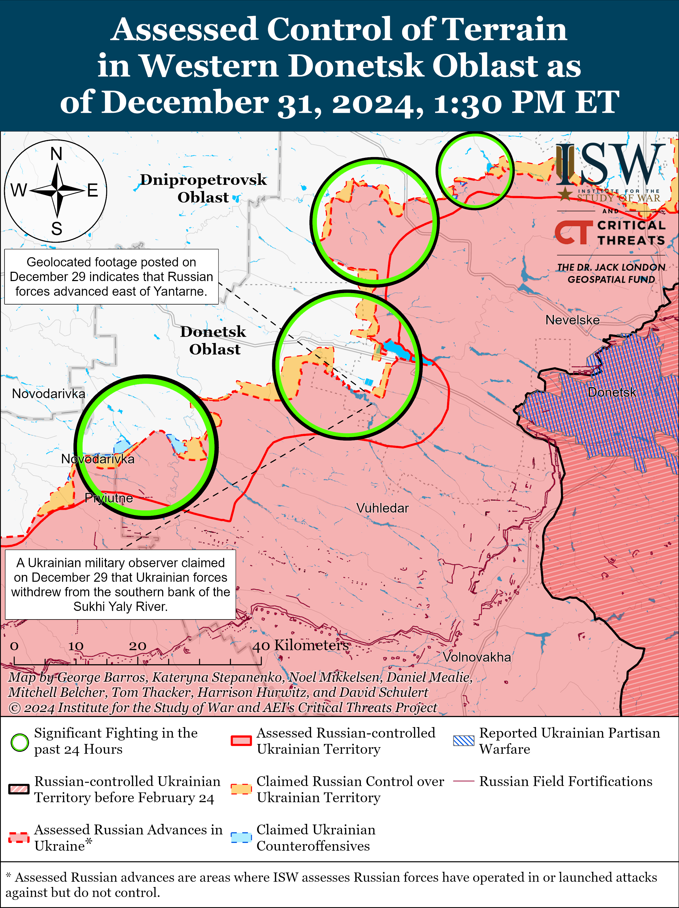](https://understandingwar.org/map/assessed-control-of-terrain-in-western-donetsk-oblast-as-of-december-31-2024-130-pm-et/)

**Russian Supporting Effort – Southern Axis (Russian objective: Maintain frontline positions and secure rear areas against Ukrainian strikes)**

Russian forces continued offensive operations in western Zaporizhia Oblast on December 30 and 31 but did not make any confirmed advances. A Russian milblogger claimed on December 30 that Ukrainian forces counterattacked in the Orikhiv direction (north of Robotyne).[73] Russian forces conducted offensive operations near Novoandriivka (northwest of Robotyne) on December 30 and 31.[74] Elements of the Russian BARS-Sarmat Detachment (Russian Combat Army Reserve) are reportedly operating in the Zaporizhia direction, and elements of the 42nd Motorized Rifle Division (58th Combined Arms Army, Southern Military District [SMD]) are reportedly operating near Orikhiv.[75]

[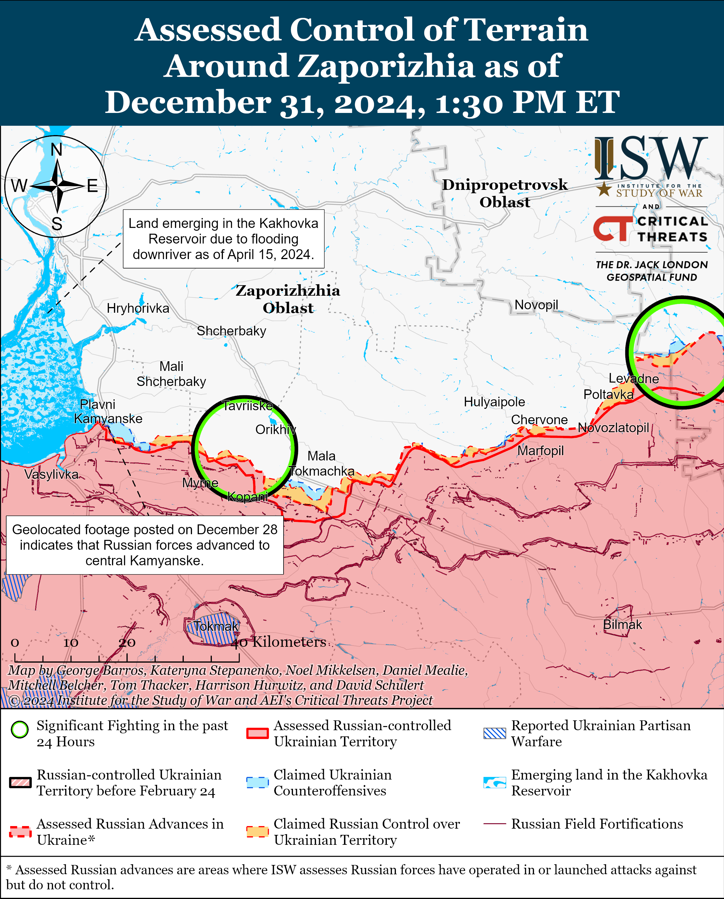](https://understandingwar.org/map/assessed-control-of-terrain-around-zaporizhia-as-of-december-31-2024-130-pm-et/)

Russian forces continued assaults in the Dnipro direction and on the islands in the Dnipro River Delta on December 30 and 31 but did not make any confirmed advances.[76]

[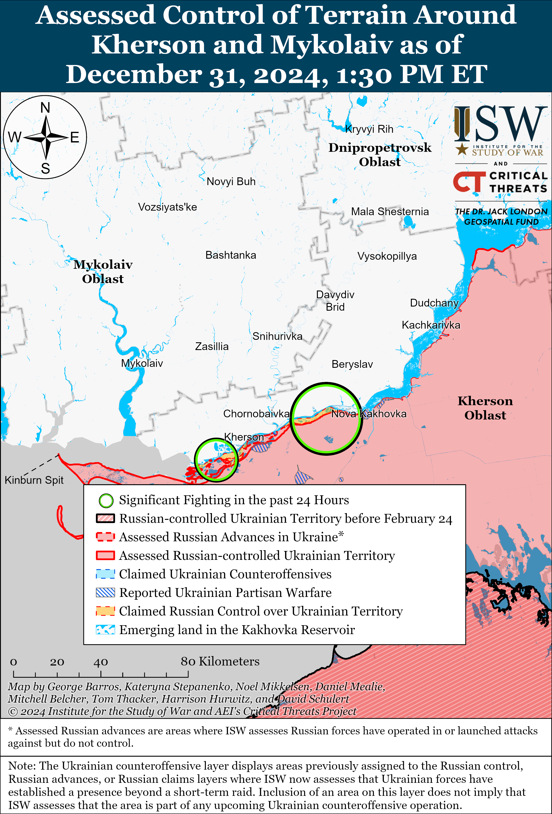](https://understandingwar.org/map/assessed-control-of-terrain-around-kherson-and-mykolaiv-as-of-december-31-2024-130-pm-et/)

**Russian Air, Missile, and Drone Campaign (Russian Objective: Target Ukrainian military and civilian infrastructure in the rear and on the frontline)**

Russian forces conducted a series of missile and drone strikes against Ukraine on the night of December 30 to 31. The Ukrainian Air Force reported on December 31 that Russian forces launched six Iskander-M/KN-23 ballistic missiles from Voronezh Oblast; one Kh-47M2 Kinzhal aeroballistic missile and eight Kh-22 cruise missiles from Tula Oblast; six Kh-69 cruise missiles from Belgorod Oblast; and 40 Shaheds and decoy drones from  Bryansk and Rostov oblasts and Primorsko-Akhtarsk, Krasnodar Krai.[77] The Ukrainian Air Force reported that Ukrainian forces downed one Kh-47M2 Kinzhal missile, five Kh-69 cruise missiles, and 16 Shaheds; that 24 decoy drones were “lost,” likely due to Ukrainian electronic warfare (EW) interference; and that Russian ballistic missiles struck targets in Kyiv and Sumy oblasts. Kyiv Oblast Military Administration reported on December 31 that Russian forces launched overnight missile and drone strikes targeting Kyiv Oblast, resulting in debris from downed drones damaging residential buildings.[78] Sumy Oblast Military Administration Head Volodymyr Artyukh reported on December 31 that Russian forces launched a morning strike involving 13 missiles against Shostka, Sumy Oblast that damaged infrastructure and three boiler rooms.[79]

The Ukrainian Air Force reported on December 31 that Ukrainian forces downed a total of 1,300 Russian missiles of various types, 11,200 strike drones, 3,200 reconnaissance drones, 40 fixed-wing aircraft, and six helicopters in 2024.[80] The Ukrainian Air Force reported that the Russian military increased its production and use of ballistic missiles against Ukraine in 2024.

**Russian Mobilization and Force Generation Efforts (Russian objective: Expand combat power without conducting general mobilization)**

The Russian government will deprive prisoners who volunteer to fight in Ukraine of a one-time enlistment bonus starting January 1, 2025, marking another instance of Russia trying to cut the mounting short- and long-term costs of war.[81] Russian Prime Minister Mikhail Mishustin signed a decree on December 28 that removed the right to a one-time enlistment bonus for Russian prisoners who sign military service contracts with the Russian Ministry of Defense (MoD). Some Russian federal subjects (regions) increased one-time enlistment payments to prisoners up to 505,000 rubles ($4,786) in Fall 2024, and Russian authorities have increased such monetary incentives in hopes of recruiting additional troops to serve in Ukraine.[82] The decree notably follows Russian President Vladimir Putin’s controversial decision to change Russian policy in November 2024 guaranteeing a one-time payment of three million rubles ($28,434) to all Russian servicemen who have been wounded in combat in Ukraine since March 2022 and instead offering only an enhanced compensation of four million rubles ($37,912) to servicemen officially deemed “heavily wounded” in combat.[83] The Russian government originally introduced high enlistment bonuses for prisoners and compensation for all wounded servicemen to incentivize military recruitment after Putin decided against declaring general mobilization in Spring 2022. Financial incentives became the key pillar of the Russian military’s recruitment campaign and personnel retention efforts over the past nearly three years, and ISW continues to assess that the reversal of such incentives indicates that this system is becoming economically unsustainable for the Kremlin.[84]

The Russian MoD’s Main Directorate of Combat Training is reportedly failing to properly train new recruits, likely because the Russian military command urgently needs reinforcements to support grinding assaults in eastern Ukraine. A Russian milblogger claimed that the MoD’s Main Directorate of Combat Training offers a recruit training program for less than 30 days instead of the recommended 45 days.[85] The milblogger observed that the training program and its timeframes are not mandatory and that Russian Defense Minister Andrei Belousov has not issued a decree formalizing a training program for recruits in order to avoid launching new bureaucratic processes. The milblogger noted that the lack of a formalized training program creates an environment in which training varies based on the orders of individual grouping of forces (GOF) commanders. The milblogger added that on average Russian servicemen receive about 14 to 16 days of training and that the amount of time allocated for training depends on the military command’s deadline for reconstituting units and preparations for offensives. The milblogger noted that Russian units along the frontline typically look like a combination of poorly trained infantry, heavily damaged equipment, a lack of junior commanders, and greatly reduced planning capabilities.

The milblogger’s account differs dramatically from the Russian MoD’s description of the Russian Black Sea Fleet’s naval infantry training program, which Russian Defense Minister Andrei Belousov inspected on December 31.[86] Belousov visited an unspecified Southern Military District (SMD) training ground where Russian recruits supposedly receive tactical fire, medical, engineering, and combat coordination training under the leadership of Russian officers with prior combat experience in Ukraine. BSF Commander Vice-Admiral Sergei Pinchuk told Belousov that recruits also receive specialized training such as using and repelling unmanned aerial systems (UAVs). Belousov also toured a UAV lab located at the training ground used for training UAV crews and testing new equipment.

**Russian Technological Adaptations (Russian objective: Introduce technological innovations to optimize systems for use in Ukraine)**

Nothing significant to report.

**Activities in Russian-occupied areas (Russian objective: Consolidate administrative control of annexed areas; forcibly integrate Ukrainian citizens into Russian sociocultural, economic, military, and governance systems)**

*ISW is not reporting on activities in Russian-occupied areas today.*

**Significant activity in Belarus (Russian efforts to increase its military presence in Belarus and further integrate Belarus into Russian-favorable frameworks)**

Nothing significant to report.

**Note: ISW does not receive any classified material from any source, uses only publicly available information, and draws extensively on Russian, Ukrainian, and Western reporting and social media as well as commercially available satellite imagery and other geospatial data as the basis for these reports. References to all sources used are provided in the endnotes of each update.**

[1] https://t.me/osirskiy/1012

[2] https://understandingwar.org/backgrounder/russian-offensive-campaign-assessment-december-5-2024

[3] https://understandingwar.org/backgrounder/russian-offensive-campaign-assessment-december-24-2024

[4] https://understandingwar.org/backgrounder/russian-offensive-campaign-assessment-december-5-2024 ; https://x.com/DefenceHQ/status/1864580705948184870 ; https://t.me/GeneralStaffZSU/19018 ; https://t.me/GeneralStaffZSU/19032 ; https://t.me/GeneralStaffZSU/19056 ; https://t.me/GeneralStaffZSU/19100 ; https://t.me/GeneralStaffZSU/19114 ; https://t.me/GeneralStaffZSU/19141 ; https://t.me/GeneralStaffZSU/19160 ; https://t.me/GeneralStaffZSU/19179 ; https://t.me/GeneralStaffZSU/19196 ; https://t.me/GeneralStaffZSU/19232 ; https://t.me/GeneralStaffZSU/19246 ; https://t.me/GeneralStaffZSU/19258 ; https://t.me/GeneralStaffZSU/19282 ; https://t.me/GeneralStaffZSU/19308 ; https://t.me/GeneralStaffZSU/19332 ; https://t.me/GeneralStaffZSU/19351 ; https://t.me/GeneralStaffZSU/19379 ; https://t.me/GeneralStaffZSU/19389 ; https://t.me/GeneralStaffZSU/19425 ; https://t.me/GeneralStaffZSU/19445 ; https://t.me/GeneralStaffZSU/19483 ; https://t.me/GeneralStaffZSU/19507 ; https://t.me/GeneralStaffZSU/19521 ; https://t.me/GeneralStaffZSU/19555 ; https://t.me/GeneralStaffZSU/19592 ; https://t.me/GeneralStaffZSU/19602 ; https://t.me/GeneralStaffZSU/19617 ; https://t.me/GeneralStaffZSU/19636 ; https://t.me/GeneralStaffZSU/19651 ; https://t.me/GeneralStaffZSU/19675 ; https://t.me/GeneralStaffZSU/19700

[5] https://understandingwar.org/backgrounder/russian-offensive-campaign-assessment-december-5-2024

[6] https://t.me/osirskiy/1012

[7] https://understandingwar.org/backgrounder/how-delays-western-aid-gave-russia-initiative-ukrainian-counteroffensive-kharkiv ; https://understandingwar.org/backgrounder/ukrainian-defense-pokrovsk-has-compelled-russia-change-its-approach-eastern-ukraine

[8] https://understandingwar.org/backgrounder/ukrainian-defense-pokrovsk-has-compelled-russia-change-its-approach-eastern-ukraine

[9] https://understandingwar.org/backgrounder/ukrainian-defense-pokrovsk-has-compelled-russia-change-its-approach-eastern-ukraine

[10] https://understandingwar.org/backgrounder/russian-offensive-campaign-assessment-december-26-2024 ;

[11] https://understandingwar.org/backgrounder/ukrainian-defense-pokrovsk-has-compelled-russia-change-its-approach-eastern-ukraine

[12] https://isw.pub/UkrWar122324

[13] https://isw.pub/UkrWar122324

[14] https://understandingwar.org/backgrounder/russian-offensive-campaign-assessment-december-23-2024

[15] https://understandingwar.org/backgrounder/russian-offensive-campaign-assessment-november-16-2024

[16] https://understandingwar.org/backgrounder/russian-offensive-campaign-assessment-june-7-2024

[17] https://www.ural56 dot ru/news/736043/ ; https://www.kp dot ru/daily/27649/5032481/ ; https://expert dot ru/news/vladimir-putin-v-novogodnem-obrashchenii-zayavil-chto-vse-budet-khorosho/ ; https://t.me/tass\_agency/294220 ; https://meduza dot io/news/2024/12/31/putin-vystupil-s-novogodnim-obrascheniem

[18] https://understandingwar.org/backgrounder/russian-offensive-campaign-assessment-december-21-2024

[19] http://en.kremlin dot ru/events/president/news/73775; http://www.en.kremlinru/cata dot log/persons/632/events/70823

[20] https://understandingwar.org/backgrounder/russian-offensive-campaign-assessment-december-24-2024; http://www.en.kremlin dot ru/events/president/transcripts/74292; http://en.kremlin dot ru/events/administration/75579; https://novayagazeta dot eu/articles/2024/12/11/heroes-of-their-time-en

[21] https://www.rbc dot ru/rbcfreenews/66b5083e9a7947500d70e9cb; https://nao24 dot ru/obshestvo/43175-prezident-rossii-podpisal-ukaz-o-vyplatah-uchastnikam-svo.html; https://realnoevremya dot ru/news/314559-putin-podpisal-zakon-o-zaschite-vyplat-za-uchastie-v-svo-pri-bankrotstve

[22] https://t.me/DIUkraine/5127 ; https://gur.gov dot ua/content/istorychnyi-udar-voiny-hur-vpershe-u-sviti-znyshchyly-povitrianu-tsil-za-dopomohoiu-morskoho-drona-magura-v5.html ; https://x.com/GirkinGirkin/status/1874003631730811084 ; https://x.com/GirkinGirkin/status/1873991746255716425

[23] https://t.me/razvozhaev/9464

[24] https://t.me/rybar/66809; https://t.me/rybar/66811; https://t.me/rusich\_army/19743

[25] https://www.facebook.com/OperationalCommandSouth/posts/pfbid0hmLex6GGe9g3JHR27W77rghCrCehe6p8rruPAA4Jmzd3oFcfsRU1fohaTvnUTfrjl; https://t.me/Crimeanwind/72467

[26] https://t.me/GeneralStaffZSU/19715

[27] https://t.me/tass\_agency/294167 ; https://t.me/tass\_agency/294168

[28] https://suspilne dot media/914753-ukrainski-droni-atakuvali-naftobazu-v-smolenskij-oblasti-rf/; https://t.me/anohin67/4838 ; https://www.severreal dot org/a/neftebaza-zagorelas-v-smolenskoy-oblasti-iz-za-ataki-bpla/33258877.html

[29] https://t.me/astrapress/71487

[30] https://t.me/Hinshtein/8926

[31] https://t.me/kiber\_boroshno/10866; https://t.me/ukr\_sof/1334; https://t.me/WarArchive\_ua/24180

[32] https://x.com/ZoamSc2/status/1873878181914304693; https://x.com/ZoamSc2/status/1873878184065953873; https://t.me/BoogeYmanZ/173

[33] https://t.me/DnevnikDesantnika/21787; https://t.me/dva\_majors/61486

[34] https://t.me/DnevnikDesantnika/21787

[35] https://t.me/mod\_russia/47492; https://t.me/Tsaplienko/66356 ;  https://x.com/666\_mancer/status/1874041361634406515; https://t.me/rusich\_army/19744 ; https://t.me/boris\_rozhin/149747; https://t.me/belarusian\_silovik/47144 https://t.me/NeoficialniyBeZsonoV/42682

[36] https://t.me/DnevnikDesantnika/21771

[37] https://t.me/Sladkov\_plus/12183 ; https://www.facebook.com/GeneralStaff.ua/posts/pfbid021FMYrdLaiN4WxKPETedj4GDY9za1xsdgY9fU23DuxbaBJmCg2cSS7yDEMJhrytFol ; https://www.facebook.com/GeneralStaff.ua/posts/pfbid0NUvFea2KD3h8yzLTjEdruXe53k8ZSUcHgXkJYRz7u5i61RXkz8K41kqPQcKZ8ko4l ; https://www.facebook.com/GeneralStaff.ua/posts/pfbid0EgF3vWeV7pC96jZBTmdiNMEiTUkM3tbNy5xPLZwb6BGNpPMcAWfVdtku8vG6fmHGl ; https://t.me/otukharkiv/3320 ; https://t.me/Khortytsky\_wind/3885

[38] https://x.com/moklasen/status/1873835253967839582; https://x.com/GirkinGirkin/status/1873818727994835060

[39] https://x.com/moklasen/status/1873836298127237573; https://x.com/GirkinGirkin/status/1873818727994835060; https://t.me/creamy\_caprice/7972

[40] https://t.me/rybar/66806; https://t.me/boris\_rozhin/149730

[41] https://t.me/Khortytsky\_wind/3885

[42] https://t.me/dva\_majors/61486; https://t.me/Sladkov\_plus/12183

[43] https://www.facebook.com/GeneralStaff.ua/posts/pfbid021FMYrdLaiN4WxKPETedj4GDY9za1xsdgY9fU23DuxbaBJmCg2cSS7yDEMJhrytFol; https://www.facebook.com/GeneralStaff.ua/posts/pfbid0NUvFea2KD3h8yzLTjEdruXe53k8ZSUcHgXkJYRz7u5i61RXkz8K41kqPQcKZ8ko4l; https://www.facebook.com/GeneralStaff.ua/posts/pfbid0EgF3vWeV7pC96jZBTmdiNMEiTUkM3tbNy5xPLZwb6BGNpPMcAWfVdtku8vG6fmHGl; https://t.me/Khortytsky\_wind/3885; https://www.facebook.com/GeneralStaff.ua/posts/pfbid021FMYrdLaiN4WxKPETedj4GDY9za1xsdgY9fU23DuxbaBJmCg2cSS7yDEMJhrytFol; https://www.facebook.com/GeneralStaff.ua/posts/pfbid0NUvFea2KD3h8yzLTjEdruXe53k8ZSUcHgXkJYRz7u5i61RXkz8K41kqPQcKZ8ko4l; https://www.facebook.com/GeneralStaff.ua/posts/pfbid0EgF3vWeV7pC96jZBTmdiNMEiTUkM3tbNy5xPLZwb6BGNpPMcAWfVdtku8vG6fmHGl; https://t.me/Khortytsky\_wind/3885; https://t.me/dva\_majors/61486

[44] https://t.me/Secrets\_of\_Vinakos/4695

[45] https://t.me/creamy\_caprice/7973; https://t.me/rubpak54/237;  https://t.me/voenkorKotenok/61138

[46] https://t.me/DnevnikDesantnika/21780

[47] https://www.facebook.com/GeneralStaff.ua/posts/pfbid021FMYrdLaiN4WxKPETedj4GDY9za1xsdgY9fU23DuxbaBJmCg2cSS7yDEMJhrytFol;  https://www.facebook.com/GeneralStaff.ua/posts/pfbid0NUvFea2KD3h8yzLTjEdruXe53k8ZSUcHgXkJYRz7u5i61RXkz8K41kqPQcKZ8ko4l; https://www.facebook.com/GeneralStaff.ua/posts/pfbid0EgF3vWeV7pC96jZBTmdiNMEiTUkM3tbNy5xPLZwb6BGNpPMcAWfVdtku8vG6fmHGl

[48] https://t.me/creamy\_caprice/7976; https://x.com/Bielitzling/status/1874125554938724459; https://t.me/slovianskbrigade/518

[49] https://www.facebook.com/GeneralStaff.ua/posts/pfbid021FMYrdLaiN4WxKPETedj4GDY9za1xsdgY9fU23DuxbaBJmCg2cSS7yDEMJhrytFol; https://www.facebook.com/GeneralStaff.ua/posts/pfbid0NUvFea2KD3h8yzLTjEdruXe53k8ZSUcHgXkJYRz7u5i61RXkz8K41kqPQcKZ8ko4l;  https://www.facebook.com/GeneralStaff.ua/posts/pfbid0EgF3vWeV7pC96jZBTmdiNMEiTUkM3tbNy5xPLZwb6BGNpPMcAWfVdtku8vG6fmHGl; https://t.me/Khortytsky\_wind/3885; https://t.me/wargonzo/24034

[50] https://t.me/DnevnikDesantnika/21771

[51] https://www.facebook.com/GeneralStaff.ua/posts/pfbid021FMYrdLaiN4WxKPETedj4GDY9za1xsdgY9fU23DuxbaBJmCg2cSS7yDEMJhrytFol; https://www.facebook.com/GeneralStaff.ua/posts/pfbid0NUvFea2KD3h8yzLTjEdruXe53k8ZSUcHgXkJYRz7u5i61RXkz8K41kqPQcKZ8ko4l;  https://www.facebook.com/GeneralStaff.ua/posts/pfbid0EgF3vWeV7pC96jZBTmdiNMEiTUkM3tbNy5xPLZwb6BGNpPMcAWfVdtku8vG6fmHGl; https://t.me/Khortytsky\_wind/3885

[52] https://t.me/Khortytsky\_wind/3885

[53] https://t.me/RVvoenkor/83668; https://t.me/nm\_dnr/13199

[54] https://t.me/zvizdecmanhustu/2459 ; https://t.me/voenkorKotenok/61134

[55] https://t.me/voenkorKotenok/61134; https://t.me/boris\_rozhin/149649 ; https://t.me/voenkorKotenok/61130

[56] https://www.facebook.com/GeneralStaff.ua/posts/pfbid021FMYrdLaiN4WxKPETedj4GDY9za1xsdgY9fU23DuxbaBJmCg2cSS7yDEMJhrytFol ; https://www.facebook.com/GeneralStaff.ua/posts/pfbid0NUvFea2KD3h8yzLTjEdruXe53k8ZSUcHgXkJYRz7u5i61RXkz8K41kqPQcKZ8ko4l ; https://www.facebook.com/GeneralStaff.ua/posts/pfbid0EgF3vWeV7pC96jZBTmdiNMEiTUkM3tbNy5xPLZwb6BGNpPMcAWfVdtku8vG6fmHGl ; https://t.me/Khortytsky\_wind/3885 ; https://t.me/DnevnikDesantnika/21782

[57] https://t.me/zvizdecmanhustu/2458

[58] https://t.me/creamy\_caprice/7977; https://t.me/SolovievLive/306365

[59] https://t.me/vrogov/18500 ; https://t.me/RVvoenkor/83635

[60] https://t.me/z\_arhiv/30327

[61] https://isw.pub/UkrWar122624

[62] https://t.me/zvizdecmanhustu/2458 ; https://www.facebook.com/pashtetof/posts/pfbid02Zr7LnehoR4XjbuAfqU5XqfxoxvrV5zJrwN4B6Q5FBPGuxmSHtNhqa4ZfVsJrjowal

[63] https://t.me/DnevnikDesantnika/21785 ; https://t.me/RVvoenkor/83635 ; https://t.me/voenkorKotenok/61132

[64] https://armyinform.com dot ua/2024/12/30/pid-kurahovym-vorog-vlashtovuye-shturmy-v-styli-bozhevilnyj-vanka/

[65] https://www.facebook.com/GeneralStaff.ua/posts/pfbid021FMYrdLaiN4WxKPETedj4GDY9za1xsdgY9fU23DuxbaBJmCg2cSS7yDEMJhrytFol ; https://www.facebook.com/GeneralStaff.ua/posts/pfbid0NUvFea2KD3h8yzLTjEdruXe53k8ZSUcHgXkJYRz7u5i61RXkz8K41kqPQcKZ8ko4l ; https://www.facebook.com/GeneralStaff.ua/posts/pfbid0EgF3vWeV7pC96jZBTmdiNMEiTUkM3tbNy5xPLZwb6BGNpPMcAWfVdtku8vG6fmHGl ; https://t.me/Khortytsky\_wind/3885

[66] https://t.me/RVvoenkor/83629 ; https://t.me/RVvoenkor/83628

[67] https://t.me/Khortytsky\_wind/3885

[68] https://t.me/zvizdecmanhustu/2458 ; https://www.facebook.com/pashtetof/posts/pfbid02Zr7LnehoR4XjbuAfqU5XqfxoxvrV5zJrwN4B6Q5FBPGuxmSHtNhqa4ZfVsJrjowal

[69] https://www.facebook.com/GeneralStaff.ua/posts/pfbid021FMYrdLaiN4WxKPETedj4GDY9za1xsdgY9fU23DuxbaBJmCg2cSS7yDEMJhrytFol ; https://www.facebook.com/GeneralStaff.ua/posts/pfbid0NUvFea2KD3h8yzLTjEdruXe53k8ZSUcHgXkJYRz7u5i61RXkz8K41kqPQcKZ8ko4l ; https://www.facebook.com/GeneralStaff.ua/posts/pfbid0EgF3vWeV7pC96jZBTmdiNMEiTUkM3tbNy5xPLZwb6BGNpPMcAWfVdtku8vG6fmHGl ; https://t.me/boris\_rozhin/149730 ; https://t.me/boris\_rozhin/149659 ; https://t.me/DnevnikDesantnika/21785 ; https://t.me/RVvoenkor/83635

[70] https://t.me/nm\_dnr/13198

[71]https://www.facebook.com/GeneralStaff.ua/posts/pfbid021FMYrdLaiN4WxKPETedj4GDY9za1xsdgY9fU23DuxbaBJmCg2cSS7yDEMJhrytFol ; https://www.facebook.com/GeneralStaff.ua/posts/pfbid0NUvFea2KD3h8yzLTjEdruXe53k8ZSUcHgXkJYRz7u5i61RXkz8K41kqPQcKZ8ko4l ; https://www.facebook.com/GeneralStaff.ua/posts/pfbid0EgF3vWeV7pC96jZBTmdiNMEiTUkM3tbNy5xPLZwb6BGNpPMcAWfVdtku8vG6fmHGl ; https://www.facebook.com/OperationalCommandSouth/posts/pfbid0hmLex6GGe9g3JHR27W77rghCrCehe6p8rruPAA4Jmzd3oFcfsRU1fohaTvnUTfrjl

[72] https://t.me/voin\_dv/12556

[73] https://t.me/dva\_majors/61486

[74]https://www.facebook.com/GeneralStaff.ua/posts/pfbid021FMYrdLaiN4WxKPETedj4GDY9za1xsdgY9fU23DuxbaBJmCg2cSS7yDEMJhrytFol ; https://www.facebook.com/GeneralStaff.ua/posts/pfbid0NUvFea2KD3h8yzLTjEdruXe53k8ZSUcHgXkJYRz7u5i61RXkz8K41kqPQcKZ8ko4l ; https://www.facebook.com/GeneralStaff.ua/posts/pfbid0EgF3vWeV7pC96jZBTmdiNMEiTUkM3tbNy5xPLZwb6BGNpPMcAWfVdtku8vG6fmHGl ; https://www.facebook.com/OperationalCommandSouth/posts/pfbid0hmLex6GGe9g3JHR27W77rghCrCehe6p8rruPAA4Jmzd3oFcfsRU1fohaTvnUTfrjl

[75] https://t.me/rogozin\_do/6587 ; https://t.me/RVvoenkor/83634

[76]https://www.facebook.com/GeneralStaff.ua/posts/pfbid0NUvFea2KD3h8yzLTjEdruXe53k8ZSUcHgXkJYRz7u5i61RXkz8K41kqPQcKZ8ko4l ; https://www.facebook.com/OperationalCommandSouth/posts/pfbid0hmLex6GGe9g3JHR27W77rghCrCehe6p8rruPAA4Jmzd3oFcfsRU1fohaTvnUTfrjl

[77] https://t.me/kpszsu/25836

[78] https://t.me/kyivoda/23985

[79]  https://armyinform.com dot ua/2024/12/31/udar-po-shostczi-rosiyany-zastosuvaly-13-raket/

[80] https://t.me/kpszsu/25847

[81] http://publication.pravo.gov dot ru/document/0001202412300021 ; https://www.kommersant dot ru/amp/7420623 ; https://meduza dot io/news/2024/12/31/pravitelstvo-rf-otmenilo-edinovremennye-vyplaty-zaklyuchennym-podpisavshim-kontrakt-s-minoborony-rf; https://www.gazeta dot ru/army/news/2024/12/31/24753260.shtml; https://t.me/idelrealii/39334 ; https://t.me/severrealii/29005; https://t.me/astrapress/71493; https://t.me/mobilizationnews/21561  ; https://t.me/sotaproject/92044

[82] https://understandingwar.org/backgrounder/russian-offensive-campaign-assessment-september-23-2024

[83] https://understandingwar.org/backgrounder/russian-offensive-campaign-assessment-november-14-2024

[84] https://understandingwar.org/backgrounder/russian-offensive-campaign-assessment-november-14-2024

[85] https://t.me/philologist\_zov/1852

[86] https://t.me/mod\_russia/47447
